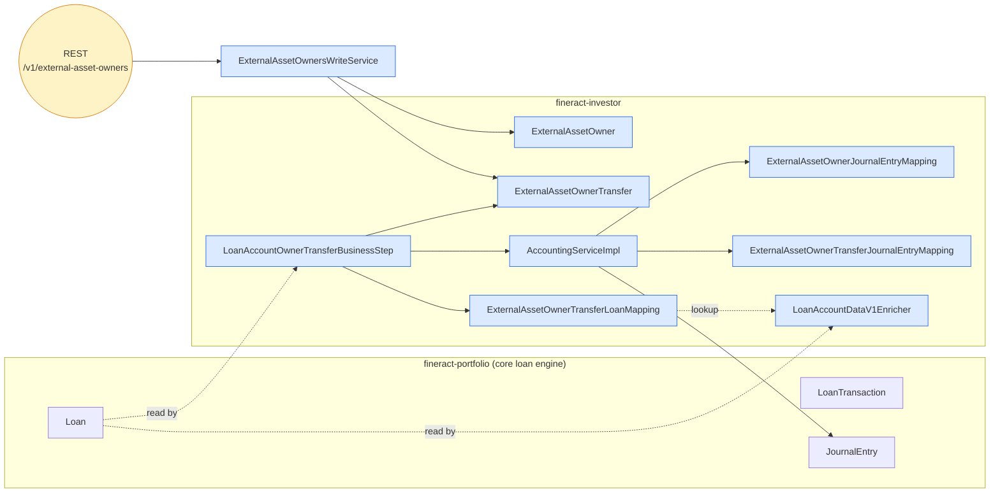

The `fineract-investor` module is Apache Fineract's **asset externalisation** subsystem. It models the business reality that a bank does not always carry every loan on its own balance sheet for the entire term: portfolios get sold to outside investors (securitisation vehicles, factoring counterparties, warehouse-line lenders), held by them for a period, and sometimes bought back. The module records *who currently owns each loan*, when ownership changed hands, what was paid, and how the move was reflected in the general ledger — without forking the core loan engine. The loan continues to amortise, accrue interest and post repayments through the same `fineract-portfolio` code path; the investor module sits *alongside*, tagging each loan with its current external owner and producing the matching journal entries.

This module is **optional**. It is gated by a Spring `@Conditional(InvestorModuleIsEnabledCondition.class)` annotation on its REST resources and COB business step, which reads `fineract.module.investor.enabled` from `FineractProperties`. When disabled, none of the beans are loaded, no REST paths are registered, and the COB pipeline runs without the ownership-transfer step.

## The business problem

Imagine a microfinance bank that originates 10,000 short-term consumer loans per month. The bank doesn't want all of those receivables on its own balance sheet — it sells tranches to a securitisation SPV every Friday at a *purchase price ratio* (e.g. `1.02` means the investor pays 102% of outstanding principal, locking in a discount or premium). The investor takes the cashflow risk for some period; if the borrower defaults or fully repays, the investor wins or loses. Later the bank may *buy back* a transferred loan — typically when it goes overpaid, charged‑off or matures — at which point the asset returns to the bank's books.

Fineract's investor module captures exactly this:

| Concept | Tracked by | Notes |
| --- | --- | --- |
| The investor (legal counterparty) | `ExternalAssetOwner` + `m_external_asset_owner` table | Identified by a free-form `external_id`; not a Fineract user or office. |
| Each ownership change of a single loan | `ExternalAssetOwnerTransfer` + `m_external_asset_owner_transfer` | One row per *state change* — the active row has `effective_date_to = 9999-12-31`. |
| Snapshot of loan balances at sale | `ExternalAssetOwnerTransferDetails` + `m_external_asset_owner_transfer_details` | Principal/interest/fees/penalties/overpaid frozen at settlement. |
| The current owner of a live loan | `ExternalAssetOwnerTransferLoanMapping` + `m_external_asset_owner_transfer_loan_mapping` | One mapping row per loan-with-an-active-owner. |
| Journal entries posted on transfer | `ExternalAssetOwnerJournalEntryMapping`, `ExternalAssetOwnerTransferJournalEntryMapping` | Link `acc_gl_journal_entry` rows back to both the transfer and the owner. |
| Profit / loss attribution | Owner ↔ journal-entry mapping plus `purchase_price_ratio` | Used by reads such as `GET /external-asset-owners/owners/external-id/{ownerExternalId}/journal-entries`. |
| Per-product transfer policy | `ExternalAssetOwnerLoanProductAttributes` + `m_external_asset_owner_loan_product_attribute` | E.g. `SETTLEMENT_MODEL = DELAYED_SETTLEMENT` enables the two-step sale via an intermediate owner. |

## Where the code lives

Everything is in a single Gradle sub-module:

```
fineract-investor/
└── src/main/java/org/apache/fineract/investor/
    ├── accounting/journalentry/service/   # GL-posting helper (InvestorAccountingHelper)
    ├── api/                               # JAX-RS resources, Swagger schemas, search delegate
    ├── cob/loan/                          # LoanAccountOwnerTransferBusinessStep (EOD step)
    ├── config/                            # Module-enabled condition + Spring beans
    ├── data/                              # DTOs, status/sub-status enums, request bodies
    │   ├── attribute/                     # Loan-product attribute enum (SETTLEMENT_MODEL)
    │   └── request/                       # ExternalAssetOwnerRequest
    ├── domain/                            # JPA entities + Spring-Data repositories
    │   └── search/                        # Custom search repository for transfers
    ├── enricher/                          # Avro event enrichers (LoanAccountDataV1Enricher, …)
    ├── exception/                         # Domain-specific 4xx exceptions + JAX-RS mappers
    ├── internal/                          # InternalAPIForTesting (placeholder)
    ├── serialization/                     # ExternalAssetOwnerValidator
    └── service/                           # Command handlers, write/read services, helpers
        ├── search/                        # Search request DTO + service + mapper
        └── serialization/serializer/investor/  # InvestorBusinessEventSerializer for Avro
```

Build file: `fineract-investor/build.gradle`. The module depends on `fineract-avro-schemas:buildJavaSdk` so that the enrichers can populate Avro event payloads (`LoanAccountDataV1`, `LoanChargeDataV1`, `LoanTransactionDataV1`, …) with the active owner's external id before publication.



## Lifecycle in one paragraph

A user POSTs `/v1/external-asset-owners/transfers/loans/{loanId}?command=sale` with `ownerExternalId`, `transferExternalId`, `settlementDate` and `purchasePriceRatio`. `ExternalAssetOwnersWriteServiceImpl.saleLoanByLoanId` validates the loan, validates that no overlapping transfer exists, looks up or fails the `ExternalAssetOwner` by external id, and writes a single `ExternalAssetOwnerTransfer` row in status `PENDING` with `settlement_date = <future date>` and `effective_date_to = 9999-12-31`. Nothing has actually moved yet — the loan is still owned internally. On the morning the COB job runs *on* `settlement_date`, `LoanAccountOwnerTransferBusinessStep.execute(loan)` picks the loan up, finds the pending transfer, asks `LoanTransferabilityService` whether the loan is sellable (balance > 0, not in a blocking state). If yes, it expires the pending row, inserts a new row in status `ACTIVE` with `effective_date_from = settlement_date + 1`, creates an `ExternalAssetOwnerTransferLoanMapping` and asks `AccountingServiceImpl` to credit the loan-portfolio / receivable accounts and debit the `ASSET_TRANSFER` financial-activity account, attributing each journal line to the new owner. If no, it inserts a `DECLINED` row with sub-status `BALANCE_ZERO` or `BALANCE_NEGATIVE`. A buyback later follows the same shape in reverse.

## The status state machine

`ExternalTransferStatus` has eight values that encode both the lifecycle stage and whether an intermediate owner is involved:

```mermaid
stateDiagram-v2
    [*] --> PENDING : sale requested
    [*] --> PENDING_INTERMEDIATE : intermediarySale<br/>(delayed-settlement product)
    PENDING --> ACTIVE : COB on settlement date<br/>+ transferable
    PENDING --> DECLINED : COB on settlement date<br/>+ balance 0 / negative
    PENDING_INTERMEDIATE --> ACTIVE_INTERMEDIATE : COB on settlement date
    ACTIVE --> BUYBACK : buyback requested
    ACTIVE_INTERMEDIATE --> ACTIVE : second-leg sale<br/>(delayed settlement)
    BUYBACK --> CANCELLED : COB; no matching ACTIVE found<br/>(sub=UNSOLD)
    BUYBACK --> [*] : COB; matched & expired
    PENDING --> CANCELLED : explicit cancel<br/>OR same-day sale+buyback (sub=SAMEDAY_TRANSFERS)
```



The companion enum `ExternalTransferSubStatus` records *why* a non-terminal state moved to `DECLINED` / `CANCELLED`:

- `BALANCE_ZERO` — loan was fully paid before settlement.
- `BALANCE_NEGATIVE` — loan went overpaid before settlement.
- `SAMEDAY_TRANSFERS` — a sale and a buyback both came due on the same business day.
- `USER_REQUESTED` — operator cancelled the pending transfer via the cancel command.
- `UNSOLD` — buyback was requested but no matching active sale existed (e.g. the sale was declined).

Both enums live at `fineract-investor/src/main/java/org/apache/fineract/investor/data/ExternalTransferStatus.java` and `ExternalTransferSubStatus.java`.

## What this module does *not* do

A few clarifications worth making up front:

- **It does not change loan amortisation.** Owned-by-investor loans amortise identically to bank-owned loans. The schedule, interest accrual, charge accrual and repayment allocation algorithms are untouched.
- **It does not move cash to the investor.** The journal entries simply move the receivables out of the bank's loan-portfolio account into an `ASSET_TRANSFER` financial-activity account; the actual settlement (the bank sending money to the investor or vice versa) is outside Fineract and reconciled separately against this GL clearing account.
- **It does not implement a loan-marketplace / matching engine.** There is no auction, no order book, no investor self-serve portal. The module is a *system of record* for the result of a sale that happened in another system.
- **It does not own user/permission management for investors.** An `ExternalAssetOwner` is **not** an `AppUser` or `Office`. It has no login. Reads of an investor's journal entries are performed by an internal user with `READ` permission, not by the investor themselves.

## Reading the rest of this section

The remaining five pages go deep on each layer:

- [External asset owner domain](/investor/external-asset-owner-domain) — the JPA entities, their columns, the ER diagram and the lifecycle states.
- [Transfer loans to investor](/investor/transfer-loans-to-investor) — the write path: REST → command handler → write service → pending row, and the COB activation.
- [COB business steps](/investor/cob-business-steps) — `LoanAccountOwnerTransferBusinessStep` and how it plugs into `fineract-cob`.
- [Accounting integration](/investor/accounting-integration) — `AccountingServiceImpl` and `InvestorAccountingHelper`: which GL accounts, which side, which owner each line is attributed to.
- [API and enrichers](/investor/api-and-enrichers) — the two REST resources and the four `LoanAccountDataV1Enricher` / `LoanChargeDataV1Enricher` / `LoanTransactionDataV1Enricher` / `LoanTransactionAdjustmentDataV1Enricher` enrichers that decorate outbound Avro events with the active owner's external id.

## Key files at a glance

| File | Role |
| --- | --- |
| `fineract-investor/build.gradle` | Gradle build, declares `fineract-avro-schemas:buildJavaSdk` dependency. |
| `investor/config/InvestorModuleIsEnabledCondition.java` | Spring `@Conditional` flag for the whole module. |
| `investor/domain/ExternalAssetOwner.java` | The investor entity. |
| `investor/domain/ExternalAssetOwnerTransfer.java` | One row per ownership state change. |
| `investor/domain/ExternalAssetOwnerTransferDetails.java` | Frozen balance snapshot at settlement. |
| `investor/domain/ExternalAssetOwnerTransferLoanMapping.java` | Loan → active transfer lookup. |
| `investor/data/ExternalTransferStatus.java` | The eight-state status enum. |
| `investor/data/ExternalTransferSubStatus.java` | Five-value reason code. |
| `investor/api/ExternalAssetOwnersApiResource.java` | `/v1/external-asset-owners` REST surface. |
| `investor/api/ExternalAssetOwnerLoanProductAttributesApiResource.java` | `/v1/external-asset-owners/loan-product/{id}/attributes`. |
| `investor/cob/loan/LoanAccountOwnerTransferBusinessStep.java` | The EOD activation/buyback step. |
| `investor/accounting/journalentry/service/InvestorAccountingHelper.java` | Low-level GL-account lookup + journal-entry factory. |
| `investor/service/AccountingServiceImpl.java` | Composes the per-transfer batch of journal entries. |
| `investor/enricher/LoanAccountDataV1Enricher.java` | Stamps active owner externalId onto outbound `LoanAccountDataV1` Avro events. |

The next page zooms in on the domain layer.
