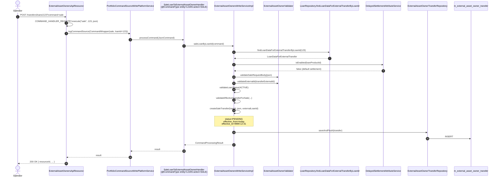

This page traces a sale and buyback end-to-end through Apache Fineract's investor / asset externalisation module: from the operator's first `POST` to the journal entries hitting the GL on the settlement date. The story has three parts:

1. **Request** — REST → command handler → write service writes a `PENDING` row. Nothing has changed for the loan yet.
2. **Activate** — the next morning's Close-of-Business (COB) job for that loan picks up the pending row, decides the loan is still sellable, and flips the row to `ACTIVE` while posting journal entries.
3. **Buyback** — symmetric: a new `BUYBACK` row is requested, COB closes the active row and posts a reversing batch.

The five sub-commands exposed by `/v1/external-asset-owners/transfers/loans/{loanId}` are `sale`, `intermediarySale`, `buyback`, `cancel`, and (sister endpoint) `create` for the owner itself.

## The write path: requesting a sale

When an operator wants to sell loan 123 to investor `INV‑42` settling on 2025‑02‑15 at 102%, the request looks like:

```http
POST /fineract-provider/api/v1/external-asset-owners/transfers/loans/123?command=sale
Content-Type: application/json

{
  "settlementDate":         "15 February 2025",
  "ownerExternalId":        "INV-42",
  "transferExternalId":     "TRANSFER-12345",
  "transferExternalGroupId":"BATCH-2025-02-15",
  "purchasePriceRatio":     "1.02",
  "dateFormat":             "dd MMMM yyyy",
  "locale":                 "en"
}
```

This routes through the JAX-RS resource and into the command framework:



### Step-by-step

**1. REST resource dispatch.** `ExternalAssetOwnersApiResource.transferRequestWithLoanId` (`fineract-investor/.../api/ExternalAssetOwnersApiResource.java`) holds a static `CommandHandlerRegistry` that maps the `command` query parameter to a `CommandWrapperBuilder` call:

```java
private static final CommandHandlerRegistry<...> COMMAND_HANDLER_REGISTRY = new CommandHandlerRegistry<>(
    Map.of(
        CANCEL_COMMAND_VALUE,           (id, json) -> new CommandWrapperBuilder().cancelTransactionByIdToExternalAssetOwner(id).build(),
        INTERMEDIARY_SALE_COMMAND_VALUE,(id, json) -> new CommandWrapperBuilder().withJson(json).intermediarySaleLoanToExternalAssetOwner(id).build(),
        SALE_COMMAND_VALUE,             (id, json) -> new CommandWrapperBuilder().withJson(json).saleLoanToExternalAssetOwner(id).build(),
        BUY_BACK_COMMAND_VALUE,         (id, json) -> new CommandWrapperBuilder().withJson(json).buybackLoanToExternalAssetOwner(id).build(),
        CREATE_COMMAND_VALUE,           (id, json) -> new CommandWrapperBuilder().withJson(json).createExternalAssetOwner().build()
    ));
```

Unknown commands throw `UnrecognizedQueryParamException`. The built `CommandWrapper` is handed to `PortfolioCommandSourceWritePlatformService.logCommandSource`, the standard Fineract command-pipeline entry point.

**2. Handler dispatch.** Each command has a dedicated handler in `investor/service/`:

| Command | Handler | `@CommandType` | Calls |
| --- | --- | --- | --- |
| `sale` | `SaleLoanToExternalAssetOwnerHandler` | `entity=LOAN action=SALE` | `saleLoanByLoanId(cmd)` |
| `intermediarySale` | `IntermediarySaleToExternalAssetOwnerHandler` | `entity=LOAN action=INTERMEDIARY_SALE` | `intermediarySaleLoanByLoanId(cmd)` |
| `buyback` | `BuybackLoanFromExternalAssetOwnerHandler` | `entity=LOAN action=BUYBACK` | `buybackLoanByLoanId(cmd)` |
| `cancel` | `CancelTransactionFromExternalAssetOwnerHandler` | `entity=LOAN action=CANCEL` | `cancelTransactionById(cmd)` |
| `create` | `CreateExternalAssetOwnerHandler` | `entity=EXTERNAL_ASSET_OWNER action=CREATE` | `createExternalAssetOwner(cmd)` |

The handlers are one-line delegators (`SaleLoanToExternalAssetOwnerHandler`):

```java
@Service
@CommandType(entity = "LOAN", action = "SALE")
public class SaleLoanToExternalAssetOwnerHandler implements NewCommandSourceHandler {
    private final ExternalAssetOwnersWriteService externalAssetOwnersWriteService;
    @Override
    public CommandProcessingResult processCommand(JsonCommand command) {
        return externalAssetOwnersWriteService.saleLoanByLoanId(command);
    }
}
```

**3. Write service — sale.** `ExternalAssetOwnersWriteServiceImpl.saleLoanByLoanId` does the heavy lifting:

```java
public CommandProcessingResult saleLoanByLoanId(JsonCommand command) {
    final JsonElement json = fromApiJsonHelper.parse(command.json());
    final LoanDataForExternalTransfer loanData = fetchAndValidateLoanDataForExternalTransfer(command.getLoanId());
    final boolean isDelayedSettlementEnabled = delayedSettlementAttributeService.isEnabled(loanData.getLoanProductId());
    validateSaleRequestBody(command.json());                  // (a)
    ExternalId externalId = getTransferExternalIdFromJson(json);
    validateExternalId(externalId);                            // (b)
    validateLoanStatus(loanData, isDelayedSettlementEnabled);  // (c)
    ExternalAssetOwnerTransfer transfer =
        createSaleTransfer(loanId, json, loanData.getExternalId());
    validateSale(transfer, isDelayedSettlementEnabled);        // (d)
    externalAssetOwnerTransferRepository.saveAndFlush(transfer);
    return buildResponseData(transfer);
}
```

Validations in order:

1. **(a) Request-body shape** — only the seven `ExternalTransferRequestParameters` are allowed; unknown keys reject. `settlementDate` and `purchasePriceRatio` are mandatory.
2. **(b) Transfer external id uniqueness** — `validateExternalId` queries the repository; duplicates throw `ExternalAssetOwnerInitiateTransferException("Already existing an asset transfer with the provided transfer external id …")`.
3. **(c) Loan status valid** — the loan must be in one of the allowed statuses. Default settlement requires `ACTIVE`; delayed settlement broadens this to additional statuses (`getAllowedLoanStatusesForDelayedSettlement`). Wrong status raises `Loan status X is not valid for transfer.`
4. **(d) No conflicting in-flight transfer** — `validateEffectiveTransferForSale` consults `findEffectiveTransfersOrderByIdDesc(loanId, today)`. Two effective rows ⇒ "already in progress transfer". One row in `PENDING` ⇒ "already in PENDING state". One row in a non-`ACTIVE` state ⇒ "incorrect state". Only `ACTIVE` (this is an owner-to-owner re-sale) and zero (bank-to-investor first sale) are accepted.
5. **Settlement date validation** (inside `createSaleTransfer` and `validateSale`) — cannot be in the past, and must be ≥ today.

If everything passes, `createSaleTransfer` builds a brand-new row:

```java
private ExternalAssetOwnerTransfer createSaleTransfer(Long loanId, JsonElement json, ExternalId externalLoanId) {
    ExternalAssetOwnerTransfer t = new ExternalAssetOwnerTransfer();
    LocalDate effectiveFrom = ThreadLocalContextUtil.getBusinessDate();
    t.setOwner(getOwner(json));                         // look up m_external_asset_owner by ownerExternalId
    t.setExternalId(getTransferExternalIdFromJson(json));
    t.setStatus(PENDING);
    t.setPurchasePriceRatio(getPurchasePriceRatioFromJson(json));
    t.setSettlementDate(getSettlementDateFromJson(json));
    t.setEffectiveDateFrom(effectiveFrom);              // today
    t.setEffectiveDateTo(FUTURE_DATE_9999_12_31);       // open-ended
    t.setLoanId(loanId);
    t.setExternalLoanId(externalLoanId);
    t.setExternalGroupId(getTransferExternalGroupIdFromJson(json));
    findPreviousAssetOwner(loanId).ifPresent(t::setPreviousOwner);  // for owner-to-owner re-sale
    return t;
}
```

The row is inserted into `m_external_asset_owner_transfer`. **At this point nothing else has changed.** The loan is still owned by whoever owned it before (the bank, in a first-sale; the current investor, in an owner-to-owner sale). No journal entries have been posted. No `ExternalAssetOwnerTransferLoanMapping` has been updated. The only effect is "we have promised that on `settlement_date` the COB job will activate this".

The response shape is built by `buildResponseData(transfer)` and returns a standard `CommandProcessingResult` with `resourceId = transfer.id`.

### Cancellation

If the operator changes their mind before COB runs, they call:

```http
POST /v1/external-asset-owners/transfers/{transferId}?command=cancel
```

`cancelTransactionById` looks up the transfer, sets its `effective_date_to = today`, and inserts a sibling `CANCELLED` row (sub-status `USER_REQUESTED`). The COB step will then skip the loan entirely the next morning.

### Intermediary sale (delayed settlement)

When the loan product has `SETTLEMENT_MODEL = DELAYED_SETTLEMENT`, the operator can split the sale into two legs. The first leg is `?command=intermediarySale`, which creates a `PENDING_INTERMEDIATE` row destined for an intermediate counterparty. After COB activates it (`ACTIVE_INTERMEDIATE`), a second `?command=sale` then re-targets the final investor, and COB will flip it through `ACTIVE_INTERMEDIATE → ACTIVE` while expiring the intermediate transfer.

The same write-service entry points apply; the validators (`validateEffectiveTransferForDelayedSettlementSale`, `validateEffectiveTransferForIntermediarySale`) just enforce different state rules. Without `DELAYED_SETTLEMENT` enabled, `intermediarySale` raises `Delayed Settlement Configuration is not enabled for the loan product: <shortName>`.

## The activate path: COB at settlement date

Now the morning of the settlement date arrives. The Loan Close-of-Business pipeline (`fineract-cob`) iterates eligible loans and, for each, runs every registered `LoanCOBBusinessStep` in configured order. One of those steps is the investor module's contribution: `LoanAccountOwnerTransferBusinessStep`.

```mermaid
sequenceDiagram
    autonumber
    participant COB as Loan COB pipeline
    participant Step as LoanAccountOwnerTransferBusinessStep
    participant TR as ExternalAssetOwnerTransferRepository
    participant LT as LoanTransferabilityService
    participant LMR as ExternalAssetOwnerTransferLoanMappingRepository
    participant JEP as LoanJournalEntryPoster
    participant Acc as AccountingServiceImpl
    participant BE as BusinessEventNotifierService
    participant Loan as Loan (in-memory)

    COB->>Step: execute(loan)
    Step->>TR: findAll(loanId == X AND settlementDate == today<br/>AND status IN (PENDING…, BUYBACK…)<br/>AND effectiveDateTo >= 9999-12-31)
    TR-->>Step: 0, 1, or 2 transfers

    alt size == 1, status PENDING
        Step->>LT: isTransferable(loan, transfer)
        LT-->>Step: true / false
        alt transferable
            Step->>TR: expire old; insert new ACTIVE row
            Step->>LMR: insert ExternalAssetOwnerTransferLoanMapping(loanId, newTransfer)
            Step->>Step: build ExternalAssetOwnerTransferDetails (frozen balances)
            Step->>JEP: postJournalEntriesForExternalOwnerTransfer(loan, newTransfer, previousOwner)
            JEP->>Acc: createJournalEntriesForSaleAssetTransfer(loan, newTransfer, previousOwner)
        else not transferable
            Step->>TR: expire old; insert DECLINED row<br/>sub = BALANCE_ZERO or BALANCE_NEGATIVE
        end
        Step->>BE: notifyPostBusinessEvent(LoanOwnershipTransferBusinessEvent)
    end

    alt size == 1, status BUYBACK
        Step->>TR: find active matching ACTIVE row
        alt found
            Step->>TR: expire both; new buyback row<br/>+ ExternalAssetOwnerTransferDetails
            Step->>LMR: deleteByLoanIdAndOwnerTransfer(loanId, oldActive)
            Step->>JEP: postJournalEntriesForExternalOwnerTransfer(loan, buyback, null)
        else nothing to buy back
            Step->>TR: insert CANCELLED row<br/>sub = UNSOLD
        end
        Step->>BE: notifyPostBusinessEvent(LoanOwnershipTransferBusinessEvent)
    end

    alt size == 2 (same-day sale + buyback)
        Step->>TR: insert CANCELLED for both<br/>sub = SAMEDAY_TRANSFERS
    end

    Step-->>COB: loan (unchanged reference)
```

The exact code that selects pending rows for the day:

```java
List<ExternalAssetOwnerTransfer> transferDataList = externalAssetOwnerTransferRepository.findAll(
    (root, query, cb) -> cb.and(
        cb.equal(root.get("loanId"), loanId),
        cb.equal(root.get("settlementDate"), settlementDate),       // today
        root.get("status").in(Stream.concat(
            PENDING_STATUSES.stream(),       // PENDING, PENDING_INTERMEDIATE
            BUYBACK_STATUSES.stream()        // BUYBACK, BUYBACK_INTERMEDIATE
        ).toList()),
        cb.greaterThanOrEqualTo(root.get("effectiveDateTo"), FUTURE_DATE_9999_12_31)
    ),
    Sort.by(Sort.Direction.ASC, "id"));
```

So the step *only* fires on the right day for transfers that are still open-ended (effective_date_to = 9999-12-31). Cancelled or already-expired rows are invisible.

### Transferability check

For pending transfers, `LoanTransferabilityServiceImpl.isTransferable(loan, transfer)` decides go/no-go. The current default rule (see `LoanTransferabilityServiceImpl`) is:

- For non-`PENDING_INTERMEDIATE` flows, the loan's `totalOutstanding` must be **strictly greater than zero**. Otherwise the sale is declined.
- For `PENDING_INTERMEDIATE` flows, the check is skipped — the intermediate ownership is established regardless of current balance, because by definition the second leg will be a real-money operation.

If declined, `getDeclinedSubStatus(loan)` returns:

- `BALANCE_ZERO` when `totalOutstanding == 0`
- `BALANCE_NEGATIVE` when `totalOutstanding < 0` (loan is overpaid)

The DECLINED row records this, the loan stays bank-owned, no GL postings happen, and a `LoanOwnershipTransferBusinessEvent` is fired so downstream systems learn the sale was rejected.

### Same-day sale + buyback collapse

It is possible for an operator to request both a sale and a buyback that fall on the same business day. When the COB step finds *two* effective rows for the day, both `PENDING` and `BUYBACK`, it inserts two `CANCELLED` rows with sub-status `SAMEDAY_TRANSFERS` and posts nothing. This guards against the GL bouncing in and out of the asset-transfer clearing account on the same day for no economic effect.

If delayed settlement is enabled and two rows are found, the step throws `IllegalStateException` — that configuration only allows a single in-flight transfer per loan.

## The buyback path

A symmetric request returns the loan to the bank (or to the previous owner up the chain):

```http
POST /v1/external-asset-owners/transfers/loans/123?command=buyback
{
  "settlementDate":     "01 March 2025",
  "transferExternalId": "BUYBACK-99",
  "dateFormat":         "dd MMMM yyyy",
  "locale":             "en"
}
```

`buybackLoanByLoanId` walks the same validators in slightly different shape:

```java
public CommandProcessingResult buybackLoanByLoanId(JsonCommand command) {
    validateBuybackRequestBody(command.json());
    LoanDataForExternalTransfer loanData = fetchAndValidateLoanDataForExternalTransfer(command.getLoanId());
    LocalDate settlementDate = getSettlementDateFromJson(json);
    ExternalId externalId = getTransferExternalIdFromJson(json);
    validateSettlementDate(settlementDate);
    validateExternalId(externalId);
    ExternalAssetOwnerTransfer effective = fetchAndValidateEffectiveTransferForBuyback(loanData, settlementDate);
    ExternalAssetOwnerTransfer buyback = createBuybackTransfer(effective, settlementDate, externalId);
    externalAssetOwnerTransferRepository.saveAndFlush(buyback);
    return buildResponseData(buyback);
}
```

`fetchAndValidateEffectiveTransferForBuyback` enforces:

- The loan **must** currently be externally owned (otherwise: *"This loan cannot be bought back, it is not owned by an external asset owner"*).
- There must not already be an in-flight buyback (otherwise: *"buyback transfer is already in progress"*).
- The current effective transfer must be in `PENDING` or `ACTIVE` (one of `BUYBACK_READY_STATUSES`).
- The buyback's `settlementDate` cannot be earlier than the active transfer's settlement date.

The resulting row's status is computed by `getBuyBackStatus`:

```java
case PENDING, ACTIVE       -> ExternalTransferStatus.BUYBACK;
case ACTIVE_INTERMEDIATE   -> ExternalTransferStatus.BUYBACK_INTERMEDIATE;
```

On COB at the buyback's settlement date, `LoanAccountOwnerTransferBusinessStep.handleBuyback` does:

1. Find the matching `ACTIVE` (or `ACTIVE_INTERMEDIATE`) row for the same loan and owner.
2. If found: expire both (set `effective_date_to = settlementDate`), build a transfer-details snapshot at current balances, **delete** the `ExternalAssetOwnerTransferLoanMapping` row (so the loan is no longer marked externally owned), then post journal entries via `LoanJournalEntryPoster.postJournalEntriesForExternalOwnerTransfer(loan, buyback, null)` (note the `null` previousOwner — buyback doesn't need it).
3. If no matching active row exists: insert a `CANCELLED` row with sub-status `UNSOLD`. This happens when the sale was declined.

After either path, `LoanOwnershipTransferBusinessEvent` is fired and a `LoanAccountSnapshotBusinessEvent` is fired (so downstream learn the new balances now belong to the bank again).

## Settle: what "settled" actually means here

There is no separate "settle" command. The accounting *settlement* — the act of recognising the transfer in the GL — happens *as part of activation*, inside `AccountingServiceImpl.createJournalEntriesForSaleAssetTransfer`. The pattern is "credit each receivable/portfolio account that previously held the loan's balance components, debit a single `ASSET_TRANSFER` financial-activity clearing account for the total." A reversing batch on buyback puts the receivables back. The actual cash movement between bank and investor is **external** to Fineract and is reconciled against the `ASSET_TRANSFER` GL account by the operations team. See [accounting integration](/investor/accounting-integration) for the line-by-line breakdown.

The frozen `ExternalAssetOwnerTransferDetails` snapshot is the canonical record of *what was sold* for valuation purposes — multiplied by the `purchase_price_ratio`, it gives the consideration owed.

## Putting it together: a day-in-the-life timeline

```mermaid
gantt
    dateFormat  YYYY-MM-DD
    title Sale of loan 123 to investor INV-42
    section Operator actions
    POST sale (PENDING row)              :a1, 2025-02-10, 1d
    Operator inspects (active-transfer)  :a2, 2025-02-11, 4d
    POST buyback (BUYBACK row)           :a3, 2025-04-01, 1d
    section COB activations
    COB on settlement: PENDING→ACTIVE    :crit, b1, 2025-02-15, 1d
    Loan owned by INV-42, GL posted      :         b2, 2025-02-15, 45d
    COB on buyback: ACTIVE→expired       :crit, b3, 2025-04-01, 1d
    Loan back with bank, GL reversed     :         b4, 2025-04-01, 1d
```

Five operator events (or four if no buyback) span everything. The state-changes themselves are atomic inside two batch passes.

## Reads

To support the operator UI, the same controller exposes:

- `GET /transfers?loanId=…&loanExternalId=…&transferExternalId=…` — paginated history.
- `GET /transfers/active-transfer?loanId=…` — the one currently active row, if any. Returns 404 if none.
- `GET /transfers/{transferId}/journal-entries` — every GL line tagged to this transfer (via `m_external_asset_owner_transfer_journal_entry_mapping`).
- `GET /owners/external-id/{ownerExternalId}/journal-entries` — every GL line ever attributed to this investor.
- `POST /search` — pageable JSON search with text and date-range filters; delegated to `ExternalAssetOwnersSearchApiDelegate`.

The read services (`ExternalAssetOwnersReadServiceImpl`, `ExternalAssetOwnerSearchService`) all consult the same five tables described in [external-asset-owner-domain](/investor/external-asset-owner-domain).

The next page zooms into the COB step itself — how it plugs into `fineract-cob` and why it has to be a `LoanCOBBusinessStep` and not a Quartz job.
