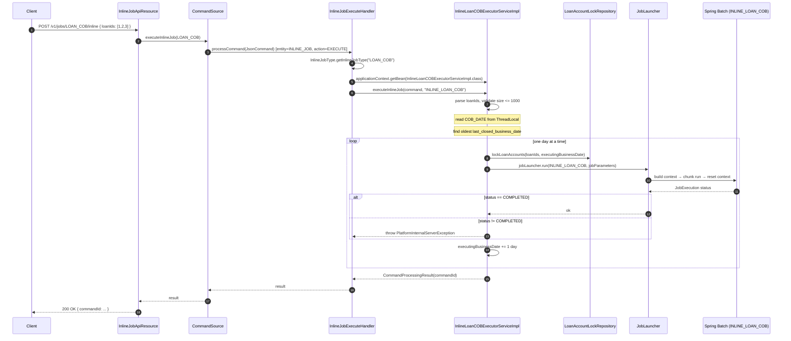

Inline job execution is Apache Fineract's escape hatch from the cron timetable. Sometimes you cannot wait for the nightly Loan COB run — a teller wants to disburse against a loan whose COB row is two days behind, an integration partner needs accruals posted right now before pulling a balance, an operator is debugging a stuck account. The inline path lets a caller hit a REST endpoint, pass a list of loan ids and synchronously run the same Spring Batch pipeline that the scheduled job would, against just those accounts. Crucially, it bypasses Quartz entirely — the cron / vetoer / job_run_history layer never sees an inline run — but it still goes through the Spring Batch `JobLauncher`, so `BATCH_JOB_EXECUTION` records are written and stuck-job recovery still works.

## When you'd use it

- A specific account is **behind** on COB and the user needs to act on it today.
- A test harness needs to deterministically advance one account's COB without waiting for the cron fire.
- A migration tool needs to bring a freshly-imported set of loans up to the current business date.
- A back-office tool is reconciling a small group of accounts that got stuck in `LoanAccountsStayedLockedBusinessEvent` from the last COB run.

The inline path is **not** intended for advancing the global COB date (`COB_DATE`) or for running non-COB jobs. It is specifically for "catch this loan up to today."

## What `InlineJobType` lets you call

```text fineract-provider/src/main/java/org/apache/fineract/infrastructure/jobs/service/InlineJobType.java
@RequiredArgsConstructor
public enum InlineJobType {

    LOAN_COB("LOAN_COB", "INLINE_LOAN_COB", InlineLoanCOBExecutorServiceImpl.class),
    WC_LOAN_COB("WC_LOAN_COB", "INLINE_WORKING_CAPITAL_LOAN_COB", InlineWorkingCapitalLoanCOBExecutorServiceImpl.class);

    private final String jobName;
    @Getter
    private final String inlineJobName;
    @Getter
    private final Class<? extends InlineExecutorService> executorServiceClass;

    public static InlineJobType getInlineJobType(String jobName) {
        Optional<InlineJobType> optionalInlineJobType = Arrays.stream(InlineJobType.values())
                .filter(inlineCOBType -> jobName.equals(inlineCOBType.jobName)).findAny();
        return optionalInlineJobType
                .orElseThrow(() -> new IllegalArgumentException("Inline Job is not found by job name: " + jobName));
    }
}
```

Each entry has three fields:

- **`jobName`** — the path parameter clients use (`LOAN_COB`, `WC_LOAN_COB`). This is what goes into the URL.
- **`inlineJobName`** — the Spring Batch `Job` bean name that is actually launched (`INLINE_LOAN_COB`, `INLINE_WORKING_CAPITAL_LOAN_COB`). Note this is **different** from the scheduled job — there is a separate Spring Batch `@Bean Job` for inline runs.
- **`executorServiceClass`** — the bean class to look up via `ApplicationContext.getBean(...)` to run the inline job.

Only Loan COB and Working Capital Loan COB are inline-able. Inline-executing the other 38 entries in `JobName` (see `jobs/job-catalog`) is intentionally not supported — they are not loan-scoped and don't take a list of account ids.

## The REST surface

```text fineract-provider/src/main/java/org/apache/fineract/infrastructure/jobs/api/InlineJobApiResource.java
@Path("/v1/jobs")
@Component
@Tag(name = "Inline Job", description = "")
@RequiredArgsConstructor
public class InlineJobApiResource {

    private final PortfolioCommandSourceWritePlatformService commandWritePlatformService;
    private final DefaultToApiJsonSerializer<LoanIdsResponseDTO> serializer;

    @POST
    @Path("{jobName}/inline")
    @Consumes({ MediaType.APPLICATION_JSON })
    @Produces({ MediaType.APPLICATION_JSON })
    @Operation(summary = "Starts an inline Job", description = "Starts an inline Job")
    @RequestBody(content = @Content(schema = @Schema(implementation = InlineJobResourceSwagger.InlineJobRequest.class)))
    @ApiResponse(responseCode = "200", description = "OK", content = @Content(schema = @Schema(implementation = InlineJobResourceSwagger.InlineJobResponse.class)))
    @ApiResponse(responseCode = "400", description = "Request body item size validation error")
    public String executeInlineJob(@PathParam("jobName") @Parameter(description = "jobName") final String jobName,
            @Parameter(hidden = true) final String jsonRequestBody) {

        final CommandWrapper commandRequest = new CommandWrapperBuilder().executeInlineJob(jobName).withJson(jsonRequestBody).build();
        CommandProcessingResult result = commandWritePlatformService.logCommandSource(commandRequest);
        return serializer.serialize(result);
    }
}
```

Endpoint:

```
POST /v1/jobs/{jobName}/inline
Content-Type: application/json

{ "loanIds": [1, 2, 3] }
```

The `{jobName}` path param must match one of the `InlineJobType.jobName` values — `LOAN_COB` or `WC_LOAN_COB`. Anything else returns the `IllegalArgumentException` from `InlineJobType.getInlineJobType`.

The body schema (`InlineJobResourceSwagger.InlineJobRequest`) is just `{ loanIds: [...] }`. There is an **upper bound** on the size of that list — `fineract.api.body-item-size-limit.inline-loan-cob` (default `1000`):

```text fineract-provider/src/main/resources/application.properties
fineract.api.body-item-size-limit.inline-loan-cob=${FINERACT_API_REQUEST_BODY_SIZE_LIMIT_INLINE_COB:1000}
```

Exceeding it raises `PlatformRequestBodyItemLimitValidationException`. The cap exists because inline runs hold each loan's row-level lock for the entire duration; very large lists would starve the regular write path.

The endpoint goes through the standard **command source** pipeline (see `command/overview`). The `CommandWrapperBuilder.executeInlineJob(jobName)` builder produces a command with `entity = "INLINE_JOB"` and `action = "EXECUTE"`, which is then picked up by:

## `InlineJobExecuteHandler`

```text fineract-provider/src/main/java/org/apache/fineract/infrastructure/jobs/service/InlineJobExecuteHandler.java
@RequiredArgsConstructor
@Service
@CommandType(entity = "INLINE_JOB", action = "EXECUTE")
public class InlineJobExecuteHandler implements NewCommandSourceHandler {

    private final ApplicationContext applicationContext;

    @Override
    public CommandProcessingResult processCommand(JsonCommand command) {
        InlineJobType inlineJobType = InlineJobType.getInlineJobType(command.getJobName());
        try {
            InlineExecutorService inlineJobExecutorService = applicationContext.getBean(inlineJobType.getExecutorServiceClass());
            return inlineJobExecutorService.executeInlineJob(command, inlineJobType.getInlineJobName());
        } catch (NoSuchBeanDefinitionException e) {
            throw new JobIsNotFoundOrNotEnabledException(e, inlineJobType.getInlineJobName());
        }
    }
}
```

Three operations:

1. Look up the `InlineJobType` from the URL path.
2. Pull the executor bean by class from the `ApplicationContext`. If the bean is missing — most commonly because `fineract.job.loan-cob-enabled=false` has disabled the entire Loan COB module — fail with `JobIsNotFoundOrNotEnabledException`.
3. Delegate to `executeInlineJob(command, inlineJobName)`.

If the wrong `jobName` is in the URL, the `IllegalArgumentException` from `InlineJobType.getInlineJobType` is what surfaces — it propagates as a `400 Bad Request`.

## The `InlineExecutorService` SPI

```text fineract-provider/src/main/java/org/apache/fineract/infrastructure/jobs/service/InlineExecutorService.java
public interface InlineExecutorService<T> {

    CommandProcessingResult executeInlineJob(JsonCommand command, String jobName);

    void execute(List<T> elements, String jobName);

    default void execute(T element, String jobName) {
        execute(Collections.singletonList(element), jobName);
    }
}
```

Three methods:

- `executeInlineJob(JsonCommand, String)` — the command-handler entry point. Parses the request, validates list size, calls `execute(List, String)`.
- `execute(List<T>, String)` — the iteration entry point. Takes a list (typed `T`; for Loan COB it's `Long` loan ids) and the **inline job bean name** to launch.
- `execute(T, String)` — convenience overload that wraps a single element.

The SPI is generic so future inline jobs (e.g. an inline savings COB) can implement it without changing the dispatch infrastructure.

## The Loan COB inline executor

```text fineract-provider/src/main/java/org/apache/fineract/cob/service/InlineLoanCOBExecutorServiceImpl.java
@Service
@Slf4j
@Conditional(LoanCOBEnabledCondition.class)
public class InlineLoanCOBExecutorServiceImpl extends InlineCommonLockableCOBExecutorService<LoanAccountLock> {

    public InlineLoanCOBExecutorServiceImpl(LoanAccountLockRepository loanAccountLockRepository,
            InlineLoanCOBExecutionDataParser dataParser, JobLauncher jobLauncher, JobLocator jobLocator, JobExplorer jobExplorer,
            TransactionTemplate transactionTemplate, CustomJobParameterRepository customJobParameterRepository,
            PlatformSecurityContext context, RetrieveLoanIdService retrieveIdService, FineractProperties fineractProperties) {
        super(loanAccountLockRepository, dataParser, jobLauncher, jobLocator, jobExplorer, transactionTemplate,
                customJobParameterRepository, context, retrieveIdService, fineractProperties);
    }

    @Override
    public LoanAccountLock createAccountLock(Long loanId, LockOwner loanInlineCobProcessing, LocalDate businessDate) {
        return new LoanAccountLock(loanId, LockOwner.LOAN_INLINE_COB_PROCESSING, businessDate);
    }
}
```

It is gated on `LoanCOBEnabledCondition` (which reads `fineract.job.loan-cob-enabled`), so disabling Loan COB also disables the inline endpoint. The companion class for Working Capital is structurally identical.

The interesting logic lives in the shared superclass:

```text fineract-provider/src/main/java/org/apache/fineract/cob/service/InlineCommonLockableCOBExecutorService.java
@Override
@Transactional(propagation = Propagation.NOT_SUPPORTED)
public CommandProcessingResult executeInlineJob(JsonCommand command, String jobName) throws AccountLockCannotBeOverruledException {
    List<Long> loanIds = dataParser.parseExecution(command);
    validateLoanIdsListSize(loanIds);
    execute(loanIds, jobName);
    return new CommandProcessingResultBuilder()
            .withCommandId(command.commandId())
            .build();
}

@Override
public void execute(List<Long> loanIds, String jobName) {
    LocalDate cobBusinessDate = ThreadLocalContextUtil.getBusinessDateByType(BusinessDateType.COB_DATE);
    List<COBIdAndLastClosedBusinessDate> loansToBeProcessed = getLoansToBeProcessed(loanIds, cobBusinessDate);
    LocalDate executingBusinessDate = getOldestCOBBusinessDate(loansToBeProcessed).plusDays(1);
    if (!loansToBeProcessed.isEmpty()) {
        while (!DateUtils.isAfter(executingBusinessDate, cobBusinessDate)) {
            execute(getLoanIdsToBeProcessed(loansToBeProcessed, executingBusinessDate), jobName, executingBusinessDate);
            executingBusinessDate = executingBusinessDate.plusDays(1);
        }
    }
}
```

The catch-up loop is the heart of inline execution:

1. Read the tenant's current `COB_DATE` (the global "last day for which all loans are caught up").
2. Find the **oldest** `last_closed_business_date` across the supplied loans. Loans whose COB row is already at `COB_DATE` need no work and drop out.
3. Start `executingBusinessDate` at `oldest + 1` day.
4. **Loop one day at a time**, running the inline Spring Batch job once per day for every loan whose `last_closed_business_date < executingBusinessDate`.
5. Stop when `executingBusinessDate` reaches `COB_DATE`.

This is intentionally **day-by-day**, not "set the whole loan to today in one shot." The same `LoanCOBBusinessStep` chain that the scheduled job uses needs to run with each historical business date in turn — that is how accruals and delinquency aging end up correct.

The actual launch is here:

```text fineract-provider/src/main/java/org/apache/fineract/cob/service/InlineCommonLockableCOBExecutorService.java
@SuppressFBWarnings("SLF4J_SIGN_ONLY_FORMAT")
private void execute(List<Long> loanIds, String jobName, LocalDate businessDate) {
    lockLoanAccounts(loanIds, businessDate);
    Job inlineLoanCOBJob;
    try {
        inlineLoanCOBJob = jobLocator.getJob(jobName);
    } catch (NoSuchJobException e) {
        throw new JobNotFoundException(jobName, e);
    }
    JobParameters jobParameters = new JobParametersBuilder(jobExplorer).getNextJobParameters(inlineLoanCOBJob)
            .addJobParameters(new JobParameters(getJobParametersMap(loanIds, businessDate))).toJobParameters();
    JobExecution jobExecution;
    try {
        jobExecution = jobLauncher.run(inlineLoanCOBJob, jobParameters);
    } catch (Exception e) {
        log.error("{}{}", JOB_EXECUTION_FAILED_MESSAGE, jobName, e);
        throw new PlatformInternalServerException("error.msg.sheduler.job.execution.failed", JOB_EXECUTION_FAILED_MESSAGE, jobName, e);
    }
    if (!BatchStatus.COMPLETED.equals(jobExecution.getStatus())) {
        log.error("{}{}", JOB_EXECUTION_FAILED_MESSAGE, jobName);
        throw new PlatformInternalServerException("error.msg.sheduler.job.execution.failed", JOB_EXECUTION_FAILED_MESSAGE, jobName);
    }
}
```

Key points:

- **`@Transactional(propagation = Propagation.NOT_SUPPORTED)`** on the outer method — the inline executor does NOT run in the caller's database transaction. Spring Batch manages its own transactions internally; the loan locks are committed in their own transactions so the Batch run can see them.
- **Loan locks before launch** — `lockLoanAccounts(loanIds, businessDate)` inserts (or upgrades) per-loan rows in the `m_loan_account_locks` table with owner `LOAN_INLINE_COB_PROCESSING`. That blocks regular REST mutations against those loans via the `LoanCOBApiFilter` (see `cob/api-locking`).
- **`jobLocator.getJob(jobName)`** — the **inline** job name. For Loan COB this is `"INLINE_LOAN_COB"`, registered by `LoanInlineCOBConfig`.
- **`JobParametersBuilder...getNextJobParameters(...)`** — Spring Batch's idiom for getting a fresh, monotonic parameter set so each run produces a new `BATCH_JOB_INSTANCE` row.
- **`if (!BatchStatus.COMPLETED.equals(jobExecution.getStatus()))`** — a `FAILED` Spring Batch status is escalated to `PlatformInternalServerException`, so the caller gets a `500` with `error.msg.sheduler.job.execution.failed`. The transaction-not-supported wrapper means the caller's outer command source row still gets committed with the failure recorded.

## The inline Spring Batch job

The scheduled `LOAN_COB` job is partitioned (manager / worker steps over a message queue — see `jobs/spring-batch-partitioned-jobs`). The inline job is **not** partitioned — it is a straight chunk-oriented job inside the calling JVM:

```text fineract-provider/src/main/java/org/apache/fineract/cob/loan/LoanInlineCOBConfig.java
@Configuration
@EnableBatchIntegration
@Conditional(LoanCOBEnabledCondition.class)
public class LoanInlineCOBConfig {

    @Autowired private JobRepository jobRepository;
    @Autowired private PlatformTransactionManager transactionManager;
    @Autowired private PropertyService propertyService;
    @Autowired private LoanRepository loanRepository;
    @Autowired private COBBusinessStepService cobBusinessStepService;
    @Autowired private CustomJobParameterResolver customJobParameterResolver;
    @Autowired private LockingService<LoanAccountLock> loanLockingService;
    ...

    @Bean
    protected Step inlineCOBBuildExecutionContextStep() {
        return new StepBuilder("Inline COB build execution context step", jobRepository)
                .tasklet(inlineLoanCOBBuildExecutionContextTasklet(), transactionManager)
                .listener(inlineCobPromotionListener()).build();
    }

    @Bean
    public Step inlineLoanCOBStep() {
        return new StepBuilder("Inline Loan COB Step", jobRepository)
                .<Loan, Loan>chunk(propertyService.getChunkSize(JobName.LOAN_COB.name()), transactionManager)
                .reader(inlineCobWorkerItemReader())
                .processor(inlineCobWorkerItemProcessor())
                .writer(inlineCobWorkerItemWriter())
                .listener(inlineCobLoanItemListener()).build();
    }

    @Bean(name = "loanInlineCOBJob")
    public Job loanInlineCOBJob() {
        return new JobBuilder(LoanCOBConstant.INLINE_LOAN_COB_JOB_NAME, jobRepository)
                .start(inlineCOBBuildExecutionContextStep())
                .next(inlineLoanCOBStep())
                .next(inlineCOBResetContextStep())
                .incrementer(new RunIdIncrementer())
                ...
    }
}
```

A few things stand out:

- The **bean name** is `loanInlineCOBJob` but the **Spring Batch job name** (the second argument to `JobBuilder`) is `LoanCOBConstant.INLINE_LOAN_COB_JOB_NAME = "INLINE_LOAN_COB"` — this is what `JobLocator.getJob("INLINE_LOAN_COB")` finds.
- The job has three steps: build execution context → run the chunk-oriented business steps → reset context. No partitioning.
- The chunk size is **shared** with the scheduled `LOAN_COB` job via `propertyService.getChunkSize(JobName.LOAN_COB.name())`. Both reuse the same tuning row in `application.properties`.

## Putting it together



## Comparison: inline vs scheduled

| Aspect | Scheduled (`LOAN_COB`) | Inline (`INLINE_LOAN_COB`) |
|--------|------------------------|-----------------------------|
| Trigger | Quartz cron fire | HTTP POST to `/v1/jobs/LOAN_COB/inline` |
| Goes through Quartz | Yes | **No** |
| Goes through Spring Batch | Yes | Yes |
| Records in `BATCH_JOB_EXECUTION` | Yes (as `LOAN_COB`) | Yes (as `INLINE_LOAN_COB` — separate instance) |
| Records in `job_run_history` | Yes (via `SchedulerJobListener`) | **No** |
| Partitioned | Yes (manager / worker) | No (chunk-oriented in caller's JVM) |
| Scope | Every loan with `last_closed_business_date < COB_DATE` | Only the loan ids in the request body |
| Loan lock owner | `LOAN_COB_PROCESSING` | `LOAN_INLINE_COB_PROCESSING` |
| Lock overrule semantics | Cannot overrule existing locks | Can overrule existing inline-COB locks (see `isLockOverrulable`) |
| Body size cap | n/a | `fineract.api.body-item-size-limit.inline-loan-cob` (default 1000) |
| Failure mode | `BatchStatus.FAILED` → `job_run_history.status=failed`; cron picks up next fire | Throws `PlatformInternalServerException` synchronously to the caller |
| Catch-up behavior | Single fire per business date; relies on the cron schedule + the daily `INCREASE_COB_DATE_BY_1_DAY` job | **Loops day-by-day** for each loan from its `last_closed_business_date + 1` up to `COB_DATE` |
| Disabled by | `fineract.mode.batch-manager-enabled=false`, job marked inactive, or `fineract.job.loan-cob-enabled=false` | `fineract.job.loan-cob-enabled=false` (removes the bean) |
| Returns to caller | n/a (cron) | `CommandProcessingResult { commandId }` once the entire catch-up loop completes |

The "Goes through Quartz: No" row is the headline difference. Inline runs cannot be vetoed by `SchedulerVetoer` (the scheduler being suspended does not block an inline run), and they do not produce `ScheduledJobRunHistory` rows. They **do** show up in `BATCH_JOB_INSTANCE` / `BATCH_JOB_EXECUTION` under the `INLINE_LOAN_COB` name, which is also what the stuck-job listener looks at when it picks up incomplete partitioned runs (see `jobs/stuck-job-handling`).

## Locking interaction

Inline COB does not just run — it has to first take a row-level lock on every loan it touches. That's the contract `InlineLoanCOBExecutorServiceImpl.createAccountLock(...)` enforces:

```text fineract-provider/src/main/java/org/apache/fineract/cob/service/InlineLoanCOBExecutorServiceImpl.java
@Override
public LoanAccountLock createAccountLock(Long loanId, LockOwner loanInlineCobProcessing, LocalDate businessDate) {
    return new LoanAccountLock(loanId, LockOwner.LOAN_INLINE_COB_PROCESSING, businessDate);
}
```

If a loan is already locked by a non-overrulable owner (e.g. the regular `LOAN_COB_PROCESSING` because the scheduled job is currently running), inline execution fails with `AccountLockCannotBeOverruledException`, with a message of the form:

> There is a hard lock on the loan account without any error, so it can't be overruled. Locked loan IDs: [42, 99, ...]

This is what protects scheduled COB from being clobbered by a concurrent inline call. Conversely the `LoanCOBApiFilter` blocks regular API mutations on a loan that is currently lock-held by either `LOAN_COB_PROCESSING` or `LOAN_INLINE_COB_PROCESSING`.

See `cob/api-locking` for the locking lifecycle in detail.

## Errors operators see

| Symptom | Likely cause | Reference |
|---------|--------------|-----------|
| `IllegalArgumentException: Inline Job is not found by job name: XYZ` | Path param is not `LOAN_COB` or `WC_LOAN_COB`. | `InlineJobType.getInlineJobType` |
| `JobIsNotFoundOrNotEnabledException: INLINE_LOAN_COB` | `fineract.job.loan-cob-enabled=false` removed the executor bean. | `InlineJobExecuteHandler.processCommand` |
| `PlatformRequestBodyItemLimitValidationException` | More than `fineract.api.body-item-size-limit.inline-loan-cob` ids in the request. | `validateLoanIdsListSize` |
| `AccountLockCannotBeOverruledException` | Another COB owner holds the lock on one or more requested loans. | `getLoanAccountLocks` |
| `PlatformInternalServerException: error.msg.sheduler.job.execution.failed` | Spring Batch returned a non-`COMPLETED` status. | `execute(loanIds, jobName, businessDate)` |

## Cross-references

- `jobs/overview` — for inline's place in the wider job ecosystem.
- `jobs/scheduler-and-quartz` — for the scheduled path that inline replaces.
- `jobs/spring-batch-partitioned-jobs` — for the partitioned `LOAN_COB` job that the inline job collapses into a non-partitioned variant.
- `jobs/stuck-job-handling` — for what happens if an inline run dies halfway through.
- `cob/api-locking` — for the locking semantics that constrain inline COB.
- `cob/loan-cob` — for the COB pipeline that inline runs.
- `command/overview` — for the `INLINE_JOB / EXECUTE` command type.
