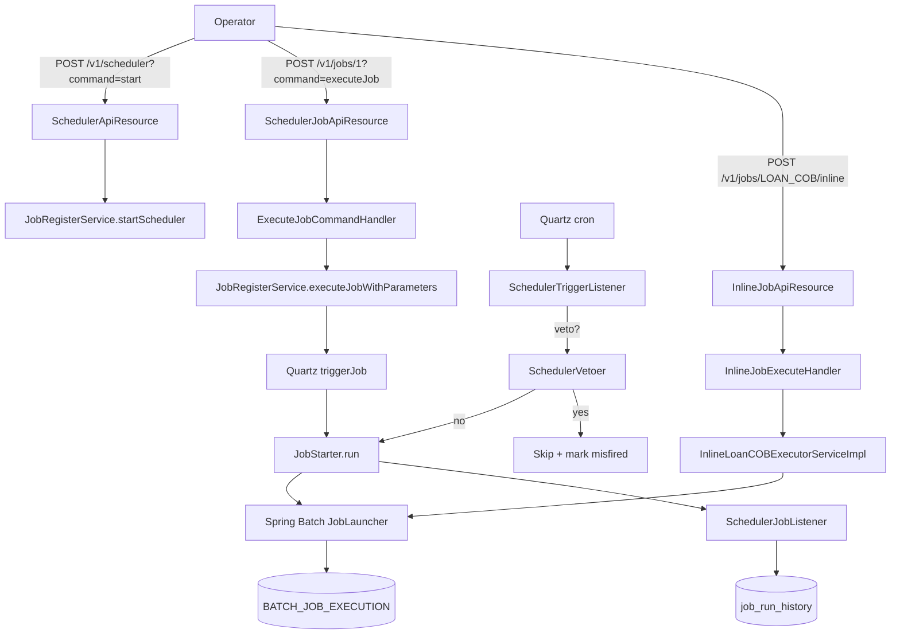

Background jobs are how Apache Fineract gets day-to-day banking work done in the dark. Loan close-of-business, interest accrual, fee posting, NPA classification, dividend posting, SMS gateway polling, command purging, journal-entry aggregation — none of these can wait for an incoming HTTP request. They run on a clock, against every tenant, and have to survive process restarts, single-node misfires, multi-instance deployments and partial failures. Fineract solves that with a two-layer scheduling stack — **Quartz** decides _when_ a job fires, **Spring Batch** decides _how_ it runs — glued together by a central registry (`JobName`) and a per-tenant `job` table that stores the cron expression, the active flag and the last run history.

This page is the entry point to the jobs documentation group. Each sibling page drills into one layer:

- `jobs/scheduler-and-quartz` — Quartz integration, the `JobRegisterService`, the trigger / stop / veto listeners, and the `/v1/scheduler` and `/v1/jobs` REST resources.
- `jobs/job-catalog` — the full enumeration of every `JobName` constant with its display name, what it does and which code path executes it.
- `jobs/spring-batch-partitioned-jobs` — how partitioned Spring Batch jobs work, manager vs worker instance modes, and the remote-partitioning message handlers.
- `jobs/inline-job-execution` — the inline job execution path, where COB-style work is run synchronously from a REST call instead of from a cron trigger.
- `jobs/stuck-job-handling` — how Fineract detects, retries and abandons jobs that died with their batch status stuck at `STARTED`.

## The two-layer model

Every background workload in Fineract is, at runtime, one of these things:

```text
 cron trigger              REST POST                ContextRefreshedEvent
       │                       │                            │
       ▼                       ▼                            ▼
  Quartz Scheduler   ExecuteJobCommandHandler        StuckJobListener
       │                       │                            │
       └──────────► JobRegisterService.executeJob ◄──────────┘
                              │
                              ▼  (MethodInvokingJobDetailFactoryBean → JobStarter.run)
                       Spring Batch Job
                              │
                              ▼
                         Steps / Tasklets / Chunks
```

The **outer ring** is Quartz — it owns the cron expressions, the misfire policy, the trigger listeners and the per-tenant scheduler instance. The **inner ring** is Spring Batch — it owns the `JobRepository`, the chunk-oriented step execution, the partitioner machinery, the `BATCH_JOB_INSTANCE` / `BATCH_JOB_EXECUTION` tables and the restart semantics.

Critically, **the two layers do not run in the same execution context**. Quartz fires a Quartz `JobDetail` whose target is `JobStarter.run(...)`, and `JobStarter.run(...)` is what calls `JobLauncher.run(job, jobParameters)` on a Spring Batch `Job`. This means:

- A failed Quartz fire is recorded in the `job_run_history` table by `SchedulerJobListener` (Quartz side).
- A failed Spring Batch step is recorded in the `BATCH_STEP_EXECUTION` table (Batch side).
- A stuck batch execution — `BATCH_JOB_EXECUTION.STATUS = STARTED` with no live process owning it — is what `StuckJobListener` looks for on startup.

## Where the code lives

```text
fineract-core/src/main/java/org/apache/fineract/infrastructure/jobs/
└── service/
    └── JobName.java                          ← the master enum (40 entries)

fineract-provider/src/main/java/org/apache/fineract/infrastructure/jobs/
├── ScheduledJobRunnerConfig.java             ← @EnableBatchProcessing, JobRepository, JobLauncher, JobExplorer
├── api/
│   ├── SchedulerApiResource.java             ← GET /v1/scheduler, POST /v1/scheduler?command=start|stop
│   ├── SchedulerJobApiResource.java          ← /v1/jobs CRUD + run-now
│   ├── InlineJobApiResource.java             ← POST /v1/jobs/{jobName}/inline
│   └── SchedulerJobApiConstants.java
├── config/
│   └── JobNameProviderConfig.java            ← exposes JobName.values() as a JobNameProvider bean
├── data/
│   ├── JobDetailDataValidator.java
│   └── partitionedjobs/
│       └── PartitionedJob.java               ← whitelist of partitioned job names
├── domain/
│   ├── ScheduledJobDetail.java               ← the `job` table entity
│   ├── ScheduledJobRunHistory.java           ← the `job_run_history` table entity
│   ├── SchedulerDetail.java                  ← the `scheduler_detail` table entity (one row per tenant)
│   ├── JobExecutionRepository.java           ← raw SQL for stuck-job detection
│   └── JobParameter.java
├── exception/
│   ├── JobNotFoundException.java
│   ├── JobNodeIdMismatchingException.java
│   ├── JobInProcessExecution.java
│   └── OperationNotAllowedException.java
├── filter/                                   ← COB API filters (cross-reference: cob/api-locking)
│   ├── COBApiFilter.java
│   ├── LoanCOBApiFilter.java
│   └── WorkingCapitalLoanCOBApiFilter.java
├── handler/
│   ├── ExecuteJobCommandHandler.java         ← SCHEDULER / EXECUTEJOB command handler
│   └── UpdateJobDetailCommandhandler.java    ← SCHEDULER / UPDATE command handler
└── service/
    ├── JobRegisterService.java               ← the public façade
    ├── JobRegisterServiceImpl.java           ← Quartz + Spring Batch wiring (~400 lines)
    ├── JobSchedulerServiceImpl.java          ← ContextRefreshedEvent listener that schedules all jobs
    ├── JobStarter.java                       ← the bridge: Quartz JobDetail → JobLauncher.run
    ├── SchedulerJobListener.java             ← Quartz JobListener; writes job_run_history
    ├── SchedulerStopListener.java            ← Quartz JobListener for one-shot scheduler cleanup
    ├── SchedulerTriggerListener.java         ← Quartz TriggerListener; sets tenant + delegates to SchedulerVetoer
    ├── SchedulerVetoer.java                  ← decides whether to skip a fire (e.g. suspended scheduler)
    ├── SchedularWritePlatformService*.java   ← JPA writes for job / job_run_history / scheduler_detail
    ├── InlineExecutorService.java            ← interface for synchronous COB execution
    ├── InlineJobExecuteHandler.java          ← INLINE_JOB / EXECUTE command handler
    ├── InlineJobType.java                    ← enum of inline jobs (LOAN_COB, WC_LOAN_COB)
    ├── StuckJobExecutorService.java          ← restart logic for jobs left in STARTED
    ├── StuckJobListener.java                 ← ApplicationListener<ContextRefreshedEvent> that triggers restart
    └── jobname/
        ├── JobNameData.java
        ├── JobNameProvider.java
        ├── JobNameService.java               ← resolves "Update NPA" → "UPDATE_NPA"
        └── SimpleJobNameProvider.java

fineract-provider/src/main/java/org/apache/fineract/infrastructure/springbatch/
├── ManagerConfig.java                        ← @EnableBatchIntegration when batch-manager-enabled=true
├── WorkerConfig.java                         ← when batch-worker-enabled=true
├── PropertyServiceImpl.java                  ← per-job chunk/partition/poll properties
├── InputChannelInterceptor.java
├── OutputChannelInterceptor.java
└── messagehandler/                           ← Spring Events / JMS / Kafka transports for partition messages
    ├── StepExecutionRequestHandler.java
    ├── spring/, jms/, kafka/
    └── conditions/
```

## The `JobName` enum: a single source of truth

Every workload that can be scheduled has a constant in:

```text fineract-core/src/main/java/org/apache/fineract/infrastructure/jobs/service/JobName.java
public enum JobName {
    UPDATE_LOAN_ARREARS_AGEING("Update Loan Arrears Ageing"), //
    APPLY_ANNUAL_FEE_FOR_SAVINGS("Apply Annual Fee For Savings"), //
    APPLY_HOLIDAYS_TO_LOANS("Apply Holidays To Loans"), //
    POST_INTEREST_FOR_SAVINGS("Post Interest For Savings"), //
    TRANSFER_FEE_CHARGE_FOR_LOANS("Transfer Fee For Loans From Savings"), //
    ACCOUNTING_RUNNING_BALANCE_UPDATE("Update Accounting Running Balances"), //
    // ... 34 more ...
    JOURNAL_ENTRY_AGGREGATION("Journal Entry Aggregation"), //
    WORKING_CAPITAL_LOAN_COB_JOB("Working Capital Loan COB"), //
    ;

    private final String name;
    JobName(final String name) { this.name = name; }
    @Override public String toString() { return this.name; }
}
```

The constant name (e.g. `UPDATE_NPA`) is the **enum-style** name — that is the Spring Batch `Job` bean name registered with the `JobLocator`. The string in the constructor (e.g. `"Update Non Performing Assets"`) is the **human-readable** name — that is what gets stored in the `job.name` column and shown in the UI.

The two are bridged by `JobNameService`:

```text fineract-provider/src/main/java/org/apache/fineract/infrastructure/jobs/service/jobname/JobNameService.java
public JobNameData getJobByHumanReadableName(String jobName) {
    Optional<JobNameData> optionalJob = getJobNames().stream()
        .filter(jn -> jobName.equals(jn.getHumanReadableName())).findAny();
    return optionalJob.orElseThrow(() -> new IllegalArgumentException("Job not found by name: " + jobName));
}
```

The `JobNameProvider` SPI is open: modules can contribute additional job names (the core `JobName` enum is registered as a bean in `JobNameProviderConfig` and other Gradle modules can register more). See `jobs/job-catalog` for the table of every entry and what it does.

## ScheduledJobRunner — wiring Spring Batch on startup

The annotation requested by the spec, "ScheduledJobRunner," is in fact the `ScheduledJobRunnerConfig` `@Configuration` class. It is what turns the host JVM into a Spring Batch container:

```text fineract-provider/src/main/java/org/apache/fineract/infrastructure/jobs/ScheduledJobRunnerConfig.java
@Configuration(proxyBeanMethods = false)
@EnableBatchProcessing
public class ScheduledJobRunnerConfig {

    @Bean
    public PlatformTransactionManager transactionManager(...) {
        ExtendedJpaTransactionManager transactionManager = new ExtendedJpaTransactionManager();
        ...
    }

    @Bean
    public DataFieldMaxValueIncrementerFactory incrementerFactory(RoutingDataSource routingDataSource) {
        // The DefaultDataFieldMaxValueIncrementerFactory has to be overridden because Spring 6 introduced
        // a new MariaDB incrementer that's incompatible with Spring Batch 4.x
        return new FineractDataFieldMaxValueIncrementerFactory(routingDataSource);
    }

    @Bean
    public JobRepository jobRepository(RoutingDataSource routingDataSource, ...) { ... }

    @Bean
    public JobExplorer jobExplorer(RoutingDataSource routingDataSource, ...) { ... }

    @Bean
    public TaskExecutorJobLauncher jobLauncher(JobRepository jobRepository) throws Exception {
        TaskExecutorJobLauncher launcher = new TaskExecutorJobLauncher();
        launcher.setJobRepository(jobRepository);
        launcher.afterPropertiesSet();
        return launcher;
    }
}
```

The result is a Spring Batch `JobRepository`, `JobExplorer` and `TaskExecutorJobLauncher`, all backed by the **tenant-routing** `RoutingDataSource` — that is, the `BATCH_JOB_INSTANCE`, `BATCH_JOB_EXECUTION`, `BATCH_STEP_EXECUTION` tables live in each tenant's own database, not the master.

Note `spring.batch.job.enabled=false` in `application.properties` — Fineract refuses to let Spring Boot auto-run jobs at startup. The only thing that launches a job is `JobStarter.run(...)`, invoked either by Quartz, by an inline executor or by the stuck-job restarter.

## Manual vs scheduled triggers

Every job can be reached two ways:

| Trigger source            | Path                                                              | `TRIGGER_TYPE_REFERENCE` value |
| ------------------------- | ----------------------------------------------------------------- | ------------------------------ |
| Cron (Quartz)             | `JobRegisterServiceImpl.scheduleJob` → cron fires                  | `"cron"`                       |
| Manual API call           | `POST /v1/jobs/{id}?command=executeJob` → `ExecuteJobCommandHandler` → `JobRegisterService.executeJobWithParameters` | `"application"` (defaulted in `JobRegisterServiceImpl.executeJob` when null) |
| Startup misfire catch-up  | `JobRegisterServiceImpl.startScheduler` walks `triggerMisfired=true` rows | `"cron"`                       |
| Inline (synchronous)      | `POST /v1/jobs/{jobName}/inline` → `InlineJobExecuteHandler` → `InlineExecutorService.executeInlineJob` | Bypasses Quartz entirely        |
| Stuck-job restart         | `StuckJobListener` → `StuckJobExecutorService.resumeStuckJob` → `JobOperator.restart` | Bypasses Quartz; uses Spring Batch `JobOperator` directly |

The trigger type is stored in `BATCH_JOB_EXECUTION_PARAMS` and in `job_run_history.trigger_type` so operators can tell, after the fact, whether a run was scheduled or hand-fired.



## Why per-tenant Quartz schedulers?

Fineract is multi-tenant. The naive design — one Quartz scheduler with one trigger per `(tenant, job)` — does not scale because Quartz worker threads cannot be cleanly partitioned per tenant, and a runaway job for one tenant can starve all others.

`JobRegisterServiceImpl` instead keeps a **map** of schedulers, keyed by tenant id (and by optional `scheduler_group` for jobs that want isolation):

```text fineract-provider/src/main/java/org/apache/fineract/infrastructure/jobs/service/JobRegisterServiceImpl.java
private static final HashMap<String, Scheduler> SCHEDULERS = new HashMap<>(4);

private String getSchedulerName(final ScheduledJobDetail scheduledJobDetail) {
    final StringBuilder sb = new StringBuilder(20);
    final FineractPlatformTenant tenant = ThreadLocalContextUtil.getTenant();
    sb.append(SchedulerServiceConstants.SCHEDULER).append(tenant.getId());
    if (scheduledJobDetail.getSchedulerGroup() > 0) {
        sb.append(SchedulerServiceConstants.SCHEDULER_GROUP).append(scheduledJobDetail.getSchedulerGroup());
    }
    return sb.toString();
}
```

Each Quartz `Scheduler` gets its own thread pool — `DEFAULT_THREAD_COUNT = 7` for regular tenants, `GROUP_THREAD_COUNT = 1` for grouped jobs. A grouped job (`scheduler_group > 0`) is forced into a single-threaded scheduler so it cannot collide with concurrent fires of itself.

When a manual trigger arrives for a job that has **no** active cron — for example a job whose `is_active=false` or a job that just got created — `JobRegisterServiceImpl.executeJob` spins up a **temporary** scheduler named `"temp" + jobId`, registers a one-shot `SchedulerStopListener` on it, fires the job once, and the listener tears the scheduler down after `jobWasExecuted` returns. That keeps thread budget bounded.

## Instance modes: batch-manager vs batch-worker

Fineract supports running as a **monolith** (manager + worker in the same JVM) or as **manager / worker pairs** for partitioned jobs (see `jobs/spring-batch-partitioned-jobs`). Two properties switch the modes:

```text fineract-provider/src/main/resources/application.properties
fineract.mode.batch-worker-enabled=${FINERACT_MODE_BATCH_WORKER_ENABLED:true}
fineract.mode.batch-manager-enabled=${FINERACT_MODE_BATCH_MANAGER_ENABLED:true}
```

These map onto `FineractProperties.FineractModeProperties.batchManagerEnabled` and `batchWorkerEnabled`. They gate:

- **`JobSchedulerServiceImpl`** — only schedules jobs if `batchManagerEnabled` (otherwise logs `"Batch job scheduling is disabled since this instance is not a batch manager"`).
- **`StuckJobListener`** — only runs if `batchManagerEnabled`.
- **`ManagerConfig`** — only wires the outbound channel and the `OutputChannelInterceptor` for partition requests if `batchManagerEnabled`.
- **`WorkerConfig`**, **`StepExecutionRequestHandler`** — only wire the inbound queue and partition handler if `batchWorkerEnabled`.

A read-only API node should disable both. A pure batch worker should disable manager. A pure scheduler node (rare) can disable worker.

## What runs at application startup

```text
ApplicationContext refreshed
        │
        ├── ScheduledJobRunnerConfig                     ← JobRepository / JobLauncher / JobExplorer beans
        ├── JobNameProviderConfig                         ← JobName.values() registered
        ├── ManagerConfig / WorkerConfig                  ← if instance-mode says so
        │
        ▼
JobSchedulerServiceImpl.onApplicationEvent(ContextRefreshedEvent)
        │
        ├── for each FineractPlatformTenant
        │       ├── ThreadLocalContextUtil.setTenant(tenant)
        │       ├── load businessDates into ThreadLocalContext
        │       ├── schedularWritePlatformService.retrieveAllJobs(nodeId)
        │       └── for each ScheduledJobDetail
        │               ├── jobRegisterService.scheduleJob(jobDetails)
        │               └── jobDetails.setTriggerMisfired(false); save
        │
        ▼
StuckJobListener.onApplicationEvent(ContextRefreshedEvent)
        │
        └── for each tenant
                └── jobExecutionRepository.getStuckJobNames(...)
                        └── stuckJobExecutorService.resumeStuckJob(...)
```

After this, the per-tenant Quartz schedulers are alive and cron fires drive the rest of the lifecycle.

## What this group does not cover

- The **COB business steps** themselves — see the `cob/` group.
- The **command source** infrastructure that backs `executeJob` (the maker/checker layer, idempotency, retries) — see `command/`.
- The **business-date / COB-date clocks** that batch jobs read — see `core/business-date`.
- The **external events** emitted from inside batch jobs — see `core/external-events`.
- The **Loan COB locking filter** (`LoanCOBApiFilter` and friends in `jobs/filter/`) — they are jobs-adjacent but documented under `cob/api-locking` because their purpose is to protect loans whose COB row is behind.

Start with `jobs/scheduler-and-quartz` if you want to understand the start/stop/run-now control plane, or jump straight to `jobs/job-catalog` if you just need to know what each `JobName` does.
