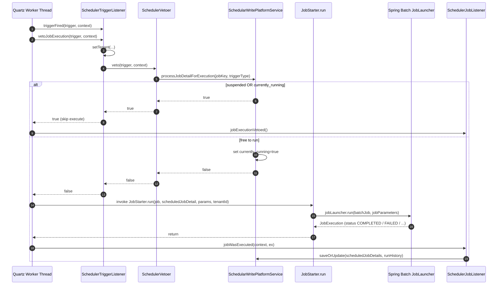

The Quartz integration is the **outer ring** of Apache Fineract's background-jobs stack. It owns wall-clock time. It owns cron expressions. It owns "this trigger fired but should we actually let the job run?" decisions. When everything is working it is invisible — but when a job stalls, a tenant is suspended or two managers race to fire the same job, this is the layer that has the answer. This page walks through the bean wiring, the per-tenant scheduler map, the four Quartz listeners and the two REST resources operators use to drive it.

## The control surface

Two REST resources sit on top of the Quartz layer:

```text
/v1/scheduler           ← SchedulerApiResource     (status / start / stop)
/v1/jobs                ← SchedulerJobApiResource  (list / get / runhistory / execute / update)
```

And one Quartz service ties them together:

```text
JobRegisterService                    ← interface; the public façade
JobRegisterServiceImpl                ← Quartz + Spring Batch wiring (~400 lines)
JobSchedulerServiceImpl               ← ContextRefreshedEvent: schedules all jobs at boot
```

Everything else — the listeners, the vetoer, the JPA writer, the `job_run_history` rows — is reached from these.

## `SchedulerApiResource` — global scheduler status

The simplest endpoint just reports whether the scheduler is "Active" (running) or "Standby" (suspended):

```text fineract-provider/src/main/java/org/apache/fineract/infrastructure/jobs/api/SchedulerApiResource.java
@Path("/v1/scheduler")
@Component
@Tag(name = "Scheduler", description = "")
public class SchedulerApiResource {
    ...
    @GET
    @Produces({ MediaType.APPLICATION_JSON })
    public String retrieveStatus(@Context final UriInfo uriInfo) {
        this.context.authenticatedUser().validateHasReadPermission(SchedulerJobApiConstants.SCHEDULER_RESOURCE_NAME);
        final boolean isSchedulerRunning = this.jobRegisterService.isSchedulerRunning();
        ...
        final SchedulerDetailData schedulerDetailData = new SchedulerDetailData().setActive(isSchedulerRunning);
        return this.toApiJsonSerializer.serialize(...);
    }

    @POST
    public Response changeSchedulerStatus(
            @QueryParam(SchedulerJobApiConstants.COMMAND) final String commandParam) {
        final boolean hasNotPermission = this.context.authenticatedUser()
            .hasNotPermissionForAnyOf("ALL_FUNCTIONS", "UPDATE_SCHEDULER");
        if (hasNotPermission) {
            throw new NoAuthorizationException("User has no authority to update scheduler status");
        }
        Response response = Response.status(400).build();
        if (is(commandParam, SchedulerJobApiConstants.COMMAND_START_SCHEDULER)) {
            this.jobRegisterService.startScheduler();
            response = Response.status(202).build();
        } else if (is(commandParam, SchedulerJobApiConstants.COMMAND_STOP_SCHEDULER)) {
            this.jobRegisterService.pauseScheduler();
            response = Response.status(202).build();
        } else {
            throw new UnrecognizedQueryParamException(SchedulerJobApiConstants.COMMAND, commandParam);
        }
        return response;
    }
}
```

The four commands and their constants are in `SchedulerJobApiConstants`:

```text fineract-provider/src/main/java/org/apache/fineract/infrastructure/jobs/api/SchedulerJobApiConstants.java
public static final String COMMAND_EXECUTE_JOB = "executeJob";
public static final String COMMAND_STOP_SCHEDULER = "stop";
public static final String COMMAND_START_SCHEDULER = "start";
public static final String COMMAND = "command";
```

So:

- `GET  /v1/scheduler` → `{ "active": true|false }`
- `POST /v1/scheduler?command=start` → resumes the per-tenant scheduler; runs misfired jobs
- `POST /v1/scheduler?command=stop` → suspends (so cron fires get vetoed)

"Suspend" does **not** stop the Quartz scheduler. It just flips `scheduler_detail.is_suspended = true`. The `SchedulerVetoer` reads that flag every time a trigger fires.

## `SchedulerJobApiResource` — per-job CRUD + run-now

This is the heavier resource:

```text fineract-provider/src/main/java/org/apache/fineract/infrastructure/jobs/api/SchedulerJobApiResource.java
@Path("/v1/jobs")
@Component
@RequiredArgsConstructor
@Tag(name = "SCHEDULER JOB", description = "Batch jobs (also known as cron jobs on Unix-based systems) are a series of back-end jobs ...
   The scheduler status can be either \"Active\" or \"Standby\". If the scheduler status is Active, it indicates that all batch jobs are running/ will run as per the specified schedule.
   If the scheduler status is Standby, it will ensure all scheduled batch runs are suspended.")
public class SchedulerJobApiResource {
    ...
}
```

The methods are:

| Verb / Path                                            | Operation              | Backed by                                                 |
| ------------------------------------------------------ | ---------------------- | --------------------------------------------------------- |
| `GET /v1/jobs`                                          | List all               | `SchedulerJobRunnerReadService.findAllJobDetails()`        |
| `GET /v1/jobs/{jobId}`                                  | Get one by id          | `schedulerJobRunnerReadService.retrieveOne(...)`           |
| `GET /v1/jobs/short-name/{shortName}`                   | Get one by short name  | same, with `IdTypeResolver.resolve(SHORT_NAME_PARAM)`     |
| `GET /v1/jobs/{jobId}/runhistory`                       | Paged history          | `retrieveJobHistory(...)`                                  |
| `GET /v1/jobs/short-name/{shortName}/runhistory`        | Paged history (short)  | same                                                       |
| `POST /v1/jobs/{jobId}?command=executeJob`              | Run now                | `ExecuteJobCommandHandler` → `JobRegisterService`         |
| `POST /v1/jobs/short-name/{shortName}?command=executeJob` | Run now (short)        | same                                                       |
| `PUT /v1/jobs/{jobId}`                                  | Update display/cron/active | `UpdateJobDetailCommandhandler` → `SchedularWritePlatformService.updateJobDetail` |
| `PUT /v1/jobs/short-name/{shortName}`                   | Same with short name   | same                                                       |

### Run-now is gated by instance mode

`executeJob` only fires if this node is configured as a batch manager:

```text fineract-provider/src/main/java/org/apache/fineract/infrastructure/jobs/api/SchedulerJobApiResource.java
private Response executeJob(@NotNull IdTypeResolver.IdType idType, String identifier, String commandParam, String jsonRequestBody) {
    Response response;
    if (fineractProperties.getMode().isBatchManagerEnabled()) {
        final boolean hasNotPermission = context.authenticatedUser()
            .hasNotPermissionForAnyOf("ALL_FUNCTIONS", "EXECUTEJOB_SCHEDULER");
        if (hasNotPermission) {
            throw new NoAuthorizationException("User has no authority to execute scheduler jobs");
        }
        response = Response.status(400).build();
        if (is(commandParam, SchedulerJobApiConstants.COMMAND_EXECUTE_JOB)) {
            Long jobId = schedulerJobRunnerReadService.retrieveId(idType, identifier);
            final CommandWrapper commandRequest = new CommandWrapperBuilder()
                .executeSchedulerJob(jobId)
                .withJson(jsonRequestBody)
                .build();
            commandsSourceWritePlatformService.logCommandSource(commandRequest);
            response = Response.status(202).build();
        } else {
            throw new UnrecognizedQueryParamException(SchedulerJobApiConstants.COMMAND, commandParam);
        }
    } else {
        ApiGlobalErrorResponse errorResponse = ApiGlobalErrorResponse.invalidInstanceTypeMethod("Batch");
        response = Response.status(Status.METHOD_NOT_ALLOWED).entity(errorResponse).build();
    }
    return response;
}
```

A read-only or worker-only node returns `405 Method Not Allowed` with `invalidInstanceTypeMethod("Batch")`.

The command flows through the standard command-source pipeline (see `command/overview`). The handler is:

```text fineract-provider/src/main/java/org/apache/fineract/infrastructure/jobs/handler/ExecuteJobCommandHandler.java
@Service
@RequiredArgsConstructor
@CommandType(entity = "SCHEDULER", action = "EXECUTEJOB")
public class ExecuteJobCommandHandler implements NewCommandSourceHandler {

    private final JobRegisterService jobRegisterService;

    @Override
    public CommandProcessingResult processCommand(final JsonCommand command) {
        final Long jobId = command.entityId();
        jobRegisterService.executeJobWithParameters(jobId, command.json());
        return new CommandProcessingResultBuilder()
            .withCommandId(command.commandId())
            .withEntityId(jobId)
            .build();
    }
}
```

### Update auto-reschedules

`PUT /v1/jobs/{jobId}` validates the body (display name, cron expression, active flag) and, if either `active` or `cronExpression` actually changed, reschedules the job in Quartz:

```text fineract-provider/src/main/java/org/apache/fineract/infrastructure/jobs/api/SchedulerJobApiResource.java
private String updateJobDetail(@NotNull IdTypeResolver.IdType idType, String identifier, String jsonRequestBody) {
    Long jobId = schedulerJobRunnerReadService.retrieveId(idType, identifier);
    final CommandWrapper commandRequest = new CommandWrapperBuilder()
        .updateJobDetail(jobId)
        .withJson(jsonRequestBody)
        .build();
    final CommandProcessingResult result = this.commandsSourceWritePlatformService.logCommandSource(commandRequest);
    if (result.getChanges() != null
            && (result.getChanges().containsKey(SchedulerJobApiConstants.jobActiveStatusParamName)
                || result.getChanges().containsKey(SchedulerJobApiConstants.cronExpressionParamName))) {
        this.jobRegisterService.rescheduleJob(jobId);
    }
    return this.toApiJsonSerializer.serialize(result);
}
```

The cron expression is validated via `DataValidatorBuilder.validateCronExpression()` inside `JobDetailDataValidator`. The boolean active flag must be `"true"` or `"false"` and is parsed via `validateForBooleanValue()`.

## `JobRegisterService` — the public façade

```text fineract-provider/src/main/java/org/apache/fineract/infrastructure/jobs/service/JobRegisterService.java
public interface JobRegisterService {
    void executeJobWithParameters(Long jobId, String jobParametersJson);
    void rescheduleJob(Long jobId);
    void pauseScheduler();
    void startScheduler();
    boolean isSchedulerRunning();
    void stopScheduler(String name);
    void scheduleJob(ScheduledJobDetail scheduledJobDetails);
    void stopAllSchedulers();
}
```

Everything here is implemented by `JobRegisterServiceImpl`, which extends `ApplicationListener<ContextClosedEvent>` so it can shut down every scheduler when Spring Boot tears down.

### The scheduler map

`JobRegisterServiceImpl` keeps **one Quartz scheduler per tenant** (or per `(tenant, scheduler_group)`):

```text fineract-provider/src/main/java/org/apache/fineract/infrastructure/jobs/service/JobRegisterServiceImpl.java
private static final HashMap<String, Scheduler> SCHEDULERS = new HashMap<>(4);

private String getSchedulerName(final ScheduledJobDetail scheduledJobDetail) {
    final StringBuilder sb = new StringBuilder(20);
    final FineractPlatformTenant tenant = ThreadLocalContextUtil.getTenant();
    sb.append(SchedulerServiceConstants.SCHEDULER).append(tenant.getId());
    if (scheduledJobDetail.getSchedulerGroup() > 0) {
        sb.append(SchedulerServiceConstants.SCHEDULER_GROUP).append(scheduledJobDetail.getSchedulerGroup());
    }
    return sb.toString();
}
```

So the key is `"Scheduler<tenantId>"` or `"Scheduler<tenantId>group<schedulerGroup>"`. The values come from `SchedulerServiceConstants`:

```text fineract-provider/src/main/java/org/apache/fineract/infrastructure/jobs/service/SchedulerServiceConstants.java
String SCHEDULER = "Scheduler";
String SCHEDULER_GROUP = "group";
int DEFAULT_THREAD_COUNT = 7;
int GROUP_THREAD_COUNT = 1;
```

A scheduler is lazily created the first time a job for that tenant gets scheduled:

```text fineract-provider/src/main/java/org/apache/fineract/infrastructure/jobs/service/JobRegisterServiceImpl.java
private Scheduler getScheduler(final ScheduledJobDetail scheduledJobDetail) throws Exception {
    final String schedulername = getSchedulerName(scheduledJobDetail);
    Scheduler scheduler = SCHEDULERS.get(schedulername);
    if (scheduler == null) {
        int noOfThreads = SchedulerServiceConstants.DEFAULT_THREAD_COUNT;
        if (scheduledJobDetail.getSchedulerGroup() > 0) {
            noOfThreads = SchedulerServiceConstants.GROUP_THREAD_COUNT;
        }
        scheduler = createScheduler(schedulername, noOfThreads, schedulerJobListener);
        SCHEDULERS.put(schedulername, scheduler);
    }
    return scheduler;
}
```

Grouped jobs (`scheduler_group > 0`) get a 1-thread scheduler — they cannot run concurrently with anything else in their group.

### Creating a scheduler

```text fineract-provider/src/main/java/org/apache/fineract/infrastructure/jobs/service/JobRegisterServiceImpl.java
private Scheduler createScheduler(final String name, final int noOfThreads, JobListener... jobListeners) throws Exception {
    final SchedulerFactoryBean schedulerFactoryBean = new SchedulerFactoryBean();
    schedulerFactoryBean.setSchedulerName(name);
    schedulerFactoryBean.setGlobalJobListeners(jobListeners);
    final TriggerListener[] globalTriggerListeners = { globalSchedulerTriggerListener };
    schedulerFactoryBean.setGlobalTriggerListeners(globalTriggerListeners);
    final Properties quartzProperties = new Properties();
    quartzProperties.put(SchedulerFactoryBean.PROP_THREAD_COUNT, Integer.toString(noOfThreads));
    schedulerFactoryBean.setQuartzProperties(quartzProperties);
    schedulerFactoryBean.afterPropertiesSet();
    schedulerFactoryBean.start();
    return schedulerFactoryBean.getScheduler();
}
```

Each scheduler always gets the **global** `SchedulerTriggerListener` and a per-scheduler `SchedulerJobListener`. Temporary one-shot schedulers (created by `executeJob` when the job has no cron) also get a `SchedulerStopListener`.

### Scheduling a job

`scheduleJob` is what `JobSchedulerServiceImpl` calls for every row in `job` at startup:

```text fineract-provider/src/main/java/org/apache/fineract/infrastructure/jobs/service/JobRegisterServiceImpl.java
@Override
public void scheduleJob(final ScheduledJobDetail scheduledJobDetails) {
    try {
        final JobDetail jobDetail = createJobDetail(scheduledJobDetails, Collections.emptySet());
        scheduledJobDetails.setJobKey(getJobKeyAsString(jobDetail.getKey()));
        if (!scheduledJobDetails.isActiveSchedular()) {
            scheduledJobDetails.setNextRunTime(null);
            scheduledJobDetails.setCurrentlyRunning(false);
            return;
        }

        final Trigger trigger = createTrigger(scheduledJobDetails, jobDetail);
        final Scheduler scheduler = getScheduler(scheduledJobDetails);
        scheduler.scheduleJob(jobDetail, trigger);
        scheduledJobDetails.setNextRunTime(trigger.getNextFireTime());
        scheduledJobDetails.setErrorLog(null);
    } catch (final Exception throwable) {
        scheduledJobDetails.setNextRunTime(null);
        final String stackTrace = getStackTraceAsString(throwable);
        scheduledJobDetails.setErrorLog(stackTrace);
        log.warn("Could not schedule job: {}", scheduledJobDetails.getJobName(), throwable);
    }
    scheduledJobDetails.setCurrentlyRunning(false);
}
```

`createJobDetail` builds a `MethodInvokingJobDetailFactoryBean` that targets `JobStarter.run(...)`:

```text fineract-provider/src/main/java/org/apache/fineract/infrastructure/jobs/service/JobRegisterServiceImpl.java
private JobDetail createJobDetail(final ScheduledJobDetail scheduledJobDetail, Set<JobParameterDTO> jobParameterDTOSet)
        throws Exception {
    final FineractPlatformTenant tenant = ThreadLocalContextUtil.getTenant();

    JobNameData jobName = jobNameService.getJobByHumanReadableName(scheduledJobDetail.getJobName());
    Job job;
    try {
        job = jobLocator.getJob(jobName.getEnumStyleName());
    } catch (NoSuchJobException e) {
        throw new JobIsNotFoundOrNotEnabledException(e, jobName.getEnumStyleName());
    }

    final MethodInvokingJobDetailFactoryBean jobDetailFactoryBean = new MethodInvokingJobDetailFactoryBean();
    jobDetailFactoryBean.setName(scheduledJobDetail.getJobName() + "JobDetail" + tenant.getId());
    jobDetailFactoryBean.setTargetObject(jobStarter);
    jobDetailFactoryBean.setTargetMethod(JOB_STARTER_METHOD_NAME);  // "run"
    jobDetailFactoryBean.setGroup(scheduledJobDetail.getGroupName());
    jobDetailFactoryBean.setConcurrent(false);

    jobDetailFactoryBean.setArguments(job, scheduledJobDetail, jobParameterDTOSet, tenant.getTenantIdentifier());
    jobDetailFactoryBean.afterPropertiesSet();
    return jobDetailFactoryBean.getObject();
}
```

Key things to notice:

- `jobLocator.getJob(enumStyleName)` looks up the Spring Batch `Job` bean by its enum-style name (e.g. `"LOAN_COB"`). If the bean isn't registered — most often because the module hosting it is disabled — the code throws `JobIsNotFoundOrNotEnabledException`.
- `setConcurrent(false)` is critical: Quartz will not run two instances of the same Spring Batch job in parallel, even if the trigger fires while the previous run is still going.
- The `JobStarter.run` call site receives the Spring Batch `Job`, the `ScheduledJobDetail`, the `Set<JobParameterDTO>` (empty for cron, populated for `executeJob` with JSON params) and the tenant identifier as a string.

### Creating the trigger

```text fineract-provider/src/main/java/org/apache/fineract/infrastructure/jobs/service/JobRegisterServiceImpl.java
private Trigger createTrigger(final ScheduledJobDetail scheduledJobDetails, final JobDetail jobDetail) throws ParseException {
    final FineractPlatformTenant tenant = ThreadLocalContextUtil.getTenant();
    final CronTriggerFactoryBean cronTriggerFactoryBean = new CronTriggerFactoryBean();
    cronTriggerFactoryBean.setName(scheduledJobDetails.getJobName() + "Trigger" + tenant.getId());
    cronTriggerFactoryBean.setJobDetail(jobDetail);
    final JobDataMap jobDataMap = new JobDataMap();
    jobDataMap.put(SchedulerServiceConstants.TENANT_IDENTIFIER, tenant.getTenantIdentifier());
    cronTriggerFactoryBean.setJobDataMap(jobDataMap);
    final TimeZone timeZone = TimeZone.getTimeZone(tenant.getTimezoneId());
    cronTriggerFactoryBean.setTimeZone(timeZone);
    cronTriggerFactoryBean.setGroup(scheduledJobDetails.getGroupName());
    cronTriggerFactoryBean.setCronExpression(scheduledJobDetails.getCronExpression());
    cronTriggerFactoryBean.setPriority(scheduledJobDetails.getTaskPriority());
    cronTriggerFactoryBean.afterPropertiesSet();
    return cronTriggerFactoryBean.getObject();
}
```

Every trigger is wall-clocked to the **tenant's** time zone (`tenant.getTimezoneId()`), not the JVM's. This matters in multi-tenant deployments where each tenant has its own "midnight."

### Starting / pausing the scheduler

```text fineract-provider/src/main/java/org/apache/fineract/infrastructure/jobs/service/JobRegisterServiceImpl.java
@Override
public void pauseScheduler() {
    final SchedulerDetail schedulerDetail = this.schedularWritePlatformService.retriveSchedulerDetail();
    if (!schedulerDetail.isSuspended()) {
        schedulerDetail.setSuspended(true);
        this.schedularWritePlatformService.updateSchedulerDetail(schedulerDetail);
    }
}

@Override
public void startScheduler() {
    final SchedulerDetail schedulerDetail = this.schedularWritePlatformService.retriveSchedulerDetail();
    if (schedulerDetail.isSuspended()) {
        schedulerDetail.setSuspended(false);
        this.schedularWritePlatformService.updateSchedulerDetail(schedulerDetail);
        if (schedulerDetail.isExecuteInstructionForMisfiredJobs()) {
            final List<ScheduledJobDetail> scheduledJobDetails = this.schedularWritePlatformService
                .retrieveAllJobs(fineractProperties.getNodeId());
            for (final ScheduledJobDetail jobDetail : scheduledJobDetails) {
                if (jobDetail.isTriggerMisfired()) {
                    if (jobDetail.isActiveSchedular()) {
                        executeJob(jobDetail, SchedulerServiceConstants.TRIGGER_TYPE_CRON, Collections.emptySet());
                        jobDetail.setMismatchedJob(false);
                    }
                    ...
                    jobDetail.setTriggerMisfired(false);
                    this.schedularWritePlatformService.saveOrUpdate(jobDetail);
                }
            }
        }
    }
}
```

`startScheduler` doesn't actually call `scheduler.start()` — Quartz is already running. It just flips the suspended bit. The bonus, controlled by `scheduler_detail.executeInstructionForMisfiredJobs`, is to immediately run any cron job that was due to fire during the suspension window.

### Run-now: temporary schedulers

When `executeJobWithParameters` is called for a job whose cron is disabled (or simply for a one-off run), `executeJob` is what actually runs:

```text fineract-provider/src/main/java/org/apache/fineract/infrastructure/jobs/service/JobRegisterServiceImpl.java
public void executeJob(final ScheduledJobDetail scheduledJobDetail, String triggerType, Set<JobParameterDTO> jobParameterDTOSet) {
    try {
        final JobDataMap jobDataMap = new JobDataMap();
        if (triggerType == null) {
            triggerType = SchedulerServiceConstants.TRIGGER_TYPE_APPLICATION;
        }
        jobDataMap.put(SchedulerServiceConstants.TRIGGER_TYPE_REFERENCE, triggerType);
        jobDataMap.put(SchedulerServiceConstants.TENANT_IDENTIFIER, ThreadLocalContextUtil.getTenant().getTenantIdentifier());
        final String schedulerName = getSchedulerName(scheduledJobDetail);
        final Scheduler scheduler = SCHEDULERS.get(schedulerName);
        final JobDetail jobDetail = createJobDetail(scheduledJobDetail, jobParameterDTOSet);
        JobKey jobKey = jobDetail.getKey();
        if (scheduler == null || !scheduler.checkExists(jobKey)) {
            SchedulerStopListener schedulerStopListener = new SchedulerStopListener(this);
            final String tempSchedulerName = "temp" + scheduledJobDetail.getId();
            final Scheduler tempScheduler = createScheduler(tempSchedulerName, 1, schedulerJobListener, schedulerStopListener);
            jobDataMap.put(SchedulerServiceConstants.SCHEDULER_NAME, tempSchedulerName);
            SCHEDULERS.put(tempSchedulerName, tempScheduler);
            tempScheduler.addJob(jobDetail, true);
            tempScheduler.triggerJob(jobKey, jobDataMap);
        } else {
            scheduler.addJob(jobDetail, true);
            scheduler.triggerJob(jobKey, jobDataMap);
        }
    } catch (JobIsNotFoundOrNotEnabledException e) {
        ...
    } catch (final Exception e) {
        ...
        throw new PlatformInternalServerException("error.msg.scheduler.job.execution.failed", msg, scheduledJobDetail.getId(), e);
    }
}
```

The temporary scheduler is single-threaded and gets a `SchedulerStopListener` whose only purpose is to shut the scheduler down once the one job is done. That listener is described below.

### Node-aware execution

A multi-instance deployment can have several batch managers. To prevent two from firing the same job, `ScheduledJobDetail.nodeId` pins a job to a specific instance:

```text fineract-provider/src/main/java/org/apache/fineract/infrastructure/jobs/service/JobRegisterServiceImpl.java
@Override
public void executeJobWithParameters(final Long jobId, String jobParametersJson) {
    Set<JobParameterDTO> jobParameterDTOSet = dataParser.parseExecution(jobParametersJson);
    final ScheduledJobDetail scheduledJobDetail = this.schedularWritePlatformService.findByJobId(jobId);
    if (scheduledJobDetail == null) {
        throw new JobNotFoundException(String.valueOf(jobId));
    }
    final String nodeIdStored = scheduledJobDetail.getNodeId().toString();

    if (nodeIdStored.equals(fineractProperties.getNodeId()) || nodeIdStored.equals("0")) {
        executeJob(scheduledJobDetail, null, jobParameterDTOSet);
    } else {
        scheduledJobDetail.setMismatchedJob(true);
        this.schedularWritePlatformService.saveOrUpdate(scheduledJobDetail);
        throw new JobNodeIdMismatchingException(nodeIdStored, fineractProperties.getNodeId());
    }
}
```

`nodeId = 0` is the wildcard — any node will run it. Any other value pins the job to that node. If the wrong node tries, the `JobNodeIdMismatchingException` is thrown and the job is marked `mismatchedJob = true` so an operator can see it in the UI.

## The four Quartz listeners

| Listener                  | Type             | When it runs                            | What it does |
| ------------------------- | ---------------- | --------------------------------------- | ------------ |
| `SchedulerTriggerListener` | `TriggerListener` | Before every fire                       | Initializes tenant context, delegates to vetoer |
| `SchedulerVetoer`         | (called from above)| Inside `vetoJobExecution`              | Decides skip/run; loads businessDates |
| `SchedulerJobListener`    | `JobListener`    | After every fire                        | Writes `job_run_history` row, advances `next_run_time` |
| `SchedulerStopListener`   | `JobListener`    | After the single fire on a temp scheduler | Shuts down the temp scheduler in a background thread |

### `SchedulerTriggerListener`

```text fineract-provider/src/main/java/org/apache/fineract/infrastructure/jobs/service/SchedulerTriggerListener.java
@Component
public class SchedulerTriggerListener implements TriggerListener {

    private final TenantDetailsService tenantDetailsService;
    private final SchedulerVetoer schedulerVetoer;

    @Override public String getName() { return "Fineract Global Scheduler Trigger Listener"; }

    @Override
    public boolean vetoJobExecution(final Trigger trigger, final JobExecutionContext context) {
        final String tenantIdentifier = trigger.getJobDataMap().getString(SchedulerServiceConstants.TENANT_IDENTIFIER);
        final FineractPlatformTenant existingTenant = ThreadLocalContextUtil.getTenant();
        boolean contextInitialized = false;
        try {
            if (existingTenant == null || !existingTenant.getTenantIdentifier().equals(tenantIdentifier)) {
                contextInitialized = true;
                final FineractPlatformTenant tenant = tenantDetailsService.loadTenantById(tenantIdentifier);
                ThreadLocalContextUtil.setTenant(tenant);
                ThreadLocalContextUtil.setActionContext(ActionContext.DEFAULT);
            }
            return schedulerVetoer.veto(trigger, context);
        } finally {
            if (contextInitialized) {
                ThreadLocalContextUtil.reset();
            }
        }
    }

    @Override public void triggerFired(Trigger trigger, JobExecutionContext context) { log.debug(...); }
    @Override public void triggerMisfired(final Trigger trigger) { log.error("triggerMisfired() trigger={}", trigger); }
    @Override public void triggerComplete(...) { log.debug(...); }
}
```

The contract: returning `true` from `vetoJobExecution` makes Quartz **skip** this fire entirely (the `execute` method is not called). The listener installs the tenant on the current thread before asking the vetoer.

### `SchedulerVetoer`

```text fineract-provider/src/main/java/org/apache/fineract/infrastructure/jobs/service/SchedulerVetoer.java
@Component
@RequiredArgsConstructor
public class SchedulerVetoer {

    private final SchedularWritePlatformService schedularService;
    private final BusinessDateReadPlatformService businessDateReadPlatformService;

    @Transactional(isolation = Isolation.READ_COMMITTED)
    public boolean veto(Trigger trigger, JobExecutionContext context) {
        String tenantIdentifier = trigger.getJobDataMap().getString(SchedulerServiceConstants.TENANT_IDENTIFIER);
        HashMap<BusinessDateType, LocalDate> businessDates = businessDateReadPlatformService.getBusinessDates();
        ThreadLocalContextUtil.setBusinessDates(businessDates);
        JobKey key = trigger.getJobKey();
        String jobKey = key.getName() + SchedulerServiceConstants.JOB_KEY_SEPERATOR + key.getGroup();
        String triggerType = SchedulerServiceConstants.TRIGGER_TYPE_CRON;
        if (context.getMergedJobDataMap().containsKey(SchedulerServiceConstants.TRIGGER_TYPE_REFERENCE)) {
            triggerType = context.getMergedJobDataMap().getString(SchedulerServiceConstants.TRIGGER_TYPE_REFERENCE);
        }
        boolean vetoJob = schedularService.processJobDetailForExecution(jobKey, triggerType);
        if (vetoJob) {
            log.warn("vetoJobExecution() WILL veto the execution ... tenant={}, jobKey={}, triggerType={}, ...", ...);
        }
        return vetoJob;
    }
}
```

The decision is delegated to `SchedularWritePlatformService.processJobDetailForExecution(jobKey, triggerType)`, which encapsulates the rules:

- Veto if `scheduler_detail.is_suspended = true` **and** triggerType is `cron` (manual fires bypass the suspension).
- Veto if the job's row says `currently_running = true` already.
- Otherwise, atomically set `currently_running = true` and return `false` (don't veto, run).

The transaction is `READ_COMMITTED` so two managers racing to fire the same job see consistent state for the `currently_running` flag.

### `SchedulerJobListener`

```text fineract-provider/src/main/java/org/apache/fineract/infrastructure/jobs/service/SchedulerJobListener.java
@Component
@RequiredArgsConstructor
public class SchedulerJobListener implements JobListener {

    private final SchedularWritePlatformService schedularService;
    private final TenantDetailsService tenantDetailsService;

    @Override public String getName() { return SchedulerServiceConstants.DEFAULT_LISTENER_NAME; }
    @Override public void jobToBeExecuted(...) {}
    @Override public void jobExecutionVetoed(...) {}

    @Override
    public void jobWasExecuted(final JobExecutionContext context, final JobExecutionException jobException) {
        ...
        final Trigger trigger = context.getTrigger();
        final JobKey key = context.getJobDetail().getKey();
        final String jobKey = key.getName() + SchedulerServiceConstants.JOB_KEY_SEPERATOR + key.getGroup();
        final ScheduledJobDetail scheduledJobDetails = this.schedularService.findByJobKey(jobKey);
        final Long version = this.schedularService.fetchMaxVersionBy(jobKey) + 1;
        String status = SchedulerServiceConstants.STATUS_SUCCESS;
        String errorMessage = null;
        String errorLog = null;
        if (jobException != null) {
            status = SchedulerServiceConstants.STATUS_FAILED;
            final Throwable throwable = getCauseFromException(jobException, 0);
            ...
            errorMessage = throwable.getMessage();
            errorLog = sb.toString();
        }
        String triggerType = SchedulerServiceConstants.TRIGGER_TYPE_CRON;
        if (context.getMergedJobDataMap().containsKey(SchedulerServiceConstants.TRIGGER_TYPE_REFERENCE)) {
            triggerType = context.getMergedJobDataMap().getString(SchedulerServiceConstants.TRIGGER_TYPE_REFERENCE);
        }
        if (SchedulerServiceConstants.TRIGGER_TYPE_CRON.equals(triggerType) && trigger.getNextFireTime() != null
                && trigger.getNextFireTime().after(scheduledJobDetails.getNextRunTime())) {
            scheduledJobDetails.setNextRunTime(trigger.getNextFireTime());
        }

        scheduledJobDetails.setPreviousRunStartTime(context.getFireTime());
        scheduledJobDetails.setCurrentlyRunning(false);

        final ScheduledJobRunHistory runHistory = new ScheduledJobRunHistory().setScheduledJobDetail(scheduledJobDetails)
            .setVersion(version).setStartTime(context.getFireTime()).setEndTime(new Date()).setStatus(status)
            .setErrorMessage(errorMessage).setTriggerType(triggerType).setErrorLog(errorLog);

        this.schedularService.saveOrUpdate(scheduledJobDetails, runHistory);
        ...
    }

    private Throwable getCauseFromException(final Throwable exception, final int stackTraceLevel) {
        if (stackTraceLevel <= SchedulerServiceConstants.STACK_TRACE_LEVEL && exception.getCause() != null
                && (exception.getCause().toString().contains(SchedulerServiceConstants.SCHEDULER_EXCEPTION)
                    || exception.getCause().toString().contains(SchedulerServiceConstants.JOB_EXECUTION_EXCEPTION)
                    || exception.getCause().toString().contains(SchedulerServiceConstants.JOB_METHOD_INVOCATION_FAILED_EXCEPTION))) {
            return getCauseFromException(exception.getCause(), stackTraceLevel + 1);
        } else if (exception.getCause() != null) {
            return exception.getCause();
        }
        return exception;
    }
}
```

This is what produces the rows operators see when they `GET /v1/jobs/{id}/runhistory`. The `getCauseFromException` walk skips up to seven Quartz / Spring Batch wrapper exceptions to find the actual root cause string — so the `errorMessage` column in `job_run_history` is the meaningful one, not "JobMethodInvocationFailedException."

### `SchedulerStopListener`

```text fineract-provider/src/main/java/org/apache/fineract/infrastructure/jobs/service/SchedulerStopListener.java
public class SchedulerStopListener implements JobListener {

    private static final String SINGLE_TRIGGER_GLOBAL_LISTENER = "Single Trigger Global Listener";

    // MIFOSX-1184: This class cannot use constructor injection, because one of
    // its dependencies (SchedulerStopListener) has a circular dependency to
    // itself. So, slightly differently from how it's done elsewhere in this
    // code base, the following fields are not final, and there is no
    // constructor, but setters.
    private JobRegisterService jobRegisterService;

    public SchedulerStopListener(JobRegisterService jobRegisterService) {
        this.jobRegisterService = jobRegisterService;
    }

    @Override public String getName() { return SINGLE_TRIGGER_GLOBAL_LISTENER; }
    @Override public void jobToBeExecuted(...) {}
    @Override public void jobExecutionVetoed(...) {}

    @Override
    public void jobWasExecuted(final JobExecutionContext context, final JobExecutionException jobException) {
        final String schedulerName = context.getTrigger().getJobDataMap().getString(SchedulerServiceConstants.SCHEDULER_NAME);
        if (schedulerName != null) {
            final Thread newThread = new Thread(() -> SchedulerStopListener.this.jobRegisterService.stopScheduler(schedulerName));
            newThread.start();
        }
    }
}
```

The "shut down in a background thread" pattern is mandatory: Quartz cannot kill the scheduler instance from inside one of its own worker threads — it would deadlock waiting for itself to finish.

## Control flow at a fire



## `SchedularWritePlatformService` — the persistence side

```text fineract-provider/src/main/java/org/apache/fineract/infrastructure/jobs/service/SchedularWritePlatformService.java
public interface SchedularWritePlatformService {
    List<ScheduledJobDetail> retrieveAllJobs(String nodeId);
    ScheduledJobDetail findByJobKey(String triggerKey);
    void saveOrUpdate(ScheduledJobDetail scheduledJobDetails);
    void saveOrUpdate(ScheduledJobDetail scheduledJobDetails, ScheduledJobRunHistory scheduledJobRunHistory);
    Long fetchMaxVersionBy(String triggerKey);
    ScheduledJobDetail findByJobId(Long jobId);
    CommandProcessingResult updateJobDetail(Long jobId, JsonCommand command);
    SchedulerDetail retriveSchedulerDetail();
    void updateSchedulerDetail(SchedulerDetail schedulerDetail);
    boolean processJobDetailForExecution(String jobKey, String triggerType);
}
```

The implementation (`SchedularWritePlatformServiceJpaRepositoryImpl`) is plain JPA on top of the `job`, `job_run_history` and `scheduler_detail` tables. The interesting method — and the one with veto authority — is `processJobDetailForExecution`, which rolls the "suspended? currently running? mark me running" decision into a single transactional unit.

`UpdateJobDetailCommandhandler` is the back-end of `PUT /v1/jobs/{jobId}`:

```text fineract-provider/src/main/java/org/apache/fineract/infrastructure/jobs/handler/UpdateJobDetailCommandhandler.java
@Service
@CommandType(entity = "SCHEDULER", action = "UPDATE")
public class UpdateJobDetailCommandhandler implements NewCommandSourceHandler {

    private final SchedularWritePlatformService schedularWritePlatformService;

    @Override
    public CommandProcessingResult processCommand(final JsonCommand command) {
        return this.schedularWritePlatformService.updateJobDetail(command.entityId(), command);
    }
}
```

## Boot wiring: `JobSchedulerServiceImpl`

```text fineract-provider/src/main/java/org/apache/fineract/infrastructure/jobs/service/JobSchedulerServiceImpl.java
@Component
@RequiredArgsConstructor
@Slf4j
public class JobSchedulerServiceImpl implements ApplicationListener<ContextRefreshedEvent> {

    private final FineractProperties fineractProperties;
    private final SchedularWritePlatformService schedularWritePlatformService;
    private final TenantDetailsService tenantDetailsService;
    private final JobRegisterService jobRegisterService;
    private final BusinessDateReadPlatformService businessDateReadPlatformService;

    @Override
    public void onApplicationEvent(ContextRefreshedEvent event) {
        if (!fineractProperties.getMode().isBatchManagerEnabled()) {
            log.warn("Batch job scheduling is disabled since this instance is not a batch manager");
            return;
        }
        final List<FineractPlatformTenant> allTenants = tenantDetailsService.findAllTenants();
        for (final FineractPlatformTenant tenant : allTenants) {
            ThreadLocalContextUtil.setTenant(tenant);
            HashMap<BusinessDateType, LocalDate> businessDates = businessDateReadPlatformService.getBusinessDates();
            ThreadLocalContextUtil.setActionContext(ActionContext.DEFAULT);
            ThreadLocalContextUtil.setBusinessDates(businessDates);
            final List<ScheduledJobDetail> scheduledJobDetails = schedularWritePlatformService
                .retrieveAllJobs(fineractProperties.getNodeId());
            for (final ScheduledJobDetail jobDetails : scheduledJobDetails) {
                try {
                    jobRegisterService.scheduleJob(jobDetails);
                } catch (JobIsNotFoundOrNotEnabledException e) {
                    log.warn("{}", e.getMessage());
                }
                jobDetails.setTriggerMisfired(false);
                schedularWritePlatformService.saveOrUpdate(jobDetails);
            }
            final SchedulerDetail schedulerDetail = schedularWritePlatformService.retriveSchedulerDetail();
            if (schedulerDetail.isResetSchedulerOnBootup()) {
                schedulerDetail.setSuspended(false);
                schedularWritePlatformService.updateSchedulerDetail(schedulerDetail);
            }
            ThreadLocalContextUtil.reset();
        }
        log.info("Scheduling batch jobs has finished");
    }
}
```

If `scheduler_detail.reset_scheduler_on_bootup = true`, the row is forced back to "Active" on startup even if it was suspended before the JVM was bounced. Use that on hosts that you intend to always come up running.

## Shutdown

`JobRegisterServiceImpl` also listens for `ContextClosedEvent`:

```text fineract-provider/src/main/java/org/apache/fineract/infrastructure/jobs/service/JobRegisterServiceImpl.java
/**
 * Need to use ContextClosedEvent instead of ContextStoppedEvent because in case Spring Boot fails to start-up (e.g.
 * because Tomcat port is already in use) then org.springframework.boot.SpringApplication.run(String...) does a
 * context.close(); and not a context.stop();
 */
@Override
public void onApplicationEvent(@SuppressWarnings("unused") ContextClosedEvent event) {
    this.stopAllSchedulers();
}

@Override
public void stopAllSchedulers() {
    for (Scheduler scheduler : SCHEDULERS.values()) {
        try {
            scheduler.shutdown();
        } catch (final SchedulerException e) {
            log.error("Error occured.", e);
        }
    }
}
```

Failing to handle `ContextClosedEvent` (as well as `ContextStoppedEvent`) would leave Quartz worker threads alive after a failed startup — the comment is there because somebody learned that the hard way.

## Errors operators see

The four exceptions in `jobs/exception/` are the ones that surface through this layer:

```text fineract-provider/src/main/java/org/apache/fineract/infrastructure/jobs/exception/JobNotFoundException.java
public JobNotFoundException(final String identifier) {
    super("error.msg.sheduler.job.id.invalid", "Job with identifier " + identifier + " does not exist", identifier);
}
```

```text fineract-provider/src/main/java/org/apache/fineract/infrastructure/jobs/exception/JobNodeIdMismatchingException.java
public JobNodeIdMismatchingException(final String nodeId, final String nodeIdProvided) {
    super("error.msg.job.cannot.execute.on.node." + nodeIdProvided,
        "The node id provided `" + nodeIdProvided + "`" + "` does not match with the configured nodeId.", new Object[] { nodeId });
}
```

```text fineract-provider/src/main/java/org/apache/fineract/infrastructure/jobs/exception/JobInProcessExecution.java
public JobInProcessExecution(final String identifier) {
    super("error.msg.sheduler.job.inprogress", "job execution is in process for " + identifier, identifier);
}
```

```text fineract-provider/src/main/java/org/apache/fineract/infrastructure/jobs/exception/OperationNotAllowedException.java
public OperationNotAllowedException(final String jobNames) {
    super("error.msg.sheduler.job.currently.running",
        "Execution is in-process for jobs " + jobNames + "...., so update operations are not allowed at this moment", jobNames);
}
```

- `JobNotFoundException` — `404`; jobId not in `job` table or short-name not resolved.
- `JobNodeIdMismatchingException` — `403`-ish domain rule; this node isn't allowed to run it.
- `JobInProcessExecution` — `503`; a write attempted while the job is currently_running.
- `OperationNotAllowedException` — `503`; bulk update attempted while at least one job in the set is currently_running.

## Cross-references

- `jobs/job-catalog` — what each scheduled `JobName` actually does.
- `jobs/spring-batch-partitioned-jobs` — how `JobStarter.run` hands off to `JobLauncher`.
- `jobs/inline-job-execution` — the parallel path that skips Quartz entirely.
- `jobs/stuck-job-handling` — what happens when a Spring Batch execution outlives its scheduler.
- `command/overview` — for the `executeSchedulerJob` / `updateJobDetail` command wrappers.
- `core/business-date` — for what gets stuffed into the `ThreadLocal` before a job runs.
