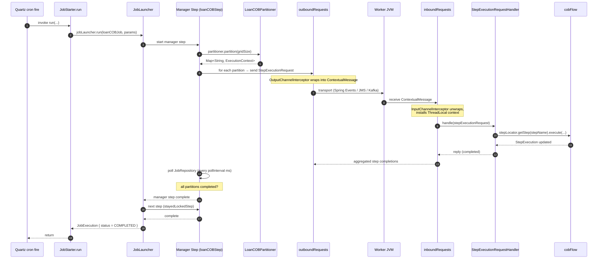

When Apache Fineract has to walk every loan in the system and run a 14-step COB pipeline against each one, no single thread is going to finish before the next business day starts. The answer is Spring Batch **partitioning**: split the work into N partitions, dispatch each partition as a `StepExecutionRequest` over a messaging channel and let M worker threads (or M worker JVMs) consume them in parallel. This page documents how Fineract wires that — the manager-side bean graph, the worker-side handler, the instance-mode switches that gate everything, and the messaging transports that connect them.

The page focuses on the generic machinery. The COB-specific partitioner — `LoanCOBPartitioner` and friends — is covered in `cob/loan-cob` and `cob/business-steps`; this page is the runtime story.

## Partitioned vs ordinary Spring Batch jobs

In Fineract, "ordinary" Spring Batch jobs are single-step tasklets — one thread, one transaction, walk-everything-once. They are what the bulk of `JobName` (see `jobs/job-catalog`) maps to. Examples: `UPDATE_NPA`, `EXECUTE_DIRTY_JOBS`, `INCREASE_COB_DATE_BY_1_DAY`.

A **partitioned** job is structurally different:

```text
┌──────────────────────────────────────────────────────────────────────────────┐
│  Manager JVM                                                                 │
│  ┌──────────────────────┐    ┌─────────────────────┐    ┌──────────────────┐ │
│  │ JobLauncher.run(...) │ -> │ Manager Step        │ -> │ Partitioner      │ │
│  │ (JobStarter)         │    │ (RemotePartitioning │    │ (LoanCOBParti-   │ │
│  │                      │    │  ManagerStepBuilder)│    │  tioner)         │ │
│  └──────────────────────┘    └──────────┬──────────┘    └──────────────────┘ │
│                                         │                                    │
│                                         ▼                                    │
│                              outboundRequests                                │
│                              (DirectChannel)                                 │
└──────────────────────────────────────────┬───────────────────────────────────┘
                                           │
                       Spring Events  ──── │ ──── JMS Queue  ──── Kafka Topic
                                           │
┌──────────────────────────────────────────┼───────────────────────────────────┐
│  Worker JVM(s)                           ▼                                    │
│                              inboundRequests                                  │
│                              (QueueChannel)                                   │
│                                         │                                     │
│                                         ▼                                     │
│  ┌─────────────────────┐    ┌─────────────────────────────────────────────┐  │
│  │ Worker Step         │ -> │ Flow: initialise → applyLock → cobStep      │  │
│  │ (LoanCOB worker)    │    │       → resetContext                        │  │
│  └─────────────────────┘    └─────────────────────────────────────────────┘  │
└──────────────────────────────────────────────────────────────────────────────┘
```

The crucial property: the **manager** records the overall `JobExecution` in `BATCH_JOB_EXECUTION` and one `StepExecution` per partition in `BATCH_STEP_EXECUTION`. The **workers** update those same `StepExecution` rows by id. Spring Batch's restart machinery uses that schema to figure out which partitions need re-running on a stuck-job restart (see `jobs/stuck-job-handling`).

## The whitelist

Fineract is conservative about which jobs participate in the partitioned-job lifecycle. Only entries in the `PartitionedJob` enum get the partitioned-restart code path:

```text fineract-provider/src/main/java/org/apache/fineract/infrastructure/jobs/data/partitionedjobs/PartitionedJob.java
@RequiredArgsConstructor
public enum PartitionedJob {

    LOAN_COB(LoanCOBConstant.LOAN_COB_PARTITIONER_STEP);

    @Getter
    private final String partitionerStepName;

    public static boolean existsByJobName(String jobName) {
        PartitionedJob partitionedJob = null;
        for (PartitionedJob job : values()) {
            if (jobName.equalsIgnoreCase(job.name())) {
                partitionedJob = job;
            }
        }
        return partitionedJob != null;
    }
}
```

`LOAN_COB` is the canonical case. `WORKING_CAPITAL_LOAN_COB_JOB` (see `jobs/job-catalog`) shares the same code shape but is not in the whitelist — its stuck-job recovery is handled by the tasklet-style path. If you add a new partitioned job, you add it here so that `StuckJobExecutorServiceImpl` can find its `partitionerStepName` for restart.

## Instance modes

The two switches that gate the entire mechanism live in:

```text fineract-provider/src/main/resources/application.properties
fineract.mode.batch-worker-enabled=${FINERACT_MODE_BATCH_WORKER_ENABLED:true}
fineract.mode.batch-manager-enabled=${FINERACT_MODE_BATCH_MANAGER_ENABLED:true}
```

A node can be:

| `batch-manager-enabled` | `batch-worker-enabled` | Role |
|-------------------------|------------------------|------|
| `true`  | `true`  | **Monolith** — the same JVM schedules jobs and runs the partitions. Default. |
| `true`  | `false` | **Manager-only** — schedules jobs, partitions the work, but delegates execution to other JVMs over the transport. |
| `false` | `true`  | **Worker-only** — does not schedule cron, only consumes `StepExecutionRequest` messages off the inbound channel. |
| `false` | `false` | **API-only** — neither schedules nor runs jobs. Useful for read-only API tier nodes behind a load balancer. |

The Spring Batch integration beans are conditional on these:

```text fineract-provider/src/main/java/org/apache/fineract/infrastructure/springbatch/ManagerConfig.java
@Configuration
@EnableBatchIntegration
@ConditionalOnProperty(value = "fineract.mode.batch-manager-enabled", havingValue = "true")
public class ManagerConfig {

    @Bean
    public DirectChannel outboundRequests() {
        return new DirectChannel();
    }

    @Bean
    public OutputChannelInterceptor outputInterceptor() {
        return new OutputChannelInterceptor();
    }
}
```

```text fineract-provider/src/main/java/org/apache/fineract/infrastructure/springbatch/WorkerConfig.java
@Configuration
@ConditionalOnProperty(value = "fineract.mode.batch-worker-enabled", havingValue = "true")
public class WorkerConfig {

    @Bean
    public QueueChannel inboundRequests() {
        return new QueueChannel();
    }

    @Bean
    public InputChannelInterceptor inputInterceptor() {
        return new InputChannelInterceptor();
    }
}
```

So manager nodes get a `DirectChannel outboundRequests` (where the partitioner writes step-execution requests) and worker nodes get a `QueueChannel inboundRequests` (where the messaging transport delivers them).

The `StepLocator` worker side is wired separately:

```text fineract-provider/src/main/java/org/apache/fineract/infrastructure/springbatch/messagehandler/MessageHandlerConfig.java
@Configuration
@ConditionalOnProperty(value = "fineract.mode.batch-worker-enabled", havingValue = "true")
public class MessageHandlerConfig {

    @Bean
    public StepLocator stepLocator() {
        return new BeanFactoryStepLocator();
    }
}
```

## The manager side: `LoanCOBManagerConfiguration`

The manager-side configuration shows how a partitioned job is composed. Three concerns interleave here: the **partitioner**, the **partition step** and the surrounding **composite job**.

```text fineract-provider/src/main/java/org/apache/fineract/cob/loan/LoanCOBManagerConfiguration.java
@Configuration
@EnableBatchIntegration
@Conditional(BatchManagerCondition.class)
public class LoanCOBManagerConfiguration {

    @Autowired private JobRepository jobRepository;
    @Autowired private PlatformTransactionManager transactionManager;
    @Autowired private RemotePartitioningManagerStepBuilderFactory stepBuilderFactory;
    @Autowired private PropertyService propertyService;
    @Autowired private DirectChannel outboundRequests;
    @Autowired private COBBusinessStepService cobBusinessStepService;
    @Autowired private JobOperator jobOperator;
    @Autowired private ApplicationContext applicationContext;
    @Autowired private RetrieveLoanIdService retrieveIdService;
    @Autowired private BusinessEventNotifierService businessEventNotifierService;
    @Autowired private CustomJobParameterResolver customJobParameterResolver;

    @Bean
    @StepScope
    public LoanCOBPartitioner partitioner(@Value("#{stepExecution}") StepExecution stepExecution) {
        return new LoanCOBPartitioner(propertyService, cobBusinessStepService, retrieveIdService, jobOperator, stepExecution,
                LoanCOBConstant.NUMBER_OF_DAYS_BEHIND);
    }

    @Bean("loanCOBStep")
    public Step loanCOBStep(LoanCOBPartitioner partitioner) {
        return stepBuilderFactory.get(LoanCOBConstant.LOAN_COB_PARTITIONER_STEP)
                .partitioner(LoanCOBConstant.LOAN_COB_WORKER_STEP, partitioner)
                .pollInterval(propertyService.getPollInterval(JOB_NAME))
                .outputChannel(outboundRequests).build();
    }

    @Bean(name = "loanCOBJob")
    public Job loanCOBJob(LoanCOBPartitioner partitioner) {
        return new JobBuilder(JobName.LOAN_COB.name(), jobRepository)
                .listener(new COBExecutionListenerRunner(applicationContext, JobName.LOAN_COB.name()))
                .start(resolveCustomJobParametersStep())
                .next(loanCOBStep(partitioner))
                .next(stayedLockedStep())
                .incrementer(new RunIdIncrementer())
                .build();
    }

    @Bean
    public ExecutionContextPromotionListener customJobParametersPromotionListener() {
        ExecutionContextPromotionListener listener = new ExecutionContextPromotionListener();
        listener.setKeys(new String[] { LoanCOBConstant.BUSINESS_DATE_PARAMETER_NAME, LoanCOBConstant.IS_CATCH_UP_PARAMETER_NAME });
        return listener;
    }
}
```

Several things to notice:

1. **`@StepScope` on the partitioner** — the partitioner is re-created for every step execution. That makes it safe to query things like "what business steps are configured" at run-time, not at boot.
2. **`RemotePartitioningManagerStepBuilderFactory`** — this is the Spring Batch integration factory that produces a "manager step." It takes a partitioner, a worker step name (the name the worker side will look up), a poll interval and an output channel.
3. **`outputChannel(outboundRequests)`** — the manager step writes its `StepExecutionRequest` messages to the manager-side `DirectChannel`.
4. **`pollInterval`** — how often the manager polls the JobRepository to ask "have all partitions completed yet?" Configured per job in `application.properties` (see below).
5. **The composite `loanCOBJob`** — three steps: `resolveCustomJobParametersStep` runs custom job parameters (e.g. `IS_CATCH_UP`), `loanCOBStep` is the partitioned step, `stayedLockedStep` is the cleanup step that fires `LoanAccountsStayedLockedBusinessEvent` for loans that were locked but did not complete.
6. **`ExecutionContextPromotionListener`** — promotes `BUSINESS_DATE_PARAMETER_NAME` and `IS_CATCH_UP_PARAMETER_NAME` from the step's `ExecutionContext` up to the job's `ExecutionContext`, so subsequent steps in the composite job can read them.

## The partitioner

```text fineract-provider/src/main/java/org/apache/fineract/cob/loan/LoanCOBPartitioner.java
@Slf4j
public class LoanCOBPartitioner extends CommonPartitioner implements Partitioner {

    private final PropertyService propertyService;
    private final COBBusinessStepService cobBusinessStepService;

    public LoanCOBPartitioner(PropertyService propertyService, COBBusinessStepService cobBusinessStepService,
            RetrieveIdService retrieveIdService, JobOperator jobOperator, StepExecution stepExecution, Long numberOfDaysBehind) {
        super(jobOperator, stepExecution, numberOfDaysBehind, retrieveIdService);
        this.propertyService = propertyService;
        this.cobBusinessStepService = cobBusinessStepService;
    }

    @NonNull
    @Override
    public Map<String, ExecutionContext> partition(int gridSize) {
        int partitionSize = propertyService.getPartitionSize(LoanCOBConstant.JOB_NAME);
        Set<BusinessStepNameAndOrder> cobBusinessSteps = cobBusinessStepService.getCOBBusinessSteps(LoanCOBBusinessStep.class,
                LoanCOBConstant.LOAN_COB_JOB_NAME);
        return getPartitions(partitionSize, cobBusinessSteps);
    }
}
```

`partition` returns a `Map<String, ExecutionContext>`. Each entry's key is a partition name (e.g. `"partition0"`, `"partition1"`, ...) and the value is the per-partition `ExecutionContext` — Spring Batch will fan out one `StepExecutionRequest` per entry.

The partitioner gets two key inputs:

- `partitionSize` from `PropertyService` (the `fineract.partitioned-job.partitioned-job-properties[i].partition-size` property — see below).
- The set of configured `LoanCOBBusinessStep`s from `COBBusinessStepService` — these become part of each partition's context so the worker knows which step chain to run.

## The worker side: `LoanCOBWorkerConfiguration`

```text fineract-provider/src/main/java/org/apache/fineract/cob/loan/LoanCOBWorkerConfiguration.java
@Configuration
@Conditional(BatchWorkerCondition.class)
public class LoanCOBWorkerConfiguration {

    @Autowired private JobRepository jobRepository;
    @Autowired private PlatformTransactionManager transactionManager;
    @Autowired private RemotePartitioningWorkerStepBuilderFactory stepBuilderFactory;
    @Autowired private PropertyService propertyService;
    @Autowired private QueueChannel inboundRequests;
    @Autowired private COBBusinessStepService cobBusinessStepService;
    ...

    @Bean(name = LoanCOBConstant.LOAN_COB_WORKER_STEP)
    public Step loanCOBWorkerStep(Flow cobFlow) {
        return stepBuilderFactory.get("Loan COB worker - Step")
                .inputChannel(inboundRequests)
                .flow(cobFlow)
                .build();
    }

    @Bean("cobFlow")
    public Flow flow(Step initialisationStep, Step applyLockStep, Step loanBusinessStep, Step resetContextStep) {
        return new FlowBuilder<Flow>("cobFlow").start(initialisationStep)
                .next(applyLockStep)
                .next(loanBusinessStep)
                .next(resetContextStep).build();
    }

    @Bean
    public TaskExecutor cobTaskExecutor() {
        if (propertyService.getThreadPoolMaxPoolSize(LoanCOBConstant.JOB_NAME) == 1) {
            return new SyncTaskExecutor();
        }
        ThreadPoolTaskExecutor taskExecutor = new ThreadPoolTaskExecutor();
        taskExecutor.setThreadNamePrefix("COB-Thread-");
        taskExecutor.setThreadGroupName("COB-Thread");
        taskExecutor.setCorePoolSize(propertyService.getThreadPoolCorePoolSize(JobName.LOAN_COB.name()));
        taskExecutor.setMaxPoolSize(propertyService.getThreadPoolMaxPoolSize(JobName.LOAN_COB.name()));
        taskExecutor.setQueueCapacity(propertyService.getThreadPoolQueueCapacity(JobName.LOAN_COB.name()));
        taskExecutor.setAllowCoreThreadTimeOut(true);
        ...
    }
    ...
}
```

Two things to notice:

- **`RemotePartitioningWorkerStepBuilderFactory`** is the worker-side counterpart of the manager's factory. Its `inputChannel(inboundRequests).flow(cobFlow)` wires the worker step to (a) consume `StepExecutionRequest` from the queue and (b) run a four-step flow against each request.
- **`cobTaskExecutor`** is the in-JVM executor for parallel partition handling. If `threadPoolMaxPoolSize == 1`, a `SyncTaskExecutor` is used (one partition at a time on the calling thread); otherwise a properly sized `ThreadPoolTaskExecutor`.

## The `StepExecutionRequestHandler`

When the worker side is enabled and a message arrives on the inbound queue, this handler picks it up:

```text fineract-provider/src/main/java/org/apache/fineract/infrastructure/springbatch/messagehandler/StepExecutionRequestHandler.java
@Component
@RequiredArgsConstructor
@ConditionalOnProperty(value = "fineract.mode.batch-worker-enabled", havingValue = "true")
public class StepExecutionRequestHandler {

    private final JobRepository jobRepository;
    private final StepLocator stepLocator;
    private final JobExplorer jobExplorer;

    public void handle(StepExecutionRequest request) {

        Long jobExecutionId = request.getJobExecutionId();
        Long stepExecutionId = request.getStepExecutionId();
        String stepName = request.getStepName();

        StepExecution stepExecution = jobExplorer.getStepExecution(jobExecutionId, stepExecutionId);
        if (stepExecution == null) {
            throw new IllegalStateException("stepExecution cannot be null");
        }

        /*
         * no need to check the status of the StepExecution because only a single worker can work on a particular
         * partition due to the fact that a JMS queue is used and not a topic (i.e. only one consumer receives a single
         * message)
         */
        Step step = stepLocator.getStep(stepName);
        try {
            ...
```

The comment captures the key design assumption: **the transport must be a queue, not a topic.** Two workers must not get the same `StepExecutionRequest`. JMS queues, Kafka consumer-groups and Spring Events (in-JVM) all satisfy this; broadcast topics do not.

## The three transports

Fineract supports three transports for shipping `StepExecutionRequest` messages from manager to worker. They are mutually exclusive and selected via configuration:

```text fineract-provider/src/main/resources/application.properties
fineract.remote-job-message-handler.spring-events.enabled=${FINERACT_REMOTE_JOB_MESSAGE_HANDLER_SPRING_EVENTS_ENABLED:true}
fineract.remote-job-message-handler.jms.enabled=${FINERACT_REMOTE_JOB_MESSAGE_HANDLER_JMS_ENABLED:false}
fineract.remote-job-message-handler.jms.request-queue-name=${FINERACT_REMOTE_JOB_MESSAGE_HANDLER_JMS_QUEUE_NAME:JMS-request-queue}
fineract.remote-job-message-handler.jms.broker-url=${FINERACT_REMOTE_JOB_MESSAGE_HANDLER_JMS_BROKER_URL:tcp://127.0.0.1:61616}
```

### Spring Events (in-JVM)

```text fineract-provider/src/main/java/org/apache/fineract/infrastructure/springbatch/messagehandler/spring/SpringEventManagerConfig.java
@Configuration
@EnableBatchIntegration
@Conditional(SpringEventManagerCondition.class)
public class SpringEventManagerConfig {

    @Autowired private DirectChannel outboundRequests;
    @Autowired private OutputChannelInterceptor outputInterceptor;

    @Bean
    public IntegrationFlow outboundFlow() {
        ApplicationEventPublishingMessageHandler handler = new ApplicationEventPublishingMessageHandler();
        return IntegrationFlow.from(outboundRequests)
                .intercept(outputInterceptor)
                .log(LoggingHandler.Level.DEBUG)
                .handle(handler)
                .get();
    }
}
```

The corresponding `SpringEventWorkerConfig` (in `messagehandler/spring/`) plugs an `ApplicationEventListeningMessageProducer` into `inboundRequests`. This is the **default** monolith mode — manager and worker share an `ApplicationContext` and the "transport" is just Spring's `ApplicationEventMulticaster`.

### JMS (process-to-process)

`messagehandler/jms/JmsManagerConfig.java` and `JmsWorkerConfig.java` wire ActiveMQ / Artemis. The manager publishes onto the `request-queue-name`; the worker consumes via `JmsBatchWorkerMessageListener`. Enable with `fineract.remote-job-message-handler.jms.enabled=true` and supply the broker URL.

### Kafka (high-throughput process-to-process)

`messagehandler/kafka/KafkaManagerConfig.java`, `KafkaWorkerConfig.java`, `KafkaJobTopicConfig.java` and `KafkaRemoteMessageListener.java` are the symmetric pair. Topic name is `fineract.remote-job-message-handler.kafka.*` (see the Kafka subsection in `application.properties`).

## The channel interceptors

The two transports above only see `StepExecutionRequest` payloads — but worker JVMs do not share the manager's `ThreadLocal` tenant context. That's the gap the channel interceptors close.

### Outbound (manager → wire)

```text fineract-provider/src/main/java/org/apache/fineract/infrastructure/springbatch/OutputChannelInterceptor.java
public class OutputChannelInterceptor extends StepExecutionInterceptor {

    @Override
    public Message<?> preSend(Message<?> message, @NonNull MessageChannel channel) {
        StepExecutionRequest stepExecutionRequest = (StepExecutionRequest) message.getPayload();
        ContextualMessage contextualMessage = new ContextualMessage();
        contextualMessage.setStepExecutionRequest(stepExecutionRequest);
        contextualMessage.setContext(ThreadLocalContextUtil.getContext());
        return new GenericMessage<>(contextualMessage);
    }
}
```

Before the message is sent, the manager wraps the `StepExecutionRequest` in a `ContextualMessage` and **attaches the current `ThreadLocalContextUtil.getContext()` snapshot** — tenant identity, business dates, action context, the lot.

### Inbound (wire → worker)

```text fineract-provider/src/main/java/org/apache/fineract/infrastructure/springbatch/InputChannelInterceptor.java
@Slf4j
public class InputChannelInterceptor implements ExecutorChannelInterceptor {

    @Override
    public Message<StepExecutionRequest> beforeHandle(@NonNull final Message<?> message, @NonNull final MessageChannel channel,
            @NonNull final MessageHandler handler) {
        return beforeHandleMessage(message);
    }

    @Override
    public void afterMessageHandled(@NonNull final Message<?> message, @NonNull final MessageChannel channel,
            @NonNull final MessageHandler handler, final Exception ex) {
        afterHandleMessage();
    }

    public Message<StepExecutionRequest> beforeHandleMessage(Message<?> message) {
        return new GenericMessage<>(beforeHandleMessage((ContextualMessage) message.getPayload()));
    }

    public StepExecutionRequest beforeHandleMessage(ContextualMessage contextualMessage) {
        log.debug("Initializing ThreadLocal context for message handling: {}", contextualMessage);
        ThreadLocalContextUtil.init(contextualMessage.getContext());
        ThreadLocalContextUtil.setActionContext(ActionContext.COB);
        return contextualMessage.getStepExecutionRequest();
    }

    public void afterHandleMessage() {
        log.debug("Cleaning up ThreadLocal context after message handling");
        ThreadLocalContextUtil.reset();
    }
}
```

The worker side **unwraps** the `ContextualMessage`, re-installs the manager's context into its own `ThreadLocal`, sets the action context to `COB`, and returns the bare `StepExecutionRequest` to the rest of the Spring Batch chain. After the message is handled, `reset()` cleans the thread.

Without these interceptors, a worker JVM would not know which tenant it is supposed to be operating against — every read would go to the wrong (or no) database.

## Per-job tuning properties

Each partitioned job is tuned by a stanza in `application.properties`:

```text fineract-provider/src/main/resources/application.properties
fineract.partitioned-job.partitioned-job-properties[0].job-name=LOAN_COB
fineract.partitioned-job.partitioned-job-properties[0].chunk-size=${LOAN_COB_CHUNK_SIZE:100}
fineract.partitioned-job.partitioned-job-properties[0].partition-size=${LOAN_COB_PARTITION_SIZE:100}
fineract.partitioned-job.partitioned-job-properties[0].thread-pool-core-pool-size=${LOAN_COB_THREAD_POOL_CORE_POOL_SIZE:5}
fineract.partitioned-job.partitioned-job-properties[0].thread-pool-max-pool-size=${LOAN_COB_THREAD_POOL_MAX_POOL_SIZE:5}
fineract.partitioned-job.partitioned-job-properties[0].thread-pool-queue-capacity=${LOAN_COB_THREAD_POOL_QUEUE_CAPACITY:20}
fineract.partitioned-job.partitioned-job-properties[0].retry-limit=${LOAN_COB_RETRY_LIMIT:5}
fineract.partitioned-job.partitioned-job-properties[0].poll-interval=${LOAN_COB_POLL_INTERVAL:500}
```

The list is bound to `FineractProperties.FineractPartitionedJob.partitionedJobProperties` — a `List<PartitionedJobProperty>`. Each property is read at runtime by `PropertyServiceImpl`:

```text fineract-provider/src/main/java/org/apache/fineract/infrastructure/springbatch/PropertyServiceImpl.java
@Service
@RequiredArgsConstructor
public class PropertyServiceImpl implements PropertyService {

    private final FineractProperties fineractProperties;

    @Override public Integer getPartitionSize(String jobName) {
        return getProperty(jobName, FineractProperties.PartitionedJobProperty::getPartitionSize);
    }

    @Override public Integer getChunkSize(String jobName) {
        return getProperty(jobName, FineractProperties.PartitionedJobProperty::getChunkSize);
    }

    @Override public Integer getRetryLimit(String jobName) {
        return getProperty(jobName, FineractProperties.PartitionedJobProperty::getRetryLimit);
    }

    @Override public Integer getThreadPoolCorePoolSize(String jobName) {
        return getProperty(jobName, FineractProperties.PartitionedJobProperty::getThreadPoolCorePoolSize);
    }

    @Override public Integer getThreadPoolMaxPoolSize(String jobName) {
        return getProperty(jobName, FineractProperties.PartitionedJobProperty::getThreadPoolMaxPoolSize);
    }

    @Override public Integer getThreadPoolQueueCapacity(String jobName) {
        return getProperty(jobName, FineractProperties.PartitionedJobProperty::getThreadPoolQueueCapacity);
    }

    @Override public Integer getPollInterval(String jobName) {
        return getProperty(jobName, FineractProperties.PartitionedJobProperty::getPollInterval);
    }

    private Integer getProperty(String jobName, Function<? super FineractProperties.PartitionedJobProperty, Integer> function) {
        List<FineractProperties.PartitionedJobProperty> jobProperties = fineractProperties.getPartitionedJob()
                .getPartitionedJobProperties();
        return jobProperties.stream()
                .filter(jobProperty -> jobName.equals(jobProperty.getJobName()))
                .findFirst()
                .map(function)
                .orElse(1);
    }
}
```

Defaults to `1` if not configured — i.e. a sensible single-threaded fallback.

| Property | What it tunes |
|----------|--------------|
| `chunk-size` | Spring Batch chunk size for the worker step's chunk-oriented sub-steps. |
| `partition-size` | Number of partitions the manager will produce (= grid size). |
| `thread-pool-core-pool-size` | Initial thread count in the worker JVM's executor. |
| `thread-pool-max-pool-size` | Cap on concurrent partitions in the worker JVM. `1` ⇒ `SyncTaskExecutor`. |
| `thread-pool-queue-capacity` | Bounded queue for ready-to-run partitions. |
| `retry-limit` | Spring Batch retry attempts per item before failing the partition. |
| `poll-interval` | Manager polls the JobRepository every N ms to ask whether all partitions completed. |

Adding a second partitioned job is a matter of appending a new stanza with `[1].job-name=...` (and adding the job to `PartitionedJob`).

## End-to-end fire



## Why the database matters

All of this hangs together because Spring Batch persists the entire lifecycle in shared tables:

- `BATCH_JOB_INSTANCE` — one row per (job name, parameters hash).
- `BATCH_JOB_EXECUTION` — one row per attempt at a job instance.
- `BATCH_STEP_EXECUTION` — one row per partition. The worker JVM updates this row by id.
- `BATCH_JOB_EXECUTION_CONTEXT`, `BATCH_STEP_EXECUTION_CONTEXT` — serialized execution context (including the promoted custom job parameters).

`ScheduledJobRunnerConfig` mounts these tables on the **tenant-routing** datasource:

```text fineract-provider/src/main/java/org/apache/fineract/infrastructure/jobs/ScheduledJobRunnerConfig.java
@Bean
public JobRepository jobRepository(RoutingDataSource routingDataSource, PlatformTransactionManager transactionManager,
        Jackson2ExecutionContextStringSerializer executionContextSerializer, DataFieldMaxValueIncrementerFactory incrementerFactory)
        throws Exception {
    JobRepositoryFactoryBean factory = new JobRepositoryFactoryBean();
    factory.setDataSource(routingDataSource);
    factory.setTransactionManager(transactionManager);
    factory.setIsolationLevelForCreate("ISOLATION_READ_COMMITTED");
    factory.setSerializer(executionContextSerializer);
    factory.setIncrementerFactory(incrementerFactory);
    factory.afterPropertiesSet();
    return factory.getObject();
}
```

This means:

- Manager and worker JVMs **must point at the same database** (i.e. the same tenant must resolve to the same backing schema on both nodes). The transport carries IDs; the rows live in the DB.
- The `BATCH_*` tables are per-tenant. A multi-tenant install has `BATCH_*` rows isolated per tenant schema.
- Restart (and the stuck-job restart in `jobs/stuck-job-handling`) works by reading these tables.

## Properties cheat-sheet

| Property | Default | Effect |
|----------|---------|--------|
| `fineract.mode.batch-manager-enabled` | `true` | Enables scheduling + partitioning + stuck-job recovery. |
| `fineract.mode.batch-worker-enabled` | `true` | Enables consumption of `StepExecutionRequest` messages. |
| `fineract.remote-job-message-handler.spring-events.enabled` | `true` | Use in-JVM Spring Events as the transport. |
| `fineract.remote-job-message-handler.jms.enabled` | `false` | Use JMS broker as the transport (requires queue name + broker URL). |
| `fineract.remote-job-message-handler.kafka.enabled` | `false` | Use Kafka as the transport. |
| `fineract.partitioned-job.partitioned-job-properties[0].job-name` | `LOAN_COB` | Job whose stanza follows. |
| `fineract.partitioned-job.partitioned-job-properties[0].chunk-size` | `100` | Spring Batch chunk size. |
| `fineract.partitioned-job.partitioned-job-properties[0].partition-size` | `100` | Number of partitions. |
| `fineract.partitioned-job.partitioned-job-properties[0].thread-pool-core-pool-size` | `5` | Core pool size. |
| `fineract.partitioned-job.partitioned-job-properties[0].thread-pool-max-pool-size` | `5` | Max pool size. `1` ⇒ sync executor. |
| `fineract.partitioned-job.partitioned-job-properties[0].thread-pool-queue-capacity` | `20` | Bounded queue. |
| `fineract.partitioned-job.partitioned-job-properties[0].retry-limit` | `5` | Per-item retry budget. |
| `fineract.partitioned-job.partitioned-job-properties[0].poll-interval` | `500` | Manager poll interval (ms). |
| `spring.batch.job.enabled` | `false` | **Must stay false** — Fineract launches jobs itself, not Spring Boot's auto-launcher. |

## Cross-references

- `jobs/overview` — for the position of partitioned jobs in the bigger picture.
- `jobs/scheduler-and-quartz` — for how cron fires arrive at `JobStarter.run`.
- `jobs/inline-job-execution` — for the inline COB executor that bypasses both Quartz and the manager step.
- `jobs/stuck-job-handling` — for the partitioned-job restart path that consults `PartitionedJob`.
- `cob/loan-cob` — for the Loan COB business semantics.
- `cob/business-steps` — for the `LoanCOBBusinessStep` chain that runs inside each worker step.
- `runtime/instance-mode` — for the global instance-mode story (read / write / batch-manager / batch-worker).
