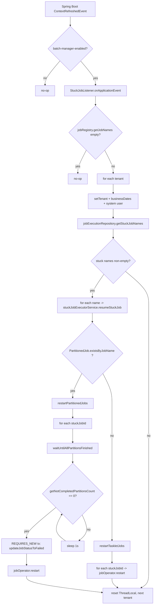

When an Apache Fineract instance running a background job is killed mid-flight — by an OOM, a kubelet eviction, a power cut, a `kill -9` to clear a hung connection pool — the Spring Batch tables on disk are left in an inconsistent state. The `BATCH_JOB_EXECUTION` row that says `STATUS = STARTED` is no longer being driven by any live process. Quartz won't fire the same job again because the scheduler thinks the row still represents an in-flight run. And restarting the JVM does not, on its own, fix this. That is what "stuck jobs" are, and this page documents the dedicated subsystem Fineract ships to find them and restart them.

The mechanism has two pieces:

- **`StuckJobListener`** — an `ApplicationListener<ContextRefreshedEvent>` that runs at startup, per tenant, and asks "is anything stuck?"
- **`StuckJobExecutorServiceImpl`** — the restart logic, with two branches: a simple `JobOperator.restart(id)` for tasklet-style jobs and a partition-aware fix-up for partitioned jobs (currently `LOAN_COB`).

Both are gated on `fineract.mode.batch-manager-enabled=true`. Only a batch manager is allowed to take responsibility for restarting stuck jobs.

## How a job becomes "stuck"

Spring Batch persists the lifecycle of every job execution in three core tables:

- `BATCH_JOB_INSTANCE` — one row per (job name, parameters hash). Created when a job is first launched with a new parameter set.
- `BATCH_JOB_EXECUTION` — one row per attempt. Status transitions: `STARTING → STARTED → COMPLETED / FAILED / STOPPED / ABANDONED`.
- `BATCH_STEP_EXECUTION` — one row per step (or partition). Same status enum.

In a clean run, `STARTED` is followed by `COMPLETED` or `FAILED`. In a crash, `STARTED` is followed by nothing — the JVM never got to commit the terminal state. The row is then **stuck**: it cannot be restarted by Spring Batch directly because the API rule is "you may only restart a job whose latest execution is `FAILED` or `STOPPED`."

Fineract's stuck-job machinery exists precisely to break that deadlock: at startup, it finds the rows that say `STARTED` for a job that has never since completed, and restarts them as if they had failed cleanly.

## `StuckJobListener` — finds and dispatches

```text fineract-provider/src/main/java/org/apache/fineract/infrastructure/jobs/service/StuckJobListener.java
@Service
@RequiredArgsConstructor
@ConditionalOnProperty(value = "fineract.mode.batch-manager-enabled", havingValue = "true")
public class StuckJobListener implements ApplicationListener<ContextRefreshedEvent> {

    private final JobExecutionRepository jobExecutionRepository;
    private final JdbcTemplateFactory jdbcTemplateFactory;
    private final TenantDetailsService tenantDetailsService;
    private final JobRegistry jobRegistry;
    private final BusinessDateReadPlatformService businessDateReadPlatformService;
    private final StuckJobExecutorService stuckJobExecutorService;
    private final AppUserRepositoryWrapper userRepository;

    @Override
    public void onApplicationEvent(@NonNull final ContextRefreshedEvent event) {
        if (jobRegistry.getJobNames().isEmpty()) {
            return;
        }
        tenantDetailsService.findAllTenants().forEach(tenant -> {
            try {
                ThreadLocalContextUtil.setTenant(tenant);
                final NamedParameterJdbcTemplate namedParameterJdbcTemplate = jdbcTemplateFactory.createNamedParameterJdbcTemplate(tenant);
                final List<String> stuckJobNames = jobExecutionRepository.getStuckJobNames(namedParameterJdbcTemplate);
                if (!stuckJobNames.isEmpty()) {
                    try {
                        final HashMap<BusinessDateType, LocalDate> businessDates = businessDateReadPlatformService.getBusinessDates();
                        ThreadLocalContextUtil.setActionContext(ActionContext.DEFAULT);
                        ThreadLocalContextUtil.setBusinessDates(businessDates);
                        final AppUser user = userRepository.fetchSystemUser();
                        final UsernamePasswordAuthenticationToken auth = new UsernamePasswordAuthenticationToken(user, user.getPassword(),
                                user.getAuthorities());
                        SecurityContextHolder.getContext().setAuthentication(auth);
                        stuckJobNames.forEach(stuckJobExecutorService::resumeStuckJob);
                    } finally {
                        SecurityContextHolder.getContext().setAuthentication(null);
                    }
                }
            } finally {
                ThreadLocalContextUtil.reset();
            }
        });
    }
}
```

What it does, step by step:

1. **Guard rail** — if `jobRegistry.getJobNames()` is empty, there are no Spring Batch jobs registered in this JVM and there is nothing to restart. Short-circuit.
2. **Walk every tenant** — the `BATCH_*` tables are per-tenant, so the restart loop must visit each one. The tenant is installed into the `ThreadLocal` before the JDBC template is built (so the template resolves to the correct schema).
3. **Query the stuck-job names** — `getStuckJobNames(...)` returns a `List<String>` of the **distinct** job names that are currently stuck under threshold.
4. **For each tenant that has stuck jobs** — install the system user into the `SecurityContextHolder`, install the business dates into the `ThreadLocal`, then dispatch each stuck job name to `stuckJobExecutorService.resumeStuckJob(name)`.
5. **Always reset** — security context cleared and `ThreadLocalContextUtil.reset()` in `finally` blocks so the next tenant gets a clean slate.

The "install system user" step matters because the Spring Batch listeners in the COB pipeline expect `SecurityContextHolder.getContext().getAuthentication()` to be non-null — they read the user identity for audit columns. The system user is the same one used by other background machinery (cf. `JobStarter.run` and the cron path).

## The retry-threshold property

The single property that tunes the entire mechanism:

```text fineract-provider/src/main/resources/application.properties
fineract.job.stuck-retry-threshold=${FINERACT_JOB_STUCK_RETRY_THRESHOLD:5}
```

It maps onto:

```text fineract-core/src/main/java/org/apache/fineract/infrastructure/core/config/FineractProperties.java
public static class FineractJobProperties {

    private int stuckRetryThreshold;
}
```

The semantics: **a job instance that has crashed N or fewer times will be restarted; if it has already crashed more than N times it is left alone.** Default is 5. The reason for the cap is to avoid infinite restart loops on a job that has a deterministic crash (e.g. a poison-pill loan that always NPEs in step 3) — after enough attempts, operators must intervene.

The cap is enforced by SQL `HAVING COUNT(BJI.JOB_INSTANCE_ID) <= :threshold` clauses in the repository (see below). It counts how many `BATCH_JOB_EXECUTION` rows exist for the same `JOB_INSTANCE` — which is one row per attempted restart.

## The SQL: `getStuckJobNames`

```text fineract-provider/src/main/java/org/apache/fineract/infrastructure/jobs/domain/JobExecutionRepository.java
public List<String> getStuckJobNames(NamedParameterJdbcTemplate jdbcTemplate) {
    int threshold = fineractProperties.getJob().getStuckRetryThreshold();
    return jdbcTemplate.queryForList("""
            SELECT DISTINCT(BJI.JOB_NAME) as STUCK_JOB_NAME
            FROM BATCH_JOB_INSTANCE BJI
            INNER JOIN BATCH_JOB_EXECUTION BJE
            ON BJI.JOB_INSTANCE_ID = BJE.JOB_INSTANCE_ID
            WHERE
                BJE.STATUS IN (:statuses)
                AND
                BJE.JOB_INSTANCE_ID NOT IN (
                    SELECT IBJE.JOB_INSTANCE_ID
                    FROM BATCH_JOB_INSTANCE IBJI
                    INNER JOIN BATCH_JOB_EXECUTION IBJE
                    ON IBJI.JOB_INSTANCE_ID = IBJE.JOB_INSTANCE_ID
                    WHERE IBJE.STATUS IN (:completedStatuses)
                )
            GROUP BY BJI.JOB_INSTANCE_ID
            HAVING COUNT(BJI.JOB_INSTANCE_ID) <= :threshold
            """, Map.of("statuses", List.of(STARTED.name()), "completedStatuses",
            List.of(COMPLETED.name(), FAILED.name(), UNKNOWN.name()), "threshold", threshold), String.class);
}
```

Read like prose:

- Find every `JOB_EXECUTION` whose status is `STARTED`.
- Exclude any whose `JOB_INSTANCE_ID` has **also** been seen in a `COMPLETED`, `FAILED` or `UNKNOWN` state — those are not stuck, they finished. (This is the magic clause that distinguishes "never finished" from "already failed cleanly and was restarted later.")
- Group by instance.
- Keep only instances that have crashed `<= threshold` times.
- Return the distinct job names.

The status set is deliberate: `UNKNOWN` is treated as "finished, do not retry" so an operator can mark a deeply-broken row `UNKNOWN` by hand and the listener will leave it alone.

The companion queries `getStuckJobCountByJobName` and `getStuckJobIdsByJobName` apply the same filter for a single named job, returning the count and the execution ids respectively. The latter is what `StuckJobExecutorServiceImpl` uses to drive `JobOperator.restart(id)`.

## `StuckJobExecutorServiceImpl` — restarts

```text fineract-provider/src/main/java/org/apache/fineract/infrastructure/jobs/service/StuckJobExecutorService.java
public interface StuckJobExecutorService {
    void resumeStuckJob(String jobName);
}
```

The implementation is the meaty piece:

```text fineract-provider/src/main/java/org/apache/fineract/infrastructure/jobs/service/StuckJobExecutorServiceImpl.java
@Service
@Slf4j
@RequiredArgsConstructor
public class StuckJobExecutorServiceImpl implements StuckJobExecutorService {

    private final JobExecutionRepository jobExecutionRepository;
    private final TransactionTemplate transactionTemplate;
    private final JobOperator jobOperator;

    @Override
    public void resumeStuckJob(String jobName) {
        List<Long> stuckJobIds = getStuckJobIds(jobName);
        if (isPartitionedJob(jobName) && areThereStuckJobs(jobName)) {
            restartPartitionedJobs(jobName, stuckJobIds);
        } else {
            restartTaskletJobs(stuckJobIds);
        }
    }

    private void restartTaskletJobs(List<Long> stuckJobIds) {
        stuckJobIds.forEach(this::handleStuckTaskletJob);
    }

    private void handleStuckTaskletJob(Long stuckJobId) {
        try {
            jobOperator.restart(stuckJobId);
        } catch (Exception e) {
            throw new RuntimeException("Exception while handling a stuck job", e);
        }
    }
    ...
}
```

`resumeStuckJob` looks at the job name and routes to one of two branches:

- **Partitioned** — if the job is in the `PartitionedJob` enum **and** the repository still says there is at least one stuck execution. Currently only `LOAN_COB` matches both conditions.
- **Tasklet** — anything else. Just hand each `STARTED` execution id to `JobOperator.restart(...)` and let Spring Batch sort itself out.

`JobOperator.restart(id)` is the standard Spring Batch API: it reads the execution row, finds the failed steps, and re-invokes the job from where it left off (or from the beginning if the job is non-restartable).

## Tasklet restart: why it works

For a single-step tasklet, `JobOperator.restart` is well-defined out of the box. The execution has one step. Either it failed before commit (state was rolled back; restart begins from scratch) or it failed during commit (state was already partially written, but tasklets are designed to be idempotent within a Fineract context). Either way, calling `restart` causes Spring Batch to:

1. Mark the existing execution as `FAILED` internally.
2. Create a new `BATCH_JOB_EXECUTION` row for the same `JOB_INSTANCE`.
3. Launch the job with the same parameters.
4. Run.

The new row counts as another attempt, so the `HAVING COUNT(...) <= :threshold` clause will eventually stop dispatching this instance once the retry budget is exhausted.

## Partitioned restart: the fix-up path

Partitioned jobs are trickier. The manager step holds a `BATCH_STEP_EXECUTION` row (`STATUS = STARTED`) while the workers run their own per-partition `BATCH_STEP_EXECUTION` rows. If the JVM is killed:

- The manager's step row is `STARTED` and dangling.
- Some worker partitions may be `COMPLETED`.
- Some may be `STARTED` and dangling.
- Some may have never been received off the queue.

`JobOperator.restart` cannot just be called: Spring Batch will refuse because the manager step is still `STARTED`, not `FAILED`. So the code does a SQL fix-up first:

```text fineract-provider/src/main/java/org/apache/fineract/infrastructure/jobs/service/StuckJobExecutorServiceImpl.java
private void restartPartitionedJobs(String jobName, List<Long> stuckJobIds) {
    stuckJobIds.forEach(stuckJobId -> handleStuckPartitionedJob(stuckJobId, getPartitionerStepName(jobName)));
}

private boolean isPartitionedJob(String jobName) {
    return PartitionedJob.existsByJobName(jobName);
}

private String getPartitionerStepName(String name) {
    return PartitionedJob.valueOf(name).getPartitionerStepName();
}

private boolean areThereStuckJobs(String jobName) {
    Long stuckJobCount = jobExecutionRepository.getStuckJobCountByJobName(jobName);
    return stuckJobCount != 0L;
}

private List<Long> getStuckJobIds(String jobName) {
    return jobExecutionRepository.getStuckJobIdsByJobName(jobName);
}

private void handleStuckPartitionedJob(Long stuckJobId, String partitionerStepName) {
    try {
        waitUntilAllPartitionsFinished(stuckJobId, partitionerStepName);
        transactionTemplate.setPropagationBehavior(PROPAGATION_REQUIRES_NEW);
        transactionTemplate.execute(new TransactionCallbackWithoutResult() {

            @Override
            protected void doInTransactionWithoutResult(TransactionStatus status) {
                jobExecutionRepository.updateJobStatusToFailed(stuckJobId, partitionerStepName);
            }
        });
        jobOperator.restart(stuckJobId);
    } catch (Exception e) {
        throw new RuntimeException("Exception while handling a stuck job", e);
    }
}

private void waitUntilAllPartitionsFinished(Long stuckJobId, String partitionerStepName) throws InterruptedException {
    while (!areAllPartitionsCompleted(stuckJobId, partitionerStepName)) {
        log.info("Sleeping for a second to wait for the partitions to complete for job {}", stuckJobId);
        Thread.sleep(1000);
    }
}

private boolean areAllPartitionsCompleted(Long stuckJobId, String partitionerStepName) {
    Long notCompletedPartitions = jobExecutionRepository.getNotCompletedPartitionsCount(stuckJobId, partitionerStepName);
    return notCompletedPartitions == 0L;
}
```

Three phases:

### Phase 1: wait for outstanding partitions

```text fineract-provider/src/main/java/org/apache/fineract/infrastructure/jobs/domain/JobExecutionRepository.java
public Long getNotCompletedPartitionsCount(Long jobExecutionId, String partitionerStepName) {
    return namedParameterJdbcTemplate.queryForObject("""
                SELECT COUNT(BSE.STEP_EXECUTION_ID)
                FROM BATCH_STEP_EXECUTION BSE
                WHERE
                    BSE.JOB_EXECUTION_ID = :jobExecutionId
                    AND
                    BSE.STEP_NAME <> :stepName
                    AND
                    BSE.status <> :status
            """, Map.of("jobExecutionId", jobExecutionId, "stepName", partitionerStepName, "status", COMPLETED.name()), Long.class);
}
```

This counts every non-partitioner step (i.e. every worker partition) on this job execution whose status is not `COMPLETED`. The `waitUntilAllPartitionsFinished` loop sleeps in 1-second increments until that count drops to 0.

**Why wait?** Because in a multi-JVM deployment, the worker JVMs might still be alive even though the manager died. They are still draining their queues and writing back `COMPLETED` step executions. Restarting before they finish would race them. The wait loop lets every still-live worker finish its in-flight partition before the manager fix-up step rewrites the database.

### Phase 2: rewrite the manager step + job execution rows

```text fineract-provider/src/main/java/org/apache/fineract/infrastructure/jobs/domain/JobExecutionRepository.java
public void updateJobStatusToFailed(Long stuckJobId, String partitionerStepName) {
    namedParameterJdbcTemplate.update("""
                UPDATE BATCH_STEP_EXECUTION
                SET STATUS = :status
                WHERE
                    JOB_EXECUTION_ID = :jobExecutionId
                    AND
                    STEP_NAME = :stepName
            """, Map.of("status", FAILED.name(), "jobExecutionId", stuckJobId, "stepName", partitionerStepName));
    namedParameterJdbcTemplate.update("""
                UPDATE BATCH_JOB_EXECUTION
                SET
                    STATUS = :status,
                    START_TIME = null,
                    END_TIME = null
                WHERE
                    JOB_EXECUTION_ID = :jobExecutionId
            """, Map.of("status", FAILED.name(), "jobExecutionId", stuckJobId));
}
```

Two updates, both in a `PROPAGATION_REQUIRES_NEW` transaction so they commit independently of whatever transaction may already be active in the caller:

- Mark the **manager step** (named e.g. `"loanCOBPartitionerStep"`) as `FAILED`.
- Mark the **job execution** as `FAILED` and null out `START_TIME` / `END_TIME` so Spring Batch's restart machinery treats the restart as a fresh wall-clock attempt.

Worker-partition step executions are left as `COMPLETED` (the ones that finished) — Spring Batch will reuse those on restart. Partitions that were never run before the crash will be re-launched.

### Phase 3: standard restart

```text
jobOperator.restart(stuckJobId);
```

Now that the row layout looks like a clean failure, the standard Spring Batch restart works. It will replay the manager step, which re-partitions, which re-sends `StepExecutionRequest` messages — but Spring Batch's `JobRepository` will skip partitions whose step execution is already `COMPLETED`, so only the missing partitions actually re-run.

## End-to-end flow



## What gets retried, what doesn't

| Condition | Outcome |
|-----------|---------|
| `BATCH_JOB_EXECUTION.STATUS = STARTED`, instance not since `COMPLETED`/`FAILED`/`UNKNOWN`, retry count ≤ `stuck-retry-threshold` | Restarted |
| Same as above but retry count > threshold | **Left stuck** — operator must intervene |
| `BATCH_JOB_EXECUTION.STATUS = STARTED` but instance has since `COMPLETED` | Not stuck; ignored (a later run already succeeded) |
| `BATCH_JOB_EXECUTION.STATUS = STARTED` but instance has since `FAILED` | Not stuck; the run finished cleanly with a failure status, will be retried by the next cron fire |
| `BATCH_JOB_EXECUTION.STATUS = STARTED` but instance has since `UNKNOWN` | Not stuck; operator-set sentinel meaning "do not touch" |
| Partitioned, workers still mid-flight | `waitUntilAllPartitionsFinished` sleeps until they finish |
| Partitioned, workers truly dead | After all-partition-completed check returns 0, the manager rows are rewritten and restart runs |

## What this does NOT cover

- **In-progress runs while the listener is active.** The listener runs at startup. If a job crashes after startup completes, it will only be picked up by the next startup. There is no live watchdog.
- **Quartz-side `currently_running` flags.** `ScheduledJobDetail.currentlyRunning` is on the `job` table (Quartz side), independent from `BATCH_JOB_EXECUTION.STATUS`. If a job dies while `currently_running = true`, the next scheduled fire of the same job will be vetoed by `SchedulerVetoer` because the row is still marked running. The `EXECUTE_DIRTY_JOBS` job (see `jobs/job-catalog`) is the complementary mechanism for clearing those stale flags.
- **Inline executions.** `INLINE_LOAN_COB` runs go through the same Spring Batch tables and so are eligible for stuck-job recovery by job name — the same `JobOperator.restart` path applies. The inline executor uses the partitioned-job whitelist only for jobs whose enum name matches `PartitionedJob.LOAN_COB` (not `INLINE_LOAN_COB`), so inline runs go through the tasklet branch.
- **Worker-only nodes.** Stuck-job recovery is **manager-only** — worker nodes don't run the listener. This is correct: a worker node has no business deciding to relaunch a job; the manager owns the lifecycle.

## Operator playbook

When a job is stuck past the retry threshold, the standard moves are:

1. **Look at the row** — `SELECT * FROM BATCH_JOB_EXECUTION WHERE STATUS = 'STARTED'` in the affected tenant schema.
2. **Mark the instance UNKNOWN** if you want the listener to ignore it: update `BATCH_JOB_EXECUTION.STATUS = 'UNKNOWN'`. This signals "I have taken ownership; do not retry."
3. **Manually retry** via `POST /v1/jobs/{jobId}?command=executeJob` once the underlying problem is fixed. This goes through `ExecuteJobCommandHandler` and produces a fresh `BATCH_JOB_EXECUTION` row.
4. **Tune the threshold** if the production reality differs from the default — `FINERACT_JOB_STUCK_RETRY_THRESHOLD` env var or `fineract.job.stuck-retry-threshold` property.

If a partitioned job has ghost partitions stuck `STARTED` (workers truly gone), the listener's `waitUntilAllPartitionsFinished` will spin forever — a 1-second-per-iteration log line `"Sleeping for a second to wait for the partitions to complete for job {}"`. Operators need to manually mark the ghost partition step executions `FAILED` so the loop exits.

## Properties summary

```text fineract-provider/src/main/resources/application.properties
fineract.mode.batch-manager-enabled=${FINERACT_MODE_BATCH_MANAGER_ENABLED:true}
fineract.job.stuck-retry-threshold=${FINERACT_JOB_STUCK_RETRY_THRESHOLD:5}
```

| Property | Default | Effect on stuck-job handling |
|----------|---------|------------------------------|
| `fineract.mode.batch-manager-enabled` | `true` | Required for `StuckJobListener` to be wired (`@ConditionalOnProperty`). |
| `fineract.job.stuck-retry-threshold` | `5` | Maximum number of restart attempts before a job is left stuck. |

There is intentionally **no separate "enable" switch for stuck-job handling.** If you are a batch manager, you are expected to handle stuck jobs. If you do not want this behavior, the only way to disable it is to set `batch-manager-enabled=false` — at which point you are also disabling cron scheduling, so the trade-off is obvious.

## Cross-references

- `jobs/overview` — for stuck-job recovery's place in the wider lifecycle.
- `jobs/scheduler-and-quartz` — for the `currently_running` flag on the Quartz side and the `EXECUTE_DIRTY_JOBS` complement.
- `jobs/spring-batch-partitioned-jobs` — for the `PartitionedJob` whitelist and the manager / worker partition flow that the partitioned restart path rewrites.
- `jobs/inline-job-execution` — for inline runs that go through the same `BATCH_JOB_EXECUTION` tables.
- `jobs/job-catalog` — for the full list of jobs whose executions might end up stuck.
- `runtime/instance-mode` — for `batch-manager-enabled` and the broader instance-mode story.
