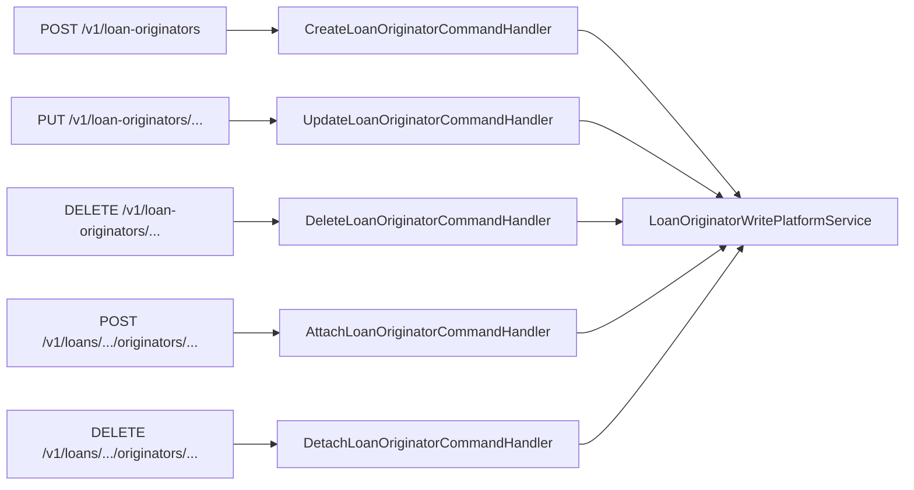

The Apache Fineract loan origination module exposes its REST surface through two thin JAX-RS resources, dispatches every write through five typed `@CommandType` handlers, and persists changes via a single `LoanOriginatorWritePlatformService`. A separate `LoanOriginatorLinkingService` plugs into the *classic loan-application* code path so an application can carry its originators inline, and a small `LoanOriginatorHelper` resolves or creates originators by external id within nested transactions. This page walks through each piece in source order.

Like every other class in the module, the public surface is gated by `@ConditionalOnProperty(value = "fineract.module.loan-origination.enabled", havingValue = "true")`. With the flag off, no resource is registered and no handler is wired — the rest of Fineract behaves identically to a build without the module.

## Resource map

```
fineract-loan-origination/src/main/java/org/apache/fineract/portfolio/loanorigination/
├── api/
│   ├── LoanOriginatorApiConstants.java
│   ├── LoanOriginatorApiResource.java        # /v1/loan-originators
│   ├── LoanOriginatorApiResourceSwagger.java
│   └── LoanOriginatorsApiResource.java       # /v1/loans/{id}/originators
├── handler/                                  # 5 command handlers
│   ├── AttachLoanOriginatorCommandHandler
│   ├── CreateLoanOriginatorCommandHandler
│   ├── DeleteLoanOriginatorCommandHandler
│   ├── DetachLoanOriginatorCommandHandler
│   └── UpdateLoanOriginatorCommandHandler
└── service/
    ├── LoanOriginatorReadPlatformService
    ├── LoanOriginatorReadPlatformServiceImpl
    ├── LoanOriginatorWritePlatformService
    ├── LoanOriginatorWritePlatformServiceImpl
    ├── LoanOriginatorLinkingServiceImpl
    └── LoanOriginatorHelper
```

Two resources, five handlers, two service interfaces with their impls, one helper, and one linking service that bridges into the classic loan code path.

## `LoanOriginatorApiResource` — managing the directory

This is the *directory* resource. Operators create originators here, list them, update them, or remove them — the resource is loan-agnostic and works against `m_loan_originator` only.

```java title="fineract-loan-origination/src/main/java/org/apache/fineract/portfolio/loanorigination/api/LoanOriginatorApiResource.java"
@Path("/v1/loan-originators")
@Component
@ConditionalOnProperty(value = "fineract.module.loan-origination.enabled", havingValue = "true")
@Tag(name = "Loan Originators", description = "Manage loan originator details for revenue sharing and reporting")
@RequiredArgsConstructor
public class LoanOriginatorApiResource {

    private final PlatformSecurityContext context;
    private final LoanOriginatorReadPlatformService loanOriginatorReadPlatformService;
    private final PortfolioCommandSourceWritePlatformService commandsSourceWritePlatformService;
```

### Endpoint table

| Method | Path | OperationId | Permission check |
| --- | --- | --- | --- |
| `POST` | `/v1/loan-originators` | `createLoanOriginator` | `CREATE_LOAN_ORIGINATOR` (via command pipeline) |
| `GET` | `/v1/loan-originators` | `retrieveAllLoanOriginators` | `READ_LOAN_ORIGINATOR` |
| `GET` | `/v1/loan-originators/template` | — | `READ_LOAN_ORIGINATOR` |
| `GET` | `/v1/loan-originators/{originatorId}` | `retrieveOneLoanOriginator` | `READ_LOAN_ORIGINATOR` |
| `GET` | `/v1/loan-originators/external-id/{externalId}` | — | `READ_LOAN_ORIGINATOR` |
| `PUT` | `/v1/loan-originators/{originatorId}` | `updateLoanOriginator` | `UPDATE_LOAN_ORIGINATOR` (via command pipeline) |
| `PUT` | `/v1/loan-originators/external-id/{externalId}` | — | `UPDATE_LOAN_ORIGINATOR` |
| `DELETE` | `/v1/loan-originators/{originatorId}` | `deleteLoanOriginator` | `DELETE_LOAN_ORIGINATOR` |
| `DELETE` | `/v1/loan-originators/external-id/{externalId}` | — | `DELETE_LOAN_ORIGINATOR` |

Every GET runs an explicit `context.authenticatedUser().validateHasReadPermission(LoanOriginatorApiConstants.RESOURCE_NAME)` first; every write goes through `CommandWrapperBuilder` → `PortfolioCommandSourceWritePlatformService.logCommandSource(...)` which checks the matching `CREATE_/UPDATE_/DELETE_LOAN_ORIGINATOR` permission inside the dispatcher.

### Create

```java title="fineract-loan-origination/src/main/java/org/apache/fineract/portfolio/loanorigination/api/LoanOriginatorApiResource.java"
@POST
@Consumes({ MediaType.APPLICATION_JSON })
@Produces({ MediaType.APPLICATION_JSON })
@Operation(summary = "Create a new loan originator", operationId = "createLoanOriginator", description = "Creates a new loan originator record. Requires CREATE_LOAN_ORIGINATOR permission.")
@RequestBody(required = true, content = @Content(schema = @Schema(implementation = LoanOriginatorApiResourceSwagger.PostLoanOriginatorsRequest.class)))
@ApiResponse(responseCode = "200", description = "OK", content = @Content(schema = @Schema(implementation = LoanOriginatorApiResourceSwagger.PostLoanOriginatorsResponse.class)))
@ApiResponse(responseCode = "400", description = "Required parameter is missing or incorrect format")
@ApiResponse(responseCode = "403", description = "Duplicate external ID or insufficient permissions")
public CommandProcessingResult create(@Parameter(hidden = true) final String apiRequestBodyAsJson) {
    final CommandWrapper commandRequest = new CommandWrapperBuilder().createLoanOriginator().withJson(apiRequestBodyAsJson).build();
    return this.commandsSourceWritePlatformService.logCommandSource(commandRequest);
}
```

`new CommandWrapperBuilder().createLoanOriginator()` builds the canonical `CommandWrapper` whose `(entity, action)` pair is `("LOAN_ORIGINATOR", "CREATE")`. The `logCommandSource` call hands it to the registry which finds `CreateLoanOriginatorCommandHandler`.

### Read

```java
@GET
@Produces({ MediaType.APPLICATION_JSON })
public List<LoanOriginatorData> retrieveAll() {
    this.context.authenticatedUser().validateHasReadPermission(LoanOriginatorApiConstants.RESOURCE_NAME);

    return this.loanOriginatorReadPlatformService.retrieveAll();
}
```

The list path returns *all* originators with their `originatorType` and `channelType` `CodeValue` joined in — the read service uses a fetch-join query so the response avoids the N+1 trap (see [Originators Domain](/loan-origination/originators-domain) for `findAllWithCodeValues`).

### External-id paths

```java
@PUT
@Path("external-id/{externalId}")
public CommandProcessingResult updateByExternalId(
        @PathParam("externalId") @Parameter(description = "externalId") final String externalId,
        @Parameter(hidden = true) final String apiRequestBodyAsJson) {
    final Long originatorId = this.loanOriginatorReadPlatformService.resolveIdByExternalId(externalId);

    final CommandWrapper commandRequest = new CommandWrapperBuilder().updateLoanOriginator(originatorId).withJson(apiRequestBodyAsJson)
            .build();
    return this.commandsSourceWritePlatformService.logCommandSource(commandRequest);
}
```

The pattern is consistent: resolve the internal id via `resolveIdByExternalId` (which throws `LoanOriginatorNotFoundException` if missing), then dispatch the standard command. By collapsing back to the internal id at the resource boundary, every handler sees a single shape.

### Delete

```java
@DELETE
@Path("{originatorId}")
public CommandProcessingResult delete(@PathParam("originatorId") final Long originatorId) {
    final CommandWrapper commandRequest = new CommandWrapperBuilder().deleteLoanOriginator(originatorId).build();
    return this.commandsSourceWritePlatformService.logCommandSource(commandRequest);
}
```

Delete is *physical* but conditional — `LoanOriginatorWritePlatformServiceImpl.delete` refuses if any `LoanOriginatorMapping` row references the originator, raising `LoanOriginatorCannotBeDeletedException` → HTTP 403.

## `LoanOriginatorsApiResource` — managing per-loan mappings

This resource is *loan-scoped*. It is mounted on the loans namespace because the URL is a child of a loan, not of an originator:

```java title="fineract-loan-origination/src/main/java/org/apache/fineract/portfolio/loanorigination/api/LoanOriginatorsApiResource.java"
@Path("/v1/loans")
@Component
@ConditionalOnProperty(value = "fineract.module.loan-origination.enabled", havingValue = "true")
@Tag(name = "Loan Originators", description = "Fetch loan originator details for a specific loan")
@RequiredArgsConstructor
public class LoanOriginatorsApiResource {

    private static final String LOAN_RESOURCE_NAME = "LOAN";

    private final PlatformSecurityContext context;
    private final LoanReadPlatformService loanReadPlatformService;
    private final LoanOriginatorReadPlatformService loanOriginatorReadPlatformService;
    private final PortfolioCommandSourceWritePlatformService commandsSourceWritePlatformService;
```

Note the second injected `LoanReadPlatformService` — used to resolve `loanExternalId` to `loanId` *and* to assert the loan exists before mapping, so `404 Loan not found` is distinguishable from `404 Originator not found`.

### Endpoint matrix

There are 10 endpoints — 2 reads (by id / by external id) and 4 attach/detach permutations covering `(loanId, originatorId)`, `(loanId, originatorExternalId)`, `(loanExternalId, originatorId)`, and `(loanExternalId, originatorExternalId)`.

| Method | Path | Purpose |
| --- | --- | --- |
| `GET` | `/v1/loans/{loanId}/originators` | List originators attached to a loan. |
| `GET` | `/v1/loans/external-id/{loanExternalId}/originators` | Same by external loan id. |
| `POST` | `/v1/loans/{loanId}/originators/{originatorId}` | Attach by both internal ids. |
| `POST` | `/v1/loans/{loanId}/originators/external-id/{originatorExternalId}` | Attach with originator external id. |
| `POST` | `/v1/loans/external-id/{loanExternalId}/originators/{originatorId}` | Attach with loan external id. |
| `POST` | `/v1/loans/external-id/{loanExternalId}/originators/external-id/{originatorExternalId}` | Attach with both external ids. |
| `DELETE` | `/v1/loans/{loanId}/originators/{originatorId}` | Detach by both internal ids. |
| `DELETE` | `/v1/loans/{loanId}/originators/external-id/{originatorExternalId}` | Detach with originator external id. |
| `DELETE` | `/v1/loans/external-id/{loanExternalId}/originators/{originatorId}` | Detach with loan external id. |
| `DELETE` | `/v1/loans/external-id/{loanExternalId}/originators/external-id/{originatorExternalId}` | Detach with both external ids. |

### Attach (canonical shape)

```java title="fineract-loan-origination/src/main/java/org/apache/fineract/portfolio/loanorigination/api/LoanOriginatorsApiResource.java"
public LoanOriginatorMappingResponse attachOriginatorToLoan(@PathParam("loanId") @Parameter(description = "loanId") final Long loanId,
        @PathParam("originatorId") @Parameter(description = "originatorId") final Long originatorId) {

    final CommandWrapper commandRequest = new CommandWrapperBuilder().attachLoanOriginator(loanId, originatorId).build();
    final CommandProcessingResult result = this.commandsSourceWritePlatformService.logCommandSource(commandRequest);

    return buildMappingResponse(result);
}
```

`attachLoanOriginator(loanId, originatorId)` builds a command where (see `CommandWrapperBuilder.attachLoanOriginator`):

- `entityName = "LOAN_ORIGINATOR"`
- `actionName = "ATTACH"`
- `entityId = loanId`
- `loanId = loanId` (the builder also sets the dedicated `loanId` slot)
- `subentityId = originatorId`
- `href = "/loans/" + loanId + "/originators/" + originatorId`

The handler uses both id slots — `command.getLoanId()` and `command.subentityId()`.

### Detach (canonical shape)

```java
public LoanOriginatorMappingResponse detachOriginatorFromLoan(@PathParam("loanId") @Parameter(description = "loanId") final Long loanId,
        @PathParam("originatorId") @Parameter(description = "originatorId") final Long originatorId) {

    final CommandWrapper commandRequest = new CommandWrapperBuilder().detachLoanOriginator(loanId, originatorId).build();
    final CommandProcessingResult result = this.commandsSourceWritePlatformService.logCommandSource(commandRequest);

    return buildMappingResponse(result);
}
```

Same structural shape, `action = "DETACH"`.

### Building the mapping response

```java
private LoanOriginatorMappingResponse buildMappingResponse(final CommandProcessingResult result) {
    return LoanOriginatorMappingResponse.of(result.getResourceId(),
            result.getResourceExternalId() != null ? result.getResourceExternalId().getValue() : null, result.getSubResourceId(),
            result.getSubResourceExternalId() != null ? result.getSubResourceExternalId().getValue() : null);
}
```

The response carries `loanId`, `loanExternalId`, `originatorId`, `originatorExternalId`. Clients can rely on it regardless of which of the four input shapes they used.

### Resolving external loan ids

Wherever the path takes `loanExternalId`, the resource resolves to `loanId` *before* dispatching:

```java
public LoanOriginatorMappingResponse attachOriginatorToLoanByLoanExternalId(
        @PathParam("loanExternalId") @Parameter(description = "loanExternalId") final String loanExternalId,
        @PathParam("originatorId") @Parameter(description = "originatorId") final Long originatorId) {

    final ExternalId externalId = ExternalIdFactory.produce(loanExternalId);
    final Long loanId = this.loanReadPlatformService.retrieveLoanIdByExternalId(externalId);
    if (loanId == null) {
        throw new LoanNotFoundException(externalId);
    }

    final CommandWrapper commandRequest = new CommandWrapperBuilder().attachLoanOriginator(loanId, originatorId).build();
    ...
}
```

This means the handler never has to deal with both id shapes.

## The five command handlers

Each handler is a six-line `@Service`, gated by the module flag, that delegates to one method of `LoanOriginatorWritePlatformService`.

### `@CommandType` table

| Handler | Entity | Action | Service call |
| --- | --- | --- | --- |
| `CreateLoanOriginatorCommandHandler` | `LOAN_ORIGINATOR` | `CREATE` | `create(command)` |
| `UpdateLoanOriginatorCommandHandler` | `LOAN_ORIGINATOR` | `UPDATE` | `update(command.entityId(), command)` |
| `DeleteLoanOriginatorCommandHandler` | `LOAN_ORIGINATOR` | `DELETE` | `delete(command.entityId())` |
| `AttachLoanOriginatorCommandHandler` | `LOAN_ORIGINATOR` | `ATTACH` | `attachOriginatorToLoan(command.getLoanId(), command.subentityId())` |
| `DetachLoanOriginatorCommandHandler` | `LOAN_ORIGINATOR` | `DETACH` | `detachOriginatorFromLoan(command.getLoanId(), command.subentityId())` |

### Anatomy of a handler

```java title="fineract-loan-origination/src/main/java/org/apache/fineract/portfolio/loanorigination/handler/CreateLoanOriginatorCommandHandler.java"
@Service
@CommandType(entity = "LOAN_ORIGINATOR", action = "CREATE")
@RequiredArgsConstructor
@ConditionalOnProperty(value = "fineract.module.loan-origination.enabled", havingValue = "true")
public class CreateLoanOriginatorCommandHandler implements NewCommandSourceHandler {

    private final LoanOriginatorWritePlatformService writePlatformService;

    @Override
    public CommandProcessingResult processCommand(final JsonCommand command) {
        return this.writePlatformService.create(command);
    }
}
```

And the attach handler — note the *subentity* unpacking:

```java title="fineract-loan-origination/src/main/java/org/apache/fineract/portfolio/loanorigination/handler/AttachLoanOriginatorCommandHandler.java"
@Service
@CommandType(entity = "LOAN_ORIGINATOR", action = "ATTACH")
@RequiredArgsConstructor
@ConditionalOnProperty(value = "fineract.module.loan-origination.enabled", havingValue = "true")
public class AttachLoanOriginatorCommandHandler implements NewCommandSourceHandler {

    private final LoanOriginatorWritePlatformService writePlatformService;

    @Override
    public CommandProcessingResult processCommand(final JsonCommand command) {
        return this.writePlatformService.attachOriginatorToLoan(command.getLoanId(), command.subentityId());
    }
}
```

`command.getLoanId()` returns the loan id (filled by `withLoanId` on the builder). `command.subentityId()` returns the originator id (filled as the second positional argument to `attachLoanOriginator(loanId, originatorId)`).

The five handlers cover everything reachable from the REST resources:



## The write service

```java title="fineract-loan-origination/src/main/java/org/apache/fineract/portfolio/loanorigination/service/LoanOriginatorWritePlatformService.java"
public interface LoanOriginatorWritePlatformService {

    CommandProcessingResult create(JsonCommand command);

    CommandProcessingResult update(Long id, JsonCommand command);

    CommandProcessingResult delete(Long id);

    CommandProcessingResult attachOriginatorToLoan(Long loanId, Long originatorId);

    CommandProcessingResult detachOriginatorFromLoan(Long loanId, Long originatorId);
}
```

`LoanOriginatorWritePlatformServiceImpl` runs each operation through three checks before persisting:

1. **Validator** (`LoanOriginatorDataValidator.validateForCreate` / `.validateForUpdate`) verifies the JSON shape, presence of required fields, length caps, and the `status` value if provided.
2. **Lookup** (`loanOriginatorRepository` / `loanRepositoryWrapper`) resolves both ids and throws typed exceptions on miss (`LoanOriginatorNotFoundException`, `LoanNotFoundException` → 404).
3. **Business rule** checks specific to the operation — duplicate external id (`LoanOriginatorDuplicateExternalIdException` → 403), loan not in `SUBMITTED_AND_PENDING_APPROVAL` (`LoanNotInSubmittedStatusException` → 403), already-mapped (`LoanOriginatorMappingAlreadyExistsException` → 403), missing mapping (`LoanOriginatorMappingNotFoundException` → 404).

### Create

```java title="fineract-loan-origination/src/main/java/org/apache/fineract/portfolio/loanorigination/service/LoanOriginatorWritePlatformServiceImpl.java"
@Override
public CommandProcessingResult create(final JsonCommand command) {
    this.loanOriginatorDataValidator.validateForCreate(command.json());

    final String externalIdValue = command.stringValueOfParameterNamed(EXTERNAL_ID_PARAM);
    final ExternalId externalId = new ExternalId(externalIdValue);

    if (this.loanOriginatorRepository.existsByExternalId(externalId)) {
        throw new LoanOriginatorDuplicateExternalIdException(externalIdValue);
    }

    final String name = command.stringValueOfParameterNamed(NAME_PARAM);

    final String statusValue = command.stringValueOfParameterNamed(STATUS_PARAM);
    final LoanOriginatorStatus status = (statusValue != null && !statusValue.isEmpty()) ? LoanOriginatorStatus.fromString(statusValue)
            : LoanOriginatorStatus.ACTIVE;

    final CodeValue originatorType = resolveCodeValue(command, ORIGINATOR_TYPE_ID_PARAM, ORIGINATOR_TYPE_CODE_NAME);
    final CodeValue channelType = resolveCodeValue(command, CHANNEL_TYPE_ID_PARAM, CHANNEL_TYPE_CODE_NAME);

    final LoanOriginator originator = LoanOriginator.create(externalId, name, status, originatorType, channelType);
    this.loanOriginatorRepository.saveAndFlush(originator);
```

Notable defaults: `status` defaults to `ACTIVE` when missing; `originatorType` and `channelType` are both *optional* and resolved against `m_code_value` by helper.

### Other operations

The pattern repeats across `update`, `attach`, `detach`, `delete` — validator first, lookup second, rule third, persist fourth. The interface is small enough that the handlers are trivial wrappers.

## The read service

```java title="fineract-loan-origination/src/main/java/org/apache/fineract/portfolio/loanorigination/service/LoanOriginatorReadPlatformService.java"
public interface LoanOriginatorReadPlatformService {

    List<LoanOriginatorData> retrieveAll();

    LoanOriginatorData retrieveById(Long id);

    LoanOriginatorData retrieveByExternalId(String externalId);

    Long resolveIdByExternalId(String externalId);

    List<LoanOriginatorData> retrieveByLoanId(Long loanId);

    LoanOriginatorTemplateData retrieveTemplate();
}
```

The implementation is just-as-thin:

```java title="fineract-loan-origination/src/main/java/org/apache/fineract/portfolio/loanorigination/service/LoanOriginatorReadPlatformServiceImpl.java"
@Service
@RequiredArgsConstructor
@Transactional(readOnly = true)
@ConditionalOnProperty(value = "fineract.module.loan-origination.enabled", havingValue = "true")
public class LoanOriginatorReadPlatformServiceImpl implements LoanOriginatorReadPlatformService {

    private final LoanOriginatorRepository loanOriginatorRepository;
    private final LoanOriginatorMappingRepository loanOriginatorMappingRepository;
    private final LoanOriginatorMapper loanOriginatorMapper;
    private final CodeValueRepository codeValueRepository;
    private final CodeValueMapper codeValueMapper;

    @Override
    public List<LoanOriginatorData> retrieveAll() {
        final List<LoanOriginator> originators = this.loanOriginatorRepository.findAllWithCodeValues();
        return this.loanOriginatorMapper.toDataList(originators);
    }

    @Override
    public LoanOriginatorData retrieveById(final Long id) {
        final LoanOriginator originator = this.loanOriginatorRepository.findByIdWithCodeValues(id)
                .orElseThrow(() -> new LoanOriginatorNotFoundException(id));
        return this.loanOriginatorMapper.toData(originator);
    }

    @Override
    public LoanOriginatorData retrieveByExternalId(final String externalId) {
        final LoanOriginator originator = this.loanOriginatorRepository.findByExternalIdWithCodeValues(new ExternalId(externalId))
                .orElseThrow(() -> new LoanOriginatorNotFoundException(externalId));
        return this.loanOriginatorMapper.toData(originator);
    }

    @Override
    public Long resolveIdByExternalId(final String externalId) {
        final LoanOriginator originator = this.loanOriginatorRepository.findByExternalId(new ExternalId(externalId))
                .orElseThrow(() -> new LoanOriginatorNotFoundException(externalId));
        return originator.getId();
    }
```

Three things to call out:

- `@Transactional(readOnly = true)` at the class level — every read runs in a read-only TX, so JPA can skip dirty-checking.
- `findAllWithCodeValues` / `findByIdWithCodeValues` / `findByExternalIdWithCodeValues` are *fetch-join* queries on the repository, so `originatorType` and `channelType` are loaded in the same SQL statement — no N+1.
- The DTO projection is one line: `loanOriginatorMapper.toData(originator)` (the MapStruct mapper covered in [Enrichers & Mappers](/loan-origination/enrichers-and-mappers)).

`retrieveTemplate()` returns a small bundle of available `originatorTypeOptions` and `channelTypeOptions` from `m_code_value`, fronted by `LoanOriginatorTemplateData`. This is what the operator UI shows when an admin opens "create originator" forms.

## Inline-on-loan-application: `LoanOriginatorLinkingServiceImpl`

The classic loan application JSON accepts an `originators` array. Fineract's loan submittal pipeline calls into `LoanOriginatorLinkingService` (an interface defined in the *classic* loan code, in `org.apache.fineract.portfolio.loanaccount.service`) once the loan id is known. The loan-origination module provides the *implementation* under its own service package, gated by the module flag:

```java title="fineract-loan-origination/src/main/java/org/apache/fineract/portfolio/loanorigination/service/LoanOriginatorLinkingServiceImpl.java"
@Slf4j
@Service("loanOriginatorLinkingServiceImpl")
@RequiredArgsConstructor
@ConditionalOnProperty(value = "fineract.module.loan-origination.enabled", havingValue = "true")
public class LoanOriginatorLinkingServiceImpl implements LoanOriginatorLinkingService {

    private static final String SQL_STATE_INTEGRITY_CONSTRAINT_VIOLATION = "23";

    private final LoanOriginatorRepository loanOriginatorRepository;
    private final LoanOriginatorMappingRepository loanOriginatorMappingRepository;
    private final LoanApplicationOriginatorDataValidator validator;
    private final LoanOriginatorHelper loanOriginatorHelper;

    @Transactional
    @Override
    public void processOriginatorsForLoanApplication(final Long loanId, final JsonArray originatorsArray) {
        if (originatorsArray == null || originatorsArray.isEmpty()) {
            return;
        }
        ...
        for (final JsonElement element : originatorsArray) {
            if (!element.isJsonObject()) {
                continue;
            }

            final JsonObject jsonObject = element.getAsJsonObject();
            final LoanApplicationOriginatorData originatorData = validator.validateAndExtract(jsonObject);
            final Long originatorId = resolveOrCreateOriginatorId(originatorData);

            if (attachedOriginatorIds.contains(originatorId)) {
                log.debug("Originator {} already attached to loan {}, skipping duplicate", originatorId, loanId);
                continue;
            }

            if (!loanOriginatorMappingRepository.existsByLoanIdAndOriginatorId(loanId, originatorId)) {
                final LoanOriginator originatorRef = loanOriginatorRepository.getReferenceById(originatorId);
                final LoanOriginatorMapping mapping = LoanOriginatorMapping.create(loanId, originatorRef);
                loanOriginatorMappingRepository.save(mapping);
                log.debug("Attached originator {} to loan {}", originatorId, loanId);
            }

            attachedOriginatorIds.add(originatorId);
        }
    }
```

Behaviour per element:

1. **Validate.** `LoanApplicationOriginatorDataValidator.validateAndExtract` enforces field rules and returns a typed DTO.
2. **Resolve or create.** Either by internal `id` (existing must be `ACTIVE`) or via external-id lookup with optional create — see `LoanOriginatorHelper`.
3. **De-duplicate.** Track ids attached within the same call.
4. **Idempotent attach.** Skip if `(loanId, originatorId)` mapping already exists.

When the lookup is by external id and a concurrent submission inserts the same originator first, the helper races and `DataIntegrityViolationException` is caught:

```java
private Long findOrCreateOriginatorIdByExternalId(final LoanApplicationOriginatorData originatorData) {
    try {
        return loanOriginatorHelper.findOrCreateOriginatorId(originatorData);
    } catch (final JpaSystemException | DataIntegrityViolationException e) {
        if (!isConstraintViolation(e)) {
            throw e;
        }
        // Another thread created the originator concurrently - retry
        return loanOriginatorHelper.findOrCreateOriginatorId(originatorData);
    }
}
```

This is the classic *find-or-create with retry* pattern — the second attempt sees the winner's row and returns the resolved id.

## The helper

`LoanOriginatorHelper` carries the *find or create* logic in a nested transaction:

```java title="fineract-loan-origination/src/main/java/org/apache/fineract/portfolio/loanorigination/service/LoanOriginatorHelper.java"
@Transactional(propagation = Propagation.REQUIRES_NEW)
public Long findOrCreateOriginatorId(final LoanApplicationOriginatorData data) {
```

Why `REQUIRES_NEW`? Because the outer `processOriginatorsForLoanApplication` is already inside a `@Transactional` boundary, and the helper may fail with a constraint violation that needs to be rolled back *without* polluting the outer transaction. By starting a new transaction, the helper can fail-and-retry cleanly.

The helper consults `ENABLE_ORIGINATOR_CREATION_DURING_LOAN_APPLICATION`, a global configuration toggle:

```java
import static org.apache.fineract.infrastructure.configuration.api.GlobalConfigurationConstants.ENABLE_ORIGINATOR_CREATION_DURING_LOAN_APPLICATION;
```

- When **enabled** and the originator is missing, the helper creates a new `LoanOriginator` from the external-id + supplied type/channel.
- When **disabled** and missing, it raises `LoanOriginatorCreationNotAllowedException` (HTTP 403). This is how tenants enforce that originators must exist before they can be attached.

## End-to-end flow

```mermaid
sequenceDiagram
  participant Client
  participant ApiRes as LoanOriginatorApiResource
  participant LoanRes as LoanOriginatorsApiResource
  participant ClsLoan as Classic loan submit
  participant CmdSrc as PortfolioCommandSourceWritePlatformService
  participant Reg as CommandHandlerRegistry
  participant Handler as Create/Update/Delete/Attach/Detach
  participant Write as LoanOriginatorWritePlatformServiceImpl
  participant Link as LoanOriginatorLinkingServiceImpl
  participant DB as m_loan_originator(_mapping)

  Client->>ApiRes: POST /v1/loan-originators
  ApiRes->>CmdSrc: logCommandSource
  CmdSrc->>Reg: dispatch (LOAN_ORIGINATOR, CREATE)
  Reg-->>Handler: CreateLoanOriginatorCommandHandler
  Handler->>Write: create(command)
  Write->>DB: insert
  Write-->>Client: CommandProcessingResult

  Client->>LoanRes: POST /v1/loans/{id}/originators/{originatorId}
  LoanRes->>CmdSrc: logCommandSource (ATTACH)
  CmdSrc->>Reg: dispatch
  Reg-->>Handler: AttachLoanOriginatorCommandHandler
  Handler->>Write: attachOriginatorToLoan
  Write->>DB: insert mapping

  Client->>ClsLoan: POST /v1/loans with originators[]
  ClsLoan->>Link: processOriginatorsForLoanApplication(loanId, array)
  Link->>DB: validate + resolve + insert mappings
```

The diagram makes the two write paths explicit:

- **Resource → handler → write service** for explicit endpoint calls.
- **Loan submittal → linking service → repository** for inline arrays passed to the classic loan create endpoint.

The single `LoanOriginatorMappingRepository.existsByLoanIdAndOriginatorId(loanId, originatorId)` check is what makes the inline flow idempotent — if the loan application is replayed it does not duplicate mappings.

## Where to read next

- [Originators Domain](/loan-origination/originators-domain) — the entities, statuses, and SQL.
- [Enrichers and Mappers](/loan-origination/enrichers-and-mappers) — how the originators surface on outbound events and read DTOs.
