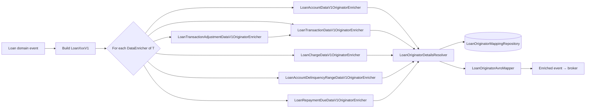
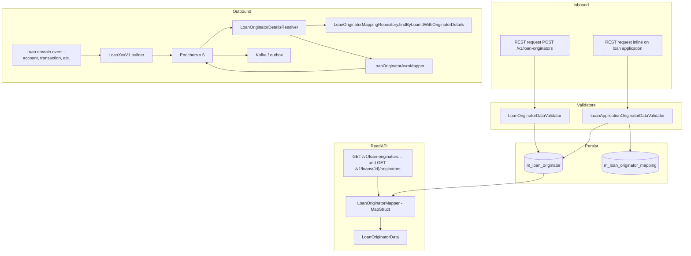

The Apache Fineract loan origination module makes its data visible to the outside world in three different forms. Each *outbound business event* the platform publishes for a loan (account update, charge change, transaction, transaction adjustment, repayment-due reminder, delinquency-range change) is augmented with an `originators[]` array of Avro records. Each *read-API response* projects the `LoanOriginator` JPA entity via a MapStruct mapper into a `LoanOriginatorData` DTO. And the JSON shapes coming *into* the platform are vetted by Gson-backed validators before they reach the write services.

This page covers all three surfaces under `fineract-loan-origination/src/main/java/org/apache/fineract/portfolio/loanorigination/`:

- `enricher/` — six `DataEnricher` beans, the central `LoanOriginatorAvroMapper`.
- `mapper/` — the single MapStruct `LoanOriginatorMapper`.
- `serialization/` — two Gson validators.
- `helper/` — the `LoanOriginatorDetailsResolver` that ties the enrichers to the repository.

Every class on this page is gated by `@ConditionalOnProperty(value = "fineract.module.loan-origination.enabled", havingValue = "true")` — with the flag off, none of the enrichers participate in event emission and the MapStruct interface is not generated as a Spring bean.

## The outbound event pipeline

Apache Fineract's event subsystem builds a domain event, converts it to a versioned Avro record (`LoanAccountDataV1`, `LoanTransactionDataV1`, …), then runs the record through every Spring-discovered `DataEnricher<T>` that supports its type. Each enricher mutates the record in place; the enriched record is then serialised and published (typically to Kafka or to a Postgres outbox).

The loan origination module contributes six enrichers — one per outbound Avro type that has an `originators` slot:

```
fineract-loan-origination/src/main/java/org/apache/fineract/portfolio/loanorigination/enricher/
├── LoanAccountDataV1OriginatorEnricher.java
├── LoanAccountDelinquencyRangeDataV1OriginatorEnricher.java
├── LoanChargeDataV1OriginatorEnricher.java
├── LoanRepaymentDueDataV1OriginatorEnricher.java
├── LoanTransactionAdjustmentDataV1OriginatorEnricher.java
├── LoanTransactionDataV1OriginatorEnricher.java
└── LoanOriginatorAvroMapper.java       # shared converter from entity → Avro
```

All six follow exactly the same skeleton:



## The shared resolver: `LoanOriginatorDetailsResolver`

Each enricher delegates the heavy lifting to a single helper bean:

```java title="fineract-loan-origination/src/main/java/org/apache/fineract/portfolio/loanorigination/helper/LoanOriginatorDetailsResolver.java"
@Component
@RequiredArgsConstructor
@ConditionalOnProperty(value = "fineract.module.loan-origination.enabled", havingValue = "true")
public class LoanOriginatorDetailsResolver {

    private final LoanOriginatorMappingRepository loanOriginatorMappingRepository;
    private final LoanOriginatorAvroMapper loanOriginatorAvroMapper;

    /**
     * Fetches originator mappings for the given loan ID and converts them to a list of {@link OriginatorDetailsV1}.
     *
     * @param loanId
     *            the loan ID to resolve originators for
     * @return the list of originator details, or an empty list if none are found
     */
    public List<OriginatorDetailsV1> resolveOriginatorDetails(final Long loanId) {
        final List<LoanOriginatorMapping> mappings = loanOriginatorMappingRepository.findByLoanIdWithOriginatorDetails(loanId);
        if (mappings == null || mappings.isEmpty()) {
            return List.of();
        }

        final List<OriginatorDetailsV1> originators = new ArrayList<>();
        for (LoanOriginatorMapping mapping : mappings) {
            final LoanOriginator originator = mapping.getOriginator();
            if (originator != null) {
                final OriginatorDetailsV1 originatorDetails = loanOriginatorAvroMapper.toAvro(originator);
                if (originatorDetails != null) {
                    originators.add(originatorDetails);
                }
            }
        }

        return List.copyOf(originators);
    }
}
```

Three points worth highlighting:

- **Fetch-join query.** `findByLoanIdWithOriginatorDetails(loanId)` loads the mapping plus the originator plus the code-value sides in one statement — no N+1, even if a loan has multiple originators.
- **Defensive nulls.** Empty mapping list → empty list (not null). Each mapping is checked for null originator (a paranoia guard against orphan rows). Each Avro conversion is checked for null result.
- **Immutable return.** `List.copyOf(...)` keeps callers from accidentally mutating the enricher's internal list.

The helper lives in `helper/` rather than `service/` because it does no business logic — it's a coordinator between the repository and the Avro mapper.

## The Avro mapper

`LoanOriginatorAvroMapper` is the single point that converts a `LoanOriginator` entity to the `OriginatorDetailsV1` Avro record:

```java title="fineract-loan-origination/src/main/java/org/apache/fineract/portfolio/loanorigination/enricher/LoanOriginatorAvroMapper.java"
@Component
@ConditionalOnProperty(value = "fineract.module.loan-origination.enabled", havingValue = "true")
public class LoanOriginatorAvroMapper {

    /**
     * Converts a LoanOriginator entity to OriginatorDetailsV1 Avro
     */
    public OriginatorDetailsV1 toAvro(final LoanOriginator originator) {
        if (originator == null) {
            return null;
        }

        final OriginatorDetailsV1.Builder builder = OriginatorDetailsV1.newBuilder();

        builder.setId(originator.getId());
        builder.setExternalId(originator.getExternalId() != null ? originator.getExternalId().getValue() : null);
        builder.setName(originator.getName());
        builder.setStatus(originator.getStatus() != null ? originator.getStatus().getValue() : null);
        builder.setOriginatorType(mapCodeValue(originator.getOriginatorType()));
        builder.setChannelType(mapCodeValue(originator.getChannelType()));

        return builder.build();
    }

    /**
     * Converts a CodeValue entity to CodeValueDataV1 Avro
     */
    private CodeValueDataV1 mapCodeValue(CodeValue codeValue) {
        if (codeValue == null) {
            return null;
        }

        CodeValueDataV1.Builder builder = CodeValueDataV1.newBuilder();
        builder.setId(codeValue.getId());
        builder.setName(codeValue.getLabel());
        builder.setPosition(codeValue.getPosition());
        builder.setDescription(codeValue.getDescription());
        builder.setActive(codeValue.isActive());
        builder.setMandatory(codeValue.isMandatory());

        return builder.build();
    }
}
```

The Avro schema (`OriginatorDetailsV1`) carries six fields: `id`, `externalId`, `name`, `status` (string), `originatorType` (`CodeValueDataV1`), `channelType` (`CodeValueDataV1`). `CodeValueDataV1` carries the standard code-value bundle: id, name, position, description, active, mandatory.

Why a hand-written builder instead of MapStruct here? Because `OriginatorDetailsV1` is *generated* from an Avro schema (under the `fineract-avro-schemas` module). MapStruct doesn't see the builder methods directly — using `newBuilder().setX()` keeps the conversion explicit and resilient to schema regeneration.

## Enricher anatomy

Every enricher is short, gated, and idempotent. The simplest example:

```java title="fineract-loan-origination/src/main/java/org/apache/fineract/portfolio/loanorigination/enricher/LoanAccountDataV1OriginatorEnricher.java"
@Component
@RequiredArgsConstructor
@ConditionalOnProperty(value = "fineract.module.loan-origination.enabled", havingValue = "true")
public class LoanAccountDataV1OriginatorEnricher implements DataEnricher<LoanAccountDataV1> {

    private final LoanOriginatorDetailsResolver loanOriginatorDetailsResolver;

    @Override
    public boolean isDataTypeSupported(final Class<LoanAccountDataV1> dataType) {
        return dataType.isAssignableFrom(LoanAccountDataV1.class);
    }

    @Override
    public void enrich(final LoanAccountDataV1 data) {
        if (data == null || data.getId() == null) {
            return;
        }

        final List<OriginatorDetailsV1> originators = loanOriginatorDetailsResolver.resolveOriginatorDetails(data.getId());
        if (!originators.isEmpty()) {
            data.setOriginators(originators);
        }
    }
}
```

Pattern:

1. **Null-safety up front.** No work if the input is null or has no id.
2. **Single resolver call.** Hand the loan id (or sub-loan id) to the resolver.
3. **Set only if non-empty.** A loan with no originators leaves the slot null, so consumers can distinguish "no originators" from "module not enabled".

### Six Avro types, one resolver

| Enricher | Avro type | Loan id source |
| --- | --- | --- |
| `LoanAccountDataV1OriginatorEnricher` | `LoanAccountDataV1` | `data.getId()` (loan id is the account id) |
| `LoanAccountDelinquencyRangeDataV1OriginatorEnricher` | `LoanAccountDelinquencyRangeDataV1` | `data.getLoanId()` |
| `LoanChargeDataV1OriginatorEnricher` | `LoanChargeDataV1` | `data.getLoanId()` |
| `LoanRepaymentDueDataV1OriginatorEnricher` | `LoanRepaymentDueDataV1` | `(Long) data.getLoanId()` (typed cast — the Avro field is boxed) |
| `LoanTransactionDataV1OriginatorEnricher` | `LoanTransactionDataV1` | `data.getLoanId()` |
| `LoanTransactionAdjustmentDataV1OriginatorEnricher` | `LoanTransactionAdjustmentDataV1` | from the *transactionToAdjust*; copied onto the *newTransactionDetail* too |

### The transaction-adjustment special case

Transaction adjustments wrap *two* transactions in one Avro record:

```java title="fineract-loan-origination/src/main/java/org/apache/fineract/portfolio/loanorigination/enricher/LoanTransactionAdjustmentDataV1OriginatorEnricher.java"
@Override
public void enrich(final LoanTransactionAdjustmentDataV1 data) {
    final LoanTransactionDataV1 transactionToAdjust = data.getTransactionToAdjust();
    if (transactionToAdjust == null || transactionToAdjust.getLoanId() == null) {
        return;
    }

    final List<OriginatorDetailsV1> originators = loanOriginatorDetailsResolver
            .resolveOriginatorDetails(transactionToAdjust.getLoanId());
    if (!originators.isEmpty()) {
        transactionToAdjust.setOriginators(originators);
        if (data.getNewTransactionDetail() != null) {
            data.getNewTransactionDetail().setOriginators(originators);
        }
    }
}
```

Subtle difference from the `LoanTransactionDataV1OriginatorEnricher`:

- It reads the loan id from the *original* transaction (the one being adjusted).
- It writes the originators onto *both* the original and the new transaction details — guaranteeing the consumer sees them on whichever leg they project.

This means the enricher *does not* simply delegate twice to the transaction enricher. By querying once and assigning twice, it spares the database an unnecessary lookup.

### When an enricher does nothing

If the loan has no originator mappings (`findByLoanIdWithOriginatorDetails` returns empty), every enricher exits without mutating the record. Consumers see a missing `originators` field — which is the correct shape for "this loan was not introduced by an originator".

### When the module is off

Without `fineract.module.loan-origination.enabled = true`, the `@ConditionalOnProperty` filter prevents the enricher beans from being built. The event pipeline's `DataEnricher<T>` discovery returns an empty list for these types, the records ship without the `originators` field, and the rest of the platform behaves as if the module didn't exist.

## The MapStruct mapper

While the enrichers serve Avro for outbound events, the read-API surface serves JSON via a MapStruct mapper:

```java title="fineract-loan-origination/src/main/java/org/apache/fineract/portfolio/loanorigination/mapper/LoanOriginatorMapper.java"
@Mapper(config = MapstructMapperConfig.class, uses = { CodeValueMapper.class })
@ConditionalOnProperty(value = "fineract.module.loan-origination.enabled", havingValue = "true")
public interface LoanOriginatorMapper {

    @Mapping(target = "originatorType", source = "originatorType")
    @Mapping(target = "channelType", source = "channelType")
    @Mapping(target = "externalId", source = "externalId")
    @Mapping(target = "status", expression = "java(entity.getStatus().getValue())")
    LoanOriginatorData toData(LoanOriginator entity);

    List<LoanOriginatorData> toDataList(List<LoanOriginator> entities);
}
```

Things to note:

- **Single interface.** No nested mappers, no helper methods — the entity's shape is so close to the DTO's that MapStruct's defaults handle every other field by name.
- **Composes `CodeValueMapper`.** The shared mapper from `fineract-core` turns `CodeValue` into `CodeValueData` — same JSON shape as everywhere else in the platform.
- **Explicit status conversion.** `LoanOriginatorStatus` carries both a code (the enum constant) and a value (`getValue()`). The DTO carries only the value — hence the inline expression rather than another mapping.
- **List overload.** `toDataList` lets the read service convert a `List<LoanOriginator>` in one call.

The DTO `LoanOriginatorData` lives under `data/` and is the response shape across the entire READ surface:

```
data/
├── LoanApplicationOriginatorData.java
├── LoanOriginatorData.java
├── LoanOriginatorMappingResponse.java
├── LoanOriginatorRequestData.java
├── LoanOriginatorTemplateData.java
└── LoanOriginatorsResponse.java
```

| DTO | Where used |
| --- | --- |
| `LoanOriginatorData` | List & single-originator endpoints; mapping responses (`retrieveByLoanId`). |
| `LoanApplicationOriginatorData` | The inline-on-loan-application validator output (`LoanApplicationOriginatorDataValidator.validateAndExtract`). |
| `LoanOriginatorMappingResponse` | Attach/detach endpoint response. |
| `LoanOriginatorRequestData` | (Internal) request shape used by some helpers. |
| `LoanOriginatorTemplateData` | The `GET /v1/loan-originators/template` response. |
| `LoanOriginatorsResponse` | Wrapper for `GET /v1/loans/{id}/originators` (so the body is `{ "originators": [...] }`). |

## Validators in `serialization/`

Two validators flank the write paths.

### `LoanOriginatorDataValidator`

Used by `LoanOriginatorWritePlatformServiceImpl.create` / `.update`. Vets the standard CRUD JSON:

```java title="fineract-loan-origination/src/main/java/org/apache/fineract/portfolio/loanorigination/serialization/LoanOriginatorDataValidator.java"
public void validateForCreate(final String json) {
    if (StringUtils.isBlank(json)) {
        throw new InvalidJsonException();
    }

    final Type typeOfMap = new TypeToken<Map<String, Object>>() {}.getType();
    this.fromApiJsonHelper.checkForUnsupportedParameters(typeOfMap, json, CREATE_REQUEST_PARAMS);

    final List<ApiParameterError> dataValidationErrors = new ArrayList<>();
    final DataValidatorBuilder baseDataValidator = new DataValidatorBuilder(dataValidationErrors).resource(RESOURCE_NAME);

    final JsonElement element = this.fromApiJsonHelper.parse(json);

    final String externalId = this.fromApiJsonHelper.extractStringNamed(EXTERNAL_ID_PARAM, element);
    baseDataValidator.reset().parameter(EXTERNAL_ID_PARAM).value(externalId).notBlank().notExceedingLengthOf(100);

    final String name = this.fromApiJsonHelper.extractStringNamed(NAME_PARAM, element);
    baseDataValidator.reset().parameter(NAME_PARAM).value(name).ignoreIfNull().notExceedingLengthOf(255);

    if (this.fromApiJsonHelper.parameterExists(STATUS_PARAM, element)) {
        final String status = this.fromApiJsonHelper.extractStringNamed(STATUS_PARAM, element);
        baseDataValidator.reset().parameter(STATUS_PARAM).value(status).notBlank();
        validateStatus(status);
    }

    throwExceptionIfValidationWarningsExist(dataValidationErrors);
}
```

What the validator enforces on create:

| Parameter | Required | Constraint |
| --- | --- | --- |
| `externalId` | yes | not blank, ≤ 100 chars |
| `name` | no | ≤ 255 chars |
| `status` | no | must be valid `LoanOriginatorStatus` |

Unknown parameters are rejected by `checkForUnsupportedParameters` — a typo like `extrnalId` raises HTTP 400 with the bad field name.

### `LoanApplicationOriginatorDataValidator`

Used by `LoanOriginatorLinkingServiceImpl` when processing the inline-on-loan-application array. Different shape:

```java title="fineract-loan-origination/src/main/java/org/apache/fineract/portfolio/loanorigination/serialization/LoanApplicationOriginatorDataValidator.java"
@Component
@RequiredArgsConstructor
@ConditionalOnProperty(value = "fineract.module.loan-origination.enabled", havingValue = "true")
public class LoanApplicationOriginatorDataValidator {

    private static final String RESOURCE_NAME = "loan.originator";
    private static final String ID_PARAM = "id";
    private static final String NAME_PARAM = "name";

    private final CodeValueRepositoryWrapper codeValueRepositoryWrapper;
```

Each element in the application's `originators[]` can carry either an `id` (existing originator) or an `externalId` (resolve or create). The validator returns a `LoanApplicationOriginatorData` DTO carrying the parsed fields:

| Field | Role |
| --- | --- |
| `id` | existing internal originator id |
| `externalId` | existing or new external originator id |
| `name` | optional new originator name |
| `typeId` | `CodeValue` id for originator type (note: field is `typeId`, not `originatorTypeId`, on the inline DTO) |
| `channelTypeId` | `CodeValue` id for channel |

Why a separate validator? Because the inline shape is a *subset* of the standalone create shape, with different defaults and a different code-value resolution: missing types are accepted on a *create-on-loan-application* but the standalone create requires them resolvable from a fixed code list.

## How everything ties together

The full data path from operator request to enriched outbound event:



Three observations:

1. **One repository call per loan id.** The resolver issues exactly one fetch-join SQL statement per event. Heavy event streams therefore add one indexed lookup per record.
2. **Two writers, two validators.** The standalone CRUD path uses `LoanOriginatorDataValidator`; the inline-on-loan-application path uses `LoanApplicationOriginatorDataValidator`. They share no code — by design, because the JSON shapes are different.
3. **The DTO and Avro shapes are intentionally similar.** `LoanOriginatorData` (JSON) and `OriginatorDetailsV1` (Avro) carry the same fields. Tenants that ship loan data to an external store often consume both surfaces and benefit from shape parity.

## Where to read next

- [Originators Domain](/loan-origination/originators-domain) — the entities and SQL behind everything documented here.
- [API and Handlers](/loan-origination/api-and-handlers) — the REST resources, command handlers, write services, and inline-on-loan-application path that feed the mappings the enrichers read.
