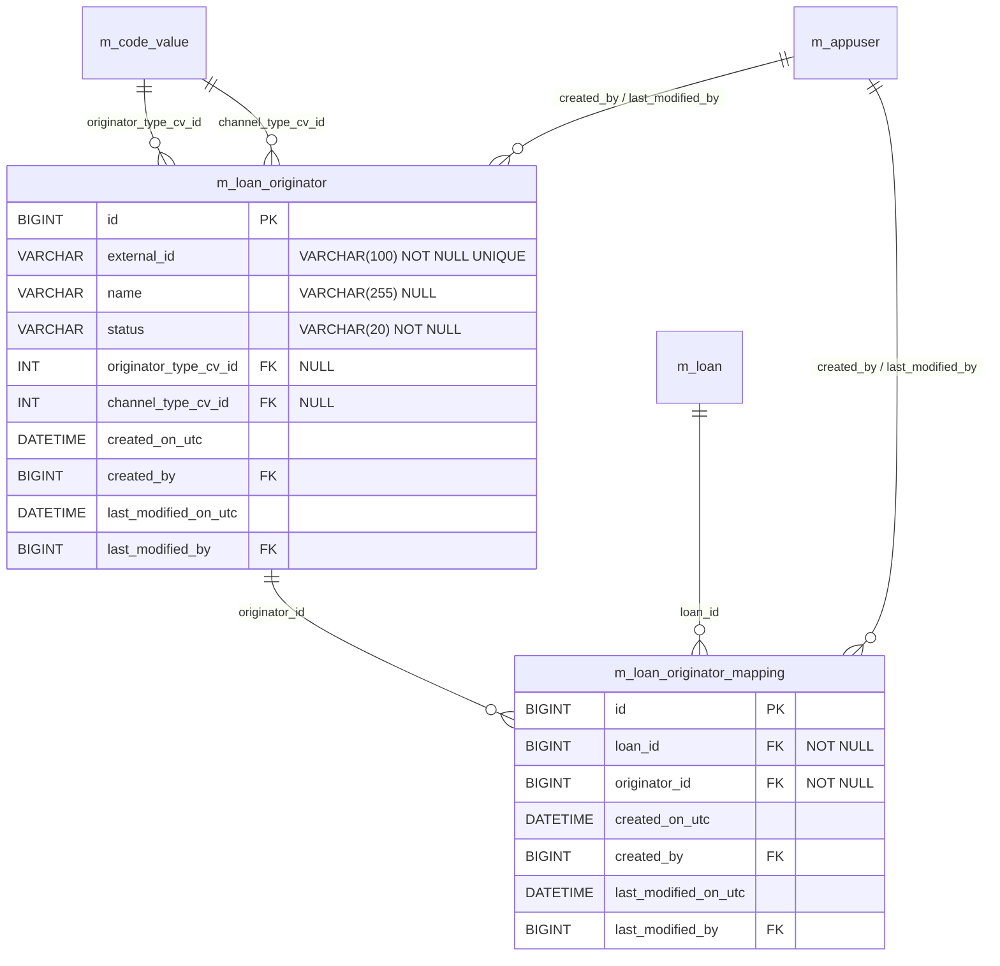
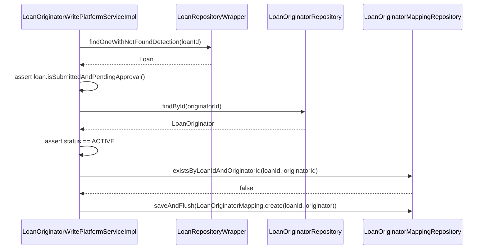
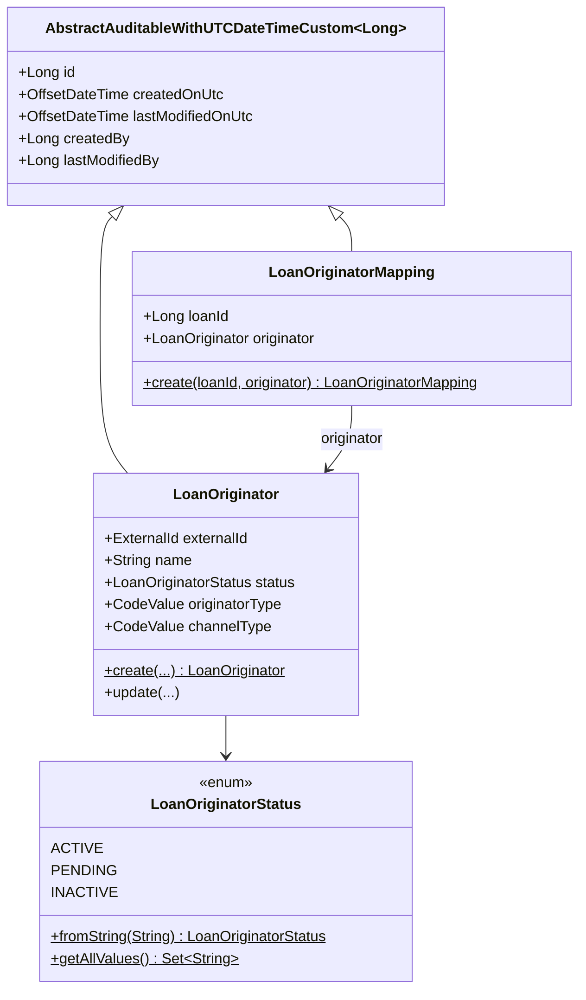

The Apache Fineract loan origination module keeps its domain layer deliberately small: **two entities, one enum, two repositories**, all sitting under `fineract-loan-origination/src/main/java/org/apache/fineract/portfolio/loanorigination/domain/`. Everything about who an originator is, what status they are in, and which loans they are tied to lives in this package.

This page walks through each file, the underlying tables, the JPA mappings, the helper queries that power read endpoints and event enrichment, and the invariants enforced by the schema.

## Package layout

```
fineract-loan-origination/src/main/java/org/apache/fineract/portfolio/loanorigination/domain/
├── LoanOriginator.java               # @Entity m_loan_originator
├── LoanOriginatorMapping.java        # @Entity m_loan_originator_mapping
├── LoanOriginatorStatus.java         # enum ACTIVE | PENDING | INACTIVE
├── LoanOriginatorRepository.java     # Spring Data JPA
└── LoanOriginatorMappingRepository.java
```

There are no `@OneToMany` collections in either direction — the join is modelled by `LoanOriginatorMapping` as an explicit entity, and `Loan` is referenced by `loan_id` (a raw `Long`) rather than a managed `@ManyToOne`. This is a conscious choice: it keeps the module loosely coupled to the `Loan` aggregate (the module depends on `LoanRepositoryWrapper` for lookups but never on the `Loan` graph itself).

## ER diagram



Both tables and their FKs are created by `fineract-loan-origination/src/main/resources/db/changelog/tenant/module/loanorigination/parts/0001_initial_schema.xml`. The MySQL and PostgreSQL variants differ only on timestamp types (`DATETIME` vs `TIMESTAMP WITH TIME ZONE`) — see change sets `loan-origination-011` and `015`.

## `LoanOriginator`

`fineract-loan-origination/src/main/java/org/apache/fineract/portfolio/loanorigination/domain/LoanOriginator.java`:

```java
@Getter
@Setter
@Entity
@NoArgsConstructor
@Table(name = "m_loan_originator")
public class LoanOriginator extends AbstractAuditableWithUTCDateTimeCustom<Long> {

    @Column(name = "external_id", nullable = false, length = 100, unique = true)
    private ExternalId externalId;

    @Column(name = "name", length = 255)
    private String name;

    @Enumerated(EnumType.STRING)
    @Column(name = "status", nullable = false, length = 20)
    private LoanOriginatorStatus status;

    @ManyToOne(fetch = FetchType.LAZY)
    @JoinColumn(name = "originator_type_cv_id")
    private CodeValue originatorType;

    @ManyToOne(fetch = FetchType.LAZY)
    @JoinColumn(name = "channel_type_cv_id")
    private CodeValue channelType;

    public static LoanOriginator create(ExternalId externalId, String name, LoanOriginatorStatus status,
            CodeValue originatorType, CodeValue channelType) { ... }

    public void update(String name, LoanOriginatorStatus status,
            CodeValue originatorType, CodeValue channelType) { ... }
}
```

### Audit base

The entity inherits from `AbstractAuditableWithUTCDateTimeCustom<Long>`, the standard Fineract base class providing:

- `id` (primary key, `BIGINT autoIncrement`).
- `createdOnUtc`, `lastModifiedOnUtc` (`OffsetDateTime` in UTC).
- `createdBy`, `lastModifiedBy` (`AppUser` FKs).

So change set `loan-origination-014` adds `FK_loan_originator_created_by` and `FK_loan_originator_modified_by` against `m_appuser`.

### `external_id` is the integration handle

`ExternalId` is a Fineract value object that wraps a string and enforces non-blank invariants. It is stored as the column `external_id` and **declared `unique`** at both the JPA level (`unique = true` on `@Column`) and the schema level (`UQ_loan_originator_external_id`). The Swagger model in `LoanOriginatorRequestData` calls this field the *Revenue Share ID*:

```java
@Schema(description = "Unique external identifier (Revenue Share ID)",
        example = "REV-SHARE-001", required = true)
private String externalId;
```

That naming is deliberate: in many lending-as-a-service deployments the external system (the merchant, the broker portal, the affiliate CRM) already issues a stable identifier for itself for revenue settlement, and Fineract stores it verbatim. The platform never mutates this value — `update()` doesn't accept it.

### `name`

Optional, up to 255 chars. Display name only; not unique. Two originators can share the same `name` as long as they have different `external_id`s.

### `status`

A string‑stored enum (`@Enumerated(EnumType.STRING)`) with three legal values, mapped to a `VARCHAR(20)` column.

### `originatorType` and `channelType`

Both are nullable `@ManyToOne(fetch = LAZY)` references to `CodeValue` (the Fineract code‑driven enumeration mechanism). The lazy fetch matters because reading hundreds of originators in a list view would otherwise trigger N+1 queries. The repository compensates with `LEFT JOIN FETCH` queries (see below).

The codes themselves — `LoanOriginatorType` and `LoanOriginationChannelType` — are bootstrapped in change sets `loan-origination-001..010`. Seeded type values are `MERCHANT`, `BROKER`, `AFFILIATE`, `PLATFORM`; seeded channels are `ONLINE`, `IN_STORE`, `API`, `AGGREGATOR`. Tenants can add more via the standard `/v1/codes` / `/v1/codeValues` admin APIs.

### Factory and update

```java
public static LoanOriginator create(ExternalId externalId, String name,
        LoanOriginatorStatus status, CodeValue originatorType, CodeValue channelType) {
    LoanOriginator originator = new LoanOriginator();
    originator.setExternalId(externalId);
    originator.setName(name);
    originator.setStatus(status);
    originator.setOriginatorType(originatorType);
    originator.setChannelType(channelType);
    return originator;
}

public void update(String name, LoanOriginatorStatus status,
        CodeValue originatorType, CodeValue channelType) {
    this.name = name;
    this.status = status;
    this.originatorType = originatorType;
    this.channelType = channelType;
}
```

`update(...)` is exposed as a bulk setter, but the write service (`LoanOriginatorWritePlatformServiceImpl.update`) does not call it. It uses field‑by‑field setters guarded by `JsonCommand.isChangeIn*ParameterNamed(...)` checks so that the resulting `changes` map only contains *actually changed* attributes — that map is what surfaces in the audit log via `CommandProcessingResult.with(changes)`.

<Warning>
The `external_id` field is unique and immutable post-creation. Re-keying an originator requires deleting the row (only possible if no mapping references it — see `LoanOriginatorCannotBeDeletedException`) and re-creating with the new external id. The codebase contains no `setExternalId` call on the entity outside the factory.
</Warning>

## `LoanOriginatorMapping`

`fineract-loan-origination/src/main/java/org/apache/fineract/portfolio/loanorigination/domain/LoanOriginatorMapping.java`:

```java
@Getter
@Setter
@Entity
@NoArgsConstructor
@Table(name = "m_loan_originator_mapping")
public class LoanOriginatorMapping extends AbstractAuditableWithUTCDateTimeCustom<Long> {

    @Column(name = "loan_id", nullable = false)
    private Long loanId;

    @ManyToOne(fetch = FetchType.LAZY)
    @JoinColumn(name = "originator_id", nullable = false)
    private LoanOriginator originator;

    public static LoanOriginatorMapping create(Long loanId, LoanOriginator originator) {
        LoanOriginatorMapping mapping = new LoanOriginatorMapping();
        mapping.setLoanId(loanId);
        mapping.setOriginator(originator);
        return mapping;
    }
}
```

### Why `Long loanId` instead of `@ManyToOne Loan`?

The mapping table holds a plain `Long loan_id` rather than a managed `Loan` reference. Reasons:

- **Aggregate isolation.** `Loan` is a sprawling root in `fineract-portfolio` with dozens of associations. Pulling it into this module's persistence unit would bloat every query and entangle lifecycles.
- **No cascading semantics needed.** The mapping cannot trigger anything on the `Loan` side — only the other way around. Storing the FK as a scalar is sufficient.
- **The schema FK is still in place.** Change set `loan-origination-016` adds `FK_loan_originator_mapping_loan` against `m_loan(id)` with `ON DELETE RESTRICT`. So even though JPA doesn't traverse, the database does enforce referential integrity. Deleting a `Loan` row that has any mapping fails at the DB.

### Why `@ManyToOne` for `originator` but not `loan`?

The two enrichers / read services need to materialise originator fields (`name`, `externalId`, type, channel) for every mapping row. Having `originator` as a managed reference lets the repository express that fetch in JPQL with `JOIN FETCH`. The `loan_id` side never needs to be hydrated — consumers already know the loan they queried by.

### Uniqueness

Change set `loan-origination-019` adds `addUniqueConstraint columnNames="loan_id, originator_id"`. Combined with the write service's `existsByLoanIdAndOriginatorId` pre-check (and a `LoanOriginatorMappingAlreadyExistsException` if the row already exists), duplicate attachments are blocked at two layers — application code and the database.

### Indexes

Change set `loan-origination-021` creates `idx_loan_originator_mapping_originator` on `originator_id` to speed up the "is this originator used anywhere?" check that protects deletion (`existsByOriginatorId` in the write service). Change set `loan-origination-020` adds `idx_loan_originator_status` on `m_loan_originator.status` to speed up status filtering (`findByStatus(...)`).

## `LoanOriginatorStatus`

`fineract-loan-origination/src/main/java/org/apache/fineract/portfolio/loanorigination/domain/LoanOriginatorStatus.java`:

```java
public enum LoanOriginatorStatus {

    ACTIVE("ACTIVE"), PENDING("PENDING"), INACTIVE("INACTIVE");

    private final String value;

    LoanOriginatorStatus(String value) { this.value = value; }

    public String getValue() { return value; }
    public static Set<String> getAllValues() { return values; }

    public static LoanOriginatorStatus fromString(String text) {
        for (LoanOriginatorStatus status : LoanOriginatorStatus.values()) {
            if (status.value.equalsIgnoreCase(text)) return status;
        }
        throw new IllegalArgumentException("Unknown LoanOriginatorStatus: " + text);
    }
}
```

### Semantics

| Value | Meaning | Can be attached to a new loan? | Existing mappings affected? |
| --- | --- | --- | --- |
| `ACTIVE` | The originator is live and may receive new attributions | Yes | n/a |
| `PENDING` | Created but not yet approved for business | No | Existing mappings preserved |
| `INACTIVE` | Decommissioned / off‑boarded | No | Existing mappings preserved |

Two facts make this important:

1. **Only `ACTIVE` originators can be attached.** `LoanOriginatorWritePlatformServiceImpl.attachOriginatorToLoan` does:

   ```java
   if (originator.getStatus() != LoanOriginatorStatus.ACTIVE) {
       throw new LoanOriginatorNotActiveException(originatorId,
           originator.getStatus().getValue());
   }
   ```

   That check applies to both the explicit attach endpoint and the loan-application JSON path (`LoanOriginatorLinkingServiceImpl.resolveOrCreateOriginatorId` -> `validateActive`).

2. **Status changes do not propagate.** Flipping an originator to `INACTIVE` does *not* detach existing mappings. Historic loans keep their originator attribution forever — exactly what reporting needs.

### `getAllValues()`

The static set is used by `LoanOriginatorReadPlatformServiceImpl.retrieveTemplate()` to populate the `statusOptions` of `LoanOriginatorTemplateData`, so UIs can render a drop-down without hard-coding the enum.

### `fromString(...)`

Used by `LoanOriginatorWritePlatformServiceImpl.create` and `update` to parse incoming JSON. The `LoanOriginatorDataValidator.validateStatus` method wraps this call in a try/catch that re-throws as `LoanOriginatorInvalidStatusException`, giving callers a typed 4xx instead of a bare `IllegalArgumentException`.

## `LoanOriginatorRepository`

`fineract-loan-origination/src/main/java/org/apache/fineract/portfolio/loanorigination/domain/LoanOriginatorRepository.java`:

```java
public interface LoanOriginatorRepository
        extends JpaRepository<LoanOriginator, Long>,
                JpaSpecificationExecutor<LoanOriginator> {

    Optional<LoanOriginator> findByExternalId(ExternalId externalId);

    boolean existsByExternalId(ExternalId externalId);

    List<LoanOriginator> findByStatus(LoanOriginatorStatus status);

    @Query("SELECT lo FROM LoanOriginator lo "
         + "LEFT JOIN FETCH lo.originatorType "
         + "LEFT JOIN FETCH lo.channelType")
    List<LoanOriginator> findAllWithCodeValues();

    @Query("SELECT lo FROM LoanOriginator lo "
         + "LEFT JOIN FETCH lo.originatorType "
         + "LEFT JOIN FETCH lo.channelType "
         + "WHERE lo.id = :id")
    Optional<LoanOriginator> findByIdWithCodeValues(@Param("id") Long id);

    @Query("SELECT lo FROM LoanOriginator lo "
         + "LEFT JOIN FETCH lo.originatorType "
         + "LEFT JOIN FETCH lo.channelType "
         + "WHERE lo.externalId = :externalId")
    Optional<LoanOriginator> findByExternalIdWithCodeValues(@Param("externalId") ExternalId externalId);
}
```

### Query catalogue

| Method | Used by | Purpose |
| --- | --- | --- |
| `findByExternalId` | `LoanOriginatorReadPlatformServiceImpl.resolveIdByExternalId`, `LoanOriginatorHelper.findOrCreateOriginatorId` | Lookup by external key; used to translate external IDs to internal IDs on write paths |
| `existsByExternalId` | `LoanOriginatorWritePlatformServiceImpl.create` | Pre-create duplicate check |
| `findByStatus` | Reserved (not currently called); status-filtered listings | List by lifecycle bucket |
| `findAllWithCodeValues` | `retrieveAll()` | Index page; one query for all originators with both code values joined |
| `findByIdWithCodeValues` | `retrieveById(id)` | Detail view |
| `findByExternalIdWithCodeValues` | `retrieveByExternalId(externalId)` | Detail view keyed on external id |

The three `*WithCodeValues` variants use `LEFT JOIN FETCH` to materialize `originatorType` and `channelType` in a single round-trip — without them, every render of `LoanOriginatorData` (via `LoanOriginatorMapper`) would trigger lazy proxies and N+1 reads.

### `JpaSpecificationExecutor`

Extending it leaves room for future filter-builder UIs (status + type + channel combinations) without forcing additional named queries. As of today no `Specification` is constructed in the module, but the capability is enabled.

## `LoanOriginatorMappingRepository`

`fineract-loan-origination/src/main/java/org/apache/fineract/portfolio/loanorigination/domain/LoanOriginatorMappingRepository.java`:

```java
public interface LoanOriginatorMappingRepository
        extends JpaRepository<LoanOriginatorMapping, Long>,
                JpaSpecificationExecutor<LoanOriginatorMapping> {

    List<LoanOriginatorMapping> findByLoanId(Long loanId);

    @Query("""
            SELECT m FROM LoanOriginatorMapping m
            JOIN FETCH m.originator o
            LEFT JOIN FETCH o.originatorType
            LEFT JOIN FETCH o.channelType
            WHERE m.loanId = :loanId
            """)
    List<LoanOriginatorMapping> findByLoanIdWithOriginatorDetails(@Param("loanId") Long loanId);

    boolean existsByLoanId(Long loanId);
    boolean existsByOriginatorId(Long originatorId);

    List<LoanOriginatorMapping> findByOriginatorId(Long originatorId);

    Optional<LoanOriginatorMapping> findByLoanIdAndOriginatorId(Long loanId, Long originatorId);
    boolean existsByLoanIdAndOriginatorId(Long loanId, Long originatorId);

    void deleteByLoanIdAndOriginatorId(Long loanId, Long originatorId);

    @Query("""
            SELECT m FROM LoanOriginatorMapping m
            JOIN FETCH m.originator o
            LEFT JOIN FETCH o.originatorType
            LEFT JOIN FETCH o.channelType
            WHERE m.loanId = :loanId
            """)
    List<LoanOriginatorMapping> findByLoanIdWithOriginator(@Param("loanId") Long loanId);
}
```

### Query catalogue

| Method | Used by | Purpose |
| --- | --- | --- |
| `findByLoanId` | (reserved; un-used in services today) | Light listing without joins |
| `findByLoanIdWithOriginatorDetails` | `LoanOriginatorDetailsResolver.resolveOriginatorDetails` (event enrichers) | Full materialisation for Avro mapping |
| `existsByLoanId` | (reserved; future "does this loan have any originator?" checks) | Cheap existence probe |
| `existsByOriginatorId` | `LoanOriginatorWritePlatformServiceImpl.delete` | Protects originator deletion; throws `LoanOriginatorCannotBeDeletedException` |
| `findByOriginatorId` | (reserved) | Listing all loans for an originator |
| `findByLoanIdAndOriginatorId` | `detachOriginatorFromLoan` | Locate the row to delete; throws `LoanOriginatorMappingNotFoundException` |
| `existsByLoanIdAndOriginatorId` | `attachOriginatorToLoan`, `LoanOriginatorLinkingServiceImpl.processOriginatorsForLoanApplication` | Prevents duplicate attachments |
| `deleteByLoanIdAndOriginatorId` | (reserved; today the service calls `delete(entity)` to keep audit semantics) | Bulk delete |
| `findByLoanIdWithOriginator` | `LoanOriginatorReadPlatformServiceImpl.retrieveByLoanId` | API: list originators for a loan |

The two fetch-joined queries (`findByLoanIdWithOriginatorDetails` and `findByLoanIdWithOriginator`) are functionally identical — they share the same JPQL. They exist as separate methods because they are consumed in different contexts (read API vs. event resolver) and Spring Data caches query plans per method name. Functionally either could be deleted, but the duplication keeps call-sites explicit.

## How the entities are used together

Three flows touch both entities:

### 1. Attach (POST /v1/loans/{loanId}/originators/{originatorId})



The three guards (`isSubmittedAndPendingApproval`, `status == ACTIVE`, `!existsByLoanIdAndOriginatorId`) match exactly the three exceptions `LoanNotInSubmittedStatusException`, `LoanOriginatorNotActiveException`, `LoanOriginatorMappingAlreadyExistsException`.

### 2. Detach (DELETE /v1/loans/{loanId}/originators/{originatorId})

Same loan-status guard, then `findByLoanIdAndOriginatorId(...).orElseThrow(LoanOriginatorMappingNotFoundException::new)` to locate the row, then `delete(mapping)` to remove it.

### 3. Read (GET /v1/loans/{loanId}/originators)

`retrieveByLoanId(loanId)` → `findByLoanIdWithOriginator(loanId)` → stream → `mapping.getOriginator()` → `loanOriginatorMapper.toData(...)`. Empty list if no mappings.

## Schema reference

The full DDL is in `0001_initial_schema.xml`. A compact summary:

```sql
CREATE TABLE m_loan_originator (
  id                    BIGINT       PRIMARY KEY AUTO_INCREMENT,
  external_id           VARCHAR(100) NOT NULL UNIQUE,  -- UQ_loan_originator_external_id
  name                  VARCHAR(255),
  status                VARCHAR(20)  NOT NULL,
  originator_type_cv_id INT,                            -- FK_loan_originator_type_cv
  channel_type_cv_id    INT,                            -- FK_loan_originator_channel_cv
  created_on_utc        DATETIME     NOT NULL,
  created_by            BIGINT       NOT NULL,          -- FK_loan_originator_created_by
  last_modified_on_utc  DATETIME     NOT NULL,
  last_modified_by      BIGINT       NOT NULL           -- FK_loan_originator_modified_by
);
CREATE INDEX idx_loan_originator_status ON m_loan_originator(status);

CREATE TABLE m_loan_originator_mapping (
  id                    BIGINT       PRIMARY KEY AUTO_INCREMENT,
  loan_id               BIGINT       NOT NULL,          -- FK_loan_originator_mapping_loan
  originator_id         BIGINT       NOT NULL,          -- FK_loan_originator_mapping_originator
  created_on_utc        DATETIME     NOT NULL,
  created_by            BIGINT       NOT NULL,
  last_modified_on_utc  DATETIME     NOT NULL,
  last_modified_by      BIGINT       NOT NULL,
  CONSTRAINT UQ_loan_originator_mapping_loan_originator UNIQUE (loan_id, originator_id)
);
CREATE INDEX idx_loan_originator_mapping_originator
  ON m_loan_originator_mapping(originator_id);
```

All foreign keys are declared with `ON DELETE RESTRICT ON UPDATE RESTRICT`. That means:

- An originator with **any** mapping cannot be deleted at the DB; the write service catches this earlier with `existsByOriginatorId(...)` and a typed exception.
- A loan cannot be deleted while it has originator mappings — but Fineract loans are not deleted in practice; they are closed.
- A `CodeValue` that is referenced by an originator cannot be deleted; standard CV-management endpoints surface this restriction.

## Putting it together



That's the entire domain. Next up: the [API and command handlers](/loan-origination/api-and-handlers) that drive writes through these entities, and the [enrichers and mappers](/loan-origination/enrichers-and-mappers) that surface their data on reads and events.
