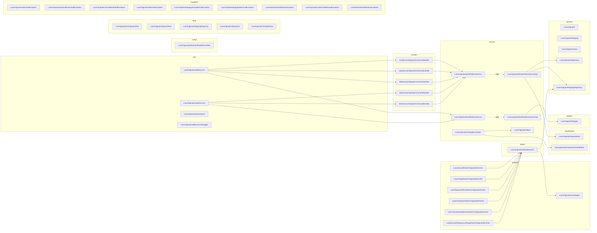
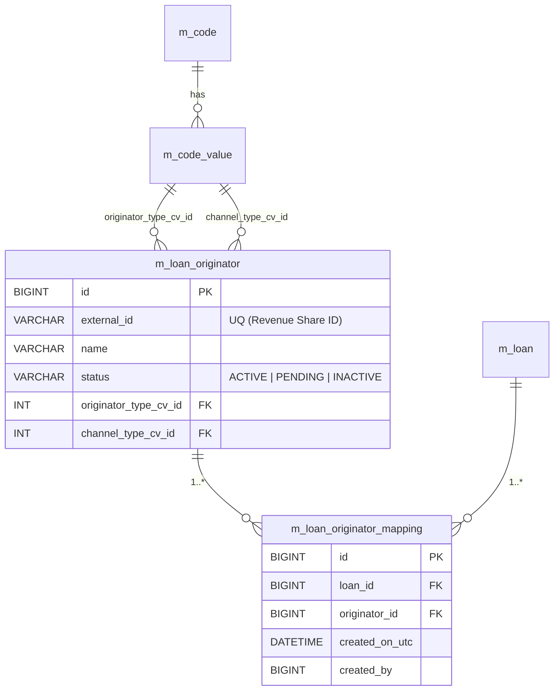
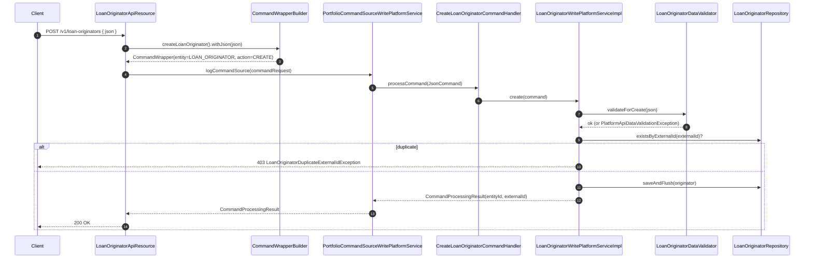
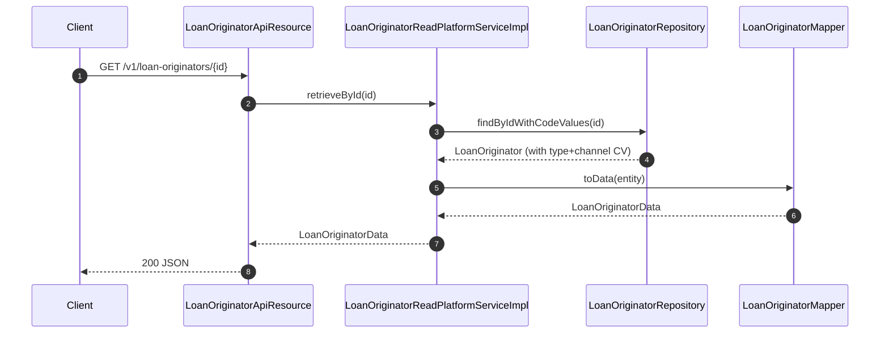
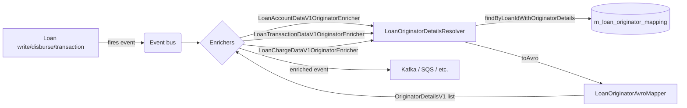

The **loan origination** module in Apache Fineract is a lightweight, opt‑in side car that captures **where each loan came from**. It exists so that microfinance institutions, fintech aggregators, and merchant-funded lenders can answer "who introduced this borrower?", "which broker booked this deal?", "which channel did the application enter through?" and pay revenue share, run channel‑profitability reports, or trigger downstream events accordingly.

Concretely, the module owns two narrow tables — `m_loan_originator` (the directory of brokers, merchants, affiliates, branches) and `m_loan_originator_mapping` (which originators are attached to which loans) — and a thin layer of REST endpoints, command handlers, validators, and Avro enrichers that surface the data to event consumers. It does *not* re-implement loan creation, underwriting, or disbursal; it simply tags loans with originator references and joins them in on the way out.

The whole module is gated behind a single property, `fineract.module.loan-origination.enabled` (see `fineract-loan-origination/src/main/java/org/apache/fineract/portfolio/loanorigination/config/LoanOriginationModuleIsEnabledCondition.java`). When the flag is `false`, no beans are wired, no endpoints are exposed, and the rest of the platform behaves exactly as if the module were not on the classpath.

## What "origination" means here

The word *origination* in the Fineract universe is overloaded. It can mean the workflow of taking a customer from application to disbursal (covered by other parts of the codebase). In this module the word is narrower: an **originator** is a *party who introduced or referred the loan to the lender*. That party may be:

- A merchant accepting a buy‑now‑pay‑later application at point of sale (`MERCHANT`).
- An independent broker quoting and booking deals (`BROKER`).
- An affiliate partner who refers traffic (`AFFILIATE`).
- A platform / aggregator routing applications (`PLATFORM`).

The fixed list of types is seeded as a system code `LoanOriginatorType` by `fineract-loan-origination/src/main/resources/db/changelog/tenant/module/loanorigination/parts/0001_initial_schema.xml` (change sets `loan-origination-002` through `005`). Alongside it, a second code `LoanOriginationChannelType` records the *channel* the originator used — `ONLINE`, `IN_STORE`, `API`, `AGGREGATOR` (change sets `007`–`010`). Both fields are nullable on `LoanOriginator`: an originator may be classed by type only, channel only, both, or neither.

<Note>
Originator and channel taxonomies are stored as **Code Values** in `m_code_value`, so tenants can extend them at runtime — add new types like `EMPLOYEE_REFERRAL` without redeploying. The seeded values are reasonable defaults, not a closed set.
</Note>

## Why a separate module?

Loan attribution is a cross-cutting concern that not every Fineract deployment needs. Carving it out into its own Gradle sub‑project (`fineract-loan-origination/build.gradle` — `description = 'Fineract Loan Origination'`) keeps three things clean:

1. **Schema isolation** — the module ships its own Liquibase changelog (`fineract-loan-origination/src/main/resources/db/changelog/tenant/module/loanorigination/module-changelog-master.xml`) and persistence unit (`fineract-loan-origination/src/main/resources/jpa/static-weaving/module/fineract-loan-origination/persistence.xml`). Tenants that do not enable the module do not get the two extra tables.
2. **Conditional wiring** — every Spring component is annotated with `@ConditionalOnProperty(value = "fineract.module.loan-origination.enabled", havingValue = "true")`. Disabling the flag removes the API resources, command handlers, services, and event enrichers from the application context entirely.
3. **No tight coupling back into core** — the module *consumes* core APIs (`LoanRepositoryWrapper`, `CodeValueRepositoryWrapper`, the command framework, the Avro event schemas) but only exposes one outward integration point: the `LoanOriginatorLinkingService` interface (defined in `fineract-portfolio` and implemented here as `LoanOriginatorLinkingServiceImpl`). That interface is what allows loan application JSON to include an `originators` array and have it processed transparently if the module is on.

## Sub-package map



## Where everything lives

| Sub-package | Responsibility | Key files |
| --- | --- | --- |
| `api/` | JAX‑RS resources, Swagger schemas, parameter constants | `LoanOriginatorApiResource`, `LoanOriginatorsApiResource`, `LoanOriginatorApiConstants`, `LoanOriginatorApiResourceSwagger` |
| `config/` | Spring `Condition` for the module flag | `LoanOriginationModuleIsEnabledCondition` |
| `data/` | DTOs for requests, responses, template payload | `LoanOriginatorRequestData`, `LoanOriginatorMappingResponse`, `LoanOriginatorsResponse`, `LoanOriginatorTemplateData`, `LoanApplicationOriginatorData` |
| `domain/` | JPA entities, status enum, Spring Data repositories | `LoanOriginator`, `LoanOriginatorMapping`, `LoanOriginatorStatus`, `LoanOriginatorRepository`, `LoanOriginatorMappingRepository` |
| `enricher/` | Plug into the Avro event publishing pipeline to add originator details to outgoing loan / charge / transaction events | `LoanAccountDataV1OriginatorEnricher`, `LoanChargeDataV1OriginatorEnricher`, `LoanRepaymentDueDataV1OriginatorEnricher`, `LoanTransactionDataV1OriginatorEnricher`, `LoanTransactionAdjustmentDataV1OriginatorEnricher`, `LoanAccountDelinquencyRangeDataV1OriginatorEnricher`, `LoanOriginatorAvroMapper` |
| `exception/` | Typed `AbstractPlatform*Exception` subclasses for invariants | nine exceptions covering not-found, duplicate, status, mapping, and lifecycle violations |
| `handler/` | `NewCommandSourceHandler` implementations that map `CREATE / UPDATE / DELETE / ATTACH / DETACH` commands to service calls | one per write action |
| `helper/` | Glue for resolving originator details for a given loan (used by enrichers) | `LoanOriginatorDetailsResolver` |
| `mapper/` | MapStruct mapper from `LoanOriginator` entity to `LoanOriginatorData` DTO | `LoanOriginatorMapper` |
| `serialization/` | Gson-backed JSON validators / extractors | `LoanOriginatorDataValidator`, `LoanApplicationOriginatorDataValidator` |
| `service/` | Read and write platform services plus the `LoanOriginatorLinkingService` impl and `LoanOriginatorHelper` | `LoanOriginatorReadPlatformService(Impl)`, `LoanOriginatorWritePlatformService(Impl)`, `LoanOriginatorLinkingServiceImpl`, `LoanOriginatorHelper` |

## The data model in one picture



Two things to notice:

- **External ID is unique** (`UQ_loan_originator_external_id`). This is treated as the *Revenue Share ID* — see the `@Schema` annotation on `LoanOriginatorRequestData.externalId` in `fineract-loan-origination/src/main/java/org/apache/fineract/portfolio/loanorigination/data/LoanOriginatorRequestData.java`. External upstream systems (CRMs, broker portals) provide this ID and Fineract is the consumer.
- **(loan_id, originator_id) is unique** (`UQ_loan_originator_mapping_loan_originator`, changeset `loan-origination-019`). The same originator cannot be attached to the same loan twice; the same loan can have many distinct originators.

## Status lifecycle

`LoanOriginatorStatus` (`fineract-loan-origination/.../domain/LoanOriginatorStatus.java`) is a flat three-value enum:

```java
public enum LoanOriginatorStatus {
    ACTIVE("ACTIVE"), PENDING("PENDING"), INACTIVE("INACTIVE");
    ...
}
```

There is no state-machine — clients move freely between values via `PUT /v1/loan-originators/{id}`. However the write service refuses to **attach** an originator to a loan unless it is `ACTIVE`:

```java
if (originator.getStatus() != LoanOriginatorStatus.ACTIVE) {
    throw new LoanOriginatorNotActiveException(originatorId, originator.getStatus().getValue());
}
```

(see `LoanOriginatorWritePlatformServiceImpl.attachOriginatorToLoan`). This is the only piece of behaviour the enum carries.

## Request → persistence flow

A typical write request flows like this:



The pattern mirrors the rest of Fineract: the API resource never touches the repository directly. It assembles a `CommandWrapper`, hands it to the central `PortfolioCommandSourceWritePlatformService`, which audits, dispatches by `@CommandType`, and invokes the handler.

## Read path

Reads bypass the command bus and go straight from resource → read platform service → MapStruct mapper:



Notice the `findByIdWithCodeValues` query uses `LEFT JOIN FETCH` to materialise the lazy `originatorType` and `channelType` references in one round-trip — without it the mapper would lazy-load each `CodeValue` individually.

## Two API surfaces

The module exposes **two** JAX-RS resources because the two natural views of the data are distinct:

| Resource | Path prefix | Audience | Purpose |
| --- | --- | --- | --- |
| `LoanOriginatorApiResource` | `/v1/loan-originators` | Operations / back office | Manage the originator directory: list, get, create, update, delete |
| `LoanOriginatorsApiResource` | `/v1/loans/{loanId}/originators` | Front-office / underwriting | Manage the link between a specific loan and one or more originators: list, attach, detach |

Both are documented in detail on the [API & handlers](/loan-origination/api-and-handlers) page.

## Event enrichment

When `fineract.module.loan-origination.enabled=true`, six `DataEnricher` beans register themselves in the Avro event pipeline (defined in core under `org.apache.fineract.infrastructure.core.service.DataEnricher`). Whenever a loan, charge, repayment-due, transaction, transaction-adjustment, or delinquency event is built, the matching enricher walks the originator mappings via `LoanOriginatorDetailsResolver.resolveOriginatorDetails(loanId)`, converts each `LoanOriginator` to an `OriginatorDetailsV1` Avro record via `LoanOriginatorAvroMapper`, and attaches the list to the event payload before it is published.



That means downstream consumers see attribution on every loan event automatically — without needing to re-fetch the mapping table themselves. See [Enrichers, mappers & serialization](/loan-origination/enrichers-and-mappers) for the full set.

## Loan-application integration

The module also plugs into the loan-application JSON body. When a user `POST`s a loan application to `/v1/loans` and includes an `originators` array, the loan service calls `LoanOriginatorLinkingService.processOriginatorsForLoanApplication(loanId, jsonArray)`. The implementation, `LoanOriginatorLinkingServiceImpl`, parses each entry (`LoanApplicationOriginatorDataValidator.validateAndExtract`) and either:

1. Resolves an existing originator by `id` or `externalId`, **or**
2. **Creates** a brand-new one — but only if the tenant-level global configuration `ENABLE_ORIGINATOR_CREATION_DURING_LOAN_APPLICATION` is enabled (see changeset `0004_add_global_config_originator_creation.xml`). Otherwise `LoanOriginatorCreationNotAllowedException` is thrown.

Concurrent creations of the same `external_id` are tolerated: `LoanOriginatorHelper.findOrCreateOriginatorId` runs in `REQUIRES_NEW`, and if a `DataIntegrityViolationException` with SQL state `23xxx` is caught, the call is retried (see `LoanOriginatorLinkingServiceImpl.findOrCreateOriginatorIdByExternalId`).

## Permissions

The module ships its own permission set (`fineract-loan-origination/src/main/resources/db/changelog/tenant/module/loanorigination/parts/0002_permissions.xml` and `0003_mapping_permissions.xml`). The relevant constants live in `LoanOriginatorApiConstants`:

```java
public static final String RESOURCE_NAME    = "LOAN_ORIGINATOR";
public static final String ACTION_CREATE    = "CREATE";
public static final String ACTION_UPDATE    = "UPDATE";
public static final String ACTION_DELETE    = "DELETE";
```

Read endpoints use `validateHasReadPermission("LOAN_ORIGINATOR")`. Attach/detach endpoints on `/v1/loans/{loanId}/originators` use `LOAN` resource permissions instead, because that is the resource the user is *modifying* (note the constant `LOAN_RESOURCE_NAME = "LOAN"` in `LoanOriginatorsApiResource`).

## When the module is off

If `fineract.module.loan-origination.enabled` is `false` (or absent), every `@ConditionalOnProperty(...)` bean is skipped. The result:

- No `/v1/loan-originators` or `/v1/loans/{id}/originators` endpoints register.
- The `originators` array in a loan-application JSON is silently ignored — because no bean implements `LoanOriginatorLinkingService`, the loan-application code path that calls it becomes a no-op (it is itself optional-injected in the loan module).
- The Avro enrichers are not registered, so loan events go out without an `originators` field populated.
- The schema migrations under `db/changelog/tenant/module/loanorigination/` are still skipped because the master changelog is only included when the module is on.

This is what makes the module "free" for tenants that don't need it.

## Next stops

<CardGroup cols={3}>
  <Card title="Originators domain" icon="database" href="/loan-origination/originators-domain">
    `LoanOriginator`, `LoanOriginatorMapping`, status lifecycle, repositories, schema constraints.
  </Card>
  <Card title="API & handlers" icon="terminal" href="/loan-origination/api-and-handlers">
    Both JAX-RS resources, every endpoint, the five `@CommandType` handlers, the read & write services.
  </Card>
  <Card title="Enrichers & mappers" icon="bolt" href="/loan-origination/enrichers-and-mappers">
    Avro enrichers, MapStruct mapper, Gson validators, `LoanOriginatorDetailsResolver` helper.
  </Card>
</CardGroup>
