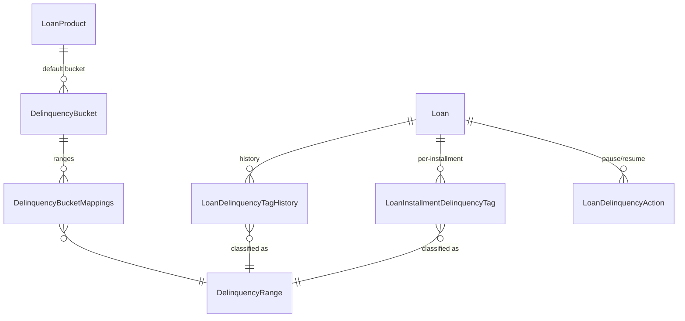
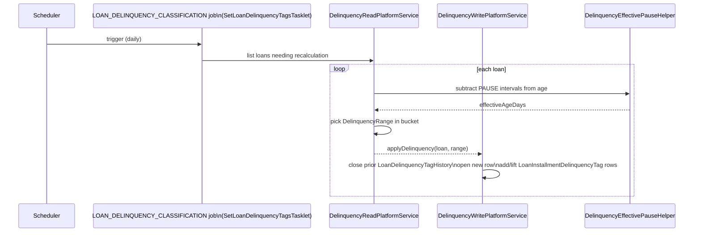

# Delinquency

Apache Fineract classifies overdue loans by mapping their days-overdue (or, optionally, their
installment-level age) onto a configurable ladder of **delinquency ranges** grouped into
**buckets**. A bucket is assigned to a loan product, the nightly
`LOAN_DELINQUENCY_CLASSIFICATION` job (and the `LoanDelinquencyTag` COB step) tags every loan
with its current range, and the history of those tags is stored for reporting and provisioning.

The domain lives mostly in `fineract-loan`, with the two shared "configuration" entities
(`DelinquencyBucket` and `DelinquencyRange`) defined in `fineract-core` so other modules can
reference them:

| Location  | Key classes                                                              |
|-----------|--------------------------------------------------------------------------|
| `fineract-core/.../portfolio/delinquency/domain/`  | `DelinquencyBucket`, `DelinquencyRange` |
| `fineract-loan/.../portfolio/delinquency/api/`     | `DelinquencyApiResource`, `DelinquencyApiResourceSwagger`, `DelinquencyBucketRequest`, `DelinquencyRangeRequest`, `DelinquencyApiConstants` |
| `fineract-loan/.../portfolio/delinquency/domain/`  | `DelinquencyBucketMappings(.Repository)`, `DelinquencyBucketRepository`, `DelinquencyRangeRepository`, `DelinquencyMinimumPaymentPeriodAndRuleRepository`, `LoanDelinquencyTagHistory(.Repository)`, `LoanInstallmentDelinquencyTag(.Repository)`, `LoanDelinquencyAction(.Repository)`, `DelinquencyAction` |
| `fineract-loan/.../portfolio/delinquency/data/`    | `DelinquencyBucketData`, `DelinquencyRangeData`, `LoanDelinquencyTagHistoryData`, `LoanInstallmentDelinquencyTagData`, `DelinquencyMinimumPaymentPeriodAndRuleData` |
| `fineract-loan/.../portfolio/delinquency/service/` | `DelinquencyReadPlatformService(.Impl)`, `DelinquencyWritePlatformService(.Impl)`, `DelinquencyWritePlatformServiceHelper`, `LoanDelinquencyDomainService(.Impl)`, `PossibleNextRepaymentCalculationService(.Discovery)` |

## Configuration entities

### `DelinquencyRange`

`fineract-core/.../delinquency/domain/DelinquencyRange.java` represents a labelled `[min,max]`
window of days overdue. The `classification` column is the human-readable label (e.g.
`"DPD_1_30"`).

```java
@Entity
@Table(name = "m_delinquency_range",
       uniqueConstraints = {
           @UniqueConstraint(name = "uq_delinquency_range_classification",
                             columnNames = { "classification" })
       })
public class DelinquencyRange extends AbstractAuditableWithUTCDateTimeCustom<Long> {

    @Column(name = "classification", nullable = false) private String  classification;
    @Column(name = "min_age_days",   nullable = false) private Integer minimumAgeDays;
    @Column(name = "max_age_days")                     private Integer maximumAgeDays;
}
```

A `null` `maximumAgeDays` means *open ended* – the final "everything older" range.

### `DelinquencyBucket`

`fineract-core/.../delinquency/domain/DelinquencyBucket.java` is a named ordered set of
ranges. The mapping is materialised via the join table `m_delinquency_bucket_mappings`:

```java
@Entity
@Table(name = "m_delinquency_bucket")
public class DelinquencyBucket extends AbstractAuditableWithUTCDateTimeCustom<Long> {

    @Column(name = "name", nullable = false)
    private String name;

    @ManyToMany
    @JoinTable(name = "m_delinquency_bucket_mappings",
               joinColumns        = @JoinColumn(name = "delinquency_bucket_id"),
               inverseJoinColumns = @JoinColumn(name = "delinquency_range_id"))
    private List<DelinquencyRange> ranges;

    @Column(name = "bucket_type")
    private String bucketType;
}
```

`DelinquencyBucketMappings`
(`fineract-loan/.../delinquency/domain/DelinquencyBucketMappings.java`) is the audited mapping
row used by validation when ranges are added or removed.

Ranges inside a bucket must not overlap; the validator in
`DelinquencyWritePlatformServiceImpl` enforces this when a bucket is created or updated.



## Loan-level tagging

### `LoanDelinquencyTagHistory`

`fineract-loan/.../delinquency/domain/LoanDelinquencyTagHistory.java` records one *period* of
classification on the loan as a whole. When the loan moves into a new range a new row is
inserted with `addedOnDate` and the previous row is closed by setting `liftedOnDate`.

```java
@Entity
@Table(name = "m_loan_delinquency_tag_history")
public class LoanDelinquencyTagHistory extends AbstractAuditableWithUTCDateTimeCustom<Long> {

    @ManyToOne @JoinColumn(name = "delinquency_range_id", nullable = false)
    private DelinquencyRange delinquencyRange;

    @ManyToOne @JoinColumn(name = "loan_id", nullable = false)
    private Loan loan;

    @Column(name = "addedon_date",  nullable = false) private LocalDate addedOnDate;
    @Column(name = "liftedon_date")                   private LocalDate liftedOnDate;

    @Version private Long version;
}
```

### `LoanInstallmentDelinquencyTag`

For installment-level delinquency
(`fineract-loan/.../delinquency/domain/LoanInstallmentDelinquencyTag.java`), each *currently
delinquent* installment carries its own row capturing the range, the date the tag was raised,
the first overdue date and the outstanding amount:

```java
@Entity
@Table(name = "m_loan_installment_delinquency_tag")
public class LoanInstallmentDelinquencyTag extends AbstractAuditableWithUTCDateTimeCustom<Long> {

    @ManyToOne @JoinColumn(name = "delinquency_range_id", nullable = false)
    private DelinquencyRange delinquencyRange;
    @ManyToOne @JoinColumn(name = "loan_id",              nullable = false) private Loan loan;
    @ManyToOne @JoinColumn(name = "installment_id",       nullable = false)
    private LoanRepaymentScheduleInstallment installment;

    @Column(name = "addedon_date",       nullable = false) private LocalDate addedOnDate;
    @Column(name = "liftedon_date")                        private LocalDate liftedOnDate;
    @Column(name = "first_overdue_date", nullable = false) private LocalDate firstOverdueDate;
    @Column(name = "outstanding_amount", scale = 6, precision = 19) private BigDecimal outstandingAmount;
}
```

### `LoanDelinquencyAction` and `DelinquencyAction`

`fineract-loan/.../delinquency/domain/DelinquencyAction.java` enumerates the actions that can
be recorded against a loan to influence classification:

```java
public enum DelinquencyAction {
    PAUSE,      // freeze ageing for a period
    RESUME,     // explicitly end a pause early
    RESCHEDULE  // emitted when a reschedule request is approved
}
```

`LoanDelinquencyAction` rows persist a `(loan, action, start_date, end_date)` interval. The
classification logic consults `DelinquencyEffectivePauseHelper` (under
`fineract-loan/.../delinquency/helper/`) to subtract any active pause days from a loan's
effective age, which is how a customer in a hardship-pause stays in the same range despite
calendar time passing.

## Classification flow



`LoanDelinquencyDomainServiceImpl`
(`fineract-loan/.../delinquency/service/LoanDelinquencyDomainServiceImpl.java`) is where the
"which range matches?" decision is made by walking the bucket's ranges in ascending order.
`DelinquencyWritePlatformServiceHelper` handles the actual database transitions (lift old
tags, insert new history rows).

`PossibleNextRepaymentCalculationServiceDiscovery`
(`fineract-loan/.../delinquency/service/PossibleNextRepaymentCalculationServiceDiscovery.java`)
picks the appropriate `PossibleNextRepaymentCalculationService` per loan product type, which
is used when computing the *expected* next repayment date for grace/pause logic.

## REST API: `DelinquencyApiResource`

`fineract-loan/.../delinquency/api/DelinquencyApiResource.java` is mounted at
**`/v1/delinquency`** and is split into a ranges sub-resource and a buckets sub-resource:

| Method | Path                                       | Purpose                       |
|--------|--------------------------------------------|-------------------------------|
| GET    | `ranges`                                   | List all `DelinquencyRange`   |
| GET    | `ranges/{delinquencyRangeId}`              | Read one range                |
| POST   | `ranges`                                   | Create a range                |
| PUT    | `ranges/{delinquencyRangeId}`              | Update a range                |
| DELETE | `ranges/{delinquencyRangeId}`              | Delete a range                |
| GET    | `buckets`                                  | List all `DelinquencyBucket`  |
| GET    | `buckets/{delinquencyBucketId}`            | Read one bucket               |
| GET    | `buckets/template`                         | Range options for the UI      |
| POST   | `buckets`                                  | Create a bucket               |
| PUT    | `buckets/{delinquencyBucketId}`            | Update a bucket               |
| DELETE | `buckets/{delinquencyBucketId}`            | Delete a bucket               |

```java
@POST @Path("ranges")
public CommandProcessingResult createDelinquencyRange(
        @Parameter(required = true) DelinquencyRangeRequest request) {
    final CommandWrapper commandRequest = new CommandWrapperBuilder().createDelinquencyRange()
            .withJson(DelinquencyRangeRequestSerializer.toJson(request)).build();
    return this.commandsSourceWritePlatformService.logCommandSource(commandRequest);
}
```

`DelinquencyRangeRequest` and `DelinquencyBucketRequest` carry only the writable fields
(`classification`, `minimumAge`, `maximumAge`, `name`, `ranges`).

## Job: `LOAN_DELINQUENCY_CLASSIFICATION`

The `JobName.LOAN_DELINQUENCY_CLASSIFICATION` entry
(`fineract-core/.../infrastructure/jobs/service/JobName.java`, value `"Loan Delinquency
Classification"`) is wired in
`fineract-loan/.../portfolio/loanaccount/jobs/setloandelinquencytags/`:

- **`SetLoanDelinquencyTagsConfig.java`** – Spring Batch `@Configuration` exposing the
  `Step` and `Job` beans.
- **`SetLoanDelinquencyTagsTasklet.java`** – iterates over loans, calls
  `DelinquencyWritePlatformService` to apply tags and uses
  `DelinquencyEffectivePauseHelper` to honour active pauses.

This job is normally scheduled once per day and is in addition to the per-loan COB step
`SetLoanDelinquencyTagBusinessStep` (in `fineract-provider/.../cob/loan/`), which runs the same
logic in the per-loan Close of Business batch so freshly closed loans get a current tag
without waiting for the nightly job.

## Read APIs and data DTOs

`DelinquencyReadPlatformServiceImpl`
(`fineract-loan/.../delinquency/service/DelinquencyReadPlatformServiceImpl.java`) backs the
GETs and exposes:

- `DelinquencyRangeData` – mirror of `DelinquencyRange`.
- `DelinquencyBucketData` – bucket plus its ordered ranges.
- `LoanDelinquencyTagHistoryData` – loan-level tag history with classification, added/lifted
  dates.
- `LoanInstallmentDelinquencyTagData` – installment-level tag rows with outstanding amount.
- `DelinquencyMinimumPaymentPeriodAndRuleData` – the "minimum payment that resets ageing"
  configuration.

These DTOs are surfaced from the **loan** side too, via
`GET /v1/loans/{loanId}/delinquencytags` and `GET /v1/loans/{loanId}/delinquency-actions` on
`LoansApiResource`.

## Permissions

- `CREATE_DELINQUENCY_RANGE`, `UPDATE_DELINQUENCY_RANGE`, `DELETE_DELINQUENCY_RANGE`
- `CREATE_DELINQUENCY_BUCKET`, `UPDATE_DELINQUENCY_BUCKET`, `DELETE_DELINQUENCY_BUCKET`
- Pause/resume actions on `LoansApiResource` use loan-level permissions
  (`CREATE_DELINQUENCY_ACTION`).

## Validation rules

`fineract-loan/.../delinquency/validator/` houses the data validators triggered from
`DelinquencyWritePlatformServiceImpl`. The key invariants:

- **Range names are unique** (enforced both by the `uq_delinquency_range_classification`
  constraint and a pre-flight check).
- **`min_age_days` ≥ 0** and, when `max_age_days` is provided, `max_age_days ≥ min_age_days`.
- **A bucket's ranges may not overlap.** Sorting by `minimumAgeDays`, each successive range
  must start at exactly `previous.maximumAgeDays + 1`. Gaps are allowed but overlaps are
  rejected.
- **A bucket in use by a loan product cannot be deleted**; the writer raises a domain rule
  exception.
- **A range in use by any bucket cannot be deleted** for the same reason.
- **Loan-level pause windows** (`LoanDelinquencyAction` rows of type `PAUSE`) cannot overlap
  and must lie within the loan's active period.

## Wiring on the loan product

A delinquency bucket is attached to a `LoanProduct` via the join created at product
construction time. The loan account inherits the bucket through `Loan.getLoanProduct()`, and
`LoanDelinquencyDomainServiceImpl` resolves the bucket every time it classifies the loan.
Because the bucket assignment is at the product level, the same set of ranges applies to
every loan from that product – which makes provisioning and reporting straightforward.

## Read endpoints on the loan

The delinquency entities are also exposed through `LoansApiResource` so the UI can show the
loan's current state inline:

- `GET /v1/loans/{loanId}/delinquencytags` – returns the loan's
  `LoanDelinquencyTagHistoryData` list (current and historical).
- `GET /v1/loans/{loanId}/delinquency-actions` – returns the loan's `LoanDelinquencyAction`
  rows (pauses, resumes, and reschedule markers).
- `POST /v1/loans/{loanId}/delinquency-actions` – creates a new `PAUSE` or `RESUME`
  `LoanDelinquencyAction` row.

These endpoints sit alongside the `/v1/delinquency/ranges` and `/v1/delinquency/buckets`
configuration endpoints rather than replacing them.

## Related pages

- [Loan jobs and batch](/loan/loan-jobs-and-batch) – the `LOAN_DELINQUENCY_CLASSIFICATION`
  job is described in context with the other loan jobs.
- [Loan rescheduling](/loan/loan-rescheduling) – approval emits a `RESCHEDULE`
  `DelinquencyAction`.
- [Loan API resources](/loan/loan-api-resources) – delinquency-related endpoints on
  `LoansApiResource`.
