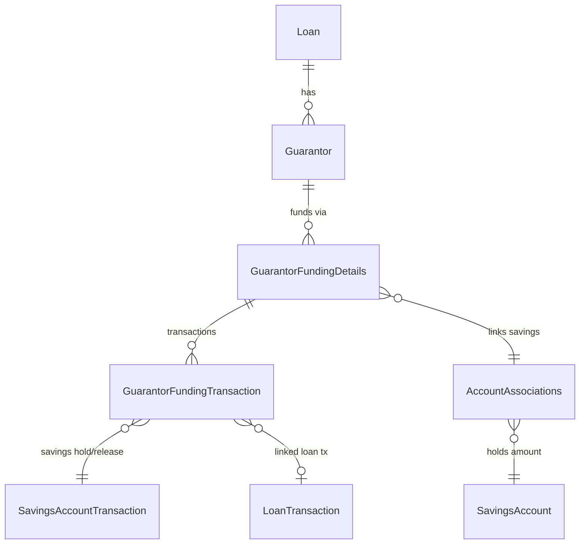
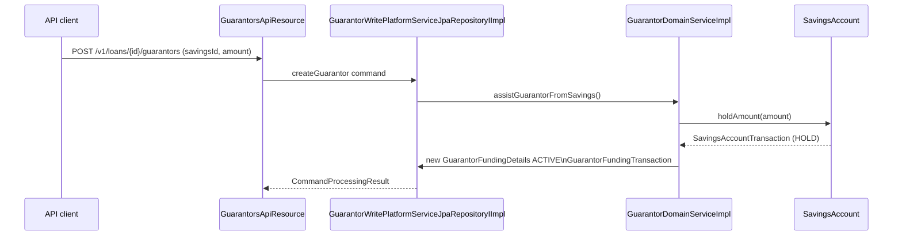
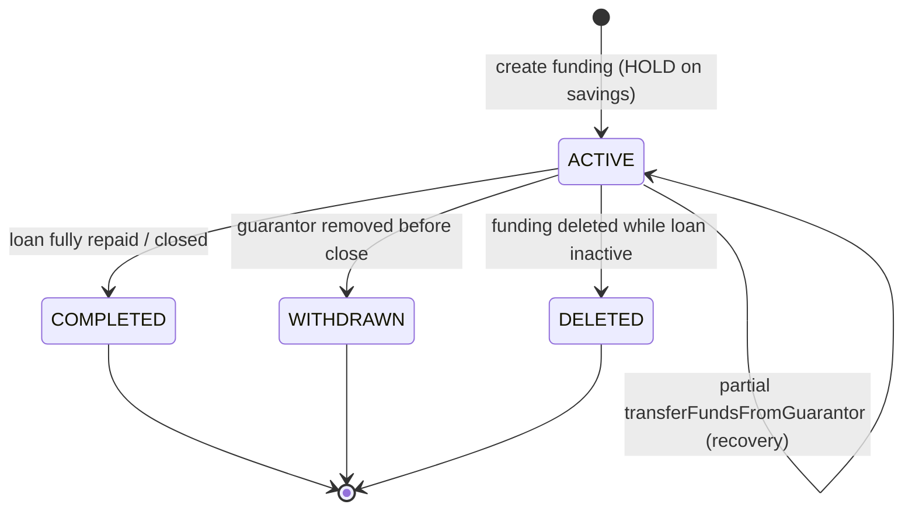

# Guarantors

Apache Fineract lets a loan be backed by one or more **guarantors**. A guarantor can be an
existing customer, a staff member, an external party or a group, and may optionally pledge a
fixed cash amount from a savings account. While the loan is active the pledged amount is held
on the savings account through an account association, and the hold is released when the loan
closes, is written off, or the guarantor is withdrawn.

The domain model lives in two places:

- **`fineract-loan/src/main/java/org/apache/fineract/portfolio/loanaccount/guarantor/`** – type
  enums (`GuarantorType`, `GuarantorFundStatusType`), constants, and the read-side DTOs
  (`GuarantorDTO`, `IGuarantor`, `ObligeeData`).
- **`fineract-provider/src/main/java/org/apache/fineract/portfolio/loanaccount/guarantor/`** –
  JPA entities (`Guarantor`, `GuarantorFundingDetails`, `GuarantorFundingTransaction`),
  repositories, services and the `GuarantorsApiResource`.

## Domain model



### Guarantor

`fineract-provider/.../guarantor/domain/Guarantor.java` is mapped to `m_guarantor`. It owns the
relationship to the loan, the relationship-type code (`client_reln_cv_id`), a `type_enum`
(`GuarantorType`), an optional `entity_id` (linking to a client, staff or group), plus
demographic fields when the guarantor is purely external.

```java
@Entity
@Table(name = "m_guarantor")
public class Guarantor extends AbstractPersistableCustom<Long> {

    @ManyToOne @JoinColumn(name = "loan_id", nullable = false)
    private Loan loan;

    @ManyToOne @JoinColumn(name = "client_reln_cv_id", nullable = false)
    private CodeValue clientRelationshipType;

    @Column(name = "type_enum", nullable = false)
    private Integer gurantorType;

    @Column(name = "entity_id")
    private Long entityId;

    @OneToMany(cascade = CascadeType.ALL, mappedBy = "guarantor", orphanRemoval = true,
              fetch = FetchType.EAGER)
    private List<GuarantorFundingDetails> guarantorFundDetails = new ArrayList<>();
}
```

`GuarantorType` (`fineract-loan/.../guarantor/domain/GuarantorType.java`) defines the four
permitted values:

| Value | Code                          | Meaning            |
|-------|-------------------------------|--------------------|
| `1`   | `guarantor.existing.customer` | Existing client    |
| `2`   | `guarantor.staff`             | Staff member       |
| `3`   | `guarantor.external`          | External person    |
| `4`   | `guarantor.existing.group`    | Existing group     |

### GuarantorFundingDetails

`fineract-provider/.../guarantor/domain/GuarantorFundingDetails.java` is mapped to
`m_guarantor_funding_details` and represents one savings-backed pledge by a guarantor. The hold
itself is implemented through `AccountAssociations` which point at the guarantor's savings
account; the funding row tracks the original `amount`, plus derived `amountReleased`,
`amountRemaining` and `amountTransfered` so balance changes during the loan life-cycle are
auditable.

```java
@Entity
@Table(name = "m_guarantor_funding_details")
public class GuarantorFundingDetails extends AbstractPersistableCustom<Long> {

    @ManyToOne @JoinColumn(name = "guarantor_id", nullable = false)
    private Guarantor guarantor;

    @ManyToOne @JoinColumn(name = "account_associations_id", nullable = false)
    private AccountAssociations accountAssociations;

    @Column(name = "status_enum", nullable = false)
    private Integer status;

    @Column(name = "amount",                  scale = 6, precision = 19, nullable = false)
    private BigDecimal amount;
    @Column(name = "amount_released_derived", scale = 6, precision = 19)
    private BigDecimal amountReleased;
    @Column(name = "amount_remaining_derived",scale = 6, precision = 19)
    private BigDecimal amountRemaining;
    @Column(name = "amount_transfered_derived",scale = 6, precision = 19)
    private BigDecimal amountTransfered;
}
```

The `status` column is filled with `GuarantorFundStatusType`
(`fineract-loan/.../guarantor/domain/GuarantorFundStatusType.java`):

| Value | Status      | When                                        |
|-------|-------------|---------------------------------------------|
| `100` | `ACTIVE`    | Hold is in place on the savings account     |
| `200` | `COMPLETED` | Loan closed and balance released cleanly    |
| `300` | `WITHDRAWN` | Guarantor was removed before completion     |
| `400` | `DELETED`   | Funding row was deleted while loan inactive |

### GuarantorFundingTransaction

`fineract-provider/.../guarantor/domain/GuarantorFundingTransaction.java` records every
movement against a `GuarantorFundingDetails` row, joining the savings-side
`SavingsAccountTransaction` (the hold/release) to the loan-side `LoanTransaction` (the
repayment, charge-off or write-off that triggered it). Each transaction stores its own
`status_enum` and a `reversed` flag, allowing transactions to be undone when a savings or loan
transaction is reversed by an undo command.

## REST API: `GuarantorsApiResource`

The endpoints are exposed by
`fineract-provider/src/main/java/org/apache/fineract/portfolio/loanaccount/guarantor/api/GuarantorsApiResource.java`
under the base path **`/v1/loans/{loanId}/guarantors`**.

| Method | Path                                  | Purpose                                                   |
|--------|---------------------------------------|-----------------------------------------------------------|
| GET    | `template`                            | Type, relationship and savings-account options            |
| GET    | (root)                                | List all guarantors on the loan                           |
| GET    | `{guarantorId}`                       | Read one guarantor                                        |
| POST   | (root)                                | Create a guarantor (optionally with funding)              |
| PUT    | `{guarantorId}`                       | Update a guarantor or its funding                         |
| DELETE | `{guarantorId}?guarantorFundingId=..` | Remove a guarantor or one funding row                     |
| GET    | `accounts/template?clientId=..`       | List the savings accounts eligible for a guarantor client |
| GET    | `downloadtemplate`                    | Bulk-upload XLSX template                                 |
| POST   | `uploadtemplate`                      | Multipart bulk import                                     |

The mutating endpoints follow Fineract's command pattern:

```java
@POST
@Consumes(MediaType.APPLICATION_JSON)
@Produces(MediaType.APPLICATION_JSON)
public CommandProcessingResult createGuarantor(@PathParam("loanId") final Long loanId,
        final GuarantorsRequest guarantorsRequest) {
    final CommandWrapper commandRequest = new CommandWrapperBuilder()
            .createGuarantor(loanId)
            .withJson(GuarantorsRequestSerializer.serialize(guarantorsRequest))
            .build();
    return this.commandsSourceWritePlatformService.logCommandSource(commandRequest);
}
```

```java
@DELETE @Path("{guarantorId}")
public CommandProcessingResult deleteGuarantor(@PathParam("loanId") final Long loanId,
        @PathParam("guarantorId") final Long guarantorId,
        @QueryParam("guarantorFundingId") final Long guarantorFundingId) {
    final CommandWrapper commandRequest = new CommandWrapperBuilder()
            .deleteGuarantor(loanId, guarantorId, guarantorFundingId).build();
    return this.commandsSourceWritePlatformService.logCommandSource(commandRequest);
}
```

`GuarantorsRequest` (`.../guarantor/data/GuarantorsRequest.java`) carries `clientRelationshipTypeId`,
`guarantorTypeId`, `entityId`, demographic fields when external, plus optional
`savingsId` / `amount` to create a funding hold in one round-trip.

## Funding a loan via a savings hold

When a guarantor pledges cash, the create-guarantor command builds an `AccountAssociations`
row linking the loan to the guarantor's savings account and creates a
`GuarantorFundingDetails` row with status `ACTIVE`. The required amount is then **held** on
the savings account so it cannot be withdrawn.



The write platform service is wired in
`fineract-provider/.../guarantor/service/GuarantorWritePlatformServiceJpaRepositoryIImpl.java`
and delegates the savings interaction to
`GuarantorDomainServiceImpl`, which uses
`SavingsAccountDomainService.holdAmount(...)` to create a transaction of type *HOLD* on the
savings account. The resulting savings transaction is captured by a
`GuarantorFundingTransaction` row so that the hold and the funding details stay in lock-step.

### Validation

`GuarantorWritePlatformServiceJpaRepositoryIImpl` (and the
`GuarantorCommandFromApiJsonDeserializer`) enforce a number of invariants:

- Existing-customer or group guarantors **must** reference a different `entityId` from the
  loan's own client / group.
- A funding row requires both a `savingsId` and a positive `amount`.
- The savings account must belong to the guarantor entity (when one is set) and be in a status
  that permits a hold (not closed / not blocked).
- An external guarantor (`type_enum = 3`) is allowed only when explicit demographic fields are
  supplied; no `entityId` is permitted.

## Release on closure

Two domain hooks in `GuarantorDomainServiceImpl` keep the savings hold in step with the loan:

- **`releaseGuarantorFunds(loan)`** is fired when the loan closes (full repayment, write-off
  or undo). Each `ACTIVE` `GuarantorFundingDetails` is moved to `COMPLETED`, the hold on the
  savings account is released using `SavingsAccountDomainService.releaseAmount(...)`, and a
  release-type `GuarantorFundingTransaction` is recorded.
- **`transferFundsFromGuarantor(loan, amountToRecover)`** is fired when a charge-off, NPA flag
  or write-off requires recovery from the guarantor. The held amount is transferred onto the
  loan (typically as a repayment); `amountTransfered` and `amountRemaining` on the funding row
  are updated accordingly.



## Read APIs

`GuarantorReadPlatformServiceImpl`
(`fineract-provider/.../guarantor/service/GuarantorReadPlatformServiceImpl.java`) backs the
GET endpoints. The DTOs returned are:

- **`GuarantorData`** – guarantor row with embedded `List<GuarantorFundingData>`.
- **`GuarantorFundingData`** – savings reference, status enum, `amount`, `amountReleased`,
  `amountRemaining`, `amountTransfered` and the list of `GuarantorTransactionData`.
- **`GuarantorTransactionData`** – `savingsTransactionId`, optional `loanTransactionId`,
  status and `reversed` flag.
- **`ObligeeData`** – cross-portfolio summary used by the client-detail endpoint to show
  loans for which a client is acting as guarantor.

## Permissions

The Fineract permission codes used for these endpoints follow the standard
`<ACTION>_GUARANTOR` and `<ACTION>_GUARANTORFUNDS` naming:

- `CREATE_GUARANTOR`, `UPDATE_GUARANTOR`, `DELETE_GUARANTOR`
- `CREATE_GUARANTORFUNDS`, `DELETE_GUARANTORFUNDS`
- `BULKIMPORT_GUARANTOR`

Maker-checker variants (`*_CHECKER`) are also generated automatically by the command
processing infrastructure.

## Constants and JSON parameter names

`fineract-loan/.../guarantor/GuarantorConstants.java` declares the JSON parameter names used
across the API, the deserializer and the entity. The
`GuarantorJSONinputParams` enum lists every supported request field so the JSON deserializer
can validate against an allow-list:

| Constant                          | JSON field                  | Notes                            |
|-----------------------------------|-----------------------------|----------------------------------|
| `GUARANTOR_RELATIONSHIP_TYPE_ID`  | `clientRelationshipTypeId`  | Code value id                    |
| `GUARANTOR_TYPE_ID`               | `guarantorTypeId`           | `GuarantorType` value (1-4)      |
| `ENTITY_ID`                       | `entityId`                  | Client/staff/group id            |
| `FIRSTNAME`/`LASTNAME`            | `firstname`, `lastname`     | Required for external guarantors |
| `DATE_OF_BIRTH`                   | `dob`                       | ISO date                         |
| `ADDRESS_LINE_1` / `ADDRESS_LINE_2` | `addressLine1/2`          | Free text                        |
| `CITY`, `STATE`, `COUNTRY`, `ZIP` | same                        | Free text                        |
| `MOBILE_NUMBER`, `HOUSE_PHONE_NUMBER`, `EMAIL`, `COMMENT` | same      | Free text                        |
| `SAVINGS_ID`                      | `savingsId`                 | Linked savings account           |
| `AMOUNT`                          | `amount`                    | Funding amount                   |

The constants class also exposes the entity name (`"GUARANTOR"`) used by the command
infrastructure for permission resolution.

## Read service queries

`GuarantorReadPlatformServiceImpl`
(`fineract-provider/.../guarantor/service/GuarantorReadPlatformServiceImpl.java`) issues a
small set of JDBC queries via `JdbcTemplate`:

- **Existing guarantors on a loan** – joined with `m_code_value` for the relationship-type
  label and with `m_guarantor_funding_details` to embed funding rows; this is what
  `GET /v1/loans/{loanId}/guarantors` returns.
- **Single guarantor + funding** – the same projection scoped by `guarantor.id` for the
  `GET /v1/loans/{loanId}/guarantors/{guarantorId}` route.
- **Obligee data** – `retrieveObligeeData(clientId)` joins `m_guarantor`, `m_loan`, `m_office`
  and `m_client` so the client-detail page can list the loans on which the client is acting
  as guarantor (the *obligee* view).

The DTO returned to the API includes both the guarantor's own status (active/withdrawn) and a
roll-up of the funding rows so the UI can show "secured by $X" without a second round-trip.

## Bulk import

The two endpoints `GET /v1/loans/{loanId}/guarantors/downloadtemplate` and
`POST /v1/loans/{loanId}/guarantors/uploadtemplate` round-trip an XLSX file via the
`BulkImportEvent` infrastructure. The download builds a template populated with the available
relationship-type code values and guarantor types; the upload is fanned out into individual
`createGuarantor` commands, one per row, so the same validation rules and permissions apply
as for the JSON API.

## Related pages

- [Loans (overview)](/loan/loan-aggregate) – the loan account these guarantors are attached to.
- [Loan rescheduling](/loan/loan-rescheduling) – guarantor amounts persist across reschedules.
- [Loan API resources](/loan/loan-api-resources) – complete list of loan-side endpoints.
