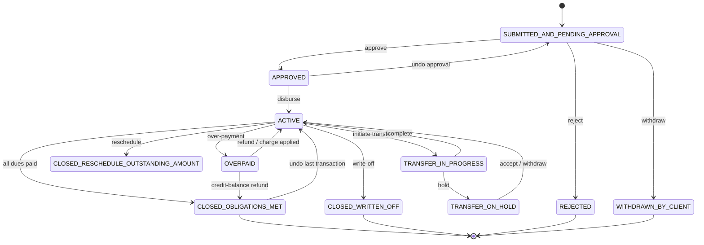
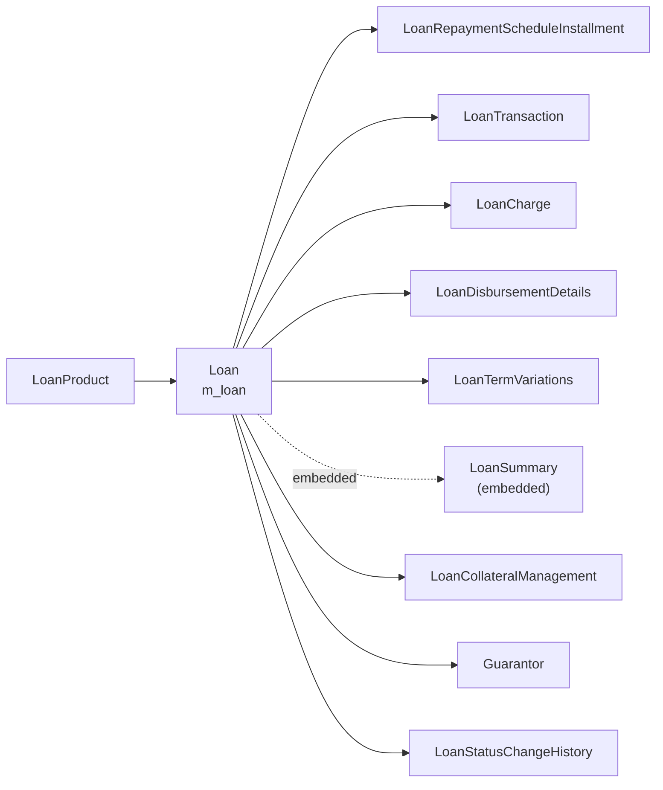

The `Loan` aggregate is the heart of Apache Fineract's loan portfolio. Every loan account — pending, active, written-off or overpaid — is a row in `m_loan` mapped to [`Loan.java`](https://github.com/apache/fineract/blob/develop/fineract-loan/src/main/java/org/apache/fineract/portfolio/loanaccount/domain/Loan.java). The aggregate owns the loan's lifecycle, its link to a [`LoanProduct`](/loan/loan-product), its repayment schedule, its transactions and charges, embedded `LoanSummary` totals and the collateral/guarantor side data. Almost every command-handler, scheduled job and read service in `fineract-loan` and `fineract-progressive-loan` eventually loads, mutates and re-saves this one root.

This page tours the entity itself: which packages own which field groups, how the [`LoanStatus`](https://github.com/apache/fineract/blob/develop/fineract-loan/src/main/java/org/apache/fineract/portfolio/loanaccount/domain/LoanStatus.java) state machine works, and how derived balances on `LoanSummary` are kept in sync with installments and transactions.

## Entity at a glance

```java
// fineract-loan/src/main/java/org/apache/fineract/portfolio/loanaccount/domain/Loan.java
@Entity
@Table(name = "m_loan", uniqueConstraints = {
    @UniqueConstraint(columnNames = { "account_no" }, name = "loan_account_no_UNIQUE"),
    @UniqueConstraint(columnNames = { "external_id" }, name = "loan_externalid_UNIQUE") })
@Getter
public class Loan extends AbstractAuditableWithUTCDateTimeCustom<Long> {
    public static final String RECALCULATE_LOAN_SCHEDULE = "recalculateLoanSchedule";
    // ...
}
```

`Loan` extends `AbstractAuditableWithUTCDateTimeCustom<Long>`, so it inherits `createdBy`, `createdDate`, `lastModifiedBy` and `lastModifiedDate` columns and a numeric primary key. JPA fetches use mostly `FetchType.LAZY`; the aggregate is intentionally heavy and is normally loaded through [`LoanRepositoryWrapper`](https://github.com/apache/fineract/blob/develop/fineract-loan/src/main/java/org/apache/fineract/portfolio/loanaccount/domain/LoanRepositoryWrapper.java), which exposes named loader methods (`findOneWithNotFoundDetection`, `findAccountWithDataForInterestRecalculation`, etc.) that pre-initialize the collections actually needed by a given use case.

## Field groups

The class is large (>4 000 lines) but its state can be grouped into a handful of clusters. Each group lives in well-defined columns inside `m_loan`.

<CardGroup cols={2}>
  <Card title="Identification" icon="fingerprint">
    `id`, `accountNumber`, `externalId`, `loanType` ([`AccountType`](https://github.com/apache/fineract/blob/develop/fineract-core/src/main/java/org/apache/fineract/portfolio/accountdetails/domain/AccountType.java)), `client`, `group` and `office` references.
  </Card>
  <Card title="Product link" icon="link">
    `@ManyToOne LoanProduct loanProduct` plus an embedded `LoanProductRelatedDetail` snapshot — the product's settings at disbursement, copied so later product edits do not retro-actively change the loan.
  </Card>
  <Card title="Term & dates" icon="calendar">
    `submittedOnDate`, `approvedOnDate`, `actualDisbursementDate`, `expectedDisbursementDate`, `closedOnDate`, `overpaidOnDate`, `maturedOnDate`, `termFrequency`, `termPeriodFrequencyType`.
  </Card>
  <Card title="Interest config" icon="percent">
    Inherited from `LoanProductRelatedDetail`: `nominalInterestRatePerPeriod`, `interestPeriodFrequencyType`, [`InterestMethod`](/loan/loan-product#interest-and-amortization-methods), [`AmortizationMethod`](/loan/loan-product#interest-and-amortization-methods), `interestCalculationPeriodMethod`.
  </Card>
  <Card title="Schedule & transactions" icon="list-ol">
    `@OneToMany List<LoanRepaymentScheduleInstallment> repaymentScheduleInstallments` and `@OneToMany List<LoanTransaction> loanTransactions`, ordered by date.
  </Card>
  <Card title="Charges" icon="receipt">
    `Set<LoanCharge> charges` (loan-level), plus `LoanTrancheCharge`/`LoanTrancheDisbursementCharge` and `LoanOverdueInstallmentCharge` for special cases.
  </Card>
  <Card title="Collateral & guarantors" icon="shield">
    `Set<LoanCollateral> collateral`, `Set<LoanCollateralManagement> loanCollateralManagements` and `Set<Guarantor> guarantors`.
  </Card>
  <Card title="Totals" icon="calculator">
    `@Embedded LoanSummary summary` — derived totals updated by `LoanBalanceService`. See [LoanSummary](#loansummary-derived-totals).
  </Card>
</CardGroup>

Additional clusters worth noting:

- **Disbursement tranches** — `Set<LoanDisbursementDetails> disbursementDetails` supports multi-tranche loans.
- **Term variations** — `Set<LoanTermVariations> loanTermVariations` records rescheduling adjustments; the comparator [`LoanTermVariationsComparator`](https://github.com/apache/fineract/blob/develop/fineract-loan/src/main/java/org/apache/fineract/portfolio/loanaccount/domain/LoanTermVariationsComparator.java) orders them deterministically.
- **Interest recalculation** — `LoanInterestRecalculationDetails interestRecalculationDetails` mirrors the per-loan settings copied from the product.
- **Topup / GLIM** — `LoanTopupDetails`, `GroupLoanIndividualMonitoringAccount` for top-up loans and GLIM accounts.
- **Status change history** — `Set<LoanStatusChangeHistory>` and `Set<LoanOfficerAssignmentHistory>` keep an audit trail.

## LoanStatus lifecycle

`LoanStatus` is a closed enum in [`LoanStatus.java`](https://github.com/apache/fineract/blob/develop/fineract-loan/src/main/java/org/apache/fineract/portfolio/loanaccount/domain/LoanStatus.java). Values map to the integer column `loan_status_id` on `m_loan` via [`LoanStatusConverter`](https://github.com/apache/fineract/blob/develop/fineract-loan/src/main/java/org/apache/fineract/portfolio/loanaccount/domain/LoanStatusConverter.java).

```java
public enum LoanStatus {
    INVALID(0, "loanStatusType.invalid"),
    SUBMITTED_AND_PENDING_APPROVAL(100, "loanStatusType.submitted.and.pending.approval"),
    APPROVED(200, "loanStatusType.approved"),
    ACTIVE(300, "loanStatusType.active"),
    TRANSFER_IN_PROGRESS(303, "loanStatusType.transfer.in.progress"),
    TRANSFER_ON_HOLD(304, "loanStatusType.transfer.on.hold"),
    WITHDRAWN_BY_CLIENT(400, "loanStatusType.withdrawn.by.client"),
    REJECTED(500, "loanStatusType.rejected"),
    CLOSED_OBLIGATIONS_MET(600, "loanStatusType.closed.obligations.met"),
    CLOSED_WRITTEN_OFF(601, "loanStatusType.closed.written.off"),
    CLOSED_RESCHEDULE_OUTSTANDING_AMOUNT(602, "loanStatusType.closed.reschedule.outstanding.amount"),
    OVERPAID(700, "loanStatusType.overpaid");
}
```

The status integers are deliberately gapped so closely-related states share a hundreds range — `100` for application, `200` for approval, `300`s for active/transfer, `400`/`500` for terminal-rejection states, `600`s for closed states and `700` for overpaid. The `TRANSFER_*` codes are tied to client-transfer flows in `portfolio/account/service` and behave like a sub-state of `ACTIVE`.



### DefaultLoanLifecycleStateMachine

Status transitions are not performed directly by callers. The [`LoanLifecycleStateMachine`](https://github.com/apache/fineract/blob/develop/fineract-loan/src/main/java/org/apache/fineract/portfolio/loanaccount/domain/LoanLifecycleStateMachine.java) interface and its [`DefaultLoanLifecycleStateMachine`](https://github.com/apache/fineract/blob/develop/fineract-loan/src/main/java/org/apache/fineract/portfolio/loanaccount/domain/DefaultLoanLifecycleStateMachine.java) implementation funnel every transition through a single chokepoint.

```java
@Component
@RequiredArgsConstructor
public class DefaultLoanLifecycleStateMachine implements LoanLifecycleStateMachine {
    private final BusinessEventNotifierService businessEventNotifierService;
    private final LoanBalanceService loanBalanceService;

    @Override
    public void transition(final LoanEvent loanEvent, final Loan loan) {
        loanBalanceService.updateLoanSummaryDerivedFields(loan);
        internalTransition(loanEvent, loan);
    }

    @Override
    public void determineAndTransition(final Loan loan, final LocalDate transactionDate) {
        // ...recomputes summary then chooses an appropriate LoanStatusTransition
    }
}
```

Three contracts matter:

- **`dryTransition(event, loan)`** — returns the would-be next status without mutating the loan; used for command-handler validation.
- **`transition(event, loan)`** — recomputes derived balances via `LoanBalanceService.updateLoanSummaryDerivedFields(...)`, applies the new `LoanStatus`, clears now-irrelevant fields (e.g. `approvedOnDate` on revert) and emits a `LoanStatusChangedBusinessEvent`.
- **`determineAndTransition(loan, date)`** — used after transactions are posted: it inspects current totals and chooses between `ACTIVE`, `CLOSED_OBLIGATIONS_MET` and `OVERPAID` automatically.

The full set of triggers lives in [`LoanEvent`](https://github.com/apache/fineract/blob/develop/fineract-loan/src/main/java/org/apache/fineract/portfolio/loanaccount/domain/LoanEvent.java) (e.g. `LOAN_APPROVED`, `LOAN_DISBURSED`, `LOAN_REPAYMENT_OR_WAIVER`, `WRITE_OFF_OUTSTANDING`, `LOAN_REJECTED`).

<Tip>
Whenever you add a new command or scheduled job that changes loan state, route the change through `LoanLifecycleStateMachine.transition(...)`. Bypassing it means no `LoanSummary` recompute and no `LoanStatusChangedBusinessEvent`, which silently breaks downstream listeners and reporting.
</Tip>

## LoanSummary derived totals

`LoanSummary` is an `@Embeddable` whose columns live inline in `m_loan`. It tracks every monetary total Fineract needs at read time without re-aggregating transactions.

```java
// fineract-loan/src/main/java/org/apache/fineract/portfolio/loanaccount/domain/LoanSummary.java
@Embeddable
@Getter
public class LoanSummary {
    @Column(name = "total_principal_derived", scale = 6, precision = 19)
    private BigDecimal totalPrincipal;

    @Column(name = "principal_disbursed_derived", scale = 6, precision = 19)
    private BigDecimal totalPrincipalDisbursed;

    @Column(name = "principal_repaid_derived", scale = 6, precision = 19)
    private BigDecimal totalPrincipalRepaid;

    @Column(name = "principal_writtenoff_derived", scale = 6, precision = 19)
    private BigDecimal totalPrincipalWrittenOff;
    // ... interest, fees, penalties, charge-off, capitalized income, buy-down fee totals
}
```

Each row covers one money component (principal, interest, fee, penalty) across one outcome (charged, repaid, waived, written-off, outstanding, accrued). New product capabilities have grown the list: `capitalized_income_*`, `buy_down_fee_*`, `discount_fee_*` and `charge_off_*` fields now appear here too. The single source of truth is [`LoanBalanceService`](https://github.com/apache/fineract/blob/develop/fineract-loan/src/main/java/org/apache/fineract/portfolio/loanaccount/service/LoanBalanceService.java) — never patch these columns by hand from SQL or you will drift.

## Aggregate boundaries



Although `Loan` references `LoanProduct`, it does **not** mutate the product. Product configuration is copied into the embedded `LoanProductRelatedDetail` at submit/disburse time, so a later product edit does not silently change live loans. See [Loan Product](/loan/loan-product) for which knobs participate in that snapshot.

## Concurrency

`Loan` has no `@Version` column on the root itself, but key children that change very frequently do — for example `LoanTransaction.version` is `@Version Long version`. Most command handlers rely on serializable database transactions plus `LoanRepositoryWrapper.saveAndFlush(...)` to detect lost updates. When you write new mutators on `Loan`, always pair them with a state-machine call and rely on `LoanBalanceService` to recompute summary fields — that triple keeps the aggregate consistent under concurrent writes.

## Related pages

<CardGroup cols={2}>
  <Card title="Loan Product" icon="cube" href="/loan/loan-product">
    The template that defines every default copied into a fresh `Loan`.
  </Card>
  <Card title="Repayment Schedule Installments" icon="list-ol" href="/loan/repayment-schedule-installments">
    Per-installment field map and settlement order.
  </Card>
  <Card title="Loan Transaction & Charge" icon="receipt" href="/loan/loan-transaction-and-charge">
    How money movements mutate the aggregate.
  </Card>
  <Card title="Schedule Generation" icon="diagram-project" href="/loan/loan-schedule-generation">
    Where the initial installments come from.
  </Card>
</CardGroup>
