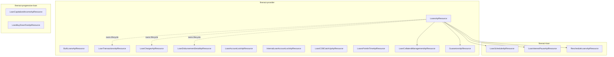

# Loan API Resources

Apache Fineract exposes the loan domain through a fleet of JAX-RS resource classes, one per
*sub-resource*. Each follows the same shape: GET endpoints are served by a
`*ReadPlatformService`, mutating endpoints build a `CommandWrapper` with
`CommandWrapperBuilder` and hand it to `PortfolioCommandSourceWritePlatformService.logCommandSource(...)`,
which dispatches to the appropriate `CommandSourceHandler` (and, for maker-checker, parks
the command in `m_portfolio_command_source`).

This page catalogues the resources, their file paths, base routes and primary command verbs.

## Core loan account

### `LoansApiResource`

`fineract-provider/src/main/java/org/apache/fineract/portfolio/loanaccount/api/LoansApiResource.java`
— base path **`/v1/loans`**.

The hub of the loan domain. It handles application CRUD, state transitions, GLIM accounts,
delinquency tags / actions, approved-amount adjustments and external-id mirror endpoints.

| Operation                         | Endpoint                                              |
|-----------------------------------|-------------------------------------------------------|
| Create application                | `POST /v1/loans`                                      |
| Read loan                         | `GET  /v1/loans/{loanId}`                             |
| Read by external id               | `GET  /v1/loans/external-id/{loanExternalId}`         |
| Modify application                | `PUT  /v1/loans/{loanId}`                             |
| Delete (pending) application      | `DELETE /v1/loans/{loanId}`                           |
| State transitions                 | `POST /v1/loans/{loanId}?command=…` (`approve`, `disburse`, `undoApproval`, `reject`, `withdrawnByApplicant`, `assignLoanOfficer`, `unassignLoanOfficer`, …) |
| Approval template / read template | `GET  /v1/loans/template`, `GET /v1/loans/{loanId}/template` |
| GLIM repayment                    | `GET  /v1/loans/glimAccount/{glimId}`, `POST glimAccount/{glimId}?command=…` |
| Delinquency tag history           | `GET  /v1/loans/{loanId}/delinquencytags`             |
| Delinquency actions               | `GET/POST /v1/loans/{loanId}/delinquency-actions`     |
| Approved amount adjust            | `GET/POST/PUT /v1/loans/{loanId}/approved-amount`     |
| Bulk import                       | `GET /v1/loans/downloadtemplate`, `POST /v1/loans/uploadtemplate`, repayments upload |

### `BulkLoansApiResource`

`fineract-provider/.../portfolio/loanaccount/api/BulkLoansApiResource.java` — base path
**`/v1/loans/loanreassignment`**.

Reassigns loan officers across many loans in one call (with optional date), backed by
`bulkLoanReassignment` commands.

### `LoanScheduleApiResource`

`fineract-loan/src/main/java/org/apache/fineract/portfolio/loanaccount/api/LoanScheduleApiResource.java`
— base path **`/v1/loans/{loanId}/schedule}`**.

Schedule-only endpoints used to update or recalculate the schedule on an active loan via
`?command=updateLoanSchedule`. Reads return a `LoanScheduleData` projection.

## Loan transactions

### `LoanTransactionsApiResource`

`fineract-provider/.../portfolio/loanaccount/api/LoanTransactionsApiResource.java` — base path
**`/v1/loans`** (sub-paths under `/transactions`).

Every loan transaction type funnels through this resource:

| Endpoint                                                   | Purpose                          |
|------------------------------------------------------------|----------------------------------|
| `GET  /{loanId}/transactions/template?command=…`           | New-transaction template         |
| `GET  /{loanId}/transactions/{transactionId}`              | Read one transaction             |
| `GET  /{loanId}/transactions/external-id/{txExternalId}`   | Read by external id              |
| `POST /{loanId}/transactions?command=…`                    | Add: `repayment`, `merchantIssuedRefund`, `payoutRefund`, `goodwillCredit`, `chargeRefund`, `chargeAdjustment`, `waiveinterest`, `writeoff`, `recoverypayment`, `creditBalanceRefund`, `interestPaymentWaiver`, `disburse`, `disburseToSavings`, `foreclosure`, `chargeOff`, `undoChargeOff`, `reAge`, `reAmortize`, `interestRefund`, `transferLoanFunds` |
| `POST /{loanId}/transactions/{transactionId}?command=…`    | Adjust/undo: `adjust`, `undo`, `chargeback`, `acceptTransfer`, `rejectTransfer`, `withdrawTransfer` |
| `POST /{loanId}/transactions/external-id/{txExternalId}?command=…` | Same as above by external id |

The class also exposes `external-id/{loanExternalId}/transactions/…` mirrors so the loan can
be addressed by external id end-to-end.

### `LoanChargesApiResource`

`fineract-provider/.../portfolio/loanaccount/api/LoanChargesApiResource.java` — base path
**`/v1/loans`**, sub-paths under `/charges` and `/template`.

Primary commands from its `CommandWrapperBuilder` calls:

- `createLoanCharge`
- `updateLoanCharge`
- `payLoanCharge`
- `deleteLoanCharge`
- `deactivateOverdueLoanCharges`

Used to attach fees and penalties, pay or waive them, and stop charging overdue penalties on a
loan.

### `LoanDisbursementDetailApiResource`

`fineract-provider/.../portfolio/loanaccount/api/LoanDisbursementDetailApiResource.java` —
base path **`/v1/loans/{loanId}/disbursements`**.

Manages multi-tranche disbursement schedules: `addAndDeleteDisbursementDetail`,
`updateDisbursementDate`, individual tranche read/update/delete.

## Loan COB

### `LoanAccountLockApiResource` and `InternalLoanAccountLockApiResource`

`fineract-provider/src/main/java/org/apache/fineract/cob/api/LoanAccountLockApiResource.java`
and `InternalLoanAccountLockApiResource.java`.

Read the COB lock state of loans and (in tests/admin) force-release locks acquired by the
`LOAN_COB` job.

### `LoanCOBCatchUpApiResource` / `WorkingCapitalLoanCOBCatchUpApiResource`

`fineract-provider/src/main/java/org/apache/fineract/cob/api/LoanCOBCatchUpApiResource.java`
and `WorkingCapitalLoanCOBCatchUpApiResource.java`.

Run an on-demand Close-of-Business catch-up batch for loans whose COB date has fallen
behind the business date.

## Specialised loan capabilities

### `LoanInterestPauseApiResource`

`fineract-loan/src/main/java/org/apache/fineract/portfolio/interestpauses/api/LoanInterestPauseApiResource.java`
— base path **`/v1/loans`** (sub-paths under `/{loanId}/interest-pauses`).

CRUD on **interest pause** windows: stops interest accrual for the given start/end interval.
Commands include `createInterestPause`, `updateInterestPause`, `deleteInterestPause`.

### `LoanCapitalizedIncomeApiResource`

`fineract-progressive-loan/src/main/java/org/apache/fineract/portfolio/loanaccount/api/LoanCapitalizedIncomeApiResource.java`
— base path **`/v1/loans`**, sub-paths under `/{loanId}/capitalized-income`.

Posts capitalised income amounts and their adjustments on **progressive loan** schedules,
adding a new bucket of capital to the next installment.

### `LoanBuyDownFeeApiResource`

`fineract-progressive-loan/src/main/java/org/apache/fineract/portfolio/loanaccount/api/LoanBuyDownFeeApiResource.java`
— base path **`/v1/loans`**, sub-paths under `/{loanId}/buy-down-fee`.

Records buy-down (rate buy-down) fees against a progressive loan – conceptually similar to a
capitalised origination fee.

### `LoansPointInTimeApiResource`

`fineract-provider/src/main/java/org/apache/fineract/portfolio/loanaccount/api/pointintime/LoansPointInTimeApiResource.java`
— base path **`/v1/loans/at-date`**.

Read-only resource that reconstructs a loan's state at a given historical date by replaying
its event journal. Used for audit and back-dated reporting.

## Collateral and guarantors

### `LoanCollateralManagementApiResource`

`fineract-provider/.../portfolio/collateralmanagement/api/LoanCollateralManagementApiResource.java`
— base path **`/v1/loan-collateral-management`**.

`GET` reads one pledge, `DELETE` removes it via `deleteLoanCollateral`. Adding pledges happens
through the loan-application payload (see [Loan collateral](/loan/loan-collateral)).

### `GuarantorsApiResource`

`fineract-provider/.../portfolio/loanaccount/guarantor/api/GuarantorsApiResource.java` — base
path **`/v1/loans/{loanId}/guarantors`**.

CRUD for guarantors and their funding rows; the savings-hold lifecycle is detailed in
[Guarantors](/loan/guarantors). Commands: `createGuarantor`, `updateGuarantor`,
`deleteGuarantor`.

## Rescheduling

### `RescheduleLoansApiResource`

`fineract-loan/.../portfolio/loanaccount/rescheduleloan/api/RescheduleLoansApiResource.java`
— base path **`/v1/rescheduleloans`**.

`POST` creates a request, `POST /{scheduleId}?command=approve|reject` advances it. The
preview endpoint reads as `GET /{scheduleId}?command=previewLoanReschedule`. See
[Loan rescheduling](/loan/loan-rescheduling).

## Reference summary



## Cross-cutting conventions

Every resource above shares the following patterns – useful when reading its code:

- **JAX-RS** (`@Path`, `@GET`, `@POST`, `@PUT`, `@DELETE`) is provided by Jersey under the
  Spring Boot app's REST module.
- **Command pattern.** Mutations build a `CommandWrapper` via `CommandWrapperBuilder`:

  ```java
  final CommandWrapper commandRequest = new CommandWrapperBuilder()
          .createLoanCharge(loanId)
          .withJson(apiRequestBodyAsJson)
          .build();
  return commandsSourceWritePlatformService.logCommandSource(commandRequest);
  ```
- **Maker-checker.** Commands are paired with `*_CHECKER` permissions automatically; the
  resource code does not change for two-step authorisation.
- **External IDs.** Most loan resources offer mirror routes keyed by the loan's external id
  (`/external-id/{loanExternalId}/…`) so external systems can avoid the internal `Long` id.
- **Swagger.** Each resource has a companion `*Swagger` class (e.g.
  `RescheduleLoansApiResourceSwagger`) that defines OpenAPI request/response schemas.
- **Authentication / authorisation.** Every method calls
  `platformSecurityContext.authenticatedUser().validateHasReadPermission(...)` (for reads) or
  goes through the command processing layer (which checks the corresponding
  `<ACTION>_<ENTITY>` permission).

## Module summary

A quick reminder of which Gradle module owns which resource — useful when wiring the
dependency graph or running a single-module test suite:

| Module                       | Resources                                                                                       |
|------------------------------|-------------------------------------------------------------------------------------------------|
| `fineract-provider`          | `LoansApiResource`, `BulkLoansApiResource`, `LoanTransactionsApiResource`, `LoanChargesApiResource`, `LoanDisbursementDetailApiResource`, `LoanCollateralManagementApiResource`, `GuarantorsApiResource`, `LoanAccountLockApiResource`, `LoanCOBCatchUpApiResource`, `LoansPointInTimeApiResource` |
| `fineract-loan`              | `LoanScheduleApiResource`, `RescheduleLoansApiResource`, `LoanInterestPauseApiResource`, `DelinquencyApiResource` (delinquency config) |
| `fineract-progressive-loan`  | `LoanCapitalizedIncomeApiResource`, `LoanBuyDownFeeApiResource`                                |
| `fineract-loan-origination`  | `LoanOriginatorApiResource`, `LoanOriginatorsApiResource`                                       |
| `fineract-working-capital-loan` | `WorkingCapitalLoan*ApiResource`                                                            |

## Internal / test-only resources

A handful of resources are mounted only for testing or internal admin use. They are not part
of the public API surface but appear in the same source tree:

- `fineract-provider/src/main/java/org/apache/fineract/portfolio/loanaccount/api/InternalLoanInformationApiResource.java`
  — gives test code direct access to internal loan state that is otherwise only reachable
  through commands.
- `fineract-progressive-loan/src/main/java/org/apache/fineract/portfolio/loanaccount/service/InternalProgressiveLoanApiResource.java`
  — same idea, scoped to progressive loans.
- `fineract-working-capital-loan/src/main/java/org/apache/fineract/portfolio/workingcapitalloan/api/InternalWorkingCapitalLoanApiResource.java`
  — same idea, scoped to working-capital loans.
- `fineract-provider/src/main/java/org/apache/fineract/cob/api/InternalLoanAccountLockApiResource.java`
  — manipulate COB locks during integration tests.

These are typically guarded by configuration so they are not exposed in production.

## Loan-product, loan-origination and working-capital variants

The loan core itself has product-side and origination-side resources that are referenced from
the loan flow but conceptually live in their own modules:

- `fineract-loan/.../portfolio/loanproduct/api/LoanProductsDetailsApiResource.java` — read
  view that returns a `LoanProductData` projection with all fields needed to render the
  *new loan* form.
- `fineract-provider/.../portfolio/loanproduct/api/LoanProductsApiResource.java` — CRUD on
  the loan-product catalogue itself.
- `fineract-loan-origination/.../portfolio/loanorigination/api/LoanOriginatorApiResource.java`
  and `LoanOriginatorsApiResource.java` — capture loan originator details (a separate domain
  on top of loan applications).
- `fineract-working-capital-loan/.../portfolio/workingcapitalloan/api/WorkingCapitalLoanApiResource.java`
  and siblings (`WorkingCapitalLoanTransactionsApiResource`, `*BreachScheduleApiResource`,
  `*AmortizationScheduleApiResource`, `*DelinquencyActionApiResource`,
  `*DelinquencyRangeScheduleApiResource`) — wholesale lending counterparts of the consumer
  loan endpoints above. They mirror the API shape but live in a separate module.

## Related pages

- [Loans (overview)](/loan/loan-aggregate) – data model and lifecycle.
- [Loan transactions](/loan/loan-transaction-and-charge) – the deeper reference for
  `LoanTransactionsApiResource`.
- [Loan charges](/loan/loan-charge-and-fees) – the deeper reference for `LoanChargesApiResource`.
- [Repayment with post-dated checks](/loan/repayment-with-postdated-checks) – an
  additional loan-attached resource.
