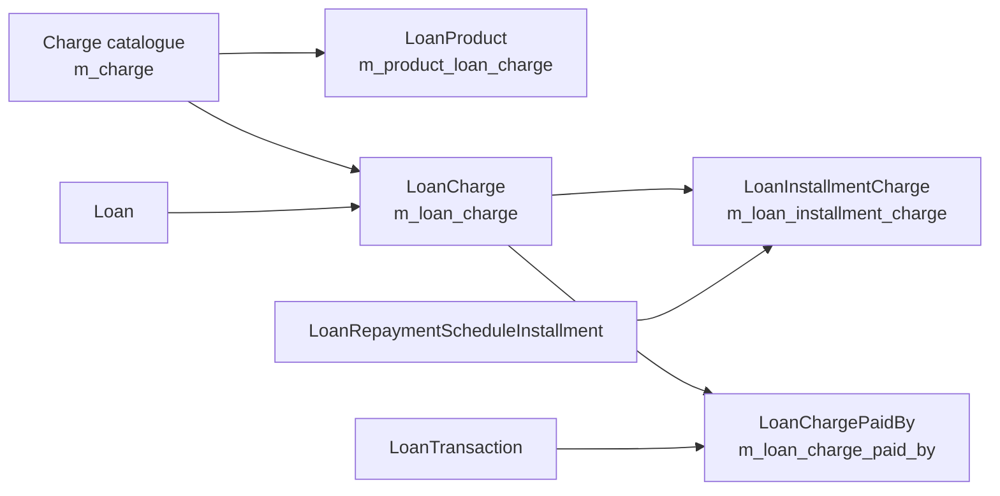

`LoanCharge` is the join entity that attaches a [`Charge`](https://github.com/apache/fineract/blob/develop/fineract-charge/src/main/java/org/apache/fineract/portfolio/charge/domain/Charge.java) — a row from the global charge catalogue — to one specific [`Loan`](/loan/loan-aggregate). The same fee row in `m_charge` can be reused across many products and many loans; `m_loan_charge` is where it gets a *loan-specific* amount, due date, paid / waived / written-off balance and per-installment distribution.

This page is the field-and-API tour for the four resources Apache Fineract ships around loan-level money events that are *not* repayments: regular `LoanCharge` records via `LoanChargesApiResource`, interest pauses via `LoanInterestPauseApiResource`, and the two newer progressive-loan-only resources `LoanBuyDownFeeApiResource` and `LoanCapitalizedIncomeApiResource`.

## `LoanCharge` entity

```java
// fineract-loan/.../loanaccount/domain/LoanCharge.java
@Setter
@Getter
@Entity
@Table(name = "m_loan_charge",
    uniqueConstraints = { @UniqueConstraint(columnNames = { "external_id" }, name = "external_id") })
public class LoanCharge extends AbstractAuditableWithUTCDateTimeCustom<Long> {

    @ManyToOne(optional = false) @JoinColumn(name = "loan_id",   referencedColumnName = "id", nullable = false)
    private Loan loan;

    @ManyToOne(optional = false) @JoinColumn(name = "charge_id", referencedColumnName = "id", nullable = false)
    private Charge charge;

    @Column(name = "charge_time_enum", nullable = false) private Integer chargeTime;
    @Column(name = "submitted_on_date")                  private LocalDate submittedOnDate;
    @Column(name = "due_for_collection_as_of_date")      private LocalDate dueDate;
    // ...calculation, paid/waived/writtenoff, installment children, paid-by, tax details
}
```

### Calculation columns

| Field                      | Column                              | Meaning                                                         |
| -------------------------- | ----------------------------------- | --------------------------------------------------------------- |
| `chargeCalculation`        | `charge_calculation_enum`           | [`ChargeCalculationType`](https://github.com/apache/fineract/blob/develop/fineract-charge/src/main/java/org/apache/fineract/portfolio/charge/domain/ChargeCalculationType.java) — flat vs percentage-of-X |
| `chargePaymentMode`        | `charge_payment_mode_enum`          | [`ChargePaymentMode`](https://github.com/apache/fineract/blob/develop/fineract-charge/src/main/java/org/apache/fineract/portfolio/charge/domain/ChargePaymentMode.java) — regular vs account-transfer |
| `amountOrPercentage`       | `charge_amount_or_percentage`       | Configured input value                                          |
| `percentage`               | `calculation_percentage`            | Percentage (when calculation is %)                              |
| `amountPercentageAppliedTo`| `calculation_on_amount`             | Base amount the percentage was applied against                  |
| `amount`                   | `amount`                            | Resolved monetary charge                                        |
| `minCap` / `maxCap`        | `min_cap`, `max_cap`                | Caps on percentage charges                                      |

### Running balance columns

| Field             | Column                            | Meaning             |
| ----------------- | --------------------------------- | ------------------- |
| `amountPaid`      | `amount_paid_derived`             | Amount paid         |
| `amountWaived`    | `amount_waived_derived`           | Amount waived       |
| `amountWrittenOff`| `amount_writtenoff_derived`       | Amount written off  |
| `amountOutstanding` | `amount_outstanding_derived`    | Amount outstanding  |
| `taxAmount`       | `tax_amount`                      | Tax component       |
| `paid`            | `is_paid_derived`                 | Fully paid flag     |
| `waived`          | `waived`                          | Fully waived flag   |
| `penaltyCharge`   | `is_penalty`                      | Penalty vs fee flag |
| `active`          | `is_active`                       | Soft-delete flag    |

### Children

```java
@OneToMany(cascade = CascadeType.ALL, mappedBy = "loancharge", orphanRemoval = true, fetch = FetchType.LAZY)
private Set<LoanInstallmentCharge> loanInstallmentCharge = new HashSet<>();

@OneToOne(mappedBy = "loancharge", cascade = CascadeType.ALL, orphanRemoval = true, fetch = FetchType.LAZY)
private LoanOverdueInstallmentCharge overdueInstallmentCharge;

@OneToOne(mappedBy = "loancharge", cascade = CascadeType.ALL, orphanRemoval = true, fetch = FetchType.LAZY)
private LoanTrancheDisbursementCharge loanTrancheDisbursementCharge;

@OneToMany(mappedBy = "loanCharge", cascade = CascadeType.ALL, orphanRemoval = true, fetch = FetchType.LAZY)
private Set<LoanChargePaidBy> loanChargePaidBySet = new HashSet<>();

@OneToMany(mappedBy = "loanCharge", cascade = CascadeType.ALL, orphanRemoval = true, fetch = FetchType.LAZY)
private List<LoanChargeTaxDetails> taxDetails = new ArrayList<>();
```

- `loanInstallmentCharge` — see [`LoanInstallmentCharge`](/loan/repayment-schedule-installments#loaninstallmentcharge); used when the charge is spread across installments.
- `overdueInstallmentCharge` — links a charge generated by the overdue job back to the installment that triggered it.
- `loanTrancheDisbursementCharge` — for charges that are tied to a specific disbursement tranche on a multi-tranche loan.
- `loanChargePaidBySet` — every transaction that has touched this charge (see [Transactions & Charges](/loan/loan-transaction-and-charge#loanchargepaidby)).
- `taxDetails` — per-component tax breakdown applied on top of the charge amount.



## Calculation types

`ChargeCalculationType` encodes how `amount` was derived. Common values:

- `FLAT` — a fixed monetary amount, copied straight into `amount`.
- `PERCENT_OF_AMOUNT` — `% × principal`.
- `PERCENT_OF_AMOUNT_AND_INTEREST` — `% × (principal + interest)`.
- `PERCENT_OF_INTEREST` — `% × interest`.
- `PERCENT_OF_DISBURSEMENT_AMOUNT` — `% × disbursed amount` (tranche-aware).

For percentage variants Fineract records both `percentage` and the base it was applied to (`amountPercentageAppliedTo`) so audits can re-derive `amount`. `minCap` / `maxCap` clamp the resulting amount; when either is hit the actual `amount` differs from the raw calculation. Snapshotting this metadata means later edits to the global `Charge` row never silently invalidate historical loan charges.

## Operations

`LoanCharge` exposes a small set of mutation methods that the command handlers call after authorising the action. They all keep `amountPaid`, `amountWaived`, `amountWrittenOff`, `amountOutstanding`, `paid` and `waived` consistent.

- `markAsFullyPaid()` — sets `amountPaid = amount`, `amountOutstanding = 0`, `paid = true`. Called when a payment exhausts the charge.
- `waive(...)` — moves the residual into `amountWaived` and flips `waived = true`. The matching `WAIVE_CHARGES` transaction is created by the command handler and links back via [`LoanChargePaidBy`](/loan/loan-transaction-and-charge#loanchargepaidby).
- **Charge payment** — when paid as its own transaction (`LoanTransactionType.CHARGE_PAYMENT`), a `LoanChargePaidBy` row records the link; the installment-level distribution is updated through the linked `LoanInstallmentCharge`.
- **Charge refund** — `LoanTransactionType.CHARGE_REFUND` reverses a previously paid amount and `reconcileFullyPaid()` recomputes the flags.
- **Charge adjustment** — `LoanTransactionType.CHARGE_ADJUSTMENT` issues a credit against the charge without unwinding earlier payments.

When you reverse the transaction behind any of these operations, the linked `LoanChargePaidBy` rows are reversed too (cascade), which lets the entity rebuild `amountPaid` / `amountWaived` / `amountOutstanding` from history without drifting.

## REST resources

Fineract exposes four resources around loan-level money events that are not repayments. Each one is a thin wrapper around the command-source pipeline (`PortfolioCommandSourceWritePlatformService.logCommandSource(...)`).

### `LoanChargesApiResource`

[`LoanChargesApiResource`](https://github.com/apache/fineract/blob/develop/fineract-provider/src/main/java/org/apache/fineract/portfolio/loanaccount/api/LoanChargesApiResource.java) at `/v1/loans/{loanId}/charges`:

| HTTP   | Path                                                        | Notes                                                            |
| ------ | ----------------------------------------------------------- | ---------------------------------------------------------------- |
| `GET`  | `/{loanId}/charges`                                         | List charges on the loan                                         |
| `GET`  | `/{loanId}/charges/template`                                | Charge UI template                                               |
| `GET`  | `/{loanId}/charges/{loanChargeId}`                          | Retrieve one charge                                              |
| `POST` | `/{loanId}/charges`                                         | Create a charge — or, with `?command=pay`, pay it from a savings |
| `POST` | `/{loanId}/charges/{loanChargeId}?command=pay\|waive\|adjustment` | Pay, waive or adjust an existing charge                     |
| `PUT`  | `/{loanId}/charges/{loanChargeId}`                          | Update a charge                                                  |
| `DELETE`| `/{loanId}/charges/{loanChargeId}`                         | Soft-delete (active=false)                                       |

Each variant also has an `external-id` twin (`/v1/loans/external-id/{loanExternalId}/charges/...`) for integrations that prefer external identifiers.

### `LoanInterestPauseApiResource`

[`LoanInterestPauseApiResource`](https://github.com/apache/fineract/blob/develop/fineract-loan/src/main/java/org/apache/fineract/portfolio/interestpauses/api/LoanInterestPauseApiResource.java) at `/v1/loans/{loanId}/interest-pauses`. It records a date range during which interest accrual is suspended — for hardship, regulatory holds or relief programmes.

| HTTP    | Path                                                              | Action                                  |
| ------- | ----------------------------------------------------------------- | --------------------------------------- |
| `POST`  | `/{loanId}/interest-pauses`                                       | Create an interest pause                |
| `GET`   | `/{loanId}/interest-pauses`                                       | List pauses on a loan                   |
| `PUT`   | `/{loanId}/interest-pauses/{variationId}`                         | Update a pause                          |
| `DELETE`| `/{loanId}/interest-pauses/{variationId}`                         | Delete a pause                          |

Interest pauses are persisted as [`LoanTermVariations`](https://github.com/apache/fineract/blob/develop/fineract-loan/src/main/java/org/apache/fineract/portfolio/loanaccount/domain/LoanTermVariations.java) rows with the appropriate `LoanTermVariationType` so they participate in the schedule recomputation that runs after the variation is saved.

### `LoanBuyDownFeeApiResource`

[`LoanBuyDownFeeApiResource`](https://github.com/apache/fineract/blob/develop/fineract-progressive-loan/src/main/java/org/apache/fineract/portfolio/loanaccount/api/LoanBuyDownFeeApiResource.java) at `/v1/loans/{loanId}/buydown-fees`. Buy-down fees are a progressive-loan feature where an upfront fee subsidises the borrower's effective interest rate. The fee is recognised over time as `BUY_DOWN_FEE_AMORTIZATION` transactions, controlled by the product's [`LoanBuyDownFeeCalculationType`](https://github.com/apache/fineract/blob/develop/fineract-loan/src/main/java/org/apache/fineract/portfolio/loanaccount/domain/LoanBuyDownFeeCalculationType.java), [`LoanBuyDownFeeIncomeType`](https://github.com/apache/fineract/blob/develop/fineract-loan/src/main/java/org/apache/fineract/portfolio/loanaccount/domain/LoanBuyDownFeeIncomeType.java) and [`LoanBuyDownFeeStrategy`](https://github.com/apache/fineract/blob/develop/fineract-loan/src/main/java/org/apache/fineract/portfolio/loanaccount/domain/LoanBuyDownFeeStrategy.java).

| HTTP  | Path                                                      | Action                                          |
| ----- | --------------------------------------------------------- | ----------------------------------------------- |
| `GET` | `/{loanId}/buydown-fees`                                  | List buy-down fee transactions on the loan      |
| `GET` | `/{loanId}/buydown-fees/{loanTransactionId}`              | Allocation detail for one buy-down fee tx       |

### `LoanCapitalizedIncomeApiResource`

[`LoanCapitalizedIncomeApiResource`](https://github.com/apache/fineract/blob/develop/fineract-progressive-loan/src/main/java/org/apache/fineract/portfolio/loanaccount/api/LoanCapitalizedIncomeApiResource.java) at `/v1/loans/{loanId}/capitalized-incomes` (with a sibling `/deferredincome` view). Capitalized income is the symmetric concept — origination income recognised across the loan's life via `CAPITALIZED_INCOME_AMORTIZATION` transactions, driven by [`LoanCapitalizedIncomeCalculationType`](https://github.com/apache/fineract/blob/develop/fineract-loan/src/main/java/org/apache/fineract/portfolio/loanaccount/domain/LoanCapitalizedIncomeCalculationType.java), [`LoanCapitalizedIncomeType`](https://github.com/apache/fineract/blob/develop/fineract-loan/src/main/java/org/apache/fineract/portfolio/loanaccount/domain/LoanCapitalizedIncomeType.java) and [`LoanCapitalizedIncomeStrategy`](https://github.com/apache/fineract/blob/develop/fineract-loan/src/main/java/org/apache/fineract/portfolio/loanaccount/domain/LoanCapitalizedIncomeStrategy.java).

| HTTP  | Path                                                            | Action                                            |
| ----- | --------------------------------------------------------------- | ------------------------------------------------- |
| `GET` | `/{loanId}/capitalized-incomes`                                 | List capitalized-income transactions              |
| `GET` | `/{loanId}/capitalized-incomes/{loanTransactionId}`             | Allocation detail for one capitalized-income tx   |
| `GET` | `/{loanId}/deferredincome`                                      | Deferred-income summary view                      |

<Note>
The buy-down-fee and capitalized-income resources only make sense for `LoanScheduleType.PROGRESSIVE` loans — they live in the `fineract-progressive-loan` Gradle module precisely so cumulative-only deployments do not have to load them.
</Note>

## Overdue charges

[`LoanOverdueInstallmentCharge`](https://github.com/apache/fineract/blob/develop/fineract-loan/src/main/java/org/apache/fineract/portfolio/loanaccount/domain/LoanOverdueInstallmentCharge.java) is the back-reference from a `LoanCharge` generated by the *Apply Penalty To Overdue Loans* scheduled job to the installment that triggered it. The job inspects installments whose `dueDate` is past, where `obligationsMet=false`, and creates a new penalty `LoanCharge` (with the catalogue's penalty `Charge` row) flagged via this link. Subsequent reschedules or write-offs can therefore clean up automatically-generated penalties without affecting manually added charges.

## Related pages

<CardGroup cols={2}>
  <Card title="Schedule Installments" icon="list-ol" href="/loan/repayment-schedule-installments">
    Per-installment distribution via `LoanInstallmentCharge`.
  </Card>
  <Card title="Transactions & Charges" icon="receipt" href="/loan/loan-transaction-and-charge">
    `LoanChargePaidBy` and the charge-payment / charge-refund / charge-adjustment transactions.
  </Card>
  <Card title="Loan Product" icon="cube" href="/loan/loan-product">
    Product-attached charges and buy-down / capitalized-income settings.
  </Card>
  <Card title="Loan Aggregate" icon="layer-group" href="/loan/loan-aggregate">
    The loan that owns the charges.
  </Card>
</CardGroup>
