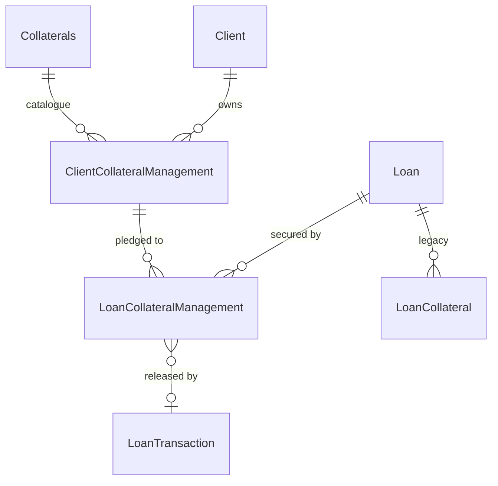
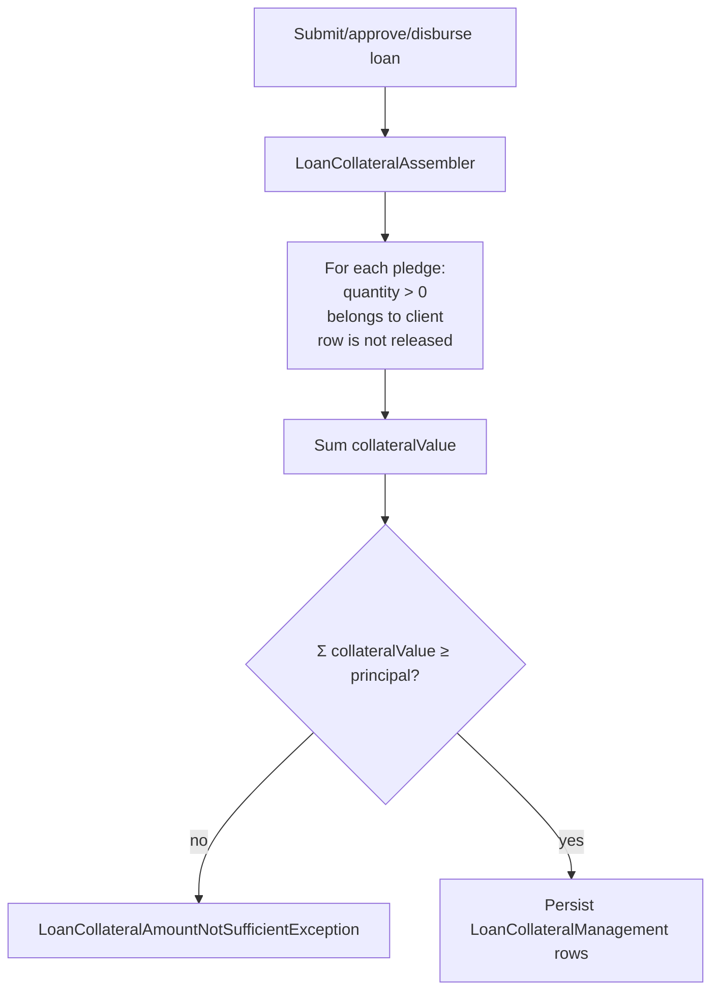

# Loan Collateral

Apache Fineract supports two generations of collateral on a loan account:

- The **legacy `LoanCollateral`** entity (`m_loan_collateral`) – a free-form description plus
  a value, kept for backward compatibility.
- The current **`LoanCollateralManagement`** entity (`m_loan_collateral_management`) – pulls
  collateral from the per-client portfolio (`ClientCollateralManagement` / `Collaterals`) and
  links the pledged item to the loan with a quantity and a release flag.

Both live alongside the loan account: the legacy class is in
`fineract-loan/src/main/java/org/apache/fineract/portfolio/collateral/domain/LoanCollateral.java`
and the management entity is in
`fineract-loan/src/main/java/org/apache/fineract/portfolio/loanaccount/domain/LoanCollateralManagement.java`.

## Why two entities?

The legacy `LoanCollateral` row simply records a description and a monetary value:

```java
@Entity
@Table(name = "m_loan_collateral")
public class LoanCollateral extends AbstractPersistableCustom<Long> {

    @ManyToOne(optional = false) @JoinColumn(name = "loan_id", nullable = false)
    private Loan loan;

    @ManyToOne @JoinColumn(name = "type_cv_id", nullable = false)
    private CodeValue type;

    @Column(name = "value",       scale = 6, precision = 19)
    private BigDecimal value;
    @Column(name = "description", length = 500)
    private String description;
}
```

The newer **collateral management** model is asset-based. A central catalogue of
`Collaterals` (with `basePrice`, `pctToBase` and `unitType`) defines what can be pledged, the
`ClientCollateralManagement` table tracks how much of each asset a particular client owns, and
`LoanCollateralManagement` records how much is currently pledged to a loan:

```java
@Entity
@Table(name = "m_loan_collateral_management")
public class LoanCollateralManagement extends AbstractPersistableCustom<Long> {

    @Column(name = "quantity", nullable = false, scale = 5, precision = 20)
    private BigDecimal quantity;

    @ManyToOne @JoinColumn(name = "transaction_id")
    private LoanTransaction loanTransaction = null;

    @ManyToOne(optional = false) @JoinColumn(name = "loan_id", nullable = false)
    private Loan loan;

    @Column(name = "is_released", nullable = false)
    private boolean isReleased = false;

    @ManyToOne(optional = false) @JoinColumn(name = "client_collateral_id", nullable = false)
    private ClientCollateralManagement clientCollateralManagement;
}
```



The `transaction_id` link on `LoanCollateralManagement` and the `is_released` flag together
mean that releasing collateral is an auditable, transactional act: when a loan is closed or a
withdrawal command is processed the row is flagged released and the triggering
`LoanTransaction` is captured for the audit trail.

## Computing collateral value

Collateral value is derived from the catalogue, not stored:

```
value(pledge) = basePrice * pctToBase / 100 * quantity
```

`fineract-provider/.../collateralmanagement/service/ClientCollateralManagementReadServiceImpl.java`
performs this computation when listing a client's pledgeable assets:

```java
BigDecimal basePrice = clientCollateralManagement.getCollaterals().getBasePrice();
BigDecimal pctToBase = clientCollateralManagement.getCollaterals().getPctToBase()
                          .divide(BigDecimal.valueOf(100));
total            = basePrice.multiply(quantity);
totalCollateral  = total.multiply(pctToBase);
```

`pctToBase` is the haircut that the institution applies to the asset's market price. A loan's
total realisable collateral is the sum of `totalCollateral` for each
`LoanCollateralManagement` row whose `is_released` flag is `false`.

## Validation rules (loan-to-value)

When a collateralised loan is submitted, approved or disbursed, the assembler in
`fineract-provider/.../collateralmanagement/service/LoanCollateralAssembler.java` walks every
pledge and asserts that the sum of computed collateral values is at least the loan's principal.
If not, the writer throws:

```java
throw new LoanCollateralAmountNotSufficientException(loanPrincipal);
```

(see `fineract-provider/.../collateralmanagement/exception/LoanCollateralAmountNotSufficientException.java`).
This is Fineract's enforced loan-to-value (LTV) ceiling: **principal ≤ Σ collateral value**.
Other domain checks performed by the write service include:

- Each pledged `clientCollateralManagement` must belong to the loan's client.
- `quantity` must be > 0 and ≤ the quantity currently free on the client row (i.e. not already
  pledged elsewhere).
- A `LoanCollateralManagement` row cannot be deleted once `is_released = false` and the loan
  is `ACTIVE`; the release must instead be processed via the dedicated transition.
- A missing row throws `LoanCollateralManagementNotFoundException`
  (`fineract-provider/.../collateralmanagement/exception/LoanCollateralManagementNotFoundException.java`).



## REST API: `LoanCollateralManagementApiResource`

The API lives at
`fineract-provider/src/main/java/org/apache/fineract/portfolio/collateralmanagement/api/LoanCollateralManagementApiResource.java`,
under **`/v1/loan-collateral-management`**. Endpoints are CRUD-style on collateral rows; the
*create* path on a loan is handled by the regular `POST /v1/loans` / `PUT /v1/loans/{id}`
payloads via the `collateral` array, but the read and delete endpoints sit on their own
resource:

| Method | Path                        | Action                                          |
|--------|-----------------------------|-------------------------------------------------|
| GET    | `{collateralId}`            | Retrieve a single `LoanCollateralResponseData`  |
| DELETE | `{id}`                      | Remove a pledge while the loan is still pending |

```java
@Path("/v1/loan-collateral-management")
public class LoanCollateralManagementApiResource {

    @DELETE @Path("{id}")
    public CommandProcessingResult deleteLoanCollateral(
            @PathParam("loanId") final Long loanId,
            @PathParam("id")     final Long id) {
        final CommandWrapper commandWrapper = new CommandWrapperBuilder()
                .deleteLoanCollateral(loanId, id).build();
        return this.commandsSourceWritePlatformService.logCommandSource(commandWrapper);
    }

    @GET @Path("{collateralId}")
    public LoanCollateralResponseData getLoanCollateral(
            @PathParam("loanId")       final Long loanId,
            @PathParam("collateralId") final Long collateralId) { ... }
}
```

`LoanCollateralResponseData`
(`fineract-provider/.../collateralmanagement/data/LoanCollateralResponseData.java`) returns the
quantity, the linked client-collateral row and the computed collateral value, while
`LoanCollateralTemplateData`
(`fineract-provider/.../collateralmanagement/data/LoanCollateralTemplateData.java`) is used by
the UI when adding a new pledge to show the catalogue's `basePrice`, `pctToBase` and
`unitType`.

### Adding collateral on a loan

Because pledges are part of the loan payload, you create them through `POST /v1/loans`:

```json
{
  "clientId": 12,
  "productId": 4,
  "principal": 10000,
  "collateral": [
    { "clientCollateralId": 7, "quantity": 50 }
  ],
  ...
}
```

The same `collateral` array is honoured on `PUT /v1/loans/{loanId}` (modify loan application)
when the loan is still in `SUBMITTED_AND_PENDING_APPROVAL` state, and the assembler reuses the
LTV check above.

## Releasing collateral

A pledge is released in two ways:

1. **Automatically on close.** When the loan moves to `CLOSED_OBLIGATIONS_MET` (or
   `CLOSED_WRITTEN_OFF`), the loan write platform service walks any unreleased
   `LoanCollateralManagement` rows, sets `is_released = true` and stamps the closing
   `LoanTransaction` into `transaction_id`.
2. **Explicit removal.** While the loan is still pending or active you can call
   `DELETE /v1/loans/{loanId}/loan-collateral-management/{id}` to drop the pledge; the writer
   rejects deletion once disbursement has happened to avoid breaking the LTV invariant.

## Services and repositories

- `fineract-provider/.../collateralmanagement/service/LoanCollateralManagementReadPlatformService(.java/Impl.java)`
  – list / read pledges, used by the API and by the loan account composer.
- `fineract-provider/.../collateralmanagement/service/LoanCollateralManagementWritePlatformService(.java/Impl.java)`
  – delete / release behaviour and the maker-checker command handlers.
- `fineract-provider/.../collateralmanagement/service/LoanCollateralAssembler.java` – converts
  the JSON `collateral` array into entities, runs LTV validation, attaches rows to the loan.
- `fineract-loan/.../loanaccount/domain/LoanCollateralManagementRepository.java` and
  `fineract-provider/.../collateral/domain/LoanCollateralRepository.java` for persistence.
- `fineract-loan/.../loanaccount/mapper/LoanCollateralManagementMapper.java` – MapStruct
  mapping from entity to `LoanCollateralManagementData`.

## Migration guidance

New deployments should use **`LoanCollateralManagement`** exclusively – the API resource and
the assembler are aimed at it, and the client-side catalogue gives reusable, auditable
valuations. The legacy `LoanCollateral` table is still loaded on existing loans so historical
data is preserved, but the writer no longer creates rows on it for new applications.

## Permissions

The Fineract permission codes used for the collateral endpoints follow the pattern:

- `CREATE_COLLATERAL`, `UPDATE_COLLATERAL`, `DELETE_COLLATERAL` (legacy `m_loan_collateral`)
- `CREATE_LOAN_COLLATERAL_MANAGEMENT`, `UPDATE_LOAN_COLLATERAL_MANAGEMENT`,
  `DELETE_LOAN_COLLATERAL_MANAGEMENT`

`*_CHECKER` variants are generated automatically by the command processing infrastructure.

## Template data

Adding collateral from the UI requires showing the operator the catalogue, the client's
holdings and the haircut for each asset. The template endpoint hands back a
`LoanCollateralTemplateData`
(`fineract-provider/.../collateralmanagement/data/LoanCollateralTemplateData.java`) with:

- `name` – display name
- `basePrice` – market unit price
- `pctToBase` – percentage of base used for collateral valuation (the haircut)
- `unitType` – the unit the catalogue uses (e.g. `gram`, `kg`, `unit`)
- `total` and `totalCollateral` – computed value at the client's current holding

`LoanCollateralResponseData`
(`fineract-provider/.../collateralmanagement/data/LoanCollateralResponseData.java`) is the
*read* projection used by `GET /v1/loan-collateral-management/{collateralId}` and embedded in
loan responses. It carries the pledge id, the linked `clientCollateralId`, the pledged
`quantity`, `isReleased`, optional `loanTransactionId` (closer transaction) and the same
template-style asset summary so consumers can render `quantity * basePrice * pctToBase / 100`
without fetching the catalogue again.

## Repositories and exceptions

The persistence layer is intentionally thin:

- `fineract-loan/.../loanaccount/domain/LoanCollateralManagementRepository.java` – Spring Data
  repository over `LoanCollateralManagement` with derived queries for
  `findByLoanIdAndIsReleasedFalse(loanId)` style use cases.
- `fineract-provider/.../collateral/domain/LoanCollateralRepository.java` – Spring Data
  repository over the legacy `LoanCollateral`.

Exceptions thrown by the writer (both extend `AbstractPlatformDomainRuleException` /
`AbstractPlatformResourceNotFoundException`):

- `LoanCollateralAmountNotSufficientException(BigDecimal amount)` – aggregate collateral
  value falls below `amount` (the loan principal). HTTP 403 with an explanatory message.
- `LoanCollateralManagementNotFoundException(Long id)` – pledge id unknown for a `GET` or
  `DELETE`. HTTP 404.

## Events and audit

Mutating the collateral list goes through the command pipeline, so each create / update /
delete is captured in `m_portfolio_command_source`. The collateral mapper
(`fineract-loan/.../loanaccount/mapper/LoanCollateralManagementMapper.java`) is the central
MapStruct conversion between the entity and `LoanCollateralManagementData` and is referenced
from both the read service and the loan composer.

When a loan triggers release (close, write-off or undo of the closing transaction), the
`LoanTransaction` id stored in `transaction_id` lets reports answer "which transaction freed
this collateral?". The combination of `transaction_id` plus `is_released` makes the lifecycle
fully replayable from the journal.

## Related pages

- [Guarantors](/loan/guarantors) – savings-backed guarantees, the cash equivalent of
  collateral.
- [Loans (overview)](/loan/loan-aggregate) – the parent account these pledges secure.
- [Loan API resources](/loan/loan-api-resources) – complete map of loan-related endpoints.
