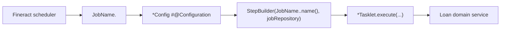

# Loan Jobs and Batch

Apache Fineract runs most loan back-office processing as **Spring Batch** jobs registered by
the scheduler. Each job is defined by a name in
`fineract-core/src/main/java/org/apache/fineract/infrastructure/jobs/service/JobName.java`,
implemented by a Spring Batch `@Configuration` (the `Job` / `Step` wiring) and a `Tasklet`
that does the work, and packaged under one of the `portfolio/loanaccount/jobs/<name>/`
directories:

| Module             | Path                                                                                                    |
|--------------------|---------------------------------------------------------------------------------------------------------|
| `fineract-loan`    | `src/main/java/org/apache/fineract/portfolio/loanaccount/jobs/addperiodicaccrualentries/`               |
| `fineract-loan`    | `src/main/java/org/apache/fineract/portfolio/loanaccount/jobs/setloandelinquencytags/`                  |
| `fineract-loan`    | `src/main/java/org/apache/fineract/portfolio/loanaccount/jobs/updateloanarrearsageing/`                 |
| `fineract-provider`| `src/main/java/org/apache/fineract/portfolio/loanaccount/jobs/accrualactivityposting/`                  |
| `fineract-provider`| `src/main/java/org/apache/fineract/portfolio/loanaccount/jobs/addaccrualentries/`                       |
| `fineract-provider`| `src/main/java/org/apache/fineract/portfolio/loanaccount/jobs/addperiodicaccrualentriesforloanswithincomepostedastransactions/` |
| `fineract-provider`| `src/main/java/org/apache/fineract/portfolio/loanaccount/jobs/applychargetooverdueloaninstallment/`     |
| `fineract-provider`| `src/main/java/org/apache/fineract/portfolio/loanaccount/jobs/applyholidaystoloans/`                    |
| `fineract-provider`| `src/main/java/org/apache/fineract/portfolio/loanaccount/jobs/generateloanlossprovisioning/`            |
| `fineract-provider`| `src/main/java/org/apache/fineract/portfolio/loanaccount/jobs/recalculateinterestforloan/`              |
| `fineract-provider`| `src/main/java/org/apache/fineract/portfolio/loanaccount/jobs/transferfeechargeforloans/`               |
| `fineract-provider`| `src/main/java/org/apache/fineract/infrastructure/jobs/service/updatenpa/`                              |

The COB-style per-loan steps (`UpdateLoanArrearsAgingBusinessStep`, `LoanCOB` etc.) live under
`fineract-provider/src/main/java/org/apache/fineract/cob/loan/` and are invoked by the
`LOAN_COB` job for fine-grained per-loan processing.

## JobName entries that touch loans

`JobName.java` (`fineract-core`) registers the canonical name of every job:

| Enum                                                            | Display name                                            |
|-----------------------------------------------------------------|---------------------------------------------------------|
| `UPDATE_LOAN_ARREARS_AGEING`                                    | Update Loan Arrears Ageing                              |
| `APPLY_HOLIDAYS_TO_LOANS`                                       | Apply Holidays To Loans                                 |
| `TRANSFER_FEE_CHARGE_FOR_LOANS`                                 | Transfer Fee For Loans From Savings                     |
| `APPLY_CHARGE_TO_OVERDUE_LOAN_INSTALLMENT`                      | Apply penalty to overdue loans                          |
| `ADD_ACCRUAL_ENTRIES`                                           | Add Accrual Transactions                                |
| `UPDATE_NPA`                                                    | Update Non Performing Assets                            |
| `ADD_PERIODIC_ACCRUAL_ENTRIES`                                  | Add Periodic Accrual Transactions                       |
| `RECALCULATE_INTEREST_FOR_LOAN`                                 | Recalculate Interest For Loans                          |
| `GENERATE_LOANLOSS_PROVISIONING`                                | Generate Loan Loss Provisioning                         |
| `ADD_PERIODIC_ACCRUAL_ENTRIES_FOR_LOANS_WITH_INCOME_POSTED_AS_TRANSACTIONS` | Add Accrual Transactions For Loans With Income Posted As Transactions |
| `LOAN_COB`                                                      | Loan COB                                                |
| `LOAN_DELINQUENCY_CLASSIFICATION`                               | Loan Delinquency Classification                         |
| `ACCRUAL_ACTIVITY_POSTING`                                      | Accrual Activity Posting                                |
| `WORKING_CAPITAL_LOAN_COB_JOB`                                  | Working Capital Loan COB                                |

## Common shape

Every loan job follows the same Spring Batch idiom: a `*Config` exposes a `Job` and `Step`
bean, a `*Tasklet` implements `Tasklet.execute(...)` and returns `RepeatStatus.FINISHED`.
Example from
`fineract-loan/.../jobs/updateloanarrearsageing/UpdateLoanArrearsAgeingTasklet.java`:

```java
@Slf4j
@RequiredArgsConstructor
public class UpdateLoanArrearsAgeingTasklet implements Tasklet {

    private final LoanArrearsAgeingUpdateHandler loanArrearsAgeingUpdateHandler;

    @Override
    public RepeatStatus execute(StepContribution contribution, ChunkContext chunkContext) throws Exception {
        loanArrearsAgeingUpdateHandler.updateLoanArrearsAgeingDetailsForAllLoans();
        return RepeatStatus.FINISHED;
    }
}
```



## Arrears ageing

**`UPDATE_LOAN_ARREARS_AGEING`** —
`fineract-loan/.../jobs/updateloanarrearsageing/`

- `UpdateLoanArrearsAgeingConfig` – Spring Batch wiring.
- `UpdateLoanArrearsAgeingTasklet` – calls
  `LoanArrearsAgeingUpdateHandler.updateLoanArrearsAgeingDetailsForAllLoans()`.
- `LoanArrearsAgeingUpdateHandler` – recomputes `principal_overdue_derived`,
  `interest_overdue_derived`, charge overdue columns and the earliest overdue date on every
  loan that is `ACTIVE` and has missed payments. The numbers populate the `m_loan_arrears_aging`
  table consumed by reports and the delinquency tagger.

The per-loan COB equivalent is `fineract-provider/.../cob/loan/UpdateLoanArrearsAgingBusinessStep.java`,
which runs the same recompute inside the `LOAN_COB` job.

## Charge to overdue installments

**`APPLY_CHARGE_TO_OVERDUE_LOAN_INSTALLMENT`** —
`fineract-provider/.../jobs/applychargetooverdueloaninstallment/`

- `ApplyChargeToOverdueLoanInstallmentConfig`
- `ApplyChargeToOverdueLoanInstallmentTasklet`

The tasklet walks loan products configured with overdue penalties and applies them to every
installment that is past its grace period. Penalties are added as new `LoanCharge` rows of
type *penalty* and become part of the next repayment.

## NPA flag

**`UPDATE_NPA`** —
`fineract-provider/src/main/java/org/apache/fineract/infrastructure/jobs/service/updatenpa/`

- `UpdateNpaConfig` – step + job wiring:
  ```java
  protected Step updateNpaStep() {
      return new StepBuilder(JobName.UPDATE_NPA.name(), jobRepository)
              .tasklet(updateNpaTasklet(), transactionManager).build();
  }
  public Job updateNpaJob() {
      return new JobBuilder(JobName.UPDATE_NPA.name(), jobRepository)
              .start(updateNpaStep()).incrementer(new RunIdIncrementer()).build();
  }
  ```
- `UpdateNpaTasklet` – sets the `is_npa` flag on loans whose
  arrears age exceeds the product's *NPA threshold* (typically derived from the
  delinquency bucket). The flag stops further income recognition until repayment.

## Periodic accruals

Three flavours live side-by-side:

- **`ADD_ACCRUAL_ENTRIES`** — `fineract-provider/.../jobs/addaccrualentries/` —
  `AddAccrualEntriesConfig` + `AddAccrualEntriesTasklet`. Posts the full per-loan accrual
  transactions, traditionally run end-of-month.
- **`ADD_PERIODIC_ACCRUAL_ENTRIES`** —
  `fineract-loan/.../jobs/addperiodicaccrualentries/` —
  `AddPeriodicAccrualEntriesConfig` + `AddPeriodicAccrualEntriesTasklet`. Posts a smaller
  accrual covering the period since the last run, suitable for daily scheduling.
- **`ADD_PERIODIC_ACCRUAL_ENTRIES_FOR_LOANS_WITH_INCOME_POSTED_AS_TRANSACTIONS`** —
  `fineract-provider/.../jobs/addperiodicaccrualentriesforloanswithincomepostedastransactions/`.
  Used when loan income is recorded as standalone transactions rather than installment
  components.
- **`ACCRUAL_ACTIVITY_POSTING`** —
  `fineract-provider/.../jobs/accrualactivityposting/` —
  `AccrualActivityPostingConfig` + `AccrualActivityPostingTasklet`. Posts accruals as
  *activity* journal entries against the appropriate GL accounts.

## Interest recalculation

**`RECALCULATE_INTEREST_FOR_LOAN`** —
`fineract-provider/.../jobs/recalculateinterestforloan/`

- `RecalculateInterestForLoanConfig`
- `RecalculateInterestForLoanTasklet`

The tasklet fetches loans flagged for interest recalculation and dispatches their
re-amortisation through a `RecalculateInterestPoster`:

```java
RecalculateInterestPoster recalculateInterestPoster =
        applicationContext.getBean(RecalculateInterestPoster.class);
```

The poster recomputes future installments based on actual repayment dates and the loan
product's *interest recalculation* rules.

## Loan-loss provisioning

**`GENERATE_LOANLOSS_PROVISIONING`** —
`fineract-provider/.../jobs/generateloanlossprovisioning/`

- `GenerateLoanlossProvisioningConfig`
- `GenerateLoanlossProvisioningTasklet`
- `NoProvisioningCriteriaDefinitionFoundException` – raised when no
  `ProvisioningCriteria` are configured.

```java
public class GenerateLoanlossProvisioningTasklet implements Tasklet {

    private final ProvisioningCriteriaReadPlatformService provisioningCriteriaReadPlatformService;
    private final ProvisioningEntriesWritePlatformService provisioningEntriesWritePlatformService;

    @Override
    public RepeatStatus execute(StepContribution contribution, ChunkContext ctx) throws Exception {
        Collection<ProvisioningCriteriaData> criteriaCollection =
                provisioningCriteriaReadPlatformService.retrieveAllProvisioningCriterias();
        // for each criteria → create provisioning entry & journal entries
        provisioningEntriesWritePlatformService.createProvisioningEntry(currentDate, addJournalEntries);
        return RepeatStatus.FINISHED;
    }
}
```

The job walks each configured `ProvisioningCriteria`, computes the loss provision per
delinquency bucket and posts the journal entries via
`ProvisioningEntriesWritePlatformService`.

## Holiday handling

**`APPLY_HOLIDAYS_TO_LOANS`** — `fineract-provider/.../jobs/applyholidaystoloans/` —
`ApplyHolidaysToLoansConfig` + `ApplyHolidaysToLoansTasklet`. Adjusts installment due dates
on loans whose holiday-policy is active, when holidays have been declared.

## Fee transfer from savings

**`TRANSFER_FEE_CHARGE_FOR_LOANS`** — `fineract-provider/.../jobs/transferfeechargeforloans/`.
Picks up loan fees that are due and pulls them from the linked savings account when an
account-association of type *Fee Transfer* exists.

## Delinquency tagging

**`LOAN_DELINQUENCY_CLASSIFICATION`** —
`fineract-loan/.../jobs/setloandelinquencytags/`

- `SetLoanDelinquencyTagsConfig`
- `SetLoanDelinquencyTagsTasklet`

The tasklet drives `DelinquencyWritePlatformService` to re-classify every loan against its
bucket, honouring `DelinquencyEffectivePauseHelper`. The same logic also runs as a
per-loan COB step (`SetLoanDelinquencyTagBusinessStep` under
`fineract-provider/.../cob/loan/`). See [Delinquency](/loan/delinquency) for details.

## Close of Business (`LOAN_COB`)

**`LOAN_COB`** is the per-loan batch that executes the loan **business steps** sequentially
on each loan that has not yet been advanced to today's COB date. The steps live in
`fineract-provider/src/main/java/org/apache/fineract/cob/loan/` and include:

- `UpdateLoanArrearsAgingBusinessStep`
- `ApplyChargeToOverdueLoanInstallmentBusinessStep`
- `LoanAccountsStayedLockedBusinessStep`
- `LoanDelinquencyClassificationBusinessStep`
- `LoanAccrualActivityPostingBusinessStep`

LOAN_COB is what keeps individual loan accounts at the institution's current Close-of-Business
date and is unlocked again by `LoanCOBCatchUpApiResource` after manual interventions.

## Scheduling

Each job is registered in the database with sensible default cron expressions and can be
re-scheduled via the **Scheduler Jobs** admin pages. The Quartz layer is described in the
[infrastructure / jobs](/jobs/overview) guide; this page deals only with the loan
domain wiring of the tasks.

## Tasklet template

Every job's Spring Batch wiring follows the same shape. For example,
`fineract-loan/.../jobs/updateloanarrearsageing/UpdateLoanArrearsAgeingConfig.java` exposes a
`Step` whose tasklet bean is the `Tasklet` shown earlier and a `Job` named after the
`JobName` enum value. This convention makes it cheap to read a new job: open the
`*Config.java` to see *what* is wired and the `*Tasklet.java` to see *how* the work is done.

## Operational characteristics

A few things worth knowing when operating the loan jobs:

- **Idempotence.** Most tasklets are idempotent within the same business date – running them
  twice in one day will not double-post accruals or penalties (the underlying handlers check
  for an existing row). The exceptions are `LOAN_COB` (advances the per-loan COB date and
  must complete to make progress) and `GENERATE_LOANLOSS_PROVISIONING` (raises
  `ProvisioningEntryAlreadyCreatedException` to guard against duplicates).
- **Tenant locality.** Each job is executed in the context of one tenant – the scheduler
  fans out per tenant through the standard `FineractPlatformTenant` thread-local.
- **Throughput.** Long-running tasklets pull loans in pages from JDBC; the handler classes
  flush in batches to avoid Hibernate first-level cache growth. Reach for the page-size
  configuration knobs in the corresponding handler when scaling.
- **Failure handling.** A tasklet exception fails the Spring Batch step; the next scheduler
  fire-time re-runs the same step. Partial progress (e.g. half the loans had their arrears
  recomputed) is preserved because each loan is processed in its own transaction.
- **Step / job audit.** Spring Batch metadata tables capture every execution; admin UIs read
  from those so operators can see which job ran when and with what outcome.

## Quick reference – package to job mapping

| Package directory                                                                                | Job name                                                                  |
|--------------------------------------------------------------------------------------------------|---------------------------------------------------------------------------|
| `fineract-loan/.../jobs/updateloanarrearsageing/`                                                | `UPDATE_LOAN_ARREARS_AGEING`                                              |
| `fineract-loan/.../jobs/setloandelinquencytags/`                                                 | `LOAN_DELINQUENCY_CLASSIFICATION`                                         |
| `fineract-loan/.../jobs/addperiodicaccrualentries/`                                              | `ADD_PERIODIC_ACCRUAL_ENTRIES`                                            |
| `fineract-provider/.../jobs/addaccrualentries/`                                                  | `ADD_ACCRUAL_ENTRIES`                                                     |
| `fineract-provider/.../jobs/accrualactivityposting/`                                             | `ACCRUAL_ACTIVITY_POSTING`                                                |
| `fineract-provider/.../jobs/addperiodicaccrualentriesforloanswithincomepostedastransactions/`    | `ADD_PERIODIC_ACCRUAL_ENTRIES_FOR_LOANS_WITH_INCOME_POSTED_AS_TRANSACTIONS` |
| `fineract-provider/.../jobs/applychargetooverdueloaninstallment/`                                | `APPLY_CHARGE_TO_OVERDUE_LOAN_INSTALLMENT`                                |
| `fineract-provider/.../jobs/applyholidaystoloans/`                                               | `APPLY_HOLIDAYS_TO_LOANS`                                                 |
| `fineract-provider/.../jobs/generateloanlossprovisioning/`                                       | `GENERATE_LOANLOSS_PROVISIONING`                                          |
| `fineract-provider/.../jobs/recalculateinterestforloan/`                                         | `RECALCULATE_INTEREST_FOR_LOAN`                                           |
| `fineract-provider/.../jobs/transferfeechargeforloans/`                                          | `TRANSFER_FEE_CHARGE_FOR_LOANS`                                           |
| `fineract-provider/.../infrastructure/jobs/service/updatenpa/`                              | `UPDATE_NPA`                                                              |

## Related pages

- [Delinquency](/loan/delinquency) – the data model the
  `LOAN_DELINQUENCY_CLASSIFICATION` job updates.
- [Loan rescheduling](/loan/loan-rescheduling) – pauses delinquency ageing for the
  affected loans.
- [Loan API resources](/loan/loan-api-resources) – `LoanCOBCatchUpApiResource` for triggering
  manual COB catch-up.
