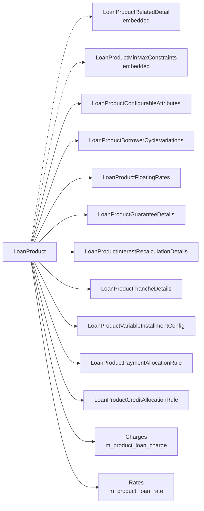

A `LoanProduct` is the template that every individual [`Loan`](/loan/loan-aggregate) is created from in Apache Fineract. Products define currency, term, interest method, amortization method, accepted charges, accounting rules and which attributes a loan officer is allowed to override at application time. Their JPA root lives in [`LoanProduct.java`](https://github.com/apache/fineract/blob/develop/fineract-loan/src/main/java/org/apache/fineract/portfolio/loanproduct/domain/LoanProduct.java) backed by the `m_product_loan` table.

A product is intentionally large: real-world loan portfolios need to express interest recalculation, floating rates, borrower-cycle variations, tranche behaviour, guarantee rules, charge-off behaviour and (more recently) capitalized-income and buy-down-fee strategies. Fineract keeps each of these capabilities in its own embedded value object or sibling entity so the root class stays manageable.

## Root entity

```java
// fineract-loan/src/main/java/org/apache/fineract/portfolio/loanproduct/domain/LoanProduct.java
@Entity
@Getter
@Setter
@Table(name = "m_product_loan", uniqueConstraints = {
    @UniqueConstraint(columnNames = { "name" }, name = "unq_name"),
    @UniqueConstraint(columnNames = { "external_id" }, name = "external_id_UNIQUE"),
    @UniqueConstraint(columnNames = { "short_name" }, name = "unq_short_name") })
public class LoanProduct extends AbstractPersistableCustom<Long> {

    @Column(name = "loan_transaction_strategy_code", nullable = false)
    private String transactionProcessingStrategyCode;

    @Embedded
    private LoanProductRelatedDetail loanProductRelatedDetail;

    @Embedded
    private LoanProductMinMaxConstraints loanProductMinMaxConstraints;
    // ...
}
```

Three uniqueness constraints — `name`, `short_name` and `external_id` — make products lookup-friendly from both UIs and integrations. The `transactionProcessingStrategyCode` column is a string foreign-key into the list of strategies registered with [`LoanRepaymentScheduleTransactionProcessorFactory`](/loan/loan-transaction-and-charge#transaction-processors); see the nine cumulative implementations under `domain/transactionprocessor/impl/` plus the `AdvancedPaymentScheduleTransactionProcessor` in `fineract-progressive-loan`.

## Embedded `LoanProductRelatedDetail`

`LoanProductRelatedDetail` is an `@Embeddable` shared with `Loan`. The product owns the canonical values; each `Loan` carries a copy so subsequent product edits cannot retroactively change live accounts.

```java
// fineract-loan/src/main/java/org/apache/fineract/portfolio/loanproduct/domain/LoanProductRelatedDetail.java
@Embeddable
@Getter
@Setter
public class LoanProductRelatedDetail {

    @Embedded
    private MonetaryCurrency currency;

    @Column(name = "principal_amount", scale = 6, precision = 19)
    private BigDecimal principal;

    @Enumerated(EnumType.ORDINAL)
    @Column(name = "interest_method_enum", nullable = false)
    private InterestMethod interestMethod;

    @Enumerated(EnumType.ORDINAL)
    @Column(name = "amortization_method_enum", nullable = false)
    private AmortizationMethod amortizationMethod;

    @Enumerated(EnumType.ORDINAL)
    @Column(name = "interest_calculated_in_period_enum", nullable = false)
    private InterestCalculationPeriodMethod interestCalculationPeriodMethod;
    // ...
}
```

Field clusters it carries:

- **Currency & principal** — `currency`, `principal`.
- **Interest** — `nominalInterestRatePerPeriod`, `interestPeriodFrequencyType`, `annualNominalInterestRate`, `interestMethod`, `interestCalculationPeriodMethod`, `allowPartialPeriodInterestCalculation`.
- **Schedule** — `repayEvery`, `repaymentPeriodFrequencyType`, `numberOfRepayments`, `fixedLength`.
- **Grace** — `graceOnPrincipalPayment`, `graceOnInterestPayment`, `graceOnInterestCharged`, `recurringMoratoriumOnPrincipalPeriods`.
- **Amortization & arrears** — `amortizationMethod`, `inArrearsTolerance`, `graceOnArrearsAgeing`.
- **Calendar** — `daysInMonthType` and `daysInYearType` (with a `daysInYearCustomStrategy`).

## Interest and amortization methods

Three enums encode the core math choices.

<CardGroup cols={3}>
  <Card title="InterestMethod" icon="percent">
    [`InterestMethod`](https://github.com/apache/fineract/blob/develop/fineract-loan/src/main/java/org/apache/fineract/portfolio/loanproduct/domain/InterestMethod.java) — `DECLINING_BALANCE(0)` or `FLAT(1)`.
  </Card>
  <Card title="AmortizationMethod" icon="chart-line">
    [`AmortizationMethod`](https://github.com/apache/fineract/blob/develop/fineract-loan/src/main/java/org/apache/fineract/portfolio/loanproduct/domain/AmortizationMethod.java) — `EQUAL_PRINCIPAL(0)` or `EQUAL_INSTALLMENTS(1)`.
  </Card>
  <Card title="InterestCalculationPeriodMethod" icon="calendar-day">
    [`InterestCalculationPeriodMethod`](https://github.com/apache/fineract/blob/develop/fineract-loan/src/main/java/org/apache/fineract/portfolio/loanproduct/domain/InterestCalculationPeriodMethod.java) — `DAILY(0)` or `SAME_AS_REPAYMENT_PERIOD(1)`.
  </Card>
</CardGroup>

```java
public enum InterestMethod {
    DECLINING_BALANCE(0, "interestType.declining.balance"),
    FLAT(1, "interestType.flat"),
    INVALID(2, "interestType.invalid");
}

public enum AmortizationMethod {
    EQUAL_PRINCIPAL(0, "amortizationType.equal.principal"),
    EQUAL_INSTALLMENTS(1, "amortizationType.equal.installments"),
    INVALID(2, "amortizationType.invalid");
}
```

`(InterestMethod, AmortizationMethod, LoanScheduleType)` together drive the choice of schedule generator made by [`LoanScheduleGeneratorFactory`](/loan/loan-schedule-generation#factory).

## Configurable attributes

`LoanProductConfigurableAttributes` is the small entity that lets product designers say *"loan officers are allowed to override X but not Y at application time."*

```java
// fineract-loan/src/main/java/org/apache/fineract/portfolio/loanproduct/domain/LoanProductConfigurableAttributes.java
@Entity
@Table(name = "m_product_loan_configurable_attributes")
public class LoanProductConfigurableAttributes extends AbstractPersistableCustom<Long> implements Serializable {

    @OneToOne
    @JoinColumn(name = "loan_product_id", nullable = false)
    private LoanProduct loanProduct;

    @Column(name = "amortization_method_enum")        private Boolean amortizationType;
    @Column(name = "interest_method_enum")            private Boolean interestType;
    @Column(name = "loan_transaction_strategy_code")  private Boolean transactionProcessingStrategyCode;
    @Column(name = "interest_calculated_in_period_enum") private Boolean interestCalculationPeriodType;
    @Column(name = "arrearstolerance_amount")         private Boolean inArrearsTolerance;
    @Column(name = "repay_every")                     private Boolean repaymentEvery;
    @Column(name = "moratorium")                      private Boolean graceOnPrincipalAndInterestPayment;
    @Column(name = "grace_on_arrears_ageing")         private Boolean graceOnArrearsAgeing;
}
```

Each `Boolean` is `true` when overrides are allowed and is enforced by the command-handler that creates the loan.

## Variations and supporting entities

The remaining product capabilities sit in dedicated sibling tables linked back to `LoanProduct`.

<AccordionGroup>
  <Accordion title="LoanProductBorrowerCycleVariations" icon="rotate">
    `m_product_loan_variations_borrower_cycle`. Each row pins a `paramType` (principal / interest / repayments — see [`LoanProductParamType`](https://github.com/apache/fineract/blob/develop/fineract-loan/src/main/java/org/apache/fineract/portfolio/loanproduct/domain/LoanProductParamType.java)) to a `borrowerCycleNumber` and a `min/default/max` triple, qualified by a [`LoanProductValueConditionType`](https://github.com/apache/fineract/blob/develop/fineract-loan/src/main/java/org/apache/fineract/portfolio/loanproduct/domain/LoanProductValueConditionType.java) (`EQUAL` or `GREATERTHAN`). Lets product designers raise eligible loan size with each successful cycle.
  </Accordion>
  <Accordion title="LoanProductFloatingRates" icon="chart-line">
    [`LoanProductFloatingRates`](https://github.com/apache/fineract/blob/develop/fineract-loan/src/main/java/org/apache/fineract/portfolio/loanproduct/domain/LoanProductFloatingRates.java) (`m_product_loan_floating_rates`) ties a product to a `FloatingRate` plus an `interestRateDifferential` and min/default/max overrides. Combined with [`RecalculationFrequencyType`](https://github.com/apache/fineract/blob/develop/fineract-loan/src/main/java/org/apache/fineract/portfolio/loanproduct/domain/RecalculationFrequencyType.java), it drives rate-reset schedules on declining-balance loans.
  </Accordion>
  <Accordion title="LoanProductGuaranteeDetails" icon="shield-halved">
    [`LoanProductGuaranteeDetails`](https://github.com/apache/fineract/blob/develop/fineract-loan/src/main/java/org/apache/fineract/portfolio/loanproduct/domain/LoanProductGuaranteeDetails.java) (`m_product_loan_guarantee_details`) holds the percentages: `mandatoryGuarantee`, `minimumGuaranteeFromOwnFunds`, `minimumGuaranteeFromGuarantor`. Required when the product enables guarantor on-hold funds.
  </Accordion>
  <Accordion title="LoanProductInterestRecalculationDetails" icon="rotate-right">
    [`LoanProductInterestRecalculationDetails`](https://github.com/apache/fineract/blob/develop/fineract-loan/src/main/java/org/apache/fineract/portfolio/loanproduct/domain/LoanProductInterestRecalculationDetails.java) (`m_product_loan_recalculation_details`) carries `interestRecalculationCompoundingMethod`, `rescheduleStrategyMethod`, `restFrequencyType`, `restInterval`, `preCloseInterestCalculationStrategy` and `isCompoundingToBePostedAsTransaction`. Only declining-balance products enable it.
  </Accordion>
  <Accordion title="LoanProductTrancheDetails & VariableInstallmentConfig" icon="layer-group">
    [`LoanProductTrancheDetails`](https://github.com/apache/fineract/blob/develop/fineract-loan/src/main/java/org/apache/fineract/portfolio/loanproduct/domain/LoanProductTrancheDetails.java) marks the product as multi-disbursement and sets max tranches / outstanding caps. [`LoanProductVariableInstallmentConfig`](https://github.com/apache/fineract/blob/develop/fineract-loan/src/main/java/org/apache/fineract/portfolio/loanproduct/domain/LoanProductVariableInstallmentConfig.java) allows installment dates/amounts to vary within bounded gaps.
  </Accordion>
  <Accordion title="LoanProductPaymentAllocationRule & CreditAllocationRule" icon="arrow-right-arrow-left">
    Progressive-loan additions: list-typed rules that map [`PaymentAllocationTransactionType`](https://github.com/apache/fineract/blob/develop/fineract-loan/src/main/java/org/apache/fineract/portfolio/loanproduct/domain/PaymentAllocationTransactionType.java) and [`CreditAllocationTransactionType`](https://github.com/apache/fineract/blob/develop/fineract-loan/src/main/java/org/apache/fineract/portfolio/loanproduct/domain/CreditAllocationTransactionType.java) to ordered lists of [`PaymentAllocationType`](https://github.com/apache/fineract/blob/develop/fineract-loan/src/main/java/org/apache/fineract/portfolio/loanproduct/domain/PaymentAllocationType.java) / [`AllocationType`](https://github.com/apache/fineract/blob/develop/fineract-loan/src/main/java/org/apache/fineract/portfolio/loanproduct/domain/AllocationType.java). See [`LoanProduct.paymentAllocationRules`](https://github.com/apache/fineract/blob/develop/fineract-loan/src/main/java/org/apache/fineract/portfolio/loanproduct/domain/LoanProduct.java).
  </Accordion>
</AccordionGroup>

## Capability map



## REST API surface

Two API resources expose products: a feature-rich CRUD one in `fineract-provider` and a lightweight list endpoint in `fineract-loan`.

### `LoanProductsApiResource`

[`LoanProductsApiResource`](https://github.com/apache/fineract/blob/develop/fineract-provider/src/main/java/org/apache/fineract/portfolio/loanproduct/api/LoanProductsApiResource.java) at `/v1/loanproducts` provides:

| HTTP   | Path                              | Purpose                                    |
| ------ | --------------------------------- | ------------------------------------------ |
| `POST` | `/`                               | Create a new product                       |
| `GET`  | `/`                               | List products                              |
| `GET`  | `/template`                       | Retrieve UI template (options, defaults)   |
| `GET`  | `/{productId}`                    | Retrieve one product                       |
| `PUT`  | `/{productId}`                    | Update product                             |
| `GET`  | `/external-id/{externalProductId}` | Lookup by external id                     |
| `PUT`  | `/external-id/{externalProductId}` | Update by external id                     |

### `LoanProductsDetailsApiResource`

[`LoanProductsDetailsApiResource`](https://github.com/apache/fineract/blob/develop/fineract-loan/src/main/java/org/apache/fineract/portfolio/loanproduct/api/LoanProductsDetailsApiResource.java) at `/v1/loanproducts/basic-details` returns the trimmed-down product view used by listing/lookup screens, kept in `fineract-loan` so the loan module can self-serve metadata without pulling the heavier write-side resource.

## Snapshot semantics

When a [`Loan`](/loan/loan-aggregate) is submitted, Fineract copies the product's `LoanProductRelatedDetail` snapshot and translates the product's `LoanProductInterestRecalculationDetails` into a per-loan `LoanInterestRecalculationDetails`. Later product changes affect only **new** loans — already-disbursed loans keep their original schedule contract until you explicitly reschedule them. That snapshot semantics is what lets a microfinance institution reprice a product without scaring its existing book.

## Related pages

<CardGroup cols={2}>
  <Card title="Loan Aggregate" icon="layer-group" href="/loan/loan-aggregate">
    The runtime instance created from this product.
  </Card>
  <Card title="Schedule Generation" icon="diagram-project" href="/loan/loan-schedule-generation">
    How the product's interest/amortization choices select a generator.
  </Card>
  <Card title="Charges & Fees" icon="receipt" href="/loan/loan-charge-and-fees">
    Product-attached `Charge`s carried over to every new loan.
  </Card>
  <Card title="Loan Transaction & Charge" icon="arrow-right-arrow-left" href="/loan/loan-transaction-and-charge">
    Transaction-processing strategies are selected on the product.
  </Card>
</CardGroup>
