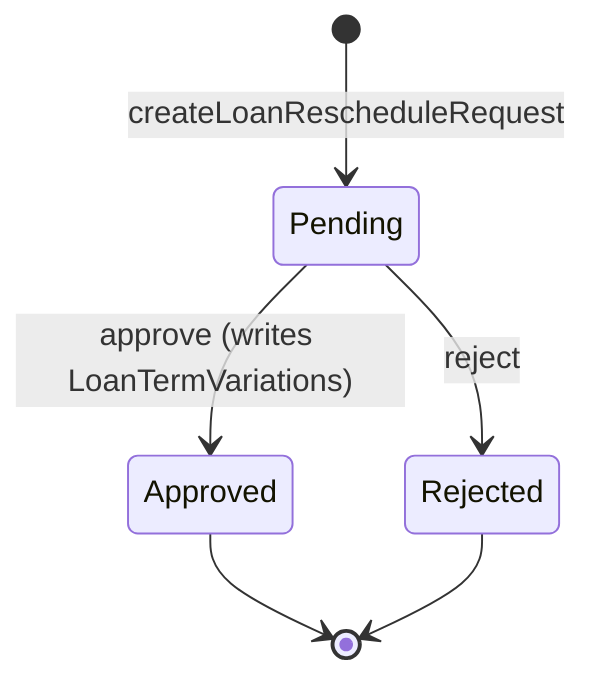
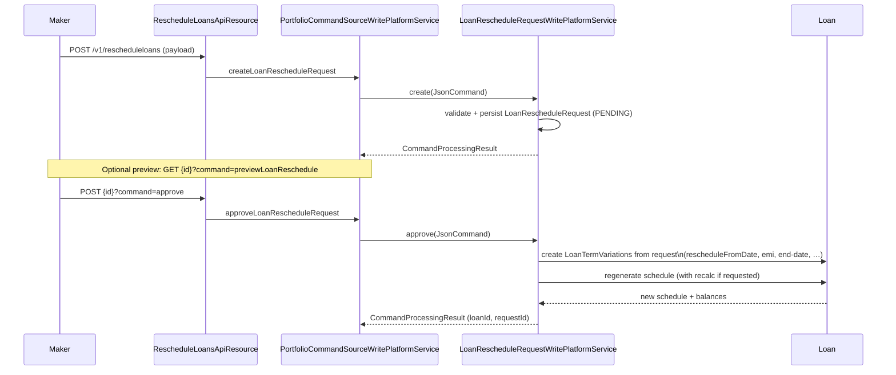

# Loan Rescheduling

When a loan is in distress or a customer wants to change terms, Apache Fineract lets you
submit a **loan reschedule request** that, once approved, mutates the repayment schedule by
introducing one or more `LoanTermVariations` rather than touching past transactions. The
request itself goes through `pending → approved | rejected` and is fully auditable.

All of the moving parts live under
`fineract-loan/src/main/java/org/apache/fineract/portfolio/loanaccount/rescheduleloan/`:

| Package      | Key classes                                                            |
|--------------|------------------------------------------------------------------------|
| `domain`     | `LoanRescheduleRequest`, `LoanRescheduleRequestRepository`, `LoanRescheduleRequestRepositoryWrapper`, `LoanTermVariationsRepository`, `LoanRescheduleModalPeriod`, `LoanRescheduleModelRepaymentPeriod` |
| `data`       | `LoanRescheduleRequestData`, `LoanRescheduleRequestDataValidator(.Impl)`, `LoanRescheduleRequestEnumerations`, `LoanRescheduleRequestStatusEnumData`, `LoanRescheduleRequestTimelineData` |
| `service`    | `LoanReschedulePreviewPlatformService`, `LoanRescheduleRequestReadPlatformService(.Impl)`, `LoanRescheduleRequestWritePlatformService` |
| `api`        | `RescheduleLoansApiResource`, `RescheduleLoansApiResourceSwagger` |
| root         | `RescheduleLoansApiConstants`                                          |

## `LoanRescheduleRequest`

`fineract-loan/.../rescheduleloan/domain/LoanRescheduleRequest.java` is mapped to
`m_loan_reschedule_request`. It owns the link to the loan, the status enum, the request
parameters and the full life-cycle audit (submitted/approved/rejected by/on):

```java
@Entity
@Table(name = "m_loan_reschedule_request")
@Getter
public class LoanRescheduleRequest extends AbstractPersistableCustom<Long> {

    @ManyToOne @JoinColumn(name = "loan_id", nullable = false)
    private Loan loan;

    @Column(name = "status_enum",                nullable = false)
    private Integer statusEnum;
    @Column(name = "reschedule_from_installment")
    private Integer rescheduleFromInstallment;
    @Column(name = "reschedule_from_date")
    private LocalDate rescheduleFromDate;
    @Column(name = "recalculate_interest")
    private Boolean recalculateInterest;

    @ManyToOne @JoinColumn(name = "reschedule_reason_cv_id")
    private CodeValue rescheduleReasonCodeValue;
    @Column(name = "reschedule_reason_comment")
    private String rescheduleReasonComment;

    @Column(name = "submitted_on_date")          private LocalDate submittedOnDate;
    @ManyToOne @JoinColumn(name = "submitted_by_user_id") private AppUser submittedByUser;
    @Column(name = "approved_on_date")           private LocalDate approvedOnDate;
    @ManyToOne @JoinColumn(name = "approved_by_user_id")  private AppUser approvedByUser;
    @Column(name = "rejected_on_date")           private LocalDate rejectedOnDate;
    @ManyToOne @JoinColumn(name = "rejected_by_user_id")  private AppUser rejectedByUser;

    @OneToMany(cascade = CascadeType.ALL, orphanRemoval = true, fetch = FetchType.EAGER,
              mappedBy = "loanRescheduleRequest")
    private Set<LoanRescheduleRequestToTermVariationMapping>
            loanRescheduleRequestToTermVariationMappings = new HashSet<>();
}
```

A single request points at the loan plus the *anchor point* (`rescheduleFromInstallment` and
`rescheduleFromDate`) from which the new terms apply. The set of
`LoanRescheduleRequestToTermVariationMapping` rows joins the request to the
`LoanTermVariations` it later produces when approved.

## Statuses

`status_enum` is filled with values from the loan-side `LoanStatus`, but only three are valid
for a reschedule request, as `LoanRescheduleRequestEnumerations` makes explicit:

| Value | LoanStatus                       | Meaning                       |
|-------|----------------------------------|-------------------------------|
| `100` | `SUBMITTED_AND_PENDING_APPROVAL` | Created, waiting on a checker |
| `200` | `APPROVED`                       | Applied to the loan schedule  |
| `500` | `REJECTED`                       | Will never be applied         |



`LoanRescheduleRequest.approve(...)` and `reject(...)` are the only methods that mutate
`statusEnum`, both stamping `approvedByUser/approvedOnDate` or `rejectedByUser/rejectedOnDate`
in the same transaction.

## REST API: `RescheduleLoansApiResource`

`fineract-loan/.../rescheduleloan/api/RescheduleLoansApiResource.java` is mounted at
**`/v1/rescheduleloans`**. The lifecycle endpoints below all funnel through the standard
maker-checker command pipeline.

| Method | Path                                  | Command                                  |
|--------|---------------------------------------|------------------------------------------|
| GET    | `template`                            | List reschedule reasons (code values)    |
| GET    | (root)                                | List requests, filter by `loanId`        |
| GET    | `{scheduleId}`                        | Read one request (or `?command=previewLoanReschedule`) |
| POST   | (root)                                | `createLoanRescheduleRequest`            |
| POST   | `{scheduleId}?command=approve`        | `approveLoanRescheduleRequest`           |
| POST   | `{scheduleId}?command=reject`         | `rejectLoanRescheduleRequest`            |

```java
@Path("/v1/rescheduleloans")
public class RescheduleLoansApiResource {

    @POST
    public String createLoanRescheduleRequest(final String apiRequestBodyAsJson) {
        final CommandWrapper commandWrapper = new CommandWrapperBuilder()
                .createLoanRescheduleRequest(RescheduleLoansApiConstants.ENTITY_NAME)
                .withJson(apiRequestBodyAsJson).build();
        return this.loanRescheduleRequestToApiJsonSerializer.serialize(
                this.commandsSourceWritePlatformService.logCommandSource(commandWrapper));
    }

    @POST @Path("{scheduleId}")
    public String updateLoanRescheduleRequest(@PathParam("scheduleId") final Long scheduleId,
            @QueryParam("command") final String command, final String apiRequestBodyAsJson) {
        CommandWrapper commandWrapper;
        if (compareIgnoreCase(command, "approve")) {
            commandWrapper = new CommandWrapperBuilder()
                    .approveLoanRescheduleRequest(RescheduleLoansApiConstants.ENTITY_NAME, scheduleId)
                    .withJson(apiRequestBodyAsJson).build();
        } else if (compareIgnoreCase(command, "reject")) {
            commandWrapper = new CommandWrapperBuilder()
                    .rejectLoanRescheduleRequest(RescheduleLoansApiConstants.ENTITY_NAME, scheduleId)
                    .withJson(apiRequestBodyAsJson).build();
        } else {
            throw new UnrecognizedQueryParamException("command", command, "approve", "reject");
        }
        ...
    }
}
```

`RescheduleLoansApiConstants.ENTITY_NAME` is `"RESCHEDULELOAN"`, and the read endpoint accepts
`?command=previewLoanReschedule` to return the proposed schedule **without** committing the
changes (via `LoanReschedulePreviewPlatformService`).

### Request payload

The `POST /v1/rescheduleloans` body, validated by
`LoanRescheduleRequestDataValidatorImpl`, supports:

| Field                            | Required | Notes                                           |
|----------------------------------|----------|-------------------------------------------------|
| `loanId`                         | yes      | Loan to reschedule                              |
| `rescheduleFromDate`             | yes      | Anchor from which changes apply                 |
| `submittedOnDate`                | yes      | Submission date                                 |
| `rescheduleReasonId`             | yes      | Code value id (template)                        |
| `rescheduleReasonComment`        | no       | Free text                                       |
| `recalculateInterest`            | no       | Force interest recalculation                    |
| `graceOnPrincipal`               | no       | New principal grace                             |
| `graceOnInterest`                | no       | New interest grace                              |
| `extraTerms`                     | no       | Add `n` extra repayment periods                 |
| `newInterestRate`                | no       | Override loan interest rate                     |
| `adjustedDueDate`                | no       | Move the anchor instalment to this date         |
| `endDate` / `emi`                | no       | Re-amortise to a target end-date / instalment   |

## Workflow



If the maker-checker uses a checker, the request is parked in `m_portfolio_command_source`
between *create* and *approve*; this is why approve/reject are second POSTs and not PUTs.

### Approve

`LoanRescheduleRequestWritePlatformService#approve` does three things:

1. Pulls the persisted `LoanRescheduleRequest` via
   `LoanRescheduleRequestRepositoryWrapper.findOneWithNotFoundDetection(id)`.
2. Translates the request parameters into `LoanTermVariations` and stores the mappings in
   `LoanRescheduleRequestToTermVariationMapping`.
3. Calls the loan account to regenerate its schedule (optionally recalculating interest when
   `recalculate_interest = true`).

### Reject

The `LoanRescheduleRequest.reject(...)` method simply sets the status to `REJECTED` and stamps
the rejecter/rejection-date. No schedule changes are applied.

## Preview

`LoanReschedulePreviewPlatformService.previewLoanReschedule(scheduleId)` builds a
`LoanScheduleModel` using the *would-be* term variations from the pending request without
persisting them. The result is returned via `GET /v1/rescheduleloans/{scheduleId}?command=previewLoanReschedule`.
Two helper records,
`LoanRescheduleModalPeriod` and `LoanRescheduleModelRepaymentPeriod`
(`fineract-loan/.../rescheduleloan/domain/`), shape the preview rows for the response.

## Read APIs

`LoanRescheduleRequestReadPlatformServiceImpl`
(`fineract-loan/.../rescheduleloan/service/LoanRescheduleRequestReadPlatformServiceImpl.java`)
backs both `GET /v1/rescheduleloans` and `GET /v1/rescheduleloans/template`. The DTOs
returned are:

- **`LoanRescheduleRequestData`** – request + status + reschedule parameters +
  `LoanRescheduleRequestTimelineData`.
- **`LoanRescheduleRequestStatusEnumData`** – `(id, code, value)` triple used by the UI.
- **`LoanRescheduleRequestTimelineData`** – submitted/approved/rejected timestamps and
  user names.

## Permissions

The standard permission codes generated for these commands are:

- `CREATE_RESCHEDULELOAN`, `APPROVE_RESCHEDULELOAN`, `REJECT_RESCHEDULELOAN`
- Maker-checker variants `*_CHECKER` are produced automatically.

## Validation rules

`LoanRescheduleRequestDataValidatorImpl`
(`fineract-loan/.../rescheduleloan/data/LoanRescheduleRequestDataValidatorImpl.java`) runs the
same checks for both `create` and `approve`:

- **Mandatory anchors.** `loanId`, `rescheduleFromDate` and `submittedOnDate` must be present.
- **Anchor must be a valid installment due date** on the loan (or, when
  `rescheduleFromInstallment` is supplied, must match it).
- **No future reschedule already pending** on the same loan; only one open
  `LoanRescheduleRequest` per loan at a time.
- **Reason code value** must come from the `LoanRescheduleReason` code set
  (`RescheduleLoansApiConstants.LOAN_RESCHEDULE_REASON`).
- **Conflicting parameters** are rejected: you cannot combine `emi`/`endDate` with
  `extraTerms` or `adjustedDueDate`.
- **Loan must be `ACTIVE`** to accept the approval. Rejection is allowed at any time before
  approval.
- **Approver / rejecter must not be the submitter** when the tenant runs maker-checker.

The validator constructs a `DataValidatorBuilder` and pushes all errors into a single
`PlatformApiDataValidationException` so the client receives one structured error response.

## Term variations under the hood

The translation of request fields into `LoanTermVariations` is the bridge between this module
and the loan schedule engine:

| Request field                | LoanTermVariations type produced                            |
|------------------------------|-------------------------------------------------------------|
| `adjustedDueDate`            | `DUE_DATE` (4)                                              |
| `newInterestRate`            | `INTEREST_RATE_FROM_INSTALLMENT` (10)                       |
| `graceOnPrincipal`           | `GRACE_ON_PRINCIPAL` (8) **plus** `EXTEND_REPAYMENT_PERIOD` (9) of the same length, so the schedule grows by the grace count |
| `graceOnInterest`            | `GRACE_ON_INTEREST` (7)                                     |
| `extraTerms`                 | `EXTEND_REPAYMENT_PERIOD` (9)                               |
| `emi` + `endDate`            | One `EMI_AMOUNT` (1) row per installment whose due date falls in `[rescheduleFromDate, endDate]` |

The numeric values match `LoanTermVariationType`
(`fineract-loan/.../loanaccount/domain/LoanTermVariationType.java`). `LoanRescheduleRequestWritePlatformServiceImpl.createLoanTermVariationsForRegularLoans(...)` is where these
rules are wired.

The set of mappings produced by approval is stored in
`m_loan_reschedule_request_term_variations_mapping` so the request remains the canonical
source of the changes even after the schedule is regenerated. `LoanTermVariationsRepository`
(`fineract-loan/.../rescheduleloan/domain/LoanTermVariationsRepository.java`) is shared with
the rest of the loan domain and is what the schedule generator queries when re-amortising.

## Preview data shape

The preview return path uses `LoanScheduleData` populated by walking the proposed schedule:
each `LoanRescheduleModelRepaymentPeriod` carries the new period number, due date,
`principalDue`, `interestDue`, fees and totals; `LoanRescheduleModalPeriod` aggregates them.
Because the preview reuses the same generator as approval, the previewed schedule is
identical to what approval would post, modulo same-day market rate movements when the loan
product uses LIBOR-style indexed rates.

## Related pages

- [Loans (overview)](/loan/loan-aggregate) and [Loan lifecycle](/loan/loan-aggregate) – why the
  anchor `rescheduleFromDate` matters.
- [Loan schedule](/loan/loan-schedule-generation) – how `LoanTermVariations` are interpreted on
  regeneration.
- [Delinquency](/loan/delinquency) – pending reschedule requests can pause delinquency
  classification via `DelinquencyAction`.
