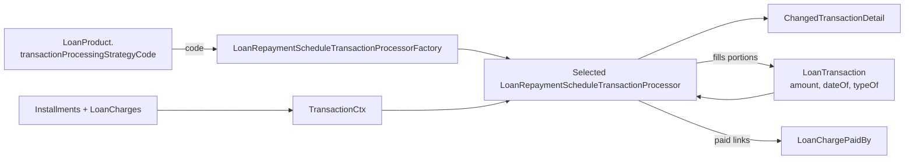

Every cent that enters or leaves a loan in Apache Fineract is a row in `m_loan_transaction` mapped to [`LoanTransaction.java`](https://github.com/apache/fineract/blob/develop/fineract-loan/src/main/java/org/apache/fineract/portfolio/loanaccount/domain/LoanTransaction.java). Disbursements, repayments, waivers, write-offs, charge-offs, accruals, refunds and the newer capitalized-income / buy-down-fee / interest-refund flows all share the same table. A small companion entity, [`LoanChargePaidBy`](https://github.com/apache/fineract/blob/develop/fineract-loan/src/main/java/org/apache/fineract/portfolio/loanaccount/domain/LoanChargePaidBy.java), records *which* of the loan's charges a given repayment touched.

How an incoming repayment is split across penalty, fee, interest and principal — and across installments — is the job of a `LoanRepaymentScheduleTransactionProcessor`. Fineract ships **seven** processors so institutions can match their book-keeping policy without forking the code.

## LoanTransaction entity

```java
// fineract-loan/src/main/java/org/apache/fineract/portfolio/loanaccount/domain/LoanTransaction.java
/**
 * All monetary transactions against a loan are modelled through this entity. Disbursements, Repayments, Waivers,
 * Write-off etc
 */
@Getter
@Entity
@Table(name = "m_loan_transaction",
    uniqueConstraints = { @UniqueConstraint(columnNames = { "external_id" }, name = "external_id_UNIQUE") })
public class LoanTransaction extends AbstractAuditableWithUTCDateTimeCustom<Long> {

    @Version private Long version;

    @ManyToOne(optional = false) @JoinColumn(name = "loan_id", nullable = false)
    private Loan loan;

    @Column(name = "transaction_type_enum", nullable = false)
    private LoanTransactionType typeOf;

    @Column(name = "transaction_date", nullable = false)
    private LocalDate dateOf;

    @Column(name = "amount", scale = 6, precision = 19, nullable = false)
    private BigDecimal amount;
    // ...portions, reversal flags, external id, mappings
}
```

### Portion columns

Every transaction carries five derived "portion" columns plus an outstanding balance snapshot:

| Column                          | Meaning                                                |
| ------------------------------- | ------------------------------------------------------ |
| `principal_portion_derived`     | Amount applied to principal                            |
| `interest_portion_derived`      | Amount applied to interest                             |
| `fee_charges_portion_derived`   | Amount applied to fee charges                          |
| `penalty_charges_portion_derived` | Amount applied to penalty charges                    |
| `overpayment_portion_derived`   | Amount that landed in over-payment / credit balance    |
| `outstanding_loan_balance_derived` | Loan principal outstanding *after* this transaction |

The portions are not entered by the user — they are filled by the transaction processor when it allocates `amount` across the schedule. The `Money` factory methods on `LoanTransaction` (`disbursement`, `repayment`, `waiver`, `writeoff`, `accrual`, `chargePayment`, `refund`, `chargeback`, `incomePosting`, `interestRefund`, etc.) only set the gross `amount` and the type — portions are written back by the processor.

### Reversal semantics

Fineract never deletes a transaction. Reversal is soft and additive:

```java
@Column(name = "is_reversed", nullable = false)
private boolean reversed;

@Column(name = "reversed_on_date")
private LocalDate reversedOnDate;

@Column(name = "manually_adjusted_or_reversed", nullable = false)
private boolean manuallyAdjustedOrReversed;

@Column(name = "reversal_external_id", length = 100, unique = true)
private ExternalId reversalExternalId;
```

Setting `reversed = true` excludes the row from balance calculations but it stays for audit. `manuallyAdjustedOrReversed` separates *user-initiated* reversals from those triggered automatically by re-processing. A `reversalExternalId` carries the audit id of the reversing event so integrations can correlate the action across systems. The chargeback type (`LoanTransactionType.CHARGEBACK`) is the one true "credit-back" entry — it is *not* a reversal but a new transaction that gets allocated as principal via [`LoanTransactionRelation`](https://github.com/apache/fineract/blob/develop/fineract-loan/src/main/java/org/apache/fineract/portfolio/loanaccount/domain/LoanTransactionRelation.java) records.

## LoanTransactionType

[`LoanTransactionType`](https://github.com/apache/fineract/blob/develop/fineract-loan/src/main/java/org/apache/fineract/portfolio/loanaccount/domain/LoanTransactionType.java) is a closed `enum` with stable integer codes. The list has grown organically — preserve the codes when adding new types.

| Code | Type                                  | Used for                                              |
| ---- | ------------------------------------- | ----------------------------------------------------- |
| 1    | `DISBURSEMENT`                        | Funds released to the borrower                        |
| 2    | `REPAYMENT`                           | Standard repayment                                    |
| 3    | `CONTRA`                              | Reversal contra entry                                 |
| 4    | `WAIVE_INTEREST`                      | Interest waiver                                       |
| 5    | `REPAYMENT_AT_DISBURSEMENT`           | Charges paid out of disbursement                      |
| 6    | `WRITEOFF`                            | Outstanding balance written off                       |
| 7    | `MARKED_FOR_RESCHEDULING`             | Marker for rescheduling                               |
| 8    | `RECOVERY_REPAYMENT`                  | Post write-off recovery                               |
| 9    | `WAIVE_CHARGES`                       | Charge waiver                                         |
| 10   | `ACCRUAL`                             | Interest/charge accrual                               |
| 12-15 | `INITIATE_/APPROVE_/WITHDRAW_/REJECT_TRANSFER` | Inter-branch client transfer              |
| 16   | `REFUND`                              | Refund to the client                                  |
| 17   | `CHARGE_PAYMENT`                      | Charge paid as its own transaction                    |
| 18   | `REFUND_FOR_ACTIVE_LOAN`              | Refund while loan still active                        |
| 19   | `INCOME_POSTING`                      | Income posting (interest recalc)                      |
| 20   | `CREDIT_BALANCE_REFUND`               | Refund of over-payment                                |
| 21-23 | `MERCHANT_ISSUED_REFUND` / `PAYOUT_REFUND` / `GOODWILL_CREDIT` | Card/payments use cases   |
| 24   | `CHARGE_REFUND`                       | Refund of a previously paid charge                    |
| 25   | `CHARGEBACK`                          | Card chargeback re-credit                             |
| 26   | `CHARGE_ADJUSTMENT`                   | Adjustment against a specific charge                  |
| 27   | `CHARGE_OFF`                          | Charge-off accounting event                           |
| 28   | `DOWN_PAYMENT`                        | Auto down-payment at disbursement                     |
| 29   | `REAGE`                               | Re-age the loan                                       |
| 30   | `REAMORTIZE`                          | Re-amortize the loan                                  |
| 31   | `INTEREST_PAYMENT_WAIVER`             | Combined interest payment + waiver                    |
| 32   | `ACCRUAL_ACTIVITY`                    | Periodic accrual activity                             |
| 33   | `INTEREST_REFUND`                     | Refund of previously paid interest                    |
| 34   | `ACCRUAL_ADJUSTMENT`                  | Correct an accrual posting                            |
| 35-37 | `CAPITALIZED_INCOME` / `_AMORTIZATION` / `_ADJUSTMENT` | Progressive-loan capitalized income |
| 38   | `CONTRACT_TERMINATION`                | Early contract termination                            |
| 39   | `CAPITALIZED_INCOME_AMORTIZATION_ADJUSTMENT` | Adjust capitalized-income amortization         |
| 40-43 | `BUY_DOWN_FEE` family                 | Buy-down-fee posting / amortization / adjustment      |
| 44   | `DISCOUNT_FEE`                        | Discount fee transaction                              |

## LoanChargePaidBy

Repayments rarely target a single charge — a customer paying ₹1 200 might cover three overdue charges at once. `LoanChargePaidBy` decomposes that link.

```java
@Entity
@Table(name = "m_loan_charge_paid_by")
public class LoanChargePaidBy extends AbstractPersistableCustom<Long> {

    @ManyToOne @JoinColumn(name = "loan_transaction_id", nullable = false)
    private LoanTransaction loanTransaction;

    @ManyToOne(optional = false) @JoinColumn(name = "loan_charge_id", nullable = false)
    private LoanCharge loanCharge;

    @Column(name = "amount", scale = 6, precision = 19, nullable = false)
    private BigDecimal amount;

    @Column(name = "installment_number")
    private Integer installmentNumber;
}
```

Each row says *"this transaction paid this amount toward this charge on this installment."* On a `WAIVE_CHARGES` it records the waiver amount; on a `CHARGE_PAYMENT` transaction it records the principal of that charge payment. When a transaction is reversed, its `LoanChargePaidBy` rows are reversed too (they live in the cascade), which is what allows the related `LoanCharge.amountPaid` / `amountWaived` derived fields to be safely recomputed.

## Transaction processors

A `LoanRepaymentScheduleTransactionProcessor` decides how a transaction's gross `amount` is split across the schedule. The interface lives at [`LoanRepaymentScheduleTransactionProcessor.java`](https://github.com/apache/fineract/blob/develop/fineract-loan/src/main/java/org/apache/fineract/portfolio/loanaccount/domain/transactionprocessor/LoanRepaymentScheduleTransactionProcessor.java).

```java
public interface LoanRepaymentScheduleTransactionProcessor {
    String getCode();
    String getName();
    boolean accept(String s);

    ChangedTransactionDetail processLatestTransaction(LoanTransaction loanTransaction, TransactionCtx ctx);

    ChangedTransactionDetail reprocessLoanTransactions(LocalDate disbursementDate, List<LoanTransaction> repaymentsOrWaivers,
            MonetaryCurrency currency, List<LoanRepaymentScheduleInstallment> installments, Set<LoanCharge> charges);

    Money handleRepaymentSchedule(List<LoanTransaction> transactionsPostDisbursement, MonetaryCurrency currency,
            List<LoanRepaymentScheduleInstallment> installments, Set<LoanCharge> loanCharges);
}
```

Processors are picked by string code via [`LoanRepaymentScheduleTransactionProcessorFactory`](https://github.com/apache/fineract/blob/develop/fineract-loan/src/main/java/org/apache/fineract/portfolio/loanaccount/domain/LoanRepaymentScheduleTransactionProcessorFactory.java):

```java
public LoanRepaymentScheduleTransactionProcessor determineProcessor(final String transactionProcessingStrategy) {
    Optional<LoanRepaymentScheduleTransactionProcessor> processor = processors.stream()
        .filter(p -> p.accept(transactionProcessingStrategy)).findFirst();

    if (processor.isEmpty() && Boolean.TRUE.equals(errorNotFoundFail)) {
        throw new LoanTransactionProcessingStrategyNotFoundException(transactionProcessingStrategy);
    }
    return processor.orElse(defaultLoanRepaymentScheduleTransactionProcessor);
}
```

The string lives on `LoanProduct.transactionProcessingStrategyCode` and is copied to each loan.

### Shipped strategies

All seven implementations live under [`fineract-loan/.../domain/transactionprocessor/impl/`](https://github.com/apache/fineract/tree/develop/fineract-loan/src/main/java/org/apache/fineract/portfolio/loanaccount/domain/transactionprocessor/impl). Each declares a `STRATEGY_CODE` and `STRATEGY_NAME`:

| Code                                                                  | Name                                                            | Class                                                              |
| --------------------------------------------------------------------- | --------------------------------------------------------------- | ------------------------------------------------------------------ |
| `mifos-standard-strategy`                                             | Penalties, Fees, Interest, Principal order                      | `FineractStyleLoanRepaymentScheduleTransactionProcessor`           |
| `principal-interest-penalties-fees-order-strategy`                    | Principal, Interest, Penalties, Fees Order                      | `PrincipalInterestPenaltyFeesOrderLoanRepaymentScheduleTransactionProcessor` |
| `interest-principal-penalties-fees-order-strategy`                    | Interest, Principal, Penalties, Fees Order                      | `InterestPrincipalPenaltyFeesOrderLoanRepaymentScheduleTransactionProcessor` |
| `creocore-strategy`                                                   | Creocore Unique                                                 | `CreocoreLoanRepaymentScheduleTransactionProcessor`                |
| `heavensfamily-strategy`                                              | HeavensFamily Unique                                            | `HeavensFamilyLoanRepaymentScheduleTransactionProcessor`           |
| `rbi-india-strategy`                                                  | Overdue/Due Fee/Int, Principal                                  | `RBILoanRepaymentScheduleTransactionProcessor`                     |
| `early-repayment-strategy`                                            | Early Repayment Strategy                                        | `EarlyPaymentLoanRepaymentScheduleTransactionProcessor`            |
| `due-penalty-fee-interest-principal-in-advance-principal-penalty-fee-interest-strategy` | (long descriptive name)                        | `DuePenFeeIntPriInAdvancePriPenFeeIntLoanRepaymentScheduleTransactionProcessor` |
| `due-penalty-interest-principal-fee-in-advance-penalty-interest-principal-fee-strategy` | (long descriptive name)                        | `DuePenIntPriFeeInAdvancePenIntPriFeeLoanRepaymentScheduleTransactionProcessor` |

<Note>
Counting `FineractStyleLoanRepaymentScheduleTransactionProcessor`, the cumulative module ships nine concrete strategies today; the seven highlighted in earlier docs were the original set. New flavours are added by extending [`AbstractLoanRepaymentScheduleTransactionProcessor`](https://github.com/apache/fineract/blob/develop/fineract-loan/src/main/java/org/apache/fineract/portfolio/loanaccount/domain/transactionprocessor/AbstractLoanRepaymentScheduleTransactionProcessor.java) and overriding `accept(...)` + the per-due-type allocation hooks.
</Note>



`processLatestTransaction` only runs for the *new* transaction; `reprocessLoanTransactions` replays the entire history when a back-dated or adjusted transaction invalidates earlier allocations. The processor returns a `ChangedTransactionDetail` listing which historical rows were rewritten so callers can audit the side effects.

## Settlement order rule of thumb

Even though each strategy picks its own order, every shipped processor obeys two invariants:

1. **Due before in-advance** — overdue amounts on past installments are settled before any future installment is touched.
2. **Charge categories settle inside an installment** in the order encoded by the strategy code: e.g. `mifos-standard-strategy` settles penalties → fees → interest → principal within the *current due* installment, and then repeats for the in-advance portion.

That guarantees the running totals on [`LoanRepaymentScheduleInstallment`](/loan/repayment-schedule-installments) (e.g. `principalCompleted`, `interestPaid`) and the `LoanSummary` aggregate stay reconcilable from the transaction history alone.

## Related pages

<CardGroup cols={2}>
  <Card title="Repayment Schedule Installments" icon="list-ol" href="/loan/repayment-schedule-installments">
    The installments that absorb each portion.
  </Card>
  <Card title="Loan Charges & Fees" icon="receipt" href="/loan/loan-charge-and-fees">
    What `LoanCharge` actually holds when `LoanChargePaidBy` references it.
  </Card>
  <Card title="Loan Aggregate" icon="layer-group" href="/loan/loan-aggregate">
    Root entity that owns the transaction collection.
  </Card>
  <Card title="Loan Product" icon="cube" href="/loan/loan-product">
    Where the transaction-processing strategy code lives.
  </Card>
</CardGroup>
