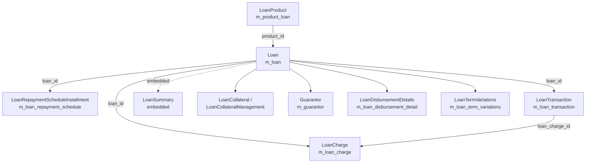

The [`fineract-loan`](https://github.com/apache/fineract/tree/develop/fineract-loan) Gradle module is Apache Fineract's **original, cumulative-interest loan engine**. It owns every JPA entity that represents a loan in the database — `LoanProduct`, `Loan`, `LoanRepaymentScheduleInstallment`, `LoanTransaction`, `LoanCharge` — together with the cumulative schedule generators (flat and declining-balance), the nine cumulative transaction-processing strategies, the rescheduling pipeline, the guarantor sub-module and a large family of read-side data objects. A newer sibling module, [`fineract-progressive-loan`](https://github.com/apache/fineract/tree/develop/fineract-progressive-loan), shares the same persistent entities but layers a *progressive* (period-by-period) interest engine on top with its own schedule generator, payment-allocation rules and emit/capitalized-income/buy-down-fee APIs.

Both modules read and write the same `m_loan*` tables. The split is *behavioural*: which `LoanScheduleGenerator` runs, which `LoanRepaymentScheduleTransactionProcessor` posts the money, and which calculation engine handles re-amortization, interest pauses and capitalized income. The `LoanScheduleType` column on `m_loan` (values `CUMULATIVE` and `PROGRESSIVE`, see `fineract-loan/src/main/java/org/apache/fineract/portfolio/loanaccount/loanschedule/domain/LoanScheduleType.java`) decides which engine handles a given account at runtime.

## Aggregate map



`Loan` is the **aggregate root** in DDD terms: every operation that mutates a schedule, posts a transaction, waives a charge, or transitions status goes through methods on `Loan` (or through the `LoanAccountDomainService` façade that holds a `Loan` instance). The `m_loan` row stores the *terms* of the agreement; `m_loan_repayment_schedule` stores the *expected* installments; `m_loan_transaction` stores everything that *actually happened*; `m_loan_charge` stores the fees and penalties attached to that specific loan.

## Cumulative vs progressive

The cumulative engine is the historic Mifos-derived approach: it pre-computes the *entire* repayment schedule up front (flat-interest or declining-balance amortization) and stores it as `m_loan_repayment_schedule` rows. Recalculation regenerates the whole table. The progressive engine, introduced in 2024 under `fineract-progressive-loan`, retains the same rows but treats interest as an *emit-on-period* derived value, supports per-period payment-allocation rules (`LoanProductPaymentAllocationRule`), capitalized income (`CAPITALIZED_INCOME` transaction type) and buy-down fees.

<CardGroup cols={2}>
  <Card title="fineract-loan" icon="circle-1">
    Cumulative engine. `CumulativeFlatInterestLoanScheduleGenerator`, `CumulativeDecliningBalanceInterestLoanScheduleGenerator`. Nine `LoanRepaymentScheduleTransactionProcessor` implementations under `domain/transactionprocessor/impl/`.
  </Card>
  <Card title="fineract-progressive-loan" icon="circle-2">
    Progressive engine. `LoanScheduleProcessingType.HORIZONTAL`/`VERTICAL`. Payment-allocation and credit-allocation rule lists; capitalized income, buy-down fee and re-amortization endpoints.
  </Card>
</CardGroup>

The module split is mid-flight — several `// TODO FINERACT-1932-Fineract modularization` comments inside `Loan.java` and `LoanProduct.java` mark fields (such as `paymentAllocationRules`, `creditAllocationRules`, `LoanInterestRecalculationDetails`) that still live on the shared entity but conceptually belong to one engine or the other.

## What lives in `fineract-loan`

The module is organised under `fineract-loan/src/main/java/org/apache/fineract/portfolio/` with two top-level packages, `loanaccount` and `loanproduct`.

### `portfolio/loanaccount/`

| Package | Responsibility |
| --- | --- |
| `api/` | JAX-RS resources for `/v1/loans/{loanId}/...` sub-resources: schedule, transactions, amortization-allocation. `LoanScheduleApiResource.java`. |
| `command/` | Command DTOs that the JSON deserializers materialise before handing off to write platform services. |
| `data/` | Read-side data projections: `LoanAccountData`, `LoanChargeData`, `LoanTransactionData`, `HolidayDetailDTO`, `OutstandingAmountsDTO`. |
| `domain/` | The full JPA model: `Loan`, `LoanTransaction`, `LoanCharge`, `LoanRepaymentScheduleInstallment`, `LoanSummary`, plus 70+ supporting entities and enums. |
| `domain/transactionprocessor/` | `LoanRepaymentScheduleTransactionProcessor` interface and nine `impl/` strategies (Fineract-style, RBI, Creocore, Heavens Family, Early Payment, two due-then-in-advance orderings, plus `InterestPrincipalPenaltyFeesOrder` and `PrincipalInterestPenaltyFeesOrder`). |
| `domain/arrears/` | `LoanArrearsData` value object. The `m_loan_arrears_aging` snapshot table is rebuilt by `LoanArrearsAgeingUpdateHandler` (the scheduled job) via direct JDBC rather than a JPA entity. |
| `domain/reaging/` & `domain/reamortization/` | `LoanReAgeParameter`, `LoanReAmortizationParameter` — transaction sub-types that carry the parameters of those operations. |
| `exception/` | `LoanNotFoundException`, `LoanChargeNotFoundException`, etc. |
| `guarantor/` | Guarantor sub-aggregate command/handler/service layer (`GuarantorWritePlatformService`, command handlers, JSON deserializer); the `Guarantor` and `GuarantorFundingDetails` JPA entities themselves live in `fineract-provider`. |
| `handler/` | `CommandSourceHandler` Spring beans for every `LOAN_*` command code. |
| `jobs/` | Scheduled job step implementations (`addAccrualEntries`, `applyChargeForOverdueLoans`, `applyHolidaysToLoans`, `recalculateInterestForLoan`). |
| `loanschedule/` | The cumulative schedule generator family (see [Loan Schedule Generation](/loan/loan-schedule-generation)). |
| `mapper/` | MapStruct mappers between entities and `data` DTOs. |
| `rescheduleloan/` | `LoanRescheduleRequest` workflow — approve/reject + apply term variations. |
| `serialization/` | `FromJsonHelper`-based deserializers for loan, charge and transaction JSON payloads. |
| `service/` | The thick service layer: `LoanAccountDomainService`, `LoanAssembler`, `LoanBalanceService`, `LoanChargeService`, `LoanArrearsAgingServiceImpl`, etc. |
| `starter/` | Spring Boot auto-config wiring up the module. |

### `portfolio/loanproduct/`

| Package | Responsibility |
| --- | --- |
| `domain/` | `LoanProduct` aggregate, embedded `LoanProductRelatedDetail`, configurable-attributes mask, borrower-cycle variations, floating-rate link, guarantee details, interest-recalculation details, min/max constraints, payment- and credit-allocation rules, supported-interest-refund-types list converter, plus the core enums (`AmortizationMethod`, `InterestMethod`, `InterestCalculationPeriodMethod`, `InterestRecalculationCompoundingMethod`, `RepaymentStartDateType`, `LendingStrategy`). |
| `api/` | `LoanProductsDetailsApiResource` (`/v1/loanproducts/basic-details`). The CRUD `LoanProductsApiResource` lives in `fineract-provider`. |
| `service/`, `data/`, `exception/`, `serialization/`, `starter/` | Standard supporting layers, parallel to the loan account ones. |

## Reading order

<Steps>
  <Step title="Loan aggregate">
    Start with the [`Loan` entity](/loan/loan-aggregate) — the root that everything else hangs off, with its 100+ fields and the `LoanStatus` / `LoanLifecycleStateMachine` lifecycle.
  </Step>
  <Step title="LoanProduct">
    Then the [`LoanProduct`](/loan/loan-product) template — interest method, amortization method, configurable attributes, borrower-cycle variations.
  </Step>
  <Step title="Schedule generation">
    Read how [the schedule is generated](/loan/loan-schedule-generation) from `LoanApplicationTerms` and emitted as a `LoanScheduleModel` of `LoanScheduleModelPeriod` objects.
  </Step>
  <Step title="Installments">
    See how those periods are persisted as [`LoanRepaymentScheduleInstallment` rows](/loan/repayment-schedule-installments) and how the principal/interest/fee/penalty buckets are settled.
  </Step>
  <Step title="Transactions">
    Learn how [`LoanTransaction` rows and the strategy implementations](/loan/loan-transaction-and-charge) actually apply repayments, waivers, write-offs and chargebacks against the schedule.
  </Step>
  <Step title="Charges">
    Finally, the [`LoanCharge` join entity](/loan/loan-charge-and-fees) — how `Charge` catalogue rows are attached to a specific loan, plus the four charge-shaped REST resources.
  </Step>
</Steps>

## Where to find the heavy hitters

Five entities account for most of the module's lines of code. Every page in this section is anchored to one of them.

| Entity | File | Lines |
| --- | --- | --- |
| `Loan` | `fineract-loan/src/main/java/org/apache/fineract/portfolio/loanaccount/domain/Loan.java` | ~1855 |
| `LoanRepaymentScheduleInstallment` | `fineract-loan/.../domain/LoanRepaymentScheduleInstallment.java` | ~1303 |
| `LoanTransaction` | `fineract-loan/.../domain/LoanTransaction.java` | ~1045 |
| `LoanProduct` | `fineract-loan/src/main/java/org/apache/fineract/portfolio/loanproduct/domain/LoanProduct.java` | ~770 |
| `LoanCharge` | `fineract-loan/.../domain/LoanCharge.java` | ~750 |

The schedule generators add another ~3000 lines under `loanaccount/loanschedule/domain/`, and the transaction-processor implementations another ~2000 under `loanaccount/domain/transactionprocessor/impl/`.

## Schedule type at the root

```java
// fineract-loan/.../portfolio/loanaccount/domain/Loan.java
import static org.apache.fineract.portfolio.loanaccount.loanschedule.domain.LoanScheduleType.CUMULATIVE;
import static org.apache.fineract.portfolio.loanaccount.loanschedule.domain.LoanScheduleType.PROGRESSIVE;
```

The `Loan` aggregate imports both schedule types so it can switch behaviour based on `loanRepaymentScheduleDetail.getLoanScheduleType()` — the field is stored once on the embedded `LoanProductRelatedDetail` snapshot taken at disbursal. From there, every code path that reads or writes the schedule (re-amortize, write-off, charge-off, interest pause) consults this field before calling either the cumulative engine here or the progressive engine in `fineract-progressive-loan`.

## REST surface (cumulative pieces)

The cumulative module exposes (most resources extend across both engines, marked C/P):

- `POST/GET /v1/loanproducts` — `LoanProductsApiResource` (in `fineract-provider`).
- `GET /v1/loanproducts/basic-details` — `LoanProductsDetailsApiResource` in `fineract-loan`.
- `GET /v1/loans/{loanId}/schedule` — `LoanScheduleApiResource`.
- `POST/GET/PUT/DELETE /v1/loans/{loanId}/charges` — `LoanChargesApiResource` (covered on [Loan Charge & Fees](/loan/loan-charge-and-fees)).
- `POST /v1/loans/{loanId}/interest-pauses` — `LoanInterestPauseApiResource`.
- (Progressive-only) `POST /v1/loans/{loanId}/buydown-fees` — `LoanBuyDownFeeApiResource`.
- (Progressive-only) `POST /v1/loans/{loanId}/capitalized-incomes` — `LoanCapitalizedIncomeApiResource`.

## Cross-references

- The shared `LoanStatus` enum lives in `fineract-core/src/main/java/org/apache/fineract/portfolio/loanaccount/domain/LoanStatus.java` so other modules (accounting, jobs, business events) can depend on it without dragging in `fineract-loan`.
- `Charge` (the catalogue), `ChargeTimeType`, `ChargeCalculationType` and `ChargePaymentMode` live in `fineract-charge` / `fineract-core` — see the [Charges](/charges/overview) wiki for the catalogue itself.
- Accounting postings for every `LoanTransactionType` are wired by `LoanJournalEntryPoster` (`fineract-loan/.../service/LoanJournalEntryPoster.java`) against the `AccountingRuleType` configured on the product.

The remaining six pages in this section drill into each pillar of the aggregate in turn.
