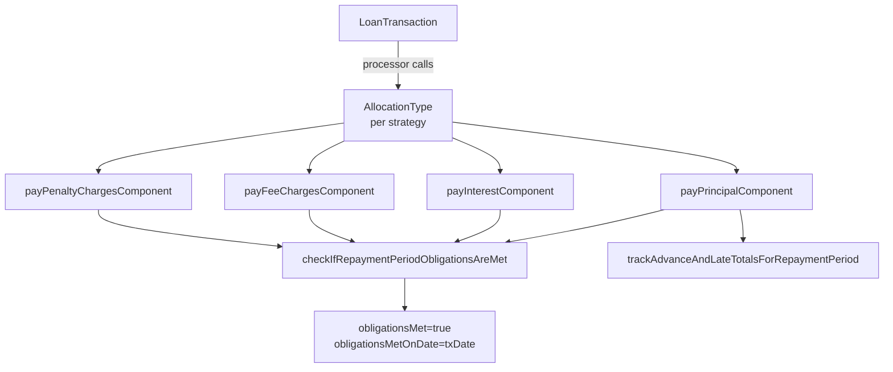

`LoanRepaymentScheduleInstallment` is the persisted, row-per-period view of a loan's repayment schedule in Apache Fineract. The entity at [`LoanRepaymentScheduleInstallment.java`](https://github.com/apache/fineract/blob/develop/fineract-loan/src/main/java/org/apache/fineract/portfolio/loanaccount/domain/LoanRepaymentScheduleInstallment.java) backs the `m_loan_repayment_schedule` table and is updated continuously as transactions land — its derived `*_completed`, `*_paid`, `*_waived`, `*_writtenoff` and `accrued` columns are what allow the read APIs to answer "what's due, what's paid, what's outstanding?" in a single round trip.

Every monetary movement on a loan ([`LoanTransaction`](/loan/loan-transaction-and-charge)) eventually lands on one or more installments via a [`LoanTransactionToRepaymentScheduleMapping`](https://github.com/apache/fineract/blob/develop/fineract-loan/src/main/java/org/apache/fineract/portfolio/loanaccount/domain/LoanTransactionToRepaymentScheduleMapping.java). The settlement order inside an installment is *part of the entity itself* — `LoanRepaymentScheduleInstallment` exposes typed `pay*Component(...)` methods that the transaction processors call in a particular sequence.

## Entity skeleton

```java
// fineract-loan/.../loanaccount/domain/LoanRepaymentScheduleInstallment.java
@Getter
@Setter
@Entity
@Table(name = "m_loan_repayment_schedule")
public class LoanRepaymentScheduleInstallment extends AbstractAuditableWithUTCDateTimeCustom<Long>
        implements Comparable<LoanRepaymentScheduleInstallment> {

    @ManyToOne(optional = false) @JoinColumn(name = "loan_id", referencedColumnName = "id")
    private Loan loan;

    @Column(name = "installment", nullable = false)
    private Integer installmentNumber;

    @Column(name = "fromdate")              private LocalDate fromDate;
    @Column(name = "duedate", nullable = false) private LocalDate dueDate;
    // ... principal, interest, fees, penalties, paid/waived/written-off, charges, mappings
}
```

The entity implements `Comparable` so any sorted collection on `Loan` naturally orders by installment number.

## Field map

The columns naturally group into a `(charged, paid, waived, written-off, accrued)` quintuple per money component.

### Principal

| Field                 | Column                          | Meaning                          |
| --------------------- | ------------------------------- | -------------------------------- |
| `principal`           | `principal_amount`              | Principal due in this period     |
| `principalCompleted`  | `principal_completed_derived`   | Principal paid                   |
| `principalWrittenOff` | `principal_writtenoff_derived`  | Principal written off            |

### Interest

| Field               | Column                         | Meaning                                       |
| ------------------- | ------------------------------ | --------------------------------------------- |
| `interestCharged`   | `interest_amount`              | Interest due in this period                   |
| `interestPaid`      | `interest_completed_derived`   | Interest paid                                 |
| `interestWaived`    | `interest_waived_derived`      | Interest waived                               |
| `interestWrittenOff`| `interest_writtenoff_derived`  | Interest written off                          |
| `interestAccrued`   | `accrual_interest_derived`     | Interest accrued (by the accrual job)         |
| `rescheduleInterestPortion` | `reschedule_interest_portion` | Carry-over portion from a reschedule  |

### Fee charges

| Field                  | Column                                 | Meaning             |
| ---------------------- | -------------------------------------- | ------------------- |
| `feeChargesCharged`    | `fee_charges_amount`                   | Fee charges due     |
| `feeChargesPaid`       | `fee_charges_completed_derived`        | Fee charges paid    |
| `feeChargesWaived`     | `fee_charges_waived_derived`           | Fee charges waived  |
| `feeChargesWrittenOff` | `fee_charges_writtenoff_derived`       | Fee charges written off |
| `feeAccrued`           | `accrual_fee_charges_derived`          | Fee charges accrued |

### Penalty charges

| Field                    | Column                                  | Meaning             |
| ------------------------ | --------------------------------------- | ------------------- |
| `penaltyCharges`         | `penalty_charges_amount`                | Penalties due       |
| `penaltyChargesPaid`     | `penalty_charges_completed_derived`     | Penalties paid      |
| `penaltyChargesWaived`   | `penalty_charges_waived_derived`        | Penalties waived    |
| `penaltyChargesWrittenOff` | `penalty_charges_writtenoff_derived`  | Penalties written off |
| `penaltyAccrued`         | `accrual_penalty_charges_derived`       | Penalties accrued   |

### Status & advance/late tracking

| Field                          | Column                              | Meaning                                                |
| ------------------------------ | ----------------------------------- | ------------------------------------------------------ |
| `obligationsMet`               | `completed_derived`                 | All money components fully paid/waived for this period |
| `obligationsMetOnDate`         | `obligations_met_on_date`           | Date the installment was closed                        |
| `recalculatedInterestComponent`| `recalculated_interest_component`   | Marker installment added by interest recalculation     |
| `additional`                   | `is_additional`                     | True for adjustment installments (e.g. re-age)         |
| `totalPaidInAdvance`           | `total_paid_in_advance_derived`     | Aggregate paid before this installment's due date      |
| `totalPaidLate`                | `total_paid_late_derived`           | Aggregate paid after this installment's due date       |
| `isDownPayment`                | `is_down_payment`                   | Auto down-payment installment                          |
| `isReAged`                     | `is_re_aged`                        | Installment introduced by re-age                       |
| `creditedPrincipal/Interest/Fee/Penalty` | `credits_amount`, `credited_*` | Credit-back amounts (chargeback flows)        |

### Relations

```java
@OneToMany(cascade = CascadeType.ALL, orphanRemoval = true, fetch = FetchType.LAZY,
           mappedBy = "loanRepaymentScheduleInstallment")
private Set<LoanInterestRecalcualtionAdditionalDetails> loanCompoundingDetails = new HashSet<>();

@OneToMany(cascade = CascadeType.ALL, orphanRemoval = true, fetch = FetchType.LAZY,
           mappedBy = "loanRepaymentScheduleInstallment")
private Set<PostDatedChecks> postDatedChecks = new HashSet<>();

@OneToMany(cascade = CascadeType.ALL, orphanRemoval = true, fetch = FetchType.LAZY,
           mappedBy = "installment")
private Set<LoanInstallmentCharge> installmentCharges = new HashSet<>();

@OneToMany(cascade = CascadeType.ALL, orphanRemoval = true, fetch = FetchType.LAZY,
           mappedBy = "installment")
private Set<LoanTransactionToRepaymentScheduleMapping> loanTransactionToRepaymentScheduleMappings = new HashSet<>();
```

## Settlement order

A transaction processor calls one method per money component, in a sequence that depends on the [strategy](/loan/loan-transaction-and-charge#transaction-processors). The installment itself exposes a uniform dispatcher keyed by [`AllocationType`](https://github.com/apache/fineract/blob/develop/fineract-loan/src/main/java/org/apache/fineract/portfolio/loanproduct/domain/AllocationType.java) and `PaymentAction`:

```java
public PaymentFunction getPaymentFunction(AllocationType allocationType, PaymentAction action) {
    return switch (allocationType) {
        case PENALTY  -> PaymentAction.PAY.equals(action) ? this::payPenaltyChargesComponent
                       : PaymentAction.UNPAY.equals(action) ? this::unpayPenaltyChargesComponent : null;
        case FEE      -> PaymentAction.PAY.equals(action) ? this::payFeeChargesComponent
                       : PaymentAction.UNPAY.equals(action) ? this::unpayFeeChargesComponent : null;
        case INTEREST -> PaymentAction.PAY.equals(action) ? this::payInterestComponent
                       : PaymentAction.UNPAY.equals(action) ? this::unpayInterestComponent : null;
        case PRINCIPAL-> PaymentAction.PAY.equals(action) ? this::payPrincipalComponent
                       : PaymentAction.UNPAY.equals(action) ? this::unpayPrincipalComponent : null;
    };
}
```

Each `pay*Component(...)` is shaped identically: take the residual transaction amount, consume as much as the outstanding for that bucket allows, bump the matching `*Paid` derived column, and finally call `checkIfRepaymentPeriodObligationsAreMet(...)` plus `trackAdvanceAndLateTotalsForRepaymentPeriod(...)` to keep status fields in sync.

```java
public Money payPrincipalComponent(final LocalDate transactionDate, final Money transactionAmount) {
    final MonetaryCurrency currency = transactionAmount.getCurrency();
    Money principalPortionOfTransaction = Money.zero(currency);
    if (transactionAmount.isZero()) return principalPortionOfTransaction;

    final Money principalDue = getPrincipalOutstanding(currency);
    if (transactionAmount.isGreaterThanOrEqualTo(principalDue)) {
        setPrincipalCompleted(getPrincipalCompleted(currency).plus(principalDue).getAmount());
        principalPortionOfTransaction = principalPortionOfTransaction.plus(principalDue);
    } else {
        setPrincipalCompleted(getPrincipalCompleted(currency).plus(transactionAmount).getAmount());
        principalPortionOfTransaction = principalPortionOfTransaction.plus(transactionAmount);
    }
    checkIfRepaymentPeriodObligationsAreMet(transactionDate, currency);
    trackAdvanceAndLateTotalsForRepaymentPeriod(transactionDate, currency, principalPortionOfTransaction);
    return principalPortionOfTransaction;
}
```

The mirrored `waiveInterestComponent`, `waivePenaltyChargesComponent`, `waiveFeeChargesComponent` methods update the `*Waived` columns; `writeOffOutstandingPrincipal/Interest/FeeCharges/PenaltyCharges` update the `*WrittenOff` columns and are called by the write-off command handler.



The `obligationsMet` flag flips only when *every* outstanding bucket (principal, interest, fees, penalties) reaches zero; the `obligationsMetOnDate` is the transaction date of the closing payment. Together they drive whether the loan can transition out of `ACTIVE` via [`DefaultLoanLifecycleStateMachine`](/loan/loan-aggregate#defaultloanlifecyclestatemachine).

## Mapping back to transactions

`LoanTransactionToRepaymentScheduleMapping` is the join row that records how much of a given transaction landed on a given installment, split by bucket.

```java
// LoanTransactionToRepaymentScheduleMapping.java – field summary
@ManyToOne @JoinColumn(name = "loan_transaction_id") LoanTransaction loanTransaction;
@ManyToOne @JoinColumn(name = "loan_schedule_id")    LoanRepaymentScheduleInstallment installment;
@Column(name = "principal_portion_derived")          BigDecimal principalPortion;
@Column(name = "interest_portion_derived")           BigDecimal interestPortion;
@Column(name = "fee_charges_portion_derived")        BigDecimal feeChargesPortion;
@Column(name = "penalty_charges_portion_derived")    BigDecimal penaltyChargesPortion;
@Column(name = "amount")                             BigDecimal amount;
```

Whenever a transaction is reversed or reprocessed, the matching mapping rows are rewritten and the affected installments' derived columns are recomputed — guaranteeing that the installment view always equals the sum of (non-reversed) mapping rows.

## `LoanInstallmentCharge`

Some charges are distributed per installment instead of attached as a single lump on the loan. [`LoanInstallmentCharge`](https://github.com/apache/fineract/blob/develop/fineract-loan/src/main/java/org/apache/fineract/portfolio/loanaccount/domain/LoanInstallmentCharge.java) is the join entity that records that distribution.

```java
@Entity
@Getter
@Table(name = "m_loan_installment_charge")
public class LoanInstallmentCharge extends AbstractPersistableCustom<Long> implements Comparable<LoanInstallmentCharge> {

    @ManyToOne(optional = false) @JoinColumn(name = "loan_charge_id", referencedColumnName = "id", nullable = false)
    private LoanCharge loancharge;

    @ManyToOne @JoinColumn(name = "loan_schedule_id", nullable = false)
    private LoanRepaymentScheduleInstallment installment;

    @Column(name = "amount", scale = 6, precision = 19, nullable = false)
    private BigDecimal amount;
    @Column(name = "amount_paid_derived", scale = 6, precision = 19) private BigDecimal amountPaid;
    @Column(name = "amount_waived_derived", scale = 6, precision = 19) private BigDecimal amountWaived;
    @Column(name = "amount_writtenoff_derived", scale = 6, precision = 19) private BigDecimal amountWrittenOff;
}
```

Use cases:

- A flat fee that is spread across installments (e.g. annual fee divided by 12 monthly).
- A percentage fee computed off each installment's principal or interest.
- Overdue charges generated per missed installment by [`LoanOverdueInstallmentCharge`](https://github.com/apache/fineract/blob/develop/fineract-loan/src/main/java/org/apache/fineract/portfolio/loanaccount/domain/LoanOverdueInstallmentCharge.java).

When a transaction settles a per-installment fee, the [`LoanChargePaidBy`](/loan/loan-transaction-and-charge#loanchargepaidby) row carries the `installmentNumber` so the per-installment running total stays correct alongside the `LoanCharge.amountPaid` total.

## Comparator and ordering

`LoanRepaymentScheduleInstallment` implements `Comparable<LoanRepaymentScheduleInstallment>` on `installmentNumber`. The repository and JPA fetches under `Loan.repaymentScheduleInstallments` rely on this ordering — never sort by `dueDate` alone because re-aged or down-payment installments can have non-monotone dates within the same loan.

## Related pages

<CardGroup cols={2}>
  <Card title="Schedule Generation" icon="diagram-project" href="/loan/loan-schedule-generation">
    Where the initial values for these columns come from.
  </Card>
  <Card title="Loan Transaction & Charge" icon="receipt" href="/loan/loan-transaction-and-charge">
    Transactions that mutate the `*Paid`, `*Waived`, `*WrittenOff` columns.
  </Card>
  <Card title="Loan Charges & Fees" icon="money-bill" href="/loan/loan-charge-and-fees">
    `LoanCharge` and per-installment distribution detail.
  </Card>
  <Card title="Loan Aggregate" icon="layer-group" href="/loan/loan-aggregate">
    Aggregate that owns the schedule and rolls up totals on `LoanSummary`.
  </Card>
</CardGroup>
