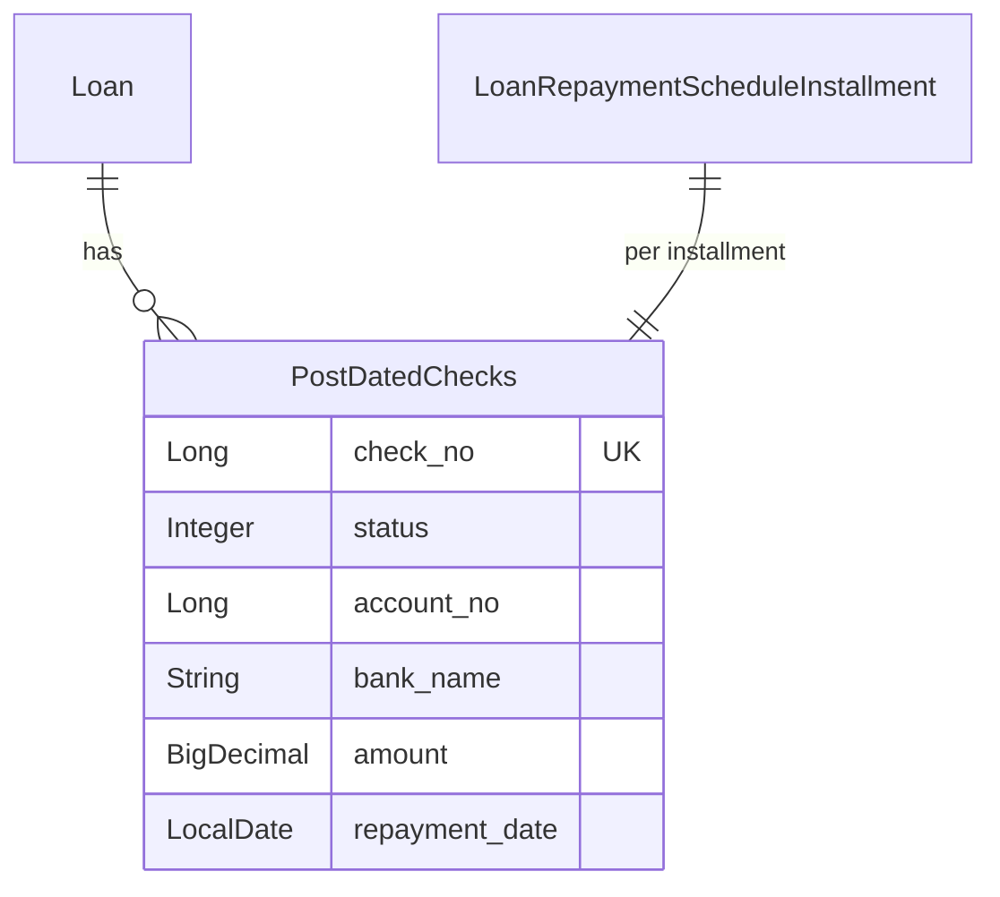
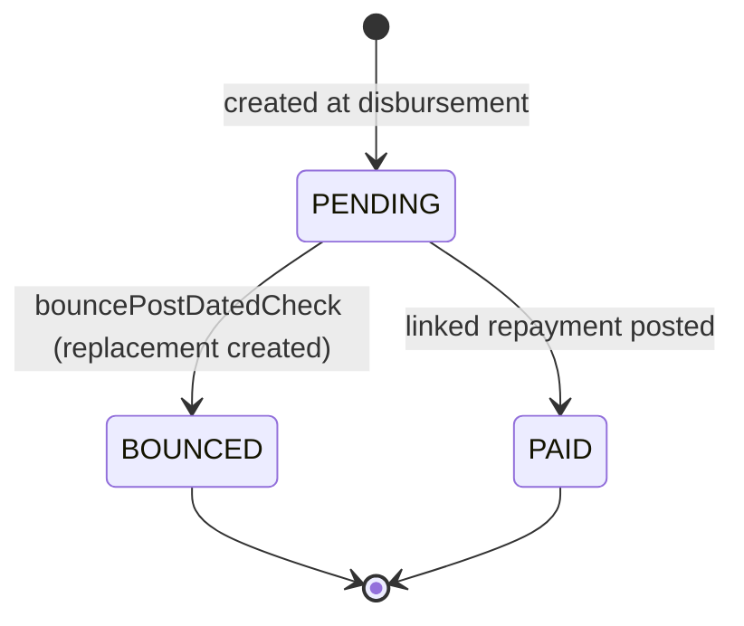
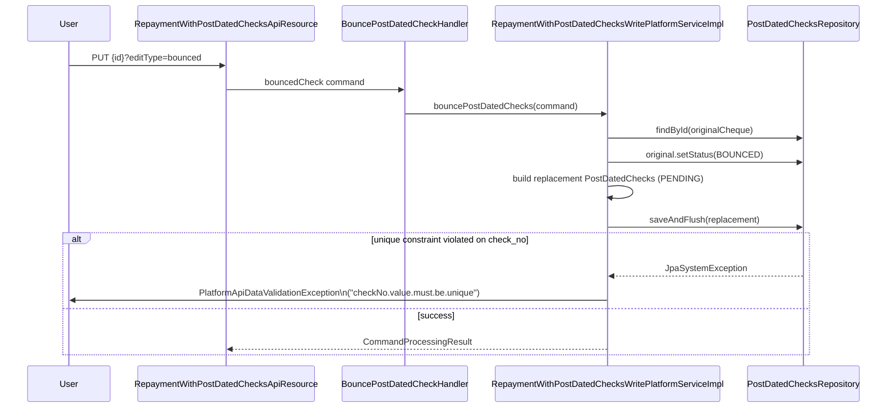

# Repayment with Post-Dated Checks

In several Apache Fineract markets clients hand over **post-dated cheques** at disbursement,
one per repayment installment. The cheques are then deposited on their due dates. Fineract
models this with a dedicated *post-dated check* row per installment, with its own status,
cheque numbering, bank/account details and a link back to the repayment installment.

The domain entity is in `fineract-loan`, but the REST/API/service layers live in
`fineract-provider` because the feature wires into the loan command handlers and bulk import:

| Location                                                                                     | Classes                                                  |
|----------------------------------------------------------------------------------------------|----------------------------------------------------------|
| `fineract-loan/.../portfolio/repaymentwithpostdatedchecks/domain/`                           | `PostDatedChecks`                                        |
| `fineract-provider/.../portfolio/repaymentwithpostdatedchecks/api/`                          | `RepaymentWithPostDatedChecksApiResource`, `PostDatedChecksApiResourceSwagger` |
| `fineract-provider/.../portfolio/repaymentwithpostdatedchecks/data/`                         | `PostDatedChecksData`, `PostDatedChecksStatus`           |
| `fineract-provider/.../portfolio/repaymentwithpostdatedchecks/domain/`                       | `PostDatedChecksRepository`                              |
| `fineract-provider/.../portfolio/repaymentwithpostdatedchecks/handler/`                      | `BouncePostDatedCheckHandler`, `DeletePostDatedChecksHandler`, `EditPostDatedChecksHandler` |
| `fineract-provider/.../portfolio/repaymentwithpostdatedchecks/service/`                      | `RepaymentWithPostDatedChecksAssembler`, `*ReadPlatformService(.Impl)`, `*WritePlatformService(.Impl)` |
| `fineract-provider/.../portfolio/repaymentwithpostdatedchecks/exception/`                    | `PostDatedCheckNotFoundException`, `PostDatedCheckBouncedCheckInvalid` |
| `fineract-provider/.../portfolio/repaymentwithpostdatedchecks/starter/`                      | `RepaymentWithPostDatedChecksConfiguration`              |

## `PostDatedChecks` entity

`fineract-loan/src/main/java/org/apache/fineract/portfolio/repaymentwithpostdatedchecks/domain/PostDatedChecks.java`
is mapped to `m_repayment_with_post_dated_checks` with one row per cheque:

```java
@Entity
@Table(name = "m_repayment_with_post_dated_checks")
@Getter
public class PostDatedChecks extends AbstractPersistableCustom<Long> {

    @Setter
    @ManyToOne(optional = false)
    @JoinColumn(name = "loan_id", referencedColumnName = "id", nullable = false)
    private Loan loan;

    @Setter
    @ManyToOne(optional = false)
    @JoinColumn(name = "repayment_id", referencedColumnName = "id", nullable = false)
    private LoanRepaymentScheduleInstallment loanRepaymentScheduleInstallment;

    @Column(name = "account_no", nullable = false, length = 10)  private Long accountNo;
    @Column(name = "bank_name",  nullable = false, length = 100) private String bankName;
    @Column(name = "amount", scale = 6, precision = 19)          private BigDecimal amount;
    @Column(name = "repayment_date", nullable = false)           private LocalDate repaymentDate;

    @Setter
    @Column(name = "status", columnDefinition = "0")             private Integer status;

    @Column(name = "check_no", nullable = false, unique = true)  private Long checkNo;
}
```

Two columns deserve special note:

- **`check_no`** carries a `UNIQUE` constraint at the DB level, so cheque numbers cannot be
  reused across loans or across rows. The writer translates the resulting JPA exception into
  a `value.must.be.unique` validation error.
- **`repayment_date`** is initialised from the installment's `getDueDate()` when the cheque
  is created. This means a cheque is *anchored* to a specific installment; rescheduling a
  loan does not silently move the cheque, the cheque is bounced/recreated.

The static factory used by the assembler:

```java
public static PostDatedChecks instanceOf(final Long accountNo, final String bankName,
        final BigDecimal amount, final LoanRepaymentScheduleInstallment installment,
        final Loan loan, final Long checkNo) {
    return new PostDatedChecks(accountNo, bankName, amount, installment,
            installment.getDueDate(), loan, checkNo);
}
```

`updatePostDatedChecks(JsonCommand)` returns a *changes* map (Fineract's diff for command
audit) covering `amount`, `bankName` (under JSON name `name`), `accountNo` and `checkNo`.



## Status

`fineract-provider/.../repaymentwithpostdatedchecks/data/PostDatedChecksStatus.java` is a
simple interface of integer constants:

```java
public interface PostDatedChecksStatus {
    Integer POST_DATED_CHECKS_BOUNCED = 1;
    Integer POST_DATED_CHECKS_PAID    = 2;
    Integer POST_DATED_CHECKS_PENDING = 0;
}
```

The status column starts at `PENDING (0)`. When a repayment is recorded against the linked
installment, `LoanAccountDomainServiceJpa` looks up the matching cheque and flips its status
to `PAID (2)`; when the cheque is returned unpaid the bounce flow sets the original row to
`BOUNCED (1)` and creates a *new* PENDING row capturing the replacement cheque.



## Linkage to the repayment installment

Each `PostDatedChecks` row references a `LoanRepaymentScheduleInstallment` via the
`repayment_id` FK. This is what binds the cheque to a specific installment number and lets
the read service answer "give me the cheque for installment N":

```java
@GET @Path("{installmentId}")
public String getPostDatedCheck(
        @PathParam("installmentId") final Integer installmentId,
        @PathParam("loanId")        final Long    loanId) {
    this.context.authenticatedUser();
    final PostDatedChecksData postDatedChecksData = this.repaymentWithPostDatedChecksReadPlatformService
            .getPostDatedCheckByInstallmentId(installmentId, loanId);
    return this.apiJsonSerializer.serialize(postDatedChecksData);
}
```

When a loan repayment posts on the installment, `LoanAccountDomainServiceJpa`
(`fineract-provider/.../portfolio/loanaccount/domain/LoanAccountDomainServiceJpa.java`)
flips the cheque's status to `POST_DATED_CHECKS_PAID`. Conversely, if the user starts the
bounce workflow, the original cheque is moved to `BOUNCED` and a new PENDING cheque is added
to take its place for the same installment.

## REST API: `RepaymentWithPostDatedChecksApiResource`

`fineract-provider/src/main/java/org/apache/fineract/portfolio/repaymentwithpostdatedchecks/api/RepaymentWithPostDatedChecksApiResource.java`
is mounted at **`/v1/loans/{loanId}/postdatedchecks`**:

| Method | Path                                              | Action                            |
|--------|---------------------------------------------------|-----------------------------------|
| GET    | (root)                                            | List all cheques for the loan     |
| GET    | `{installmentId}`                                 | Cheque for one installment        |
| PUT    | `{postDatedCheckId}?editType=update`              | Edit cheque details               |
| PUT    | `{postDatedCheckId}?editType=bounced`             | Mark cheque bounced + replacement |
| DELETE | `{postDatedCheckId}`                              | Delete a cheque                   |

The PUT routes the request to a different command depending on `editType`:

```java
if ("update".equals(type)) {
    commandRequest = new CommandWrapperBuilder().updatePostDatedCheck(id, loanId)
            .withJson(apiRequestBodyAsJson).build();
} else if ("bounced".equals(type)) {
    commandRequest = new CommandWrapperBuilder().bouncedCheck(id, loanId)
            .withJson(apiRequestBodyAsJson).build();
}
final CommandProcessingResult commandProcessingResult =
        this.commandsSourceWritePlatformService.logCommandSource(commandRequest);
```

Each command is dispatched by `CommandSourceHandler`s in the `handler` package:

- `BouncePostDatedCheckHandler` → `RepaymentWithPostDatedChecksWritePlatformService.bouncePostDatedChecks(command)`
- `EditPostDatedChecksHandler`  → `RepaymentWithPostDatedChecksWritePlatformService.updatePostDatedChecks(command)`
- `DeletePostDatedChecksHandler` → `RepaymentWithPostDatedChecksWritePlatformService.deletePostDatedChecks(command)`

### Request shape

The JSON body the API expects (mirrored by `RepaymentWithPostDatedChecksWritePlatformServiceImpl`
constants):

```json
{
  "name":        "Bank of Examples",
  "amount":      1250.00,
  "accountNo":   123456789,
  "checkNo":     1001,
  "installmentId": 3,
  "locale":      "en"
}
```

`name` becomes `bankName` on the entity, `installmentId` is the installment number that the
cheque covers, and `checkNo` is the **globally unique** cheque number.

## Bounce flow



The relevant slice of `RepaymentWithPostDatedChecksWritePlatformServiceImpl.bouncePostDatedChecks`:

```java
final PostDatedChecks postDatedCheck = this.postDatedChecksRepository.findById(command.entityId())
        .orElseThrow(() -> new PostDatedCheckNotFoundException(command.entityId()));
postDatedCheck.setStatus(PostDatedChecksStatus.POST_DATED_CHECKS_BOUNCED);

final Loan loan = this.loanRepository.findById(command.getLoanId())
        .orElseThrow(() -> new LoanNotFoundException(command.getLoanId()));
...
final List<LoanRepaymentScheduleInstallment> installmentList = loan.getRepaymentScheduleInstallments()
        .stream()
        .filter(repayment -> repayment.getInstallmentNumber().equals(installmentId)).toList();

final PostDatedChecks postDatedChecks =
        PostDatedChecks.instanceOf(accountNo, name, amount, installmentList.get(0), loan, checkNo);
try {
    this.postDatedChecksRepository.saveAndFlush(postDatedChecks);
} catch (final JpaSystemException | DataIntegrityViolationException e) {
    // translates "check_no" unique violation into a validation error
}
```

`PostDatedCheckBouncedCheckInvalid` is thrown when a bounce is requested for a cheque that is
not in `PENDING` state.

## Cheque numbering

A few rules to bear in mind:

- `check_no` is a `Long`, unique at the database level. Bounces will fail with a validation
  error if the replacement reuses an existing number.
- Numbering is *not* auto-generated; the assembler expects the value to come from the
  request, which mirrors a physical cheque book.
- The same client can reuse a number across different banks only after the old row is
  deleted (typically once the loan is closed and the cheque is returned).

## Read APIs and DTOs

`RepaymentWithPostDatedChecksReadPlatformServiceImpl`
(`fineract-provider/.../repaymentwithpostdatedchecks/service/RepaymentWithPostDatedChecksReadPlatformServiceImpl.java`)
exposes:

- `getPostDatedChecks(loanId)` → `List<PostDatedChecksData>` for the loan.
- `getPostDatedCheckByInstallmentId(installmentId, loanId)` → single `PostDatedChecksData`.

`PostDatedChecksData`
(`fineract-provider/.../repaymentwithpostdatedchecks/data/PostDatedChecksData.java`) is the
flat projection containing the cheque id, repayment installment, cheque number, status,
amount and bank/account details.

## Assembly at disbursement

`RepaymentWithPostDatedChecksAssembler`
(`fineract-provider/.../repaymentwithpostdatedchecks/service/RepaymentWithPostDatedChecksAssembler.java`)
is invoked from the loan disbursement flow when the loan product is configured to require
post-dated cheques. It walks the JSON `postDatedChecks` array, looks up each installment by
`installmentId` and creates one `PostDatedChecks` row per cheque in `PENDING` state.

## Auto-wiring

`fineract-provider/.../repaymentwithpostdatedchecks/starter/RepaymentWithPostDatedChecksConfiguration.java`
is a Spring `@Configuration` that pulls the read/write services, the assembler and the
handlers together so the module is enabled simply by being on the classpath.

## Permissions

The standard permission codes generated for these commands are:

- `UPDATE_POSTDATEDCHECK`, `BOUNCED_POSTDATEDCHECK`, `DELETE_POSTDATEDCHECK`
- Maker-checker `*_CHECKER` variants are produced automatically.

## Related pages

- [Loans (overview)](/loan/loan-aggregate) – the parent loan account.
- [Loan transactions](/loan/loan-transaction-and-charge) – how the cheque deposit becomes a
  repayment transaction.
- [Loan API resources](/loan/loan-api-resources) – complete map of loan-related endpoints.
