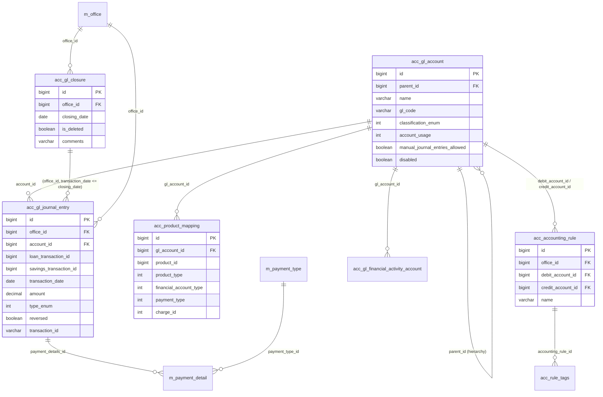

# Accounting Models

This page documents the Apache Fineract data models that implement the **double-entry accounting** subsystem — the chart of accounts (`GLAccount`), the period closures (`GLClosure`), the postings (`JournalEntry`), the manual posting templates (`AccountingRule`), the product-to-GL mappings that drive automatic posting from portfolio transactions, and the supporting `PaymentType` / `PaymentDetail` pair that captures how money was moved.

These entities live in the `fineract-accounting` module (with `GLAccount` shared by `fineract-core`) and the `fineract-core` module for payment-related classes.

## ER diagram

## Entity reference

### `GLAccount`

- **File:** `fineract-core/src/main/java/org/apache/fineract/accounting/glaccount/domain/GLAccount.java`
- **Table:** `acc_gl_account` (unique `gl_code`)
- **Primary key:** `Long id`
- **Base class:** `AbstractPersistableCustom<Long>`
- **Important fields:** `GLAccount parent`, `String hierarchy`, `String name`, `String glCode`, `boolean disabled`, `boolean manualEntriesAllowed`, `Integer accountType` (`GLAccountType` — ASSET=1, LIABILITY=2, EQUITY=3, INCOME=4, EXPENSE=5), `Integer usage` (`GLAccountUsage` — DETAIL=1, HEADER=2), `String description`, `CodeValue tagId`.
- **Key relationships:** Self-referential parent/child hierarchy. Referenced by `JournalEntry`, `ProductToGLAccountMapping`, `AccountingRule` (debit and credit sides), `FinancialActivityAccount`.

### `GLClosure`

- **File:** `fineract-accounting/src/main/java/org/apache/fineract/accounting/closure/domain/GLClosure.java`
- **Table:** `acc_gl_closure` (unique on `(office_id, closing_date)` for non-deleted rows)
- **Primary key:** `Long id`
- **Base class:** `AbstractAuditableCustom`
- **Important fields:** `Office office`, `LocalDate closingDate`, `boolean deleted`, `String comments`.
- **Key relationships:** Many-to-one to `Office`. Blocks any new `JournalEntry` whose `transactionDate <= closingDate` for the same office (checked by the journal entry write platform service).

### `JournalEntry`

- **File:** `fineract-accounting/src/main/java/org/apache/fineract/accounting/journalentry/domain/JournalEntry.java`
- **Table:** `acc_gl_journal_entry`
- **Primary key:** `Long id`
- **Base class:** `AbstractAuditableWithUTCDateTimeCustom<Long>`
- **Important fields:** `Office office`, `PaymentDetail paymentDetail`, `GLAccount glAccount`, `String currencyCode`, `String transactionId`, `Boolean isReversed`, `JournalEntry reversalJournalEntry`, `LocalDate transactionDate`, `Integer type` (`JournalEntryType` — DEBIT=1, CREDIT=2), `BigDecimal amount`, `String description`, `Integer entityType` (`PortfolioProductType` — LOAN, SAVINGS, ...), `Long entityId`, `Long loanTransactionId`, `Long savingsTransactionId`, `Long clientTransactionId`, `Long shareTransactionId`, `Boolean manualEntry`, `String referenceNumber`, `ExternalId externalId`.
- **Key relationships:** Many-to-one to `Office`, `GLAccount`, `PaymentDetail`. Each posting is one row — a balanced journal entry is a set of rows sharing the same `transaction_id`. Self-reference to `reversalJournalEntry` for reversed postings.

### `AccountingRule`

- **File:** `fineract-accounting/src/main/java/org/apache/fineract/accounting/rule/domain/AccountingRule.java`
- **Table:** `acc_accounting_rule` (unique `name`)
- **Primary key:** `Long id`
- **Base class:** `AbstractPersistableCustom<Long>`
- **Important fields:** `Office office`, `GLAccount accountToDebit`, `GLAccount accountToCredit`, `String name`, `String description`, `boolean systemDefined`, `boolean allowMultipleDebits`, `boolean allowMultipleCredits`, `List<AccountingTagRule> accountingTagRules`.
- **Key relationships:** Many-to-one to `Office` (rule can be office-specific), two many-to-one to `GLAccount`. One-to-many to `AccountingTagRule` (which references `CodeValue` tags) for the multi-debit/credit cases. Used by the manual journal entry UI as a posting template.

### `ProductToGLAccountMapping`

- **File:** `fineract-accounting/src/main/java/org/apache/fineract/accounting/producttoaccountmapping/domain/ProductToGLAccountMapping.java`
- **Table:** `acc_product_mapping` (unique on `(product_id, product_type, financial_account_type, payment_type, charge_id)`)
- **Primary key:** `Long id`
- **Base class:** `AbstractPersistableCustom<Long>`
- **Important fields:** `GLAccount glAccount`, `Long productId`, `Integer productType` (`PortfolioProductType`), `Integer financialAccountType` (depends on product type — e.g. for loans: FUND_SOURCE=1, LOAN_PORTFOLIO=2, INTEREST_ON_LOANS=3, INCOME_FROM_FEES=4, INCOME_FROM_PENALTIES=5, LOSSES_WRITTEN_OFF=6, TRANSFERS_SUSPENSE=10, OVERPAYMENT=11, ...), `PaymentType paymentType`, `Charge charge`.
- **Key relationships:** Many-to-one to `GLAccount`, optional `PaymentType` (for fund-source overrides per payment method), optional `Charge` (for income mapping of a specific fee). Used by `AccountingProcessorForLoan`/`AccountingProcessorForSavings` to resolve which `GLAccount` to post against for a given portfolio event.

### `FinancialActivityAccount`

- **File:** `fineract-accounting/src/main/java/org/apache/fineract/accounting/financialactivityaccount/domain/FinancialActivityAccount.java`
- **Table:** `acc_gl_financial_activity_account` (unique `financial_activity_type`)
- **Primary key:** `Long id`
- **Base class:** `AbstractPersistableCustom<Long>`
- **Important fields:** `GLAccount glAccount`, `Integer financialActivityType` (`FinancialActivity` — ASSET_TRANSFER=100, LIABILITY_TRANSFER=200, CASH_AT_MAIN_VAULT=101, CASH_AT_TELLER=102, OPENING_BALANCES_TRANSFER_CONTRA=300, ASSET_FUND_SOURCE=103, PAYABLE_DIVIDENDS=104, ...).
- **Key relationships:** Many-to-one to `GLAccount`. Singleton-per-type — there is at most one row per financial activity type, used to resolve the GL account for system-level activities (inter-branch transfers, opening balances, teller cash).

### `PaymentType`

- **File:** `fineract-core/src/main/java/org/apache/fineract/portfolio/paymenttype/domain/PaymentType.java`
- **Table:** `m_payment_type`
- **Primary key:** `Long id`
- **Base class:** `AbstractPersistableCustom<Long>`
- **Important fields:** `String name`, `String description`, `Boolean isCashPayment`, `Long position`, `String codeName`, `Boolean isSystemDefined`.
- **Key relationships:** Referenced by `PaymentDetail`, `ProductToGLAccountMapping` (per-payment-type GL override) and by cashier/teller transactions.

### `PaymentDetail`

- **File:** `fineract-core/src/main/java/org/apache/fineract/portfolio/paymentdetail/domain/PaymentDetail.java`
- **Table:** `m_payment_detail`
- **Primary key:** `Long id`
- **Base class:** `AbstractPersistableCustom<Long>`
- **Important fields:** `PaymentType paymentType`, `String accountNumber`, `String checkNumber`, `String routingCode`, `String receiptNumber`, `String bankNumber`.
- **Key relationships:** Many-to-one to `PaymentType`. Embedded in `LoanTransaction`, `SavingsAccountTransaction`, `JournalEntry`, `ClientTransaction` — i.e. *every* money movement may carry a payment detail.

### `TrialBalance` (reporting projection)

- **File:** `fineract-accounting/src/main/java/org/apache/fineract/accounting/glaccount/domain/TrialBalance.java`
- **Table:** `acc_gl_journal_entry` view (populated by a scheduled job)
- **Primary key:** `Long id`
- **Important fields:** `Office office`, `GLAccount account`, `BigDecimal amount`, `LocalDate entryDate`, `LocalDate createdDate`, `BigDecimal closingBalance`.
- **Key relationships:** Read-only projection over journal entries used by the trial balance report.

## Accounting rule types (product `accountingRule` column)

| Constant                  | Value | Meaning                                                                                 |
| ------------------------- | ----- | --------------------------------------------------------------------------------------- |
| `NONE`                    | 1     | Accounting disabled for this product.                                                   |
| `CASH_BASED`              | 2     | Cash accounting — record payments as they occur.                                        |
| `ACCRUAL_PERIODIC`        | 3     | Periodic accrual — `LoanAccrualWritePlatformService` posts accruals on a schedule.      |
| `ACCRUAL_UPFRONT`         | 4     | Upfront accrual at disbursement (loans only).                                           |

Stored in `m_product_loan.accounting_type` and `m_savings_product.accounting_type` — the mapping rows in `acc_product_mapping` are only consulted when `accounting_type != NONE`.

## Posting flow at a glance

1. A business event happens (e.g. `LoanTransaction` of type `REPAYMENT` saved).
2. `AccountingProcessorHelper` reads the product's `acc_product_mapping` rows.
3. For each `FinancialAccountType` involved (fund source, portfolio, fees income, penalties income, overpayment, ...), it resolves the `GLAccount`.
4. It creates **balanced** `JournalEntry` rows tagged with the same `transaction_id` and `entity_id`/`entity_type`.
5. If the transaction is later reversed, the processor inserts a mirror set of `JournalEntry` rows with `is_reversed = true` linked via `reversalJournalEntry`.

`GLClosure` enforces that no new entry can be backdated into a closed period.
