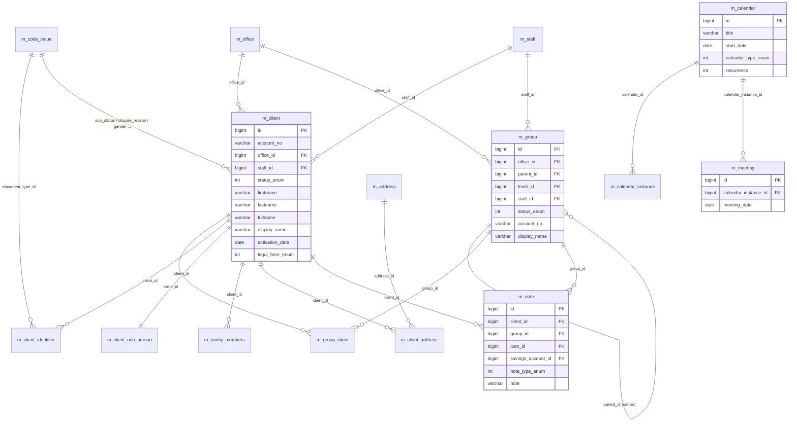

# Client, Group & Calendar Models

This page documents the Apache Fineract data models that describe the **customer side** of the portfolio — natural and legal-person clients, the documents that identify them, the addresses where they live, the families that depend on them, and the **groups** and **centers** through which microfinance institutions deliver products to them. It also covers the **calendar**, **meeting** and **note** entities that schedule and annotate everything else.

Almost all of these entities live in `fineract-core` under `org.apache.fineract.portfolio.client.domain`, `portfolio.group.domain`, `portfolio.calendar.domain` and `portfolio.note.domain`, with a few address-related classes in `fineract-provider`.

## ER diagram

## Entity reference

### `Client`

- **File:** `fineract-core/src/main/java/org/apache/fineract/portfolio/client/domain/Client.java`
- **Table:** `m_client` (unique `account_no`, unique `mobile_no`, unique `email_address`, unique `external_id`)
- **Primary key:** `Long id`
- **Base class:** `AbstractAuditableWithUTCDateTimeCustom<Long>`
- **Important fields:** `accountNumber`, `Office office`, `Office transferToOffice`, `Long imageId`, `Integer status` (`ClientStatus` enum), `CodeValue subStatus`, `LocalDate activationDate`, `LocalDate officeJoiningDate`, `firstname`, `middlename`, `lastname`, `fullname`, `displayName`, `mobileNo`, `emailAddress`, `boolean isStaff`, `ExternalId externalId`, `LocalDate dateOfBirth`, `CodeValue gender`, `Staff staff`, `Set<Group> groups`, `CodeValue closureReason`, `LocalDate closureDate`, `CodeValue rejectionReason`, `Integer legalForm` (`LegalForm` — PERSON / ENTITY).
- **Key relationships:** Many-to-one to `Office`, `Staff`, `CodeValue` (sub-status, gender, closure/rejection/withdrawal/savings-product reason). Many-to-many to `Group` via `m_group_client`. One-to-many to `ClientIdentifier`, `ClientFamilyMembers`, `ClientAddress`, `Note`, `Loan`, `SavingsAccount`. One-to-one to `ClientNonPerson` when `legalForm = ENTITY`.

### `ClientIdentifier`

- **File:** `fineract-core/src/main/java/org/apache/fineract/portfolio/client/domain/ClientIdentifier.java`
- **Table:** `m_client_identifier` (unique on `(document_type_id, document_key)`)
- **Primary key:** `Long id`
- **Base class:** `AbstractAuditableWithUTCDateTimeCustom<Long>`
- **Important fields:** `Client client`, `CodeValue documentType`, `String documentKey`, `String description`, `Integer status` (`ClientIdentifierStatus`).
- **Key relationships:** Many-to-one to `Client` (`client_id`) and `CodeValue` (`document_type_id`).

### `ClientNonPerson`

- **File:** `fineract-provider/src/main/java/org/apache/fineract/portfolio/client/domain/ClientNonPerson.java`
- **Table:** `m_client_non_person`
- **Primary key:** `Long id`
- **Base class:** `AbstractPersistableCustom<Long>`
- **Important fields:** `Client client`, `CodeValue constitution`, `String incorpNumber`, `LocalDate incorpValidityTill`, `CodeValue mainBusinessLine`, `String remarks`.
- **Key relationships:** One-to-one to `Client` (back-reference via `client.clientNonPersonDetails`). Many-to-one to `CodeValue` for constitution and main business line.

### `ClientFamilyMembers`

- **File:** `fineract-provider/src/main/java/org/apache/fineract/portfolio/client/domain/ClientFamilyMembers.java`
- **Table:** `m_family_members`
- **Primary key:** `Long id`
- **Base class:** `AbstractPersistableCustom<Long>`
- **Important fields:** `Client client`, `String firstName`, `String middleName`, `String lastName`, `String qualification`, `String mobileNumber`, `LocalDate age`, `Boolean isDependent`, `CodeValue relationship`, `CodeValue maritalStatus`, `CodeValue gender`, `CodeValue profession`, `LocalDate dateOfBirth`.
- **Key relationships:** Many-to-one to `Client` and to several `CodeValue` rows.

### `Address`

- **File:** `fineract-provider/src/main/java/org/apache/fineract/portfolio/address/domain/Address.java`
- **Table:** `m_address`
- **Primary key:** `Long id`
- **Base class:** `AbstractPersistableCustom<Long>`
- **Important fields:** `String street`, `String addressLine1/2/3`, `String city`, `Long stateProvinceId`, `Long countryId`, `String postalCode`, `BigDecimal latitude`, `BigDecimal longitude`, `String createdBy`, `LocalDate createdOn`, `String updatedBy`, `LocalDate updatedOn`.
- **Key relationships:** Pure address value pool; referenced from `ClientAddress` (and analogous join rows for other entities).

### `ClientAddress`

- **File:** `fineract-provider/src/main/java/org/apache/fineract/portfolio/client/domain/ClientAddress.java`
- **Table:** `m_client_address`
- **Primary key:** `Long id`
- **Base class:** `AbstractPersistableCustom<Long>`
- **Important fields:** `Client client`, `Address address`, `CodeValue addressType`, `boolean isActive`.
- **Key relationships:** Join entity binding `Client` to `Address` with a typed role (e.g. residential, postal). The `CodeValue` `addressType` is taken from the `ADDRESS_TYPE` code.

### `Group`

- **File:** `fineract-core/src/main/java/org/apache/fineract/portfolio/group/domain/Group.java`
- **Table:** `m_group`
- **Primary key:** `Long id`
- **Base class:** `AbstractPersistableCustom<Long>` (declared `final`)
- **Important fields:** `Office office`, `Staff staff`, `Group parent` (self-referential — when non-null this group is a child of a *center*), `GroupLevel groupLevel`, `String name`, `ExternalId externalId`, `Integer status` (`GroupingTypeStatus`), `LocalDate activationDate`, `String accountNumber`, `String hierarchy`, `LocalDate submittedOnDate`, `Set<Client> clientMembers`, `Set<Group> groupMembers`.
- **Key relationships:** Many-to-one to `Office`, `Staff`, `GroupLevel`. Self join to `parent` (center → group → child group). Many-to-many to `Client` via `m_group_client`. One-to-many to child `Group` rows.

### `GroupLevel`

- **File:** `fineract-core/src/main/java/org/apache/fineract/portfolio/group/domain/GroupLevel.java`
- **Table:** `m_group_level`
- **Primary key:** `Long id`
- **Important fields:** `String levelName`, `GroupLevel parent`, `boolean superParent`, `boolean recursable`, `boolean canHaveClients`.
- **Key relationships:** Self-referential hierarchy (center = level 1, group = level 2, ...).

### `GroupRole` (group ↔ client role)

- **File:** `fineract-core/src/main/java/org/apache/fineract/portfolio/group/domain/GroupRole.java`
- **Table:** `m_group_roles`
- **Primary key:** `Long id`
- **Important fields:** `Group group`, `Client client`, `CodeValue role`.
- **Key relationships:** Tags a client with a role (chairperson, treasurer, ...) within a group.

### `StaffAssignmentHistory` (group)

- **File:** `fineract-core/src/main/java/org/apache/fineract/portfolio/group/domain/StaffAssignmentHistory.java`
- **Table:** `m_staff_assignment_history`
- **Primary key:** `Long id`
- **Base class:** `AbstractAuditableCustom`
- **Important fields:** `Group centerOrGroup`, `Staff staff`, `LocalDate startDate`, `LocalDate endDate`.
- **Key relationships:** History of which loan/group officer owned a group across time windows.

### `Group → Client join (m_group_client)`

A pure association table (no Java entity) generated by the `@ManyToMany` mapping on `Group.clientMembers` / `Client.groups`. Columns: `group_id`, `client_id`.

### `Center`

Centers are not modelled as a separate Java class — they are `Group` rows whose `GroupLevel` is the top of the hierarchy (`level_id = 1` in the default seed). A center has `groupMembers` (child `Group` rows). The `Group.isCenter()` helper checks `groupLevel.isACenter()`.

### `Calendar`

- **File:** `fineract-core/src/main/java/org/apache/fineract/portfolio/calendar/domain/Calendar.java`
- **Table:** `m_calendar`
- **Primary key:** `Long id`
- **Base class:** `AbstractAuditableWithUTCDateTimeCustom<Long>`
- **Important fields:** `String title`, `String description`, `String location`, `LocalDate startDate`, `LocalDate endDate`, `Integer duration`, `Integer typeId` (`CalendarType`), `boolean repeating`, `String recurrence` (RRULE-like), `Integer remindById` (`CalendarRemindBy`), `Integer firstReminder`, `Integer secondReminder`, `LocalTime meetingTime`.
- **Key relationships:** Pure schedule; linked to business entities through `CalendarInstance` rather than direct FKs.

### `CalendarInstance`

- **File:** `fineract-core/src/main/java/org/apache/fineract/portfolio/calendar/domain/CalendarInstance.java`
- **Table:** `m_calendar_instance`
- **Primary key:** `Long id`
- **Important fields:** `Calendar calendar`, `Long entityId`, `Integer entityTypeId` (`CalendarEntityType` — CLIENT, GROUP, CENTER, LOAN, SAVING, LOAN_RECALCULATION_REST_DETAIL, ...).
- **Key relationships:** Polymorphic join between a `Calendar` and any business entity.

### `CalendarHistory`

- **File:** `fineract-core/src/main/java/org/apache/fineract/portfolio/calendar/domain/CalendarHistory.java`
- **Table:** `m_calendar_history`
- **Primary key:** `Long id`
- **Important fields:** `Calendar calendar`, `LocalDate startDate`, `LocalDate endDate`, `String recurrence`, `Integer typeId`.
- **Key relationships:** Snapshots a previous recurrence definition when a calendar is rescheduled.

### `Meeting`

- **File:** `fineract-provider/src/main/java/org/apache/fineract/portfolio/meeting/domain/Meeting.java`
- **Table:** `m_meeting`
- **Primary key:** `Long id`
- **Base class:** `AbstractPersistableCustom<Long>`
- **Important fields:** `CalendarInstance calendarInstance`, `LocalDate meetingDate`, `Set<ClientAttendance> clientsAttendance`.
- **Key relationships:** Many-to-one to `CalendarInstance`. One-to-many to `ClientAttendance` (per-client attendance flags for the meeting).

### `Note`

- **File:** `fineract-provider/src/main/java/org/apache/fineract/portfolio/note/domain/Note.java`
- **Table:** `m_note`
- **Primary key:** `Long id`
- **Base class:** `AbstractAuditableWithUTCDateTimeCustom<Long>`
- **Important fields:** `Client client`, `Group group`, `Loan loan`, `LoanTransaction loanTransaction`, `SavingsAccount savingsAccount`, `SavingsAccountTransaction savingsAccountTransaction`, `ClientTransaction clientTransaction`, `Integer noteTypeId` (`NoteType` enum), `String note`.
- **Key relationships:** Polymorphic — only one of the FK fields is populated per row, distinguished by `noteTypeId`.

## Lifecycle & status notes

- **`ClientStatus`** (`portfolio/client/domain/ClientStatus.java`) — PENDING (100), ACTIVE (300), TRANSFER_IN_PROGRESS (303), TRANSFER_ON_HOLD (304), CLOSED (600), REJECTED (700), WITHDRAWN (800).
- **`LegalForm`** — PERSON (1), ENTITY (2). When `ENTITY` the row in `m_client_non_person` is required.
- **`GroupingTypeStatus`** (status for both `Group` and centers) — PENDING (100), ACTIVE (300), CLOSED (600).
- A client can simultaneously belong to multiple groups; a group always belongs to exactly one office. Transfers move the rows and write a `m_client_transfer_details` row (see `ClientTransferDetails`).
