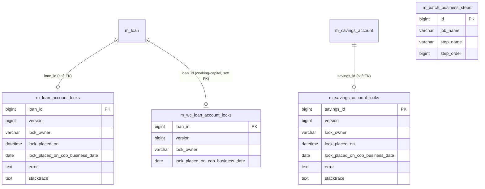

# COB & Account Lock Models

This page documents the Apache Fineract data models that support the **Cycle of Business (COB)** batch — the nightly job that advances every account by one business day (recognising accrued interest, applying overdue charges, posting recalculated schedules, processing standing instructions, etc.). To prevent the running batch from racing against online write traffic, COB takes a **lock** row per account; if the online code wants to write to a locked loan it short-circuits and queues the change, and if the batch crashes the lock row records the stack trace so the operator can re-run.

The shared infrastructure lives in `fineract-cob` under `org.apache.fineract.cob.domain`; the loan-specific lock lives in `fineract-provider`, the savings lock in `fineract-savings`, and the working-capital-loan lock in `fineract-working-capital-loan`.

## ER diagram

## Entity reference

### `AccountLock` (abstract base)

- **File:** `fineract-cob/src/main/java/org/apache/fineract/cob/domain/AccountLock.java`
- **Table:** *abstract `@MappedSuperclass` — subclasses define `@Table`*
- **Primary key:** `Long loanId` (the `loan_id` column is itself the `@Id` — there is no separate surrogate key)
- **Base class:** implements `Persistable<Long>`, `Serializable`. Provides the `@Id` on `loan_id`, the `@Version` column, and a transient `isNew` flag flipped by `@PrePersist` / `@PostLoad`.
- **Important fields:** `Long loanId` (`@Id`), `Long version` (`@Version` for optimistic locking on concurrent lock attempts), `LockOwner lockOwner` (enum, `@Enumerated(EnumType.STRING)` — values `LOAN_COB_CHUNK_PROCESSING`, `LOAN_INLINE_COB_PROCESSING`), `OffsetDateTime lockPlacedOn`, `String error`, `String stacktrace`, `LocalDate lockPlacedOnCobBusinessDate`.
- **Key relationships:** None at the JPA level — `loanId` is a soft reference to `m_loan.id` but also serves as the primary key. The CRUD logic that uses these rows is in `LockingService` / `CustomLoanAccountLockRepository`.

### `LoanAccountLock`

- **File:** `fineract-provider/src/main/java/org/apache/fineract/cob/domain/LoanAccountLock.java`
- **Table:** `m_loan_account_locks`
- **Primary key:** `loan_id` (inherited from `AccountLock`)
- **Base class:** `AccountLock`
- **Important fields:** inherits all fields from `AccountLock`. Each row marks **one** loan as held by **one** lock owner for **one** COB business date. The row is inserted by the worker before COB processes the loan and deleted on successful completion (or kept with `error`/`stacktrace` populated on failure).
- **Key relationships:** Soft FK to `m_loan` via `loan_id` (which is also the PK). `LockingService.applyLock(...)` uses the `@Version` column + the PK uniqueness to prevent concurrent lock acquisitions.

### `SavingsAccountLock`

- **File:** `fineract-savings/src/main/java/org/apache/fineract/cob/savings/SavingsAccountLock.java`
- **Table:** `m_savings_account_locks`
- **Primary key:** `savings_id` (mapped as `@Id` directly on the `savingsId` field)
- **Base class:** none — declared as a standalone JPA `@Entity` (does not extend `AccountLock`, but mirrors the same column layout).
- **Important fields:** `Long savingsId` (`@Id`), `Long version` (`@Version`), `SavingsLockOwner lockOwner` (enum analogous to `LockOwner` for the savings COB), `OffsetDateTime lockPlacedOn`, `String error`, `String stacktrace`, `LocalDate lockPlacedOnCobBusinessDate`.
- **Key relationships:** Soft FK to `m_savings_account.id` via `savings_id` (also the PK). The savings COB uses an independent lock row even though the column shape matches the loan one.

### `WorkingCapitalLoanAccountLock`

- **File:** `fineract-working-capital-loan/src/main/java/org/apache/fineract/cob/domain/WorkingCapitalLoanAccountLock.java`
- **Table:** `m_wc_loan_account_locks`
- **Primary key:** `loan_id` (inherited from `AccountLock`)
- **Base class:** `AccountLock`
- **Important fields:** inherits from `AccountLock`. Used by the working-capital-loan COB job (a separate batch with its own steps).
- **Key relationships:** Soft FK to `m_loan.id` for working-capital loan rows.

### `BatchBusinessStep`

- **File:** `fineract-cob/src/main/java/org/apache/fineract/cob/domain/BatchBusinessStep.java`
- **Table:** `m_batch_business_steps`
- **Primary key:** `Long id`
- **Base class:** `AbstractPersistableCustom<Long>`
- **Important fields:** `String jobName` (the batch job that owns the step — e.g. `LOAN_COB`, `INLINE_LOAN_COB`), `String stepName` (Spring Batch step bean name — e.g. `applyChargeToOverdueLoansStep`, `loanCOBApplyChargeForOverdueLoansBusinessStep`, `addPeriodicAccrualEntriesBusinessStep`, `applyPenaltyForOverdueLoansBusinessStep`), `Long stepOrder` (execution order inside the job).
- **Key relationships:** None at the JPA level. `BatchStepConfiguration` loads all rows whose `jobName` matches the job being defined and wires Spring Batch `Step`s in `stepOrder`. Operators can reorder, disable or remove COB steps by editing this table.

### `LockOwner` (enum)

- **File:** `fineract-cob/src/main/java/org/apache/fineract/cob/domain/LockOwner.java`
- **Values:** `LOAN_COB_CHUNK_PROCESSING`, `LOAN_INLINE_COB_PROCESSING`.
- **Usage:** Stored as the string value in `lock_owner` (`@Enumerated(EnumType.STRING)`). Each owner reflects a different stage of the loan COB:
  - `LOAN_COB_CHUNK_PROCESSING` — held by the worker chunk processing the loan during the batch run.
  - `LOAN_INLINE_COB_PROCESSING` — held when a *synchronous* online request triggers a "catch up" COB on a single loan before applying the user's change.

### `LockingService`

- **File:** `fineract-cob/src/main/java/org/apache/fineract/cob/domain/LockingService.java`
- **Role:** Spring service that wraps the lock CRUD. Methods include `applyLock(loanIds, lockOwner)`, `deleteLockByLoanIds(loanIds, lockOwner)`, `isLoanHardLocked(loanId)`. Throws `LoanAccountLockCannotBeOverruledException` on conflicting acquisitions.
- **Not an entity** — listed here because it is the only intended way to mutate the lock tables.

## How the locks are used

1. The COB scheduled job starts and pulls its step list from `m_batch_business_steps WHERE job_name = 'LOAN_COB'`.
2. The `LoanCOBPartitioner` step builds the list of loans eligible for COB; each worker thread then calls `LockingService.applyLock(loanIds, LOAN_COB_CHUNK_PROCESSING)`, inserting one row per loan in `m_loan_account_locks` with `lock_placed_on_cob_business_date = (current business date)`.
3. The worker thread then processes its chunk of loans under the held lock.
4. If a step throws, the catch handler updates the row's `error` + `stacktrace` columns (instead of deleting it) so the operator can inspect the failure.
5. On successful chunk completion the row is deleted, releasing the loan for online traffic.
6. Online write services consult `CustomLoanAccountLockRepository.findNonBypassLockedLoans(...)` before mutating a loan; if a lock row exists for the loan they reject the request (or trigger Inline COB for one-shot catch-up under owner `LOAN_INLINE_COB_PROCESSING`).

The `m_business_date` table (documented on the [portfolio shared models](/models/portfolio-shared-models) page) carries the `BUSINESS_DATE` and `COB_DATE` rows that govern which business date each lock is for and what date COB is advancing to.

## Notes & gotchas

- Locks are **per-account** and **per-owner**. A loan could in principle hold both an `INLINE_COB_PROCESSING` and a `CHUNK_PROCESSING` row, but the `@Version` column + database unique constraint prevents two writers grabbing the same owner concurrently.
- `m_wc_loan_account_locks` is structurally identical to `m_loan_account_locks` and exists only so the working-capital module can run on a different schedule without colliding.
- `SavingsAccountLock` does **not** extend `AccountLock` (despite mirroring the columns) because the savings module currently has only one lock owner enum and skips some of the loan-side optimisations.
- Cleaning out stale rows in any of these tables is safe between COB runs (no FK constraints to/from these tables); leaving an erroring row in place is how operators inspect which account broke.
