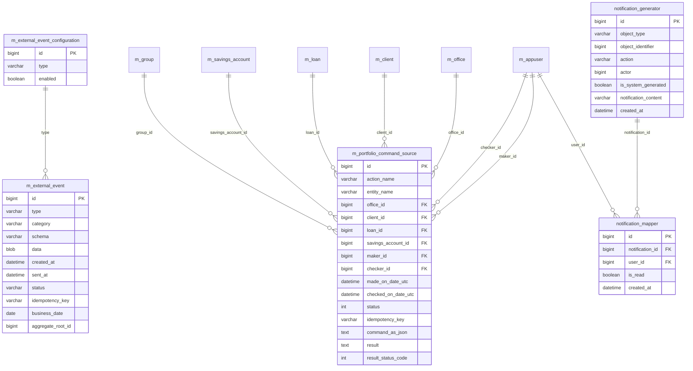

# External Event & Audit Models

This page documents the Apache Fineract data models that capture **what happened** in the system — the **external event** outbox that publishes business events to downstream consumers (typically over a message broker), the **command source** audit log that records every write API call (and supports maker-checker), and the **notification** tables that surface in-app alerts to users.

The external event and command-source entities live in `fineract-core`; the notification entities live in `fineract-provider`.

## ER diagram

## Entity reference

### `ExternalEvent`

- **File:** `fineract-core/src/main/java/org/apache/fineract/infrastructure/event/external/repository/domain/ExternalEvent.java`
- **Table:** `m_external_event`
- **Primary key:** `Long id`
- **Base class:** `AbstractPersistableCustom<Long>`
- **Important fields:** `String type` (event class name — e.g. `LoanApprovedBusinessEvent`, `LoanDisbursalBusinessEvent`, `SavingsActivateBusinessEvent`), `String category` (e.g. `Loan`, `Savings`, `Client`), `String schema` (Avro/Protobuf schema id), `byte[] data` (the serialised payload), `OffsetDateTime createdAt`, `ExternalEventStatus status` (`READY_TO_BE_SENT`, `SENT`), `OffsetDateTime sentAt`, `String idempotencyKey`, `LocalDate businessDate`, `Long aggregateRootId` (e.g. loan id, savings id) — used by `ExternalEventView` to expose the next-batch query.
- **Key relationships:** None at the JPA level — the table is a pure outbox. The `category` + `type` allow the publisher (Kafka / ActiveMQ producer) to fan out by topic, and `idempotencyKey` lets consumers deduplicate.
- **Lifecycle:** Rows are inserted by the business event publisher within the same transaction as the originating change. A scheduled job (`SendAsynchronousEventsJob`) reads `READY_TO_BE_SENT` rows in `businessDate` + `id` order, pushes them to the configured broker, and updates `status = SENT` + `sent_at`.

### `ExternalEventStatus` (enum)

- **File:** same package as `ExternalEvent`
- **Values:** `READY_TO_BE_SENT`, `SENT`.
- **Usage:** Mapped to the `status` column via `@Enumerated(EnumType.STRING)`.

### `ExternalEventConfiguration`

- **File:** `fineract-core/src/main/java/org/apache/fineract/infrastructure/event/external/repository/domain/ExternalEventConfiguration.java`
- **Table:** `m_external_event_configuration`
- **Primary key:** `Long id`
- **Base class:** plain `@Entity` (no `AbstractPersistableCustom` — defines its own `@Id` getter)
- **Important fields:** `String type` (event class name — same vocabulary as `ExternalEvent.type`), `boolean enabled`.
- **Key relationships:** Soft relationship to `ExternalEvent.type`. Each business event class checks this row before recording itself; if `enabled = false` the publisher silently drops the event. This is how operators turn off noisy events (e.g. accrual postings) without redeploying.

### `ExternalEventView` (read-only)

- **File:** `ExternalEventView.java` in the same package
- **Table:** view over `m_external_event` (or a materialized projection used by `LongPollingService`)
- **Important fields:** Mirrors `ExternalEvent` plus computed fields used by the long-polling read service that streams events to subscribers.
- **Key relationships:** Read-only; no writes.

### `CommandSource` (audit log + maker-checker)

- **File:** `fineract-core/src/main/java/org/apache/fineract/commands/domain/CommandSource.java`
- **Table:** `m_portfolio_command_source`
- **Primary key:** `Long id`
- **Base class:** `AbstractPersistableCustom<Long>`
- **Important fields:** `String actionName` (e.g. `CREATE`, `UPDATE`, `DELETE`, `APPROVE`, `DISBURSE`, `REPAYMENT`), `String entityName` (e.g. `LOAN`, `SAVINGSACCOUNT`, `CLIENT`, `GROUP`), `Long officeId`, `Long groupId`, `Long clientId`, `Long loanId`, `Long savingsId`, `String resourceGetUrl` (`api_get_url`), `Long resourceId`, `Long subResourceId`, `String commandAsJson` (the raw request body, capped at 1000 chars in some Liquibase variants), `AppUser maker`, `OffsetDateTime madeOnDate` (`made_on_date_utc`), `AppUser checker`, `OffsetDateTime checkedOnDate` (`checked_on_date_utc`), `Integer status` (`CommandProcessingResultType` — INVALID=0, PROCESSED=1, AWAITING_APPROVAL=2, REJECTED=3, UNDER_PROCESSING=4, ERROR=5), `Long productId`, `String transactionId`, `Long creditBureauId`, `Long organisationCreditBureauId`, `String jobName`, `String idempotencyKey`, `ExternalId resourceExternalId`, `ExternalId subResourceExternalId`, `String result`, `Integer resultStatusCode`, `ExternalId loanExternalId`.
- **Key relationships:** Two many-to-one to `AppUser` (`maker_id`, `checker_id`). Soft FKs to virtually every aggregate root id (`client_id`, `loan_id`, `savings_account_id`, `group_id`, `office_id`, `product_id`). One row per write API call.
- **Lifecycle:** Every write going through `CommandWriteService`/`CommandProcessingService` inserts a row. If the permission carries `can_maker_checker = true`, the row is written with `status = AWAITING_APPROVAL` and execution is deferred until a checker approves; otherwise it is written with `status = PROCESSED` (or `ERROR`) once the command finishes. The same table thus serves as both audit log *and* the maker-checker queue.

### `CommandProcessingResultType` (enum)

- **File:** `fineract-core/src/main/java/org/apache/fineract/commands/domain/CommandProcessingResultType.java`
- **Values:** `INVALID(0)`, `PROCESSED(1)`, `AWAITING_APPROVAL(2)`, `REJECTED(3)`, `UNDER_PROCESSING(4)`, `ERROR(5)`.
- **Stored as:** Integer in `m_portfolio_command_source.status`.

### `CommandWrapper` (request DTO)

- **File:** `fineract-core/src/main/java/org/apache/fineract/commands/domain/CommandWrapper.java`
- **Not persisted** — this is the in-memory record built by every API resource and passed to `CommandSourceService.processCommand(...)`. It carries the same fields that get serialised into the `CommandSource` row plus the `jsonCommand` body. Listed here because the read schema of `m_portfolio_command_source` and the wrapper shape are the same.

### Audit queries

Fineract does **not** ship a dedicated `audit_query` JPA entity. Audit queries are answered by:

- `AuditReadPlatformService` / `AuditReadPlatformServiceImpl` (`fineract-provider/.../commands/service`) running parameterised JDBC SQL against `m_portfolio_command_source`.
- Pre-defined **Pentaho/Stretchy** reports loaded into `stretchy_report` (table outside this page's scope) — those are stored procedures, not entities.

So the audit "model" surface is the `CommandSource` table; everything else is read-side SQL.

### `Notification`

- **File:** `fineract-provider/src/main/java/org/apache/fineract/notification/domain/Notification.java`
- **Table:** `notification_generator`
- **Primary key:** `Long id`
- **Base class:** `AbstractPersistableCustom<Long>`
- **Important fields:** `String objectType` (e.g. `LOAN`, `CLIENT`, `SAVINGSACCOUNT`), `Long objectIdentifier` (id of the aggregate), `String action` (e.g. `created`, `approved`, `rejected`, `disbursed`), `Long actorId` (the `AppUser.id` that caused the event, nullable for system events), `boolean isSystemGenerated`, `String notificationContent`, `LocalDateTime createdAt`.
- **Key relationships:** Soft FK on `actorId` to `m_appuser`. One-to-many fan-out to `NotificationMapper` rows (one per recipient).

### `NotificationMapper`

- **File:** `fineract-provider/src/main/java/org/apache/fineract/notification/domain/NotificationMapper.java`
- **Table:** `notification_mapper`
- **Primary key:** `Long id`
- **Base class:** `AbstractPersistableCustom<Long>`
- **Important fields:** `Notification notification`, `AppUser userId` (the recipient), `boolean isRead`, `LocalDateTime createdAt`.
- **Key relationships:** Many-to-one to `Notification` and to `AppUser`. The notification fan-out service inserts one mapper row per user whose role has the matching permission, allowing each user to mark read independently.

## Relationship to business events

The internal `BusinessEvent` types (defined under `org.apache.fineract.infrastructure.event.business.domain` in `fineract-provider` — e.g. `LoanApprovedBusinessEvent`, `ClientCreatedBusinessEvent`, `SavingsActivateBusinessEvent`) are dispatched in-process by `BusinessEventNotifierService`. Two listeners pick them up:

1. **`ExternalEventService`** — checks `m_external_event_configuration.enabled` for the event type and, if enabled, inserts an `m_external_event` row.
2. **`NotificationEventListener`** — inserts a `notification_generator` row and one `notification_mapper` row per subscribed user.

Both inserts happen inside the same database transaction as the originating change, providing transactional outbox semantics.

## Notes & gotchas

- `m_external_event.data` is a binary blob (the serialised payload — typically Avro or Protobuf). Schema versioning is tracked in the `schema` column.
- `m_external_event.idempotency_key` is unique-enforced; a retried publish results in the same key, letting the consumer deduplicate.
- `m_portfolio_command_source.command_as_json` is the full request body of the write API call — useful for replay and incident forensics but also a sensitive surface (some deployments redact PII via an interceptor).
- The `_utc` suffix on `made_on_date_utc` / `checked_on_date_utc` columns reflects the migration from `LocalDateTime` to `OffsetDateTime` (UTC) — the commented-out legacy columns are still visible in the source.
- Notifications use `LocalDateTime` (not UTC `OffsetDateTime`), so when running across regions you may see clock-skewed `created_at` values in the UI.
- The notification subsystem is opt-in; if your deployment does not enable the notification listener bean, the `notification_*` tables stay empty (the maker-checker and external event tables continue to populate).
