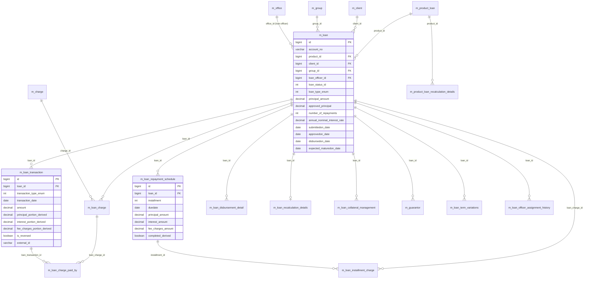

# Loan & Loan Product Models

This page documents the Apache Fineract data models that implement the **lending** bounded context — the `Loan` aggregate root and the `LoanProduct` from which it is created, plus the schedule, transaction, charge, collateral and guarantor children that orbit them. The aggregate is large: a single `Loan` row owns several one-to-many child collections and is the most heavily annotated entity in the codebase.

These entities live in the `fineract-loan` module under `org.apache.fineract.portfolio.loanaccount.domain` and `portfolio.loanproduct.domain`. The `Guarantor` aggregate is in `fineract-provider`.

## ER diagram

## Entity reference

### `Loan` (aggregate root)

- **File:** `fineract-loan/src/main/java/org/apache/fineract/portfolio/loanaccount/domain/Loan.java`
- **Table:** `m_loan` (unique `account_no`, unique `external_id`)
- **Primary key:** `Long id`
- **Base class:** `AbstractAuditableWithUTCDateTimeCustom<Long>`
- **Important fields:** `String accountNumber`, `ExternalId externalId`, `LoanProduct loanProduct`, `Client client`, `Group group`, `Staff loanOfficer`, `Fund fund`, `LoanPurpose loanPurpose` (CodeValue), `Integer loanStatus` (`LoanStatus`), `Integer loanType` (`AccountType`), `Integer subStatus` (`LoanSubStatus`), `BigDecimal approvedPrincipal`, `Integer termFrequency`, `Integer termPeriodFrequencyType`, `Integer numberOfRepayments`, `Integer repaymentEvery`, `Integer repaymentPeriodFrequencyType`, `BigDecimal annualNominalInterestRate`, `LocalDate submittedOnDate`, `LocalDate approvedOnDate`, `LocalDate expectedDisbursementDate`, `LocalDate actualDisbursementDate`, `LocalDate closedOnDate`, `LoanSummary summary` (embedded), `LoanProductRelatedDetail loanRepaymentScheduleDetail` (embedded), `LoanInterestRecalculationDetails loanInterestRecalculationDetails`, `List<LoanRepaymentScheduleInstallment> repaymentScheduleInstallments`, `List<LoanTransaction> loanTransactions`, `Set<LoanCharge> charges`, `List<LoanDisbursementDetails> disbursementDetails`, `Set<LoanCollateralManagement> loanCollateralManagements`, `List<LoanTermVariations> loanTermVariations`.
- **Key relationships:** Many-to-one to `LoanProduct`, `Client` *or* `Group`, `Office`, `Staff`, `Fund`. One-to-many cascades to all schedule/transaction/charge/disbursement/collateral/variation children.

### `LoanProduct`

- **File:** `fineract-loan/src/main/java/org/apache/fineract/portfolio/loanproduct/domain/LoanProduct.java`
- **Table:** `m_product_loan` (unique `name`, unique `short_name`)
- **Primary key:** `Long id`
- **Base class:** `AbstractPersistableCustom<Long>`
- **Important fields:** `String name`, `String shortName`, `String description`, `Fund fund`, `LoanTransactionProcessingStrategy transactionProcessingStrategy`, `LoanProductRelatedDetail loanProductRelatedDetail` (embedded — principal, interest, term defaults, amortization, interest type), `LoanProductMinMaxConstraints loanProductMinMaxConstraints`, `LoanProductTrancheDetails loanProductTrancheDetails`, `LoanProductInterestRecalculationDetails productInterestRecalculationDetails`, `LoanProductGuaranteeDetails loanProductGuaranteeDetails`, `LoanProductConfigurableAttributes loanConfigurableAttributes`, `Set<Charge> charges`, `Set<Rate> rates`, `Set<LoanProductBorrowerCycleVariations> borrowerCycleVariations`, `List<LoanProductPaymentAllocationRule> paymentAllocationRules`, `List<LoanProductCreditAllocationRule> creditAllocationRules`, `LocalDate startDate`, `LocalDate closeDate`, `boolean useBorrowerCycle`, `boolean includeInBorrowerCycle`.
- **Key relationships:** Many-to-many to `Charge` via `m_product_loan_charge`, to `Rate` via `m_product_loan_rate`. Many-to-one to `Fund` and `LoanTransactionProcessingStrategy`.

### `LoanRepaymentScheduleInstallment`

- **File:** `fineract-loan/src/main/java/org/apache/fineract/portfolio/loanaccount/domain/LoanRepaymentScheduleInstallment.java`
- **Table:** `m_loan_repayment_schedule`
- **Primary key:** `Long id`
- **Base class:** `AbstractAuditableWithUTCDateTimeCustom<Long>`
- **Important fields:** `Loan loan`, `Integer installmentNumber`, `LocalDate fromDate`, `LocalDate dueDate`, `BigDecimal principal`, `BigDecimal principalCompleted`, `BigDecimal principalWrittenOff`, `BigDecimal interestCharged`, `BigDecimal interestPaid`, `BigDecimal interestWaived`, `BigDecimal feeChargesCharged`, `BigDecimal penaltyChargesCharged`, `boolean obligationsMet`, `LocalDate obligationsMetOnDate`, `boolean recalculatedInterestComponent`, `Set<LoanInstallmentCharge> installmentCharges`, `Set<LoanInterestRecalcualtionAdditionalDetails> loanCompoundingDetails`.
- **Key relationships:** Many-to-one to `Loan`. One-to-many to `LoanInstallmentCharge`. The `*Paid`/`*WrittenOff`/`*Waived` columns are mutated by `LoanRepaymentScheduleTransactionProcessor` implementations.

### `LoanTransaction`

- **File:** `fineract-loan/src/main/java/org/apache/fineract/portfolio/loanaccount/domain/LoanTransaction.java`
- **Table:** `m_loan_transaction` (unique `external_id`)
- **Primary key:** `Long id`
- **Base class:** `AbstractAuditableWithUTCDateTimeCustom<Long>`
- **Important fields:** `Loan loan`, `Office office`, `PaymentDetail paymentDetail`, `Integer typeOf` (`LoanTransactionType` converter), `LocalDate dateOf`, `LocalDate submittedOnDate`, `BigDecimal amount`, `BigDecimal principalPortion`, `BigDecimal interestPortion`, `BigDecimal feeChargesPortion`, `BigDecimal penaltyChargesPortion`, `BigDecimal overPaymentPortion`, `BigDecimal unrecognizedIncomePortion`, `BigDecimal outstandingLoanBalance`, `boolean reversed`, `LocalDate reversedOnDate`, `ExternalId externalId`, `AppUser appUser`, `Set<LoanChargePaidBy> loanChargesPaid`, `Set<LoanTransactionToRepaymentScheduleMapping> loanTransactionToRepaymentScheduleMappings`, `Set<LoanTransactionRelation> loanTransactionRelations`.
- **Key relationships:** Many-to-one to `Loan`, `Office`, `PaymentDetail`, `AppUser`. One-to-many to `LoanChargePaidBy`, `LoanTransactionToRepaymentScheduleMapping`, `LoanTransactionRelation` (chargeback/reversal links).

### `LoanCharge`

- **File:** `fineract-loan/src/main/java/org/apache/fineract/portfolio/loanaccount/domain/LoanCharge.java`
- **Table:** `m_loan_charge` (unique `external_id`)
- **Primary key:** `Long id`
- **Base class:** `AbstractAuditableWithUTCDateTimeCustom<Long>`
- **Important fields:** `Loan loan`, `Charge charge`, `Integer chargeTime`, `Integer chargeCalculation`, `Integer chargePaymentMode`, `BigDecimal percentage`, `BigDecimal amountPercentageAppliedTo`, `BigDecimal amount`, `BigDecimal amountPaid`, `BigDecimal amountWaived`, `BigDecimal amountWrittenOff`, `BigDecimal amountOutstanding`, `LocalDate dueDate`, `LocalDate submittedOnDate`, `boolean paid`, `boolean waived`, `boolean active`, `Set<LoanInstallmentCharge> loanInstallmentCharge`, `Set<LoanChargePaidBy> loanChargePaidBySet`, `Set<LoanTrancheDisbursementCharge> loanTrancheDisbursementCharge`, `Set<LoanChargeTaxDetails> taxDetails`.
- **Key relationships:** Many-to-one to `Loan` and `Charge` (catalog). One-to-many to per-installment splits and tax components.

### `LoanChargePaidBy`

- **File:** `fineract-loan/src/main/java/org/apache/fineract/portfolio/loanaccount/domain/LoanChargePaidBy.java`
- **Table:** `m_loan_charge_paid_by`
- **Primary key:** `Long id`
- **Base class:** `AbstractPersistableCustom<Long>`
- **Important fields:** `LoanTransaction loanTransaction`, `LoanCharge loanCharge`, `BigDecimal amount`, `Integer installmentNumber`.
- **Key relationships:** Many-to-one to both `LoanTransaction` and `LoanCharge`. Resolves which portion of which charge a transaction paid.

### `LoanDisbursementDetails`

- **File:** `fineract-loan/src/main/java/org/apache/fineract/portfolio/loanaccount/domain/LoanDisbursementDetails.java`
- **Table:** `m_loan_disbursement_detail`
- **Primary key:** `Long id`
- **Base class:** `AbstractPersistableCustom<Long>`
- **Important fields:** `Loan loan`, `LocalDate expectedDisburseDate`, `LocalDate actualDisbursementDate`, `BigDecimal principal`, `BigDecimal netDisbursalAmount`, `LocalDate disbursementDate`, `String loanChargeTimeType`.
- **Key relationships:** Many-to-one to `Loan`. Models a single tranche of a multi-tranche disbursement.

### `LoanInterestRecalculationDetails`

- **File:** `fineract-loan/src/main/java/org/apache/fineract/portfolio/loanaccount/domain/LoanInterestRecalculationDetails.java`
- **Table:** `m_loan_recalculation_details`
- **Primary key:** `Long id`
- **Base class:** `AbstractPersistableCustom<Long>`
- **Important fields:** `Loan loan`, `Integer compoundingMethod` (`InterestRecalculationCompoundingMethod`), `Integer rescheduleStrategyMethod` (`LoanRescheduleStrategyMethod`), `Integer restFrequencyType`, `Integer restInterval`, `LocalDate restFrequencyDate`, `Integer compoundingFrequencyType`, `Integer compoundingInterval`, `LocalDate compoundingFrequencyDate`, `boolean isCompoundingToBePostedAsTransaction`, `boolean allowCompoundingOnEod`.
- **Key relationships:** One-to-one with `Loan` (back-reference `loan.loanInterestRecalculationDetails`).

### `LoanCollateralManagement`

- **File:** `fineract-loan/src/main/java/org/apache/fineract/portfolio/loanaccount/domain/LoanCollateralManagement.java`
- **Table:** `m_loan_collateral_management`
- **Primary key:** `Long id`
- **Base class:** `AbstractPersistableCustom<Long>`
- **Important fields:** `Loan loan`, `ClientCollateralManagement clientCollateralManagement`, `BigDecimal quantity`.
- **Key relationships:** Many-to-one to `Loan` and to `ClientCollateralManagement` (which itself references the client's collateral product). Represents collateral pledged for *this* loan.

### `Guarantor`

- **File:** `fineract-provider/src/main/java/org/apache/fineract/portfolio/loanaccount/guarantor/domain/Guarantor.java`
- **Table:** `m_guarantor`
- **Primary key:** `Long id`
- **Base class:** `AbstractPersistableCustom<Long>`
- **Important fields:** `Loan loan`, `Integer clientRelationshipTypeId` (CodeValue id), `Integer gurantorType` (CUSTOMER / STAFF / EXTERNAL), `Long entityId` (Client or Staff id), `String firstname`, `String lastname`, `String dob`, `String addressLine1`, `String mobileNumber`, `boolean active`, `List<GuarantorFundingDetails> guarantorFundDetails`.
- **Key relationships:** Many-to-one to `Loan`. One-to-many to `GuarantorFundingDetails` (which links to a `SavingsAccount` for self-guarantee holds).

### `LoanInstallmentCharge`

- **File:** `fineract-loan/src/main/java/org/apache/fineract/portfolio/loanaccount/domain/LoanInstallmentCharge.java`
- **Table:** `m_loan_installment_charge`
- **Primary key:** `Long id`
- **Base class:** `AbstractPersistableCustom<Long>`, implements `Comparable<LoanInstallmentCharge>`
- **Important fields:** `LoanCharge loanCharge`, `LoanRepaymentScheduleInstallment installment`, `BigDecimal amount`, `BigDecimal amountPaid`, `BigDecimal amountWaived`, `BigDecimal amountWrittenOff`, `BigDecimal amountOutstanding`, `boolean paid`, `boolean waived`.
- **Key relationships:** Many-to-one to `LoanCharge` and `LoanRepaymentScheduleInstallment`. Splits an installment-spread charge into per-installment buckets.

### `LoanArrearsAgeing` (table)

The arrears ageing figures live in the `m_loan_arrears_aging` table, populated by the scheduled job in `fineract-loan/src/main/java/org/apache/fineract/portfolio/loanaccount/jobs/updateloanarrearsageing/`. There is **no JPA entity** — the job uses raw SQL `INSERT … SELECT …` to refresh the per-loan row containing `total_overdue_derived`, `principal_overdue_derived`, `interest_overdue_derived`, `fee_charges_overdue_derived`, `penalty_charges_overdue_derived`, `overdue_since_date_derived`. The `Loan` aggregate exposes this via `LoanSummary` and read-platform DTOs.

### `LoanOfficerAssignmentHistory` (related)

- **File:** `fineract-loan/src/main/java/org/apache/fineract/portfolio/loanaccount/domain/LoanOfficerAssignmentHistory.java`
- **Table:** `m_loan_officer_assignment_history`
- **Base class:** `AbstractAuditableCustom`
- **Important fields:** `Loan loan`, `Staff loanOfficer`, `LocalDate startDate`, `LocalDate endDate`.

### `LoanTermVariations` (related)

- **File:** `fineract-loan/src/main/java/org/apache/fineract/portfolio/loanaccount/domain/LoanTermVariations.java`
- **Table:** `m_loan_term_variations`
- **Base class:** `AbstractAuditableWithUTCDateTimeCustom<Long>`
- **Important fields:** `Loan loan`, `Integer termType` (`LoanTermVariationType` — DUE_DATE, EMI_AMOUNT, INTEREST_RATE, PRINCIPAL_AMOUNT, EXTEND_REPAYMENT_PERIOD, GRACE_ON_INTEREST, GRACE_ON_PRINCIPAL, INSERT_INSTALLMENT, DELETE_INSTALLMENT), `LocalDate termApplicableFrom`, `BigDecimal decimalValue`, `LocalDate dateValue`, `boolean isSpecificToInstallment`.

## Lifecycle & status notes

`LoanStatus` (in `LoanStatusConverter`): SUBMITTED_AND_PENDING_APPROVAL (100), APPROVED (200), ACTIVE (300), TRANSFER_IN_PROGRESS (303), TRANSFER_ON_HOLD (304), WITHDRAWN_BY_CLIENT (400), REJECTED (500), CLOSED_OBLIGATIONS_MET (600), CLOSED_WRITTEN_OFF (601), CLOSED_RESCHEDULE_OUTSTANDING_AMOUNT (602), OVERPAID (700).

`LoanTransactionType`: DISBURSEMENT (1), REPAYMENT (2), CONTRA (3), WAIVE_INTEREST (4), REPAYMENT_AT_DISBURSEMENT (5), WRITEOFF (6), MARKED_FOR_RESCHEDULING (7), RECOVERY_REPAYMENT (8), WAIVE_CHARGES (9), ACCRUAL (10), INITIATE_TRANSFER (12), APPROVE_TRANSFER (13), WITHDRAW_TRANSFER (14), REJECT_TRANSFER (15), REFUND (16), CHARGE_PAYMENT (17), REFUND_FOR_ACTIVE_LOAN (18), INCOME_POSTING (19), CREDIT_BALANCE_REFUND (20), MERCHANT_ISSUED_REFUND (21), PAYOUT_REFUND (22), GOODWILL_CREDIT (23), CHARGE_REFUND (24), CHARGEBACK (25), CHARGE_ADJUSTMENT (26), CHARGE_OFF (27), DOWN_PAYMENT (28), REAGE (29), REAMORTIZE (30), INTEREST_PAYMENT_WAIVER (31), ACCRUAL_ACTIVITY (32), INTEREST_REFUND (33), CAPITALIZED_INCOME (34), CAPITALIZED_INCOME_AMORTIZATION (35), CAPITALIZED_INCOME_ADJUSTMENT (36), BUY_DOWN_FEE (37), BUY_DOWN_FEE_AMORTIZATION (38), BUY_DOWN_FEE_ADJUSTMENT (39).

The state machine is implemented in `DefaultLoanLifecycleStateMachine` and reacts to events in `LoanEvent`.
