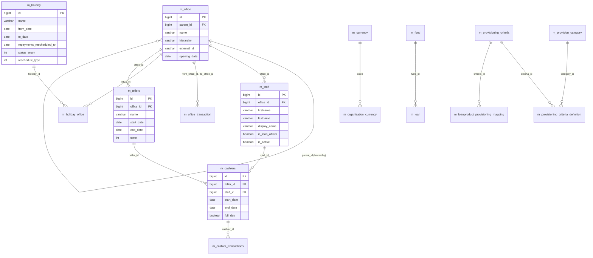

# Organisation Models

This page documents the Apache Fineract data models for the **organisational backbone** of a Fineract instance: the office hierarchy that every entity hangs off, the staff who own clients and loans, the holiday and working-days calendars that adjust repayment schedules, the application currency catalog, the funds that loans draw against, the tellers and cashiers that handle physical cash, and the provisioning configuration that drives loan-loss reserving.

Entities live in `fineract-core` (`organisation.office`, `organisation.staff`, `organisation.holiday`, `organisation.workingdays`, `organisation.monetary`), `fineract-branch` (teller/cashier) and `fineract-provider` (provisioning, `OfficeTransaction`).

## ER diagram

## Entity reference

### `Office`

- **File:** `fineract-core/src/main/java/org/apache/fineract/organisation/office/domain/Office.java`
- **Table:** `m_office` (unique `name`, unique `external_id`)
- **Primary key:** `Long id`
- **Base class:** `AbstractPersistableCustom<Long>`, implements `Serializable`
- **Important fields:** `Office parent`, `String name`, `String nameDecorated`, `ExternalId externalId`, `LocalDate openingDate`, `String hierarchy` (denormalised path like `.1.2.5.`), `Set<Office> children`.
- **Key relationships:** Self-referential tree (head office at the top, branches below). The `hierarchy` column lets the read platform do prefix queries (`WHERE hierarchy LIKE '.1.%'`).

### `OfficeTransaction`

- **File:** `fineract-provider/src/main/java/org/apache/fineract/organisation/office/domain/OfficeTransaction.java`
- **Table:** `m_office_transaction`
- **Primary key:** `Long id`
- **Base class:** `AbstractPersistableCustom<Long>`
- **Important fields:** `Office from`, `Office to`, `LocalDate transactionDate`, `MonetaryCurrency currency` (embedded), `BigDecimal transactionAmount`, `String description`.
- **Key relationships:** Two many-to-one references to `Office`. Used for inter-office cash transfers (paired with journal entries to the `ASSET_TRANSFER`/`LIABILITY_TRANSFER` financial activity GL accounts).

### `Staff`

- **File:** `fineract-core/src/main/java/org/apache/fineract/organisation/staff/domain/Staff.java`
- **Table:** `m_staff` (unique `display_name`, unique `external_id`, unique `mobile_no`)
- **Primary key:** `Long id`
- **Base class:** `AbstractPersistableCustom<Long>`
- **Important fields:** `Office office`, `String firstname`, `String lastname`, `String displayName`, `String mobileNumber`, `ExternalId externalId`, `Long organisationalRoleType` (`StaffOrganisationalRoleType`), `Staff organisationalRoleParentStaff`, `boolean loanOfficer`, `boolean active`, `LocalDate joiningDate`, `Long imageId`.
- **Key relationships:** Many-to-one to `Office`. Self-reference for reporting line. Referenced by `Loan.loanOfficer`, `SavingsAccount.savingsOfficer`, `Client.staff`, `Group.staff`, `LoanOfficerAssignmentHistory`, `StaffAssignmentHistory`, `Cashier`.

### `StaffAssignmentHistory` (group)

- **File:** `fineract-core/src/main/java/org/apache/fineract/portfolio/group/domain/StaffAssignmentHistory.java`
- **Table:** `m_staff_assignment_history`
- **Primary key:** `Long id`
- **Base class:** `AbstractAuditableCustom`
- **Important fields:** `Group centerOrGroup`, `Staff staff`, `LocalDate startDate`, `LocalDate endDate`.
- **Key relationships:** Track which staff member owned a group/center across time windows.

### `Holiday`

- **File:** `fineract-core/src/main/java/org/apache/fineract/organisation/holiday/domain/Holiday.java`
- **Table:** `m_holiday` (unique `name`)
- **Primary key:** `Long id`
- **Base class:** `AbstractPersistableCustom<Long>`
- **Important fields:** `String name`, `LocalDate fromDate`, `LocalDate toDate`, `LocalDate repaymentsRescheduledTo`, `Integer status` (`HolidayStatusType`), `Integer reschedulingType` (`RescheduleType` — RESCHEDULE_TO_SPECIFIC_DATE=1, RESCHEDULE_TO_NEXT_REPAYMENT_DATE=2), `String description`, `Set<Office> offices`.
- **Key relationships:** Many-to-many to `Office` via `m_holiday_office`. The loan repayment scheduler shifts dues that fall in `[fromDate, toDate]` according to `reschedulingType`.

### `WorkingDays`

- **File:** `fineract-core/src/main/java/org/apache/fineract/organisation/workingdays/domain/WorkingDays.java`
- **Table:** `m_working_days`
- **Primary key:** `Long id`
- **Base class:** `AbstractPersistableCustom<Long>`
- **Important fields:** `String recurrence` (RRULE-like, e.g. `FREQ=WEEKLY;INTERVAL=1;BYDAY=MO,TU,WE,TH,FR`), `Integer repaymentReschedulingType` (`RepaymentRescheduleType` — SAME_DAY=1, MOVE_TO_NEXT_WORKING_DAY=2, MOVE_TO_NEXT_REPAYMENT_MEETING_DAY=3, MOVE_TO_PREVIOUS_WORKING_DAY=4), `Boolean extendTermForDailyRepayments`.
- **Key relationships:** Singleton (one row per tenant). Consulted by the loan and savings schedulers to skip non-working days.

### `ApplicationCurrency`

- **File:** `fineract-core/src/main/java/org/apache/fineract/organisation/monetary/domain/ApplicationCurrency.java`
- **Table:** `m_currency`
- **Primary key:** `Long id`
- **Base class:** `AbstractPersistableCustom<Long>`
- **Important fields:** `String code` (ISO 4217 — USD, EUR, INR, ...), `String name`, `Integer decimalPlaces`, `Integer inMultiplesOf`, `String displaySymbol`, `String nameCode`, `String internationalName`.
- **Key relationships:** Catalog of all currencies known to the deployment. The subset *permitted* per tenant lives in `m_organisation_currency`.

### `OrganisationCurrency`

- **File:** `fineract-core/src/main/java/org/apache/fineract/organisation/monetary/domain/OrganisationCurrency.java`
- **Table:** `m_organisation_currency`
- **Primary key:** `Long id`
- **Important fields:** `String code`, `String name`, `Integer decimalPlaces`, `Integer inMultiplesOf`, `String nameCode`, `String displaySymbol`, `String internationalName`.
- **Key relationships:** The whitelist of currencies the tenant has enabled. Products and accounts must use a code that is in this table.

### `MonetaryCurrency` (value object)

- **File:** `fineract-core/src/main/java/org/apache/fineract/organisation/monetary/domain/MonetaryCurrency.java`
- **Table:** *embedded* (no own table)
- **Primary key:** *N/A*
- **Important fields:** `String code`, `Integer digitsAfterDecimal`, `Integer inMultiplesOf`.
- **Key relationships:** Embedded into every money-bearing entity (`Loan`, `LoanProduct`, `LoanTransaction`, `SavingsAccount`, `SavingsProduct`, `SavingsAccountTransaction`, `OfficeTransaction`, ...) via `@Embedded`. Avoids a JOIN on `m_currency` for every read.

### `Fund`

- **File:** `fineract-core/src/main/java/org/apache/fineract/portfolio/fund/domain/Fund.java`
- **Table:** `m_fund` (unique `name`, unique `external_id`)
- **Primary key:** `Long id`
- **Base class:** `AbstractPersistableCustom<Long>`
- **Important fields:** `String name`, `String externalId`.
- **Key relationships:** Referenced by `Loan.fund` and `LoanProduct.fund`. Lets the institution track which source of funds backed a given loan portfolio.

### `Teller`

- **File:** `fineract-branch/src/main/java/org/apache/fineract/organisation/teller/domain/Teller.java`
- **Table:** `m_tellers` (unique `name`)
- **Primary key:** `Long id`
- **Base class:** `AbstractPersistableCustom<Long>`
- **Important fields:** `Office office`, `String name`, `String description`, `LocalDate startDate`, `LocalDate endDate`, `Integer state` (`TellerStatus` — ACTIVE=300, INACTIVE=400, CLOSED=600).
- **Key relationships:** Many-to-one to `Office`. One-to-many to `Cashier`.

### `Cashier`

- **File:** `fineract-branch/src/main/java/org/apache/fineract/organisation/teller/domain/Cashier.java`
- **Table:** `m_cashiers`
- **Primary key:** `Long id`
- **Base class:** `AbstractPersistableCustom<Long>`
- **Important fields:** `Teller teller`, `Staff staff`, `String description`, `LocalDate startDate`, `LocalDate endDate`, `boolean isFullDay`, `String startTime`, `String endTime`.
- **Key relationships:** Many-to-one to `Teller` and `Staff`. One-to-many to `CashierTransaction`.

### `CashierTransaction`

- **File:** `fineract-branch/src/main/java/org/apache/fineract/organisation/teller/domain/CashierTransaction.java`
- **Table:** `m_cashier_transactions`
- **Primary key:** `Long id`
- **Base class:** `AbstractPersistableCustom<Long>`
- **Important fields:** `Cashier cashier`, `Integer txnType` (`CashierTxnType` — ALLOCATE=101, SETTLE=102, INWARD_CASH_TXN=103, OUTWARD_CASH_TXN=104), `BigDecimal txnAmount`, `LocalDate txnDate`, `String entityType`, `Long entityId`, `String txnNote`, `String currencyCode`.
- **Key relationships:** Many-to-one to `Cashier`. Drives reconciliation between cashier and main vault via the `CASH_AT_TELLER` / `CASH_AT_MAIN_VAULT` financial activity GL accounts.

### `ProvisioningCategory`

- **File:** `fineract-provider/src/main/java/org/apache/fineract/organisation/provisioning/domain/ProvisioningCategory.java`
- **Table:** `m_provision_category` (unique `category_name`)
- **Primary key:** `Long id`
- **Base class:** `AbstractPersistableCustom<Long>`
- **Important fields:** `String categoryName`, `String description`.
- **Key relationships:** Catalog of provisioning buckets (e.g. STANDARD, SUB_STANDARD, DOUBTFUL, LOSS). Referenced from `ProvisioningCriteriaDefinition`.

### `ProvisioningCriteria`

- **File:** `fineract-provider/src/main/java/org/apache/fineract/organisation/provisioning/domain/ProvisioningCriteria.java`
- **Table:** `m_provisioning_criteria` (unique `criteria_name`)
- **Primary key:** `Long id`
- **Base class:** `AbstractAuditableCustom`
- **Important fields:** `String criteriaName`, `Set<LoanProductProvisionCriteria> loanProductMapping`, `List<ProvisioningCriteriaDefinition> provisioningCriteriaDefinitions`.
- **Key relationships:** One-to-many to `ProvisioningCriteriaDefinition` (which holds `category`, `minAge`, `maxAge`, `provisioningPercentage`, `liabilityAccount`, `expenseAccount`). Many-to-many to `LoanProduct` via `LoanProductProvisionCriteria`. Used by the loan-provisioning scheduled job to compute reserves.

### `ProvisioningCriteriaDefinition`

- **File:** `fineract-provider/src/main/java/org/apache/fineract/organisation/provisioning/domain/ProvisioningCriteriaDefinition.java`
- **Table:** `m_provisioning_criteria_definition`
- **Primary key:** `Long id`
- **Important fields:** `ProvisioningCriteria criteria`, `ProvisioningCategory provisioningCategory`, `Long minAge`, `Long maxAge`, `BigDecimal provisioningPercentage`, `GLAccount liabilityAccount`, `GLAccount expenseAccount`.
- **Key relationships:** Many-to-one to `ProvisioningCriteria`, `ProvisioningCategory`, and two `GLAccount`s. Produces journal entries in `ProvisioningJournalEntries` when the job runs.

## Lifecycle & status notes

- **`Office.hierarchy`** is rebuilt by `Office.generateHierarchy()` whenever the parent changes; it is a denormalisation of the tree path to allow indexed `LIKE` queries.
- **`HolidayStatusType`** — PENDING_FOR_ACTIVATION=100, ACTIVE=300, DELETED=600. A holiday only affects schedules once it is ACTIVE.
- **`WorkingDays.repaymentReschedulingType`** is consulted *after* the holiday check; together they determine the final due date for an installment.
- **`Cashier.endDate`** + `Cashier.endTime` close out the cashier; settling pushes the cash balance back to the teller via `CashierTxnType.SETTLE`.
- **Provisioning** is read-only against the loan portfolio — the criteria definitions produce a snapshot row per loan in `m_loanproduct_provisioning_entry` plus the GL postings.
