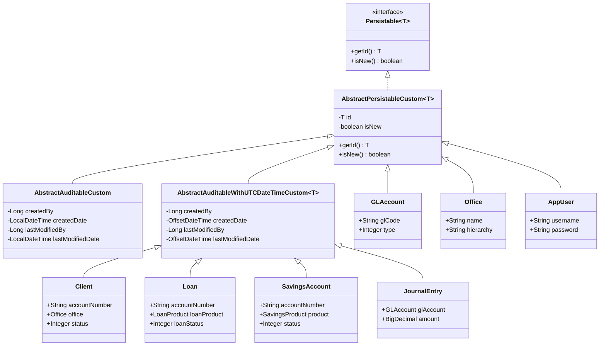

# Domain Model Overview

This page introduces the conventions that all Apache Fineract data models follow. Fineract's persistence layer is built on JPA (Jakarta Persistence) with Hibernate, and every business entity (clients, loans, savings, GL accounts, users, offices, etc.) inherits from one of a small number of mapped superclasses. Understanding those base classes and the naming conventions is essential before reading the per-module entity reference pages.

The relational schema is generated and migrated with Liquibase. Tables for portfolio, organisation, infrastructure and user administration use the `m_` prefix (for example `m_client`, `m_loan`, `m_office`, `m_appuser`, `m_payment_detail`, `m_savings_account`). Accounting tables use the `acc_` prefix (`acc_gl_account`, `acc_gl_journal_entry`, `acc_gl_closure`, `acc_accounting_rule`). Notification and a handful of infrastructure tables use other prefixes (for example `notification_generator`, `notification_mapper`). Throughout these wiki pages the source file paths reference the Gradle module that owns the entity — `fineract-core`, `fineract-loan`, `fineract-savings`, `fineract-accounting`, `fineract-tax`, `fineract-charge`, `fineract-rates`, `fineract-cob`, `fineract-branch`, `fineract-working-capital-loan` and `fineract-provider`.

## Base class hierarchy

Almost every entity ultimately extends `AbstractPersistableCustom<Long>`. Entities that need audit columns (createdBy, createdDate, lastModifiedBy, lastModifiedDate) extend `AbstractAuditableCustom` (LocalDateTime) or `AbstractAuditableWithUTCDateTimeCustom<Long>` (UTC `OffsetDateTime`). Both base classes live in `fineract-core` under `org.apache.fineract.infrastructure.core.domain`.



## Base classes in detail

The two superclasses are short and worth reading inline.

### AbstractPersistableCustom

File: `fineract-core/src/main/java/org/apache/fineract/infrastructure/core/domain/AbstractPersistableCustom.java`

```java
@MappedSuperclass
public abstract class AbstractPersistableCustom<T extends Serializable>
        implements Persistable<T>, Serializable {

    @Id
    @GeneratedValue(strategy = GenerationType.IDENTITY)
    private T id;

    @Transient
    private boolean isNew = true;

    @PrePersist
    @PostLoad
    void markNotNew() { this.isNew = false; }
}
```

Key points:

- The `id` column uses `GenerationType.IDENTITY` — the database (MariaDB/MySQL/PostgreSQL) assigns the primary key on insert.
- Equality and hashCode are intentionally **not** implemented in the base class. Entities are compared by reference unless they override `equals`/`hashCode` themselves. The Javadoc notes this was a workaround for OpenJPA issues.
- `isNew` is a transient flag flipped to `false` on first `@PrePersist` or `@PostLoad`, which Spring Data uses to decide between `persist` and `merge`.

### AbstractAuditableCustom

File: `fineract-core/src/main/java/org/apache/fineract/infrastructure/core/domain/AbstractAuditableCustom.java`

```java
@MappedSuperclass
public abstract class AbstractAuditableCustom
        extends AbstractPersistableCustom<Long>
        implements Auditable<Long, Long, LocalDateTime> {

    @Column(name = "createdby_id")
    private Long createdBy;

    @Column(name = "created_date")
    private LocalDateTime createdDate;

    @Column(name = "lastmodifiedby_id")
    private Long lastModifiedBy;

    @Column(name = "lastmodified_date")
    private LocalDateTime lastModifiedDate;
    // getters/setters returning Optional<>
}
```

The columns are populated by Spring Data JPA auditing (`@EnableJpaAuditing` + `AuditorAware<Long>` returning the currently authenticated `AppUser` id). Note the lowercase, non-standard column names — `createdby_id` and `lastmodifiedby_id` — which the custom subclass exists specifically to override.

### AbstractAuditableWithUTCDateTimeCustom

A sibling base class (same package) that uses `OffsetDateTime` in UTC instead of local `LocalDateTime`. It is the preferred base for new entities (`Client`, `Loan`, `LoanTransaction`, `LoanCharge`, `LoanRepaymentScheduleInstallment`, `JournalEntry`, `SavingsAccount`, `SavingsAccountTransaction`, `SavingsAccountCharge`, `Note`, `Calendar`, `FloatingRate`, `FloatingRatePeriod`, `BusinessDate`, `LoanTermVariations`, `ClientIdentifier`, ...). Existing entities that historically used `AbstractAuditableCustom` (`GLClosure`, `Rate`, `TaxComponent`, `TaxGroup`, `ProvisioningCriteria`, `StaffAssignmentHistory`, `LoanOfficerAssignmentHistory`) have not all been migrated.

## Table naming conventions

| Prefix         | Domain                                | Example tables                                                                            |
| -------------- | ------------------------------------- | ----------------------------------------------------------------------------------------- |
| `m_`           | "main" portfolio/organisation tables  | `m_client`, `m_loan`, `m_savings_account`, `m_office`, `m_staff`, `m_appuser`, `m_charge` |
| `acc_`         | Accounting                            | `acc_gl_account`, `acc_gl_journal_entry`, `acc_gl_closure`, `acc_accounting_rule`         |
| `notification_`| Notification engine                   | `notification_generator`, `notification_mapper`                                           |
| `oauth2_`      | OAuth2 client/token (Spring Security) | `oauth2_registered_client`, `oauth2_authorization`                                        |
| `job_`         | Scheduler                             | `job`, `job_run_history`                                                                  |
| `c_`           | Configuration                         | `c_configuration`, `c_external_service`                                                   |

Within a prefix, naming is consistent:

- One-to-many child tables append a noun: `m_loan_transaction`, `m_loan_charge`, `m_loan_repayment_schedule`, `m_loan_disbursement_detail`, `m_savings_account_transaction`, `m_savings_account_charge`.
- Many-to-many join tables use both sides: `m_appuser_role`, `m_role_permission`, `m_group_client`, `m_client_charge_paid_by`.
- History tables append `_history`: `m_staff_assignment_history`, `m_loan_officer_assignment_history`, `m_calendar_history`, `m_loan_status_change_history`.

## Common column conventions

Columns Fineract repeats across nearly every entity:

| Column         | Java field          | Notes                                                                |
| -------------- | ------------------- | -------------------------------------------------------------------- |
| `id`           | `Long id`           | `GenerationType.IDENTITY`. Provided by `AbstractPersistableCustom`.  |
| `account_no`   | `String accountNumber` | Globally unique business identifier on `m_client`, `m_loan`, `m_savings_account`. |
| `external_id`  | `ExternalId externalId` | Customer-supplied opaque id, unique per table. Stored as VARCHAR.    |
| `status_enum`  | `Integer status`    | Enum ordinal — values defined in companion `*Status` enums.          |
| `currency_code`, `currency_digits`, `currency_multiplesof` | Embedded `MonetaryCurrency` | Money-aware entities embed the currency rather than FK to `m_currency`. |
| `office_id`    | `Office office`     | Most portfolio entities belong to an `Office`.                       |
| `createdby_id`, `created_date`, `lastmodifiedby_id`, `lastmodified_date` | Auditing | Provided by `AbstractAuditableCustom*`. |
| `version`      | `Integer version`   | `@Version` optimistic locking on some entities (e.g. `Loan`).        |

## Module-to-page map

Use the per-module pages to drill into entities:

- [Client models](/models/client-models) — `m_client`, `m_client_identifier`, `m_client_non_person`, `m_family_members`, `m_address`, `m_client_address`, `m_group`, `m_group_client`, `m_calendar`, `m_meeting`, `m_note`.
- [Loan models](/models/loan-models) — `m_loan`, `m_product_loan`, `m_loan_repayment_schedule`, `m_loan_transaction`, `m_loan_charge`, `m_guarantor`, ...
- [Savings & deposit models](/models/savings-and-deposit-models) — `m_savings_account`, `m_savings_product`, `m_savings_account_transaction`, `m_deposit_account_term_and_preclosure`, `m_interest_rate_chart`, ...
- [Accounting models](/models/accounting-models) — `acc_gl_account`, `acc_gl_closure`, `acc_gl_journal_entry`, `acc_accounting_rule`, `acc_product_mapping`, `acc_gl_financial_activity_account`, `m_payment_type`, `m_payment_detail`.
- [Organisation models](/models/organisation-models) — `m_office`, `m_office_transaction`, `m_staff`, `m_holiday`, `m_working_days`, `m_currency`, `m_fund`, `m_tellers`, `m_cashiers`, `m_cashier_transactions`, `m_provision_category`, `m_provisioning_criteria`.
- [Portfolio shared models](/models/portfolio-shared-models) — `m_charge`, `m_tax_component`, `m_tax_group`, `m_floating_rates`, `m_floating_rates_periods`, `m_code`, `m_code_value`, `m_account_transfer_*`, `m_business_date`, `m_rate`.
- [Security & user models](/models/security-and-user-models) — `m_appuser`, `m_role`, `m_permission`, `m_appuser_previous_password`, `m_password_validation_policy`, `oauth2_registered_client`.
- [COB & locks models](/models/cob-and-locks-models) — `m_loan_account_locks`, `m_savings_account_locks`, `m_wc_loan_account_locks`, `m_batch_business_steps`.
- [External event & audit models](/models/external-event-and-audit-models) — `m_external_event`, `m_external_event_configuration`, `m_portfolio_command_source`, `notification_generator`, `notification_mapper`.

## Important supporting types

Some classes are not entities themselves but appear constantly as columns or embeddables:

- **`ExternalId`** (`org.apache.fineract.infrastructure.core.domain.ExternalId`) — a value object wrapping the `external_id` VARCHAR column. Provides null-safe equality and auto-generation when configured.
- **`MonetaryCurrency`** (`fineract-core`, `organisation/monetary/domain`) — value object holding `code`, `digitsAfterDecimal`, `inMultiplesOf`. Almost every money-bearing entity embeds this.
- **`Money`** (same package) — wraps `BigDecimal amount` + `MonetaryCurrency`, used pervasively in service code (not persisted directly).
- **`LocalDate` / `OffsetDateTime`** — Fineract migrated off Joda-Time to `java.time`. Audit columns use `OffsetDateTime` UTC; business dates use `LocalDate`.
- **`@Convert(converter = ...)`** — many enum columns (e.g. `LoanStatusConverter`, `LoanTransactionTypeConverter`, `AccountingRuleTypeConverter`) translate Integer ordinals to typed enums.

## Soft delete and `is_deleted`

Several entities carry a `is_deleted` (or `deleted`) flag instead of being physically deleted: `Office`, `Staff`, `Charge`, `AppUser`, `Role`, `Permission` (limited), `GLAccount`, `PaymentType`. The flag is set by the write platform service rather than via `DELETE`. Queries throughout the codebase add `WHERE deleted = false` filters.

## How to use the per-module pages

Each entity page contains:

1. A short paragraph framing the bounded context.
2. An ER Mermaid diagram showing the relationships between the entities on that page.
3. A reference table listing each entity class with its file path, primary key, important fields, related `m_*` table name and key relationships.
4. (Where useful) supplementary notes on lifecycle, status enums and join tables.

The information is derived directly from the source JPA annotations (`@Table`, `@Column`, `@ManyToOne`, `@OneToMany`, `@JoinColumn`). When the schema and the code disagree, the code is authoritative.
