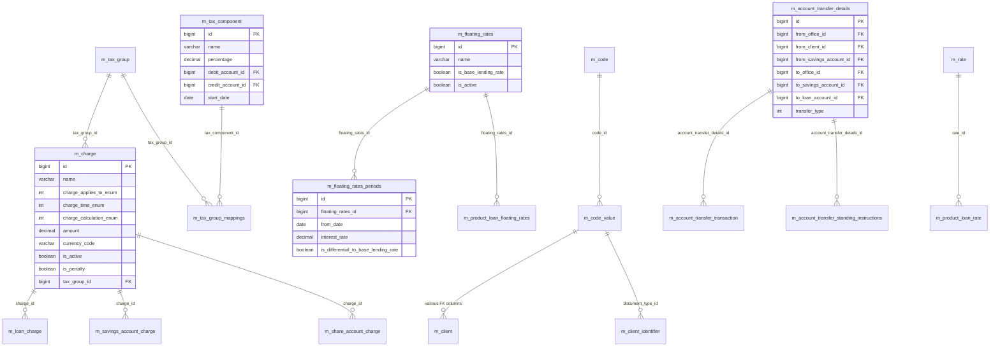

# Portfolio Shared Models

This page documents the Apache Fineract data models that **cut across portfolio modules** — entities that are referenced by loans, savings, deposit, share and client subsystems alike. These include the `Charge` catalog, the `TaxComponent`/`TaxGroup` engine, the `FloatingRate` curve used by variable-rate loans, the `Code`/`CodeValue` configurable lookup system, the `AccountTransfer*` family that moves money between accounts, the `BusinessDate` row that drives the Cycle of Business date, and the `Rate` add-on percentage entity.

Entities live in `fineract-charge`, `fineract-tax`, `fineract-rates`, `fineract-core` (codes, business date, rate, fund), and `fineract-provider` (account transfer).

## ER diagram

## Entity reference

### `Charge`

- **File:** `fineract-charge/src/main/java/org/apache/fineract/portfolio/charge/domain/Charge.java`
- **Table:** `m_charge` (unique `name`)
- **Primary key:** `Long id`
- **Base class:** `AbstractPersistableCustom<Long>`
- **Important fields:** `String name`, `String currencyCode`, `BigDecimal amount`, `Integer chargeTimeType` (`ChargeTimeType` — DISBURSEMENT=1, SPECIFIED_DUE_DATE=2, SAVINGS_ACTIVATION=3, WITHDRAWAL_FEE=5, ANNUAL_FEE=6, MONTHLY_FEE=7, INSTALMENT_FEE=8, OVERDUE_INSTALLMENT=9, OVERDRAFT_FEE=10, WEEKLY_FEE=11, SHARE_PURCHASE=13, SHARE_REDEEM=14, SAVINGS_NOACTIVITY_FEE=15, TRANCHE_DISBURSEMENT=16, ...), `Integer chargeAppliesTo` (`ChargeAppliesTo` — LOAN=1, SAVINGS=2, CLIENT=3, SHARES=4), `Integer chargeCalculation` (`ChargeCalculationType`), `Integer chargePaymentMode` (REGULAR=0, ACCOUNT_TRANSFER=1), `BigDecimal minCap`, `BigDecimal maxCap`, `Integer feeFrequency`, `Integer feeInterval`, `boolean penalty`, `boolean active`, `boolean deleted`, `GLAccount account` (income account), `TaxGroup taxGroup`, `Integer feeOnDay`, `Integer feeOnMonth`.
- **Key relationships:** Many-to-one to `GLAccount` (income), `TaxGroup`. Referenced by `LoanCharge`, `SavingsAccountCharge`, `ClientCharge`, `ShareAccountCharge`, `LoanProduct.charges` (many-to-many), `SavingsProduct.charges` (many-to-many).

### `TaxComponent`

- **File:** `fineract-tax/src/main/java/org/apache/fineract/portfolio/tax/domain/TaxComponent.java`
- **Table:** `m_tax_component`
- **Primary key:** `Long id`
- **Base class:** `AbstractAuditableCustom`
- **Important fields:** `String name`, `BigDecimal percentage`, `Integer debitAccountType`, `GLAccount debitAccount`, `Integer creditAccountType`, `GLAccount creditAccount`, `LocalDate startDate`, `Set<TaxComponentHistory> taxComponentHistories`, `Set<TaxGroupMappings> taxGroupMappings`.
- **Key relationships:** Many-to-one to `GLAccount` (debit and credit sides). One-to-many to `TaxComponentHistory` (stores historical percentages so that retro-active calculation stays correct).

### `TaxGroup`

- **File:** `fineract-tax/src/main/java/org/apache/fineract/portfolio/tax/domain/TaxGroup.java`
- **Table:** `m_tax_group`
- **Primary key:** `Long id`
- **Base class:** `AbstractAuditableCustom`
- **Important fields:** `String name`, `Set<TaxGroupMappings> taxGroupMappings`.
- **Key relationships:** One-to-many to `TaxGroupMappings` (`m_tax_group_mappings`), which holds `tax_component_id`, `start_date`, `end_date`. Charges and products reference a `TaxGroup` to compute taxes on every charge/interest posting.

### `FloatingRate`

- **File:** `fineract-rates/src/main/java/org/apache/fineract/portfolio/floatingrates/domain/FloatingRate.java`
- **Table:** `m_floating_rates` (unique `name`)
- **Primary key:** `Long id`
- **Base class:** `AbstractAuditableWithUTCDateTimeCustom<Long>`
- **Important fields:** `String name`, `boolean isBaseLendingRate`, `boolean isActive`, `Set<FloatingRatePeriod> floatingRatePeriods`.
- **Key relationships:** One-to-many to `FloatingRatePeriod` (the historical/forward curve). Referenced by `LoanProductFloatingRates` and indirectly by floating-rate `Loan` rows. At most one row may have `isBaseLendingRate = true`.

### `FloatingRatePeriod`

- **File:** `fineract-rates/src/main/java/org/apache/fineract/portfolio/floatingrates/domain/FloatingRatePeriod.java`
- **Table:** `m_floating_rates_periods`
- **Primary key:** `Long id`
- **Base class:** `AbstractAuditableWithUTCDateTimeCustom<Long>`
- **Important fields:** `FloatingRate floatingRatesId`, `LocalDate fromDate`, `BigDecimal interestRate`, `boolean isDifferentialToBaseLendingRate`, `boolean isActive`.
- **Key relationships:** Many-to-one to `FloatingRate`. When `isDifferentialToBaseLendingRate = true`, the effective rate is computed as the base lending rate at `fromDate` plus `interestRate`.

### `Code`

- **File:** `fineract-core/src/main/java/org/apache/fineract/infrastructure/codes/domain/Code.java`
- **Table:** `m_code` (unique `code_name`)
- **Primary key:** `Long id`
- **Base class:** `AbstractPersistableCustom<Long>`
- **Important fields:** `String name`, `boolean systemDefined`.
- **Key relationships:** One-to-many to `CodeValue`. System-defined codes (e.g. `Gender`, `ClientType`, `LoanPurpose`, `AddressType`, `ClientClosureReason`) cannot be deleted; user-defined codes can be created via the API.

### `CodeValue`

- **File:** `fineract-core/src/main/java/org/apache/fineract/infrastructure/codes/domain/CodeValue.java`
- **Table:** `m_code_value` (unique on `(code_id, code_value)` and on `(code_id, order_position)`)
- **Primary key:** `Long id`
- **Base class:** `AbstractPersistableCustom<Long>`
- **Important fields:** `String label`, `Code code`, `Integer position`, `String description`, `boolean isActive`, `boolean mandatory`.
- **Key relationships:** Many-to-one to `Code`. Referenced from many entity FK columns — for example `Client.gender`, `Client.subStatus`, `ClientIdentifier.documentType`, `ClientAddress.addressType`, `Guarantor.clientRelationshipTypeId`, `GLAccount.tagId`, `GroupRole.role`.

### `AccountTransferDetails`

- **File:** `fineract-provider/src/main/java/org/apache/fineract/portfolio/account/domain/AccountTransferDetails.java`
- **Table:** `m_account_transfer_details`
- **Primary key:** `Long id`
- **Base class:** `AbstractPersistableCustom<Long>`
- **Important fields:** `Office fromOffice`, `Office toOffice`, `Client fromClient`, `Client toClient`, `SavingsAccount fromSavingsAccount`, `SavingsAccount toSavingsAccount`, `Loan fromLoanAccount`, `Loan toLoanAccount`, `Integer transferType` (`AccountTransferType`), `AccountTransferStandingInstruction accountTransferStandingInstruction`, `List<AccountTransferTransaction> accountTransferTransactions`.
- **Key relationships:** Acts as the join row identifying the source/destination of a transfer. One-to-many to `AccountTransferTransaction` (per-execution) and zero-or-one to `AccountTransferStandingInstruction` (if it is a recurring transfer).

### `AccountTransferTransaction`

- **File:** `fineract-provider/src/main/java/org/apache/fineract/portfolio/account/domain/AccountTransferTransaction.java`
- **Table:** `m_account_transfer_transaction`
- **Primary key:** `Long id`
- **Important fields:** `AccountTransferDetails accountTransferDetails`, `SavingsAccountTransaction fromSavingsTransaction`, `SavingsAccountTransaction toSavingsTransaction`, `LoanTransaction fromLoanTransaction`, `LoanTransaction toLoanTransaction`, `LocalDate transactionDate`, `MonetaryCurrency currency`, `BigDecimal amount`, `String description`, `boolean reversed`.
- **Key relationships:** Many-to-one to `AccountTransferDetails`; many-to-one to the four possible per-leg transaction types. Reversing the transfer reverses both leg transactions.

### `AccountTransferStandingInstruction`

- **File:** `fineract-provider/src/main/java/org/apache/fineract/portfolio/account/domain/AccountTransferStandingInstruction.java`
- **Table:** `m_account_transfer_standing_instructions` (unique `name`)
- **Primary key:** `Long id`
- **Important fields:** `AccountTransferDetails accountTransferDetails`, `String name`, `Integer priority`, `Integer instructionType` (FIXED=1, DUES=2), `Integer status`, `BigDecimal amount`, `LocalDate validFrom`, `LocalDate validTill`, `Integer recurrenceType` (PERIODIC=1, AS_PER_DUES=2), `Integer recurrenceFrequency`, `Integer recurrenceInterval`, `MonthDay recurrenceOnDay`, `LocalDate latestRunDate`.
- **Key relationships:** Many-to-one to `AccountTransferDetails`. The standing instruction scheduled job iterates active rows and creates transfers on each due date.

### `BusinessDate`

- **File:** `fineract-core/src/main/java/org/apache/fineract/infrastructure/businessdate/domain/BusinessDate.java`
- **Table:** `m_business_date` (unique `type`)
- **Primary key:** `Long id`
- **Base class:** `AbstractAuditableWithUTCDateTimeCustom<Long>`
- **Important fields:** `BusinessDateType type` (`BUSINESS_DATE`, `COB_DATE`), `LocalDate date`.
- **Key relationships:** Two-row singleton. `BUSINESS_DATE` is the "today" the application uses (configurable for testing/back-office days); `COB_DATE` is the date the Cycle of Business batch is currently processing.

### `Rate`

- **File:** `fineract-core/src/main/java/org/apache/fineract/portfolio/rate/domain/Rate.java`
- **Table:** `m_rate` (unique `name`)
- **Primary key:** `Long id`
- **Base class:** `AbstractAuditableCustom`
- **Important fields:** `String name`, `BigDecimal percentage`, `Integer productApply` (`PortfolioProductType`), `boolean active`, `boolean approved`.
- **Key relationships:** Many-to-many to `LoanProduct` via `m_product_loan_rate` and to `Loan` via `m_loan_rate`. Adds a configurable percentage on top of the product's interest rate (commission, profit margin, ...).

## Notes & gotchas

- **`Fund`** is documented on the [Organisation models](/models/organisation-models) page but appears here because it is shared between loan and accounting flows.
- **`ChargeCalculationType`** has many values that combine the base (flat / percent of amount / percent of amount + interest / percent of interest / percent of disbursement amount / percent of total outstanding) with whether the charge tracks principal only or the full installment.
- **`TaxComponentHistory`** stores changes to a tax component's percentage with `startDate`/`endDate` so that backdated calculations (e.g. interest posting that spans a rate change) return the correct figures.
- **`AccountTransferType`** values: ACCOUNT_TRANSFER (1), LOAN_REPAYMENT (2), CHARGE_PAYMENT (3), INTEREST_TRANSFER (4).
- All money-bearing rows above embed `MonetaryCurrency` rather than FK to `m_currency`.
