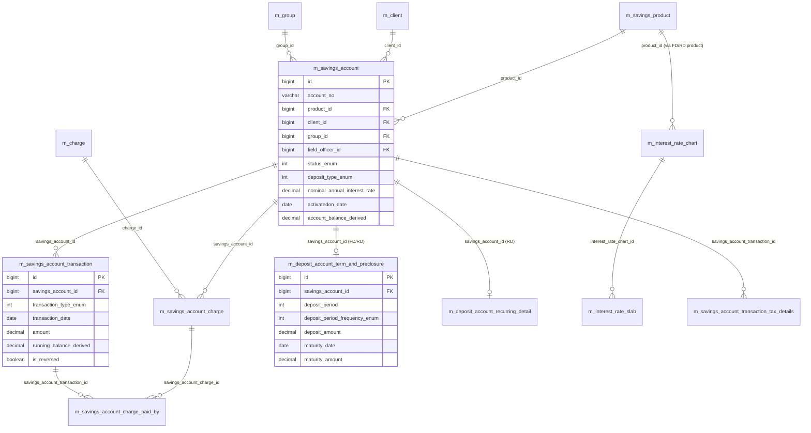

# Savings & Deposit Models

This page documents the Apache Fineract data models for **savings**, **fixed deposit (FD)** and **recurring deposit (RD)** accounts. Fineract uses a single inheritance hierarchy rooted at `SavingsAccount` — fixed and recurring deposits are subclasses that add a `DepositAccountTermAndPreClosure` row and (for RD) a `DepositAccountRecurringDetail` row, but share the same `m_savings_account` and `m_savings_account_transaction` storage as plain savings.

These entities live in the `fineract-savings` module under `org.apache.fineract.portfolio.savings.domain`, with `FixedDepositAccount` and `RecurringDepositAccount` in `fineract-provider`. The interest rate chart entities are in `fineract-savings` under `portfolio.interestratechart.domain`.

## ER diagram

## Entity reference

### `SavingsAccount`

- **File:** `fineract-savings/src/main/java/org/apache/fineract/portfolio/savings/domain/SavingsAccount.java`
- **Table:** `m_savings_account` (unique `account_no`, unique `external_id`)
- **Primary key:** `Long id`
- **Base class:** `AbstractAuditableWithUTCDateTimeCustom<Long>`, implements `IDepositAccountType`
- **Important fields:** `String accountNumber`, `ExternalId externalId`, `Client client`, `Group group`, `SavingsProduct product`, `Staff savingsOfficer`, `Integer status` (`SavingsAccountStatusType`), `Integer subStatus`, `Integer accountType` (`AccountType`), `LocalDate submittedOnDate`, `LocalDate approvedOnDate`, `LocalDate activatedOnDate`, `LocalDate lockedInUntilDate`, `LocalDate closedOnDate`, `Integer depositType` (`DepositAccountType`), `MonetaryCurrency currency` (embedded — `currency_code`, `currency_digits`, `currency_multiplesof`), `BigDecimal nominalAnnualInterestRate`, `Integer interestCompoundingPeriodType`, `Integer interestPostingPeriodType`, `Integer interestCalculationType`, `Integer interestCalculationDaysInYearType`, `BigDecimal minRequiredOpeningBalance`, `Integer lockinPeriodFrequency`, `Integer lockinPeriodFrequencyType`, `boolean withdrawalFeeApplicableForTransfer`, `boolean allowOverdraft`, `BigDecimal overdraftLimit`, `boolean withHoldTax`, `TaxGroup taxGroup`, `SavingsAccountSummary summary` (embedded), `Set<SavingsAccountTransaction> transactions`, `Set<SavingsAccountCharge> charges`.
- **Key relationships:** Many-to-one to `SavingsProduct`, `Client` *or* `Group`, `Office`, `Staff`, `TaxGroup`. One-to-many to `SavingsAccountTransaction` (ordered) and `SavingsAccountCharge`.

### `SavingsProduct`

- **File:** `fineract-savings/src/main/java/org/apache/fineract/portfolio/savings/domain/SavingsProduct.java`
- **Table:** `m_savings_product` (unique `name`, unique `short_name`)
- **Primary key:** `Long id`
- **Base class:** `AbstractPersistableCustom<Long>`
- **Important fields:** `String name`, `String shortName`, `String description`, `MonetaryCurrency currency` (embedded), `BigDecimal nominalAnnualInterestRate`, `Integer interestCompoundingPeriodType`, `Integer interestPostingPeriodType`, `Integer interestCalculationType`, `Integer interestCalculationDaysInYearType`, `BigDecimal minRequiredOpeningBalance`, `Integer lockinPeriodFrequency`, `Integer lockinPeriodFrequencyType`, `Integer accountingRule`, `boolean withdrawalFeeApplicableForTransfer`, `boolean allowOverdraft`, `BigDecimal overdraftLimit`, `boolean enforceMinRequiredBalance`, `BigDecimal minRequiredBalance`, `boolean withHoldTax`, `TaxGroup taxGroup`, `Set<Charge> charges`.
- **Key relationships:** Many-to-many to `Charge` via `m_savings_product_charge`. Many-to-one to `TaxGroup`.

### `SavingsAccountTransaction`

- **File:** `fineract-savings/src/main/java/org/apache/fineract/portfolio/savings/domain/SavingsAccountTransaction.java`
- **Table:** `m_savings_account_transaction`
- **Primary key:** `Long id`
- **Base class:** `AbstractAuditableWithUTCDateTimeCustom<Long>`, declared `final`
- **Important fields:** `SavingsAccount savingsAccount`, `Office office`, `PaymentDetail paymentDetail`, `Integer typeOf` (`SavingsAccountTransactionType`), `LocalDate dateOf`, `LocalDate submittedOnDate`, `LocalDate balanceEndDate`, `Integer balanceNumberOfDays`, `BigDecimal amount`, `BigDecimal overdraftAmount`, `BigDecimal runningBalance`, `BigDecimal cumulativeBalance`, `boolean reversed`, `LocalDate reversedOnDate`, `ExternalId externalId`, `Set<SavingsAccountChargePaidBy> savingsAccountChargesPaid`, `Set<SavingsAccountTransactionTaxDetails> taxDetails`, `boolean isManualTransaction`, `Long releaseIdOfHoldAmountTransaction`, `String reasonForBlock`.
- **Key relationships:** Many-to-one to `SavingsAccount`, `Office`, `PaymentDetail`. One-to-many to `SavingsAccountChargePaidBy` and `SavingsAccountTransactionTaxDetails`.

### `SavingsAccountCharge`

- **File:** `fineract-savings/src/main/java/org/apache/fineract/portfolio/savings/domain/SavingsAccountCharge.java`
- **Table:** `m_savings_account_charge`
- **Primary key:** `Long id`
- **Base class:** `AbstractAuditableWithUTCDateTimeCustom<Long>`
- **Important fields:** `SavingsAccount savingsAccount`, `Charge charge`, `Integer chargeTime`, `Integer chargeCalculation`, `BigDecimal percentage`, `BigDecimal amountPercentageAppliedTo`, `BigDecimal amount`, `BigDecimal amountPaid`, `BigDecimal amountWaived`, `BigDecimal amountWrittenOff`, `BigDecimal amountOutstanding`, `LocalDate dueDate`, `LocalDate inactivatedOnDate`, `boolean paid`, `boolean waived`, `boolean status` (active), `Integer feeInterval`, `MonthDay feeOnMonthDay`.
- **Key relationships:** Many-to-one to `SavingsAccount` and `Charge` (catalog).

### `SavingsAccountChargePaidBy`

- **File:** `fineract-savings/src/main/java/org/apache/fineract/portfolio/savings/domain/SavingsAccountChargePaidBy.java`
- **Table:** `m_savings_account_charge_paid_by`
- **Primary key:** `Long id`
- **Important fields:** `SavingsAccountTransaction savingsAccountTransaction`, `SavingsAccountCharge savingsAccountCharge`, `BigDecimal amount`.
- **Key relationships:** Resolves which portion of which charge a savings transaction paid.

### `FixedDepositAccount`

- **File:** `fineract-provider/src/main/java/org/apache/fineract/portfolio/savings/domain/FixedDepositAccount.java`
- **Table:** `m_savings_account` (joined inheritance — adds rows in `m_deposit_account_term_and_preclosure`)
- **Primary key:** Inherited from `SavingsAccount` (id of the `m_savings_account` row)
- **Base class:** `SavingsAccount` (single-table style — `deposit_type_enum = 200` distinguishes FD)
- **Important fields:** `DepositAccountTermAndPreClosure accountTermAndPreClosure`, `DepositAccountInterestRateChart chart`.
- **Key relationships:** One-to-one to `DepositAccountTermAndPreClosure` (via `accountTermAndPreClosure.savingsAccount`) and one-to-one to `DepositAccountInterestRateChart` (the per-account snapshot of the product's interest chart).

### `RecurringDepositAccount`

- **File:** `fineract-provider/src/main/java/org/apache/fineract/portfolio/savings/domain/RecurringDepositAccount.java`
- **Table:** `m_savings_account` (`deposit_type_enum = 300`) plus `m_deposit_account_recurring_detail`
- **Base class:** `SavingsAccount`
- **Important fields:** `DepositAccountRecurringDetail recurringDetail`, `DepositAccountTermAndPreClosure accountTermAndPreClosure`, `DepositAccountInterestRateChart chart`.
- **Key relationships:** Adds the recurring schedule on top of FD's term/preclosure storage.

### `DepositAccountTermAndPreClosure`

- **File:** `fineract-savings/src/main/java/org/apache/fineract/portfolio/savings/domain/DepositAccountTermAndPreClosure.java`
- **Table:** `m_deposit_account_term_and_preclosure`
- **Primary key:** `Long id`
- **Base class:** `AbstractPersistableCustom<Long>`
- **Important fields:** `SavingsAccount account`, `BigDecimal depositAmount`, `BigDecimal maturityAmount`, `LocalDate maturityDate`, `Integer depositPeriod`, `Integer depositPeriodFrequencyType`, `Integer onAccountClosureType` (withdraw / transfer / re-invest), `Long transferToSavingsAccountId`, `Integer expectedFirstDepositOnDate` (RD), `BigDecimal preClosurePenalApplicable`, `BigDecimal preClosurePenalInterest`, `Integer preClosurePenalInterestOnType`, `DepositPreClosureDetail preClosureDetail` (embedded), `DepositTermDetail depositTermDetail` (embedded — min/max term, in-period frequency).
- **Key relationships:** One-to-one with `SavingsAccount` (parent is FD or RD).

### `DepositAccountRecurringDetail`

- **File:** `fineract-savings/src/main/java/org/apache/fineract/portfolio/savings/domain/DepositAccountRecurringDetail.java` (declared as `DepositAccountRecurringDetail`)
- **Table:** `m_deposit_account_recurring_detail`
- **Primary key:** `Long id`
- **Base class:** `AbstractPersistableCustom<Long>`
- **Important fields:** `SavingsAccount account`, `BigDecimal mandatoryRecommendedDepositAmount`, `Integer recurringFrequency`, `Integer recurringFrequencyType`, `boolean isMandatoryDeposit`, `boolean allowWithdrawal`, `boolean adjustAdvanceTowardsFuturePayments`, `boolean isCalendarInherited`, `DepositRecurringDetail recurringDetail` (embedded).
- **Key relationships:** One-to-one with `SavingsAccount` (RD only).

### `InterestRateChart`

- **File:** `fineract-savings/src/main/java/org/apache/fineract/portfolio/interestratechart/domain/InterestRateChart.java`
- **Table:** `m_interest_rate_chart`
- **Primary key:** `Long id`
- **Base class:** `AbstractPersistableCustom<Long>`
- **Important fields:** `InterestRateChartFields chartFields` (embedded — `name`, `description`, `fromDate`, `endDate`, `isPrimaryGroupingByAmount`), `Set<InterestRateChartSlab> chartSlabs`.
- **Key relationships:** One-to-many to `InterestRateChartSlab` (stored in `m_interest_rate_slab` with per-slab amount range, period range, annual interest rate and optional incentives). FD and RD products reference a chart via `DepositProductInterestRateChart`, and per-account snapshots are stored in `DepositAccountInterestRateChart`.

### `FixedDepositProduct`

- **File:** `fineract-savings/src/main/java/org/apache/fineract/portfolio/savings/domain/FixedDepositProduct.java`
- **Table:** `m_savings_product` (joined inheritance — adds rows in `m_deposit_product_term_and_preclosure`)
- **Base class:** `SavingsProduct`
- **Important fields:** `DepositProductTermAndPreClosure productTermAndPreClosure`, `Set<InterestRateChart> charts`.
- **Key relationships:** One-to-one with `DepositProductTermAndPreClosure`; many-to-many with `InterestRateChart` via `m_deposit_product_interest_rate_chart`.

### `RecurringDepositProduct`

- **File:** `fineract-savings/src/main/java/org/apache/fineract/portfolio/savings/domain/RecurringDepositProduct.java`
- **Base class:** `FixedDepositProduct` (adds RD-only fields)
- **Important fields:** `DepositProductRecurringDetail recurringDetail`.

## Lifecycle & status notes

`SavingsAccountStatusType`: SUBMITTED_AND_PENDING_APPROVAL (100), APPROVED (200), ACTIVE (300), TRANSFER_IN_PROGRESS (303), TRANSFER_ON_HOLD (304), WITHDRAWN_BY_APPLICANT (400), REJECTED (500), CLOSED (600), PRE_MATURE_CLOSURE (700), MATURED (800).

`DepositAccountType`: SAVINGS_DEPOSIT (100), FIXED_DEPOSIT (200), RECURRING_DEPOSIT (300), CURRENT_DEPOSIT (400). Stored in `deposit_type_enum`.

`SavingsAccountTransactionType` (commonly referenced): DEPOSIT (1), WITHDRAWAL (2), INTEREST_POSTING (3), WITHDRAWAL_FEE (4), ANNUAL_FEE (5), WAIVE_CHARGES (6), PAY_CHARGE (7), DIVIDEND_PAYOUT (8), INITIATE_TRANSFER (12), APPROVE_TRANSFER (13), WITHDRAW_TRANSFER (14), REJECT_TRANSFER (15), WRITTEN-OFF (16), OVERDRAFT_INTEREST (17), WITHHOLD_TAX (18), ESCHEAT (19), AMOUNT_HOLD (20), AMOUNT_RELEASE (21).

Interest is computed in `SavingsAccount` itself (`postInterest`, `calculateInterestUsing`) using `SavingsCompoundingInterestPeriodType` and `SavingsPostingInterestPeriodType`.
