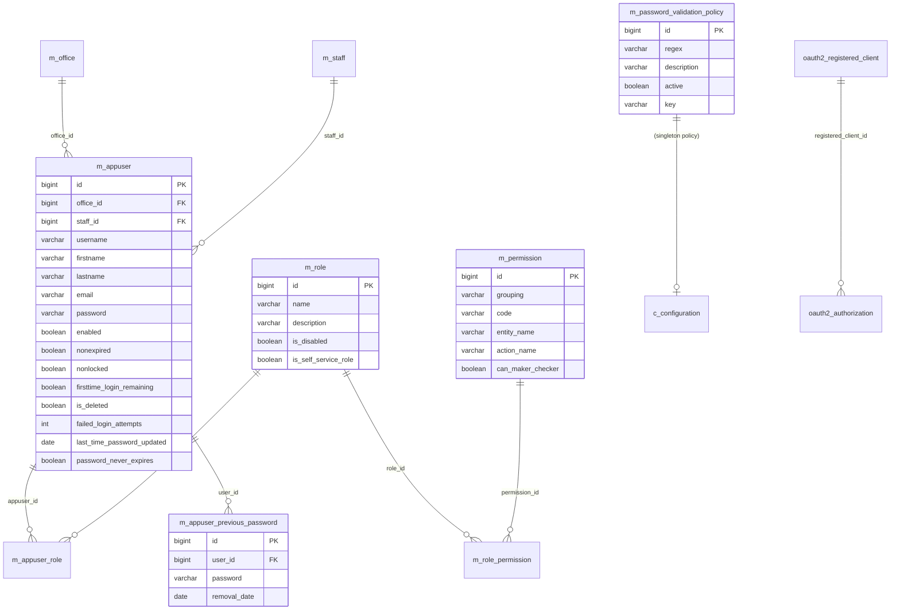

# Security & User Models

This page documents the Apache Fineract data models that implement **authentication, authorisation and password management**. Fineract has its own user/role/permission tables (it does not delegate to an external IdP by default) and supports a maker-checker workflow via the `CommandSource` table (documented on the [external event & audit](/models/external-event-and-audit-models) page). For OAuth2 deployments the standard Spring Authorization Server tables are present.

Entities live in `fineract-core` under `org.apache.fineract.useradministration.domain` and in `fineract-provider` for the password-validation policy.

## ER diagram

## Entity reference

### `AppUser`

- **File:** `fineract-core/src/main/java/org/apache/fineract/useradministration/domain/AppUser.java`
- **Table:** `m_appuser` (unique `username`)
- **Primary key:** `Long id`
- **Base class:** `AbstractPersistableCustom<Long>`, implements `PlatformUser`
- **Important fields:** `String email`, `String username`, `String firstname`, `String lastname`, `String password`, `boolean accountNonExpired` (`nonexpired` column), `boolean accountNonLocked` (`nonlocked` column), `int failedLoginAttempts`, `boolean loginRetryLimitEnabled` (`is_login_retries_enabled` column), `boolean credentialsNonExpired` (`nonexpired_credentials` column), `boolean enabled`, `boolean firstTimeLoginRemaining`, `boolean deleted` (`is_deleted` column), `Office office`, `Staff staff`, `Set<Role> roles` (eager fetch, `@ManyToMany` via `m_appuser_role`), `LocalDate lastTimePasswordUpdated`, `boolean passwordNeverExpires`, `Boolean cannotChangePassword`.
- **Key relationships:** Many-to-one to `Office` (mandatory) and `Staff` (optional — links the user to a staff record). Many-to-many to `Role` via the `m_appuser_role` join table (`appuser_id`, `role_id`). One-to-many to `AppUserPreviousPassword`. Referenced as `createdby_id` / `lastmodifiedby_id` on every auditable entity and as `maker_id`/`checker_id` on `CommandSource`.

### `Role`

- **File:** `fineract-core/src/main/java/org/apache/fineract/useradministration/domain/Role.java`
- **Table:** `m_role` (unique `name`)
- **Primary key:** `Long id`
- **Base class:** `AbstractPersistableCustom<Long>`, implements `Serializable`
- **Important fields:** `String name`, `String description`, `boolean disabled`, `boolean selfServiceRole` (`is_self_service_role` — restricts the role to the self-service portal), `Set<Permission> permissions` (many-to-many via `m_role_permission`).
- **Key relationships:** Many-to-many to `Permission` via `m_role_permission`. Many-to-many to `AppUser` via `m_appuser_role` (inverse). Self-service roles can only be granted to self-service users.

### `Permission`

- **File:** `fineract-core/src/main/java/org/apache/fineract/useradministration/domain/Permission.java`
- **Table:** `m_permission`
- **Primary key:** `Long id`
- **Base class:** `AbstractPersistableCustom<Long>`, implements `Serializable`
- **Important fields:** `String grouping` (e.g. `portfolio`, `transaction_loan`, `transaction_savings`, `accounting`, `organisation`, `authorisation`), `String code` (e.g. `CREATE_LOAN`, `APPROVE_LOAN`, `DISBURSE_LOAN`, `READ_CLIENT`, `UPDATE_CLIENT_CHECKER`), `String entityName`, `String actionName`, `boolean canMakerChecker`.
- **Key relationships:** Many-to-many inverse with `Role`. Permissions are seeded into the schema by Liquibase and are matched against the `code` of the command coming through `CommandWrapper`. When `canMakerChecker = true`, the command goes through the maker-checker queue (`m_portfolio_command_source` with status PENDING) instead of executing immediately.

### `AppUserPreviousPassword`

- **File:** `fineract-provider/src/main/java/org/apache/fineract/useradministration/domain/AppUserPreviousPassword.java`
- **Table:** `m_appuser_previous_password`
- **Primary key:** `Long id`
- **Base class:** `AbstractPersistableCustom<Long>`
- **Important fields:** `Long userId`, `String password` (hashed), `LocalDate removalDate`.
- **Key relationships:** Many-to-one to `AppUser` (via `userId`). The password change workflow rejects reuse of any of the user's previous passwords within the configured retention window.

### `PasswordValidationPolicy`

- **File:** `fineract-provider/src/main/java/org/apache/fineract/useradministration/domain/PasswordValidationPolicy.java`
- **Table:** `m_password_validation_policy`
- **Primary key:** `Long id`
- **Base class:** `AbstractPersistableCustom<Long>`
- **Important fields:** `String regex`, `String description`, `boolean active`, `String key`.
- **Key relationships:** Singleton-by-`active` — only one row is `active = true` at a time. The active row's `regex` validates every new password. Pre-seeded policies range from "simple" (no upper-case requirement) to "secure" (mixed case, digit, special character, minimum length 8).

### OAuth2 registered clients (Spring Authorization Server)

When Fineract is built with the OAuth2 profile, the standard Spring Authorization Server schema is present:

- **Table:** `oauth2_registered_client`
- **Primary key:** `id` (VARCHAR)
- **Important columns:** `client_id`, `client_id_issued_at`, `client_secret`, `client_secret_expires_at`, `client_name`, `client_authentication_methods`, `authorization_grant_types`, `redirect_uris`, `post_logout_redirect_uris`, `scopes`, `client_settings`, `token_settings`.

There is no Fineract-owned entity class — Spring Authorization Server reads/writes these rows directly via its `JdbcRegisteredClientRepository`. Similar tables exist for `oauth2_authorization` (active tokens) and `oauth2_authorization_consent` (consent records).

### Access tokens

In the non-OAuth2 (basic-auth / API key) path, Fineract issues a short-lived in-memory token via `BasicAuthTenantDetailsService`. There is no `m_access_token` table. With the OAuth2 profile, access tokens are stored in `oauth2_authorization.access_token_value` (encrypted) along with `refresh_token_value`, `authorization_code_value` and `oidc_id_token_value`.

## Maker-checker

The maker-checker workflow is supported by the **`CommandSource`** entity (table `m_portfolio_command_source`), documented in detail on the [external event & audit](/models/external-event-and-audit-models) page. The flow:

1. A user with a permission that has `can_maker_checker = true` calls a write endpoint.
2. `CommandProcessingService` creates a `CommandSource` row with `maker_id = AppUser.id` and `status = PENDING`.
3. A **different** user (the *checker*) calls the approve endpoint; if they have the corresponding `CHECKER_*` permission, `CommandSource` is updated with `checker_id`, `checked_on_date_utc`, `status = APPROVED`, and the underlying command is executed.

## Lifecycle & gotchas

- **`is_deleted`** on `m_appuser` is a soft-delete flag — the row is kept (and the `username` is renamed with a timestamp suffix to free the unique constraint) so historic `createdby_id` references stay valid.
- **`nonlocked`** is automatically flipped to `false` when `failed_login_attempts` exceeds the configured threshold and `is_login_retries_enabled = true`.
- **`firsttime_login_remaining`** forces a password change on first login.
- The `password` column stores a **bcrypt** hash; the `BCryptPasswordEncoder` strength is configured via Spring Security defaults.
- `Role.selfServiceRole` corresponds to the `/self/` API surface — those endpoints check that the calling user's roles are all marked as self-service.
- **Permissions** are immutable once seeded; admins toggle them on/off per-role via the `m_role_permission` join.
