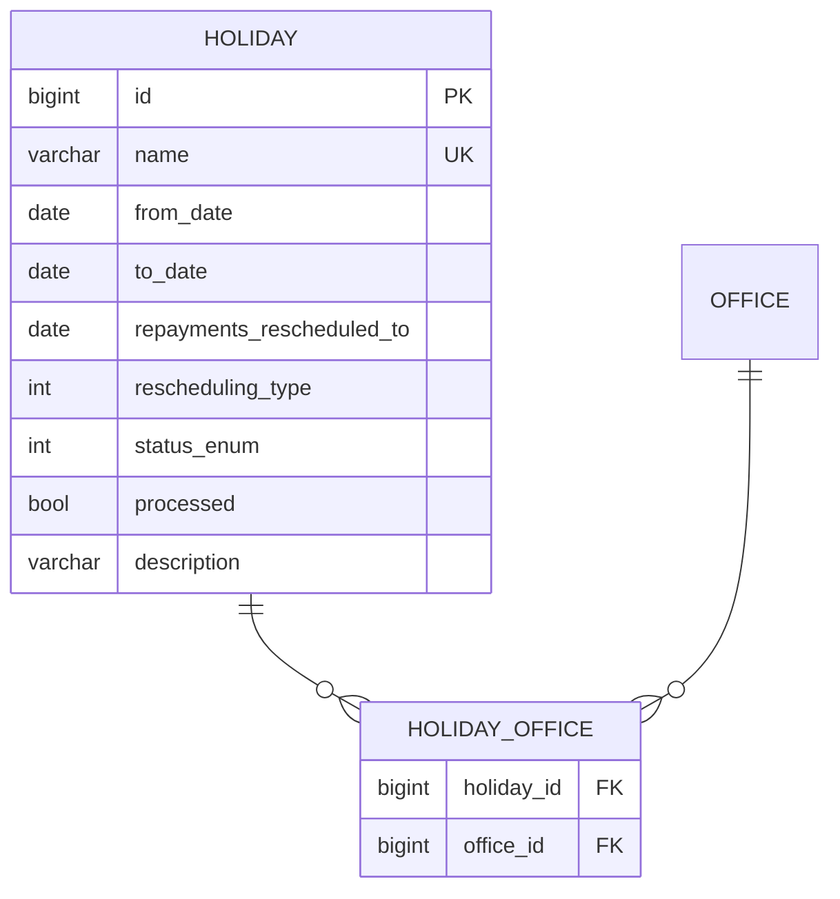
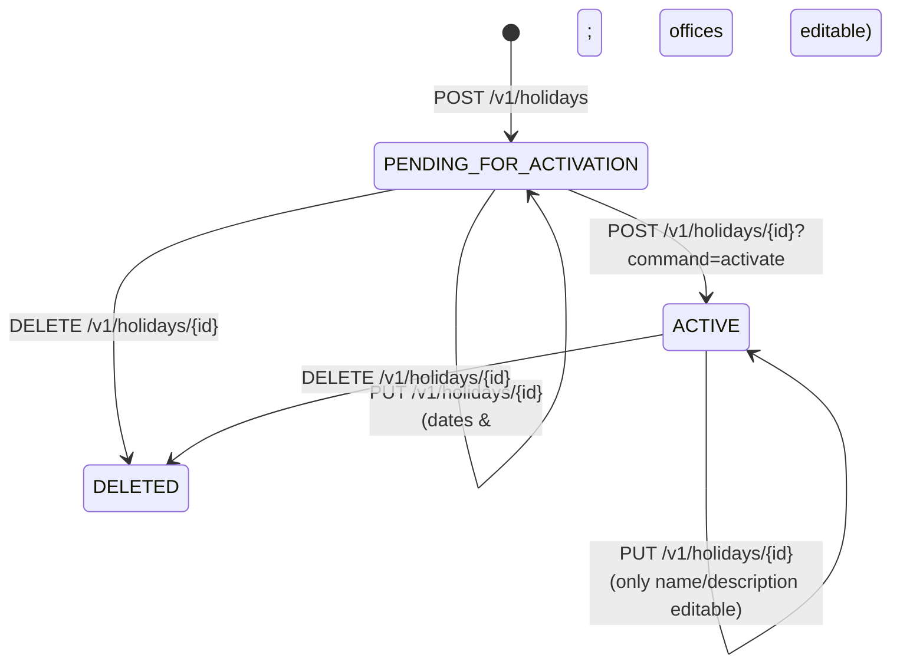
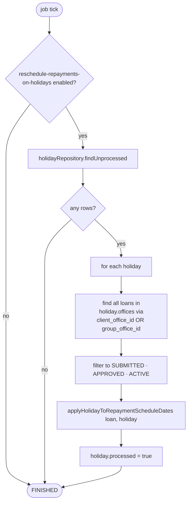

Holidays in Apache Fineract are *office-scoped, date-windowed* calendar exceptions that cause repayments falling in the window to be moved to a different date. They are independent of the global working-days configuration — a Saturday may be a working day at head office and a holiday at a regional branch on the same date — and they are applied to loans by a dedicated batch job rather than at schedule-generation time. This page documents the `organisation/holiday/` package and the loan-side `APPLY_HOLIDAYS_TO_LOANS` tasklet that consumes it.

## Where the code lives

```
fineract-core/.../organisation/holiday/
├── api/
│   └── HolidayApiConstants.java
├── domain/
│   ├── Holiday.java                  — the entity
│   ├── HolidayStatusType.java        — PENDING / ACTIVE / DELETED enum
│   └── RescheduleType.java           — SPECIFIC_DATE / NEXT_REPAYMENT enum
└── service/

fineract-provider/.../organisation/holiday/
├── api/
│   ├── HolidaysApiResource.java      — /v1/holidays
│   └── HolidaysApiResourceSwagger.java
├── data/
├── domain/
│   ├── HolidayRepository.java
│   └── HolidayRepositoryWrapper.java
├── exception/
│   ├── HolidayDateException.java
│   └── HolidayNotFoundException.java
├── handler/
│   ├── CreateHolidayCommandHandler.java
│   ├── ActivateHolidayCommandHandler.java
│   ├── UpdateHolidayCommandHandler.java
│   └── DeleteHolidayCommandHandler.java
├── service/
│   ├── HolidayEnumerations.java
│   ├── HolidayReadPlatformService.java
│   ├── HolidayReadPlatformServiceImpl.java
│   ├── HolidayWritePlatformService.java
│   └── HolidayWritePlatformServiceJpaRepositoryImpl.java
└── starter/

fineract-provider/.../portfolio/loanaccount/jobs/applyholidaystoloans/
├── ApplyHolidaysToLoansConfig.java   — Spring Batch wiring
└── ApplyHolidaysToLoansTasklet.java  — the actual rewrite logic
```

## The `Holiday` entity

`fineract-core/src/main/java/org/apache/fineract/organisation/holiday/domain/Holiday.java`

```java
@Entity
@Table(name = "m_holiday", uniqueConstraints = {
    @UniqueConstraint(columnNames = { "name" }, name = "holiday_name") })
public class Holiday extends AbstractPersistableCustom<Long> {

    @Column(name = "name", unique = true, nullable = false, length = 100)
    private String name;

    @Column(name = "from_date", nullable = false) private LocalDate fromDate;
    @Column(name = "to_date",   nullable = false) private LocalDate toDate;

    @Column(name = "repayments_rescheduled_to") private LocalDate repaymentsRescheduledTo;

    @Column(name = "rescheduling_type", nullable = false) private int reschedulingType;

    @Column(name = "status_enum", nullable = false) private Integer status;

    @Column(name = "processed",  nullable = false) private boolean processed;

    @Column(name = "description", length = 100) private String description;

    @ManyToMany(fetch = FetchType.EAGER)
    @JoinTable(name = "m_holiday_office",
               joinColumns = @JoinColumn(name = "holiday_id"),
               inverseJoinColumns = @JoinColumn(name = "office_id"))
    private Set<Office> offices;
    // ...
}
```



### Status lifecycle

`HolidayStatusType` (`fineract-core/.../holiday/domain/HolidayStatusType.java`):

```java
public enum HolidayStatusType {
    INVALID(0,                "holidayStatusType.invalid"),
    PENDING_FOR_ACTIVATION(100,"holidayStatusType.pending.for.activation"),
    ACTIVE(300,               "holidayStatusType.active"),
    DELETED(600,              "savingsAccountStatusType.transfer.in.progress");
    // ...
}
```



Two things to note:

1. **Newly created holidays are not applied immediately.** They sit in `PENDING_FOR_ACTIVATION` until explicitly activated via `?command=activate`. Only `ACTIVE` rows are picked up by the batch job — see "Active vs processed" below.
2. **Editability narrows in `ACTIVE`.** From the entity's `update(JsonCommand)`, once a holiday is active you can no longer change `fromDate`, `toDate`, `repaymentsRescheduledTo`, or the offices set:
   ```java
   } else {
       if (command.isChangeInLocalDateParameterNamed(fromDateParamName, getFromDate())) {
           baseDataValidator.reset().parameter(fromDateParamName)
                            .failWithCode("cannot.edit.holiday.in.active.state");
       }
       // ...
   }
   ```

### `RescheduleType`

`fineract-core/.../holiday/domain/RescheduleType.java`:

```java
public enum RescheduleType {
    INVALID(0,                        "rescheduletype.invalid"),
    RESCHEDULETOSPECIFICDATE(2,       "rescheduletype.rescheduletospecificdate"),
    RESCHEDULETONEXTREPAYMENTDATE(1,  "rescheduletype.rescheduletonextrepaymentdate");
    // ...
}
```

The choice has direct semantic impact:

| Value | Behaviour                                                                                                              |
| ----- | ---------------------------------------------------------------------------------------------------------------------- |
| `RESCHEDULETOSPECIFICDATE` (2)      | Every installment whose due date falls in `[fromDate, toDate]` is moved to the single `repaymentsRescheduledTo` date.  |
| `RESCHEDULETONEXTREPAYMENTDATE` (1) | The installment is moved to the *next regular* scheduled repayment date after the holiday window, computed by the loan's term. `repaymentsRescheduledTo` is forced to null. |

The "next repayment date" behaviour also cascades — once one installment is moved forward, subsequent installments get pushed too. See "How the schedule is rewritten" below.

### Active vs processed

`processed` is a separate boolean. It tracks whether the batch job has already rewritten the affected loans for this holiday. The job picks up holidays via `HolidayRepository.findUnprocessed()` and flips `processed = true` after it finishes:

```java
public RepeatStatus execute(StepContribution contribution, ChunkContext chunkContext) throws Exception {
    // ...
    final List<Holiday> holidays = holidayRepository.findUnprocessed();
    for (final Holiday holiday : holidays) {
        // ...
        for (final Loan loan : loans) {
            applyHolidayToRepaymentScheduleDates(loan, holiday);
        }
        loanRepositoryWrapper.save(loans);
        holiday.setProcessed(true);
    }
    holidayRepository.save(holidays);
    return RepeatStatus.FINISHED;
}
```

This is why activation (`status -> ACTIVE`) does not immediately move installments — the job has to run.

## REST surface

### `HolidaysApiResource` — `/v1/holidays`

```java
@Path("/v1/holidays")
@Tag(name = "Holidays", description = "Some MFI's span large regions where different branch offices might observe " +
   "different holidays. They need the ability to define holidays for specific branch offices and be able to set the " +
   "repayment rule to follow during those holidays. ...")
```

| Method | Path                                          | Purpose                                  |
| ------ | --------------------------------------------- | ---------------------------------------- |
| POST   | `/v1/holidays`                                | Create (lands in `PENDING_FOR_ACTIVATION`) |
| POST   | `/v1/holidays/{holidayId}?command=activate`   | Move to `ACTIVE`                         |
| GET    | `/v1/holidays?officeId={id}`                  | List holidays for an office              |
| GET    | `/v1/holidays/{holidayId}`                    | Retrieve one                             |
| PUT    | `/v1/holidays/{holidayId}`                    | Update (dates locked while ACTIVE)       |
| DELETE | `/v1/holidays/{holidayId}`                    | Soft-delete (sets status to `DELETED`)   |
| GET    | `/v1/holidays/template`                       | Office + reschedule-type dropdowns       |

### Command names

`fineract-core/.../commands/service/CommandWrapperBuilder.java`:

```java
public CommandWrapperBuilder createHoliday()    { /* ENTITY_HOLIDAY, ACTION_CREATE   */ }
public CommandWrapperBuilder activateHoliday(Long holidayId) { /* ACTION_ACTIVATE */ }
public CommandWrapperBuilder updateHoliday(Long holidayId)   { /* ACTION_UPDATE   */ }
public CommandWrapperBuilder deleteHoliday(Long holidayId)   { /* ACTION_DELETE   */ }
```

Routed to:

| Command            | Handler                                                       |
| ------------------ | ------------------------------------------------------------- |
| `CREATE_HOLIDAY`   | `CreateHolidayCommandHandler` → `HolidayWritePlatformService` |
| `ACTIVATE_HOLIDAY` | `ActivateHolidayCommandHandler`                               |
| `UPDATE_HOLIDAY`   | `UpdateHolidayCommandHandler`                                 |
| `DELETE_HOLIDAY`   | `DeleteHolidayCommandHandler`                                 |

## The `APPLY_HOLIDAYS_TO_LOANS` job

`fineract-provider/src/main/java/org/apache/fineract/portfolio/loanaccount/jobs/applyholidaystoloans/ApplyHolidaysToLoansTasklet.java`

This is a Spring Batch tasklet registered as a Fineract scheduler job under the name `APPLY_HOLIDAYS_TO_LOANS` (see `fineract-core/.../infrastructure/jobs/service/JobName.java`). It runs on whatever cron the tenant has configured for that job.

### Top-level shape

```java
@Override
public RepeatStatus execute(StepContribution contribution, ChunkContext chunkContext) throws Exception {
    final boolean isHolidayEnabled = configurationDomainService.isRescheduleRepaymentsOnHolidaysEnabled();
    if (!isHolidayEnabled) {
        return RepeatStatus.FINISHED;
    }

    final Collection<LoanStatus> loanStatuses = new ArrayList<>(
        Arrays.asList(LoanStatus.SUBMITTED_AND_PENDING_APPROVAL, LoanStatus.APPROVED, LoanStatus.ACTIVE));
    final List<Holiday> holidays = holidayRepository.findUnprocessed();

    for (final Holiday holiday : holidays) {
        final Set<Office> offices = holiday.getOffices();
        final Collection<Long> officeIds = offices.stream().map(Office::getId).toList();
        final List<Loan> loans = new ArrayList<>();
        loans.addAll(loanRepositoryWrapper.findByClientOfficeIdsAndLoanStatus(officeIds, loanStatuses));
        loans.addAll(loanRepositoryWrapper.findByGroupOfficeIdsAndLoanStatus(officeIds, loanStatuses));
        for (final Loan loan : loans) {
            applyHolidayToRepaymentScheduleDates(loan, holiday);
        }
        loanRepositoryWrapper.save(loans);
        holiday.setProcessed(true);
    }
    holidayRepository.save(holidays);
    return RepeatStatus.FINISHED;
}
```

### The two switches the job respects



- **`reschedule-repayments-on-holidays`** is the global config (`c_configuration` row) that arms the whole subsystem. If it is `false`, the job exits without touching anything — even active, unprocessed holidays.
- **`holiday.status == ACTIVE`** is implicit via `findUnprocessed` (which only returns rows the job hasn't yet handled and which have a status the job recognises).
- **Loan status filter** — only `SUBMITTED_AND_PENDING_APPROVAL`, `APPROVED`, `ACTIVE`. Closed/written-off loans are left alone.

### How the schedule is rewritten

The per-loan rewrite, `applyHolidayToRepaymentScheduleDates(Loan, Holiday)`:

```java
public void applyHolidayToRepaymentScheduleDates(Loan loan, Holiday holiday) {
    LocalDate adjustedRescheduleToDate;
    boolean isResheduleToNextRepaymentDate = holiday.getReScheduleType().isResheduleToNextRepaymentDate();
    if (isResheduleToNextRepaymentDate) {
        adjustedRescheduleToDate = getNextRepaymentDate(loan, holiday);
    } else {
        adjustedRescheduleToDate = holiday.getRepaymentsRescheduledTo();
    }

    if (isRepaymentScheduleAdjustmentNeeded(adjustedRescheduleToDate)) {
        if (isResheduleToNextRepaymentDate) {
            adjustAllRepaymentSchedules(loan, holiday, adjustedRescheduleToDate);
        } else {
            adjustRepaymentSchedules(loan, holiday, adjustedRescheduleToDate);
        }
        businessEventNotifierService.notifyPostBusinessEvent(new LoanRescheduledDueHolidayBusinessEvent(loan));
    }
}
```

For `RESCHEDULETOSPECIFICDATE`, `adjustRepaymentSchedules` walks each installment and moves any installment whose `dueDate` falls in `[fromDate, toDate]` to `adjustedRescheduleToDate`. The next installment's `fromDate` is then updated to the new due date, but later installments keep their original due dates.

For `RESCHEDULETONEXTREPAYMENTDATE`, `adjustAllRepaymentSchedules` is more invasive — it rebuilds the entire downstream schedule using `DefaultScheduledDateGenerator`, since pushing one installment forward by a whole period must propagate.

In both cases the job fires a `LoanRescheduledDueHolidayBusinessEvent` so downstream observers (notifications, reports, audit) can react.

## Exceptions

| Exception                                      | Trigger                                          |
| ---------------------------------------------- | ------------------------------------------------ |
| `HolidayNotFoundException`                     | Lookup of an unknown holiday ID                  |
| `HolidayDateException`                         | `fromDate > toDate`, `repaymentsRescheduledTo` outside window, or office opening-date violations |
| `PlatformDataIntegrityException`               | Duplicate `name`                                 |
| `PlatformApiDataValidationException`           | Attempting to edit a date or office set while `ACTIVE` |

`HolidayDateException`'s `error.msg.holiday.*` prefix is its key contract — every concrete failure mode adds a postfix (e.g. `error.msg.holiday.from.date.after.to.date`).

## Working with multiple holidays in the same window

Multiple holidays can overlap in date and in office set. The batch job processes them in `findUnprocessed()` order (effectively id-order in practice). Because each holiday rewrites the schedule independently, the *order* of processing matters:

- If two `SPECIFIC_DATE` holidays both target the same installment, the second one wins.
- If a `NEXT_REPAYMENT_DATE` holiday is processed before a `SPECIFIC_DATE` one that overlaps, the cascade may move installments *into* the second holiday's window — they will then be moved again on a subsequent job run (since the holiday row is now marked processed, this means the second job tick if a fresh holiday lands in the new window).

For correctness, MFIs typically batch-create holidays for a year and activate them once.

## Permissions

| Code                       | Purpose                                  |
| -------------------------- | ---------------------------------------- |
| `READ_HOLIDAY`             | List / retrieve                          |
| `CREATE_HOLIDAY`           | Create (lands in PENDING)                |
| `CREATE_HOLIDAY_CHECKER`   | Maker-checker approval                   |
| `ACTIVATE_HOLIDAY`         | Move to ACTIVE                           |
| `ACTIVATE_HOLIDAY_CHECKER` | Maker-checker approval                   |
| `UPDATE_HOLIDAY`           | Edit                                     |
| `UPDATE_HOLIDAY_CHECKER`   | Maker-checker approval                   |
| `DELETE_HOLIDAY`           | Soft-delete                              |
| `DELETE_HOLIDAY_CHECKER`   | Maker-checker approval                   |

## Common pitfalls

<Warning>
**Creating a holiday does nothing on its own.** It must be `ACTIVE` *and* the job must run *and* `reschedule-repayments-on-holidays` must be `true`. A common bug report is "we created a holiday and the loan didn't move" — check all three.
</Warning>

<Warning>
**Already-paid installments are still rewritten.** The job filters by *loan* status, not by *installment* paid-state. If a holiday window covers an already-paid installment, its due date will still be shifted, which can produce surprising reports. Operationally, MFIs avoid creating retroactive holidays for this reason.
</Warning>

<Warning>
**`repayments_rescheduled_to` may itself be a non-working day.** Fineract's holiday subsystem does not consult `WorkingDays` when applying a holiday — see the FIXME in `ApplyHolidaysToLoansTasklet#adjustRepaymentSchedules`: *"Assuming holiday's repayment reschedule to date cannot be created on a non-working day."* It's the operator's responsibility to set a workable reschedule-to date.
</Warning>

<Warning>
**`processed` is permanent.** Once a holiday has been processed, re-activating it (or editing it after activation — which is mostly blocked anyway) will not re-apply it. To re-process you must create a new holiday row.
</Warning>

## See also

- [Working days](/organisation/working-days) — handles the orthogonal "day-of-week not workable" axis at schedule-generation time.
- [Offices](/organisation/offices-and-hierarchy) — `m_holiday_office` is the many-to-many target.
- `fineract-core/.../infrastructure/jobs/service/JobName.java` — the scheduler enum where `APPLY_HOLIDAYS_TO_LOANS` is defined.
- `DefaultScheduledDateGenerator` under `fineract-provider/.../portfolio/loanaccount/loanschedule/domain/` — the algorithm the rewrite delegates to.
