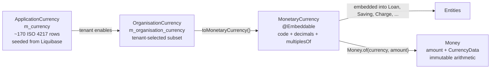
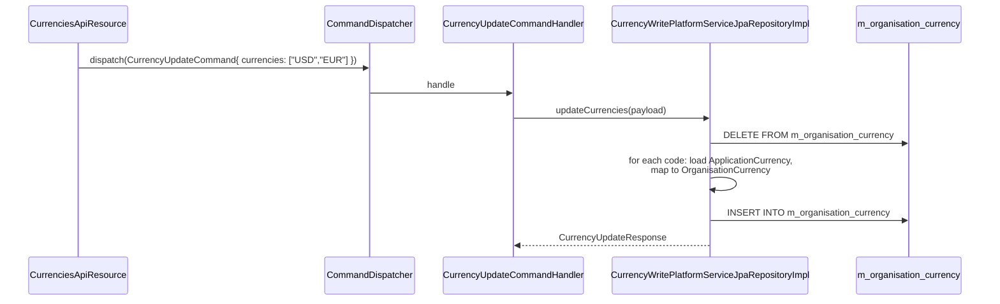

Money is the most-touched value type in Apache Fineract. Every loan principal, every interest accrual, every charge, every savings interest posting, every journal entry — they all live and breathe through the `Money` class. The supporting cast — `ApplicationCurrency`, `OrganisationCurrency`, `MonetaryCurrency` — manages *which* currencies the tenant transacts in. And the entire arithmetic semantic is governed by a single tenant-config knob, `fineract.tenant.config.rounding-mode`. This page documents the `organisation/monetary/` package across `fineract-core` and `fineract-provider`.

## Where the code lives

```
fineract-core/.../organisation/monetary/
├── api/
│   └── CurrenciesApiResource.java        — /v1/currencies (read + update)
├── command/
│   └── CurrencyUpdateCommand.java
├── data/
│   ├── CurrencyData.java                 — DTO shared via @Embeddable backing
│   ├── CurrencyConfigurationData.java    — selected + available bundle
│   ├── CurrencyUpdateRequest.java
│   └── CurrencyUpdateResponse.java
├── domain/
│   ├── ApplicationCurrency.java          — catalogue row (m_currency)
│   ├── ApplicationCurrencyRepository(Wrapper).java
│   ├── MonetaryCurrency.java             — @Embeddable value type
│   ├── Money.java                        — immutable amount+currency
│   ├── MoneyHelper.java                  — tenant-scoped rounding mode
│   ├── OrganisationCurrency.java         — tenant-enabled (m_organisation_currency)
│   └── OrganisationCurrencyRepository(Wrapper).java
├── exception/
├── handler/
│   └── CurrencyUpdateCommandHandler.java
├── mapper/
├── serialization/
└── service/
    ├── CurrencyReadPlatformService.java
    ├── CurrencyReadPlatformServiceImpl.java
    ├── CurrencyWritePlatformService.java
    ├── OrganisationCurrencyReadPlatformService.java
    └── OrganisationCurrencyReadPlatformServiceImpl.java

fineract-provider/.../organisation/monetary/
├── service/
│   └── CurrencyWritePlatformServiceJpaRepositoryImpl.java
└── starter/
```

<Note>
Note the inversion compared to other organisation packages: the **entities, APIs, services and handlers all live in `fineract-core`**, and `fineract-provider` only contributes the write-side JPA implementation and the Spring Boot starter. This is because `Money` and `MonetaryCurrency` are referenced from *every* other Fineract module.
</Note>

## Three different "currency" types — and why

Fineract uses three distinct currency classes because they answer three different questions:



| Class                | Question                                           | Lives in                       | Cardinality                  |
| -------------------- | -------------------------------------------------- | ------------------------------ | ---------------------------- |
| `ApplicationCurrency`| What currencies does the *platform* know about?    | `m_currency` (catalogue)       | ~170 ISO 4217 entries        |
| `OrganisationCurrency`| Which currencies has this *tenant* enabled?       | `m_organisation_currency`      | Subset, typically 1–5        |
| `MonetaryCurrency`   | What currency is *this loan* (or saving, charge, …) in? | `@Embeddable` on each entity | One per monetary entity      |
| `Money`              | What is this amount, in what currency?             | In-memory only                 | One per arithmetic operand   |

### `ApplicationCurrency`

`fineract-core/src/main/java/org/apache/fineract/organisation/monetary/domain/ApplicationCurrency.java`

```java
@Entity
@Table(name = "m_currency")
public class ApplicationCurrency extends AbstractPersistableCustom<Long> {
    @Column(name = "code", nullable = false, length = 3)              private String code;
    @Column(name = "decimal_places", nullable = false)                private Integer decimalPlaces;
    @Column(name = "currency_multiplesof")                            private Integer inMultiplesOf;
    @Column(name = "name", nullable = false, length = 50)             private String name;
    @Column(name = "internationalized_name_code", nullable = false, length = 50) private String nameCode;
    @Column(name = "display_symbol", length = 10)                     private String displaySymbol;
    // ...
    public OrganisationCurrency toOrganisationCurrency() {
        return new OrganisationCurrency(this.code, this.name, this.decimalPlaces,
                                        this.inMultiplesOf, this.nameCode, this.displaySymbol);
    }
}
```

Both `code` and `name` follow ISO 4217 (`USD`, `EUR`, `INR`, etc.). `nameCode` is the i18n key (e.g. `currency.USD`) and `displaySymbol` is the rendering hint (`$`, `€`, `₹`).

### `OrganisationCurrency`

Same shape, different table:

```java
@Entity
@Table(name = "m_organisation_currency")
public class OrganisationCurrency extends AbstractPersistableCustom<Long> {
    @Column(name = "code", nullable = false, length = 3) private String code;
    // ... identical to ApplicationCurrency ...

    public final MonetaryCurrency toMonetaryCurrency() {
        return new MonetaryCurrency(this.code, this.decimalPlaces, this.inMultiplesOf);
    }
}
```

A row in `m_organisation_currency` means "this tenant is allowed to use this currency". Selection is via `PUT /v1/currencies`.

### `MonetaryCurrency` — the `@Embeddable`

`fineract-core/src/main/java/org/apache/fineract/organisation/monetary/domain/MonetaryCurrency.java`

```java
@Embeddable
public class MonetaryCurrency {
    @Column(name = "currency_code", length = 3, nullable = false)
    private String code;

    @Column(name = "currency_digits", nullable = false)
    private int digitsAfterDecimal;

    @Column(name = "currency_multiplesof")
    private Integer inMultiplesOf;
    // ...
}
```

This is what gets embedded into `Loan`, `LoanProduct`, `SavingsAccount`, `SavingsProduct`, `ShareProduct`, `Charge`, `OfficeTransaction`, every accounting `JournalEntry`, and many more. It carries the bare minimum needed to do arithmetic: code (`"USD"`), `digitsAfterDecimal` (2 for USD, 0 for JPY), and `inMultiplesOf` (e.g. 50 if loan amounts must round to multiples of 50).

This is also why **denormalisation is intentional**: the platform never joins to `m_currency` to look up decimal places — it reads them off the embedded columns. Changing the decimal-places of `USD` in `m_currency` after the fact will *not* affect existing loans, because their `currency_digits` column has been frozen at the value present when they were created.

### `Money` — immutable amount + currency

`fineract-core/src/main/java/org/apache/fineract/organisation/monetary/domain/Money.java`

```java
public class Money implements Comparable<Money> {
    private final BigDecimal amount;
    private final CurrencyData currency;
    private final transient MathContext mc;

    private Money(final CurrencyData currency, final BigDecimal amount, final MathContext mc) {
        this.currency = currency;
        this.mc = mc;
        final BigDecimal amountZeroed = defaultToZeroIfNull(amount);
        BigDecimal amountScaled = amountZeroed.stripTrailingZeros();
        if (currency.getInMultiplesOf() != null && currency.getDecimalPlaces() == 0
                && currency.getInMultiplesOf() > 0 && MathUtil.isGreaterThanZero(amountScaled)) {
            amountScaled = roundToMultiplesOf(amountScaled, currency.getInMultiplesOf());
        }
        this.amount = amountScaled.setScale(currency.getDecimalPlaces(), getMc().getRoundingMode());
    }
}
```

Three things happen *inside the constructor*:

1. **Null amount → zero**, so callers never need to defend against `null`.
2. **`stripTrailingZeros()`** on the input, removing `12.50` → `12.5` noise.
3. **Multiples-of rounding** if the currency has `decimalPlaces = 0` and `inMultiplesOf > 0`. For example, USD with `inMultiplesOf = 100` rounds `12345` to `12300`.
4. **Final `setScale(decimalPlaces, roundingMode)`** using the *tenant-scoped* `MathContext`.

Every `Money` instance is therefore guaranteed to be already-rounded to its currency's precision. Subsequent `plus`/`minus`/`multiply`/`divide`/`dividedBy` operations propagate the same currency and re-apply the constructor invariants.

### Factory methods you actually call

```java
Money.zero(currency)                       // amount=0, current tenant MathContext
Money.zero(currency, mathContext)          // amount=0, explicit
Money.of(currency, amount)                 // BigDecimal amount, current tenant MathContext
Money.of(currency, amount, mathContext)    // explicit MathContext
Money.total(money1, money2, ...)           // null/empty-defensive sum
```

The single `private` constructor is invoked only via these statics.

### Arithmetic semantics

```java
Money plus(Money toAdd)                        // currency-must-match
Money plus(Money toAdd, MathContext mc)
Money plus(BigDecimal amountToAdd)
Money plus(Iterable<? extends Money> monies)

Money minus(Money toSubtract)
Money multipliedBy(BigDecimal factor)
Money multipliedBy(double factor)
Money dividedBy(BigDecimal divisor, RoundingMode roundingMode)

int compareTo(Money other)
boolean isGreaterThan(Money other)
boolean isLessThan(Money other)
boolean isEqualTo(Money other)
boolean isZero()
boolean isNotZero()
```

Currency mismatch throws `IllegalArgumentException` via `checkCurrencyEqual` — there is no implicit FX conversion anywhere.

## `MoneyHelper` — tenant-scoped rounding

`fineract-core/src/main/java/org/apache/fineract/organisation/monetary/domain/MoneyHelper.java`

`MoneyHelper` is the static utility that exposes "the `MathContext` for the current tenant". It is initialised at startup from the application property `fineract.tenant.config.rounding-mode` and cached per tenant identifier.

```java
@Slf4j
public final class MoneyHelper {
    public static final int PRECISION = 19;
    private static final ConcurrentHashMap<String, RoundingMode> roundingModeCache = new ConcurrentHashMap<>();
    private static final ConcurrentHashMap<String, MathContext>  mathContextCache  = new ConcurrentHashMap<>();

    public static void initializeTenantRoundingMode(String tenantIdentifier, int roundingModeValue) { ... }
    public static RoundingMode getRoundingMode() { ... }
    public static MathContext  getMathContext()  { ... }
    public static void updateTenantRoundingMode(String tenantIdentifier, int roundingModeValue) { ... }
    public static void clearCacheForTenant(String tenantId) { ... }
    // ...
    private static RoundingMode validateAndConvertRoundingMode(int v) {
        if (v < 0 || v > 6) throw new IllegalArgumentException(...);
        return RoundingMode.valueOf(v);
    }
}
```

`getRoundingMode()` consults `ThreadLocalContextUtil.getTenant()` to find the current tenant; if none is set (e.g. you call `Money.of(...)` from a background thread without binding a tenant first), it throws `IllegalStateException`. This is one of the strongest reasons all batch jobs go through `FineractRequestContextHolder` to bind a tenant.

### The 0–6 rounding-mode codes

The property `fineract.tenant.config.rounding-mode` is an integer in `[0, 6]` matching the *ordinal* of `java.math.RoundingMode`:

| Code | `RoundingMode`     | Behaviour                                           |
| ---- | ------------------ | --------------------------------------------------- |
| 0    | `UP`               | Away from zero                                      |
| 1    | `DOWN`             | Toward zero (truncate)                              |
| 2    | `CEILING`          | Toward +∞                                           |
| 3    | `FLOOR`            | Toward −∞                                           |
| 4    | `HALF_UP`          | 0.5 rounds away from zero                           |
| 5    | `HALF_DOWN`        | 0.5 rounds toward zero                              |
| 6    | `HALF_EVEN`        | 0.5 rounds to nearest even — **banker's rounding** (default) |

### Where the property is configured

`fineract-provider/src/main/resources/application.properties`, line 65:

```properties
fineract.tenant.config.rounding-mode=${FINERACT_CONFIG_ROUNDING_MODE:6}
```

And consumed by Liquibase at schema creation:

```properties
spring.liquibase.parameters.fineract.tenant.rounding-mode=${fineract.tenant.config.rounding-mode}
```

So the *initial* rounding mode is baked into the tenant at schema-init time, and the runtime overlay via `MoneyHelper.initializeTenantRoundingMode(...)` keeps it in sync.

### `PRECISION = 19`

The static `MoneyHelper.PRECISION = 19` sets the maximum precision of every `MathContext` Fineract creates. This is just shy of `Long.MAX_VALUE` (~19 digits) and is enough to hold any real-world MFI amount with sub-cent precision.

## Roundings to multiples

`Money.roundToMultiplesOf(...)` is the public utility behind `currency_multiplesof`. Example: USD with `inMultiplesOf = 100` and rounding mode HALF_UP:

| Input amount | `inMultiplesOf` | Result |
| ------------ | --------------- | ------ |
| 12345        | 100             | 12300  |
| 12355        | 100             | 12400  |
| 12350        | 100             | 12400 (HALF_UP) or 12400 (HALF_EVEN, since 124 is even) |

This is independent of decimal-places rounding — it operates on whole units only.

## REST surface

### `CurrenciesApiResource` — `/v1/currencies`

`fineract-core/src/main/java/org/apache/fineract/organisation/monetary/api/CurrenciesApiResource.java`

```java
@Path("/v1/currencies")
@Tag(name = "Currency", description = "Application related configuration around viewing/updating " +
    "the currencies permitted for use within the MFI.")
public class CurrenciesApiResource {

    private final OrganisationCurrencyReadPlatformService readPlatformService;
    private final CommandDispatcher dispatcher;
    // ...
}
```

| Method | Path             | Purpose                                                                   |
| ------ | ---------------- | ------------------------------------------------------------------------- |
| GET    | `/v1/currencies` | Return `CurrencyConfigurationData` = `{ selectedCurrencyOptions, currencyOptions }` |
| PUT    | `/v1/currencies` | Update the selected list                                                  |

Both endpoints work at the `OrganisationCurrency` level — you cannot edit the `ApplicationCurrency` catalogue from the API.

### Update flow

```java
@PUT
public CurrencyUpdateResponse updateCurrencies(@Valid CurrencyUpdateRequest request) {
    final var command = new CurrencyUpdateCommand();
    command.setPayload(request);
    final Supplier<CurrencyUpdateResponse> response = dispatcher.dispatch(command);
    return response.get();
}
```



The update is destructive — the whole `m_organisation_currency` table is rewritten with the new selection. This means dropping a currency that is in use by any open loan would orphan that loan's embedded `MonetaryCurrency.code` and cause downstream lookup failures; the write service validates against this case before issuing the DELETE.

## Read paths

`OrganisationCurrencyReadPlatformService` returns the currencies the tenant has enabled (the "selected" list). `CurrencyReadPlatformService` returns the *intersection* of the catalogue and the selection, plus the available-not-selected complement, packaged into `CurrencyConfigurationData`:

```java
public class CurrencyConfigurationData {
    Collection<CurrencyData> selectedCurrencyOptions;
    Collection<CurrencyData> currencyOptions;   // available but not selected
}
```

This is what `/v1/currencies?fields=selectedCurrencyOptions` and the maintenance UI's two-column picker render off.

## `CurrencyData` — the shared DTO

`fineract-core/.../organisation/monetary/data/CurrencyData.java` is the read-side and serialization DTO. It is intentionally shaped like `MonetaryCurrency` plus the display fields. Every JSON response that embeds currency information uses it. It also backs `Money.currency` internally so that `Money.getCurrency()` can lazily reconstruct a `MonetaryCurrency` without hitting the DB.

## Common pitfalls

<Warning>
**`Money` constructor consults `ThreadLocalContextUtil.getTenant()`.** If you build a `Money` from a thread that does not have a tenant bound (e.g. a raw `new Thread(...)` without the Fineract request context), `MoneyHelper.getMathContext()` throws `IllegalStateException`. Use `Money.of(currency, amount, explicitMathContext)` if you need to compute outside a tenant.
</Warning>

<Warning>
**Currency mismatch on arithmetic is a hard error.** `money1.plus(money2)` with different `code`s throws `IllegalArgumentException`. There is no FX. If you need to convert, do it explicitly against your own exchange-rate table — the platform does not ship one.
</Warning>

<Warning>
**`stripTrailingZeros()` interacts badly with `BigDecimal.ZERO`.** Once an amount is normalised to zero, its scale collapses. This is why every comparison should use `isZero()` / `MathUtil.isEqualTo(...)` rather than `compareTo(BigDecimal.ZERO) == 0`, which can misfire on negative-scale values.
</Warning>

<Warning>
**Changing `fineract.tenant.config.rounding-mode` after data exists is risky.** Existing rows already have their `Money` constructor rounding baked in. New writes will round differently, which can produce reports where summed-from-detail does not equal the stored total. Operationally, the rounding mode is set once per tenant at provisioning time.
</Warning>

<Warning>
**`inMultiplesOf` rounding only fires when `decimalPlaces == 0`.** This is enforced in the `Money` constructor — you cannot have both fractional cents *and* multiples-of rounding. Currencies like Indonesian rupiah (`IDR`, `decimalPlaces = 0`) use this to enforce multiples-of-1000 banknotes.
</Warning>

## See also

- [Offices &amp; hierarchy](/organisation/offices-and-hierarchy) — `OfficeTransaction` embeds `MonetaryCurrency`.
- [Provisioning](/organisation/provisioning) — provisioning entries carry a `currency_code` partition.
- `fineract-core/.../infrastructure/core/service/MathUtil.java` — the null-safe BigDecimal helpers `Money` delegates to.
- `fineract-provider/src/main/resources/application.properties` line 65 — the `fineract.tenant.config.rounding-mode` definition.
