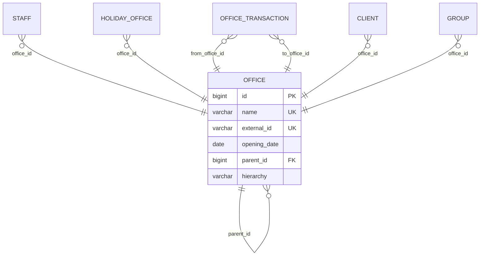
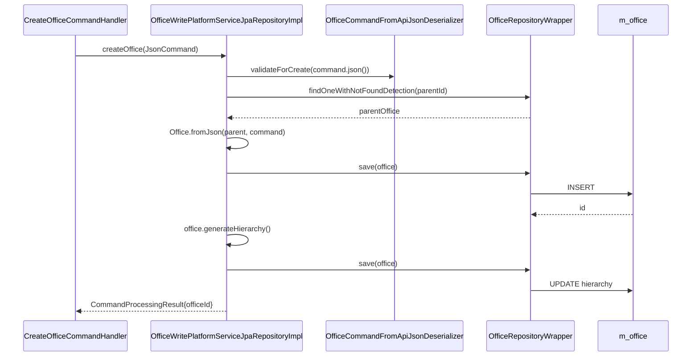

The office tree is the backbone of every Apache Fineract deployment. Each tenant has exactly one root office (the MFI or head office) and an arbitrary tree of children beneath it. Every client, group, loan, savings account, staff record, teller and journal entry is anchored to a node in that tree, and Fineract's data-scope security model filters by it. This page documents the `organisation/office/` package across `fineract-core` and `fineract-provider`.

## Where the code lives

```
fineract-core/.../organisation/office/
├── data/
│   ├── OfficeData.java
│   └── OfficeTransactionData.java
├── domain/
│   ├── Office.java                       — the entity
│   ├── OfficeRepository.java             — Spring Data
│   └── OfficeRepositoryWrapper.java      — null-safe wrapper
├── exception/
│   ├── CannotUpdateOfficeWithParentOfficeSameAsSelf.java
│   ├── OfficeNotFoundException.java
│   └── RootOfficeParentCannotBeUpdated.java
├── mapper/
└── service/
    └── OfficeReadPlatformService.java    — interface

fineract-provider/.../organisation/office/
├── api/
│   ├── OfficesApiResource.java           — /v1/offices
│   ├── OfficesApiResourceSwagger.java
│   ├── OfficeSwaggerMapper.java
│   ├── OfficeTransactionsApiResource.java — /v1/officetransactions
├── domain/
│   ├── OfficeTransaction.java            — inter-branch transfer entity
│   └── OfficeTransactionRepository.java
├── handler/
│   ├── CreateOfficeCommandHandler.java
│   ├── UpdateOfficeCommandHandler.java
│   ├── CreateOfficeTransactionCommandHandler.java
│   └── DeleteOfficeTransactionCommandHandler.java
├── serialization/
│   └── OfficeCommandFromApiJsonDeserializer.java
├── service/
│   ├── OfficeReadPlatformServiceImpl.java
│   ├── OfficeWritePlatformService.java
│   └── OfficeWritePlatformServiceJpaRepositoryImpl.java
└── starter/                              — Spring Boot autowiring
```

## The `Office` entity

`fineract-core/src/main/java/org/apache/fineract/organisation/office/domain/Office.java`

```java
@Entity
@Table(name = "m_office", uniqueConstraints = {
    @UniqueConstraint(columnNames = { "name" }, name = "name_org"),
    @UniqueConstraint(columnNames = { "external_id" }, name = "externalid_org") })
public class Office extends AbstractPersistableCustom<Long> implements Serializable {

    @OneToMany(fetch = FetchType.LAZY)
    @JoinColumn(name = "parent_id")
    private List<Office> children = new ArrayList<>();

    @ManyToOne(fetch = FetchType.LAZY)
    @JoinColumn(name = "parent_id")
    private Office parent;

    @Column(name = "name", nullable = false, length = 100)
    private String name;

    @Column(name = "hierarchy", length = 50)
    private String hierarchy;

    @Column(name = "opening_date", nullable = false)
    private LocalDate openingDate;

    @Column(name = "external_id", length = 100, unique = true)
    private ExternalId externalId;
    // ...
}
```

The shape is a textbook self-referential tree:



### The two ways to walk the tree

Fineract stores the parent edge **and** a *materialised path* on every node. Both are kept consistent by domain logic; queries use whichever shape is more convenient.

- **`parent_id`** — for "who is my immediate parent?" and ORM traversal via the lazy `parent` / `children` collections.
- **`hierarchy`** — a dotted-string materialised path like `.1.5.27.` rooted at `.`. This lets the platform answer "everything under office 5" with a single `WHERE hierarchy LIKE '.1.5.%'` predicate. It is the column that data-scope security clauses across the codebase use.

The path is regenerated whenever an office is created or re-parented, by `Office#generateHierarchy()`:

```java
public void generateHierarchy() {
    if (this.parent != null) {
        this.hierarchy = this.parent.hierarchyOf(getId());
    } else {
        this.hierarchy = ".";
    }
}

private String hierarchyOf(final Long id) {
    return this.hierarchy + id.toString() + ".";
}
```

So the head office gets `"."`, its direct children get `".1."`, grandchildren get `".1.5."`, etc.

### Invariants enforced in the entity

Three rules are enforced inside `Office` itself, each backed by an exception in `fineract-core/.../organisation/office/exception/`:

1. **The root cannot be re-parented.** Any attempt throws `RootOfficeParentCannotBeUpdated`:
   ```java
   if (command.parameterExists(parentIdParamName) && this.parent == null) {
       throw new RootOfficeParentCannotBeUpdated();
   }
   ```
2. **An office cannot be its own parent.** Enforced by `Office#update(Office newParent)` via `identifiedBy`:
   ```java
   if (identifiedBy(newParent.getId())) {
       throw new CannotUpdateOfficeWithParentOfficeSameAsSelf(getId(), newParent.getId());
   }
   ```
3. **`name` and `external_id` are globally unique.** Enforced at the DB level via `m_office`'s unique constraints; the validation layer translates the SQL exception into a friendly `PlatformDataIntegrityException`.

There is *no* explicit cycle check beyond rule (2), but because `hierarchy` is regenerated on every parent change and includes the office's own ID, a cycle would produce an infinite-length string and fail the `length = 50` column constraint. The intended workflow is to never re-parent an office that already has descendants.

## Repositories

- **`OfficeRepository`** (`fineract-core/.../organisation/office/domain/OfficeRepository.java`) — vanilla Spring Data `JpaRepository<Office, Long>` with a couple of `@Query` finders for "find by hierarchy prefix" and "find by external id".
- **`OfficeRepositoryWrapper`** — wraps `OfficeRepository` to throw `OfficeNotFoundException` on `findOneWithNotFoundDetection`. This pattern is used throughout Fineract: services consume the wrapper to keep service code free of `Optional`-unwrapping.

## Read path

`OfficeReadPlatformService` is declared in `fineract-core/.../office/service/` and implemented in `fineract-provider/.../office/service/OfficeReadPlatformServiceImpl.java`. It exposes:

```java
public interface OfficeReadPlatformService {
    Collection<OfficeData> retrieveAllOffices(boolean includeAllOffices, SearchParameters searchParameters);
    Collection<OfficeData> retrieveAllOfficesForDropdown();
    OfficeData retrieveOffice(Long officeId);
    OfficeData retrieveNewOfficeTemplate();
    Collection<OfficeData> retrieveAllowedParents(Long officeId);
    Collection<OfficeTransactionData> retrieveAllOfficeTransactions();
    OfficeTransactionData retrieveNewOfficeTransactionDetails();
    // ...
}
```

The implementation uses JdbcTemplate + a `RowMapper` rather than JPA reads, which is the Fineract convention for "list" endpoints. The "decorated name" column (`nameDecorated`) is computed by prefixing the name with non-breaking spaces proportional to the hierarchy depth — that is what UIs render as an indented tree.

`retrieveAllowedParents(officeId)` is the helper behind the parent dropdown on the edit screen. It excludes the office itself and any descendants, because re-parenting under a descendant would create a cycle.

## Write path

### `OfficesApiResource` — `/v1/offices`

`fineract-provider/src/main/java/org/apache/fineract/organisation/office/api/OfficesApiResource.java`

```java
@Path("/v1/offices")
@Component
@Tag(name = "Offices", description = "Offices are used to model an MFIs structure. ...")
public class OfficesApiResource {

    private static final Set<String> RESPONSE_DATA_PARAMETERS = new HashSet<>(
        List.of("id", "name", "nameDecorated", "externalId", "openingDate",
                "hierarchy", "parentId", "parentName", "allowedParents"));

    private static final String RESOURCE_NAME_FOR_PERMISSIONS = "OFFICE";
    // ...
}
```

| Method | Path                              | Purpose                                         |
| ------ | --------------------------------- | ----------------------------------------------- |
| GET    | `/v1/offices`                     | List offices, optional `orderBy`, `sortOrder`   |
| GET    | `/v1/offices/template`            | New-office template (allowed parents)           |
| GET    | `/v1/offices/{officeId}`          | Retrieve one office                             |
| POST   | `/v1/offices`                     | Create a child office                           |
| PUT    | `/v1/offices/{officeId}`          | Rename / re-parent / re-date                    |
| GET    | `/v1/offices/downloadtemplate`    | Excel template for bulk import                  |
| POST   | `/v1/offices/uploadtemplate`      | Upload bulk-import workbook                     |

Internally every write goes through `PortfolioCommandSourceWritePlatformService.logCommandSource(...)`, using a `CommandWrapper` built by `CommandWrapperBuilder`:

```java
// CommandWrapperBuilder.java (fineract-core)
public CommandWrapperBuilder createOffice() {
    this.actionName = ACTION_CREATE;
    this.entityName = ENTITY_OFFICE;
    this.entityId  = null;
    this.href      = "/offices/template";
    return this;
}

public CommandWrapperBuilder updateOffice(final Long officeId) {
    this.actionName = ACTION_UPDATE;
    this.entityName = ENTITY_OFFICE;
    this.entityId  = officeId;
    this.href      = "/offices/" + officeId;
    return this;
}
```

Those `(actionName, entityName)` tuples route to:

| Command name           | Handler                                                                          |
| ---------------------- | -------------------------------------------------------------------------------- |
| `CREATE_OFFICE`        | `CreateOfficeCommandHandler` → `OfficeWritePlatformService.createOffice`         |
| `UPDATE_OFFICE`        | `UpdateOfficeCommandHandler` → `OfficeWritePlatformService.updateOffice`         |
| `CREATE_OFFICETRANSACTION` | `CreateOfficeTransactionCommandHandler` → `…createOfficeTransaction`         |
| `DELETE_OFFICETRANSACTION` | `DeleteOfficeTransactionCommandHandler` → `…deleteOfficeTransaction`         |

### `OfficeWritePlatformService` implementation

`fineract-provider/.../office/service/OfficeWritePlatformServiceJpaRepositoryImpl.java` implements the actual logic. For *create*, the flow is:



Note the *two saves*: the office is persisted once to get its DB-assigned ID, then `generateHierarchy()` is called (which needs that ID) and the row is updated. This is why creating an office always produces two SQL statements.

`update` follows the same pattern. If `parentId` changes, the entity's `update(Office newParent)` is called (re-parenting + `generateHierarchy()` cascade), and then every descendant office is re-fetched and its hierarchy regenerated as well — otherwise the materialised path would be inconsistent.

## Inter-branch transfers — `OfficeTransaction`

`fineract-provider/src/main/java/org/apache/fineract/organisation/office/domain/OfficeTransaction.java` models a one-way value transfer between two offices:

```java
@Entity
@Table(name = "m_office_transaction")
public class OfficeTransaction extends AbstractPersistableCustom<Long> {

    @ManyToOne(fetch = FetchType.LAZY)
    @JoinColumn(name = "from_office_id")
    private Office from;

    @ManyToOne(fetch = FetchType.LAZY)
    @JoinColumn(name = "to_office_id")
    private Office to;

    @Column(name = "transaction_date", nullable = false)
    private LocalDate transactionDate;

    @Embedded
    private MonetaryCurrency currency;

    @Column(name = "transaction_amount", scale = 6, precision = 19, nullable = false)
    private BigDecimal transactionAmount;

    @Column(name = "description", nullable = true, length = 100)
    private String description;
    // ...
}
```

`from` may be null — this is the convention for "deposit cash into this office from outside". `to` may likewise be null for "withdraw from this office to the outside". The `MonetaryCurrency` is embedded directly (not a foreign key), because Fineract embeds currency on every monetary entity. See [Monetary &amp; currencies](/organisation/monetary-and-currencies).

### `/v1/officetransactions`

`OfficeTransactionsApiResource` exposes:

```java
@Path("/v1/officetransactions")
public class OfficeTransactionsApiResource {

    private static final Set<String> RESPONSE_DATA_PARAMETERS = new HashSet<>(
        Arrays.asList("id", "transactionDate",
                      "fromOfficeId", "fromOfficeName",
                      "toOfficeId",   "toOfficeIdName",
                      "currencyCode", "digitsAfterDecimal", "inMultiplesOf",
                      "transactionAmount", "description",
                      "allowedOffices", "currencyOptions"));

    private static final String RESOURCE_NAME_FOR_READ_PERMISSIONS = "OFFICE";
    // ...
}
```

| Method | Path                                       | Purpose                            |
| ------ | ------------------------------------------ | ---------------------------------- |
| GET    | `/v1/officetransactions`                   | List all transfers                 |
| GET    | `/v1/officetransactions/template`          | Template (allowed offices + currencies) |
| POST   | `/v1/officetransactions`                   | Record a transfer                  |
| DELETE | `/v1/officetransactions/{transactionId}`   | Soft-delete a transfer             |

The list endpoint deliberately permission-checks against `OFFICE` rather than a dedicated `OFFICETRANSACTION` permission — branch transfers are considered "what you can see if you can see the offices involved".

### How transfers integrate with accounting

The branch-transfer flow is intentionally simple: it records the movement but does **not** post a `JournalEntry`. If the deployment uses cash/accrual accounting, the equivalent journal posting goes through the teller cash management path (`fineract-branch` — see [Tellers &amp; cashiers](/organisation/tellers-and-cashiers)) or through manual journal entries. `OfficeTransaction` is essentially a memo-line for non-accounting branch cash movements.

## Bulk import

`OfficesApiResource` ties in the platform-wide `BulkImportWorkbookService` and `BulkImportWorkbookPopulatorService`:

```java
@POST
@Path("uploadtemplate")
@Consumes(MediaType.MULTIPART_FORM_DATA)
public Long postTemplate(@FormDataParam("file") InputStream uploadedInputStream,
                         @FormDataParam("file") FormDataContentDisposition fileDetail,
                         @FormDataParam("locale") String locale,
                         @FormDataParam("dateFormat") String dateFormat) {
    return bulkImportWorkbookService.importWorkbook(
        GlobalEntityType.OFFICES.toString(),
        uploadedInputStream, fileDetail, locale, dateFormat);
}
```

The workbook contract — column headers, validation, lookup of parent offices by name — is defined under `fineract-provider/.../infrastructure/bulkimport/populator/` and `…/importhandler/`.

## Permissions

| Permission code            | Purpose                                       |
| -------------------------- | --------------------------------------------- |
| `READ_OFFICE`              | List / retrieve offices                       |
| `CREATE_OFFICE`            | Create a child office                         |
| `CREATE_OFFICE_CHECKER`    | Maker-checker approval for office creation    |
| `UPDATE_OFFICE`            | Rename / re-parent / re-date                  |
| `UPDATE_OFFICE_CHECKER`    | Maker-checker approval for office updates     |
| `CREATE_OFFICETRANSACTION` | Record an inter-branch transfer               |
| `DELETE_OFFICETRANSACTION` | Soft-delete a transfer                        |

The `_CHECKER` variants are how Fineract's maker-checker (four-eyes) flow is opted into per resource and per command type. See the `infrastructure/security/` and `commands/` documentation for the underlying mechanism.

## Common pitfalls

<Warning>
**Renaming an office that has descendants does not propagate.** The `name` column is on the office row itself; descendants are unaffected. But re-parenting (changing `parentId`) **does** propagate via `generateHierarchy()` and rewrites the `hierarchy` of every descendant. If your reports / security clauses rely on `hierarchy LIKE '.1.5.%'`, those clauses must be rebuilt after any re-parent.
</Warning>

<Warning>
**`hierarchy` has a hard length limit of 50 characters.** Deeply nested trees (more than ~10–12 levels for typical 6–8-digit IDs) will fail the `length = 50` column constraint. In practice MFI org structures never come close to this, but multi-tenant aggregator deployments occasionally do.
</Warning>

<Warning>
**Data-scope security relies on `hierarchy`.** When a user authenticates, `fineract-security` resolves their office and uses `office.hierarchy` as a `LIKE` filter on every read. Bypassing `OfficeRepositoryWrapper` or constructing `Office` instances outside the platform commands flow will leave the field null, which breaks visibility for everyone in the subtree.
</Warning>

## See also

- [Staff](/organisation/staff) — staff records anchor to `office_id`.
- [Holidays](/organisation/holidays) — `Holiday` ⇄ `Office` is many-to-many.
- [Tellers &amp; cashiers](/organisation/tellers-and-cashiers) — `Teller.office_id` is mandatory.
- [Provisioning](/organisation/provisioning) — `LoanProductProvisioningEntry.office_id` partitions the loanloss run.
