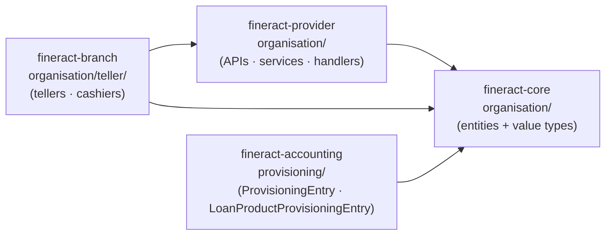
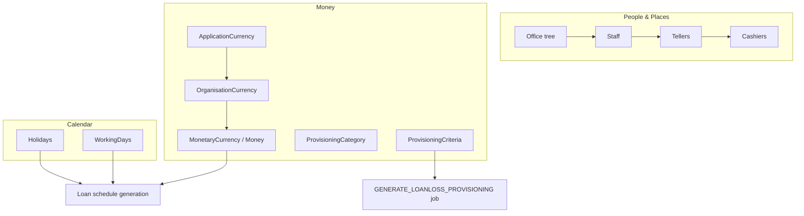
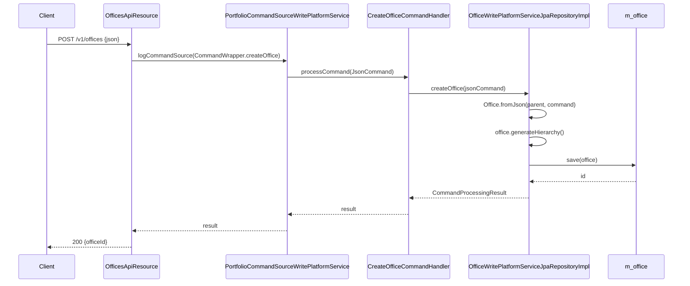

The `organisation` subsystem of Apache Fineract models the *MFI itself*: its branch tree, the people who work there, the calendar against which loans accrue and repay, the currencies it transacts in, the provisioning rules it applies to its loan book, and (in the optional `fineract-branch` module) the tellers and cashiers that move physical cash. This page is the index for those concerns — every other page under `organisation/` zooms into one sub-package.

## Two physical homes

Unlike most Fineract domains, `organisation` is not confined to a single Gradle module. It is split between two modules plus a sliver of `fineract-core`:

<CardGroup cols={2}>
  <Card title="fineract-provider" icon="server">
    The primary home. Contains the REST resources, write services, command handlers, deserializers and starter wiring for all sub-packages **except** tellers.

    Path: `fineract-provider/src/main/java/org/apache/fineract/organisation/`
  </Card>
  <Card title="fineract-branch" icon="building-columns">
    An *opt-in* module that adds branch-level cash management — tellers, cashiers, cashier transactions, teller journals.

    Path: `fineract-branch/src/main/java/org/apache/fineract/organisation/teller/`
  </Card>
</CardGroup>

A third leg sits in `fineract-core/src/main/java/org/apache/fineract/organisation/`. This is where the JPA entities and primitive value types live — `Office`, `Staff`, `Holiday`, `WorkingDays`, `MonetaryCurrency`, `Money`, `ApplicationCurrency`, `OrganisationCurrency`, plus their `Repository` / `RepositoryWrapper` companions. Putting them in `fineract-core` lets every other module (`fineract-portfolio`, `fineract-loan`, `fineract-savings`, `fineract-accounting`, `fineract-branch`) depend on them without pulling in the provider.



<Info>
`ProvisioningEntry` and `LoanProductProvisioningEntry` are the *posted history* of a provisioning run and they live under `fineract-accounting/.../accounting/provisioning/` — not under `organisation/provisioning/`. The pages here keep the convention that "categories and criteria are organisation, posted entries and journal entries are accounting". See [Provisioning](/organisation/provisioning) for the full split.
</Info>

## Sub-package inventory

The tree under `fineract-provider/.../organisation/` is:

```
organisation/
├── holiday/        — Holiday entity + APIs; feeds APPLY_HOLIDAYS_TO_LOANS job
├── monetary/       — write-side currency configuration (read side is in -core)
├── office/         — Office tree + OfficeTransaction (inter-branch transfers)
├── provisioning/   — ProvisioningCategory + ProvisioningCriteria (rules only)
├── staff/          — Staff records, loan-officer flag, bulk import
├── teller/         — empty placeholder (real code is in fineract-branch)
└── workingdays/    — single-row WorkingDays config + reschedule rules
```

And the shared abstractions in `fineract-core/.../organisation/`:

```
organisation/
├── holiday/        — Holiday entity, HolidayStatusType, RescheduleType
├── monetary/       — MonetaryCurrency, Money, ApplicationCurrency,
│                     OrganisationCurrency, MoneyHelper, repositories
├── office/         — Office, OfficeRepository(Wrapper), OfficeReadPlatformService,
│                     OfficeNotFoundException, CannotUpdateOfficeWithParent…
├── provisioning/   — service interfaces, data DTOs, exception types
├── staff/          — Staff, StaffEnumerations, StaffOrganisationalRoleType
└── workingdays/    — WorkingDays, WorkingDaysEnumerations, RepaymentRescheduleType,
                      AdjustedDateDetailsDTO
```

## Conceptual map

The seven sub-packages are not independent. They compose into roughly three layers:



### People & places

`Office` is the root and is referenced *everywhere* — by `Staff.office_id`, by `Holiday.m_holiday_office`, by `Client.office_id`, by `Group.office_id`, by `Loan.loan_officer_id` (indirectly via `Staff`), by `Teller.office_id`, by `LoanProductProvisioningEntry.office_id` and by `OfficeTransaction.from_office_id` / `to_office_id`. Self-referential via `parent_id`, with a materialised `hierarchy` string column (`.1.5.27.`) that supports prefix queries for "this office and everything beneath it".

Staff belongs to an office and may be flagged `is_loan_officer = true`, in which case it becomes eligible for loan-officer assignment on client and loan records. Beyond that flag, the `organisational_role_enum` and self-referential `organisational_role_parent_staff_id` model an org chart.

Tellers are owned by an office; cashiers are owned by a teller and worked by a staff; cashier transactions are the cash-movement ledger underneath the teller. All three entities live in `fineract-branch`.

### Calendar

Two independent sources of "is this date workable?":

- `WorkingDays` (`fineract-core/.../workingdays/domain/WorkingDays.java`) — a *single row* in `m_working_days` carrying a textual `recurrence` (an iCal `BYDAY` expression like `FREQ=WEEKLY;INTERVAL=1;BYDAY=MO,TU,WE,TH,FR`), a `repaymentReschedulingType` enum and two booleans controlling term extension.
- `Holiday` — many rows in `m_holiday`, each scoped to a set of offices via `m_holiday_office`, with a `from_date` / `to_date` window and a `repayments_rescheduled_to` target date.

Both feed into the loan schedule generator. The `APPLY_HOLIDAYS_TO_LOANS` scheduler job (`fineract-provider/.../portfolio/loanaccount/jobs/applyholidaystoloans/`) walks unprocessed holidays and rewrites the installments of every active/approved/pending loan in the affected offices, gated by the global config `reschedule-repayments-on-holidays`.

### Money

`ApplicationCurrency` (table `m_currency`) is the catalogue of every currency the platform knows about — populated from a Liquibase changeset. `OrganisationCurrency` (table `m_organisation_currency`) is the subset the *tenant* has enabled. `MonetaryCurrency` is the JPA `@Embeddable` value stored on every loan, savings account, charge, etc. `Money` is the immutable amount-plus-currency type that all arithmetic flows through, with rounding driven by `MoneyHelper` and the tenant config key `fineract.tenant.config.rounding-mode` (defined in `fineract-provider/src/main/resources/application.properties`, line 65).

### Provisioning

`ProvisioningCategory` is a named bucket ("Standard", "Substandard", "Doubtful", "Loss"). `ProvisioningCriteria` ties a set of (loan product, overdue band, category, percentage, liability GL, expense GL) tuples together. Both live under `organisation/provisioning/`. Running the criteria — i.e. producing the *postable* numbers as a `ProvisioningEntry` with one `LoanProductProvisioningEntry` row per (office, product, category) cell — happens in `fineract-accounting/.../accounting/provisioning/` and is wired into the `GENERATE_LOANLOSS_PROVISIONING` Spring Batch job (`fineract-provider/.../portfolio/loanaccount/jobs/generateloanlossprovisioning/GenerateLoanlossProvisioningConfig.java`).

## REST surface

All organisation REST resources sit under `/v1/`. They are all Jersey-registered components.

| Path                          | Resource class                                                                                  | Module            |
| ----------------------------- | ----------------------------------------------------------------------------------------------- | ----------------- |
| `/v1/offices`                 | `OfficesApiResource`                                                                            | fineract-provider |
| `/v1/officetransactions`      | `OfficeTransactionsApiResource`                                                                 | fineract-provider |
| `/v1/staff`                   | `StaffApiResource`                                                                              | fineract-provider |
| `/v1/holidays`                | `HolidaysApiResource`                                                                           | fineract-provider |
| `/v1/workingdays`             | `WorkingDaysApiResource`                                                                        | fineract-provider |
| `/v1/currencies`              | `CurrenciesApiResource`                                                                         | fineract-core     |
| `/v1/provisioningcategory`    | `ProvisioningCategoryApiResource`                                                               | fineract-provider |
| `/v1/provisioningcriteria`    | `ProvisioningCriteriaApiResource`                                                               | fineract-provider |
| `/v1/provisioningentries`     | `ProvisioningEntriesApiResource`                                                                | fineract-accounting |
| `/v1/tellers`                 | `TellerApiResource`                                                                             | fineract-branch   |
| `/v1/cashiers`                | `CashierApiResource`                                                                            | fineract-branch   |
| `/v1/cashiersjournal`         | `TellerJournalApiResource`                                                                      | fineract-branch   |

## Command flow

Every mutation in the organisation subsystem follows Fineract's standard CQRS pattern. The REST layer builds a `CommandWrapper` via `CommandWrapperBuilder`, posts it to `PortfolioCommandSourceWritePlatformService.logCommandSource(...)`, which persists a `CommandSource` row and dispatches to a `*CommandHandler` (one per command type). The handler delegates to the package's `WritePlatformService` implementation.

For example, creating an office hits this chain:



Newer packages (notably `staff` and `workingdays`) bypass `PortfolioCommandSourceWritePlatformService` and use the leaner `CommandDispatcher` from `fineract-command-core`. See the relevant page for the wiring.

## How the pages are organised

<CardGroup cols={2}>
  <Card title="Offices &amp; hierarchy" icon="sitemap" href="/organisation/offices-and-hierarchy">
    `Office` entity, materialised `hierarchy` column, parent-child constraints, `OfficesApiResource`, `OfficeTransactionsApiResource`.
  </Card>
  <Card title="Staff" icon="user-tie" href="/organisation/staff">
    `Staff` entity, loan-officer flag, organisational roles, `StaffApiResource`, bulk import.
  </Card>
  <Card title="Holidays" icon="calendar-xmark" href="/organisation/holidays">
    `Holiday` entity, status lifecycle, `APPLY_HOLIDAYS_TO_LOANS` job and how loan schedules get rewritten.
  </Card>
  <Card title="Working days" icon="calendar-days" href="/organisation/working-days">
    Single-row `WorkingDays` config, `RepaymentRescheduleType`, term-extension toggles.
  </Card>
  <Card title="Monetary &amp; currencies" icon="dollar-sign" href="/organisation/monetary-and-currencies">
    `ApplicationCurrency` vs `OrganisationCurrency`, the embedded `MonetaryCurrency`, the `Money` value type and tenant-scoped rounding.
  </Card>
  <Card title="Provisioning" icon="layer-group" href="/organisation/provisioning">
    `ProvisioningCategory`, `ProvisioningCriteria` and how `GENERATE_LOANLOSS_PROVISIONING` posts `LoanProductProvisioningEntry` rows.
  </Card>
  <Card title="Tellers &amp; cashiers" icon="cash-register" href="/organisation/tellers-and-cashiers">
    `fineract-branch` only: `Teller`, `Cashier`, `CashierTransaction`, allocate/settle command handlers, `/v1/tellers` and `/v1/cashiersjournal`.
  </Card>
</CardGroup>

## Cross-references into other subsystems

Each organisation entity has at least one consumer outside the subsystem:

- **`Office`** is referenced by `Client.office_id`, `Group.office_id`, `Loan` (via client/group), `SavingsAccount` (via client/group), `Teller.office_id`, every report that scopes by branch, and every accounting `JournalEntry` (table `acc_gl_journal_entry.office_id`). The `hierarchy` string is what powers data-scope security — `fineract-security` filters reads by it.
- **`Staff`** is referenced by `Client.staff_id`, `Group.staff_id`, `Loan.loan_officer_id`, `SavingsAccount.field_officer_id` and `Cashier.staff_id`.
- **`MonetaryCurrency`** is `@Embedded` into `LoanProduct`, `Loan`, `SavingsProduct`, `SavingsAccount`, `ShareProduct`, `Charge`, `OfficeTransaction`, and most accounting tables — it is the most-embedded value type in the codebase.
- **`Holiday`** and **`WorkingDays`** feed into `fineract-provider/.../portfolio/loanaccount/loanschedule/domain/DefaultScheduledDateGenerator.java` and the `AdjustedDateDetailsDTO` carrier in `fineract-core/.../workingdays/data/`.
- **`ProvisioningCriteria`** is consumed by `LoanProduct.provisioningCriteria` (via the `m_loanproduct_provisioning_mapping` join in `LoanProductProvisionCriteria`) and by the loanloss job.

Open the per-page deep dives below for entity diagrams, table names, command names, and the actual handler/service classes that implement each flow.
