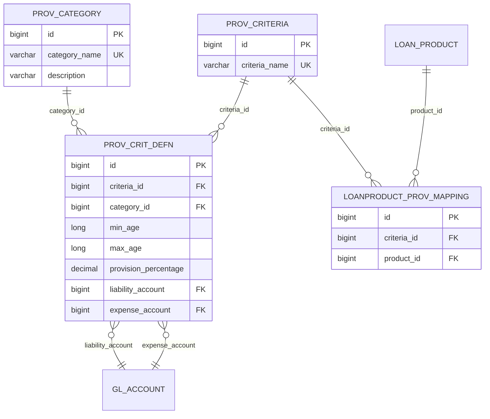

Loan-loss provisioning in Apache Fineract is a two-stage pipeline. Stage one is a *rules engine* — a small set of categories ("Standard", "Substandard", "Doubtful", "Loss") and criteria tables that say "for loan product X, when an installment is overdue by 30–60 days, reserve 25% to liability GL Y / expense GL Z". Stage two is a *batch job* that walks every active loan, evaluates the rules, and posts a `ProvisioningEntry` with one `LoanProductProvisioningEntry` row per (office, product, category) cell. The rules live under `organisation/provisioning/`; the posted entries live under `accounting/provisioning/`. This page documents both halves.

## Where the code lives

```
fineract-provider/.../organisation/provisioning/   — RULES (this page)
├── api/
│   ├── ProvisioningCategoryApiResource.java       — /v1/provisioningcategory
│   ├── ProvisioningCriteriaApiResource.java       — /v1/provisioningcriteria
│   └── ProvisioningCriteriaApiResourceSwagger.java
├── constants/
│   └── ProvisioningCriteriaConstants.java
├── data/
│   ├── ProvisioningCriteriaData.java
│   └── ProvisioningCriteriaDefinitionData.java
├── domain/
│   ├── LoanProductProvisionCriteria.java          — loan product ⇄ criteria
│   ├── ProvisioningCategory.java                  — m_provision_category
│   ├── ProvisioningCategoryRepository.java
│   ├── ProvisioningCriteria.java                  — m_provisioning_criteria
│   ├── ProvisioningCriteriaDefinition.java        — per-category band
│   ├── ProvisioningCriteriaDefinitionRepository.java
│   └── ProvisioningCriteriaRepository.java
├── exception/
├── handler/
│   ├── CreateProvisioningCategoryRequestCommandHandler.java
│   ├── UpdateProvisioningCategoryRequestCommandHandler.java
│   ├── DeleteProvisioningCategoryRequestCommandHandler.java
│   ├── CreateProvisioningCriteriaRequestCommandHandler.java
│   ├── UpdateProvisioningCriteriaRequestCommandHandler.java
│   └── DeleteProvisioningCriteriaRequestCommandHandler.java
├── serialization/
└── service/
    ├── ProvisioningCategoryReadPlatformServiceImpl.java
    ├── ProvisioningCategoryWritePlatformServiceJpaRepositoryImpl.java
    ├── ProvisioningCriteriaAssembler.java
    ├── ProvisioningCriteriaReadPlatformService.java
    ├── ProvisioningCriteriaReadPlatformServiceImpl.java
    └── ProvisioningCriteriaWritePlatformServiceJpaRepositoryImpl.java

fineract-provider/.../accounting/provisioning/    — POSTED ENTRIES
├── domain/
│   ├── ProvisioningEntry.java                     — m_provisioning_history
│   ├── ProvisioningEntryRepository.java
│   └── LoanProductProvisioningEntry.java          — m_loanproduct_provisioning_entry
├── handler/
│   ├── CreateProvisioningEntriesRequestCommandHandler.java
│   ├── CreateProvisioningJournalEntriesRequestCommandHandler.java
│   └── ReCreateProvisioningEntryRequestCommandHandler.java
└── service/
    └── ProvisioningEntriesWritePlatformServiceJpaRepositoryImpl.java

fineract-accounting/.../accounting/provisioning/
├── api/
│   └── ProvisioningEntriesApiResource.java        — /v1/provisioningentries
└── data/
    ├── LoanProductProvisioningEntryData.java
    └── ProvisioningEntryData.java

fineract-provider/.../portfolio/loanaccount/jobs/generateloanlossprovisioning/
├── GenerateLoanlossProvisioningConfig.java        — Spring Batch wiring
└── GenerateLoanlossProvisioningTasklet.java       — the actual driver
```

<Note>
The split is deliberate. **`organisation/provisioning/` owns the rules** — categories and criteria are organisational/configurational. **`accounting/provisioning/` owns the postings** — the per-run history rows naturally belong with the accounting module that consumes them via journal entries.
</Note>

## Stage 1: the rules

### Three rule entities



#### `ProvisioningCategory`

`fineract-provider/src/main/java/org/apache/fineract/organisation/provisioning/domain/ProvisioningCategory.java`

```java
@Entity
@Table(name = "m_provision_category", uniqueConstraints = {
    @UniqueConstraint(columnNames = { "category_name" }, name = "category_name") })
public class ProvisioningCategory extends AbstractPersistableCustom<Long> {
    @Column(name = "category_name", nullable = false, unique = true)
    private String categoryName;

    @Column(name = "description", nullable = true)
    private String categoryDescription;
    // ...
}
```

Categories are just named labels with descriptions — no percentages, no GL accounts, no aging rules. The percentages and GLs live on `ProvisioningCriteriaDefinition`, because the same category can mean "1% reserve via GL 12001" under one criteria set and "2% reserve via GL 12002" under another.

#### `ProvisioningCriteria`

`fineract-provider/.../organisation/provisioning/domain/ProvisioningCriteria.java`

```java
@Entity
@Table(name = "m_provisioning_criteria", uniqueConstraints = {
    @UniqueConstraint(columnNames = { "criteria_name" }, name = "criteria_name") })
public class ProvisioningCriteria extends AbstractAuditableCustom {

    @Column(name = "criteria_name", nullable = false)
    private String criteriaName;

    @OneToMany(cascade = CascadeType.ALL, mappedBy = "criteria", orphanRemoval = true, fetch = FetchType.EAGER)
    Set<ProvisioningCriteriaDefinition> provisioningCriteriaDefinition = new HashSet<>();

    @OneToMany(cascade = CascadeType.ALL, mappedBy = "criteria", orphanRemoval = true, fetch = FetchType.EAGER)
    Set<LoanProductProvisionCriteria> loanProductMapping = new HashSet<>();
    // ...
}
```

A criteria is the *root* of a rule bundle. It owns:

- A `Set<ProvisioningCriteriaDefinition>` — the per-category bands (the actual rules).
- A `Set<LoanProductProvisionCriteria>` — the loan products it applies to.

#### `ProvisioningCriteriaDefinition`

`fineract-provider/.../organisation/provisioning/domain/ProvisioningCriteriaDefinition.java`

```java
@Entity
@Table(name = "m_provisioning_criteria_definition")
public class ProvisioningCriteriaDefinition extends AbstractPersistableCustom<Long> {

    @ManyToOne(optional = false)
    @JoinColumn(name = "criteria_id", referencedColumnName = "id", nullable = false)
    private ProvisioningCriteria criteria;

    @ManyToOne
    @JoinColumn(name = "category_id", nullable = false)
    private ProvisioningCategory provisioningCategory;

    @Column(name = "min_age", nullable = false) private Long minimumAge;
    @Column(name = "max_age", nullable = false) private Long maximumAge;

    @Column(name = "provision_percentage", nullable = false)
    private BigDecimal provisioningPercentage;

    @ManyToOne
    @JoinColumn(name = "liability_account", nullable = false)
    private GLAccount liabilityAccount;

    @ManyToOne
    @JoinColumn(name = "expense_account", nullable = false)
    private GLAccount expenseAccount;
    // ...
}
```

This is the real rule. One row says: "loans with an overdue age between `min_age` and `max_age` days fall into `category` at `provision_percentage`%; reserve to `liability_account`, expense to `expense_account`". A typical criteria has 4–5 of these rows covering 0–30, 31–90, 91–180, 181+ days.

#### `LoanProductProvisionCriteria`

```java
@Entity
@Table(name = "m_loanproduct_provisioning_mapping", uniqueConstraints = {
    @UniqueConstraint(columnNames = { "product_id" }, name = "product_id") })
public class LoanProductProvisionCriteria extends AbstractPersistableCustom<Long> {

    @ManyToOne(optional = false)
    @JoinColumn(name = "criteria_id", nullable = false) private ProvisioningCriteria criteria;

    @ManyToOne(optional = false)
    @JoinColumn(name = "product_id",  nullable = false) private LoanProduct loanProduct;
    // ...
}
```

The unique constraint on `product_id` is significant: **each loan product can be mapped to at most one criteria**. You cannot have two different rule bundles racing for the same product.

### REST: `/v1/provisioningcategory`

`fineract-provider/.../organisation/provisioning/api/ProvisioningCategoryApiResource.java`

| Method | Path                                  | Purpose                       |
| ------ | ------------------------------------- | ----------------------------- |
| GET    | `/v1/provisioningcategory`            | List all categories           |
| POST   | `/v1/provisioningcategory`            | Create                        |
| PUT    | `/v1/provisioningcategory/{id}`       | Update name/description       |
| DELETE | `/v1/provisioningcategory/{id}`       | Delete (fails if in use)      |

Routed via `CommandWrapperBuilder.createProvisioningCategory()` / `updateProvisioningCategory(id)` / `deleteProvisioningCategory(id)` → respective `*RequestCommandHandler` → `ProvisioningCategoryWritePlatformServiceJpaRepositoryImpl`.

### REST: `/v1/provisioningcriteria`

`fineract-provider/.../organisation/provisioning/api/ProvisioningCriteriaApiResource.java`

| Method | Path                                  | Purpose                                |
| ------ | ------------------------------------- | -------------------------------------- |
| GET    | `/v1/provisioningcriteria`            | List all criteria                      |
| GET    | `/v1/provisioningcriteria/template`   | Categories + GL accounts + products for the wizard |
| GET    | `/v1/provisioningcriteria/{id}`       | One criteria, optionally with template |
| POST   | `/v1/provisioningcriteria`            | Create                                 |
| PUT    | `/v1/provisioningcriteria/{id}`       | Update                                 |
| DELETE | `/v1/provisioningcriteria/{id}`       | Delete (fails if loan products mapped) |

The template endpoint pre-populates the maintenance UI with available `ProvisioningCategory` rows, `GLAccount` rows (filtered to LIABILITY and EXPENSE types), and `LoanProduct` rows that are not yet mapped.

Required fields on create: `criteriaName`, `provisioningcriteria` (the array of definition rows). Optional: `loanProducts` (the array of products to map). Each definition needs `categoryId`, `minAge`, `maxAge`, `provisioningPercentage`, `liabilityAccount`, `expenseAccount`.

Assembly is delegated to `ProvisioningCriteriaAssembler` (`fineract-provider/.../organisation/provisioning/service/ProvisioningCriteriaAssembler.java`), which looks up GL accounts and validates that the age bands tile `[0, ∞)` without gaps.

## Stage 2: the posted entries

### `ProvisioningEntry`

`fineract-provider/.../accounting/provisioning/domain/ProvisioningEntry.java`

```java
@Entity
@Table(name = "m_provisioning_history")
public class ProvisioningEntry extends AbstractPersistableCustom<Long> {

    @Column(name = "journal_entry_created")
    private Boolean isJournalEntryCreated;

    @OneToMany(cascade = CascadeType.ALL, mappedBy = "entry", orphanRemoval = true, fetch = FetchType.EAGER)
    private Set<LoanProductProvisioningEntry> provisioningEntries = new HashSet<>();

    @OneToOne @JoinColumn(name = "createdby_id")    private AppUser createdBy;
    @Column(name = "created_date")                  private LocalDate createdDate;
    @OneToOne @JoinColumn(name = "lastmodifiedby_id")private AppUser lastModifiedBy;
    @Column(name = "lastmodified_date")             private LocalDate lastModifiedDate;
}
```

Each row is a single *run* — the result of evaluating all criteria against all loans on a given business date. `isJournalEntryCreated` flags whether the run's corresponding `JournalEntry` rows have been posted to the GL.

### `LoanProductProvisioningEntry`

`fineract-provider/.../accounting/provisioning/domain/LoanProductProvisioningEntry.java`

```java
@Entity
@Table(name = "m_loanproduct_provisioning_entry")
public class LoanProductProvisioningEntry extends AbstractPersistableCustom<Long> {

    @ManyToOne(optional = false)
    @JoinColumn(name = "history_id", referencedColumnName = "id", nullable = false)
    private ProvisioningEntry entry;

    @Column(name = "criteria_id", nullable = false) private Long criteriaId;

    @ManyToOne @JoinColumn(name = "office_id",   nullable = false) private Office office;
    @Column(name = "currency_code", length = 3)                    private String currencyCode;
    @ManyToOne @JoinColumn(name = "product_id",  nullable = false) private LoanProduct loanProduct;
    @ManyToOne @JoinColumn(name = "category_id", nullable = false) private ProvisioningCategory provisioningCategory;

    @Column(name = "overdue_in_days", nullable = false) private Long overdueInDays;
    @Column(name = "reseve_amount",   nullable = false) private BigDecimal reservedAmount;

    @ManyToOne @JoinColumn(name = "liability_account", nullable = false) private GLAccount liabilityAccount;
    @ManyToOne @JoinColumn(name = "expense_account",   nullable = false) private GLAccount expenseAccount;
}
```

The cell. One row per (office × product × category) tuple, carrying:

- The applied criteria (frozen by id).
- The currency the loans were denominated in.
- The maximum `overdueInDays` that hit this cell.
- The `reservedAmount` — the sum of `(outstanding × percentage / 100)` across all loans that fell into the cell.
- The liability/expense GL pair, frozen by FK at posting time so subsequent criteria edits don't retro-rewrite history.

(Note: the column `reseve_amount` is misspelled in the schema. The Java field is `reservedAmount`; queries must spell the column as in the DB.)

### `/v1/provisioningentries`

`fineract-accounting/.../accounting/provisioning/api/ProvisioningEntriesApiResource.java`

```java
@Path("/v1/provisioningentries")
@Tag(name = "Provisioning Entries", description = """
    This defines the Provisioning Entries for all active loan products
    ...
    date            Date on which day provisioning entries should be created
    createjournalentries  Boolean variable whether to add journal entries for generated provisioning entries
""")
```

| Method | Path                                                 | Purpose                                            |
| ------ | ---------------------------------------------------- | -------------------------------------------------- |
| POST   | `/v1/provisioningentries`                            | Generate a new `ProvisioningEntry` for `date`      |
| POST   | `/v1/provisioningentries/{entryId}?command=createjournalentry` | Post the JEs for an existing entry        |
| POST   | `/v1/provisioningentries/{entryId}?command=recreateprovisioningentry` | Rebuild a previously-created entry  |
| GET    | `/v1/provisioningentries`                            | List runs                                          |
| GET    | `/v1/provisioningentries/{entryId}`                  | One run                                            |
| GET    | `/v1/provisioningentries/entries?entryId=...`        | Paginated cell rows for a given run                |

The split between "generate" and "post journal entries" lets MFIs review reserves before they hit the GL.

## The `GENERATE_LOANLOSS_PROVISIONING` job

`fineract-provider/src/main/java/org/apache/fineract/portfolio/loanaccount/jobs/generateloanlossprovisioning/GenerateLoanlossProvisioningTasklet.java`

```java
@Override
public RepeatStatus execute(StepContribution contribution, ChunkContext chunkContext) throws Exception {
    LocalDate currentDate = DateUtils.getBusinessLocalDate();
    boolean addJournalEntries = true;
    try {
        Collection<ProvisioningCriteriaData> criteriaCollection =
            provisioningCriteriaReadPlatformService.retrieveAllProvisioningCriterias();
        if (CollectionUtils.isNotEmpty(criteriaCollection)) {
            provisioningEntriesWritePlatformService.createProvisioningEntry(currentDate, addJournalEntries);
        }
    } catch (ProvisioningEntryAlreadyCreatedException e) {
        log.error("Provisioning entry already created", e);
    } catch (Exception e) {
        log.error("Problem occurred when generating provisioning entries", e);
    }
    return RepeatStatus.FINISHED;
}
```

And the Spring Batch wiring:

```java
@Bean
public Job generateLoanlossProvisioningJob() {
    return new JobBuilder(JobName.GENERATE_LOANLOSS_PROVISIONING.name(), jobRepository)
        .start(generateLoanlossProvisioningStep())
        .incrementer(new RunIdIncrementer())
        .build();
}
```

`JobName.GENERATE_LOANLOSS_PROVISIONING` is the registered name in `fineract-core/.../infrastructure/jobs/service/JobName.java`.

### Execution flow

```mermaid
flowchart TD
  tick([cron tick]) --> read[retrieveAllProvisioningCriterias]
  read --> empty{any criteria?}
  empty -- no --> done([FINISHED])
  empty -- yes --> create[createProvisioningEntry<br/>businessDate, addJournalEntries=true]
  create --> walk[walk every active loan]
  walk --> classify[classify by overdue age<br/>against criteria band]
  classify --> accumulate[sum into (office, product, category) cells]
  accumulate --> persist[INSERT m_provisioning_history<br/>INSERT m_loanproduct_provisioning_entry]
  persist --> je{addJournalEntries?}
  je -- yes --> post[post JournalEntry per cell:<br/>DR expense_account<br/>CR liability_account]
  je -- no --> done2([FINISHED])
  post --> done2
```

### What the job does on duplicate

`ProvisioningEntryAlreadyCreatedException` is caught and merely logged. Re-running the job on the same business date does **not** rebuild the entry — you have to call `?command=recreateprovisioningentry` explicitly.

## Linkage to GL accounts

Provisioning is one of three subsystems in Fineract that writes directly to the chart of accounts (the other two are journal entries and loan/saving posting). The linkage is via `GLAccount` foreign keys on `ProvisioningCriteriaDefinition` (`liability_account`, `expense_account`) and replicated onto each `LoanProductProvisioningEntry` row. When the job posts journal entries, it produces:

```
DEBIT  expense_account    reservedAmount
CREDIT liability_account  reservedAmount
```

for each cell in the run. The journal entries are tied back to the source by `referenceNumber` containing the `ProvisioningEntry.id`.

`GLAccount` itself lives in `fineract-accounting/.../accounting/glaccount/domain/GLAccount.java`. The chart-of-accounts maintenance is out of scope for this page.

## Command names

From `CommandWrapperBuilder` (`fineract-core/.../commands/service/`):

| Command                                  | Entity                        | Action     |
| ---------------------------------------- | ----------------------------- | ---------- |
| `CREATE_PROVISIONINGCATEGORY`            | `PROVISIONINGCATEGORY`        | CREATE     |
| `UPDATE_PROVISIONINGCATEGORY`            | `PROVISIONINGCATEGORY`        | UPDATE     |
| `DELETE_PROVISIONINGCATEGORY`            | `PROVISIONINGCATEGORY`        | DELETE     |
| `CREATE_PROVISIONINGCRITERIA`            | `PROVISIONINGCRITERIA`        | CREATE     |
| `UPDATE_PROVISIONINGCRITERIA`            | `PROVISIONINGCRITERIA`        | UPDATE     |
| `DELETE_PROVISIONINGCRITERIA`            | `PROVISIONINGCRITERIA`        | DELETE     |
| `CREATE_PROVISIONINGENTRIES`             | `PROVISIONINGENTRIES`         | CREATE     |
| `CREATEPROVISIONINGJOURNALENTRIES_PROVISIONINGENTRIES` | `PROVISIONINGENTRIES` | CREATEPROVISIONINGJOURNALENTRIES |
| `RECREATEPROVISIONINGENTRY_PROVISIONINGENTRIES` | `PROVISIONINGENTRIES` | RECREATEPROVISIONINGENTRY |

## Permissions

| Code                          | Purpose                                |
| ----------------------------- | -------------------------------------- |
| `READ_PROVISIONINGCATEGORY`   | List/retrieve categories               |
| `CREATE_PROVISIONINGCATEGORY` | Create                                 |
| `UPDATE_PROVISIONINGCATEGORY` | Update                                 |
| `DELETE_PROVISIONINGCATEGORY` | Delete                                 |
| `READ_PROVISIONINGCRITERIA`   | List/retrieve criteria                 |
| `CREATE_PROVISIONINGCRITERIA` | Create                                 |
| `UPDATE_PROVISIONINGCRITERIA` | Update                                 |
| `DELETE_PROVISIONINGCRITERIA` | Delete                                 |
| `CREATE_PROVISIONINGENTRIES`  | Run the rules / generate entries       |
| `CREATEJOURNALENTRY_PROVISIONINGENTRIES` | Post the GL journal entries |
| `RECREATEPROVISIONINGENTRY_PROVISIONINGENTRIES` | Rebuild an existing run |

## Common pitfalls

<Warning>
**Each loan product is bound to at most one criteria.** The unique constraint on `m_loanproduct_provisioning_mapping.product_id` makes reassignment a "delete old mapping, then save new" operation. The assembler handles this transparently when you update a criteria's `loanProducts`.
</Warning>

<Warning>
**Loans whose product has no criteria mapping are silently skipped.** There is no warning, no error, no zero-row entry — the loan simply does not appear in any cell. Make sure every production loan product is mapped, or report the gap explicitly.
</Warning>

<Warning>
**Re-running the job on the same business date is a no-op.** `ProvisioningEntryAlreadyCreatedException` is caught and logged. To regenerate, call `POST /v1/provisioningentries/{entryId}?command=recreateprovisioningentry`.
</Warning>

<Warning>
**The schema column name `reseve_amount` is misspelled.** This is permanent — fixing it would break upgrades. Use the Java field `reservedAmount` and let the JPA mapping handle the column name.
</Warning>

<Warning>
**Editing criteria after a run does not retro-rewrite history.** `LoanProductProvisioningEntry` carries its own `liability_account` and `expense_account` FKs, so past runs remain pinned to the GL accounts they used at the time. This is correct for audit but can confuse operators who expect "edit the criteria, see the change in old reports".
</Warning>

## See also

- [Offices](/organisation/offices-and-hierarchy) — `LoanProductProvisioningEntry.office_id` partitions every run.
- [Monetary](/organisation/monetary-and-currencies) — `currency_code` on each posted cell.
- `fineract-accounting/.../glaccount/` — the chart-of-accounts side of `liability_account` and `expense_account`.
- `JobName.GENERATE_LOANLOSS_PROVISIONING` in `fineract-core/.../infrastructure/jobs/service/JobName.java`.
