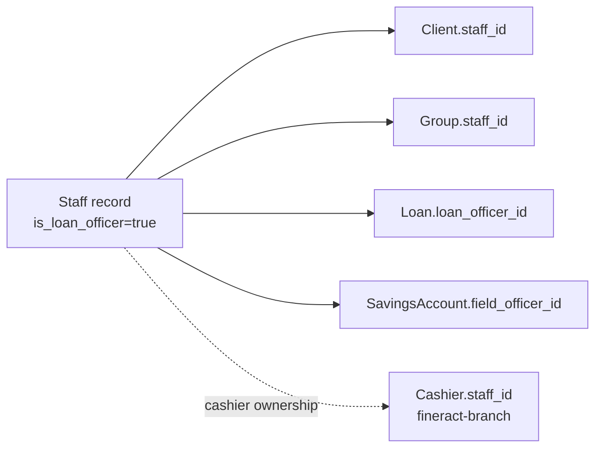
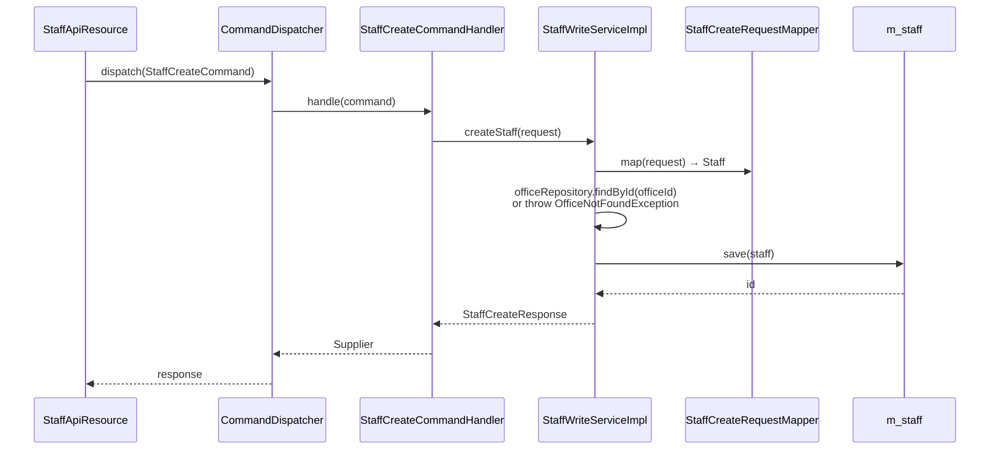
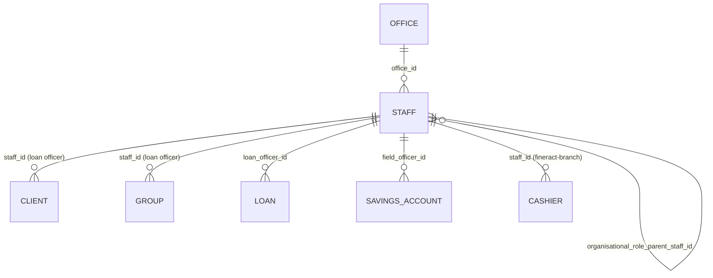

The `organisation/staff/` package models the *people* employed by the MFI. A staff record is owned by exactly one office and carries a single decisive boolean: `isLoanOfficer`. That flag splits the world into "loan officers — assignable to clients, groups and loans" and "everyone else — branch managers, tellers, back office". This page documents the entity, the read/write services, and how staff plug into clients, loans and bulk import.

## Where the code lives

```
fineract-core/.../organisation/staff/
├── data/
│   └── StaffData.java                    — read-side DTO (with @Builder)
├── domain/
│   ├── Staff.java                        — JPA entity
│   ├── StaffEnumerations.java
│   └── StaffOrganisationalRoleType.java  — enum of org-chart roles
└── exception/
    └── StaffNotFoundException.java

fineract-provider/.../organisation/staff/
├── adapter/
│   └── StaffImageIdAdapter.java
├── api/
│   └── StaffApiResource.java             — /v1/staff
├── command/
│   ├── StaffCreateCommand.java
│   ├── StaffUpdateCommand.java
│   └── StaffUploadCommand.java
├── data/
│   ├── StaffCreateRequest.java / Response
│   ├── StaffUpdateRequest.java  / Response
│   └── StaffUploadRequest.java  / Response
├── domain/
│   ├── StaffRepository.java
│   └── StaffRepositoryWrapper.java
├── handler/
│   ├── StaffCreateCommandHandler.java
│   ├── StaffUpdateCommandHandler.java
│   └── StaffUploadCommandHandler.java
├── mapper/
│   ├── StaffCreateRequestMapper.java
│   ├── StaffDataMapper.java
│   └── StaffDateMapper.java
├── service/
│   ├── StaffReadService.java
│   ├── StaffReadServiceImpl.java
│   ├── StaffWriteService.java
│   └── StaffWriteServiceImpl.java
├── validation/
│   ├── StaffForceStatus.java
│   └── StaffForceStatusValidator.java
└── starter/
```

<Note>
Staff is one of the packages that uses the **newer command pipeline** — `CommandDispatcher` from `fineract-command-core` rather than `PortfolioCommandSourceWritePlatformService`. The handler classes are tiny adapters that pass typed `*Command` payloads to MapStruct-generated mappers and on to `StaffWriteServiceImpl`. Compare with [Offices](/organisation/offices-and-hierarchy), which still uses the classic JSON-command + `CommandWrapperBuilder` pipeline.
</Note>

## The `Staff` entity

`fineract-core/src/main/java/org/apache/fineract/organisation/staff/domain/Staff.java`

```java
@Entity
@Table(name = "m_staff", uniqueConstraints = {
    @UniqueConstraint(columnNames = { "display_name" }, name = "display_name"),
    @UniqueConstraint(columnNames = { "external_id" }, name = "external_id_UNIQUE"),
    @UniqueConstraint(columnNames = { "mobile_no" },   name = "mobile_no_UNIQUE") })
public class Staff extends AbstractPersistableCustom<Long> {

    @Column(name = "firstname",     length = 50)            private String firstname;
    @Column(name = "lastname",      length = 50)            private String lastname;
    @Column(name = "display_name",  length = 100)           private String displayName;
    @Column(name = "mobile_no",     length = 50, nullable = false, unique = true) private String mobileNo;
    @Column(name = "external_id",   length = 100, unique = true) private String externalId;
    @Column(name = "email_address", length = 50,  unique = true) private String emailAddress;

    @ManyToOne
    @JoinColumn(name = "office_id", nullable = false)
    private Office office;

    @Column(name = "is_loan_officer", nullable = false) private boolean loanOfficer;
    @Column(name = "organisational_role_enum")          private Integer organisationalRoleType;
    @Column(name = "is_active",       nullable = false) private boolean active;
    @Column(name = "joining_date")                       private LocalDate joiningDate;

    @ManyToOne
    @JoinColumn(name = "organisational_role_parent_staff_id")
    private Staff organisationalRoleParentStaff;

    @Column(name = "image_id") private Long imageId;
}
```

### Fields that matter

| Field                          | Semantics                                                                                              |
| ------------------------------ | ------------------------------------------------------------------------------------------------------ |
| `office`                       | Mandatory. Determines data-scope visibility — staff are visible to users in this office and ancestors. |
| `loanOfficer`                  | If `true`, can be referenced by `Client.staff_id`, `Group.staff_id`, `Loan.loan_officer_id`.           |
| `organisationalRoleType`       | One of the enum values below; nullable.                                                                |
| `organisationalRoleParentStaff`| Self-FK; lets you build a soft org chart on top of the office tree.                                    |
| `active`                       | Inactive staff are hidden from default listings (`?status=ACTIVE`) and excluded from dropdowns.        |
| `displayName`, `externalId`, `mobileNo`, `emailAddress` | All globally unique at the DB layer.                                            |

### `StaffOrganisationalRoleType`

`fineract-core/.../organisation/staff/domain/StaffOrganisationalRoleType.java`

```java
public enum StaffOrganisationalRoleType {
    INVALID(0,                       "staffOrganisationalRoleType.invalid"),
    PROGRAM_DIRECTOR(100,            "staffOrganisationalRoleType.programDirector"),
    BRANCH_MANAGER(200,              "staffOrganisationalRoleType.branchManager"),
    FIELD_OFFICER_COORDINATOR(300,   "staffOrganisationalRoleType.coordinator"),
    FIELD_OFFICER(400,               "staffOrganisationalRoleType.fieldAgent");
    // ...
}
```

These role codes are advisory — none of them is enforced anywhere in the platform. The `loanOfficer` boolean is the only role that has runtime meaning. The role codes exist mainly so reporting/UIs can render an org chart.

## Loan officers vs everyone else

`isLoanOfficer = true` is the decisive flag. It is used in two ways:

1. **Visibility filtering** — the `/v1/staff?loanOfficersOnly=true` query parameter (and the equivalent dropdown service `retrieveAllLoanOfficersInOfficeById`) returns only loan officers. The same filter is applied when a client/group/loan edit screen renders "assign loan officer".
2. **Assignment validation** — when a `Client.staff_id`, `Group.staff_id` or `Loan.loan_officer_id` is set, the receiving service checks the staff record's `isLoanOfficer` flag. A non-loan-officer being assigned throws `StaffRoleException` (`fineract-provider/.../organisation/staff/exception/StaffRoleException.java`).



The `Cashier.staff_id` reference (in `fineract-branch`) does **not** require `isLoanOfficer = true` — a teller cashier is just a staff member doing cash duty. See [Tellers &amp; cashiers](/organisation/tellers-and-cashiers).

## Read path

### `StaffReadService` / `StaffReadServiceImpl`

`fineract-provider/.../organisation/staff/service/StaffReadService.java` exposes:

```java
public interface StaffReadService {
    Collection<StaffData> retrieveAllStaff(Long officeId, boolean loanOfficersOnly, String status);
    Collection<StaffData> retrieveAllStaffInOfficeAndItsParentOfficeHierarchy(Long officeId, boolean loanOfficersOnly);
    Collection<StaffData> retrieveAllLoanOfficersInOfficeById(Long officeId);
    StaffData retrieveStaff(Long staffId);
}
```

The `*InOfficeAndItsParentOfficeHierarchy` variant is critical: when a client at branch `.1.5.27.` needs a loan officer dropdown, you want to see loan officers from that branch *and from every ancestor* (because head-office staff routinely supervise local borrowers). The query uses the office's `hierarchy` column and a `LIKE` prefix join — see [Offices &amp; hierarchy](/organisation/offices-and-hierarchy) for the path scheme.

### `/v1/staff` query parameters

`fineract-provider/src/main/java/org/apache/fineract/organisation/staff/api/StaffApiResource.java`

```java
@GET
@Operation(summary = "Retrieve Staff", operationId = "retrieveAllStaff")
public List<StaffData> retrieveAll(
        @QueryParam("officeId")                final Long officeId,
        @DefaultValue("false") @QueryParam("staffInOfficeHierarchy") boolean staffInOfficeHierarchy,
        @DefaultValue("false") @QueryParam("loanOfficersOnly")       boolean loanOfficersOnly,
        @DefaultValue("active") @QueryParam("status")                String status) {
    return staffInOfficeHierarchy
        ? readPlatformService.retrieveAllStaffInOfficeAndItsParentOfficeHierarchy(officeId, loanOfficersOnly)
        : readPlatformService.retrieveAllStaff(officeId, loanOfficersOnly, Optional.ofNullable(status).orElse("active"));
}
```

| Parameter                 | Default  | Effect                                                                  |
| ------------------------- | -------- | ----------------------------------------------------------------------- |
| `officeId`                | none     | Restrict to one office (mandatory for hierarchy mode)                   |
| `staffInOfficeHierarchy`  | `false`  | If `true`, include parent-office staff too                              |
| `loanOfficersOnly`        | `false`  | If `true`, filter `is_loan_officer = true`                              |
| `status`                  | `active` | `active`, `inactive`, or `all`                                          |

## Write path

### `StaffApiResource` REST surface

| Method | Path                            | Purpose                                       |
| ------ | ------------------------------- | --------------------------------------------- |
| GET    | `/v1/staff`                     | List staff                                    |
| GET    | `/v1/staff/{staffId}`           | Retrieve one (`?template=true` adds offices)  |
| POST   | `/v1/staff`                     | Create a staff member                         |
| PUT    | `/v1/staff/{staffId}`           | Update                                        |
| GET    | `/v1/staff/downloadtemplate`    | Excel template for bulk import                |
| POST   | `/v1/staff/uploadtemplate`      | Upload bulk-import workbook                   |

Required fields on create are minimal: `officeId`, `firstname`, `lastname`. `isLoanOfficer` and `isActive` default to `false` / `true` respectively. All optional fields (mobile, email, external id, joining date, image id) can be added later via `PUT`.

### Command dispatch

Unlike `office`, `staff` uses `CommandDispatcher` directly:

```java
@POST
public StaffCreateResponse createStaff(@Valid StaffCreateRequest request) {
    final var command = new StaffCreateCommand();
    command.setPayload(request);
    final Supplier<StaffCreateResponse> response = dispatcher.dispatch(command);
    return response.get();
}
```

The dispatcher picks up the typed handler:



The mapper (`StaffCreateRequestMapper`) is MapStruct-generated; companion `StaffDataMapper` and `StaffDateMapper` handle reads and date conversions. The mapper layer is what makes this package noticeably tidier than `office`.

### `StaffWriteServiceImpl`

`fineract-provider/.../organisation/staff/service/StaffWriteServiceImpl.java` is the actual service. It wraps the JPA save in a transaction and catches both `DataIntegrityViolationException` (for unique-constraint violations on `display_name`, `external_id`, `mobile_no`) and `JpaSystemException` / `PersistenceException` to surface clean `PlatformDataIntegrityException` messages.

`displayName` is auto-computed from `firstname` + " " + `lastname` if the caller does not supply one, which is also what makes the unique constraint feasible.

### Validation: `StaffForceStatusValidator`

`fineract-provider/.../organisation/staff/validation/StaffForceStatusValidator.java` is a Jakarta Bean Validation constraint validator behind the `@StaffForceStatus` annotation, used on `StaffUpdateRequest` to prevent illegal status transitions (e.g. you cannot deactivate a staff member who is still an active loan officer on open loans, depending on configuration).

## Bulk import

Staff supports the platform-wide bulk import. The flow mirrors office bulk import but with a custom `StaffUploadCommand`:

```java
@POST
@Path("uploadtemplate")
@Consumes(MediaType.MULTIPART_FORM_DATA)
public Long postTemplate(@FormDataParam("file") InputStream uploadedInputStream,
                         @FormDataParam("file") FormDataContentDisposition fileDetail,
                         @FormDataParam("locale")     String locale,
                         @FormDataParam("dateFormat") String dateFormat) {
    final var command = new StaffUploadCommand();
    command.setPayload(StaffUploadRequest.builder()
        .uploadedInputStream(uploadedInputStream)
        .fileDetail(fileDetail).locale(locale).dateFormat(dateFormat).build());
    final Supplier<StaffUpdateResponse> response = dispatcher.dispatch(command);
    return response.get().getResourceId();
}
```

The workbook contract — column headers, validation, lookup of offices by name — is defined under `fineract-provider/.../infrastructure/bulkimport/populator/staff/StaffWorkbookPopulator.java` and the corresponding `StaffImportHandler`. The download endpoint returns a populated template that already includes the office dropdown for the given `officeId`.

## `Staff` as a foreign key target

Several portfolio entities point at staff:



When a loan officer is **reassigned** (an organisationally common event when staff move branches), Fineract logs the change as a `LoanOfficerAssignmentHistory` entry — that table is owned by `fineract-loan` not `organisation/staff`, but it is the place to look when audit asks "who held this loan when?".

### Deactivation rules

Marking a staff record `isActive = false` is non-destructive:

- The staff member disappears from default `/v1/staff` listings and from new-assignment dropdowns.
- Existing client/group/loan/savings/cashier references remain intact — they are not nulled out.
- The platform validates that no *open* maker-checker commands are still pending against the staff record.

## Permissions

| Permission code        | Purpose                                  |
| ---------------------- | ---------------------------------------- |
| `READ_STAFF`           | List / retrieve staff                    |
| `CREATE_STAFF`         | Create a staff record                    |
| `CREATE_STAFF_CHECKER` | Maker-checker approval for create        |
| `UPDATE_STAFF`         | Update                                   |
| `UPDATE_STAFF_CHECKER` | Maker-checker approval for update        |
| `DELETE_STAFF`         | Deactivate / delete (rare)               |

Note there is *no* assignment-specific permission — assigning a loan officer to a client uses the relevant client/loan permissions (`UPDATE_CLIENT`, `UPDATE_LOAN`).

## Exceptions you will encounter

| Exception                                                                                         | Trigger                                                                                       |
| ------------------------------------------------------------------------------------------------- | --------------------------------------------------------------------------------------------- |
| `StaffNotFoundException` (`fineract-core/.../staff/exception/`)                                   | Lookup by id missing                                                                          |
| `StaffRoleException` (`fineract-provider/.../staff/exception/`)                                   | Assigning a non-loan-officer to a `loan_officer_id` field                                     |
| `PlatformDataIntegrityException`                                                                  | Duplicate `display_name`, `external_id`, `mobile_no`, or `email_address`                      |
| `OfficeNotFoundException`                                                                         | `officeId` references a non-existent office (raised by `StaffWriteServiceImpl` on create)     |

## Common pitfalls

<Warning>
**Reading `Staff.isNotLoanOfficer()` / `Staff.isNotActive()`.** Both convenience methods on the entity are marked `@Deprecated(forRemoval = true)` and explicitly comment that they were "mistakenly included in an API serialization". Use `!staff.isLoanOfficer()` / `!staff.isActive()` instead.
</Warning>

<Warning>
**Mobile number uniqueness.** `mobile_no` is `nullable = false` *and* unique. Bulk imports that omit a phone number fail at the constraint level. The bulk import template enforces a placeholder.
</Warning>

<Warning>
**`staffInOfficeHierarchy=true` requires `officeId`.** The query is meaningless without an anchor; the service throws `IllegalArgumentException` if `officeId` is null.
</Warning>

## See also

- [Offices](/organisation/offices-and-hierarchy) — every staff record needs a non-null `office_id`.
- [Tellers &amp; cashiers](/organisation/tellers-and-cashiers) — `Cashier.staff_id` references this entity.
- The loan officer assignment history lives under `fineract-loan/.../loanaccount/domain/LoanOfficerAssignmentHistory.java`.
