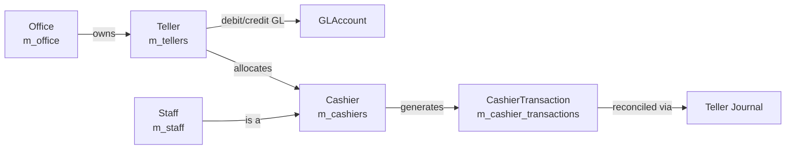
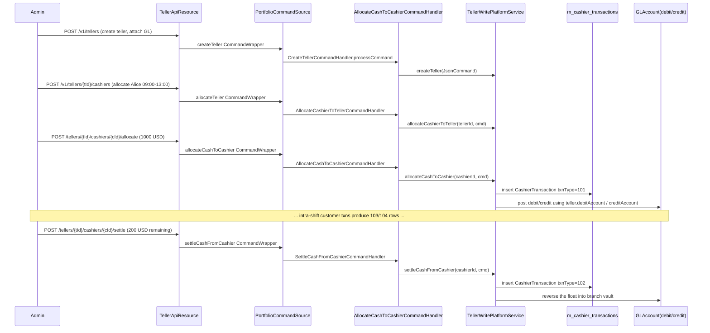

Apache Fineract ships a dedicated **teller cash management** module that lets a branch model its physical
cash drawers, the staff allocated to operate them, and every cash-in / cash-out movement that flows through
them. Code lives under `fineract-branch/src/main/java/org/apache/fineract/organisation/teller/` and is split
into the conventional `domain/`, `data/`, `service/`, `handler/`, `serialization/`, `api/`, `util/` and
`exception/` packages. The module is loaded into the running Fineract instance through the JAX-RS resources
exposed under `/v1/tellers`, `/v1/cashiers` and `/v1/cashiersjournal`.

<Tip>
The "Teller Cash Management" Swagger tag (`TellerApiResource`) introduces itself as: *"Teller cash management
which will allow an organization to manage their cash transactions at branches or head office more
effectively."*
</Tip>

## Why a teller subsystem?

A microfinance branch typically operates with one or more **teller drawers** (a desk + cash box) and assigns
**cashiers** (staff members) to those drawers for shifts. Each shift's opening balance is loaded with an
*allocate cash* movement; the closing balance is removed with a *settle cash* movement; intra-shift cash
receipts and pay-outs (linked to loans, savings or clients) post against the cashier as `INWARD_CASH_TXN` or
`OUTWARD_CASH_TXN`. The aggregate of these movements per teller is reconciled to the **General Ledger**
accounts attached to the teller record itself.



## Domain model

All persistent entities live in
`fineract-branch/src/main/java/org/apache/fineract/organisation/teller/domain/`.

### `Teller`

The `Teller` aggregate (`domain/Teller.java`, table `m_tellers`) is the root entity. It is the place where the
link to the **General Ledger** is recorded — every teller carries a `debit_account_id` and `credit_account_id`
that act as the two sides of every cash movement posted through it.

```java
// fineract-branch/.../organisation/teller/domain/Teller.java
@Entity
@Table(name = "m_tellers", uniqueConstraints = { @UniqueConstraint(name = "ux_tellers_name", columnNames = { "name" }) })
public class Teller extends AbstractPersistableCustom<Long> {

    @ManyToOne(fetch = FetchType.LAZY)
    @JoinColumn(name = "office_id", nullable = false)
    private Office office;

    @ManyToOne(fetch = FetchType.EAGER)
    @JoinColumn(name = "debit_account_id", nullable = true)
    private GLAccount debitAccount;

    @ManyToOne(fetch = FetchType.EAGER)
    @JoinColumn(name = "credit_account_id", nullable = true)
    private GLAccount creditAccount;

    @Column(name = "name", nullable = false, length = 100)
    private String name;

    @Column(name = "valid_from") private LocalDate startDate;
    @Column(name = "valid_to")   private LocalDate endDate;
    @Column(name = "state", nullable = false) private Integer status;

    @OneToMany(mappedBy = "teller", fetch = FetchType.LAZY)
    private Set<Cashier> cashiers;
}
```

`Teller.fromJson(...)` builds the entity from a `JsonCommand` (`name`, `description`, `startDate`, `endDate`,
`status`), and `Teller.update(...)` performs the diff-against-current-state pattern that the rest of the
Fineract platform uses everywhere.

### `TellerStatus`

`domain/TellerStatus.java` is the small lifecycle enum that drives the `state` column:

| Value | Constant   | Meaning                          |
|------:|------------|----------------------------------|
|     0 | `INVALID`  | Sentinel — unparseable input     |
|   100 | `PENDING`  | Created but not in use           |
|   300 | `ACTIVE`   | Operational                      |
|   400 | `INACTIVE` | Temporarily out of service       |
|   600 | `CLOSED`   | Decommissioned                   |

### `Cashier`

A **cashier** (`domain/Cashier.java`, table `m_cashiers`) is the join between a `Staff` and a `Teller` for a
date/time window. There is a unique constraint on `(staff_id, teller_id)` so the same person cannot be
allocated twice to the same drawer.

```java
@Entity
@Table(name = "m_cashiers", uniqueConstraints = {
        @UniqueConstraint(name = "ux_cashiers_staff_teller", columnNames = { "staff_id", "teller_id" }) })
public class Cashier extends AbstractPersistableCustom<Long> {

    @ManyToOne(fetch = FetchType.LAZY) @JoinColumn(name = "staff_id",  nullable = false) private Staff  staff;
    @ManyToOne(fetch = FetchType.LAZY) @JoinColumn(name = "teller_id", nullable = false) private Teller teller;

    @Column(name = "start_date", nullable = false) private LocalDate startDate;
    @Column(name = "end_date",   nullable = false) private LocalDate endDate;
    @Column(name = "full_day")                     private Boolean   isFullDay;
    @Column(name = "start_time", length = 10)      private String    startTime;
    @Column(name = "end_time",   length = 10)      private String    endTime;
}
```

The `isFullDay` flag and the `startTime`/`endTime` `HH:mm` strings let a branch model shift work (for example
a morning cashier and an afternoon cashier sharing the same drawer). `Cashier.update(...)` validates the time
components via the helpers `getHourFromStartTime()`, `getMinFromStartTime()`, etc.

### `CashierTransaction`

Every movement of physical cash through a cashier is recorded as a `CashierTransaction`
(`domain/CashierTransaction.java`, table `m_cashier_transactions`):

```java
@Entity
@Table(name = "m_cashier_transactions")
public class CashierTransaction extends AbstractPersistableCustom<Long> {

    @ManyToOne(fetch = FetchType.LAZY) @JoinColumn(name = "cashier_id", nullable = false) private Cashier cashier;

    @Column(name = "txn_type",   nullable = false)                          private Integer    txnType;
    @Column(name = "txn_date",   nullable = false)                          private LocalDate  txnDate;
    @Column(name = "txn_amount", scale = 6, precision = 19, nullable = false) private BigDecimal txnAmount;
    @Column(name = "txn_note")                                              private String     txnNote;
    @Column(name = "entity_type")                                           private String     entityType;
    @Column(name = "entity_id")                                             private Long       entityId;
    @Column(name = "currency_code")                                         private String     currencyCode;
    @Column(name = "created_date", nullable = false)
    private LocalDateTime createdDate = DateUtils.getLocalDateTimeOfSystem();
}
```

The fields `entityType` and `entityId` are how a cash transaction is back-pointed to a domain object (loan,
savings account, client) so that the journal report can group cash movements per business event.

### `CashierTxnType`

The integer `txnType` column is constrained by the constants in `domain/CashierTxnType.java`:

```java
public static final CashierTxnType ALLOCATE         = new CashierTxnType(101, "Allocate Cash");
public static final CashierTxnType SETTLE           = new CashierTxnType(102, "Settle Cash");
public static final CashierTxnType INWARD_CASH_TXN  = new CashierTxnType(103, "Cash In");
public static final CashierTxnType OUTWARD_CASH_TXN = new CashierTxnType(104, "Cash Out");
```

- **101 — Allocate**: float loaded onto the drawer at shift open.
- **102 — Settle**: float returned at shift close.
- **103 — Cash In** and **104 — Cash Out**: cash arising from customer-facing operations.

### `TellerJournal`

`domain/TellerJournal.java` is, today, an intentionally empty placeholder marker class:

```java
package org.apache.fineract.organisation.teller.domain;

public class TellerJournal {}
```

The actual *journal* is materialised from `CashierTransaction` rows on demand by the read service and
delivered as `TellerJournalData` DTOs.

### Repository wrappers

For every aggregate root the module ships two layers:

| Spring Data repo                  | Wrapper that throws `*NotFoundException`        |
|-----------------------------------|--------------------------------------------------|
| `TellerRepository`                | `TellerRepositoryWrapper`                        |
| `CashierRepository`               | `CashierRepositoryWrapper`                       |
| `CashierTransactionRepository`    | (looked up directly by the write service)        |
| `TellerTransactionRepository`     | (looked up directly by the write service)        |

The wrapper pattern (`TellerRepositoryWrapper.findOneWithNotFoundDetection(id)`) is what guarantees that a
`TellerNotFoundException` (under `exception/`) is raised with a uniform error code instead of returning a
JPA `null`.

## DTOs

`data/` carries the read-side and request-side DTOs:

| Class                                 | Role                                                                 |
|---------------------------------------|----------------------------------------------------------------------|
| `TellerData`                          | Flat representation returned by the GET endpoints                    |
| `CashierData`                         | Cashier + teller + staff projection                                  |
| `CashierTransactionData`              | Individual cashier transaction row                                   |
| `CashierTransactionsWithSummaryData`  | A page of transactions + aggregate totals                            |
| `CashierTransactionTypeTotalsData`    | One total per `CashierTxnType` (used inside the summary DTO)         |
| `TellerJournalData`                   | Journal row (cashier txn projected for reporting)                    |
| `TellerTransactionData`               | Teller-level transaction view                                        |
| `CashierTransactionDataValidator`     | API parameter validator for cashier transaction commands             |

Request bodies under `domain/model/request/` are POJOs deserialised by the Jersey runtime:

```text
TellerRequest, CashierRequest, CashierTransactionRequest
```

The aggregate `CashiersForTeller` (`domain/model/CashiersForTeller.java`) wraps a teller plus the list of its
cashiers and is returned by `GET /v1/tellers/{tellerId}/cashiers`.

## Service layer

The write surface is the `TellerWritePlatformService` interface
(`service/TellerWritePlatformService.java`):

```java
public interface TellerWritePlatformService {
    CommandProcessingResult createTeller(JsonCommand command);
    CommandProcessingResult modifyTeller(Long tellerId, JsonCommand command);
    CommandProcessingResult deleteTeller(Long tellerId);

    CommandProcessingResult allocateCashierToTeller(Long tellerId, JsonCommand command);
    CommandProcessingResult updateCashierAllocation(Long tellerId, Long cashierId, JsonCommand command);
    CommandProcessingResult deleteCashierAllocation(Long tellerId, Long cashierId, JsonCommand command);

    CommandProcessingResult allocateCashToCashier(Long cashierId, JsonCommand command);
    CommandProcessingResult settleCashFromCashier(Long cashierId, JsonCommand command);
}
```

The smaller `TellerTransactionWritePlatformService` is the entry point used by the in-progress *teller
transaction* feature:

```java
// service/TellerTransactionWritePlatformService.java
public interface TellerTransactionWritePlatformService {
    /** Stores teller transactions into the data base. */
    CommandProcessingResult createTellerTransaction(JsonCommand command);
}
```

`CashierWritePlatformService` (`service/CashierWritePlatformService.java`) is currently a stub left in place
for future per-cashier write logic. The read surface — used by every `GET` resource — is
`TellerManagementReadPlatformService`:

```java
// service/TellerManagementReadPlatformService.java
public interface TellerManagementReadPlatformService {
    Collection<TellerData>  getTellers(Long officeId);
    TellerData              findTeller(Long tellerId);
    CashierData             findCashier(Long cashierId);
    Collection<CashierData> getCashierData(Long officeId, Long tellerId, Long staffId, LocalDate date);
    CashierData             retrieveCashierTemplate(Long officeId, Long tellerId, boolean staffInSelectedOfficeOnly);
    CashierTransactionData  retrieveCashierTxnTemplate(Long cashierId);

    TellerTransactionData               findTellerTransaction(Long transactionId);
    Collection<TellerTransactionData>   fetchTellerTransactionsByTellerId(Long tellerId, LocalDate fromDate, LocalDate toDate);

    Collection<TellerJournalData> getJournals(Long officeId, Long tellerId, Long cashierId,
                                              LocalDate dateFrom, LocalDate dateTo);
    Collection<TellerJournalData> fetchTellerJournals(Long tellerId, Long cashierId,
                                                      LocalDate fromDate, LocalDate toDate);

    Collection<CashierData> getCashiersForTeller(Long tellerId, LocalDate fromDate, LocalDate toDate);
    Collection<CashierData> retrieveCashiersForTellers(Long tellerId);

    Page<CashierTransactionData> retrieveCashierTransactions(Long cashierId, boolean includeAllTellers,
                                                              LocalDate fromDate, LocalDate toDate,
                                                              String currencyCode, SearchParameters searchParameters);

    CashierTransactionsWithSummaryData retrieveCashierTransactionsWithSummary(Long cashierId, boolean includeAllTellers,
                                                                              LocalDate fromDate, LocalDate toDate,
                                                                              String currencyCode,
                                                                              SearchParameters searchParameters);
}
```

## Command handlers

Each mutating operation is wired to a Spring-managed handler under
`fineract-branch/.../organisation/teller/handler/` via the `@CommandType(entity, action)` annotation. The
handler is a thin pass-through to the write service — its only purpose is to be discoverable by the
`PortfolioCommandSourceWritePlatformService` command dispatcher:

```java
// handler/AllocateCashToCashierCommandHandler.java
@Service
@CommandType(entity = "TELLER", action = "ALLOCATECASHTOCASHIER")
public class AllocateCashToCashierCommandHandler implements NewCommandSourceHandler {

    private final TellerWritePlatformService writePlatformService;

    @Override
    public CommandProcessingResult processCommand(final JsonCommand command) {
        return this.writePlatformService.allocateCashToCashier(command.subentityId(), command);
    }
}
```

The full set of handlers shipped with the module:

| Handler class                              | Entity / Action                       |
|--------------------------------------------|---------------------------------------|
| `CreateTellerCommandHandler`               | `TELLER` / `CREATE`                   |
| `UpdateTellerCommandHandler`               | `TELLER` / `UPDATE`                   |
| `DeleteTellerCommandHandler`               | `TELLER` / `DELETE`                   |
| `AllocateCashierToTellerCommandHandler`    | `TELLER` / `ALLOCATE`                 |
| `UpdateCashierAllocationCommandHandler`    | `TELLER` / `UPDATECASHIERALLOCATION`  |
| `DeleteCashierAllocationCommandHandler`    | `TELLER` / `DELETECASHIERALLOCATION`  |
| `AllocateCashToCashierCommandHandler`      | `TELLER` / `ALLOCATECASHTOCASHIER`    |
| `SettleCashFromCashierCommandHandler`      | `TELLER` / `SETTLECASHFROMCASHIER`    |
| `ModifyCashierCommandHandler`              | `CASHIER` / `UPDATE`                  |
| `CreateTellerTransactionCommandHandler`    | `TELLER` / `CREATETELLERTRANSACTION`  |

## Serialization

`serialization/TellerCommandFromApiJsonDeserializer.java` validates the JSON request bodies for the teller
commands (mandatory fields = `name`, `officeId`, `description`, `startDate`, `status`; optional `endDate`)
before any handler runs. Cashier-level validation is performed by `data/CashierTransactionDataValidator.java`.

## Exceptions

The module ships these typed exceptions (all under `exception/`):

| Exception                                          | When it fires                                                |
|----------------------------------------------------|--------------------------------------------------------------|
| `TellerNotFoundException`                          | `tellerId` unknown                                           |
| `CashierNotFoundException`                         | `cashierId` unknown                                          |
| `CashierAlreadyAllocated`                          | Staff already assigned to a teller for overlapping range     |
| `CashierExistForTellerException`                   | Cashier already exists for that teller                       |
| `CashierDateRangeOutOfTellerDateRangeException`    | Cashier window falls outside teller validity                 |
| `CashierInsufficientAmountException`               | Attempted to settle more cash than the cashier holds         |
| `InvalidDateInputException`                        | Malformed date parameter                                     |

## Utility: `DateRange`

The `?dateRange=YYYY-MM-DD..YYYY-MM-DD` query parameter used by several endpoints is parsed with the small
helper `util/DateRange.java`:

```java
// util/DateRange.java
public static DateRange fromString(final String dateToParse) {
    final DateRange dateRange = new DateRange();
    final String testee = dateToParse == null
            ? DateUtils.DEFAULT_DATE_FORMATTER.format(DateUtils.getBusinessLocalDate())
            : dateToParse;
    final StringTokenizer tokenizer = new StringTokenizer(testee, "..");
    try {
        dateRange.setStartDate(LocalDate.parse(tokenizer.nextToken(), DateUtils.DEFAULT_DATE_FORMATTER));
    } catch (DateTimeParseException ex) { /* logged */ }
    if (tokenizer.hasMoreTokens()) {
        try {
            dateRange.setEndDate(LocalDate.parse(tokenizer.nextToken(), DateUtils.DEFAULT_DATE_FORMATTER));
        } catch (DateTimeParseException ex) { /* logged */ }
    }
    return dateRange;
}
```

## REST surface

Three JAX-RS resource classes are exposed:

- `api/TellerApiResource.java`        → `/v1/tellers`
- `api/CashierApiResource.java`       → `/v1/cashiers`
- `api/TellerJournalApiResource.java` → `/v1/cashiersjournal`

### `/v1/tellers` — `TellerApiResource`

| Method | Path                                                            | OperationId                                | Purpose                                |
|--------|-----------------------------------------------------------------|--------------------------------------------|----------------------------------------|
| GET    | `/v1/tellers`                                                   | `retrieveAllTellers`                       | List tellers (optional `?officeId=`)   |
| GET    | `/v1/tellers/{tellerId}`                                        | `retrieveOneTeller`                        | Fetch one                              |
| POST   | `/v1/tellers`                                                   | `createTeller`                             | Create teller                          |
| PUT    | `/v1/tellers/{tellerId}`                                        | `updateTeller`                             | Update teller                          |
| DELETE | `/v1/tellers/{tellerId}`                                        | `deleteTeller`                             | Delete teller                          |
| GET    | `/v1/tellers/{tellerId}/cashiers`                               | `retrieveAllCashiersForTeller`             | List cashiers for a teller             |
| GET    | `/v1/tellers/{tellerId}/cashiers/{cashierId}`                   | `retrieveOneCashierForTeller`              | Fetch one cashier                      |
| GET    | `/v1/tellers/{tellerId}/cashiers/template`                      | `retrieveCashierTemplateForTeller`         | Form template                          |
| POST   | `/v1/tellers/{tellerId}/cashiers`                               | `createCashierForTeller`                   | Allocate cashier to teller             |
| PUT    | `/v1/tellers/{tellerId}/cashiers/{cashierId}`                   | `updateCashierForTeller`                   | Modify allocation                      |
| DELETE | `/v1/tellers/{tellerId}/cashiers/{cashierId}`                   | `deleteCashierForTeller`                   | Remove allocation                      |
| POST   | `/v1/tellers/{tellerId}/cashiers/{cashierId}/allocate`          | `allocateCashToCashier`                    | Allocate cash to cashier (txnType 101) |
| POST   | `/v1/tellers/{tellerId}/cashiers/{cashierId}/settle`            | `settleCashFromCashier`                    | Settle cash from cashier (txnType 102) |
| GET    | `/v1/tellers/{tellerId}/cashiers/{cashierId}/transactions`      | `retrieveCashierTransactions`              | Paged list of transactions             |
| GET    | `/v1/tellers/{tellerId}/cashiers/{cashierId}/summaryandtransactions` | `retrieveCashierTransactionsWithSummary` | Paged list + totals                    |
| GET    | `/v1/tellers/{tellerId}/cashiers/{cashierId}/transactions/template` | `retrieveTemplateCashierTransaction`     | Form template for new txn              |
| GET    | `/v1/tellers/{tellerId}/transactions`                           | `retrieveAllTransactionsForTeller`         | Teller-level txns, `?dateRange=` filter |
| GET    | `/v1/tellers/{tellerId}/transactions/{transactionId}`           | `retrieveOneTransactionForTeller`          | One teller transaction                 |
| GET    | `/v1/tellers/{tellerId}/journals`                               | `retrieveAllJournalsForTeller`             | Journal entries for a teller           |

The class is wired with constructor injection of three collaborators:

```java
// api/TellerApiResource.java
@Path("/v1/tellers")
@Component
@Tag(name = "Teller Cash Management")
@RequiredArgsConstructor
public class TellerApiResource {

    private final TellerManagementReadPlatformService readPlatformService;
    private final PortfolioCommandSourceWritePlatformService commandWritePlatformService;
    private final DefaultToApiJsonSerializer<String> apiJsonSerializer;
```

### `/v1/cashiers` — `CashierApiResource`

A single endpoint that lets callers list cashiers across tellers, filtered by office/teller/staff/date:

```java
// api/CashierApiResource.java
@Path("/v1/cashiers")
public class CashierApiResource {
    @GET
    public Collection<CashierData> getCashierData(
            @QueryParam("officeId") final Long officeId,
            @QueryParam("tellerId") final Long tellerId,
            @QueryParam("staffId")  final Long staffId,
            @QueryParam("date")     final String date) {
        final LocalDate dateRestriction = date != null
                ? LocalDate.parse(date, DateTimeFormatter.BASIC_ISO_DATE)
                : DateUtils.getBusinessLocalDate();
        return readPlatformService.getCashierData(officeId, tellerId, staffId, dateRestriction);
    }
}
```

| Method | Path           | Query params                            |
|--------|----------------|-----------------------------------------|
| GET    | `/v1/cashiers` | `officeId, tellerId, staffId, date`     |

### `/v1/cashiersjournal` — `TellerJournalApiResource`

```java
// api/TellerJournalApiResource.java
@Path("/v1/cashiersjournal")
public class TellerJournalApiResource {
    @GET
    public Collection<TellerJournalData> getJournalData(
            @QueryParam("officeId")  final Long officeId,
            @QueryParam("tellerId")  final Long tellerId,
            @QueryParam("cashierId") final Long cashierId,
            @QueryParam("dateRange") final String dateRange) {
        final DateRange dateRangeHolder = DateRange.fromString(dateRange);
        return readPlatformService.getJournals(officeId, tellerId, cashierId,
                dateRangeHolder.getStartDate(), dateRangeHolder.getEndDate());
    }
}
```

| Method | Path                  | Query params                                            |
|--------|-----------------------|---------------------------------------------------------|
| GET    | `/v1/cashiersjournal` | `officeId, tellerId, cashierId, dateRange=YYYY..YYYY`   |

## End-to-end flow: a day in the life of a cashier



## Link to General Ledger

The two `@ManyToOne` columns on `Teller` (`debit_account_id`, `credit_account_id`) connect cash management to
the accounting subsystem. When a cashier transaction is committed the journal posting derives:

- The **branch** from `Teller.office.id` (`office_id`).
- The **debit GL account** and **credit GL account** from the teller itself.

This means a branch can change its cash-on-hand / vault accounts simply by updating the teller record — every
subsequent transaction picks up the new GL routing automatically.

## File map

```text
fineract-branch/src/main/java/org/apache/fineract/organisation/teller/
├── api/
│   ├── CashierApiResource.java                  /v1/cashiers
│   ├── TellerApiResource.java                   /v1/tellers
│   ├── TellerApiResourceSwagger.java            request/response schemas
│   └── TellerJournalApiResource.java            /v1/cashiersjournal
├── data/                                        DTOs (Teller/Cashier/CashierTransaction/Journal)
├── domain/                                      JPA entities + repos + status/txn-type enums
│   ├── Teller.java          Cashier.java        CashierTransaction.java
│   ├── TellerStatus.java    CashierTxnType.java TellerJournal.java
│   ├── *Repository.java     *RepositoryWrapper.java
│   └── model/
│       ├── CashiersForTeller.java
│       └── request/{TellerRequest, CashierRequest, CashierTransactionRequest}.java
├── exception/                                   Typed not-found / validation errors
├── handler/                                     @CommandType handlers
├── serialization/TellerCommandFromApiJsonDeserializer.java
├── service/
│   ├── TellerWritePlatformService.java
│   ├── CashierWritePlatformService.java
│   ├── TellerTransactionWritePlatformService.java
│   └── TellerManagementReadPlatformService.java
└── util/DateRange.java
```

## Related reading

<CardGroup cols={2}>
  <Card title="Offices & Staff" icon="building">
    The `Teller` entity is anchored on an `Office` and each `Cashier` on a `Staff`. See the organisation
    structure pages for the upstream model.
  </Card>
  <Card title="General Ledger" icon="book">
    `Teller.debitAccount` and `Teller.creditAccount` are `GLAccount` references — see the accounting module
    for how journal entries are produced.
  </Card>
</CardGroup>
