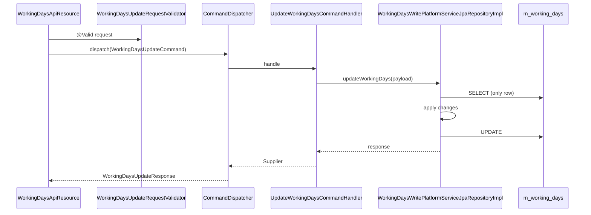
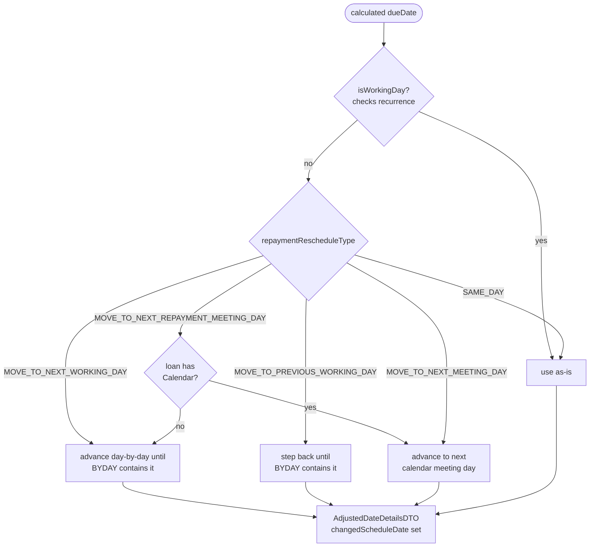

Working days in Apache Fineract answer a deceptively simple question: "if a loan repayment is scheduled to fall on a Sunday, what do we do?" The answer is captured in a *single row* in the `m_working_days` table that applies tenant-wide, plus the `RepaymentRescheduleType` enum that selects between five concrete strategies. This page documents the `organisation/workingdays/` package and how its rules feed into the loan schedule generator.

## Where the code lives

```
fineract-core/.../organisation/workingdays/
├── api/
│   └── WorkingDaysApiConstants.java
├── data/
│   └── AdjustedDateDetailsDTO.java
├── domain/
│   ├── RepaymentRescheduleType.java        — 5-value enum
│   ├── WorkingDays.java                    — the entity
│   └── WorkingDaysEnumerations.java
└── service/

fineract-provider/.../organisation/workingdays/
├── api/
│   ├── WorkingDaysApiResource.java         — /v1/workingdays
│   └── WorkingDaysApiResourceSwagger.java
├── command/
│   └── WorkingDaysUpdateCommand.java
├── data/
│   ├── WorkingDaysData.java
│   ├── WorkingDaysUpdateRequest.java
│   ├── WorkingDaysUpdateRequestValidator.java
│   └── WorkingDaysUpdateResponse.java
├── domain/
│   ├── WorkingDaysRepository.java
│   └── WorkingDaysRepositoryWrapper.java
├── exception/
├── handler/
│   └── UpdateWorkingDaysCommandHandler.java
├── service/
│   ├── WorkingDaysReadPlatformService.java
│   ├── WorkingDaysReadPlatformServiceImpl.java
│   ├── WorkingDaysWritePlatformService.java
│   └── WorkingDaysWritePlatformServiceJpaRepositoryImpl.java
└── starter/
```

## The `WorkingDays` entity

`fineract-core/src/main/java/org/apache/fineract/organisation/workingdays/domain/WorkingDays.java`

```java
@Entity
@Table(name = "m_working_days")
public class WorkingDays extends AbstractPersistableCustom<Long> {

    @Column(name = "recurrence", length = 100)
    private String recurrence;

    @Column(name = "repayment_rescheduling_enum", nullable = false)
    private Integer repaymentReschedulingType;

    @Column(name = "extend_term_daily_repayments", nullable = false)
    private Boolean extendTermForDailyRepayments;

    @Column(name = "extend_term_holiday_repayment", nullable = false)
    private Boolean extendTermForRepaymentsOnHolidays;
}
```

<Note>
There is one and only one row in `m_working_days`. The Liquibase seed inserts it; the platform never adds more. Every read goes through `WorkingDaysReadPlatformService.retrieve()` and returns that single row.
</Note>

### `recurrence` — iCal recurrence rule

`recurrence` is a textual iCal `RRULE` expression. The seed value is:

```
FREQ=WEEKLY;INTERVAL=1;BYDAY=MO,TU,WE,TH,FR
```

(Monday through Friday are working days, weekends are not.) The platform parses this string with `org.mnode.ical4j` (see the ical4j dependency in `fineract-core/build.gradle`) to answer the question "is `someDate` a working day?". The format is a *bitmask of weekdays* in iCal's two-letter codes:

| Code | Day       |
| ---- | --------- |
| `MO` | Monday    |
| `TU` | Tuesday   |
| `WE` | Wednesday |
| `TH` | Thursday  |
| `FR` | Friday    |
| `SA` | Saturday  |
| `SU` | Sunday    |

To mark Saturday as a working day, the recurrence becomes `FREQ=WEEKLY;INTERVAL=1;BYDAY=MO,TU,WE,TH,FR,SA`. The `FREQ=WEEKLY;INTERVAL=1` prefix is mandatory — the platform only supports weekly recurrence with interval 1.

### `repaymentReschedulingType`

This is the rule that selects what to do when a calculated due date lands on a non-working day. `fineract-core/.../workingdays/domain/RepaymentRescheduleType.java`:

```java
public enum RepaymentRescheduleType {
    INVALID(0,                            "RepaymentRescheduleType.invalid"),
    SAME_DAY(1,                           "RepaymentRescheduleType.same.day"),
    MOVE_TO_NEXT_WORKING_DAY(2,           "RepaymentRescheduleType.move.to.next.working.day"),
    MOVE_TO_NEXT_REPAYMENT_MEETING_DAY(3, "RepaymentRescheduleType.move.to.next.repayment.meeting.day"),
    MOVE_TO_PREVIOUS_WORKING_DAY(4,       "RepaymentRescheduleType.move.to.previous.working.day"),
    MOVE_TO_NEXT_MEETING_DAY(5,           "RepaymentRescheduleType.move.to.next.meeting.day");
    // ...
}
```

| Value | Strategy                                                                                                  |
| ----- | --------------------------------------------------------------------------------------------------------- |
| `SAME_DAY` (1)                          | Leave the due date as-is. The installment falls on the non-working day.        |
| `MOVE_TO_NEXT_WORKING_DAY` (2)          | Advance to the next day that is in `recurrence`.                               |
| `MOVE_TO_NEXT_REPAYMENT_MEETING_DAY` (3)| Advance to the next scheduled repayment meeting day for the loan's group.      |
| `MOVE_TO_PREVIOUS_WORKING_DAY` (4)      | Step *backwards* to the last working day before the original due date.         |
| `MOVE_TO_NEXT_MEETING_DAY` (5)          | Advance to the next *calendar-meeting* day (not necessarily working).          |

Option 3 only makes sense for loans linked to a `Calendar` (i.e. group/centre meeting schedules). The schedule generator falls back to option 2 if the loan has no calendar.

### `extendTermForDailyRepayments` and `extendTermForRepaymentsOnHolidays`

Both are booleans. They answer the question: "when an installment is rescheduled, does the *loan term* extend, or does the next installment compress into the remaining time?"

| Flag                                | True                                                | False                                                |
| ----------------------------------- | --------------------------------------------------- | ---------------------------------------------------- |
| `extendTermForDailyRepayments`      | A daily-frequency loan gets one extra day per skip  | The schedule keeps the same final maturity           |
| `extendTermForRepaymentsOnHolidays` | A holiday-skipped installment pushes maturity forward | Subsequent installments compensate                  |

These flags only have effect in combination with `RepaymentRescheduleType` modes 2–5. For `SAME_DAY`, nothing moves.

## REST surface

### `WorkingDaysApiResource` — `/v1/workingdays`

`fineract-provider/src/main/java/org/apache/fineract/organisation/workingdays/api/WorkingDaysApiResource.java`

```java
@Path("/v1/workingdays")
@Tag(name = "Working days", description = "The days of the week that are workdays.\n" +
    "Rescheduling of repayments when it falls on a non-working is turned on /off by enable/disable " +
    "reschedule-future-repayments parameter in Global configurations\n" +
    "Allow transactions on non-working days is configurable by enabling/disbaling the " +
    "allow-transactions-on-non-workingday parameter in Global configurations.")
public class WorkingDaysApiResource {

    private final WorkingDaysReadPlatformService workingDaysReadPlatformService;
    private final WorkingDaysUpdateRequestValidator workingDaysUpdateRequestValidator;
    private final CommandDispatcher dispatcher;
    // ...
}
```

| Method | Path                       | Purpose                              |
| ------ | -------------------------- | ------------------------------------ |
| GET    | `/v1/workingdays`          | Retrieve the single row              |
| GET    | `/v1/workingdays/template` | List of `RepaymentRescheduleType` options |
| PUT    | `/v1/workingdays`          | Update                               |

There is **no POST and no DELETE**. The row is created by Liquibase and cannot be removed.

### Update flow

This package uses the newer `CommandDispatcher` pipeline (compare with `holiday` and `office`, which still use the JSON-command pipeline):

```java
@PUT
@Consumes(MediaType.APPLICATION_JSON)
@Produces(MediaType.APPLICATION_JSON)
public WorkingDaysUpdateResponse update(@Valid WorkingDaysUpdateRequest request) {
    final var command = new WorkingDaysUpdateCommand();
    command.setCommandId(System.currentTimeMillis());
    command.setCreatedAt(Instant.now());
    command.setPayload(request);
    final Supplier<WorkingDaysUpdateResponse> response = dispatcher.dispatch(command);
    return response.get();
}
```



`WorkingDaysUpdateRequestValidator` is a Bean Validation constraint that enforces `recurrence` is a parseable `RRULE` and that `repaymentRescheduleType` is one of the 5 enum values.

## How the schedule generator consumes it

`WorkingDays` is read by the loan schedule generator each time a loan term is built or refreshed. The relevant call site is `fineract-provider/.../portfolio/loanaccount/loanschedule/domain/DefaultScheduledDateGenerator.java`, which in turn uses utilities from `fineract-core/.../portfolio/calendar/service/CalendarUtils.java` to:

1. Parse `recurrence` into a set of `DayOfWeek` values.
2. Walk through the original calculated due date.
3. Apply the `RepaymentRescheduleType` rule.
4. Return an `AdjustedDateDetailsDTO`.

### `AdjustedDateDetailsDTO`

`fineract-core/src/main/java/org/apache/fineract/organisation/workingdays/data/AdjustedDateDetailsDTO.java`

```java
public class AdjustedDateDetailsDTO {
    /** Variable tracks the current schedule date that has been changed */
    LocalDate changedScheduleDate;
    /** Variable tracks If the meeting has been changed, i.e future schedule also changes
     *  along with the current repayments date. */
    LocalDate changedActualRepaymentDate;
    /** Variable tracks the next repayment period due date */
    LocalDate nextRepaymentPeriodDueDate;
    // ...
}
```

This is the carrier object the generator passes back up the call stack. The two `Changed*` fields are deliberately distinct: `changedScheduleDate` is what gets stored on this installment; `changedActualRepaymentDate` is the *anchor* for computing the next installment's due date (which matters when meetings shift permanently rather than per-installment).

### Decision tree at schedule-generation time



### Global config gates

Two `c_configuration` toggles also feed the decision:

- **`reschedule-future-repayments`** — global on/off for the entire rescheduling subsystem. If `false`, the generator skips the working-days check.
- **`allow-transactions-on-non-workingday`** — separate switch that controls whether a teller / repayment transaction can be *posted* on a non-working day, regardless of what the schedule says. Lives in `fineract-provider/.../infrastructure/configuration/`.

Both are mentioned verbatim in the Swagger `@Tag` description on `WorkingDaysApiResource`.

## Interaction with holidays

Working days and holidays answer two different questions:

| System         | Question answered                                            | Scope               | When applied                |
| -------------- | ------------------------------------------------------------ | ------------------- | --------------------------- |
| `WorkingDays`  | Is *this day-of-week* a workable day?                        | Tenant-wide         | At schedule generation      |
| `Holiday`      | Is *this specific date* a workable day (for these offices)?  | Per office, dated   | Asynchronously via batch job |

A date can therefore be:

1. A working day with no holiday → use as-is.
2. A non-working day → handled by `RepaymentRescheduleType` at generation time.
3. A holiday-window day → rewritten by the `APPLY_HOLIDAYS_TO_LOANS` job after the fact ([Holidays](/organisation/holidays)).

The two paths do *not* coordinate. As noted in the holiday tasklet: `// FIXME: AA do we need to apply non-working days. Assuming holiday's repayment reschedule to date cannot be created on a non-working day.` Setting a holiday's `repaymentsRescheduledTo` to a date that the working-days config considers non-working is the operator's responsibility.

## Repositories

`WorkingDaysRepository` extends `JpaRepository<WorkingDays, Long>`. `WorkingDaysRepositoryWrapper` wraps it with a `findOne()` convenience that returns *the* working-days row. Because the table has exactly one row, the wrapper hardcodes the fetch and throws `WorkingDaysNotFoundException` if the row is somehow absent (would indicate corrupt seed data).

## Permissions

| Code                       | Purpose                       |
| -------------------------- | ----------------------------- |
| `READ_WORKINGDAYS`         | Retrieve                      |
| `UPDATE_WORKINGDAYS`       | Update                        |
| `UPDATE_WORKINGDAYS_CHECKER` | Maker-checker approval      |

## Common pitfalls

<Warning>
**`recurrence` only supports weekly intervals.** The platform's iCal parser handles `FREQ=WEEKLY;INTERVAL=1;BYDAY=...` only. Daily, monthly, or yearly recurrences will be silently mis-interpreted by `CalendarUtils`. Stick to the prefix.
</Warning>

<Warning>
**Changing working days does not re-rewrite existing loans.** The setting is consulted *at schedule generation*. Loans that already have a schedule keep their installments unless something else triggers a regeneration (a top-up, a reschedule transaction, or the `APPLY_HOLIDAYS_TO_LOANS` job picking up a fresh holiday).
</Warning>

<Warning>
**`extend_term_*` flags are tri-state in practice.** Even though they are typed `Boolean` (with `nullable = false`), the schedule generator branches on three behaviours: extend, compress, or use-as-is — the third branch is reached when the loan product opts out of rescheduling at the product level via `LoanProduct.allowVariableInstallments` or similar flags. Reading just the working-days flag in isolation is not enough.
</Warning>

<Warning>
**The "template" endpoint is the only documented way to discover valid `RepaymentRescheduleType` values from the API.** `WorkingDaysEnumerations#repaymentRescheduleType(...)` is the single source of truth.
</Warning>

## See also

- [Holidays](/organisation/holidays) — the dated, office-scoped counterpart.
- `DefaultScheduledDateGenerator` and `CalendarUtils` for the actual recurrence math.
- `WorkingDaysEnumerations` for the human-readable strings rendered by the template endpoint.
