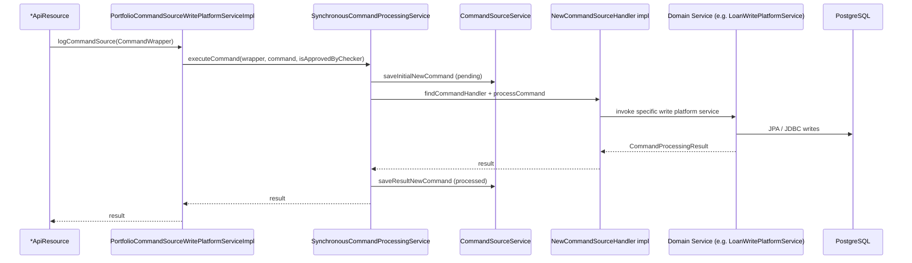
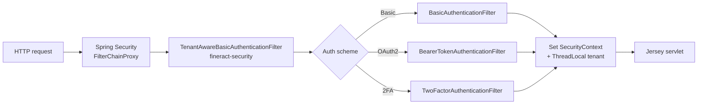
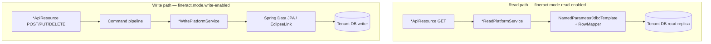
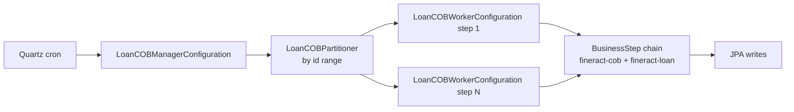
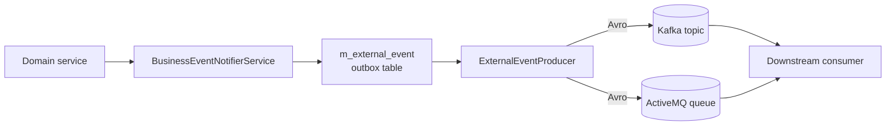
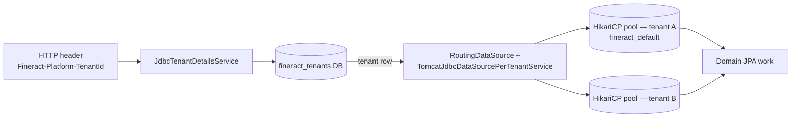

Apache Fineract is an open-source core banking platform built as a Spring Boot
3 / Java 21 monolith. Its architecture is intentionally layered: every state
mutating REST call is routed through a *command source* pipeline so that audit,
authorization, maker-checker, idempotency, and asynchronous execution behave
uniformly across products (loans, savings, accounting, etc.). This page walks
through the layers a request crosses, the parallel batch and event paths, and
the boundary classes that delimit each layer.

<Note>
The bootstrap entry point is
`fineract-provider/src/main/java/org/apache/fineract/ServerApplication.java`,
which imports two Spring configurations — `FineractWebApplicationConfiguration`
(normal web mode) and `FineractLiquibaseOnlyApplicationConfiguration` (DB
migration-only mode). See `overview/runtime-and-deployment` for the runtime
profiles those toggle on.
</Note>

## High-level component diagram

```mermaid
flowchart LR
    Client[HTTP Client / fineract-client SDK]

    subgraph Edge[Edge / fineract-security]
        Filters[Spring Security filter chain<br/>Basic / OAuth2 / 2FA<br/>TenantAwareBasicAuthenticationFilter]
        CORS[CORS + HSTS]
    end

    subgraph API[Presentation / fineract-provider]
        Jersey[Jersey JAX-RS<br/>Servlet '/api/v1/*']
        ApiResource[*ApiResource classes<br/>org.apache.fineract.portfolio.*.api]
        Serializer[ApiRequestJsonSerializationSettings<br/>GoogleGsonSerializerHelper]
    end

    subgraph App[Application / fineract-core commands]
        CSS[SynchronousCommandProcessingService]
        Wrapper[PortfolioCommandSourceWritePlatformServiceImpl]
        Handler[NewCommandSourceHandler<br/>+ CommandWrapper]
        MakerChecker[Maker / Checker<br/>CommandSourceRepository]
    end

    subgraph Domain[Domain modules]
        LoanSvc[fineract-loan + provider<br/>LoanWritePlatformService]
        SavSvc[fineract-savings + provider<br/>SavingsAccountWritePlatformService]
        AcctSvc[fineract-accounting + provider<br/>JournalEntryWritePlatformService]
        ChargeSvc[fineract-charge / -tax / -rates]
    end

    subgraph Infra[Infrastructure / fineract-core]
        JPA[Spring Data JPA<br/>EclipseLink + static weaving]
        Tenant[Tenant routing<br/>RoutingDataSource +<br/>TomcatJdbcDataSourcePerTenantService]
        Events[BusinessEventNotifierService]
    end

    DB[(PostgreSQL<br/>fineract_default<br/>fineract_tenants)]

    subgraph Async[Parallel paths]
        Quartz[Quartz Scheduler]
        Jobs[Spring Batch jobs<br/>fineract-provider /infrastructure/jobs]
        COB[fineract-cob<br/>COB business steps]
        Bus[External event bus<br/>Kafka / ActiveMQ JMS]
    end

    Client --> Filters --> CORS --> Jersey
    Jersey --> ApiResource --> Serializer --> CSS
    CSS --> Wrapper --> Handler --> MakerChecker
    Handler --> LoanSvc
    Handler --> SavSvc
    Handler --> AcctSvc
    Handler --> ChargeSvc
    LoanSvc --> JPA
    SavSvc --> JPA
    AcctSvc --> JPA
    ChargeSvc --> JPA
    JPA --> Tenant --> DB
    LoanSvc -.publishes.-> Events
    Events -.async.-> Bus

    Quartz --> Jobs --> COB
    COB --> LoanSvc
    Jobs --> JPA
```



## Layered view

Fineract is organised into four classical layers; each layer is owned by a
distinct Gradle module so that the dependency direction never points "up".

<CardGroup cols={2}>
<Card title="Presentation" icon="globe">
JAX-RS resources, JSON (de)serialisation, OpenAPI annotations. Lives mostly in
`fineract-provider/src/main/java/org/apache/fineract/**/api`.
</Card>
<Card title="Application" icon="bolt">
Use-cases coordinated through the command pipeline.
`fineract-command`, `fineract-command-jdbc`, `fineract-command-audit`,
`fineract-command-async`, `fineract-command-disruptor`.
</Card>
<Card title="Domain" icon="building">
Aggregates and entities. One module per bounded context — `fineract-loan`,
`fineract-savings`, `fineract-accounting`, `fineract-charge`, …
</Card>
<Card title="Infrastructure" icon="server">
Cross-cutting concerns: multi-tenancy, JPA, scheduling, events, security.
`fineract-core`, `fineract-security`, `fineract-cob`, `fineract-validation`.
</Card>
</CardGroup>

### 1. Presentation layer

The presentation layer is implemented as Jersey JAX-RS resources hosted inside
the embedded Tomcat that Spring Boot starts from `ServerApplication`. The
servlet container is configured by `fineract-provider`; resources are scanned
from `org.apache.fineract.**.api` packages.

Boundary classes:

- `fineract-provider/src/main/java/org/apache/fineract/infrastructure/core/jersey/` —
  Jersey `ResourceConfig`, filters, exception mappers (also `fineract-core/.../infrastructure/core/jersey/` and `.../infrastructure/core/api/jersey/`).
- `fineract-provider/src/main/java/org/apache/fineract/portfolio/loanaccount/api/LoansApiResource.java`
  (the `Loan` aggregate lives in `fineract-loan`, but the API entry resources
  for loans, savings, and journal entries are assembled in `fineract-provider`).
- `fineract-provider/src/main/java/org/apache/fineract/portfolio/savings/api/SavingsAccountsApiResource.java`
- `fineract-provider/src/main/java/org/apache/fineract/accounting/journalentry/api/JournalEntriesApiResource.java`
- Domain-side resources such as
  `fineract-loan/src/main/java/org/apache/fineract/portfolio/loanaccount/api/LoanScheduleApiResource.java`.

A resource method does only three things: (1) authorise the *action*, not the
*data*, via `PlatformSecurityContext`; (2) construct a `CommandWrapper`
describing the intended mutation; (3) hand it off to the command pipeline. It
never touches a JPA repository directly.

```java
// Conceptual shape used across *ApiResource classes
final CommandWrapper commandRequest = new CommandWrapperBuilder() //
        .createLoanApplication() //
        .withJson(apiRequestBodyAsJson) //
        .build();

final CommandProcessingResult result =
        commandsSourceWritePlatformService.logCommandSource(commandRequest);
return toApiJsonSerializer.serialize(result);
```

### 2. Application layer — the command pipeline

Every write goes through this layer. It is the single seam where Fineract
attaches transactionality, auditing, maker-checker, idempotency, and optional
asynchronous execution.



Boundary classes — all in `fineract-core` (the legacy command-source pipeline):

- `fineract-core/src/main/java/org/apache/fineract/commands/service/SynchronousCommandProcessingService.java`
- `fineract-core/src/main/java/org/apache/fineract/commands/service/CommandSourceService.java`
- `fineract-core/src/main/java/org/apache/fineract/commands/service/PortfolioCommandSourceWritePlatformServiceImpl.java`
- `fineract-core/src/main/java/org/apache/fineract/commands/service/CommandWrapperBuilder.java`
- `fineract-core/src/main/java/org/apache/fineract/commands/service/IdempotencyKeyResolver.java`
- `fineract-core/src/main/java/org/apache/fineract/commands/handler/NewCommandSourceHandler.java`
- `fineract-core/src/main/java/org/apache/fineract/commands/domain/CommandSource.java`
- `fineract-core/src/main/java/org/apache/fineract/commands/domain/CommandWrapper.java`
- `fineract-core/src/main/java/org/apache/fineract/commands/domain/CommandSourceRepository.java`

`CommandSource` is the persistent audit record (`m_portfolio_command_source`
table); it stores the JSON payload, the acting user, the resource id and the
outcome.

The separate `fineract-command*` family of modules (with package prefix
`org.apache.fineract.command.*`) is a parallel, next-generation command
processing infrastructure introduced under FINERACT-2169: `fineract-command`
defines `CommandDispatcher`, `CommandHandlerManager`, and
`SynchronousCommandDispatcher`; `fineract-command-jdbc` ships a `CommandStore`
backed by Spring Data JDBC; `fineract-command-audit` adds before/after/error
hooks for audit; `fineract-command-async` provides `AsyncCommandDispatcher`;
and `fineract-command-disruptor` plugs in an LMAX Disruptor for very
high-throughput write paths. These modules run independently next to the
legacy pipeline and are not yet wired into every domain service.

### 3. Domain layer

Each domain module owns one bounded context and follows the conventional sub-
package layout:

| Sub-package | Role |
|-------------|------|
| `api` | JAX-RS resources, OpenAPI annotations |
| `data` | DTOs returned to clients (read model) |
| `domain` | JPA entities, aggregates, repositories |
| `handler` | `CommandSourceHandler` implementations |
| `service` | Read / Write platform services |
| `serialization` | Gson `JsonCommand` deserialisers and validators |
| `jobs` | Spring Batch / Quartz step definitions |
| `exception` | Domain-specific `PlatformException` subtypes |
| `starter` | Spring `@Configuration` wiring for the module |

For example, the loan domain lives under
`fineract-loan/src/main/java/org/apache/fineract/portfolio/loanaccount/` and the
write services delegate to aggregate roots like
`portfolio/loanaccount/domain/Loan.java`.

### 4. Infrastructure layer (`fineract-core`)

`fineract-core` is the foundation almost every domain module depends on
(`fineract-core` itself depends on `fineract-command`, `fineract-validation`
and `fineract-avro-schemas`). It contains:

- Multi-tenancy: `infrastructure/core/service/tenant/` —
  `JdbcTenantDetailsService`, `TenantDetailsService`, `TenantMapper`; the
  actual routing data source lives in
  `infrastructure/core/service/database/` —
  `RoutingDataSource`, `RoutingDataSourceService`,
  `TomcatJdbcDataSourcePerTenantService`,
  `DataSourcePerTenantServiceFactory`, plus
  `infrastructure/core/service/ThreadLocalContextUtil.java`.
- JPA / EclipseLink config: `infrastructure/core/config/`. Note that entities
  are **statically woven** at build time (see `STATIC_WEAVING.md`).
- Liquibase migration runner: `infrastructure/core/service/migration/`
  (`TenantDataSourceFactory`).
- Business event bus: `infrastructure/event/business/` —
  `BusinessEventNotifierService` (impl in `BusinessEventNotifierServiceImpl`).
- External-event producer SPI: `infrastructure/event/external/producer/ExternalEventProducer.java`
  (Kafka / JMS producers live in `fineract-provider/.../infrastructure/event/external/producer/{kafka,jms}/`).
- Job scheduler bindings: `infrastructure/jobs/` (Quartz + Spring Batch) and
  `infrastructure/jobs/service/JobName.java` enum.
- Security primitives shared with `fineract-security`:
  `infrastructure/security/service/PlatformSecurityContext`,
  `useradministration/domain/AppUser`, `Role`, `Permission`.

## Security path



The `fineract-security` module owns the filter chain and three authentication
flavours (basic, OAuth2, optional 2FA). The tenant identifier is resolved
*before* authentication runs — the inbound HTTP header
`Fineract-Platform-TenantId` selects which row in the `tenants` database to
route the request to. From that point on, every database connection in the
thread comes from that tenant's HikariCP pool.

Toggles in `fineract-provider/src/main/resources/application.properties`:

```properties
fineract.security.basicauth.enabled=${FINERACT_SECURITY_BASICAUTH_ENABLED:true}
fineract.security.oauth2.enabled=${FINERACT_SECURITY_OAUTH_ENABLED:false}
fineract.security.2fa.enabled=${FINERACT_SECURITY_2FA_ENABLED:false}
fineract.security.hsts.enabled=${FINERACT_SECURITY_HSTS_ENABLED:false}
fineract.security.cors.enabled=${FINERACT_SECURITY_CORS_ENABLED:true}
```

## Read vs. write path



Read operations bypass the command pipeline entirely — they go straight to
`*ReadPlatformService` classes (e.g. `LoanReadPlatformServiceImpl`) which use
hand-written SQL through `NamedParameterJdbcTemplate`. This is deliberate:
reads are tuned for projection shape rather than aggregate consistency.

The two paths can be turned off independently per node via instance mode flags
(see `overview/runtime-and-deployment`):

```properties
fineract.mode.read-enabled=${FINERACT_MODE_READ_ENABLED:true}
fineract.mode.write-enabled=${FINERACT_MODE_WRITE_ENABLED:true}
fineract.mode.batch-worker-enabled=${FINERACT_MODE_BATCH_WORKER_ENABLED:true}
fineract.mode.batch-manager-enabled=${FINERACT_MODE_BATCH_MANAGER_ENABLED:true}
```

## Parallel paths

### Quartz scheduler + Spring Batch jobs

`fineract-provider/src/main/java/org/apache/fineract/infrastructure/jobs/`
contains the Quartz wiring
(`service/SchedulerJobListener.java`, `ScheduledJobRunnerConfig.java`, etc.),
backed by the `JobName` enum in
`fineract-core/src/main/java/org/apache/fineract/infrastructure/jobs/service/JobName.java`.
Each job is registered in the `m_job` table and triggers a Spring Batch job
whose `Step` beans live in the relevant domain module (e.g. `fineract-loan`
defines `ApplyChargeToOverdueLoansBusinessStep` under
`src/main/java/org/apache/fineract/cob/loan/`).

The `fineract.mode.batch-manager-enabled` / `batch-worker-enabled` properties
select the Spring Batch role for the node — useful when running a cluster
where one node owns the schedule and others execute partitions.

### Close of Business (COB)

`fineract-cob` defines the COB orchestration: a chained Spring Batch job whose
`BusinessStep` beans implement per-loan / per-savings end-of-day work
(delinquency aging, accrual posting, due notifications). Steps are registered
in `m_batch_business_step` and ordered per business process.



Boundary classes:

- `fineract-cob/src/main/java/org/apache/fineract/cob/COBBusinessStep.java` (SPI)
- `fineract-cob/src/main/java/org/apache/fineract/cob/COBBusinessStepService.java`
  (impl: `COBBusinessStepServiceImpl.java`)
- `fineract-loan/src/main/java/org/apache/fineract/cob/loan/LoanCOBBusinessStep.java`
  (the loan-flavoured marker interface)
- `fineract-provider/src/main/java/org/apache/fineract/cob/loan/LoanCOBManagerConfiguration.java`
  + `LoanCOBWorkerConfiguration.java` + `LoanCOBPartitioner.java` — Spring
  Batch wiring for the COB job.
- `fineract-loan/src/main/java/org/apache/fineract/cob/loan/` and
  `fineract-provider/src/main/java/org/apache/fineract/cob/loan/` — concrete
  business steps (e.g. `ApplyChargeToOverdueLoansBusinessStep`,
  `AccrualActivityPostingBusinessStep`,
  `CheckLoanRepaymentDueBusinessStep`).

### External events — Kafka / ActiveMQ

Business changes raised by domain services are pushed through
`BusinessEventNotifierService` in
`fineract-core/src/main/java/org/apache/fineract/infrastructure/event/business/service/`.
The `fineract-avro-schemas` module defines the Avro contract for the public
event payload, the `ExternalEventProducer` SPI lives in
`fineract-core/src/main/java/org/apache/fineract/infrastructure/event/external/producer/`,
and the concrete Kafka and JMS implementations live under
`fineract-provider/src/main/java/org/apache/fineract/infrastructure/event/external/producer/{kafka,jms}/`.
The compose files
`docker-compose-postgresql-kafka.yml` and
`docker-compose-postgresql-activemq.yml` show the two officially tested
brokers.



## Transactions and consistency

Every command-source invocation runs inside a single Spring-managed
transaction; the `CommandSource` record and the domain writes commit together.
The maker-checker flow saves the command in `awaitingApproval` state instead of
executing it; a checker user later invokes
`PortfolioCommandSourceWritePlatformService#approveEntry`, which re-runs the
same handler under their identity.

Idempotency on writes is provided by
`fineract-core/src/main/java/org/apache/fineract/commands/service/IdempotencyKeyResolver.java`
(generator: `IdempotencyKeyGenerator.java`). The inbound `Idempotency-Key`
header is hashed and stored on the `CommandSource` row;
`IdempotencyStoreFilter` (in
`fineract-core/.../infrastructure/core/filters/`) makes duplicate retries
return the original `CommandProcessingResult` rather than executing twice.

## Multi-tenancy in one picture



`fineract-core/src/main/java/org/apache/fineract/infrastructure/core/service/tenant/`
(`JdbcTenantDetailsService`, `TenantDetailsService`, `TenantMapper`) resolves
the inbound tenant identifier, and
`infrastructure/core/service/database/` owns the routing primitives
(`RoutingDataSource`, `RoutingDataSourceService`,
`TomcatJdbcDataSourcePerTenantService`, `DataSourcePerTenantServiceFactory`,
`HikariDataSourceFactory`). `ThreadLocalContextUtil`
(`infrastructure/core/service/ThreadLocalContextUtil.java`) stores the
resolved tenant for the duration of the request, so all repositories
transparently see the correct database.

## Where each layer lives — quick file map

| Layer | Module | Representative path |
|------|--------|---------------------|
| HTTP edge | `fineract-security` | `src/main/java/org/apache/fineract/infrastructure/security/filter/TenantAwareBasicAuthenticationFilter.java` |
| Servlet container | `fineract-provider` | `src/main/java/org/apache/fineract/ServerApplication.java` |
| JAX-RS resources | `fineract-provider` (most) + several domain modules | `**/portfolio/**/api/*ApiResource.java` |
| Serialisation | `fineract-core` | `infrastructure/core/serialization/` (`GoogleGsonSerializerHelper`, `ApiRequestJsonSerializationSettings`) |
| Command pipeline (legacy, in production use) | `fineract-core` | `commands/service/SynchronousCommandProcessingService.java` |
| Command pipeline (new, FINERACT-2169) | `fineract-command` | `command/core/CommandDispatcher.java`, `command/implementation/SynchronousCommandDispatcher.java` |
| Audit hooks (new pipeline) | `fineract-command-audit` | `command/audit/hook/` |
| Async / Disruptor (new pipeline) | `fineract-command-async`, `fineract-command-disruptor` | `command/async/implementation/AsyncCommandDispatcher.java`, `command/disruptor/implementation/DisruptorCommandDispatcher.java` |
| JDBC command store (new pipeline) | `fineract-command-jdbc` | `command/jdbc/store/JdbcCommandStore.java` |
| Domain write services | `fineract-loan` (interface) + `fineract-provider` (impl), `fineract-savings`, … | `**/service/*WritePlatformService.java`, `**/service/*WritePlatformServiceJpaRepositoryImpl.java` |
| JPA entities | each domain module | `**/domain/*.java` |
| Multi-tenancy | `fineract-core` | `infrastructure/core/service/tenant/` + `infrastructure/core/service/database/` |
| Scheduler | `fineract-provider` + `fineract-cob` | `infrastructure/jobs/`, `cob/` |
| Events | `fineract-core` + `fineract-avro-schemas` | `infrastructure/event/business/` (in-process), `infrastructure/event/external/producer/` (Kafka/JMS) |
| Migrations | `fineract-core` + `fineract-provider` | `infrastructure/core/service/migration/`, `fineract-provider/src/main/resources/db/changelog/{tenant,tenant-store}/` |

<Tip>
The cleanest way to understand a single feature is to follow one
`CommandWrapperBuilder` factory method from an `*ApiResource`, locate the
matching `@CommandType` handler in the same domain module's `handler/`
package, then read the `*WritePlatformServiceJpaRepositoryImpl` it invokes.
Three files, one feature.
</Tip>

## Further reading

<CardGroup cols={2}>
<Card title="Repository layout" href="/overview/repository-layout">
Annotated map of every Gradle module and the standard sub-package layout.
</Card>
<Card title="Module graph" href="/overview/module-graph">
Inter-module dependency graph and package ownership table.
</Card>
<Card title="Runtime & deployment" href="/overview/runtime-and-deployment">
Boot configurations, instance mode flags, Docker Compose and Kubernetes.
</Card>
<Card title="Glossary" href="/overview/glossary">
Banking and Fineract-specific terms used throughout the codebase.
</Card>
</CardGroup>
