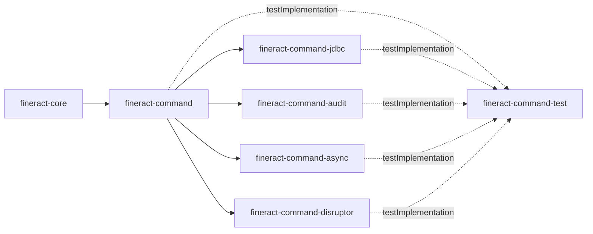
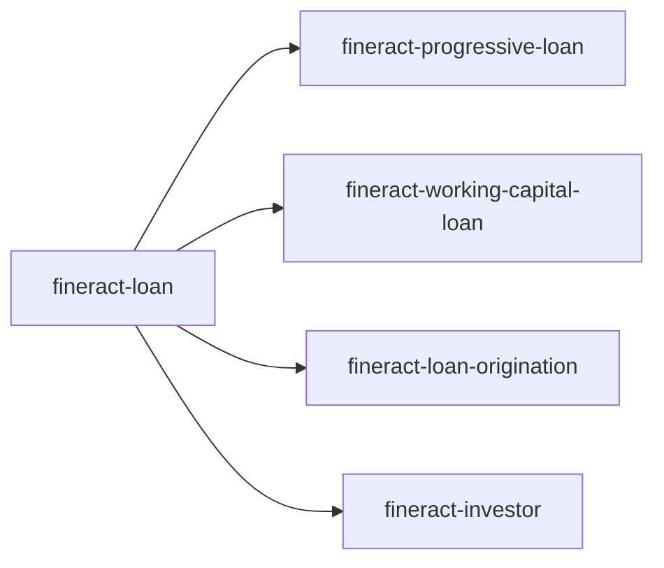

Apache Fineract is a Gradle multi-project build with strict, intentional
dependency directions. This page renders the graph derived from each module's
`dependencies.gradle` file and lists which Java package prefix is owned by
which module — so you can answer "where does this class live?" in one lookup.

<Note>
The arrows below were extracted directly from each module's
`dependencies.gradle` file using
`grep -E "project\(path:" fineract-*/dependencies.gradle`. They are the
*source of truth* — if you add a new module dependency, that file is what you
edit, and this page is what you regenerate.
</Note>

## The big picture

```mermaid
flowchart TB
    classDef foundation fill:#1f6feb,stroke:#0b3d91,color:#fff
    classDef pipeline   fill:#a371f7,stroke:#5a32a3,color:#fff
    classDef cross      fill:#3fb950,stroke:#1f6f30,color:#fff
    classDef product    fill:#d29922,stroke:#8a5a00,color:#fff
    classDef assembly   fill:#f85149,stroke:#8a1f1f,color:#fff
    classDef event      fill:#56d4dd,stroke:#1f6f74,color:#000

    core[fineract-core]:::foundation
    validation[fineract-validation]:::foundation
    security[fineract-security]:::foundation

    command[fineract-command]:::pipeline
    cmdjdbc[fineract-command-jdbc]:::pipeline
    cmdaudit[fineract-command-audit]:::pipeline
    cmdasync[fineract-command-async]:::pipeline
    cmddisr[fineract-command-disruptor]:::pipeline

    cob[fineract-cob]:::cross
    avro[fineract-avro-schemas]:::event

    rates[fineract-rates]:::cross
    tax[fineract-tax]:::cross
    charge[fineract-charge]:::cross
    accounting[fineract-accounting]:::cross
    branch[fineract-branch]:::cross
    document[fineract-document]:::cross
    report[fineract-report]:::cross
    mix[fineract-mix]:::cross

    loan[fineract-loan]:::product
    savings[fineract-savings]:::product
    progressive[fineract-progressive-loan]:::product
    working[fineract-working-capital-loan]:::product
    origination[fineract-loan-origination]:::product
    investor[fineract-investor]:::product

    provider[fineract-provider]:::assembly
    war[fineract-war]:::assembly

    %% Foundation — note that fineract-core itself depends on
    %% fineract-command, fineract-validation and fineract-avro-schemas;
    %% the "old" command-source pipeline lives inside fineract-core.
    core --> command
    core --> validation
    core --> avro
    security --> core
    cob --> core
    cob --> command
    cob --> validation
    cob --> avro

    %% Pipeline siblings (the FINERACT-2169 redesign — independent of fineract-core)
    cmdjdbc --> command
    cmdaudit --> command
    cmdasync --> command
    cmddisr --> command

    %% Cross-cutting
    tax --> core
    rates --> core
    charge --> core
    charge --> tax
    accounting --> core
    accounting --> charge
    accounting --> avro
    branch --> core
    branch --> accounting
    document --> core
    document --> command
    report --> core
    mix --> core
    mix --> command

    %% Products
    loan --> core
    loan --> cob
    loan --> accounting
    loan --> charge
    loan --> rates
    loan --> tax

    savings --> core
    savings --> cob
    savings --> accounting
    savings --> charge
    savings --> rates
    savings --> tax

    progressive --> core
    progressive --> accounting
    progressive --> charge
    progressive --> loan
    progressive --> avro

    working --> core
    working --> loan
    working --> accounting
    working --> cob
    working --> avro

    origination --> core
    origination --> loan
    origination --> avro

    investor --> core
    investor --> cob
    investor --> accounting
    investor --> charge
    investor --> loan
    investor --> avro

    %% Assembly
    provider --> core
    provider --> cob
    provider --> command
    provider --> cmdaudit
    provider --> cmdjdbc
    provider --> validation
    provider --> accounting
    provider --> investor
    provider --> rates
    provider --> charge
    provider --> loan
    provider --> savings
    provider --> branch
    provider --> document
    provider --> progressive
    provider --> report
    provider --> tax
    provider --> origination
    provider --> security
    provider --> working
    provider --> mix
    provider --> avro

    war --> provider
```



## Reading the graph

Five horizontal "tiers" emerge:

1. **Foundation** — `fineract-validation`, `fineract-avro-schemas`,
   `fineract-command`. None of these have any first-party project dependencies
   (`fineract-command` only pulls in `fineract-command-test` and
   `fineract-validation` as test deps). `fineract-core` is *built on top of*
   these — it `implementation`-depends on `fineract-command`,
   `fineract-validation` and `fineract-avro-schemas`. The legacy command-source
   classes (`SynchronousCommandProcessingService`, `CommandSource`, …) live
   inside `fineract-core`.
2. **New-pipeline siblings** — `fineract-command-jdbc`, `fineract-command-audit`,
   `fineract-command-async`, `fineract-command-disruptor`,
   `fineract-command-test`. All depend on `fineract-command` only.
3. **Cross-cutting domains** — `fineract-cob`, `fineract-tax`, `fineract-rates`,
   `fineract-charge`, `fineract-accounting`, `fineract-branch`,
   `fineract-document`, `fineract-report`, `fineract-mix`,
   `fineract-security`.
4. **Product domains** — `fineract-loan`, `fineract-savings`,
   `fineract-progressive-loan`, `fineract-working-capital-loan`,
   `fineract-loan-origination`, `fineract-investor`.
5. **Assembly** — `fineract-provider` pulls in nearly everything; `fineract-war`
   wraps `fineract-provider` (plus a curated list of domain modules) for
   external servlet containers.

<Tip>
The graph is acyclic by construction. The Gradle build will fail loudly the
moment somebody tries to introduce, say, `fineract-charge → fineract-loan`,
because that would create a cycle through `fineract-loan → fineract-charge`.
</Tip>

## Foundation tier

### `fineract-core`

The root of every other module. Owns:

- Multi-tenancy
- JPA / EclipseLink configuration with static weaving
- Quartz scheduler integration
- Business event notifier
- Base entities (`AbstractAuditableCustom`, `AbstractPersistableCustom`)
- Security primitives (`AppUser`, `Role`, `Permission`,
  `PlatformSecurityContext`)
- `FineractProperties` — typed config from `application.properties`

### `fineract-validation`

No first-party project dependencies. Pure validation primitives. Imported by
`fineract-core`, `fineract-cob` and indirectly by every domain module via
Spring component scanning.

### `fineract-security`

Depends only on `fineract-core`. Filter chain definitions, basic auth, OAuth2
resource server, optional 2FA, CORS and HSTS.

### `fineract-avro-schemas`

Houses Avro `.avsc` files for the external event contract. `fineract-core`
depends on it (the `ExternalEventProducer` SPI references generated event
types), and many domain modules pull it in as well because their `event/`
payload classes are generated from these schemas.

## Pipeline tier



The `fineract-command*` modules are the new (FINERACT-2169) command pipeline
under package prefix `org.apache.fineract.command.*`:

- `fineract-command` — SPI + default sync dispatcher
  (`CommandDispatcher`, `CommandHandler`, `CommandHandlerManager`,
  `CommandStore`, `SynchronousCommandDispatcher`).
- `fineract-command-jdbc` — `JdbcCommandStore` plus `CommandEntity` /
  `CommandRepository` (Spring Data JDBC).
- `fineract-command-audit` — `AuditCommandHookBefore`, `AuditCommandHookAfter`,
  `AuditCommandHookError`.
- `fineract-command-async` — `AsyncCommandDispatcher`.
- `fineract-command-disruptor` — `DisruptorCommandDispatcher` backed by an LMAX
  Disruptor ring buffer.
- `fineract-command-test` — `DummyCommand`, `DummyCommandHandler`,
  `DummyApiController`, `CommandBaseTest` and friends; pulled in as
  `testImplementation` only.

The legacy command-source pipeline, which is what every existing JAX-RS write
endpoint actually runs through today, lives **inside `fineract-core`** under
`org.apache.fineract.commands.*` (`SynchronousCommandProcessingService`,
`PortfolioCommandSourceWritePlatformServiceImpl`,
`NewCommandSourceHandler`, `CommandSource`, `CommandWrapper`).

## Cross-cutting tier

| Module | Depends on (project) |
|--------|----------------------|
| `fineract-cob` | `fineract-core`, `fineract-command`, `fineract-validation`, `fineract-avro-schemas` |
| `fineract-tax` | `fineract-core` |
| `fineract-rates` | `fineract-core` |
| `fineract-charge` | `fineract-core`, `fineract-tax` |
| `fineract-accounting` | `fineract-core`, `fineract-charge`, `fineract-avro-schemas` |
| `fineract-branch` | `fineract-core`, `fineract-accounting` |
| `fineract-document` | `fineract-core`, `fineract-command` |
| `fineract-report` | `fineract-core` |
| `fineract-mix` | `fineract-core`, `fineract-command` |

## Product tier

| Module | Depends on (project) |
|--------|----------------------|
| `fineract-loan` | `fineract-core`, `fineract-cob`, `fineract-accounting`, `fineract-charge`, `fineract-rates`, `fineract-tax` |
| `fineract-savings` | `fineract-core`, `fineract-cob`, `fineract-accounting`, `fineract-charge`, `fineract-rates`, `fineract-tax` |
| `fineract-progressive-loan` | `fineract-core`, `fineract-accounting`, `fineract-charge`, `fineract-loan`, `fineract-avro-schemas` |
| `fineract-working-capital-loan` | `fineract-core`, `fineract-loan`, `fineract-accounting`, `fineract-cob`, `fineract-avro-schemas` |
| `fineract-loan-origination` | `fineract-core`, `fineract-loan`, `fineract-avro-schemas` |
| `fineract-investor` | `fineract-core`, `fineract-cob`, `fineract-accounting`, `fineract-charge`, `fineract-loan`, `fineract-avro-schemas` |



The three "specialty loans" all build on top of the base `fineract-loan`. They
extend rather than replace it: the loan aggregate root, repayment schedule
domain, and core API resources are still defined in `fineract-loan`.

## Assembly tier

### `fineract-provider`

Depends on every other domain module *and* every pipeline module that should be
active at runtime:

```groovy
implementation(project(path: ':fineract-core'))
implementation(project(path: ':fineract-cob'))
implementation(project(path: ':fineract-command'))
implementation(project(path: ':fineract-command-audit'))
implementation(project(path: ':fineract-command-jdbc'))
implementation(project(path: ':fineract-validation'))
implementation(project(path: ':fineract-accounting'))
implementation(project(path: ':fineract-investor'))
implementation(project(path: ':fineract-rates'))
implementation(project(path: ':fineract-charge'))
implementation(project(path: ':fineract-loan'))
implementation(project(path: ':fineract-savings'))
implementation(project(path: ':fineract-branch'))
implementation(project(path: ':fineract-document'))
implementation(project(path: ':fineract-progressive-loan'))
implementation(project(path: ':fineract-report'))
implementation(project(path: ':fineract-tax'))
implementation(project(path: ':fineract-loan-origination'))
implementation(project(path: ':fineract-security'))
implementation(project(path: ':fineract-working-capital-loan'))
implementation(project(path: ':fineract-mix'))
implementation(project(path: ':fineract-avro-schemas'))
```

Note that **`fineract-command-async` and `fineract-command-disruptor` are not
in the default provider dependencies** — they are opt-in alternatives. The
production deployment chooses one async strategy by including the appropriate
module.

### `fineract-war`

Wraps `fineract-provider` for deployment into a standalone Tomcat/Jetty. It
only owns packaging-related code; there is no business logic in
`fineract-war/`. Its `build.gradle` `implementation`-depends on
`fineract-provider` plus a curated list of domain modules
(`fineract-accounting`, `fineract-branch`, `fineract-charge`, `fineract-core`,
`fineract-document`, `fineract-investor`, `fineract-loan`,
`fineract-loan-origination`, `fineract-mix`, `fineract-progressive-loan`,
`fineract-rates`, `fineract-savings`, `fineract-working-capital-loan`).

## Package ownership

Fineract's Java packages all sit under `org.apache.fineract.*`. Multiple
modules contribute to the same package prefix — Java doesn't care, but you
need a map to find a class. Below is the *primary* owner per top-level
sub-package, with the modules that also contribute.

| Package prefix | Primary owner | Also contributed to by |
|----------------|---------------|------------------------|
| `org.apache.fineract.infrastructure.core` | `fineract-core` | almost every module adds a few classes |
| `org.apache.fineract.infrastructure.security` | `fineract-security` | `fineract-provider` |
| `org.apache.fineract.infrastructure.event` | `fineract-core` | `fineract-loan`, `fineract-provider` |
| `org.apache.fineract.infrastructure.jobs` | `fineract-provider` | `fineract-core`, `fineract-loan` |
| `org.apache.fineract.infrastructure.dataqueries` | `fineract-provider` | — |
| `org.apache.fineract.infrastructure.bulkimport` | `fineract-provider` | — |
| `org.apache.fineract.infrastructure.campaigns` | `fineract-provider` | — |
| `org.apache.fineract.infrastructure.codes` | `fineract-provider` | — |
| `org.apache.fineract.infrastructure.configuration` | `fineract-provider` | — |
| `org.apache.fineract.infrastructure.creditbureau` | `fineract-provider` | — |
| `org.apache.fineract.infrastructure.entityaccess` | `fineract-provider` | — |
| `org.apache.fineract.infrastructure.gcm` | `fineract-provider` | — |
| `org.apache.fineract.infrastructure.hooks` | `fineract-provider` | — |
| `org.apache.fineract.infrastructure.instancemode` | `fineract-provider` | — |
| `org.apache.fineract.infrastructure.reportmailingjob` | `fineract-provider` | — |
| `org.apache.fineract.infrastructure.s3` | `fineract-provider` | — |
| `org.apache.fineract.infrastructure.sms` | `fineract-provider` | — |
| `org.apache.fineract.infrastructure.springbatch` | `fineract-provider` | — |
| `org.apache.fineract.infrastructure.survey` | `fineract-provider` | — |
| `org.apache.fineract.infrastructure.openapi` | `fineract-provider` | — |
| `org.apache.fineract.commands` (plural) | `fineract-core` | — (this is the legacy command-source pipeline) |
| `org.apache.fineract.cob` | `fineract-cob` | `fineract-loan`, `fineract-investor`, `fineract-savings` |
| `org.apache.fineract.accounting` | `fineract-accounting` | `fineract-loan`, `fineract-savings` (product-account mapping) |
| `org.apache.fineract.adhocquery` | `fineract-provider` | — |
| `org.apache.fineract.batch` | `fineract-provider` | — |
| `org.apache.fineract.interoperation` | `fineract-provider` | — |
| `org.apache.fineract.notification` | `fineract-provider` | — |
| `org.apache.fineract.organisation` | `fineract-provider` | `fineract-branch` |
| `org.apache.fineract.portfolio.loanaccount` | `fineract-loan` | `fineract-progressive-loan`, `fineract-working-capital-loan`, `fineract-loan-origination`, `fineract-investor` |
| `org.apache.fineract.portfolio.loanproduct` | `fineract-loan` | `fineract-progressive-loan` |
| `org.apache.fineract.portfolio.savings` | `fineract-savings` | — |
| `org.apache.fineract.portfolio.charge` | `fineract-charge` | `fineract-loan`, `fineract-savings` (product wiring) |
| `org.apache.fineract.portfolio.tax` | `fineract-tax` | — |
| `org.apache.fineract.portfolio.rate` | `fineract-rates` | — |
| `org.apache.fineract.portfolio.client` | `fineract-provider` | — |
| `org.apache.fineract.portfolio.group` | `fineract-provider` | — |
| `org.apache.fineract.portfolio.fund` | `fineract-provider` | — |
| `org.apache.fineract.portfolio.calendar` | `fineract-provider` | — |
| `org.apache.fineract.portfolio.collateral` | `fineract-loan` | — |
| `org.apache.fineract.portfolio.collateralmanagement` | `fineract-loan` | — |
| `org.apache.fineract.portfolio.collectionsheet` | `fineract-provider` | — |
| `org.apache.fineract.portfolio.delinquency` | `fineract-loan` | — |
| `org.apache.fineract.portfolio.shareaccounts` | `fineract-savings` | — |
| `org.apache.fineract.portfolio.shareproducts` | `fineract-savings` | — |
| `org.apache.fineract.spm` | `fineract-provider` | — |
| `org.apache.fineract.template` | `fineract-provider` | — |
| `org.apache.fineract.useradministration` | `fineract-core` | `fineract-provider`, `fineract-security` |
| `org.apache.fineract.investor` | `fineract-investor` | — |
| `org.apache.fineract.mix` | `fineract-mix` | — |
| `org.apache.fineract.report` | `fineract-report` | — |
| `org.apache.fineract.document` | `fineract-document` | — |
| `org.apache.fineract.command` (singular) | `fineract-command` | `fineract-command-async`, `-audit`, `-disruptor`, `-jdbc`, `-test` |

<Note>
Because Spring scans `org.apache.fineract.**` from a single
`@ComponentScan(basePackages = "org.apache.fineract.**")` in
`FineractWebApplicationConfiguration`, a class's package does **not** decide
which module it belongs to — its file location does. The table above is the
canonical mapping.
</Note>

## Verifying the graph yourself

Two-line check, no IDE required:

```bash
for m in fineract-*/dependencies.gradle; do
  echo "=== $(dirname "$m") ==="
  grep -E "project\(path:" "$m" || echo "  (no project deps)"
done
```

That command produced the data behind every arrow in this page.
`fineract-war` declares its dependencies inside `build.gradle` instead of a
sibling `dependencies.gradle`, so include `grep -E "project\(':" fineract-war/build.gradle`
in the same scan to see the WAR's deps.

## Where to look for…

| You want… | Module |
|-----------|--------|
| To add a new portfolio aggregate | New module under repo root + add to `settings.gradle` + depend on `fineract-core` |
| To extend the command pipeline | `fineract-command` (core), or a new sibling module that depends on `fineract-command` |
| To add a COB step | The domain module + depend on `fineract-cob` |
| To publish a new event | `fineract-avro-schemas` (schema) + domain module (publisher) |
| To plug in a new auth scheme | `fineract-security` |
| To run a one-off SQL migration | `fineract-provider/src/main/resources/db/changelog/` (Liquibase XML) |

## Further reading

<CardGroup cols={2}>
<Card title="Architecture" href="/overview/architecture">
Request flow that this graph supports.
</Card>
<Card title="Repository layout" href="/overview/repository-layout">
Per-module file map and conventional sub-package layout.
</Card>
<Card title="Runtime & deployment" href="/overview/runtime-and-deployment">
How the assembled modules boot.
</Card>
<Card title="Glossary" href="/overview/glossary">
Terminology used in the module names.
</Card>
</CardGroup>
