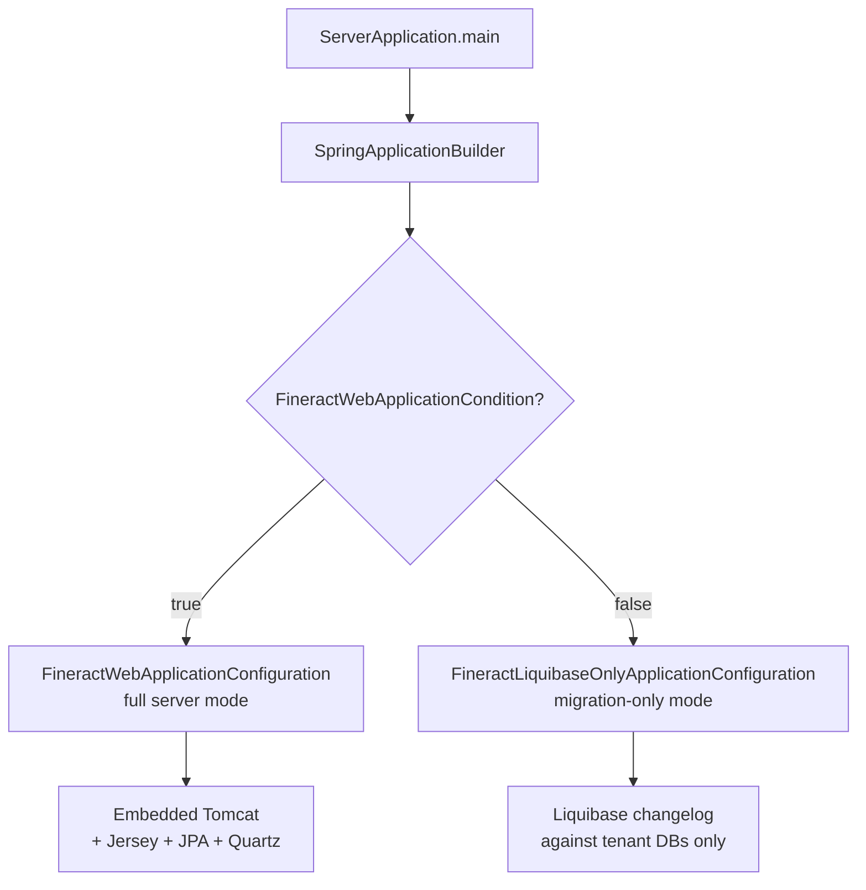
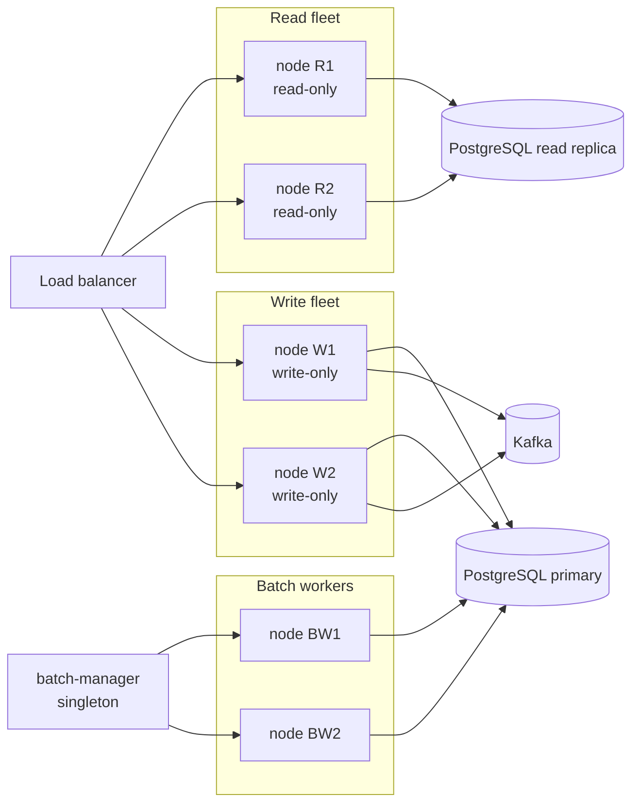
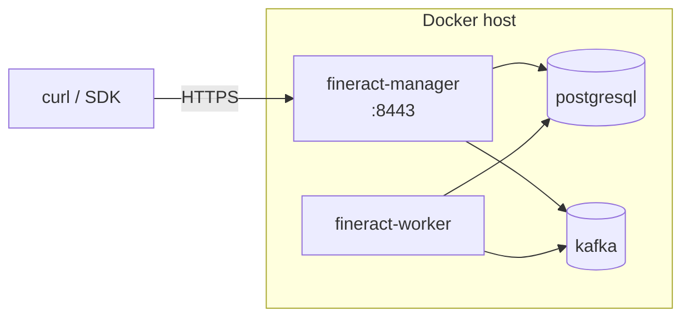
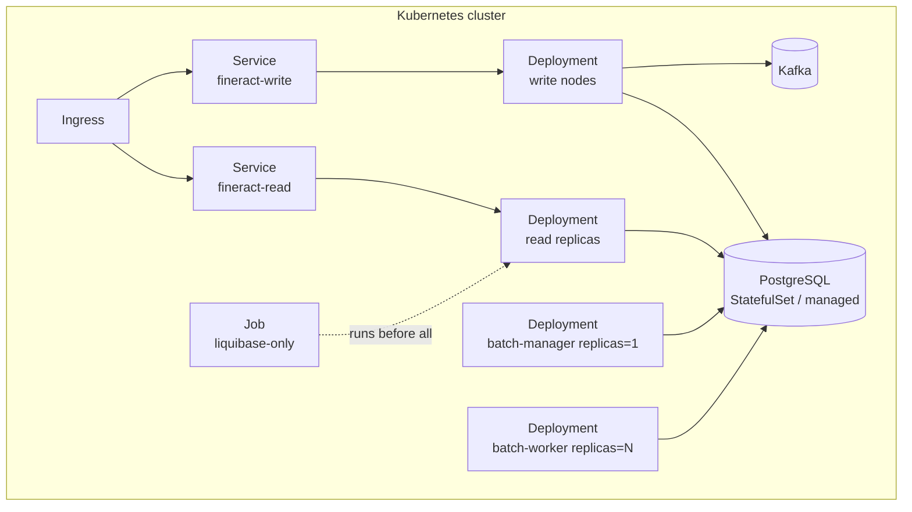

Apache Fineract runs as a Java 21, Spring Boot 3 application backed by
PostgreSQL ≥ 18. A single artefact (`fineract-provider`) supports multiple
*instance modes* so the same jar can boot as a read replica, a write node, a
batch manager, a batch worker, or a Liquibase migration runner. This page
explains the boot wiring, the toggles, the supported container topologies,
and how to assemble them with Docker Compose or Kubernetes.

<Note>
The official supported runtime today is **Java 21**, **PostgreSQL ≥ 18.0**,
and the **Spring Boot self-contained JAR**. Tomcat 10+ via the `fineract-war`
module is also supported but explicitly described in `README.md` as
optional: "Tomcat (min. v10) is only needed if you wish to deploy the
Fineract WAR to a separate external servlet container. You do not need to
install Tomcat to run Fineract. We recommend the use of the self-contained
JAR, which transparently embeds a servlet container using Spring Boot."
Per the same README, support for backend databases other than PostgreSQL is
deprecated (FSIP-9).
</Note>

## Boot entry point

`fineract-provider/src/main/java/org/apache/fineract/ServerApplication.java`
is `main()`. It imports two Spring configurations:

```java
package org.apache.fineract;

public class ServerApplication extends SpringBootServletInitializer {

    @Import({ FineractWebApplicationConfiguration.class, FineractLiquibaseOnlyApplicationConfiguration.class })
    private static final class Configuration {}

    @Override
    protected SpringApplicationBuilder configure(SpringApplicationBuilder builder) {
        return configureApplication(builder);
    }

    private static SpringApplicationBuilder configureApplication(SpringApplicationBuilder builder) {
        return builder.sources(Configuration.class);
    }

    public static void main(String[] args) throws IOException {
        configureApplication(new SpringApplicationBuilder(ServerApplication.class)).run(args);
    }
}
```

Exactly one of those two configurations becomes active at runtime, gated by a
`@Conditional` (the two condition classes live in
`fineract-core/src/main/java/org/apache/fineract/infrastructure/core/condition/`):



### `FineractWebApplicationConfiguration`

Full server. Lives at
`fineract-provider/src/main/java/org/apache/fineract/infrastructure/core/boot/FineractWebApplicationConfiguration.java`:

```java
@Configuration
@EnableAutoConfiguration(exclude = { DataSourceAutoConfiguration.class, HibernateJpaAutoConfiguration.class,
        DataSourceTransactionManagerAutoConfiguration.class, GsonAutoConfiguration.class, JdbcTemplateAutoConfiguration.class,
        LiquibaseAutoConfiguration.class })
@EnableTransactionManagement
@EnableWebSecurity
@EnableConfigurationProperties({ FineractProperties.class, LiquibaseProperties.class })
@ComponentScan(basePackages = "org.apache.fineract.**")
@IntegrationComponentScan(basePackages = "org.apache.fineract.**")
@Conditional(FineractWebApplicationCondition.class)
@Slf4j
// The class needs to be abstract for some reason, otherwise the tests start to fail...
public abstract class FineractWebApplicationConfiguration implements InitializingBean {

    @Override
    public void afterPropertiesSet() throws Exception {
        log.warn("Fineract is running in web application mode");
    }
}
```

Note the autoconfiguration exclusions — Fineract owns its own `DataSource`,
JPA, and Liquibase setup so it can drive **multi-tenant routing**.

### `FineractLiquibaseOnlyApplicationConfiguration`

Migration-only. Designed to be the very first container that starts in a
deployment, brings every tenant database up to the latest schema, then exits.

```java
@Conditional(FineractLiquibaseOnlyApplicationCondition.class)
@Slf4j
@EnableConfigurationProperties({ FineractProperties.class, LiquibaseProperties.class })
@Import({ HikariCpConfig.class, JdbcConfig.class })
@ComponentScan(basePackages = { "org.apache.fineract.infrastructure.core.service.migration",
        "org.apache.fineract.infrastructure.core.service.database", "org.apache.fineract.infrastructure.core.service.tenant" })
public class FineractLiquibaseOnlyApplicationConfiguration implements InitializingBean {

    @Override
    public void afterPropertiesSet() throws Exception {
        log.warn("Fineract is running in Liquibase only mode");
    }
}
```

The companion properties file is
`fineract-provider/src/main/resources/application-liquibase-only.properties`.
You activate this mode with the Spring profile `liquibase-only`.

## Instance mode flags

Even in full-server mode, four flags decide what the node actually does. They
live in `fineract-provider/src/main/resources/application.properties`:

```properties
fineract.mode.read-enabled=${FINERACT_MODE_READ_ENABLED:true}
fineract.mode.write-enabled=${FINERACT_MODE_WRITE_ENABLED:true}
fineract.mode.batch-worker-enabled=${FINERACT_MODE_BATCH_WORKER_ENABLED:true}
fineract.mode.batch-manager-enabled=${FINERACT_MODE_BATCH_MANAGER_ENABLED:true}
```

Wired up in `org.apache.fineract.infrastructure.instancemode` — the
property-backed `FineractInstanceModeConfig` lives in
`fineract-core/src/main/java/org/apache/fineract/infrastructure/instancemode/`
and the JAX-RS request filter that short-circuits disallowed verbs lives in
`fineract-provider/src/main/java/org/apache/fineract/infrastructure/instancemode/api/`.
The matrix:

| Mode | Read API | Write API (command pipeline) | Quartz scheduler | Spring Batch worker |
|------|---------|------------------------------|------------------|---------------------|
| All-in-one (default) | ✅ | ✅ | ✅ (manager) | ✅ (worker) |
| Read replica | ✅ | ❌ | ❌ | ❌ |
| Write node | ❌ | ✅ | ❌ | ❌ |
| Batch manager | ❌ | ❌ | ✅ | ❌ |
| Batch worker | ❌ | ❌ | ❌ | ✅ |

A common production topology splits along these lines:



<Tip>
Read replicas point at a separate read-only DB host via
`fineract.tenant.read-only-host` / `read-only-port` / `read-only-username` /
`read-only-password` — also declared in `application.properties`.
</Tip>

## Tenant routing

Fineract is multi-tenant by design. Every request must carry a
`Fineract-Platform-TenantId` header. `fineract-core` resolves that identifier
against the `tenants` table in the *tenant store* database, then routes JDBC
work to the matching tenant database via a HikariCP pool registered with
`DataSourcePerTenantService`.

Key properties (subset):

```properties
fineract.node-id=${FINERACT_NODE_ID:1}

fineract.tenant.host=${FINERACT_DEFAULT_TENANTDB_HOSTNAME:localhost}
fineract.tenant.port=${FINERACT_DEFAULT_TENANTDB_PORT:3306}
fineract.tenant.username=${FINERACT_DEFAULT_TENANTDB_UID:root}
fineract.tenant.password=${FINERACT_DEFAULT_TENANTDB_PWD:mysql}
fineract.tenant.identifier=${FINERACT_DEFAULT_TENANTDB_IDENTIFIER:default}
fineract.tenant.name=${FINERACT_DEFAULT_TENANTDB_NAME:fineract_default}
fineract.tenant.master-password=${FINERACT_DEFAULT_TENANTDB_MASTER_PASSWORD:fineract}

fineract.tenant.read-only-host=${FINERACT_DEFAULT_TENANTDB_RO_HOSTNAME:}
fineract.tenant.read-only-port=${FINERACT_DEFAULT_TENANTDB_RO_PORT:}
fineract.tenant.read-only-username=${FINERACT_DEFAULT_TENANTDB_RO_UID:}
fineract.tenant.read-only-password=${FINERACT_DEFAULT_TENANTDB_RO_PWD:}

fineract.tenant.config.min-pool-size=${FINERACT_CONFIG_MIN_POOL_SIZE:-1}
fineract.tenant.config.max-pool-size=${FINERACT_CONFIG_MAX_POOL_SIZE:-1}
```

The defaults still mention port 3306 / `mysql` for legacy reasons; production
deployments override every `FINERACT_DEFAULT_TENANTDB_*` env var to point at
PostgreSQL.

## Local developer startup

The `README.md` quickstart, condensed:

```bash
# Get code
git clone https://github.com/apache/fineract.git
cd fineract

# Create DBs
./gradlew createPGDB -PdbName=fineract_tenants
./gradlew createPGDB -PdbName=fineract_default

# Env
export FINERACT_DEFAULT_TENANTDB_PORT=5432
export FINERACT_HIKARI_DRIVER_SOURCE_CLASS_NAME=org.postgresql.Driver
export FINERACT_HIKARI_JDBC_URL=jdbc:postgresql://localhost:5432/fineract_tenants
export POSTGRES_PASSWORD=postgres
export FINERACT_HIKARI_PASSWORD=$POSTGRES_PASSWORD
export FINERACT_DEFAULT_TENANTDB_PWD=$POSTGRES_PASSWORD

# Boot
./gradlew devRun
```

Healthcheck:

```bash
curl --insecure https://localhost:8443/fineract-provider/actuator/health
# => {"status":"UP","groups":["liveness","readiness"]}
```

## Static weaving at build time

Per `STATIC_WEAVING.md`, JPA entities are byte-code-enhanced by
`org.eclipse.persistence.tools.weaving.jpa.StaticWeave` during `compileJava`.
This is configured globally in `static-weaving.gradle` and applies to every
module that contains JPA entities. Each module must ship a
`src/main/resources/jpa/static-weaving/module/<module-name>/persistence.xml`.

> Static weaving is a process that enhances JPA entities at build time to
> improve runtime performance. This is done using the
> `org.eclipse.persistence.tools.weaving.jpa.StaticWeave` which processes the
> compiled classes and applies the necessary bytecode transformations.

Implication for deployment: there is **no class-load-time weaving agent**
required at runtime. The image you build is self-contained.

## Docker

`docker/` ships the `Dockerfile` source. The published image is on Docker Hub
as `apache/fineract` (see badge in `README.md`).

### Compose variants

Twelve `docker-compose-*.yml` files at the repo root cover the supported
storage and messaging combinations:

| File | DB | Messaging | Notes |
|------|----|-----------|-------|
| `docker-compose.yml` | MariaDB | — | Default legacy combo |
| `docker-compose-postgresql.yml` | PostgreSQL | — | Recommended baseline |
| `docker-compose-postgresql-kafka.yml` | PostgreSQL | Kafka | Splits `fineract-manager` and `fineract-worker` |
| `docker-compose-postgresql-kafka-msk.yml` | PostgreSQL | AWS MSK | Same split, MSK endpoint |
| `docker-compose-postgresql-activemq.yml` | PostgreSQL | ActiveMQ | JMS path |
| `docker-compose-postgresql-test-activemq.yml` | PostgreSQL | ActiveMQ | Sized for integration tests |
| `docker-compose-mariadb.yml` | MariaDB | — | Deprecated DB |
| `docker-compose-mysql.yml` | MySQL | — | Deprecated DB |
| `docker-compose-development.yml` | overlay | — | Adds debug ports, mounts source |
| `docker-compose-community-app.yml` | overlay | — | Adds the community web app |
| `docker-compose-web-app.yml` | overlay | — | Adds the standard web app |
| `docker-compose-custom.yml` | overlay | — | Builds & runs the `custom/docker` image |

Each compose file simply *extends* a fragment in `config/docker/compose/`. For
example, `docker-compose.yml`:

```yaml
services:

  db:
    extends:
      file: ./config/docker/compose/mariadb.yml
      service: mariadb

  fineract:
    extends:
      file: ./config/docker/compose/fineract.yml
      service: fineract
    ports:
      - "8443:8443"
      - "5000:5000"
    depends_on:
      db:
        condition: service_healthy
    env_file:
      - ./config/docker/env/fineract.env
      - ./config/docker/env/fineract-common.env
      - ./config/docker/env/fineract-mariadb.env
```

The Kafka variant uses the same extension pattern but boots a Kafka container
and splits Fineract into manager/worker:

```yaml
services:
  kafka:
    image: "apache/kafka:4.1.1-rc2"
    ports:
      - "9092:9092"
    env_file:
      - ./config/docker/env/kafka-server.env

  db:
    extends:
      file: ./config/docker/compose/postgresql.yml
      service: postgresql

  fineract-manager:
    extends:
      file: ./config/docker/compose/fineract.yml
      service: fineract
    ports:
      - "8443:8443"
    depends_on:
      …
```

### Typical compose topology



### Environment files

All env files live under `config/docker/env/`. The relevant ones are usually:

- `fineract.env` — Java options, ports, base settings
- `fineract-common.env` — shared across DB variants
- `fineract-postgresql.env` / `fineract-mariadb.env` — DB-specific overrides
- `kafka-server.env` / `kafka-client.env` — broker tuning

## Kubernetes

`kubernetes/` ships sample manifests:

```text
kubernetes/
├── fineract-mifoscommunity-deployment.yml      ← all-in-one community deployment
├── fineract-server-deployment.yml              ← Fineract server-only
├── fineractmysql-configmap.yml                 ← MySQL config (legacy)
├── fineractmysql-deployment.yml                ← MySQL deployment (legacy)
├── kubectl-startup.sh                          ← apply manifests
└── kubectl-shutdown.sh                         ← delete manifests
```

These are illustrative starting points. Most operators port them to a Helm
chart that templates the `fineract.tenant.*` and `fineract.mode.*` properties
across multiple Deployments — one per instance mode — backed by a
StatefulSet for PostgreSQL (or a managed RDS) and a `kafka` service.



<Steps>
<Step title="Build the image">
`./gradlew :fineract-provider:jibDockerBuild` (or use the published
`apache/fineract` image).
</Step>
<Step title="Run Liquibase">
Boot a one-shot Job with the `liquibase-only` Spring profile that points at
both the tenant store and every tenant DB. It exits when migrations are
applied.
</Step>
<Step title="Roll out read/write/manager/worker">
Each `Deployment` sets `FINERACT_MODE_READ_ENABLED`,
`FINERACT_MODE_WRITE_ENABLED`, `FINERACT_MODE_BATCH_MANAGER_ENABLED`,
`FINERACT_MODE_BATCH_WORKER_ENABLED` to the appropriate `true`/`false` combo.
</Step>
<Step title="Wire Kafka (optional)">
If you publish external events, configure the Kafka properties in
`application.properties` (or override via env vars) and the
`fineract-avro-schemas` event types will be produced.
</Step>
<Step title="Healthcheck">
Liveness/readiness probes hit
`/fineract-provider/actuator/health`.
</Step>
</Steps>

## WAR packaging

For deployments that mandate an external Tomcat / Jetty, the `fineract-war`
module re-packages `fineract-provider` as a WAR:

```text
fineract-war/
├── build.gradle   ← war plugin + dependencies
└── setenv.sh      ← suggested JVM options
```

The runtime requirements documented in `README.md`:

> Tomcat (min. v10) is only needed if you wish to deploy the Fineract WAR to a
> separate external servlet container. You do not need to install Tomcat to
> run Fineract. We recommend the use of the self-contained JAR, which
> transparently embeds a servlet container using Spring Boot.

## Health, observability, security

- **Health**: Spring Boot Actuator at
  `https://<host>:8443/fineract-provider/actuator/health`.
- **Metrics**: Actuator + Micrometer. Prometheus scrape via
  `/actuator/prometheus` if you enable it.
- **HTTPS**: a default self-signed `keystore.jks` ships in
  `fineract-provider/src/main/resources/`. Override it in production.
- **Correlation IDs**: `fineract.correlation.enabled` / `header-name` (default
  `X-Correlation-ID`) add a per-request id to logs.

```properties
fineract.correlation.enabled=${FINERACT_LOGGING_HTTP_CORRELATION_ID_ENABLED:false}
fineract.correlation.header-name=${FINERACT_LOGGING_HTTP_CORRELATION_ID_HEADER_NAME:X-Correlation-ID}
fineract.ip-tracking.enabled=${FINERACT_CLIENT_IP_TRACKING_ENABLED:false}
```

## Choosing a topology

<CardGroup cols={2}>
<Card title="Single-node (dev)" icon="laptop-code">
`./gradlew devRun`. All four `fineract.mode.*` flags true. PostgreSQL on
localhost.
</Card>
<Card title="Compose dev stack" icon="docker">
`docker compose -f docker-compose-postgresql.yml up`. Single Fineract,
PostgreSQL, no Kafka.
</Card>
<Card title="Compose with Kafka" icon="boxes-stacked">
`docker compose -f docker-compose-postgresql-kafka.yml up`. Manager + worker
+ Kafka + PostgreSQL.
</Card>
<Card title="Kubernetes split fleet" icon="server">
Read / write / batch-manager / batch-worker as separate Deployments. Liquibase
runs as a Job. PostgreSQL managed. Kafka via Strimzi or MSK.
</Card>
</CardGroup>

## Further reading

<CardGroup cols={2}>
<Card title="Architecture" href="/overview/architecture">
The request-flow this runtime supports.
</Card>
<Card title="Repository layout" href="/overview/repository-layout">
Which module owns the Docker, Kubernetes, and packaging assets.
</Card>
<Card title="Module graph" href="/overview/module-graph">
Why `fineract-war` only depends on `fineract-provider`.
</Card>
<Card title="Glossary" href="/overview/glossary">
Terms like *tenant store*, *batch manager*, *COB* used throughout.
</Card>
</CardGroup>
