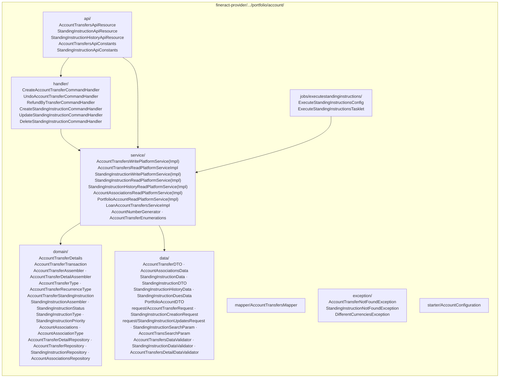
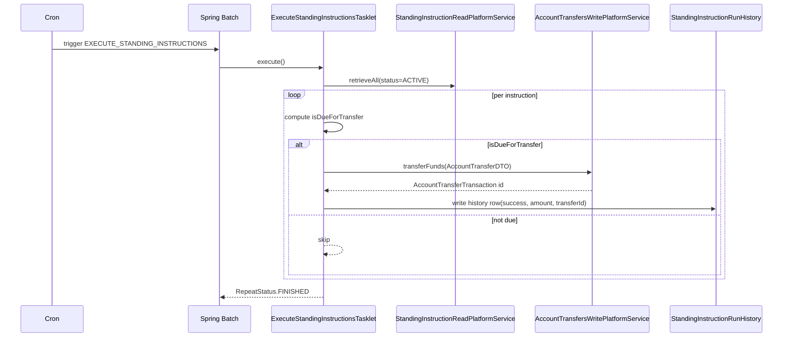

The **account transfers** subsystem moves money between two Apache Fineract accounts — savings → savings, savings → loan repayment, loan disbursal → savings, charge payment — in a single auditable record. The **standing instructions** subsystem sits on top: a saved recurring transfer that fires automatically at a configured cadence, walked daily by a Spring Batch job.

This is **money movement between accounts**, not client movement between offices. For the latter, see [Transfers](/portfolio/transfers).

Two packages cohabit:

- `portfolio/account/` — the canonical home: domain entities, command handlers, write/read services, the `EXECUTE_STANDING_INSTRUCTIONS` job, the two main REST resources (`AccountTransfersApiResource`, `StandingInstructionApiResource`, `StandingInstructionHistoryApiResource`).
- `portfolio/accounts/` — a parallel package that hosts the generic *share account* API resource (`AccountsApiResource`). It is unrelated to account transfers despite the similar name — the s‑variant is a discriminated‑union resource over share/savings/loan account commands.

## Where the code lives



## The transfer entities

### `AccountTransferDetails`

`fineract-provider/src/main/java/org/apache/fineract/portfolio/account/domain/AccountTransferDetails.java` (`m_account_transfer_details`) — the **parent** of a transfer; carries the from/to identity:

```java
@Entity
@Table(name = "m_account_transfer_details")
public class AccountTransferDetails extends AbstractPersistableCustom<Long> {
    @ManyToOne @JoinColumn(name = "from_office_id",        nullable = false) private Office fromOffice;
    @ManyToOne @JoinColumn(name = "from_client_id",        nullable = false) private Client fromClient;
    @ManyToOne @JoinColumn(name = "from_savings_account_id")                 private SavingsAccount fromSavingsAccount;
    @ManyToOne @JoinColumn(name = "from_loan_account_id")                    private Loan fromLoanAccount;
    @ManyToOne @JoinColumn(name = "to_office_id",          nullable = false) private Office toOffice;
    @ManyToOne @JoinColumn(name = "to_client_id",          nullable = false) private Client toClient;
    @ManyToOne @JoinColumn(name = "to_savings_account_id")                   private SavingsAccount toSavingsAccount;
    @ManyToOne @JoinColumn(name = "to_loan_account_id")                      private Loan toLoanAccount;
    @Column(name = "transfer_type") private Integer transferType;            // AccountTransferType
    @OneToMany(cascade = CascadeType.ALL, mappedBy = "accountTransferDetails", orphanRemoval = true, fetch = FetchType.EAGER)
    private List<AccountTransferTransaction> accountTransferTransactions;
}
```

Exactly one `from_*_account_id` and one `to_*_account_id` are non-null for each row — the discriminator is `transfer_type`.

### `AccountTransferType`

```java
public enum AccountTransferType {
    INVALID(0),
    ACCOUNT_TRANSFER(1),       // savings → savings
    LOAN_REPAYMENT(2),         // savings → loan repayment
    CHARGE_PAYMENT(3),
    INTEREST_TRANSFER(4),      // savings interest sweep
    LOAN_DOWN_PAYMENT(5);
}
```

### `AccountTransferTransaction`

Each *occurrence* of the transfer is a row in `m_account_transfer_transaction`:

```java
public class AccountTransferTransaction extends AbstractPersistableCustom<Long> {
    @ManyToOne @JoinColumn(name = "account_transfer_details_id")  private AccountTransferDetails accountTransferDetails;
    @ManyToOne @JoinColumn(name = "from_savings_transaction_id")  private SavingsAccountTransaction fromSavingsTransaction;
    @ManyToOne @JoinColumn(name = "to_savings_transaction_id")    private SavingsAccountTransaction toSavingsTransaction;
    @ManyToOne @JoinColumn(name = "from_loan_transaction_id")     private LoanTransaction fromLoanTransaction;
    @ManyToOne @JoinColumn(name = "to_loan_transaction_id")       private LoanTransaction toLoanTransaction;
    @Column(name = "is_reversed", nullable = false)               private boolean reversed;
    @Column(name = "transaction_date")                            private LocalDate transactionDate;
    @Column(name = "amount", scale = 6, precision = 19)           private BigDecimal amount;
    @Column(name = "description", length = 100)                   private String description;
}
```

The pair of `*_savings_transaction_id` / `*_loan_transaction_id` columns lets each leg of the money move be traced back to the actual savings/loan transaction it created — i.e. the transfer row *summarises* two account-side transactions that are themselves stored as journal entries.

### `AccountAssociations` — the linked-account index

```java
public class AccountAssociations extends AbstractPersistableCustom<Long> {
    @ManyToOne @JoinColumn(name = "loan_account_id")             private Loan loanAccount;
    @ManyToOne @JoinColumn(name = "savings_account_id")          private SavingsAccount savingsAccount;
    @ManyToOne @JoinColumn(name = "linked_loan_account_id")      private Loan linkedLoanAccount;
    @ManyToOne @JoinColumn(name = "linked_savings_account_id")   private SavingsAccount linkedSavingsAccount;
    @Column(name = "association_type_enum", nullable = false)    private Integer associationTypeEnum;
    @Column(name = "is_active", nullable = false)                private boolean isActive;
}
```

This is the *standing link* (e.g. *"This loan repays from this savings account"*) used by the standing-instruction engine and the recurring loan-repayment-from-savings feature. `AccountAssociationType`:

```java
public enum AccountAssociationType {
    INVALID(0),
    LINKED_ACCOUNT_ASSOCIATION(1),
    GUARANTOR_ACCOUNT_ASSOCIATION(2);
}
```

## REST: `AccountTransfersApiResource`

`fineract-provider/.../portfolio/account/api/AccountTransfersApiResource.java`:

```java
@Path("/v1/accounttransfers")
public class AccountTransfersApiResource {

  @GET                                       Page<AccountTransferData> retrieveAll(AccountTransSearchParam)
  @GET @Path("template")                     AccountTransferData       retrieveTemplate(...)
  @POST                                      String                    create(String json)
  @GET @Path("{transferId}")                 AccountTransferData       retrieveOne(@PathParam("transferId") Long id)
  @GET @Path("templateRefundByTransfer")     AccountTransferData       templateRefund(...)
  @POST @Path("refundByTransfer")            String                    refundByTransfer(String json)
  @POST @Path("{accountTransferId}")         String                    undoAccountTransfer(@PathParam("accountTransferId") Long id,
                                                                                          @QueryParam("command") String commandParam,
                                                                                          String json)
}
```

Notable verbs:

| Verb | Handler | Effect |
| --- | --- | --- |
| `POST /v1/accounttransfers` | `CreateAccountTransferCommandHandler` | Creates an ad-hoc one-shot transfer; persists `AccountTransferDetails` + the two leg transactions. |
| `POST /v1/accounttransfers/refundByTransfer` | `RefundByTransferCommandHandler` | Loan over-payment refunded back to a savings account. |
| `POST /v1/accounttransfers/{id}?command=undo` | `UndoAccountTransferCommandHandler` | Reverses the linked transactions; sets `is_reversed=true`. |

## Standing instructions: the recurring story

`AccountTransferStandingInstruction` is the second-class citizen entity that turns an *ad-hoc* transfer into a *recurring* one:

```java
public class AccountTransferStandingInstruction extends AbstractPersistableCustom<Long> {
    @ManyToOne @JoinColumn(name = "account_transfer_details_id") private AccountTransferDetails accountTransferDetails;
    @Column(name = "name")                                       private String name;
    @Column(name = "priority")                                   private Integer priority;          // StandingInstructionPriority
    @Column(name = "instruction_type")                           private Integer instructionType;   // StandingInstructionType
    @Column(name = "status")                                     private Integer status;            // StandingInstructionStatus
    @Column(name = "amount", scale = 6, precision = 19)          private BigDecimal amount;         // null when DUES-based
    @Column(name = "valid_from")                                 private LocalDate validFrom;
    @Column(name = "valid_till")                                 private LocalDate validTill;
    @Column(name = "recurrence_type")                            private Integer recurrenceType;    // AccountTransferRecurrenceType
    @Column(name = "recurrence_frequency")                       private Integer recurrenceFrequency;
    @Column(name = "recurrence_interval")                        private Integer recurrenceInterval;
    @Column(name = "recurrence_on_day")                          private Integer recurrenceOnDay;
    @Column(name = "recurrence_on_month")                        private Integer recurrenceOnMonth;
    @Column(name = "last_run_date")                              private LocalDate latsRunDate;
}
```

### Enums

```java
public enum StandingInstructionStatus { INVALID(0), ACTIVE(1), DISABLED(2), DELETED(3); }
public enum StandingInstructionType   { INVALID(0), FIXED(1),  DUES(2); }
public enum StandingInstructionPriority{ INVALID(0), URGENT(1), HIGH(2), MEDIUM(3), LOW(4); }
public enum AccountTransferRecurrenceType { INVALID(0), PERIODIC(1), AS_PER_DUES(2); }
```

- `FIXED` — transfer `amount` each time.
- `DUES` — transfer *whatever is due* on the destination account (typically a loan instalment).
- `PERIODIC` — fires on a Day‑1/Day‑15-style schedule built from `recurrenceFrequency` (`MONTHLY`, `WEEKLY`...) + `recurrenceOnDay`/`recurrenceOnMonth`.
- `AS_PER_DUES` — fires whenever the destination has an outstanding due — useful for *"sweep this savings to repay this loan whenever a repayment is due"*.

## REST: `StandingInstructionApiResource`

`fineract-provider/.../portfolio/account/api/StandingInstructionApiResource.java`:

```java
@Path("/v1/standinginstructions")
public class StandingInstructionApiResource {

  @GET @Path("template")                          StandingInstructionData retrieveTemplate(...)
  @POST                                           CommandProcessingResult create(String json)
  @PUT @Path("{standingInstructionId}")           CommandProcessingResult update(@PathParam("standingInstructionId") Long id,
                                                                                 @QueryParam("command") String commandParam,
                                                                                 String json)
  @GET                                            Page<StandingInstructionData> retrieveAll(StandingInstructionSearchParam)
  @GET @Path("{standingInstructionId}")           StandingInstructionData       retrieveOne(@PathParam("standingInstructionId") Long id)
}
```

The PUT `?command=` switch is `update` (default), `delete` — the latter routes to `DeleteStandingInstructionCommandHandler` which sets `status=DELETED(3)` (soft delete).

## REST: `StandingInstructionHistoryApiResource`

`fineract-provider/.../portfolio/account/api/StandingInstructionHistoryApiResource.java`:

```java
@Path("/v1/standinginstructionrunhistory")
public class StandingInstructionHistoryApiResource {
  @GET Page<StandingInstructionHistoryData> retrieveAll(...)
}
```

Read-only — surfaces the audit log of every standing-instruction run from `m_account_transfer_standing_instructions_history`. Each row carries the instruction id, the run date, the `transferred` amount (zero when nothing was due / insufficient balance) and an `errorLog` text column with the exception message when a run was skipped.

`StandingInstructionHistoryData` (`fineract-provider/.../portfolio/account/data/`) is the response shape.

## The Spring Batch job: `EXECUTE_STANDING_INSTRUCTIONS`

`fineract-provider/src/main/java/org/apache/fineract/portfolio/account/jobs/executestandinginstructions/`:

```java
// ExecuteStandingInstructionsConfig
@Bean
public Job executeStandingInstructionsJob() {
    return new JobBuilder(JobName.EXECUTE_STANDING_INSTRUCTIONS.name(), jobRepository)
              .start(executeStandingInstructionsStep())
              .incrementer(new RunIdIncrementer())
              .build();
}

@Bean
protected Step executeStandingInstructionsStep() {
    return new StepBuilder(JobName.EXECUTE_STANDING_INSTRUCTIONS.name(), jobRepository)
              .tasklet(executeStandingInstructionsTasklet(), transactionManager)
              .build();
}
```

The tasklet body:

```java
public RepeatStatus execute(StepContribution contribution, ChunkContext chunkContext) {
  Collection<StandingInstructionData> instructionData =
      standingInstructionReadPlatformService.retrieveAll(StandingInstructionStatus.ACTIVE.getValue());

  for (StandingInstructionData data : instructionData) {
    boolean isDueForTransfer = false;
    var recurrenceType   = data.getRecurrenceType();
    var instructionType  = data.getInstructionType();
    LocalDate transactionDate = DateUtils.getBusinessLocalDate();
    if (recurrenceType.isPeriodicRecurrence()) {
      // compute the next due date from validFrom + recurrenceFrequency + recurrenceOnDay
      // using DefaultScheduledDateGenerator
      ...
    } else /* AS_PER_DUES */ {
      // ask the loan/savings whether something is currently due
      ...
    }
    if (isDueForTransfer) {
      try {
        accountTransfersWritePlatformService.transferFunds(AccountTransferDTO ...);
        // write success row to StandingInstructionRunHistory
      } catch (InsufficientAccountBalanceException | RuntimeException ex) {
        // write error row to history
        errors.add(ex);
      }
    }
  }
  return RepeatStatus.FINISHED;
}
```

The job is registered through `JobName.EXECUTE_STANDING_INSTRUCTIONS` and visible in the **Scheduled jobs** UI. Like every batch job it can be triggered manually via `POST /v1/jobs/{jobName}` or scheduled with a cron.



## Write services in one paragraph

`AccountTransfersWritePlatformServiceImpl.transferFunds(AccountTransferDTO)` is the single entry point that both the API and the batch job use. Internally it routes by `transferType`:

- `ACCOUNT_TRANSFER` → calls `SavingsAccountWritePlatformService.withdraw` on the source + `deposit` on the destination, then writes an `AccountTransferTransaction` linking the two `SavingsAccountTransaction` ids.
- `LOAN_REPAYMENT` → withdraws from savings, then calls `LoanWritePlatformService.makeRepayment` on the destination loan with the resulting `LoanTransaction`.
- `CHARGE_PAYMENT`, `INTEREST_TRANSFER`, `LOAN_DOWN_PAYMENT` — same shape, different downstream methods.

`StandingInstructionWritePlatformServiceImpl` only handles **CRUD** on the standing-instruction entity itself — actually executing the transfer at run-time delegates to `AccountTransfersWritePlatformServiceImpl.transferFunds`.

## Exceptions

`fineract-provider/.../portfolio/account/exception/`:

| Exception | When |
| --- | --- |
| `AccountTransferNotFoundException` | GET / DELETE on a missing transfer id. |
| `StandingInstructionNotFoundException` | Same, for SI id. |
| `DifferentCurrenciesException` | Source and destination account currencies differ — transfer rejected. |

Cross-currency transfers are **not** supported out of the box; clients must do an FX trade upstream and then call the API with matched currencies.

## Read-side conveniences

- `AccountAssociationsReadPlatformServiceImpl.retrieveLinkedAssociation(loanId/savingsId)` — used by the standing-instruction template to suggest the default destination.
- `PortfolioAccountReadPlatformServiceImpl.retrieveAllForLookup(...)` — typeahead source for the *To account* dropdown on the new-transfer form.
- `AccountTransferEnumerations.transferType(Integer)` — translates the int into an `EnumOptionData` for the UI.

## The `portfolio/accounts/` cousin

`fineract-provider/.../portfolio/accounts/api/AccountsApiResource.java` is unrelated despite the name overlap — it is the **generic share-account** entrypoint (`@Path("/v1/accounts/{type}")` where `{type}` is `share`). It is included here only to disambiguate. See the share-product subsystem for its place in the model.

## See also

<CardGroup cols={2}>
  <Card title="Transfers" href="/portfolio/transfers" icon="arrow-right-arrow-left">
    Different concept: clients moving between offices. Easy to confuse with this page.
  </Card>
  <Card title="Collection sheet" href="/portfolio/collection-sheet" icon="clipboard-list">
    Bulk version: an officer-driven mass movement of money on a meeting day.
  </Card>
  <Card title="Collateral management" href="/portfolio/collateral-management" icon="lock">
    Adjacent concept — the things that secure loans for which standing instructions repay.
  </Card>
</CardGroup>
