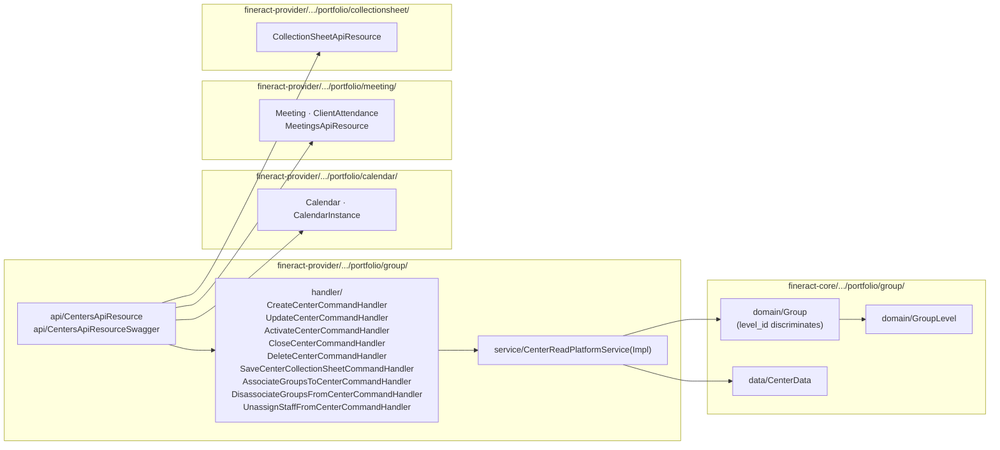
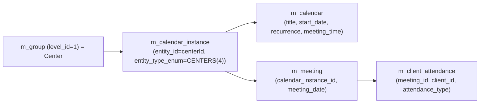
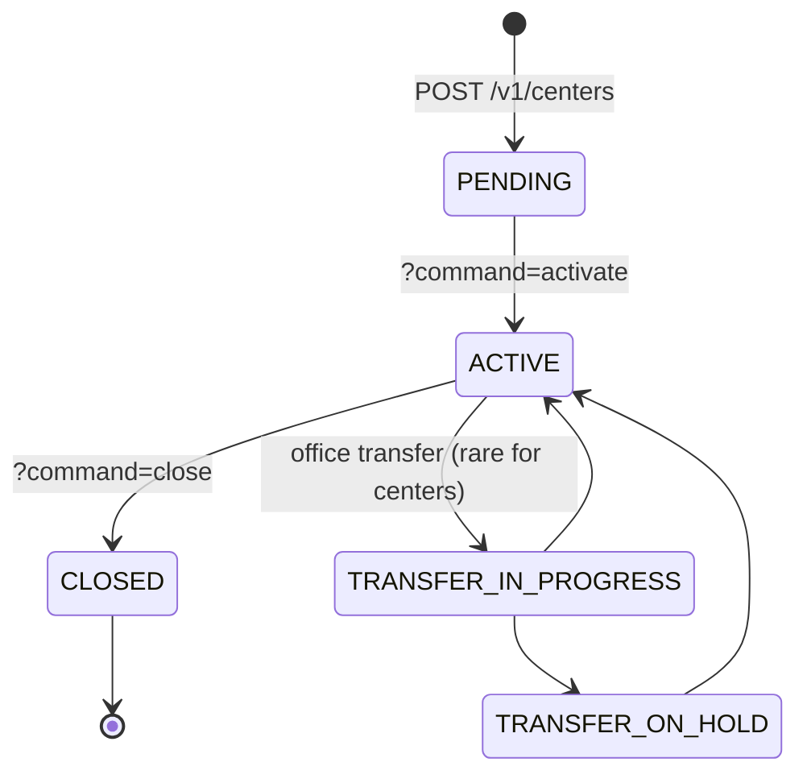

In Apache Fineract a **center** is the upper hierarchy level of the [groups](/portfolio/groups) subsystem. Structurally it is **the same `Group` entity** with `level_id` pointing to the *Center* row in `m_group_level`; semantically it is the *meeting locus*: the place a loan officer visits, the time slot when the village's groups gather, the unit against which a *collection sheet* is generated.

A center has children (regular groups) but no direct client members. Its primary value is:

1. Owning a shared `Calendar` so every child group / loan repays on the same day.
2. Owning an attendance log via `Meeting` so the loan officer can mark presence per visit.
3. Pre-computing dues across all child groups in one go through the *collection sheet* read service.

## Where the code lives

There is no `Center.java`. The center is implemented across:



## Center = `Group` at `level_id = 1`

The shape of a center row in `m_group`:

| Column | Center value | Note |
| --- | --- | --- |
| `level_id` | `1` (seeded *Center*) | The discriminator. |
| `parent_id` | `NULL` | Centers are the top of the lending tree. |
| `hierarchy` | `.<centerId>.` | Materialised path so descendants can be `LIKE`-found. |
| `office_id` | required | Branch that owns the center. |
| `staff_id` | optional | Loan officer assigned to the center. |
| `account_no` | unique, 20 chars | Globally unique, generated if not supplied. |
| `display_name` | unique | Used everywhere the UI shows a center label. |

`m_group_level` rules constrain it:

```sql
SELECT id, level_name, parent_id, super_parent, recursable, can_have_clients
  FROM m_group_level WHERE id = 1;
-- 1 | Center | NULL | true | false | false
```

The `can_have_clients = false` invariant is why the write services reject `associateClients` against a center — clients only join JLG-level groups, not the center directly.

## REST: `CentersApiResource`

`fineract-provider/src/main/java/org/apache/fineract/portfolio/group/api/CentersApiResource.java`:

```java
@Path("/v1/centers")
@Component
@RequiredArgsConstructor
public class CentersApiResource {

  @GET                                  String retrieveAll(...)
  @GET   @Path("template")              String retrieveTemplate(...)
  @GET   @Path("{centerId}")            String retrieveOne(@PathParam("centerId") Long centerId, ...)
  @POST                                 String create(String apiRequestBodyAsJson)
  @PUT   @Path("{centerId}")            String update(@PathParam("centerId") Long centerId, String json)
  @DELETE @Path("{centerId}")           String delete(@PathParam("centerId") Long centerId)
  @POST  @Path("{centerId}")            String activate(@PathParam("centerId") Long centerId,
                                                        @QueryParam("command") String commandParam,
                                                        String json)
  @GET   @Path("{centerId}/accounts")   String retrieveGroupAccount(...)
  @GET   @Path("downloadtemplate")      Response getCenterTemplate(...)
  @POST  @Path("uploadtemplate")        String postCenterTemplate(...)
}
```

### The `?command=` switchboard

The `POST /v1/centers/{centerId}?command=<x>` switch dispatches through `CommandWrapperBuilder` and `PortfolioCommandSourceWritePlatformService` to:

| `command` | Handler | What it changes |
| --- | --- | --- |
| `activate` | `ActivateCenterCommandHandler` | `PENDING → ACTIVE`, sets `activation_date`. |
| `close` | `CloseCenterCommandHandler` | `ACTIVE → CLOSED`, requires `closureReason` and `closureDate`. |
| `associateGroups` | `AssociateGroupsToCenterCommandHandler` | Sets `parent_id = centerId` on each group; refreshes `hierarchy`. |
| `disassociateGroups` | `DisassociateGroupsFromCenterCommandHandler` | Clears `parent_id`; only allowed when no shared calendar binds them. |
| `unassignStaff` | `UnassignStaffFromCenterCommandHandler` | Closes the open `StaffAssignmentHistory` row, clears `staff_id`. |
| `saveCollectionSheet` | `SaveCenterCollectionSheetCommandHandler` | See [Collection sheet](/portfolio/collection-sheet). |
| `generateCollectionSheet` | (read-only) | Returns the preview JSON via `CollectionSheetReadPlatformServiceImpl`. |

<Note>
There is no `reject`/`withdraw` for centers — same as for groups. A draft center is simply deleted.
</Note>

## Linkage to meetings

A center is the natural owner of a recurring meeting schedule. The wiring uses two cross-package entities — `Calendar` and `CalendarInstance` — both from `fineract-core/.../portfolio/calendar/domain/`:



- A `Calendar` of `CalendarType.COLLECTION` holds the schedule (`start_date`, an iCal-style `recurrence` like `FREQ=WEEKLY;INTERVAL=1;BYDAY=MO`, an optional `meeting_time`).
- A `CalendarInstance` row links that calendar to the center (`entity_type_enum = CENTERS(4)`, `entity_id = centerId`). Each child group/loan that wants to inherit creates its own `CalendarInstance` to the same `calendar_id`.
- Each visit becomes a `Meeting` row (`meeting_date`), and attendance is recorded as one `ClientAttendance` per client.

Creating the meeting schedule for a brand-new center is a two-call dance:

```http
POST /v1/centers
{ "name": "Mwanza-Centre-A", "officeId": 4, "staffId": 17, "submittedOnDate": "...",
  "active": true, "activationDate": "...",
  "calendarStartDate": "2025-04-07",
  "frequency": 1, "interval": 1, "repeatsOnDay": 1 }      # → creates Center + Calendar in one shot

POST /v1/centers/{centerId}?command=activate                # → moves to ACTIVE
```

The `Calendar` is created in the same transaction by `CenterWritePlatformService` calling out to `CalendarWritePlatformService.createCalendar(...)`. See [Meetings & Calendars](/portfolio/meetings-and-calendars).

## Read service

`fineract-provider/.../portfolio/group/service/CenterReadPlatformServiceImpl.java` projects rows from `m_group` (level=1) into `CenterData` (in `fineract-core/.../portfolio/group/data/CenterData.java`). Key methods:

- `retrieveOne(centerId)` — single center, parent office, staff, calendar instance.
- `retrieveAll(SearchParameters)` — paginated.
- `retrieveTemplate(officeId, staffInSelectedOfficeOnly)` — populates the *Create center* form (offices, staff, group levels, calendars).
- `retrieveCalendar(centerId)` — joins to `m_calendar` via `m_calendar_instance`.
- `retrieveGroupsByCenter(centerId)` — child groups for the *Children* tab.

## Collection sheet generation

The center's other reason for existing is the **collection sheet** — the pre-printed list of dues for *this meeting*. The center holds the calendar, the calendar fixes the next meeting date, and the collection-sheet service walks every child group's clients to total per‑client repayments and savings deposits.

```mermaid
sequenceDiagram
  participant LO as Loan officer
  participant API as CentersApiResource
  participant CS as CollectionSheetReadPlatformServiceImpl
  participant DB as DB
  LO->>API: POST /v1/centers/{id}?command=generateCollectionSheet { "transactionDate": "...", "calendarId": ... }
  API->>CS: generateCollectionSheet(centerId, JsonCommand)
  CS->>DB: query m_calendar_instance → resolve calendar
  CS->>DB: query m_loan_repayment_schedule for due rows on date
  CS->>DB: query m_savings_account dues
  CS-->>API: JLGCollectionSheetData
  API-->>LO: JSON preview
  LO->>API: POST /v1/centers/{id}?command=saveCollectionSheet (with adjusted amounts)
  API->>SaveCenter as SaveCenterCollectionSheetCommandHandler
  SaveCenter-->>API: CommandProcessingResult (loan repayments + savings deposits booked)
```

See [Collection sheet](/portfolio/collection-sheet) for the SQL shape of `JLGCollectionSheetData` and the save flow.

## Lifecycle

`GroupingTypeStatus` is shared with groups (see [Groups](/portfolio/groups#lifecycle-groupingtypestatus)):



`CloseCenterCommandHandler` refuses to close a center while it has `ACTIVE` child groups — `GroupExistsInCenterException` is raised. Disassociate (and close) the children first.

## Validation rules (write side)

`GroupingTypesWritePlatformServiceJpaRepositoryImpl` is the shared write service for both groups and centers (the level discriminates). Center-specific guards:

- `level.parent_id IS NULL && level.super_parent = true` — the new center's level must be a *root* level.
- `staff.is_loan_officer = true` — `staff_id` must point to a loan officer; non-officer assignments are rejected with `StaffRoleException`.
- `activationDate >= submittedOnDate` and `>= office.openingDate`.
- A center cannot be deleted while it has child groups, calendars or open loan accounts.

## Storage view (center-shaped)

```sql
SELECT g.id, g.account_no, g.display_name, g.status_enum,
       g.office_id, g.staff_id,
       g.activation_date, g.closedon_date,
       gl.level_name
  FROM m_group g
  JOIN m_group_level gl ON g.level_id = gl.id
 WHERE gl.id = 1;        -- centers only
```

A typical center row has `parent_id IS NULL`, `hierarchy = '.<id>.'`, status 100/300/600 mirroring the lifecycle.

## Read DTOs

`fineract-core/src/main/java/org/apache/fineract/portfolio/group/data/CenterData.java` is the JSON shape returned by every center-scoped GET:

```java
public class CenterData {
    private final Long id;
    private final String accountNo;
    private final String name;
    private final String externalId;
    private final EnumOptionData status;       // GroupingTypeStatus
    private final boolean active;
    private final LocalDate activationDate;

    private final Long officeId;
    private final String officeName;
    private final Long staffId;
    private final String staffName;
    private final String hierarchy;            // materialised path

    private final GroupTimelineData timeline;  // submittedOnDate/By, activationDate/By, closeDate/By...
    private final Collection<GroupGeneralData> groupMembers;   // child groups when ?associations=groupMembers

    private final CalendarData collectionMeetingCalendar;      // populated on the detail screen
    // template-only option lists
    private final Collection<OfficeData> officeOptions;
    private final Collection<StaffData> staffOptions;
    private final Collection<GroupGeneralData> groupOptions;
}
```

`GroupTimelineData` is shared with regular groups (see [Groups](/portfolio/groups#read-service-groupreadplatformserviceimpl)).

## Permission codes

Every endpoint is guarded by a permission string of the form `<ACTION>_CENTER` against `m_permission`:

| HTTP entry | Permission |
| --- | --- |
| `GET /v1/centers` / `{centerId}` | `READ_CENTER` |
| `POST /v1/centers` | `CREATE_CENTER` |
| `PUT /v1/centers/{centerId}` | `UPDATE_CENTER` |
| `DELETE /v1/centers/{centerId}` | `DELETE_CENTER` |
| `?command=activate` | `ACTIVATE_CENTER` |
| `?command=close` | `CLOSE_CENTER` |
| `?command=associateGroups` | `ASSOCIATEGROUPS_CENTER` |
| `?command=disassociateGroups` | `DISASSOCIATEGROUPS_CENTER` |
| `?command=unassignStaff` | `UNASSIGNSTAFF_CENTER` |
| `?command=saveCollectionSheet` | `SAVECOLLECTIONSHEET_CENTER` |
| `?command=generateCollectionSheet` | `READ_COLLECTIONSHEET` |

These are seeded by the standard Liquibase changelogs into `m_permission` and assigned to roles via `m_role_permission`.

## Maker-checker

`CentersApiResource` writes go through the standard `PortfolioCommandSourceWritePlatformService.logCommandSource(...)` path — the *maker‑checker* feature can therefore be enabled per-action by setting `is_make_checker_enabled = true` on the matching `m_permission` row. Once enabled, the API returns a `CommandProcessingResult` with `resourceId = null` but `commandId` set; the change becomes a pending row in `m_portfolio_command_source` that an authorised user must approve via `POST /v1/makercheckers/{id}?command=approve`.

## See also

<CardGroup cols={2}>
  <Card title="Groups" href="/portfolio/groups" icon="people-group">
    The level-2 children that aggregate clients.
  </Card>
  <Card title="Meetings & Calendars" href="/portfolio/meetings-and-calendars" icon="calendar">
    Where the recurrence and attendance entities live.
  </Card>
  <Card title="Collection sheet" href="/portfolio/collection-sheet" icon="clipboard-list">
    The aggregated dues screen powered by the center's calendar.
  </Card>
  <Card title="Transfers" href="/portfolio/transfers" icon="arrow-right-arrow-left">
    The (rare) inter-office relocation flow that puts a center into `TRANSFER_IN_PROGRESS`.
  </Card>
</CardGroup>
