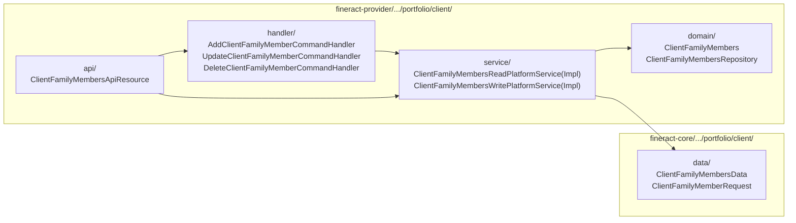
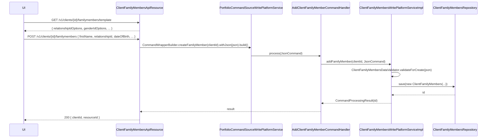
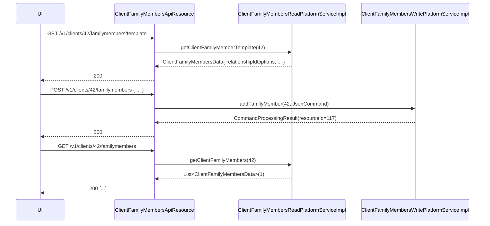

The **family members** aggregate lets an MFI record the *household* around an Apache Fineract client — spouse, children, dependents — without entangling that data with the [`Client`](/portfolio/clients) entity itself. It is a tiny, focused module: one entity, one REST resource, four command handlers, no lifecycle. Everything is `CRUD` plus a `template` endpoint for dropdowns.

The data is used by MFIs for:

- Group lending (JLG) eligibility checks — does the borrower have a spouse who can co‑sign?
- Default risk scoring — number of dependents → minimum surplus income required.
- Social-impact reporting — household size, gender split, profession mix.

## Package layout



## `ClientFamilyMembers` entity

`fineract-provider/src/main/java/org/apache/fineract/portfolio/client/domain/ClientFamilyMembers.java`:

```java
@Entity
@Table(name = "m_family_members")
public class ClientFamilyMembers extends AbstractPersistableCustom<Long> {
    @ManyToOne @JoinColumn(name = "client_id")           private Client client;
    @Column(name = "firstname")                          private String firstName;
    @Column(name = "middlename")                         private String middleName;
    @Column(name = "lastname")                           private String lastName;
    @Column(name = "qualification")                      private String qualification;
    @Column(name = "mobile_number")                      private String mobileNumber;
    @Column(name = "age")                                private Long age;
    @Column(name = "is_dependent")                       private Boolean isDependent;
    @ManyToOne @JoinColumn(name = "relationship_cv_id")  private CodeValue relationship;
    @ManyToOne @JoinColumn(name = "marital_status_cv_id")private CodeValue maritalStatus;
    @ManyToOne @JoinColumn(name = "gender_cv_id")        private CodeValue gender;
    @ManyToOne @JoinColumn(name = "profession_cv_id")    private CodeValue profession;
    @Column(name = "date_of_birth", nullable = true)     private LocalDate dateOfBirth;
}
```

Every typed dimension (`relationship`, `maritalStatus`, `gender`, `profession`) is a `CodeValue` — meaning each MFI can extend the option list per tenant via the [system codes framework](/organisation/overview) without changing Java.

### Tenant-configurable taxonomies

| FK column | `m_code` parent name | Example values |
| --- | --- | --- |
| `relationship_cv_id` | `Relationship` | *Spouse*, *Child*, *Parent*, *Sibling*, *Cousin* |
| `marital_status_cv_id` | `MaritalStatus` | *Single*, *Married*, *Divorced*, *Widowed* |
| `gender_cv_id` | `Gender` | (re-uses the same `Gender` code used by `Client`) |
| `profession_cv_id` | `Profession` | *Farmer*, *Trader*, *Salaried*, *Unemployed*, *Student* |

The `is_dependent` boolean is the canonical "counts towards household dependency ratio" flag — handy for default-risk scoring rules.

### Field rules

`firstname` is the only field strictly required by the deserializer; everything else is optional. The data class encoded in `fineract-core/.../portfolio/client/data/ClientFamilyMembersData.java` mirrors the entity 1:1 plus `EnumOptionData` lookups for the four `CodeValue` columns.

## REST resource

`fineract-provider/src/main/java/org/apache/fineract/portfolio/client/api/ClientFamilyMembersApiResource.java`:

```java
@Path("/v1/clients/{clientId}/familymembers")
public class ClientFamilyMembersApiResource {

  @GET                              List<ClientFamilyMembersData> getFamilyMembers(@PathParam("clientId") long clientId)
  @GET @Path("/template")           ClientFamilyMembersData getTemplate(@PathParam("clientId") long clientId)
  @GET @Path("/{familyMemberId}")   ClientFamilyMembersData getFamilyMember(@PathParam("familyMemberId") Long id,
                                                                            @PathParam("clientId")      Long clientId)

  @POST                             CommandProcessingResult addClientFamilyMembers(@PathParam("clientId") long clientid, String json)
  @PUT  @Path("/{familyMemberId}")  CommandProcessingResult updateClientFamilyMembers(@PathParam("familyMemberId") long id, ...)
  @DELETE @Path("/{familyMemberId}")CommandProcessingResult deleteClientFamilyMembers(@PathParam("familyMemberId") long id, ...)
}
```

<Info>
The `template` GET returns an *empty* `ClientFamilyMembersData` with every `EnumOptionData` populated — the UI drops these directly into its `<select>` elements. Calling `template` is the only way the frontend learns the valid relationship/maritalStatus/gender/profession options for the current tenant.
</Info>

### Permission codes

The resource is guarded by:

- `READ_FamilyMembers` on all `GET` endpoints (`context.authenticatedUser().validateHasReadPermission("FamilyMembers")`).
- `CREATE_FAMILYMEMBERS`, `UPDATE_FAMILYMEMBERS`, `DELETE_FAMILYMEMBERS` on the writes — wired through the standard `CommandWrapper` mechanism.

## Command flow



### The three handlers

`fineract-provider/.../portfolio/client/handler/`:

| `@CommandType(entity=..., action=...)` | Class | Method on write service |
| --- | --- | --- |
| `FAMILYMEMBERS / CREATE` | `AddClientFamilyMemberCommandHandler` | `addFamilyMember(...)` |
| `FAMILYMEMBERS / UPDATE` | `UpdateClientFamilyMemberCommandHandler` | `updateFamilyMember(...)` |
| `FAMILYMEMBERS / DELETE` | `DeleteClientFamilyMemberCommandHandler` | `deleteFamilyMember(...)` |

Each handler is a thin facade over `ClientFamilyMembersWritePlatformServiceImpl`.

## Write service: validation

`fineract-provider/.../portfolio/client/service/ClientFamilyMembersWritePlatformServiceImpl.java` does:

1. **Resolve client** through `ClientRepositoryWrapper.findOneWithNotFoundDetection(clientId)` — throws `ClientNotFoundException` if missing.
2. **Validate JSON** through a `DataValidatorBuilder` chain:
   - `firstName` — not blank.
   - `relationshipId` / `maritalStatusId` / `genderId` / `professionId` — if present, must be `Long` and the row must exist in `m_code_value` (via `CodeValueRepositoryWrapper.findOneWithNotFoundDetection`).
   - `age` — non‑negative `Long`.
   - `dateOfBirth` — `LocalDate`, not in the future.
3. **Persist** via `ClientFamilyMembersRepository.save(...)`.

Update is a patch: any field absent from the JSON is left untouched.

Delete is a hard delete — there is no soft-delete column on `m_family_members`.

## Read service

`ClientFamilyMembersReadPlatformServiceImpl` is a plain `JdbcTemplate` service. Two queries:

- `getClientFamilyMembers(clientId)` — `SELECT ... FROM m_family_members fm LEFT JOIN m_code_value relationship ON ...` → `List<ClientFamilyMembersData>`.
- `getClientFamilyMember(id)` — single-row variant for `GET /{familyMemberId}`.

`getClientFamilyMemberTemplate(clientId)` (used by the `template` endpoint) builds an empty `ClientFamilyMembersData` and fills its four `*Options` collections by calling `CodeValueReadPlatformServiceImpl.retrieveCodeValuesByCode("Relationship")` (and the three siblings).

## DTOs

`fineract-core/.../portfolio/client/data/`:

```java
public final class ClientFamilyMembersData {
    private Long   id;
    private Long   clientId;
    private String firstName;
    private String middleName;
    private String lastName;
    private String qualification;
    private String mobileNumber;
    private Long   age;
    private Boolean isDependent;
    private LocalDate dateOfBirth;

    private CodeValueData relationship;
    private CodeValueData maritalStatus;
    private CodeValueData gender;
    private CodeValueData profession;

    private Collection<CodeValueData> relationshipIdOptions;
    private Collection<CodeValueData> maritalStatusIdOptions;
    private Collection<CodeValueData> genderIdOptions;
    private Collection<CodeValueData> professionIdOptions;
}
```

`ClientFamilyMemberRequest` (also under `fineract-core/.../portfolio/client/data/`) is the OpenAPI request body schema — it mirrors the persistable fields with `Long` IDs in place of resolved `CodeValueData`.

## Storage shape

```sql
-- m_family_members
id                  bigint   PK
client_id           bigint   FK -> m_client.id
firstname           varchar
middlename          varchar
lastname            varchar
qualification       varchar
mobile_number       varchar
age                 bigint
is_dependent        boolean
relationship_cv_id  bigint   FK -> m_code_value.id   (Relationship)
marital_status_cv_id bigint  FK -> m_code_value.id   (MaritalStatus)
gender_cv_id        bigint   FK -> m_code_value.id   (Gender)
profession_cv_id    bigint   FK -> m_code_value.id   (Profession)
date_of_birth       date
```

There is **no** soft-delete column, no audit envelope (the entity extends `AbstractPersistableCustom`, not `AbstractAuditable...`), and no temporal validity (`valid_from`/`valid_till`). Family-member rows are treated as facts of the present moment — if the spouse changes, you `PUT` the row.

## What this resource does *not* do

- It does **not** attach to anything other than a `Client`. A `Group` has no analogous *family* schema.
- It does **not** participate in eligibility rules at runtime. Loan‑approval logic must `GET /v1/clients/{id}/familymembers` and apply its own predicate; nothing inside the loan write services consults `m_family_members`.
- It is **not** an addressable resource (no `external_id`), unlike most other client child resources.

## Example payloads

### Create

```http
POST /v1/clients/42/familymembers
Content-Type: application/json

{
  "firstName": "Aisha",
  "middleName": "K",
  "lastName": "Otieno",
  "qualification": "Diploma",
  "mobileNumber": "+254700111222",
  "age": 32,
  "isDependent": false,
  "relationshipId": 14,
  "maritalStatusId": 22,
  "genderId": 4,
  "professionId": 31,
  "dateOfBirth": "1992-08-14",
  "dateFormat": "yyyy-MM-dd",
  "locale": "en"
}
```

Response:

```json
{
  "officeId": 1,
  "clientId": 42,
  "resourceId": 117
}
```

### Update (patch a single field)

```http
PUT /v1/clients/42/familymembers/117
Content-Type: application/json

{
  "isDependent": true,
  "professionId": 33
}
```

Only the supplied keys are updated. The response shape mirrors create with an additional `changes: { isDependent: true, professionId: 33 }` map produced by `JsonCommand.parameterExists(...)` checks in the service.

### Template

```http
GET /v1/clients/42/familymembers/template
```

```json
{
  "clientId": 42,
  "relationshipIdOptions": [
    { "id": 14, "name": "Spouse",   "active": true },
    { "id": 15, "name": "Child",    "active": true },
    { "id": 16, "name": "Sibling",  "active": true }
  ],
  "maritalStatusIdOptions": [ ... ],
  "genderIdOptions":        [ ... ],
  "professionIdOptions":    [ ... ]
}
```

## Sequence: template → create → list



## Where to next

<CardGroup cols={2}>
  <Card title="Clients" href="/portfolio/clients" icon="user">
    The parent entity. Family members hang off the same `client_id`.
  </Card>
  <Card title="Identifiers & Addresses" href="/portfolio/client-identifiers-and-addresses" icon="id-card">
    Sibling KYC schema (`m_client_identifier`, `m_address`, `m_client_address`).
  </Card>
</CardGroup>
