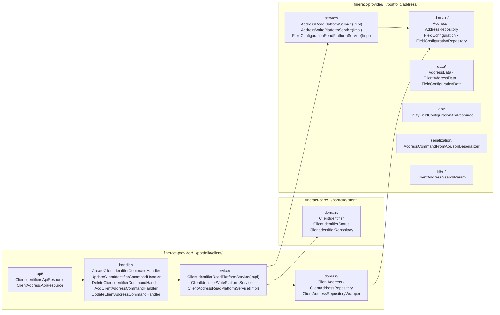
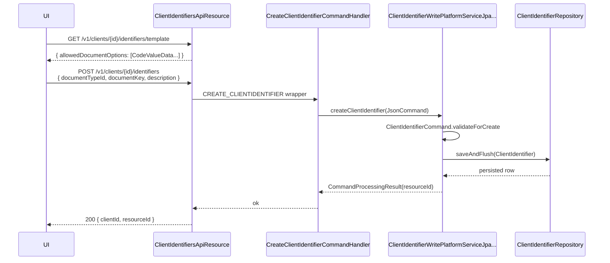

A core requirement of every regulated MFI's portfolio is **proof of identity** and **proof of address**. Apache Fineract models these as two small, mostly independent aggregates that hang off the [`Client`](/portfolio/clients): `ClientIdentifier` (one row per document — passport, national ID, voter card) and `Address` / `ClientAddress` (zero or more postal addresses, each typed as `Residential`, `Business`, `Permanent`...).

Both schemas use the `Code`/`CodeValue` framework to keep the *types* tenant‑configurable — you add a new document kind or address kind by inserting a `m_code_value` row, not by changing Java code.

## Where the code lives



## The `ClientIdentifier` entity

`fineract-core/src/main/java/org/apache/fineract/portfolio/client/domain/ClientIdentifier.java`:

```java
@Entity
@Table(name = "m_client_identifier")
public class ClientIdentifier extends AbstractAuditableWithUTCDateTimeCustom<Long> {
    @ManyToOne @JoinColumn(name = "client_id",        nullable = false) private Client client;
    @ManyToOne @JoinColumn(name = "document_type_id", nullable = false) private CodeValue documentType;
    @Column(name = "document_key", length = 1000) private String documentKey;
    @Column(name = "status",       nullable = false) private Integer status;
    @Column(name = "description",  length = 1000) private String description;
    @Column(name = "active") private Boolean active;
}
```

### Document type via `CodeValue`

`document_type_id` references `m_code_value.id` filtered by the system code named `Customer Identifier`. To add `Driver's Licence`, insert into `m_code_value (code_id, code_value)` where `code_id` is the row in `m_code` named `Customer Identifier`. The frontend's *Identifier Type* dropdown is populated from this code.

The Java side never enumerates document types — there is no `DocumentTypeEnum`. Everything is data-driven.

### Active vs status

Two flags exist:

| Field | Type | Purpose |
| --- | --- | --- |
| `status` | `Integer` (`ClientIdentifierStatus`) | `INACTIVE(100)` or `ACTIVE(200)`. Set by the write service based on `active`. |
| `active` | `Boolean` | The flag actually toggled by the API caller. Kept for backward compatibility with older clients. |

```java
// fineract-core/.../client/domain/ClientIdentifierStatus.java
public enum ClientIdentifierStatus {
    INVALID(0, "clientIdentifierStatus.invalid"),
    INACTIVE(100, "clientIdentifierStatus.inactive"),
    ACTIVE(200,  "clientIdentifierStatus.active");
}
```

### Uniqueness rule

`m_client_identifier` has a composite unique index on `(document_type_id, document_key)` — *the same passport number cannot belong to two clients*. Violations are caught by `ClientIdentifierWritePlatformServiceJpaRepositoryImpl.handleClientIdentifierDataIntegrityViolation` and surfaced as `DuplicateClientIdentifierException`.

## `ClientIdentifiersApiResource`

`fineract-provider/src/main/java/org/apache/fineract/portfolio/client/api/ClientIdentifiersApiResource.java`:

```java
@Path("/v1/clients/{clientId}/identifiers")
public class ClientIdentifiersApiResource {

  @GET            String retrieveAllClientIdentifiers(@PathParam("clientId") Long clientId, ...)
  @GET @Path("template") String newClientIdentifierDetails(@PathParam("clientId") Long clientId)
  @POST           CommandProcessingResult createClientIdentifier(@PathParam("clientId") Long clientId, String json)

  @GET    @Path("{identifierId}") String retrieveClientIdentifiers(...)
  @PUT    @Path("{identifierId}") CommandProcessingResult updateClientIdentifer(...)
  @DELETE @Path("{identifierId}") CommandProcessingResult deleteClientIdentifier(...)
}
```

The `template` endpoint returns the list of available `Customer Identifier` code values (i.e. allowed document types) — the UI uses it to populate the *Identifier Type* dropdown when the user clicks *Add identifier*.

### Command handlers

| Verb | Handler | What it does |
| --- | --- | --- |
| `CREATE_CLIENTIDENTIFIER` | `CreateClientIdentifierCommandHandler` | Validates uniqueness, persists `ClientIdentifier`. |
| `UPDATE_CLIENTIDENTIFIER` | `UpdateClientIdentifierCommandHandler` | Patch semantics over `documentKey`, `documentType`, `description`, `active`. |
| `DELETE_CLIENTIDENTIFIER` | `DeleteClientIdentifierCommandHandler` | Hard delete via repo wrapper. |

All three live in `fineract-provider/.../portfolio/client/handler/` and route to `ClientIdentifierWritePlatformServiceJpaRepositoryImpl`.

### Validation: `ClientIdentifierCommand`

`fineract-provider/.../portfolio/client/command/ClientIdentifierCommand.java` is a small DTO + `validateForCreate` / `validateForUpdate` pair. Mandatory fields:

- `documentTypeId` — must reference an existing `m_code_value` row.
- `documentKey` — non-blank, ≤ 1000 chars.

## Addresses: two-level model

Fineract separates the **address itself** from the **link between a client and an address**:

- `Address` (`m_address`) — the postal/geographic data: lines, town, city, state, country (`CodeValue`), postal code, latitude, longitude.
- `ClientAddress` (`m_client_address`) — the *join* row: `(client_id, address_id, address_type_id, is_active)`. A client can have *many* addresses with different types; an address can also (in principle, via the OneToMany) be shared.

```java
// fineract-provider/.../portfolio/address/domain/Address.java
@Entity
@Table(name = "m_address")
public class Address extends AbstractPersistableCustom<Long> {
    @OneToMany(mappedBy = "address", cascade = CascadeType.ALL) private Set<ClientAddress> clientaddress;
    @Column(name = "street")             private String street;
    @Column(name = "address_line_1")     private String addressLine1;
    @Column(name = "address_line_2")     private String addressLine2;
    @Column(name = "address_line_3")     private String addressLine3;
    @Column(name = "town_village")       private String townVillage;
    @Column(name = "city")               private String city;
    @Column(name = "county_district")    private String countyDistrict;
    @ManyToOne @JoinColumn(name = "state_province_id") private CodeValue stateProvince;
    @ManyToOne @JoinColumn(name = "country_id")        private CodeValue country;
    @Column(name = "postal_code")        private String postalCode;
    @Column(name = "latitude")           private BigDecimal latitude;
    @Column(name = "longitude")          private BigDecimal longitude;
    @Column(name = "created_by")         private String createdBy;
    @Column(name = "created_on")         private LocalDate createdOn;
    @Column(name = "updated_by")         private String updatedBy;
    @Column(name = "updated_on")         private LocalDate updatedOn;
}
```

```java
// fineract-provider/.../portfolio/client/domain/ClientAddress.java
@Entity
@Table(name = "m_client_address")
public class ClientAddress extends AbstractPersistableCustom<Long> {
    @ManyToOne private Client client;
    @ManyToOne private Address address;
    @ManyToOne @JoinColumn(name = "address_type_id") private CodeValue addressType;
    @Column(name = "is_active") private boolean isActive;
}
```

`address_type_id` resolves against the `ADDRESS_TYPE` code (typical values: *Residential*, *Permanent*, *Business*, *Postal*).

## Field configuration: per-tenant required/optional matrix

Different jurisdictions require different address fields. Rather than hard-coding the rule, Fineract reads it from `m_field_configuration`:

```java
// fineract-provider/.../portfolio/address/domain/FieldConfiguration.java
@Entity
@Table(name = "m_field_configuration")
public class FieldConfiguration extends AbstractPersistableCustom<Long> {
    @Column(name = "entity")     private String entity;        // e.g. "ADDRESS"
    @Column(name = "subentity")  private String subentity;     // e.g. "RESIDENTIAL"
    @Column(name = "field")      private String field;         // e.g. "postalCode"
    @Column(name = "is_enabled") private boolean isEnabled;
    @Column(name = "is_mandatory") private boolean isMandatory;
    @Column(name = "validation_regex") private String validationRegex;
}
```

`AddressCommandFromApiJsonDeserializer` (`fineract-provider/.../portfolio/address/serialization/`) consults `FieldConfigurationRepository` to know which fields to enforce as mandatory and which regex to apply. It is the *only* deserializer in the project that consults configurable validation rules.

The configuration itself is read via:

```java
// fineract-provider/.../portfolio/address/api/EntityFieldConfigurationApiResource.java
@Path("/v1/fieldconfiguration/{entity}")
```

`GET /v1/fieldconfiguration/ADDRESS` returns the active rules for the *Address* entity — the frontend uses this to drive its form (red asterisks, masked inputs, etc.).

## `ClientAddressApiResource`

`fineract-provider/src/main/java/org/apache/fineract/portfolio/client/api/ClientAddressApiResource.java`:

```java
@Path("/v1/client")
public class ClientAddressApiResource {
  @GET  @Path("addresses/template") CommandProcessingResult listAddressTemplate()
  @POST @Path("/{clientid}/addresses")  CommandProcessingResult createClientAddress(@PathParam("clientid") long clientid, ... String json)
  @GET  @Path("/{clientid}/addresses")  String retrieveClientAddrs(@PathParam("clientid") long clientid)
  @PUT  @Path("/{clientid}/addresses")  CommandProcessingResult updateClientAddress(@PathParam("clientid") long clientid, ... String json)
}
```

(The path is `/v1/client/...` — singular — for legacy reasons; the rest of the client API lives at `/v1/clients/...`.)

### Command handlers

| Handler | Routed via | Effect |
| --- | --- | --- |
| `AddClientAddressCommandHandler` | `?type=...` parameter in the POST body | Calls `AddressWritePlatformServiceImpl.addClientAddress` which: 1) creates a row in `m_address`; 2) creates the link row in `m_client_address` with `addressType` from `?type=`. |
| `UpdateClientAddressCommandHandler` | PUT | Patches both rows. Uses `is_active` to support *soft toggle* of inactive addresses. |

Both handlers live in `fineract-provider/.../portfolio/client/handler/`. They share a single `AddressCommandFromApiJsonDeserializer` whose `validate(json)` consults `FieldConfiguration` for the resolved `(entity=ADDRESS, subentity=type)` pair.

### Filter / search

`fineract-provider/.../portfolio/address/filter/ClientAddressSearchParam.java` exposes:

```java
public class ClientAddressSearchParam {
    private String addressType;   // CodeValue label, e.g. "Residential"
    private Boolean isActive;
    private String city;
    private String state;
    private String country;
    private String postalCode;
}
```

`AddressReadPlatformServiceImpl.retrieveAddressByClientType(...)` uses these to build a dynamic SQL `WHERE` clause when the UI's *Addresses* tab applies filters.

## Read services

| Service | File | Returns |
| --- | --- | --- |
| `ClientIdentifierReadPlatformServiceImpl` | `fineract-provider/.../client/service/` | `Collection<ClientIdentifierData>` for a given client. Joins `m_client_identifier` → `m_code_value` (document type). |
| `AddressReadPlatformServiceImpl` | `fineract-provider/.../address/service/` | `Collection<AddressData>` with state/country labels resolved from `m_code_value`. |
| `ClientAddressReadPlatformServiceImpl` | `fineract-provider/.../client/service/` | Joins through `m_client_address` to produce `ClientAddressData` — the type, the embedded address, and the active flag. |
| `FieldConfigurationReadPlatformServiceImpl` | `fineract-provider/.../address/service/` | The list backing `GET /v1/fieldconfiguration/{entity}`. |

`ClientAddressData` lives in `fineract-provider/.../address/data/ClientAddressData.java` — the response shape sent to the UI.

## Exception map

| Exception | Module | When |
| --- | --- | --- |
| `AddressNotFoundException` | `fineract-provider/.../address/exception/` | The supplied `address_id` is missing — caller error. |
| `DuplicateClientIdentifierException` | `fineract-provider/.../client/exception/` | `(documentType, documentKey)` unique violation. |
| `ClientIdentifierNotFoundException` | `fineract-provider/.../client/exception/` | Unknown `identifierId` in path. |

## Verifying identity documents: typical UI flow



A separate *Documents* subsystem (`fineract-provider/.../infrastructure/documentmanagement/`) is used to attach the *scanned image* of the document; the `ClientIdentifier` row only holds metadata + the document key string.

## Permissions

| HTTP entry | Permission |
| --- | --- |
| `GET /v1/clients/{id}/identifiers`, `/{identifierId}`, `/template` | `READ_CLIENTIDENTIFIER` |
| `POST /v1/clients/{id}/identifiers` | `CREATE_CLIENTIDENTIFIER` |
| `PUT /v1/clients/{id}/identifiers/{identifierId}` | `UPDATE_CLIENTIDENTIFIER` |
| `DELETE /v1/clients/{id}/identifiers/{identifierId}` | `DELETE_CLIENTIDENTIFIER` |
| `GET /v1/client/{clientid}/addresses`, `addresses/template` | `READ_ADDRESS` |
| `POST /v1/client/{clientid}/addresses` | `CREATE_ADDRESS` |
| `PUT /v1/client/{clientid}/addresses` | `UPDATE_ADDRESS` |
| `GET /v1/fieldconfiguration/{entity}` | `READ_FIELDCONFIGURATION` |

## Document attachments

A `ClientIdentifier` row holds only metadata (`documentType`, `documentKey`, `description`). The *scanned image* of the passport / national-ID is attached separately through the **Documents** subsystem:

```http
POST /v1/clients/{clientId}/documents
Content-Type: multipart/form-data
```

The two are linked client-side by the UI — there's no FK from `m_document` back into `m_client_identifier`. Reports that need to cross-reference do so by `client_id` + filename convention.

## Seed values

The default Liquibase changelogs seed `Customer Identifier` (system code) with values like:

| `code_value` | `position` | `is_active` |
| --- | --- | --- |
| `Passport` | 1 | true |
| `Id` | 2 | true |
| `Drivers License` | 3 | true |
| `Any Other Id Type` | 4 | true |

`Address Type` defaults to:

| `code_value` | `position` | `is_active` |
| --- | --- | --- |
| `Residential` | 1 | true |
| `Permanent`   | 2 | true |
| `Business`    | 3 | true |
| `Postal`      | 4 | true |

MFIs add or deactivate entries via the *Manage codes* admin screen (`POST /v1/codes/{codeId}/codevalues`).

## See also

<CardGroup cols={2}>
  <Card title="Clients" href="/portfolio/clients" icon="user">
    The parent aggregate. `Client.identifiers` is the eagerly-cascaded `Set<ClientIdentifier>`.
  </Card>
  <Card title="Family members" href="/portfolio/client-family-members" icon="users">
    Sibling aggregate — relatives, dependents, occupation.
  </Card>
</CardGroup>
