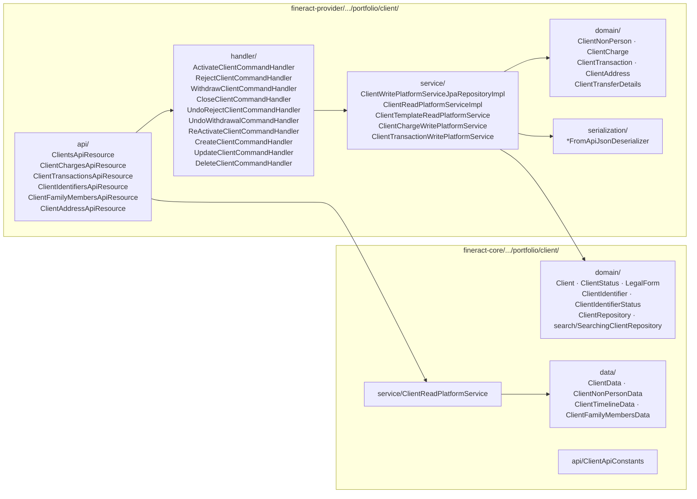
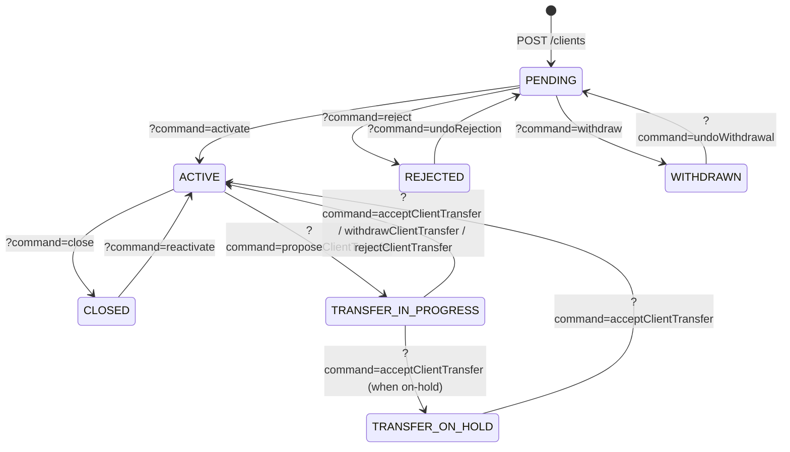
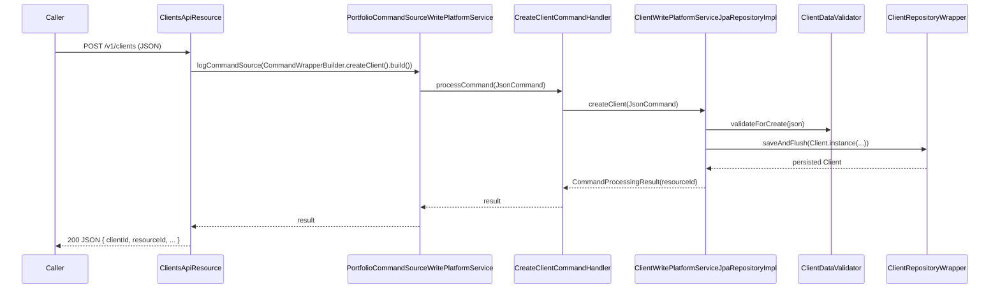

The **client** is the central party of the Apache Fineract portfolio. Every loan, every savings account, every share account, every charge and every collection sheet entry is ultimately attributed back to a `Client` (or a `Group` of clients). This page is the source-of-truth map for the client aggregate: the JPA entity, its lifecycle, the REST resources that expose it, and the command-handler graph that mutates it.

The aggregate is intentionally split across two Gradle modules:

<CardGroup cols={2}>
  <Card title="fineract-core" icon="cube">
    The `Client` entity, `ClientStatus`, `LegalForm`, `ClientIdentifier`, repositories and read-platform interface — everything that other portfolio packages (loan, savings, transfer) need to compile against.

    Path: `fineract-core/src/main/java/org/apache/fineract/portfolio/client/`
  </Card>
  <Card title="fineract-provider" icon="server">
    REST resources (`ClientsApiResource`, `ClientChargesApiResource`, `ClientTransactionsApiResource`), JSON deserializers, write services, command handlers, and the non-person companion entity `ClientNonPerson`.

    Path: `fineract-provider/src/main/java/org/apache/fineract/portfolio/client/`
  </Card>
</CardGroup>

## Package layout



## The `Client` entity

Defined in `fineract-core/src/main/java/org/apache/fineract/portfolio/client/domain/Client.java`, mapped to the `m_client` table. The class extends `AbstractAuditableWithUTCDateTimeCustom<Long>` so every row carries `created_*` and `last_modified_*` audit columns.

```java
// fineract-core/.../portfolio/client/domain/Client.java
@Entity
@Getter
@Setter
@Table(name = "m_client", uniqueConstraints = {
    @UniqueConstraint(columnNames = { "account_no" }, name = "account_no_UNIQUE"),
    @UniqueConstraint(columnNames = { "mobile_no" }, name = "mobile_no_UNIQUE") })
public class Client extends AbstractAuditableWithUTCDateTimeCustom<Long> { ... }
```

### Identity, ownership, hierarchy

| Column | Java field | Notes |
| --- | --- | --- |
| `account_no` | `accountNumber` | Generated by `RandomPasswordGenerator(19)` if not supplied. Globally unique. |
| `office_id` | `office` | FK to `m_office` — the **owning branch**. |
| `transfer_to_office_id` | `transferToOffice` | Set while a transfer is in progress (`TRANSFER_IN_PROGRESS`/`TRANSFER_ON_HOLD`). |
| `external_id` | `externalId` | `ExternalId` value type; lets external systems reference the client by their own key. |
| `staff_id` | `staff` | Assigned loan officer (`Staff`). |
| `groups` (M:N) | `m_group_client` | Join table to `m_group`. Clients can belong to 0..N groups. |

### KYC and demographics

```java
@Column(name = "firstname",   length = 50)  private String firstname;
@Column(name = "middlename",  length = 50)  private String middlename;
@Column(name = "lastname",    length = 50)  private String lastname;
@Column(name = "fullname",    length = 160) private String fullname;   // used when legalForm = ENTITY
@Column(name = "display_name",length = 160, nullable = false) private String displayName;
@Column(name = "mobile_no",   length = 50, unique = true) private String mobileNo;
@Column(name = "email_address",length = 50, unique = true) private String emailAddress;
@Column(name = "date_of_birth") private LocalDate dateOfBirth;
@ManyToOne @JoinColumn(name = "gender_cv_id")               private CodeValue gender;
@ManyToOne @JoinColumn(name = "client_type_cv_id")          private CodeValue clientType;
@ManyToOne @JoinColumn(name = "client_classification_cv_id")private CodeValue clientClassification;
@Column(name = "is_staff", nullable = false) private boolean isStaff;
```

`CodeValue` references resolve to rows in `m_code_value`, populated through the system code framework (see `fineract-provider/.../infrastructure/codes/`). This is how MFIs add their own classifications (`Salaried`, `Self‑Employed`, `Pensioner`, ...) without code changes.

### Legal form: person vs entity

`fineract-core/.../portfolio/client/domain/LegalForm.java`:

```java
public enum LegalForm {
    PERSON(1, "legalFormType.person", "Person"),
    ENTITY(2, "legalFormType.entity", "Entity");
}
```

The legal form drives validation in `ClientDataValidator`/`ClientApiConstants`:

- `PERSON` (`legal_form_enum = 1`) → `firstname` + `lastname` required; `dateOfBirth`, `gender`, `clientType` apply.
- `ENTITY` (`legal_form_enum = 2`) → `fullname` required; the row is shadowed by a `ClientNonPerson` (`m_client_non_person`) holding `constitution`, `incorporation_no`, `incorporation_validity_till_date`, `main_business_line`, `remarks`.

`ClientNonPerson` lives in `fineract-provider/.../portfolio/client/domain/ClientNonPerson.java` with a `ClientNonPersonRepository` wrapper.

### Sub-status via `CodeValue`

`status_enum` (covered below) is the *core* state; MFIs frequently need finer granularity — *Active – on overdraft*, *Active – guarantor only*, *Closed – self‑exit* etc. `Client` exposes this through:

```java
@ManyToOne(fetch = FetchType.LAZY)
@JoinColumn(name = "sub_status")
private CodeValue subStatus;
```

Sub-statuses are free-form, defined per tenant in `m_code` + `m_code_value` under the `ClientSubStatus` code.

### Identifiers

`Client` eagerly owns its identifier collection:

```java
@OneToMany(cascade = CascadeType.ALL, mappedBy = "client", orphanRemoval = true, fetch = FetchType.LAZY)
protected Set<ClientIdentifier> identifiers = new HashSet<>();
```

Each `ClientIdentifier` (national ID, passport, driver's licence...) carries a `document_type_id` resolved against a `CodeValue` whose code is `Customer Identifier`. See [Client identifiers and addresses](/portfolio/client-identifiers-and-addresses) for the full schema.

## Lifecycle: the `ClientStatus` state machine

`fineract-core/src/main/java/org/apache/fineract/portfolio/client/domain/ClientStatus.java`:

```java
public enum ClientStatus {
    INVALID(0),                        //
    PENDING(100),                      // submittedOnDate set, no activationDate
    ACTIVE(300),                       // activationDate set
    TRANSFER_IN_PROGRESS(303),         // see /portfolio/transfers
    TRANSFER_ON_HOLD(304),
    CLOSED(600),                       // closureDate + closureReason
    REJECTED(700),                     // rejectionDate + rejectionReason (terminal from PENDING)
    WITHDRAWN(800);                    // withdrawalDate + withdrawalReason (terminal from PENDING)
}
```



The transition predicates are encoded as boolean helpers on the enum (`isPending()`, `isActive()`, `isClosed()`, `isUnderTransfer()`, ...) and used throughout `ClientWritePlatformServiceJpaRepositoryImpl` to guard each command. `TRANSFER_IN_PROGRESS`/`TRANSFER_ON_HOLD` are owned by [Transfers](/portfolio/transfers).

### Lifecycle bookkeeping columns

Each transition writes both the date and the actor (`AppUser`):

| Transition | Date column | Reason CodeValue | User column |
| --- | --- | --- | --- |
| Submit | `submittedon_date` | — | implicit (audit) |
| Activate | `activation_date` | — | `activatedon_userid` |
| Reject | `rejectedon_date` | `reject_reason_cv_id` | `rejectedon_userid` |
| Withdraw | `withdrawn_on_date` | `withdraw_reason_cv_id` | `withdraw_on_userid` |
| Close | `closedon_date` | `closure_reason_cv_id` | `closedon_userid` |
| Reactivate | `reactivated_on_date` | — | `reactivated_on_userid` |
| Reopen | `reopened_on_date` | — | `reopened_by_userid` |

`ClientTimelineData` (in `fineract-core/.../client/data/ClientTimelineData.java`) is the read-model projection consumed by `GET /clients/{id}` to render a single "Timeline" card.

## REST surface: `ClientsApiResource`

`fineract-provider/src/main/java/org/apache/fineract/portfolio/client/api/ClientsApiResource.java`:

```java
@Path("/v1/clients")
@Component
@RequiredArgsConstructor
public class ClientsApiResource {
    @GET                       Page<ClientData> retrieveAll(...)
    @GET  @Path("template")    String newClientDetails(...)
    @POST                      String create(final String apiRequestBodyAsJson)
    @GET  @Path("{clientId}")  String retrieveOne(...)
    @PUT  @Path("{clientId}")  String update(...)
    @DELETE @Path("{clientId}")String delete(...)
    @POST @Path("{clientId}")  String activate(... @QueryParam("command") String commandParam ...)
    @GET  @Path("{clientId}/accounts") ...
    @GET  @Path("{clientId}/obligeedetails") ...
    @GET  @Path("{clientId}/transferproposaldate") ...
    // external-id mirrors
    @GET  @Path("/external-id/{externalId}") ...
    @PUT  @Path("/external-id/{externalId}") ...
    @POST @Path("/external-id/{externalId}") ...
}
```

### The `?command=` multiplexer

`POST /v1/clients/{clientId}?command=<x>` is the **lifecycle entrypoint**. Inside `ClientsApiResource.evaluateCommand` it dispatches to a `CommandWrapperBuilder` method, then `PortfolioCommandSourceWritePlatformService.logCommandSource(...)` routes the wrapper to the matching `@CommandType` handler in `client/handler/`.

| `command` param | Builder method | Handler class | Allowed FROM |
| --- | --- | --- | --- |
| `activate` | `activateClient(id)` | `ActivateClientCommandHandler` | `PENDING` |
| `reject` | `rejectClient(id)` | `RejectClientCommandHandler` | `PENDING` |
| `withdraw` | `withdrawClient(id)` | `WithdrawClientCommandHandler` | `PENDING` |
| `close` | `closeClient(id)` | `CloseClientCommandHandler` | `ACTIVE` |
| `reactivate` | `reActivateClient(id)` | `ReActivateClientCommandHandler` | `CLOSED` |
| `undoRejection` | `undoRejection(id)` | `UndoRejectClientCommandHandler` | `REJECTED` |
| `undoWithdrawal` | `undoWithdrawal(id)` | `UndoWithdrawalCommandHandler` | `WITHDRAWN` |
| `assignStaff` | `assignClientStaff(id)` | `AssignClientStaffCommandHandler` | any |
| `unassignStaff` | `unassignClientStaff(id)` | `UnassignClientStaffCommandHandler` | any |
| `updateSavingsAccount` | `updateClientSavingsAccount(id)` | `UpdateClientSavingsAccountCommandHandler` | `ACTIVE` |
| `proposeTransfer` | `proposeClientTransfer(id)` | `ProposeClientTransferCommandHandler` | see [Transfers](/portfolio/transfers) |
| `proposeAndAcceptTransfer` | `proposeAndAcceptClientTransfer(id)` | `ProposeAndAcceptClientTransferCommandHandler` | ↪ |
| `withdrawTransfer` | `withdrawClientTransferRequest(id)` | `WithdrawClientTransferCommandHandler` | ↪ |
| `acceptTransfer` | `acceptClientTransfer(id)` | `AcceptClientTransferCommandHandler` | ↪ |
| `rejectTransfer` | `rejectClientTransfer(id)` | `RejectClientTransferCommandHandler` | ↪ |

<Note>
The `?command=` switch in `ClientsApiResource.evaluateCommand` is the single source of truth for the verb vocabulary. If a `command` value is not handled, the resource throws `UnrecognizedQueryParamException`.
</Note>

### Bulk import endpoints

`ClientsApiResource` also exposes:

- `GET /v1/clients/downloadtemplate` — generates an XLSX via `BulkImportWorkbookPopulatorService`.
- `POST /v1/clients/uploadtemplate` — accepts the populated workbook through `BulkImportWorkbookService`; processed asynchronously.

## Persistence flow on create



`ClientDataValidator` (in `fineract-provider/.../portfolio/client/serialization/`) enforces:

- Required fields per `LegalForm` (firstname/lastname for PERSON, fullname for ENTITY).
- Office must be active and reachable from the caller's hierarchy.
- If `groupId` supplied, the group must be `ACTIVE` and in the same `office_id`.
- Activation date ≥ office opening date and ≥ submitted-on date.

## `ClientChargesApiResource`

`fineract-provider/.../client/api/ClientChargesApiResource.java`:

```java
@Path("/v1/clients/{clientId}/charges")
public class ClientChargesApiResource {
    @GET                            String retrieveAllClientCharges(...)
    @GET  @Path("template")         String retrieveTemplate(...)
    @GET  @Path("{chargeId}")       String retrieveClientCharge(...)
    @POST                           String applyClientCharge(...)
    @POST @Path("{chargeId}")       String payOrWaiveClientCharge(... @QueryParam("command") String cmd)
    @DELETE @Path("{chargeId}")     String deleteClientCharge(...)
}
```

The `?command=` on the charge-level POST is `pay` or `waive`, dispatched to `PayClientChargeCommandHandler` / `WaiveClientChargeCommandHandler`. The underlying entity `ClientCharge` (in `fineract-provider/.../client/domain/ClientCharge.java`) joins to `m_charge`, `m_client` and tracks `is_paid`, `is_waived`, `amount_outstanding`, `amount_paid`, `amount_waived`, plus a `ClientChargePaidBy` audit row.

A successful pay creates a `ClientTransaction` of type `PAY_CHARGE`.

## `ClientTransactionsApiResource`

`fineract-provider/.../client/api/ClientTransactionsApiResource.java`:

```java
@Path("/v1/clients")
public class ClientTransactionsApiResource {
    @GET  @Path("{clientId}/transactions")               retrieveAllClientTransactions(...)
    @GET  @Path("{clientId}/transactions/{transactionId}") retrieveClientTransaction(...)
    @POST @Path("{clientId}/transactions/{transactionId}") undoClientTransaction(...)
    // external-id mirrors
    @GET  @Path("external-id/{clientExternalId}/transactions") ...
    @POST @Path("{clientId}/transactions/external-id/{transactionExternalId}") ...
}
```

`ClientTransaction` (`fineract-provider/.../client/domain/ClientTransaction.java`) records every money movement scoped to the client *itself* (not a savings/loan account). Type is `ClientTransactionType`:

- `PAY_CHARGE`
- `WAIVE_CHARGE`

The only state-mutating command on the resource is `undo` (`POST .../{id}?command=undo`) → `UndoClientTransactionCommandHandler` → marks `is_reversed=true` and reverses any linked GL entries through the accounting subsystem.

## Read side: `ClientReadPlatformServiceImpl`

`fineract-provider/.../portfolio/client/service/ClientReadPlatformServiceImpl.java` is a thick JDBC service. Its row mappers project `m_client` (plus a long left-join chain to `m_office`, `m_staff`, `m_code_value`, `m_group`, `m_appuser`) into the public `ClientData` DTO (`fineract-core/.../portfolio/client/data/ClientData.java`).

Notable methods:

- `retrieveOne(clientId)` / `retrieveOneByExternalId(externalId)`
- `retrieveAll(SearchParameters, Long staffId)` — paginated list backed by `SearchParameters.limit/offset/orderBy`.
- `retrieveAllForLookup`, `retrieveAllForLookupByOfficeId` — minimal projections for typeahead.
- `retrieveAddressOfClients` — joins through `m_client_address`/`m_address`; see [Client identifiers and addresses](/portfolio/client-identifiers-and-addresses).
- `retrieveClientByExternalId(...)`, `retrieveAllNonClosedClientsBySavingsProductExternalId(...)` for product‑scoped queries.

`ClientTemplateReadPlatformServiceImpl` separately loads dropdown options (offices reachable by the user, gender codes, client type codes, savings products) for the `GET /v1/clients/template` endpoint.

## Search projection

`fineract-core/.../portfolio/client/domain/search/SearchingClientRepositoryImpl.java` implements a JPA Criteria-API search returning `SearchedClient` (a thin projection of `id`, `accountNumber`, `displayName`, `officeId`, `mobileNo`, `status`). The v2 search resource (`fineract-provider/.../portfolio/client/api/v2/search/ClientSearchV2ApiResource.java` at `POST /v2/clients/search`) is the modern entrypoint — see [Search](/portfolio/search) for the legacy unified search.

## Exceptions

`fineract-core/.../portfolio/client/exception/`:

- `ClientNotFoundException` — 404 from `ClientRepositoryWrapper.findOneWithNotFoundDetection`.
- `ClientNotActiveException` — 403 from guard helpers used across loan/savings write services.

Provider-side (`fineract-provider/.../portfolio/client/exception/`) adds finer transition errors: `InvalidClientStateTransitionException`, `ClientHasBeenClosedException`, `ClientActiveForUpdateException`, etc.

## Where to look next

<CardGroup cols={2}>
  <Card title="Identifiers & Addresses" href="/portfolio/client-identifiers-and-addresses" icon="id-card">
    `ClientIdentifier`, `Address`, `ClientAddress` — KYC document and location schema.
  </Card>
  <Card title="Family Members" href="/portfolio/client-family-members" icon="users">
    `ClientFamilyMembers` — relationship, dependents, demographic siblings.
  </Card>
  <Card title="Transfers" href="/portfolio/transfers" icon="arrow-right-arrow-left">
    The `TRANSFER_IN_PROGRESS`/`TRANSFER_ON_HOLD` sub-flow and the office-to-office move.
  </Card>
  <Card title="Groups" href="/portfolio/groups" icon="people-group">
    How clients join `m_group_client` and the JLG (Joint Liability Group) pattern.
  </Card>
</CardGroup>
